# Zoznam zmien verzia 2022

## 2022.52

> Verzia 2022.52 je zameraná na **zlepšenie použiteľnosti**, obsahuje vylepšenia na základe pripomienok používateľov. Prerobené do nového dizajnu sú aplikácie Anketa, definovanie atribútov, **Kontrola odkazov a prázdnych stránok, Štatistika**, Rezervácie. Aplikácia Banner pridáva možnosť použitia **voliteľných polí**, v galérii je množstvo drobných zlepšení.

Významné zmeny v tejto verzii:

- Datatabuľky
  - Pamätanie nastaveného počtu záznamov na strane - ak nastavíte inú ako automatickú hodnotu tabuľka si bude pamätať nastavený počet záznamov na strane.
  - Import - zlepšené zobrazenie čísla riadku pri chybe importu, doplnené odstránenie medzier na začiatku a na konci textu, zobrazená informácia pri importe veľa záznamov.
- Web stránky
  - Pri vytváraní novej stránky sa okno editora prepne do karty Základné, aby bolo možné hneď zadať meno stránky.
  - Pridaná funkcia na [kontrolu odkazov a prázdnych stránok](redactor/webpages/linkcheck.md).
- Aplikácie
  - Prerobené do nového dizajnu: Atribúty stránky, Anketa, Štatistika, Rezervácie a Zoznam rezervačných objektov
  - Bannerový systém - doplnená možnosť [nastavovať voliteľné polia A-F](frontend/webpages/customfields/README.md), ktoré umožnia v prípade potreby evidovať/zobrazovať dodatočné informácie (napr. dodatočný nadpis/odkaz/text tlačidla v banneri).
  - Galéria - automatický výpočet počtu obrázkov na stranu a pamätanie si nastavenej veľkosti obrázkov ```SML```.
  - Galéria - pridaná možnosť otočiť fotku doľava/doprava (pôvodne bola len možnosť doprava).
- Bezpečnosť a API
  - Aktualizované knižnice ```Spring Security``` a ďalšie.
  - Pridaná možnosť použiť Google reCaptcha v3.
  - [Prihlasovanie pomocou API kľúča](custom-apps/spring/api-auth.md) posielaného v HTTP hlavičke požiadavky.

### Prelomové zmeny

- Počas paralelného testovania sme identifikovali chybu v získavaní ```domainId``` v multi doménových inštaláciách. Z toho dôvodu došlo k zmene získania tejto hodnoty podľa najnižšieho ```groupId``` priečinka v danej doméne (pôvodne to bolo podľa priority usporiadania). Táto zmena môže viesť k pokazeniu vzťahov v databáze, preto je možné definovať konf. premennú ```domainId-www.domena.sk``` a hodnotou ID, ktorá odkazuje na pôvodne nastavenú hodnotu.
- ```FtpDownloader``` - trieda zrušená.
- Banner - ak používate vlastný Java kód pre čítanie bannerov došlo k zmene názvu primárneho kľúča z ```bannerId``` na štandardné ```id```.

### Web stránky

- Pri vytváraní koreňových priečinkov s názvom ```Slovensky, Česky, English, Deutsch``` sa pri prázdnom poli URL adresa automaticky nastaví dvoj písmenový kód jazyka a poradie usporiadania na ```10, 20, 30, 40``` (#market-245).
- Opravené usporiadanie zoznamu web stránok pri prvom načítaní, ak je nastavené inak ako na predvolené usporiadanie podla ID stránky.
- Opravené zobrazenie náhľadu novo vytvorenej stránky.
- Ak je definovaných viac ako 30 značiek (perex skupín) zobrazia sa v karte Perex ako multi výberové pole s vyhľadávaním namiesto štandardného zoznamu zaškrtávacích polí (#54857).
- Pri vytváraní novej stránky sa okno editora prepne do karty Základné, aby bolo možné hneď zadať meno stránky (#54857).
- Pri prepnutí domény na úvodnej stránke sa automaticky prepne do sekcie Web stránky (ak má používateľ práva) (#54857-4).
- FontAwesome - zlepšená podpora používania FontAwesome vo web stránkach (korektné načítanie fontu v administrácii) (#39751-51).
- Vlastnosti aplikácie - upravené vkladanie zoznamu objektov (zoznam bannerov, galéria...) na nový dizajn v editácii vlastností aplikácie. Technicky sa vykoná presmerovanie z pôvodnej URL adresy na novú ak je definovaná v ```MenuService```. (#54705).
- Opravené filtrovanie priečinka Systém a Kôš ak je to podpriečinok hlavného priečinka domény (pri aktualizácii starého webu). Po novom býva priečinok Systém už ako koreňový priečinok. Opravené zobrazenie stránok pri prepnutí kariet Priečinky, Systém a Kôš (niekedy sa nenačítal znova zoznam stránok v priečinku Systém) (#54953-4).
- Doplnené tlačidlo na [zobrazenie štatistiky web stránky](redactor/apps/stat/README.md) (#54953-3).
- Atribúty stránky - [definovanie atribútov](redactor/webpages/doc-attributes/README.md) prerobené do datatabuliek (#54709).
- Pridaná funkcia na [kontrolu odkazov a prázdnych stránok](redactor/webpages/linkcheck.md) (#54697).


### Anketa

- Aplikácia prerobené na do nového dizajnu (#54705).
- Vytvorená [dokumentácia pre redaktora](redactor/apps/inquiry/README.md) (#54705).


### Bannerový systém

- Doplnená možnosť nastaviť k banneru klienta, opravené zobrazenie štatistiky (možnosť zmeniť dátumy a chyba ak banner neobsahuje žiadnu štatistiku) (#39751-52).
- Doplnená kontrola práva "Zobraziť všetky bannery" - ak používateľ toto právo nemá, zobrazia sa mu len bannery kde je nastavený ako klient (#39751-52).
- Doplnená možnosť [nastavovať voliteľné polia A-F](frontend/webpages/customfields/README.md), ktoré umožnia v prípade potreby evidovať/zobrazovať dodatočné informácie (napr. dodatočný nadpis/odkaz/text tlačidla v banneri) (#39751-52).

### Galéria

- **Automatický výpočet počtu obrázkov na stranu** - podobne ako sa počíta počet riadkov v datatabuľke, tak sa podľa veľkosti okna počíta počet obrázkov, ktoré sa zmestia naraz do okna pre optimálne stránkovanie (#54857).
- Editor textu - zlepšená kompatibilita so starým editorom, povolené štýlovanie textu (#39751-50).
- Autor - pridaná možnosť formátovať text s menom autora (tučné písmo, odkaz...) (#54857-4).
- **Pamätanie nastavenej veľkosti** - galéria si pamätá nastavenú veľkosť náhľadov (```S,M,L```), alebo zobrazenie vo forme tabuľky (#54857-4).
- Vytvorenie nového priečinku nastaví režim Zobrazenie na mieru namiesto chybného Presný rozmer ktorý deformuje pomer strán (#54857-4).
- Obrázkom nastavený atribút ```loading="lazy"``` pre načítanie obrázku až pri posune stránky (zvýšenie rýchlosti a zníženie objemu dát pri veľkých galériách).
- Upravené stránkovanie (Bootstrap kompatibilita).
- Po pridaní fotky sa vykoná odstránenie ```EXIF``` informácie kvôli bezpečnosti a aj kvôli **odstráneniu orientácie (otočenia)**, ak je nakonfigurovaný ```ImageMagick```. Originál fotka v editore totiž bola zobrazená s otočením podľa ```EXIF``` informácie, ale zmenšeniny nie, čo vytváralo nesúlad zobrazenia (#54909).
- Pri použití ```ImageMagick``` sa pri otočení obrázku najskôr z originálu odstráni ```EXIF``` informácia o jeho otočení, aby nevznikali rozdiely medzi originál a náhľadovou fotkou (#54909).
- Pridaná možnosť **otočiť fotku doľava/doprava** (pôvodne bola len možnosť doprava), opravená možnosť otočiť obrázok s príponou ```.jpeg``` (#39751-52).
- Pridaná možnosť zmeniť meno súboru v editore (po zmene sa premenujú aj súbory fotografie na disku) (#39751-52).
- Aby sa predišlo zobrazeniu starej verzie obrázka v editore pridali sme náhodný URL parameter k jeho ceste. To spôsobí, že sa pri každom otvorení editora načíta nanovo zo servera (#39751-52).
- Pridaný **nástroj Lupa na zväčšenie/zmenšenie obrázka** v editore v karte Oblasť záujmu (#54953-3).

### Štatistika

Aplikácia [Štatistika](redactor/apps/stat/README.md) kompletne prerobené do nového vizuálu. Doplnený [manuál pre redaktora](redactor/apps/stat/README.md) s opisom jednotlivých štatistík (#54497, #54585).


- Doplnená možnosť nastaviť špecifický priečinok pre zobrazenie štatistiky (#54953-3).

### Rezervácie

Aplikácia rezervácie a zoznam rezervačných objektov prerobené do nového vizuálu. Doplnený [manuál pre redaktora](redactor/apps/reservation/reservations/README.md) (#54701).


### Vyhľadávanie

- ```Lucene``` - doplnená podpora českého, anglického a nemeckého jazyka. Pre tieto jazyky sa používa štandardný analyzér a ```stemmer``` dostupný priamo v ```Lucene``` (```org.apache.lucene.analysis.JAZYK```).
- ```Lucene``` - pri indexovaní web stránok sa berie do úvahy jazyk web stránky (podľa jazyka priečinka alebo šablóny). Do indexu sa pridajú len stránky v zhodnom jazyku ako je vytvorený index.

### Datatabuľky

- **Pamätanie nastaveného počtu záznamov na strane** - ak nastavíte inú ako automatickú hodnotu tabuľka si bude pamätať nastavený počet záznamov na strane (#39751-50).
- Stránkovanie - **zväčšený počet čísel stránkovania** v pätičke tabuľky. Pre hlavné tabuľky a šírku obrazovky viac ako 800 bodov je podľa šírky tabuľky vypočítaný počet položiek stránkovania (pôvodne 7 položiek) (#39751-50,54857-4).
- ```Quill``` - jednoduchý HTML editor - rozšírené možnosti jednoduchého HTML editora (používaného napr. v galérii, otázky a odpovede...) - pridané nastavenie horný/dolný index, farby, zarovnanie, možnosť upraviť HTML kód (#54857-4).
- Pridaná konfiguračná možnosť [onPreXhr](developer/datatables/README.md) pre možnosť pridania URL parametrov pre volanie REST služby. Používa sa, ak je na stránke špeciálny filter, ako napr. v štatistike (#54585).
- Pridaná konfiguračná možnosť [defaultSearch](developer/datatables/README.md#možnosti-konfigurácie) pre inicializovanie vyhľadávania pred prvým volaním REST služby (používa sa v aplikácii Štatistika na pamätanie zadaných dátumov od-do medzi jednotlivými stránkami štatistiky) (#54585).
- Pridaná možnosť nastaviť hodnotu ```null``` (zadanú ako reťazec) vo výberovom poli (pre možnosť nastavenia/filtrovania ```null/true/false```) (#54701).
- Pridaný typ poľa ```TIME_HM/TIME_HMS``` pre [výber hodín a minút](developer/datatables-editor/standard-fields.md#time_hm-a-time_hms) (a prípadne sekúnd) (#54701).
- Import - doplnené **zobrazenie čísla riadku pri chybe** aj keď importovaná entita nededí z ```ActiveRecordBase``` (#39751-53).
- Import - doplnené odstránenie medzier na začiatku a konci hodnoty v bunke (aby napr. nenastala chyba importu kvôli nesprávnej email adrese) (#39751-53).
- Import - doplnené zobrazenie progresu importu v %, doplnená indikačná ikona na tlačidlo importu (#39751-53).

### Bezpečnosť

- Aktualizovaná knižnica ```Spring Security``` na verziu ```5.6.+``` (#39751-50).
- Aktualizované JavaScript knižnice (#54857-4).
- Opravená možná XSS zraniteľnosť v audite (#54857-4).
- Registrácia používateľa - doplnená JavaScript kontrola pola Zopakovať heslo, aby nešiel formulár odoslať, ak sa nezhoduje s polom Heslo.
- Pridaná možnosť použiť **Google reCaptcha v3**.

### API prístup

- Pridaná možnosť volať REST služby administrácie programovo z externého systému (#54941).
- [Prihlasovanie pomocou API kľúča](custom-apps/spring/api-auth.md) posielaného v HTTP hlavičke požiadavky.
- API kľúč je sa generuje v profile príslušného používateľa, zadaním znaku ```*``` sa vygeneruje náhodný API kľúč.

### Iné drobné zmeny

- Administrácia - ľavé menu - pri kliknutí na položku ktorá je nízko v menu sa pri načítaní stránky posunie menu vyššie, aby bola položka viditeľná a boli zobrazené prípadné položky druhej úrovne menu (#54701).
- Animácia načítania - pridaná možnosť zobraziť [animáciu načítania](developer/frameworks/webjetjs.md#animácia-načítania), napr. počas generovania grafov (#54585).
- Banner - pridaná možnosť nastavenia [kampaňového URL parametra](redactor/apps/banner/README.md#banner-typu-obsahový-banner) a zobrazenia bannera len pri kampani.
- Dialógové okná - upravený vizuál dialógových okien starších častí (napr. nastavenia aplikácie, dialógy v editore stránok) na nový štýl hlavičky a kariet (#39751-52).
- Doménové presmerovanie - opravené získanie doménového alias-u pri detekcii ```xsrf``` (už nie je nutné pri vytvorení doménového aliasu pridať doménu aj do konf. premennej ```xsrfReferers```).
- Formulár ľahko - pridaná detekcia vloženia ```check_form``` pre kontrolu vyplnených polí. Ak sa už v stránke nachádza (existuje objekt ```checkFormLoaded```) nebude sa zbytočne vkladať skript na jeho vloženie (#54393).
- Formulár ľahko - upravené zobrazovanie tooltip textu - podpora pre Bootstrap 5, nahradenie chybného ```.popover``` z ```.tooltip``` (#54393).
- Formulár ľahko - upravené generovanie ID poľa pre výberové a zaškrtávacie polia, aby sa korektne dalo kliknúť na text a zvolila sa príslušná možnosť (#market-245).
- Formulár ľahko - **nastavená minimálna šírka poľa pri riadkovom zobrazení** tak, aby sa na mobilnom telefóne polia zobrazili na celú šírku a nie vedľa seba (kde sú príliš malé) (#54857).
- Hromadný email - doplnená kontrola email adresy (validácia) pri prihlásení/odhlásení z hromadného emailu.
- Hromadný email - pridaná možnosť **zadať viac email adries v dialógu odhláseného emailu** (#39751-53).
- Hromadný email - pridaná kontrola duplicít pri zadávaní odhlásených email adries (#39751-53).
- Hromadný email - opravená chyba pridania emailu do kampane ak je email na zozname odhlásených emailov. Namiesto chyby sa pridanie považuje za korektné a pokračuje sa na ďalší záznam (#39751-53).
- Súbory - pridaná možnosť používať [externý adresár pre súbory](frontend/setup/README.md) ako súčasť web aplikácie. Nastavuje sa ako konf. premenná ```cloudStaticFilesDir={FILE_ROOT}static-files``` čo nastaví ukladanie súborov pre každú doménu samostatne v priečinku ```static_files``` v koreňovom priečinku web aplikácie (#39751-47).
- Šablóny - v editore pridaná karta Priečinky a Web stránky so **zoznamom priečinkov a stránok používajúcich zobrazenú šablónu** (#54693).
- Zrkadlenie štruktúry - koreňovým priečinkom sa už nebude synchronizovať poradie usporiadania, aby sa dalo nastaviť ich poradie v administrácii (napr. prvé Slovensky a druhé English).
- Doplnená API funkcia [WJ.prompt](developer/frameworks/webjetjs.md#získanie-hodnoty) pre získanie hodnoty od používateľa (napr. heslo pre potvrdenie zmazania a podobne) (#54701).

### Dokumentácia

- Vytvorená dokumentácia a optimalizovaný projekt ```basecms``` pre nastavenie [debug režimu](custom-apps/vscode/debugging/README.md) vo VS Code pre Java aj JavaScript súbory (#54393).
- Doplnená dokumentácia pre nastavenie [kampaňového URL parametra](redactor/apps/banner/README.md#banner-typu-obsahový-banner) a zobrazenia bannera len pri kampani.
- Doplnená dokumentácia pre [Thymeleaf](frontend/thymeleaf/webjet-objects.md) objekty šablóny (```${ninja.temp.baseCssLink},${ninja.temp.cssLink})```.
- Vytvorená dokumentácia pre aplikáciu [štatistika](redactor/apps/stat/README.md) (#54497).
- Doplnená dokumentácia v sekcii Programovanie zákazníckych aplikácií o možnosť priloženia JavaScript modulu k aplikácii ako [položka v admin časti](custom-apps/admin-menu-item/README.md#priloženie-javascript-súboru) (#54585).
- Vytvorená dokumentácia pre redaktora pre aplikáciu [rezervácie](redactor/apps/reservation/reservations/README.md) a [rezervačné objekty](redactor/apps/reservation/reservation-objects/README.md) (#54701).
- Vytvorená dokumentácia pre Programovanie zákazníckych aplikácií - [Autorizácia tokenom](custom-apps/spring/api-auth.md), [zabezpečenie REST služieb](custom-apps/spring/rest-url.md), doplnená dokumentácia o nastavení [SpringSecurity](custom-apps/spring-config/README.md#nastavenie-springsecurity) (#54941).
- Štatistika - doplnená informácia o ukladaní štatistiky [bez GDPR súhlasu](redactor/apps/stat/README.md) (#54709).
- Atribúty stránky - vytvorená dokumentácia k [definovaniu atribútov](redactor/webpages/doc-attributes/README.md) (#54709).
- Vytvorená dokumentácia pre redaktora pre aplikáciu [galéria](redactor/apps/gallery/README.md) (#54953-4).

### Testovanie

- Web stránky - doplnené testy vyplnenia polí web stránky, časového publikovania, duplikovania, zobrazenie histórie, poznámky redaktora, výber šablóny atď. (#52996).
- Automatizované testy - prerobené volanie ```I.isFirefox/I.isChromium``` do samostatného ```Page``` objektu ```Browser```. Čiže volania sú ```Browser.isFirefox()/Browser.isChromium()/Browser.getBrowserType()``` (#MR302).
- Automatizované testy - prerobené volanie ```I.wjDocsScreenshot``` do samostatného ```Page``` objektu ```Document```.
- Galéria - doplnený test pamätania nastavenej veľkosti obrázkov a zobrazenie HTML textu v popise a autorovi fotografie (#54857-4).
- Prekladové kľúče - doplnený test hľadania podľa začína/končí na a rovná sa (#54857-4).
- Pridané funkcie ```DT.checkTableCell, DT.checkTableRow``` na testovanie hodnoty v [bunke tabuľky a v celom riadku](developer/testing/README.md#webjet-doplnkové-funkcie).
- Pridané generovanie reportu [pokrytia kódu](developer/testing/codecoverage.md) počas testovania (#54909).
- Zmenený spôsob vizuálneho porovnania obrázkov z [Resemble](https://codecept.io/visual/#visual-testing) na [pixelMatchHelper](https://github.com/stracker-phil/codeceptjs-pixelmatchhelper), ktorý vie byť použitý aj pri paralelnom spustení testov (#54909).
- Pridaná možnosť spúšťať [testy paralelne](developer/testing/parallel.md) pre ich rýchlejšie vykonanie (#54909).
- Pridaná možnosť [testovať REST služby](developer/testing/README.md#testovanie-rest-služieb) (#54941).
- Pridaná funkcia ```Document.screenshotAppEditor(docId, path, callback, width, height)``` pre vytvorenie snímky nastavenia aplikácie (#54953-4).

### Oprava chýb

- Bannerový systém - opravené zobrazenie atribútu Zobraziteľný pri otvorení okna editora v datatabuľke (#54857).
- Bannerový systém - opravené zobrazenie zoznamu bannerov, chybne sa zobrazilo len prvých 20 bannerov (#54697).
- Datatabuľky - opravené (zbytočné) uloženie stavu tabuľky, ak má nastavenú konfiguračnú možnosť usporiadania podľa určitého stĺpca. Stav tabuľky je možné až 800ms po jej inicializácii, kedy sa predpokladá vykonanie akcie používateľom.
- Datatabuľky - opravené zobrazenie názvu objektu na zmazanie ak sa jedná o ```GroupDetails``` objekt (#39751-53).
- Formuláre - opravené zobrazenie zoznamu vyplnených formulárov ak meno poľa (stĺpec) obsahuje znak zátvorky (#39751-52).
- Hromadný e-mail - doplnená kontrola platnosti email adresy pri importe príjemcov, ak je neplatná zobrazí sa chybová správa. Z emailu sú pred importom odstránené medzery (#39751-51).
- Média - opravená kontrola práv pri editácii existujúceho média v stránke (#39751-52).
- Monitorovanie servera - opravené zobrazenie prekladových textov (#39751-52).
- Prekladové kľúče - opravené vyhľadávanie kľúča podľa začína na, končí na a rovná sa (#54857-4).
- Šablóny - opravené načítanie výberového zoznamu hlavičiek/pätičiek/menu, filtrovanie podľa skupiny šablón (zhoda názvu vs obsahuje), filtrovanie podľa spam ochrany a počtu použití (#54857-4).
- Štatistika - opravené načítanie údajov od začiatku roka - problém s číslom týždňa na prechode rokov) (#39751-53).
- Web stránky - opravené ukladanie poľa ```Odverejniť stránku po tomto dátume``` (#52996).
- Web stránky - opravené nastavenie domény po prihlásení ak aktuálna doména nie je v zhode s poľom pre výber domény (#39751-47).
- Web stránky - opravená možnosť zadať URL adresu obsahujúcu znak @ bez toho, aby to bolo považované za email adresu (napr. odkaz na TikTok profil).
- Web stránky - opravené stránkovanie v editore v karte Média (#39751-54).
- Web stránky - opravená možnosť duplikovať priečinok (54953-3).

### Pre programátora

- Doplnená funkcia ```WJ.confirm``` pre [získanie hodnoty](developer/frameworks/webjetjs.md#získanie-hodnoty) (#54701).


## 2022.40

> Verzia 2022.40 je zameraná na **zlepšenie bezpečnosti**. Obsahuje aktualizované Java aj JavaScript knižnice a skontrolované zraniteľnosti. Prináša ale aj množstvo iných zmien pre **zlepšenie práce na základe spätnej väzby** - zapamätanie posledného priečinka vo web stránkach, pamätanie poradia stĺpcov a usporiadania v data tabuľkách, možnosť posúvať okno atď. Jemne **upravuje dizajn používateľského rozhrania** (novšia sada ikon, jemnejšia farebnosť menu).

Významné zmeny v tejto verzii:

- Bezpečnosť
  - Aktualizované Java a JavaScript knižnice, aktualizované VueJS z verzie 2 na verziu 3.
  - Zmenený algoritmus ```hashovania``` hesiel na štandard [bcrypt](sysadmin/pentests/README.md#algoritmus-hashovania-hesiel).
  - Všetky chybové výpisy ```Stack Trace``` sú smerované cez ```Logger```, zobrazia sa teda aj v zozname [Posledných logov](sysadmin/audit/memory-logging.md) v sekcii Audit.
  - Pridaná možnosť generovať HTTP hlavičku ```Access-Control-Allow-Origin``` pre zabezpečenie prístupu k REST službám.
- Datatabuľky
  - Doplnené dynamické počítanie počtu riadkov na stranu podľa veľkosti okna prehliadača.
  - Pridaná možnosť presúvať okno editora.
  - Pridané zapamätanie [poradia stĺpcov a spôsobu usporiadania](redactor/datatables/README.md#pamätanie-usporiadania) tabuľky.
  - Pridaná [klávesová skratka](redactor/datatables/README.md#klávesové-skratky) ```CTRL+S/CMD+S``` pre uloženie záznamu do databázy bez zatvorenia okna editora pre pokračovanie v práci.
- Web stránky
  - Page Builder - doplnené [prepínanie veľkosti obrazovky](redactor/webpages/pagebuilder.md#nastavenie-šírky-stĺpcov) pre nastavenie šírky stĺpca pre desktop, tablet a mobilný telefón.
  - Pridaná možnosť zobraziť [náhľad kompletnej web stránky](redactor/webpages/editor.md#náhľad-stránky) bez jej uloženia.
  - Zoznam web stránok si vrámci jedného prihlásenia pamätá naposledy zobrazený priečinok (stromovú štruktúru), pri návrate sa priečinok znova rozbalí.
- Aplikácie
  - Prerobené do nového dizajnu: Hromadný e-mail, Kalendár udalostí/Zoznam a typy.
  - Formulár ľahko - pridaná možnosť generovať formuláre s viacerými poľami v jednom riadku a typ poľa Výberový zoznam - select.
  - Vyhľadávanie - pridaná váhy pre titulok stránky (váha 20) a nadpisy (váha 10) pre možnosť usporiadania výsledkov s prioritou stránok, kde je hľadaný výraz v titulku alebo nadpise.

Nižšie nájdete kompletný zoznam zmien v tejto verzii.

<div class="video-container">
    <iframe width="560" height="315" src="https://www.youtube.com/embed/ZJGYsQo-_Q4" title="YouTube video player" frameborder="0" allow="accelerometer; autoplay; clipboard-write; encrypted-media; gyroscope; picture-in-picture" allowfullscreen></iframe>
</div>

### PageBuilder

- Upravené zobrazenie rámov okolo elementov - nie sú zobrazené a hlavne schované okamžite, ale sú animované. Zlepšuje to použiteľnosť kliknutí na tlačidlo ozubeného kolesa, ktoré nezmizne okamžite keď prejdete myšou mierne mimo rámika (#54345).
- Po zatvorení okna sa zmaže náhľad stránky, aby pri novom otvorení okna neblikla predchádzajúca verzia/web stránka.
- Pri zmazaní všetkých kariet alebo ```accordion``` sa zobrazí tlačidlo + pre pridanie novej položky. Je tak možné korektne zmazať všetky elementy a následne ich nanovo pridať.
- Pri zmazaní všetkých sekcií (blokov) zo stránky sa zobrazí modré tlačidlo + pre pridanie novej položky.
- Pridaný CSS štýl ```pb-col``` a ```pb-col-auto``` pre možnosť nastavenia stĺpcov, ktorým sa [nedá nastavovať šírka](frontend/page-builder/settings.md#column-zelená-farba).
- Doplnené [prepínanie veľkosti obrazovky](redactor/webpages/pagebuilder.md#nastavenie-šírky-stĺpcov) pre desktop, tablet a mobilný telefón. Umožňuje nastaviť šírky stĺpca podľa zvoleného zariadenia (#39751).
- Veľkosť okna editora zväčšená na šírku 1210 bodov, aby bolo možné nastavovať CSS triedy ```col-xl-``` pre šírku 1200 bodov ```desktop``` (#39751).
- Pridaná podpora vykonania ```data-th-src``` a ```data-th-href``` atribútov vrátane ```${ninja.temp.basePathXXX}``` pri vložení bloku do stránky (#39751-38).

### Web stránky

- Pri vytvorení novej domény sa automaticky vytvoria stránky Základná hlavička/pätička/menu v priečinku Systém pre nastavenie hlavičky/pätičky a menu.
- Pri vytvorení priečinka sa prázdne pole URL adresa automaticky nastaví na dvoj písmenový kód jazyka (napr. ```sk```) pre názvy ```Slovensky, English, Deutsch a Česky```.
- Ak existuje lokálny (pre doménu) aj globálny (s nenastavenou doménou) priečinok Systém v zozname web stránok sa zobrazí len lokálny (aby sa nezobrazovali dva priečinky s rovnakým názvom, ktoré nejde na prvý pohľad odlíšiť).
- Vo vlastnostiach priečinka sú rozdelené skupiny na obmedzenie prístupu a hromadný e-mail rovnako ako vo web stránkach (#54493).
- Pridaná možnosť zobraziť [náhľad kompletnej web stránky](redactor/webpages/editor.md#náhľad-stránky) bez jej uloženia (#54513).


- Pridaná možnosť v stromovej štruktúre [zobraziť ID adresára, poradie usporiadania a aj zoznam web stránok](redactor/webpages/README.md#nastavenie-zobrazenia-stromovej-štruktúry) (na účely drag&drop) (#54513).
- Pridané hľadanie jazykovej mutácie hlavičky/pätičky/menu (hľadá sa stránka ```LNG-meno```) pri nastavení jazyka adresára aj keď sa nepoužíva lokálny ```System``` priečinok (#39751).
- Upravená veľkosť a pozícia okna vlastností aplikácie - okno je umiestnené na stred a je vypočítaný maximálny rozmer podľa dostupnej plochy (#39751).

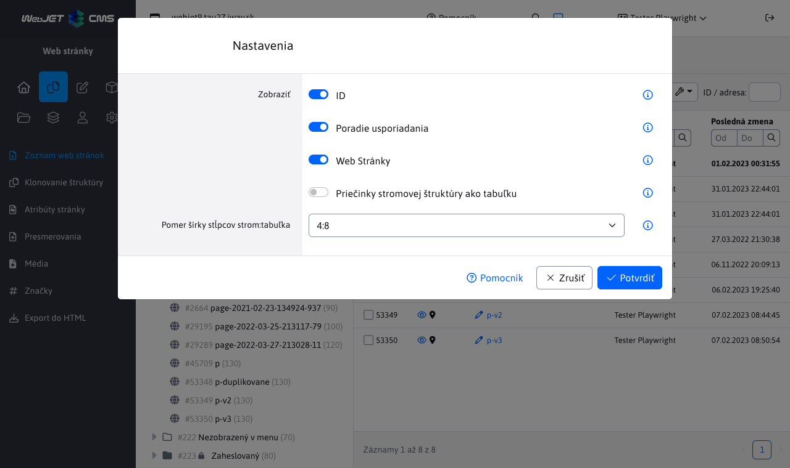

- Upravené získanie [zoznamu CSS štýlov pre výberové pole v editore](frontend/examples/template-bare/README.md#zoznam-štýlov-pre-editor) - ak je v šablóne nastavený minifikovaný CSS súbor hľadá sa jeho ne-minifikovaná verzia. Zároveň pri čítaní CSS súboru sa skončí prehľadávanie po nájdení ```@media``` výrazu, čo typicky pri vložení ```bootstrap``` na začiatok znamená, že sa nenájdu žiadne štýly. Nový kód prehľadáva CSS súbor ešte raz a hľadá komentár ```/* editor */```. Ak sa nájde použije sa definícia z predchádzajúceho riadku (#39751-35).


- V editore stránok v karte Šablóna do zoznamu pre voľné objekty pridané aj stránky pre menu (pôvodne sa zobrazoval len zoznam pre hlavičky a pätičky) (#39751-36).
- Ak má stránka nastavenú možnosť "Automaticky generovať URL adresu z názvu položky v menu" a už existuje stránka s rovnakou URL adresou/názvom (napr. v koši) zobrazí sa hlásenie "Zadaná virtuálna cesta je už použitá na stránke" len pri vytvorení stránky, následne sa bude používať adresa s poradovým číslom na konci.
- Karty Systém a Kôš sa nezobrazia ak používateľ nemá právo na niektorý priečinok, alebo stránku v týchto kartách (#39751-39).
- Doplnené zobrazenie priečinkov v stromovej štruktúre podľa práv na konkrétne stránky. V zozname stránok sa v priečinku následne zobrazia len stránky, na ktoré má používateľ práva (#39751-39).
- V karte [História](redactor/webpages/history.md) sa zobrazuje dátum plánovaného publikovania stránky, zmenené usporiadanie záznamov tak, aby plánované udalosti boli na začiatku zoznamu (#54513-15).
- História - pridaná možnosť zmazať naplánovanú zmenu vo web stránke (#54513-15).
- Pridaná [karta Priečinky](redactor/webpages/README.md#karty-web-stránok) do datatabuľky. Umožňuje využívať funkcie datatabuľky ako hromadné operácie, úprava bunky, duplikovať aj na stromovú štruktúru priečinkov (#54797).


- Zapamätanie naposledy otvoreného priečinka - zoznam web stránok si vrámci jedného prihlásenia pamätá naposledy otvorený priečinok, pri návrate na zoznam web stránok sa priečinok znova otvorí (#39751-45).

### AB testovanie

- Pridaná možnosť vytvoriť B verziu stránky pre aplikáciu AB testovanie
- Vytvorená [dokumentácia pre redaktora](redactor/apps/abtesting/README.md).

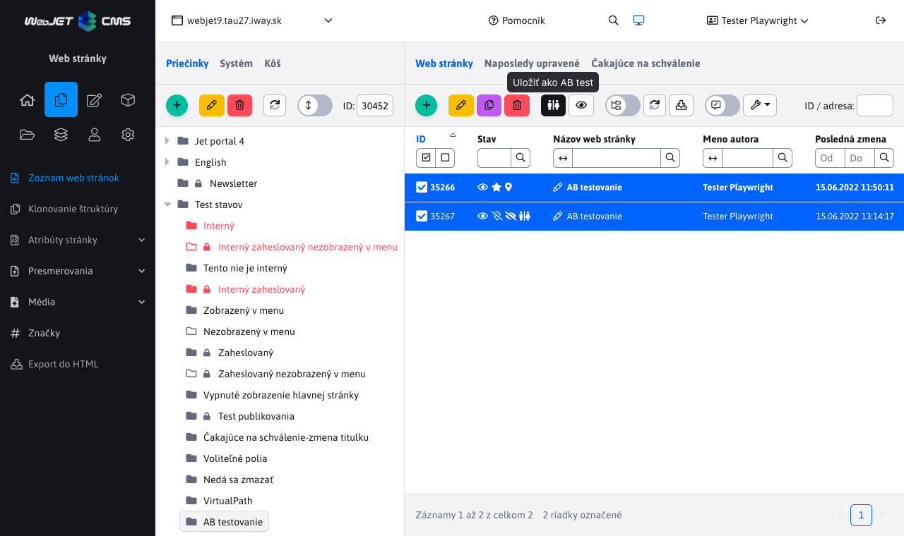

### Šablóny

- [Thymeleaf šablónam](frontend/thymeleaf/tags.md#vykonanie-include-značky) pridaná možnosť zachovať obaľovací element nastavením atribútu ```data-iwcm-remove``` pre zachovanie štruktúry zhodnej s prototypovaním a možnosťou použitia elementov ako ```header, article, footer```.
- Upravený editor šablón a skupín šablón - lepšie rozdelenie polí do kariet.
- Skupiny šablón - doplnený prepínač jazyka Metadát, opravené nastavenie českých prekladov, opravené nastavenie poľa ```Generator``` (#39751).

### Formulár ľahko

- Pridaná možnosť zobraziť jednotlivé polia v riadku (čiže polia sú zobrazené vedľa seba, nie pod sebou). Pridané pole Nový riadok pre vytvorenie nového riadku a Prázdna bunka pre vloženie prázdneho priestoru do riadku. Poliam v riadku sa automaticky rovnakým dielom prerozdelí priestor v riadku.
- Ak je zadané pole Zástupný text ale pole Hodnota je prázdne, tak sa nad poľom nezobrazí názov poľa, zobrazený je len zástupný text. Umožňuje to vytvoriť formulár, ktorý zaberá menší priestor.

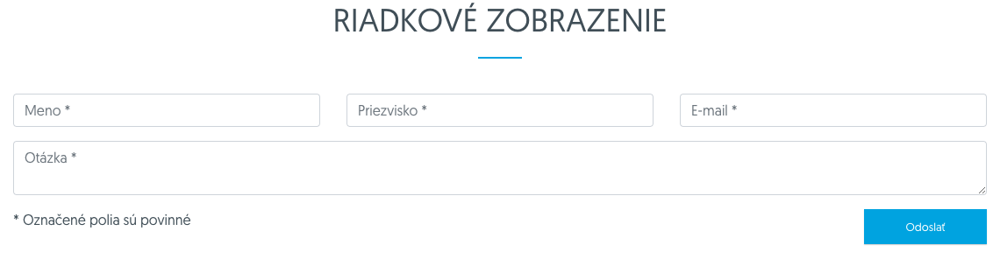

- Pridaná možnosť [vytvárať skupiny polí](redactor/apps/formsimple/README.md#Položky), napr. výberové polia a zaškrtávacie polia. Ako rozdeľovač sa používa znak ```|```, alebo znak ```,``` alebo medzera. Znak ```|``` je potrebné použiť ak jedna z možností má obsahovať čiarku.


- Pridaný ty poľa Výberový zoznam - select, jednotlivé hodnoty sa oddeľujú znakom ```,```, je možné zadať rozdielny text a hodnotu vo forme ```Pomaranč:orange,Jablko:apple```.

### Formuláre

- Upravené filtrovanie dát pre možnosť vyhľadávania vo všetkých stĺpcoch (pôvodná varianta neumožňovala hľadať v ľubovoľnom stĺpci).
- Rozšírené [možnosti exportu](redactor/apps/form/README.md) - pridaná možnosť exportovať vyfiltrované dáta, zatiaľ neexportované a aj označené riadky (#54513).

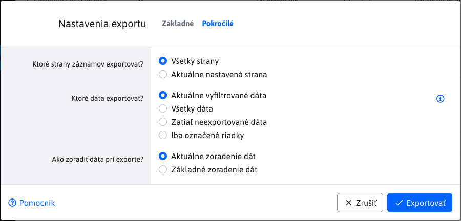

- Náhľad vyplneného formulára sa pre označený jeden riadok zobrazí v dialógovom okne. Ak je označených viac riadkov zobrazí sa každý formulár v novej karte pre jednoduchšie porovnanie (#39751-40).

### GDPR

- Cookie Manažér - upravené štýly pre štandard Bootstrap, tlačidlá zmenené z odkazu na štandardné tlačidlo, aby nekolidovali farby odkazu a tlačidla v pätičke (#54345).
- Vyhľadávanie - doplnené odkazy na zobrazenie detailu nájdeného záznamu (#54513).
- GDPR Cookies - pridaná možnosť zobraziť cookies lištu v zadanom jazyku, ten nastavíte parametrom ```lng``` (#39751).

### Hromadný e-mail

Aplikácia prerobená do nového vizuálu. Pridaná možnosť nastavenia začiatku odosielania kampane. Import príjemcov je možný z ```xlsx``` formátu, výberom skupiny používateľov, alebo zadaním emailových adries.

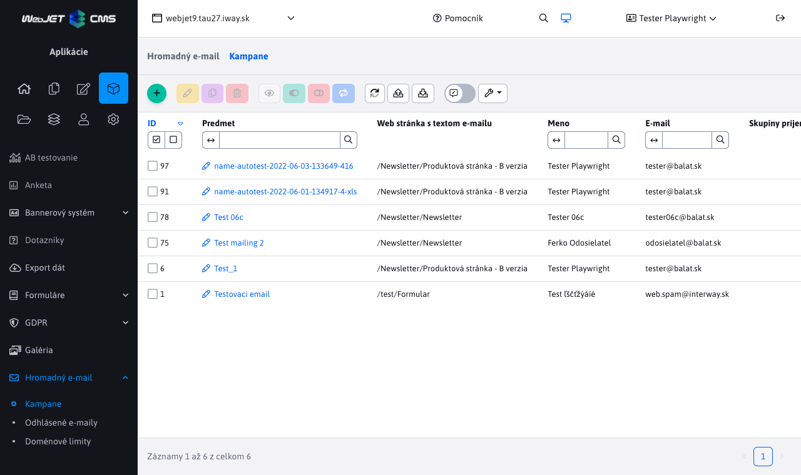

- Pridaný jednoduchší formulár pre registráciu do hromadného emailu (zobrazuje len pole pre zadanie emailovej adresy). Registruje do všetkých emailových skupín, ktoré majú zapnutú možnosť ```Povoliť pridávanie/odoberanie zo skupiny samotným používateľom``` a ```Vyžadovať potvrdenie e-mailovej adresy```. Neobsahuje ani ```captcha``` element, preto je vyžadované zapnuté potvrdenie e-mailovej adresy. Formulár využíva ```Bootstrap v5``` pre zobrazenie formuláru a dialógového okna.
- Vytvorená dokumentácia s opisom fungovania [odosielania hromadných emailov](redactor/apps/dmail/campaings/how-sender-works.md).
- Do editora pridaná karta Náhľad so zobrazením zvolenej stránky emailu. Ak stránka používa inline editáciu/PageBuilder, je možné ju aj upravovať (#39751-44).

### Kalendár udalostí

- Zoznam udalostí prerobený do nového vizuálu a datatabuliek. Pripravený [manuál pre redaktora](redactor/apps/calendar/README.md) (#54473).
- Konfigurácia typov udalostí prerobená do nového vizuálu a datatabuliek. Pripravený [manuál pre redaktora](redactor/apps/calendar/calendar-types/README.md)  (#54473).

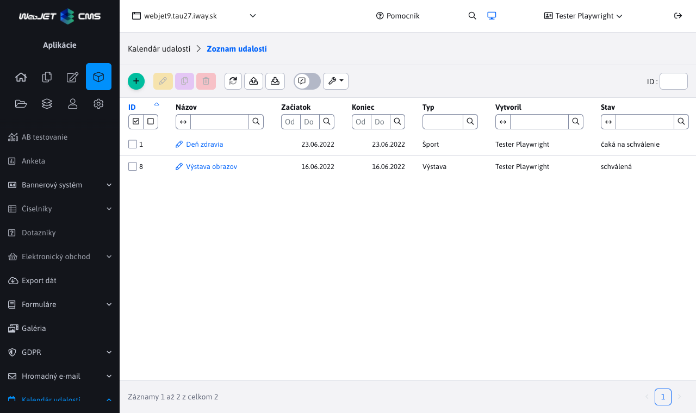

### Používatelia

- V zozname skupín používateľov v editore doplnená karta Používatelia so zoznamom používateľov v editovanej skupine (#54493).
- V zozname skupín používateľov upravené načítanie zoznamu web stránok na serverové stránkovanie (#54493).
- V zozname používateľov je možné filtrovanie podľa skupín používateľov (#54493).

### Vyhľadávanie

- ```Lucene``` - upravené indexovanie - indexuje sa titulok stránky s váhou 20 (pričom titulok sa indexuje v pôvodnom tvare aj v základnom cez ```Lemmas```), zo stránky sa získajú všetky nadpisy a použijú sa s váhou 10. Pre zobrazenie výsledkov je potrebné nastaviť ```orderType="score"```, ktoré následne zoradí výsledky podľa dosiahnutého počtu bodov.
- ```Lucene``` - upravené vyhľadávanie - zadaný text sa najskôr prevedie do základného tvaru (tzv. ```Lemmas```) a až následne sa vyhľadáva.

### Datatabuľky

- Výberové pole s možnosťou editácie - zväčšená veľkosť okna editácie na rovnakú veľkosť ako má editácia web stránky pre lepšie responzívne zobrazenie (napr. pri úprave hlavičky z editácie šablóny) (#54345).
- Pridaná možnosť importu a exportu aj z vnorených tabuliek (korektne sa zobrazí ponad otvorené okno editora so správnym zatemnením) (#54377).
- Pridaná metóda pre aplikovanie špecifických parametrov hľadania aj pri [prvom (kompletnom) načítaní tabuľky](developer/datatables/restcontroller.md#filtrovanie-pri-zobrazení-všetkých-záznamov) (volá ```addSpecSearch``` pri volaní ```getAll```). Stačí vo vašej implementácii ```getAll``` volať metódu ```getAllItemsIncludeSpecSearch``` (#54493).
- Pridaná možnosť exportovať údaje aj vo formáte ```CSV``` (#54513).
- Pridaný typ poľa [MULTISELECT](developer/datatables-editor/standard-fields.md) (#54273).
- Upravená veľkosť stĺpca Stav, tak aby zbytočne nezaberal šírku tabuľky (#54273-26).
- Doplnené popisky ikony na maximalizovanie okna editora, doplnené tlačidlo na zatvorenie okna v hlavičke (#54273-26).
- Doplnené dynamické počítanie počtu riadkov na stranu podľa veľkosti okna prehliadača (#54273-26).

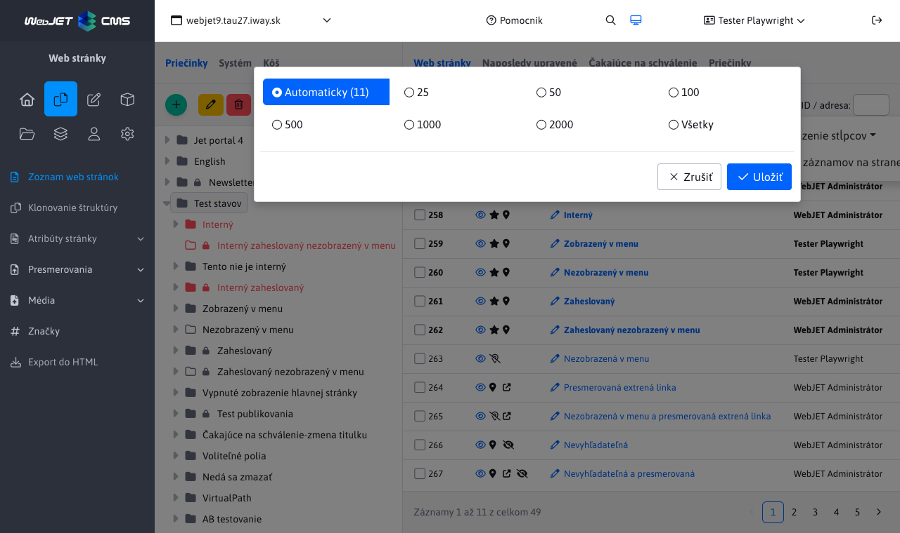

- Pridaná [klávesová skratka](redactor/datatables/README.md#klávesové-skratky) ```CTRL+S/CMD+S```, ktorá vykoná uloženie záznamu do databázy, ale zároveň ponechá otvorené okno editora (#54273-26).
- Import - pri chybe importu sa v chybovej správe zobrazí číslo riadku a aj podrobný zoznam chýb (#39751-39).
- Doplnená možnosť ```tab.hideOnCreate``` a ```tab.hideOnEdit``` pre schovanie [karty v editore](developer/datatables-editor/README.md#karty-v-editore) pre nový záznam a editáciu existujúceho záznamu (#54749).
- Doplnený [názov editovanej položky](redactor/datatables/README.md#zobrazenie-názvu-v-hlavičke-okna) v hlavičke editora a zoznam položiek v dialógovom okne potvrdenia zmazania (#54753).


- Zlepšená jednotnosť vizuálu starých tabuliek generovaných cez ```displaytag``` a cez staršiu verziu ```DataTables```. Stránkovanie je posunuté napravo, riadkovanie a prechod myšou ponad riadky je (#39751-42).
- Pridaná možnosť nastaviť kartu na [plnú výšku okna editora](developer/datatables-editor/README.md#karty-v-editore) (#39751-42).
- Pridaná možnosť [presúvať okno](redactor/datatables/README.md#možnosť-presúvať-okno) editora (#54513-21).
- Pridané zapamätanie [poradia stĺpcov a spôsobu usporiadania](redactor/datatables/README.md#pamätanie-usporiadania) tabuľky (#54513-22).

### Jazykové mutácie

- Opravené načítanie administrácie v inom ako slovenskom jazyku.
- Prehľadané stránky na výskyt statických textov bez prekladov, texty nahradené prekladovými kľúčmi.
- Doplnené preklady pre češtinu a angličtinu.
- Pridaná možnosť použitia parametrov pre použitie prekladových [kľúčov v JavaScript súboroch](developer/frameworks/jstranslate.md#frontend-knižnica).

### Bezpečnosť

- Aktualizované knižnice spring na 5.6.5 a thymeleaf na 3.0.15.
- Zmenený algoritmus ```hashovania``` [hesiel na bcrypt](sysadmin/pentests/README.md#algoritmus-hashovania-hesiel).
- Doplnená [kontrola práv pri zobrazení stránky](developer/frameworks/thymeleaf.md#kontrola-práv) v administrácii (pôvodne sa kontrolovalo len volanie REST služby). Založené je na vyhľadaní URL adresy v menu a následnom získaní práva pre danú URL adresu. To sa následne overí s právami prihláseného používateľa (#54649).
- Pri [teste datatabuliek](developer/testing/datatable.md#testovanie-práv) je povinné zadanie možnosti ```perms``` pre testovanie práv.
- Volanie skriptu ```/admin/mem.jsp``` je povolené len pre IP adresy nastavené v konf. premennej ```serverMonitoringEnableIPs```. Pôvodne bol skript dostupný vždy (používal sa na základné monitorovanie), ale zobrazuje potencionálne citlivé údaje.
- Doplnená dokumentácia [Bezpečnostné testy pre prevádzku](sysadmin/pentests/README.md) o ďalšie riešenia bezpečnostných nálezov a nastavenia pre nezobrazenie podrobnej chyby a verzie ```Apache Tomcat```  (#43144).
- Zrušená možnosť priamo zobraziť JSP komponentu ```/components/user/logon.jsp```. Pri prístupe k zaheslovanému súboru sa už nevykoná presmerovanie na ```logon.jsp```, ale sa vykoná vnútorný ```forward```, čiže URL adresa zostane pôvodná. V prípade potreby odporúčame použiť konf. premennú ```fileAccessDeniedDocId``` na nastavenie ID stránky pre zobrazenie prihlásenia pri prístupe k súboru a nastaviť korektne ID stránky pre prihlásenie priečinkom web stránok (#43144).
- Upravené presmerovanie pri použití znakov ```//``` v URL adrese - zachová sa doména aj port (nepoužije sa absolútna adresa aj s doménou) (#43144).
- Diskusia/Fórum - AJAX volanie ```/components/forum/new.jsp``` je možné len po zobrazení diskusného fóra, nie je túto stránku možné volať, ak web neobsahuje diskusiu (#43144).
- Upravené volanie ```/topdf``` aby v prípade nenájdenej stránky zobrazilo chybu 404 namiesto prázdneho PDF, ošetrené aj presmerovanie stránky (#43144).
- Odstránená stará verzia ```jquery.cookie.js``` v aplikácii GDPR - nahradená verziou v ```_common``` adresári (#43144).
- Aktualizovaná knižnice Spring na verziu ```5.3.+```, ```Amazon AWS``` na 1.12.+ a ```Jquery UI``` na 1.13.2 (#546734).
- Aktualizované ```Vue.js``` z verzie 2.6 na verziu 3.2.37, ```vue-router``` na verziu 4.1 a ```vue-advanced-cropper``` na 2.8.
- Aktualizované všetky JavaScript knižnice pre ```/admin/v9/``` (#54721-3).
- Aktualizovaný FontAwesome (ikony) na verziu 6 (#54721-3).


- Všetky chybové výpisy ```Stack Trace``` presmerované zo štandardného výstupu cez ```Logger```. Zobrazia sa teda aj v zozname [Posledných logov](sysadmin/audit/memory-logging.md) v sekcii Audit (#54269).
- Pridaná možnosť generovať HTTP hlavičku ```Access-Control-Allow-Origin```, nastavuje sa v konf. premenných ```accessControlAllowOriginValue a accessControlAllowOriginUrls```. Predvolene sa hlavička generuje pre URL začínajúce na ```/rest/,/private/rest/,/admin/rest/```.
- Aktualizovaná knižnica ```org.json``` na 20220924.

### Iné drobné zmeny

- Bannerový systém - doplnená možnosť filtrovania bannera podľa zobraziteľný - kontroluje nielen možnosť aktívny, ale aj obmedzenia na počet zobrazení/kliknutí a dátumové obmedzenia (#39751-44).
- Bannerový systém - doplnené tlačidlo na zobrazenie štatistiky bannera, doplnená karta so štatistikou do editora (#39751-44).
- Hromadný email - pri získaní HTML kódu hromadného emailu sa do stránky nebude vkladať jQuery, ktoré je pre emailovú verziu zbytočné.
- Optimalizácia výkonu - optimalizované načítanie zoznamu šablón - upravené získanie skupiny šablón, dáta jednotlivých objektov (stránok) sa načítajú dynamicky až v prípade ich potreby (#53273).
- Otázky a odpovede - pridaná SPAM kontrola a možnosť zobrazenia Captcha obrázku (pridaním hodnoty ```,qa``` do konf. premennej ```captchaComponents```). Nekontroluje sa pokiaľ je prihlásený administrátor.
- Vyhľadávanie v administrácii - vyhľadávanie po kliknutí na meno stránky otvorí editor v novom okne (pôvodne otváral v popup okne starú verziu editora) (#39751-44).
- Úvod - doplnené preklady sekcie Aplikácie upravené pre WebJET a Novinky vo WebJETe. Zoznam noviniek je čítaný z externého servera a aktualizuje sa teda aj bez aktualizácie samotného WebJETu. Používatelia tak môžu vidieť zoznam zmien aj vo verzii, ktorú ešte nemajú nasadenú (#39751-45).

### Dokumentácia

- Vytvorená dokumentácia [ukážkovej Bare šablóny](frontend/examples/template-bare/README.md) pre frontend programátora.
- Vytvorená dokumentácia pre redaktora - [Hromadný email kampane](redactor/apps/dmail/campaings/README.MD) a [Formulár pre prihlásenie](redactor/apps/dmail/form/README.md).
- Vytvorená dokumentácia s opisom fungovania [odosielania hromadných emailov](redactor/apps/dmail/campaings/how-sender-works.md).
- Vytvorená dokumentácia pre redaktora pre aplikáciu [zoznam formulárov](redactor/apps/form/README.md).
- Vytvorená dokumentácia k [náhľadu kompletnej web stránky](redactor/webpages/editor.md#náhľad-stránky) bez jej uloženia pre redaktora a aj pre [programátora](developer/apps/webpages/README.md#náhľad-stránky).
- Vytvorená dokumentácia k použitiu [špecifického JavaScript](developer/frameworks/README.md#webpack) súboru pre vkladanie do pug súboru.
- Doplnená dokumentácia pre možnosť pridania tlačidla do [editora datatabuľky](developer/datatables-editor/README.md#Špeciálne-tlačidlá).
- Vytvorená dokumentácia pre redaktora pre aplikáciu [AB testovanie](redactor/apps/abtesting/README.md).
- Vytvorená dokumentácia pre programátora na použitie [perzistentných nastavení používateľa](developer/frameworks/webjetjs.md#perzistentné-nastavenia-používateľa)
- Vytvorená dokumentácia pre redaktora k aplikácii Kalendár udalostí - [Zoznam udalostí](redactor/apps/calendar/README.md) a [Konfigurácia typov udalostí](redactor/apps/calendar/calendar-types/README.md) (#54473).
- Vytvorená dokumentácia pre programátora so zoznamom [typov polí pre DataTables editor](developer/datatables-editor/standard-fields.md) (#54273).
- Pridaná dokumentácia pre web dizajnéra s opisom spôsobu [pridania štýlov do výberového poľa v editore](frontend/examples/template-bare/README.md#zoznam-štýlov-pre-editor) (#39751-35).
- Vytvorená ukážka a dokumentácia [nahratia súboru](custom-apps/spring-mvc/admin-with-upload.md) a [importu z Excelu](custom-apps/spring-mvc/admin-excel-import.md) pre programátora zákazníckych aplikácií (#54449).
- Doplnená dokumentácia [Bezpečnostné testy pre prevádzku](sysadmin/pentests/README.md) o ďalšie riešenia bezpečnostných nálezov a nastavenia pre nezobrazenie podrobnej chyby a verzie ```Apache Tomcat``` (#43144).
- Odkaz Pomocník v administrácii smerovaný na hlavnú stránku dokumentácie, alebo na špecifickú stránku (ak už existuje) namiesto smerovania do starej dokumentácie pre verziu 8 (#39751-40).
- Vytvorená dokumentácia Audit s [opisom typov auditných záznamov](sysadmin/audit/README.md) pre prevádzku (#54269).
- Doplnená dokumentácia pre programátora o [použití validácie polí](developer/datatables-editor/datatable-columns.md#validácie) (#54597).
- Doplnená dokumentácia pre redaktora - [Web stránky - karty web stránok](redactor/webpages/README.md#karty-web-stránok) (#54797).
- Doplnená dokumentácia pre nastavenie [bezpečnostných HTTP hlavičiek](sysadmin/pentests/README.md#http-hlavičky).

### Testovanie

- Upravené automatizované testovanie datatabuľky - po zmazaní záznamu je tabuľka obnovená a znova je skontrolované, či sa záznam zmazal (ak nastala napr. chyba zmazania v cache) (#54513).
- Vytvorený test nastavenia zobrazenia stromovej štruktúry ```jstreesettings.js``` (#54513).
- Skripty - doplnený test kontroly vkladania skriptov do stránky podľa podmienok štruktúry aj dátumov (#39751).
- Skupiny šablón - doplnený test ukladania a zobrazenia metadát v stránke, overenie ukladania podľa jazykovej mutácie (#39751).
- Page Builder - vytvorený test prepínania a režimu Page Builder a Štandardný (#39751).
- Datatabuľka - pridaný test maximalizácie okna, jeho zatvorenia kliknutím na ikonu v hlavičke a dynamického výpočtu počtu riadkov na strane (#54273-16).
- Web stránky - pridaný test ukladania stránky klávesovou skratkou CTRL+s/CMS+s (#54273-16).
- Pri [teste datatabuliek](developer/testing/datatable.md#testovanie-práv) je povinné zadanie možnosti ```perms``` pre testovanie práv.
- Kontrola práv na súbor - pridaný test ```links.js``` pre overenie zadávania prihlasovacích údajov pri prístupe k súboru v základnej verzii aj so zobrazením peknej prihlasovacej stránky.
- Doplnené testy zobrazenia médií (```media.js```) na web stránke vrátane testov dátumov zmeny web stránky (#54689).
- Aktualizovaný ```CodeceptJS``` na verziu ```3.3.5```, Chromium na verziu 105, Firefox na verziu 103 (#54721-4).
- Doplnený test kontroly práv editácie konf. premenných (obmedzené práva) (#54749).

### Oprava chýb

- Výberové pole s možnosťou editácie - opravené zatvorenie okna pri editácii hlavičky zo šablóny kde je otvorené tretie okno napr. pre editáciu médií  (#54345).
- Zlepšené nastavenie veľkosti ckeditora pri zobrazení z výberového poľa s možnosťou editácie (#54345).
- Opravené načítanie prekladových súborov v inom ako SK jazyku.
- Opravená funkcia reštartovania WebJETu kliknutím na menu v Ovládací panel.
- Opravené vyhľadávanie vo vnorenej datatabuľke - po zadaní výrazu a stlačení klávesy Enter sa nespustilo vyhľadávanie ale sa označili všetky riadky (#54493).
- V hlavnom menu v sekcii Aplikácie opravené usporiadanie podľa abecedy (korektne spracuje aj diakritiku) (#53273).
- Šablóny - opravené získanie aktuálne nastavenej HTML šablóny pri editácii. Aj ak neexistuje na disku zachová sa v zozname dostupných HTML šablón (#53273).
- Šablóny - opravené nastavenie ID prázdnej stránky v šablóne (chybne sa nastavovalo -2, ktoré sa používa vo web stránkach namiesto hodnoty -1) (#53273).
- Monitorovanie servera - opravený tooltip veľkosti miesta na disku (#54513).
- Skripty - upravené zobrazenie karty Skript aby bolo jasné, že obsahuje textovú oblasť (#54513).
- Šablóny - opravené obnovenie ```cache``` pamäte po zmazaní šablóny.
- PageBuilder - doplnené odstránenie CSS tried a HTML kódu PageBuilder ak je kód nekorektný (napr. vnorené ```div.section``` do ```div.section```), alebo zostal otvorený niektorý nástroj (napr. nastavenie šírky stĺpca) (#39751).
- Skripty - opravené vkladanie skriptov do stránky, ktoré nemajú nastavené obmedzenia (#39751).
- Firefox - doplnené držanie pozície okna pri kliknutí na aplikáciu v editore v režime Page Builder (Firefox chybne posunul okno na úplný spodok, alebo na miesto kde je kurzor) (#39751).
- Web stránky - opravené zacyklenie otvorenia web stránky ak je hodnota ```domainName``` ```NULL``` (#39751).
- Galéria - opravená možnosť zatvoriť dialóg nahrávania súborov, opravená chyba uloženia obrázka, kedy sa aj po kliknutí na zrušiť uložila zmena v editore (#39751).
- Galéria - opravené duplikovanie záznamu - korektne sa skopíruje aj súbor/fotografia. Meno sa nastaví podľa názvu v karte Popis, alebo sa testuje existencia súboru pridaním čísla 1-100 na koniec mena súboru.
- Web stránky - doplnené obnovenie stromovej štruktúry ak sú zobrazené aj web stránky pri zmene názvu, poradia, stavu zobrazenia, priečinku a externého odkazu (#39751).
- Web stránky / datatabuľky - opravená editácia viacerých záznamov naraz - ```fetch``` zo servera sa pôvodne vykonal len na prvý záznam, opravené aby sa vykonal na všetky označené záznamy. Chyba spôsobila pri editácii viacerých web stránok uloženie textu ```data not loaded``` do tela web stránky (#39751-36).
- Mapa stránok - opravené zobrazenie ```/sitemap.xml``` (#54637).
- Web stránky - doplnené API funkcie ```openLinkDialogWindow``` a ```openImageDialogWindow``` z verzie 8 pre otvorenie dialógu výberu odkazu/obrázku, napr. v dialógu tlačidla (#39751).
- Bannery - opravená chyba nastavenia ```domainId``` pri jedno doménovej inštalácií podľa kompatibility s verziou 8 (#54645).
- Bannery - opravená chyba hľadania podľa aktívnosti bannera (#39751-44).
- Média - opravené nastavenie práv pre zobrazenie aplikácie Média v editore stránok (#39751).
- Média - pri editácii cez Správa všetkých médií zostane zachovaný dátum poslednej zmeny média aby sa naďalej zobrazovalo na web stránke (typicky sa média zobrazia len staršie ako dátum posledného uloženia priradenej web stránky). Pri novom médiu sa nastaví dátum a čas na dátum a čas posledného uloženia zadanej web stránky (#54689).
- Video prehrávač - pridaná podpora ```Bootstrap 5``` - nastavenie CSS štýlu ```ratio ratio-16x9``` pre korektný pomer strán zobrazeného videa (#39751-39).
- Datatabuľky - pri maximalizácii okna sa následne aj potvrdenie zmazania zobrazovalo maximalizované, čo nevyzeralo dobre. Upravené tak, aby pri zobrazení potvrdenia zmazania záznamu sa maximalizovanie zrušilo (#39751-39).
- Page Builder - opravené nastavenie šablóny pri vytvorení novej stránky - nastaví sa podľa šablóny priečinka nie podľa šablóny hlavnej stránky (#39751-39).
- Web stránky - opravené otvorenie stránky po zadaní jej ID v Systém priečinku pri zapnutom nastavení ```templatesUseRecursiveSystemFolder=true``` (#54513-16).
- Datatabuľky - opravená editácia bunky po presune stĺpca (#54513-16).
- Web stránky - opravené zobrazenie mena autora v datatabuľke po editácii stránky (#54753).
- Web stránky - opravené vyhľadávanie podľa perex skupiny (#39751-42).
- Galéria - opravené usporiadanie položiek v stromovej štruktúre podľa abecedy (#39751-43).
- Galéria - opravené nastavenie veľkosti editora obrázkov a oblasti záujmu pri maximalizovaní okna, zlepšená podpora pri úprave veľkých fotografií (posun fotky v okne) (#39751-43).
- Galéria - opravená editácia viac riadkového textu perexu/anotácie (#39751-44).
- Cluster - opravené mazanie cache objektov volaním ```Cache.getInstance().removeObjectStartsWithName``` - do clustra sa zapíše priamo požiadavka na mazanie začínajúca na namiesto presného zoznamu (ktorý môže byť na jednotlivých nodoch rozdielny) (#54273-32).
- Hromadný email - opravené prvotné nastavenie príjemcov, počet príjemcov a odoslaných emailov pri uložení kampane, ne-odstránenie emailov ak je používateľ v zvolenej aj odstránenej skupine (#39751-44).
- Datatabuľka - opravené vyhľadávanie po zmene poradia stĺpcov (#43144).


## 2022.18

> Verzia 2022.18 pridáva integráciu nástroja PageBuilder do web stránok, možnosť používať dizajnové šablóny písané vo frameworku Thymeleaf, zobrazenie posledných správ v logoch, mnohé zlepšenia použiteľnosti na základe pripomienok používateľov, prerobené aplikácie Formuláre - regulárne výrazy, Hromadný email - odhlásené emaily. Na úvodnú stránku pridané mini aplikácie Záložky a spätná väzba.

<div class="video-container">
    <iframe width="560" height="315" src="https://www.youtube.com/embed/6IPrdHvhYrc" title="YouTube video player" frameborder="0" allow="accelerometer; autoplay; clipboard-write; encrypted-media; gyroscope; picture-in-picture" allowfullscreen></iframe>
</div>

**PageBuilder**

Do editora web stránok je integrovaný Page Builder. V tomto režime nie je editovaná celá stránka ale len jej vybrané časti. Page Builder oddeľuje editáciu textov/obrázkov a štruktúry stránok. Nestane sa tak to, že omylom zmažete štrukturálne elementy web stránky pri editácii jej textu (#54349).

Pre novo vytvárané šablóny odporúčame pripraviť a používať bloky pre Page Builder namiesto pôvodných HTML blokov. Zaručíte tak lepšiu a jednoduchšiu editáciu komplexných stránok. Režim Page Builder je potrebné nastaviť a povoliť v skupine šablón.

Vytvorená je dokumentácia pre [redaktora](redactor/webpages/pagebuilder.md), [web dizajnéra](frontend/page-builder/README.md) aj [programátora](developer/apps/webpages/pagebuilder.md).


- Pridaná možnosť generovať náhodné ID pri vložení bloku do stránky zadaním hodnoty ```__ID__``` do kódu bloku (#54345).
- Pridaná možnosť neoznačiť sekciu nastavením CSS triedy ```pb-not-section```, kontajner nastavením ```pb-not-container``` a stĺpec nastavením ```pb-not-column``` (#54345).

**Web stránky**

Pridaná možnosť zobrazovať [akčné tlačidlá](developer/datatables-editor/notify.md) v notifikácii. Napr. ak existuje pracovná verzia stránky zobrazí sa tlačidlo pre otvorenie poslednej pracovnej verzie stránky. Redaktor tak nemusí prechádzať do karty História a tam kliknúť na tlačidlo pre editáciu pracovnej verzie (#54375).


Pridaná možnosť priamo pri editácii web stránky alebo šablóny vytvoriť novú hlavičku/pätičku/menu/voľný objekt, ktorá sa použije namiesto verzie zo šablóny alebo editovať existujúcu stránku (napr. ak potrebujete upraviť logo, alebo text v pätičke).


- Vylepšené vytváranie priečinka novej domény. Opravené automatické vytvorenie priečinka ```system``` s pod priečinkami hlavičky, pätičky a menu. Po vytvorení sa obnoví stránka v prehliadači, aby sa nová doména korektne premietla do výberového menu domén v hlavičke. Pridaná API metóda ```EditorFacade.createEmptyWebPage``` pre jednoduché [vytvorenie novej stránky](developer/apps/webpages/api.md).
- Upravená ikona pre výber Nadradeného priečinku a Presmerovania na ikonu kríža. Pôvodná ikona ceruzky evokuje, že daný adresár alebo adresu presmerovania idete upravovať, realita ale je, že vyberáte existujúci adresár (nie editujete/upravujete).
- Zoznam značiek (perex skupín) je usporiadaný podľa abecedy bez ohľadu na veľkosť písma a diakritiku (#53805).
- Pridaná stavová ikona hlavnej stránky (hviezda) možnosť filtrovať web stránky podľa hlavnej stránky (vhodné použitie pri zobrazení web stránok aj z podpriečinkov) (#54381).
- Po kliknutí do poľa ID/adresa sa pole zväčší pre pohodlnejšie písanie mena stránky (#54381).

**Formuláre**

Sekcia regulárne výrazy, cez ktorú sa definujú pravidlá pre kontrolu vyplnenia polí, prerobená do nového dizajnu a datatabuľky.

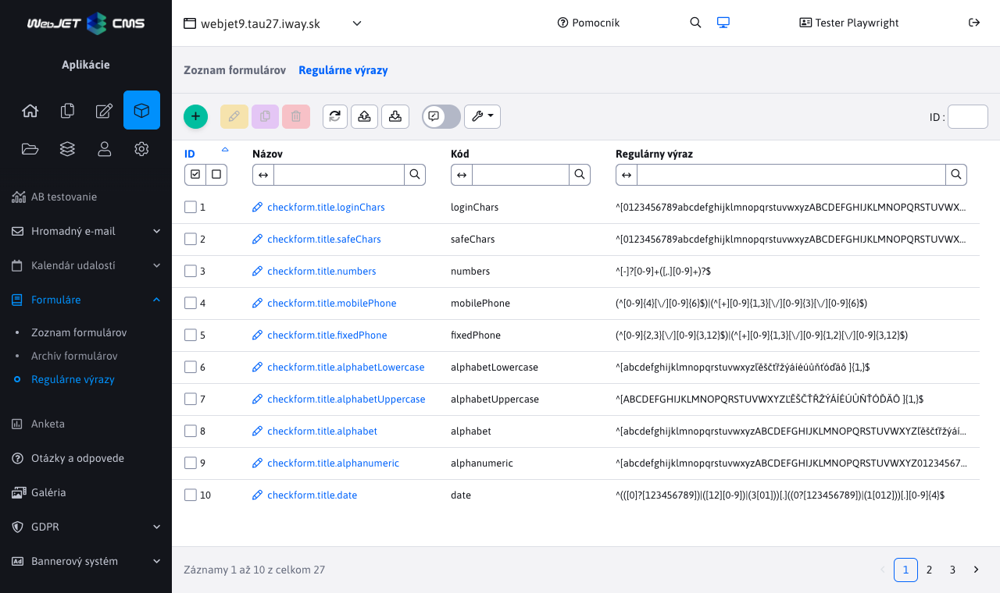

V detaile formuláru pridané:

- Tlačidlo pre zobrazenie náhľadu vyplneného formuláru a ikona "oka" priamo v riadku formuláru pre jednoduché zobrazenie (#54273).
- Zobrazenie odkazu na stiahnutie súborov formuláru.
- Možnosť zadať poznámku k formuláru.
- Zobrazenie údajov prihláseného používateľa (predvolene vypnuté, pre zobrazenie nastavte zobrazenie stĺpcov v tabuľke).
- Evidencia dátumu posledného exportu formulára.
- Dátum posledného vyplnenia formuláru v zozname formulárov, nastavené usporiadanie podľa tohto stĺpca.
- Oddelené zobrazenie formulárov podľa domény (```domainId```).
- Doplnené mazanie záznamu formuláru aj všetkých záznamov (celého formuláru).
- Doplnená kontrola práv podľa ```docId``` (v zozname sa zobrazia len formuláre web stránok, na ktoré má používateľ oprávnenie - kontroluje sa hodnota ```docId``` posledne odoslaného formuláru).

**Formulár ľahko**

- Pridaný typ poľa pre nahratie súborov (ľubovoľný typ súboru), dokumentov (súbory typu .doc,.docx,.xls,.xlsx,.ppt,.pptx,.pdf) a obrázkov (súbory typu .gif,.png,.jpg,.jpeg,.svg) (#54273).
- Pridaná možnosť nastavenia zástupného textu (```placeholder```) pre štandardné textové polia. Umožňujú zobraziť pomocný text v prázdnom poli (napr. formát očakávaného telefónneho čísla 0903xxxyyy) (#54381).

**Šablóny**

- Pridaná možnosť používať [Thymeleaf šablóny](frontend/thymeleaf/README.md) stránok namiesto starých JSP. Prináša to výhodu v lepšej možnosti prototypovania dizajnu priamo v HTML kóde.

```html
<span data-th-text="${docDetails.title}">Titulok stránky</span>
<body data-th-class="${docDetails.fieldA}">
<meta name="author" data-th-content="${ninja.temp.group.author}" />
<link rel="canonical" data-th-href="${ninja.page.url}" />

<div data-iwcm-write="doc_data"/>
<div data-iwcm-write="!INCLUDE(/components/gdpr/gtm_init.jsp)!" />
```

- Menu položka šablóny upravená tak, že priamo obsahuje pod položky Zoznam šablón a Zoznam skupín šablón (položky sú presunuté na prvú uroveň menu).
- Pre lokálny System adresár doplnené hľadanie jazykovej verzie hlavičky/pätičky/menu podľa jazyka adresára. Ak má šablóna nastavenú hlavičku ```SK-Default hlavička``` a adresár nastavený jazyk Anglicky hľadá sa ```EN-Default hlavička``` (na treťom mieste musí byť znak -). Ak existuje, použije sa.

**Automatizované úlohy**

- Doplnená možnosť manuálne spustiť automatizovanú úlohu kliknutím na tlačidlo v datatabuľke (#54273).

**Audit**

Pridaná možnosť ukladať posledné log správy do pamäte servera s jednoduchou možnosťou ich zobrazenia. Podporovaná je aj možnosť načítať log správy z iného uzla clustra (napr. z CMS uzla viete vyžiadať posledné log správy z verejných uzlov).


**Hromadný email**

Prerobená časť odhlásené emaily do datatabuľky, vytvorená [dokumentácia pre redaktora](redactor/apps/dmail/unsubscribed/README.md).

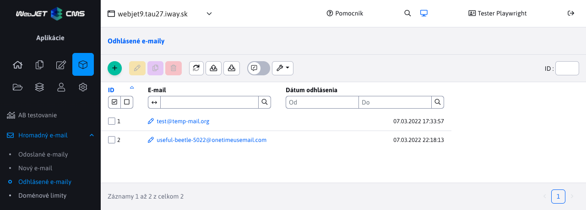

**Prekladové kľúče**

- Pridané tlačidlo pre zmazanie cache pamäte prekladových kľúčov a ich znova načítanie zo súboru a databázy. Vhodné ak zmeníte počas prevádzky prekladový súbor a potrebujete ho znova načítať (#54401).
- Doplnené informačné hlásenie pri pokuse o zmazanie kľúča, ktorý sa nachádza v prekladovom súbore (mazať je možné len upravené kľúče nachádzajúce sa v databáze).
- Opravené usporiadanie kľúčov podľa ID.
- Opravené zobrazenie duplicitných kľúčov, ktoré sa nachádzajú v súbore aj databáze (zobrazí sa upravený kľúč z databázy).

**Aplikácie**

Pridaná možnosť [vložiť aplikáciu do zoznamu aplikácií](custom-apps/appstore/README.md) pomocou Java anotácie ```@WebjetAppStore``` a možnosť nastavenia parametrov aplikácie pomocou anotácií ```@DataTableColumn```. Jednoducho je tak možné bez dodatočného programovania zobraziť aplikáciu v zozname aplikácií, vkladať ju do stránky a upravovať jej parametre (#54333).

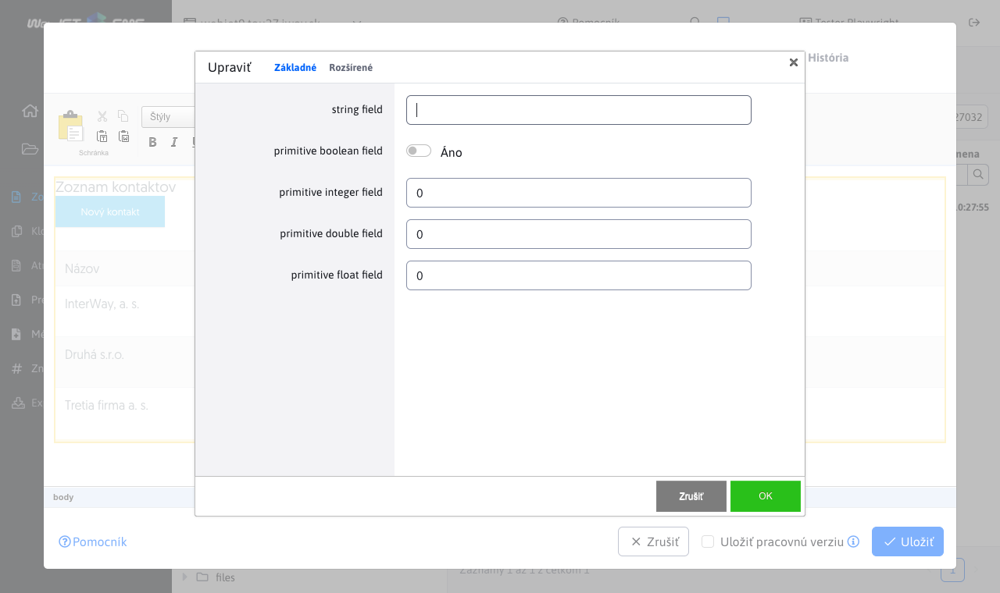

- Zoznam aplikácií je v menu usporiadaný podľa abecedy. Prvé sú aplikácie zákazníka (v súbore ```modinfo.properties``` majú atribút ```custom=true```), nasledujú štandardné aplikácie WebJET CMS (#54381).

**Datatabuľky**

- Pridaná zjednodušená možnosť [nastavenia číselníkov pre select boxy](developer/datatables/restcontroller.md#číselníky-pre-select-boxy) prepísaním metódy ```getOptions(DatatablePageImpl<T> page)```
- Pridaná možnosť [neexportovať vybraný stĺpec](developer/datatables/README.md#exportimport) pomocou nastavenia ```className``` atribútu na hodnotu ```not-export``` (#54273).
- Pridaná možnosť nastavovať [hodnoty výberového poľa](developer/datatables-editor/datatable-columns.md#možnosti-výberového-poľa) volaním Java API metódy alebo hodnotami z aplikácie číselník.
- Opravená editácia bunky ak sa nemá vykonať načítanie záznamu zo servera (podmienka ```fetchOnEdit``` je ```false```).
- Doplnená kontrola duplicít notifikačných správ pri volaní ```DatatableRestControllerV2.addNotify```. Opakovaná rovnaká správa sa zobrazí len raz, kontroluje sa zhoda titulku, textu a typu notifikácie.
- Pridaná kontrola otvoreného okna editora pri opustení stránky. Ak je otvorený zobrazí sa potvrdenie opustenia stránky pri prechode na inú stránku. Nepoužije sa pre používateľa s prihlasovacím menom začínajúcim na ```tester``` (#54413).
- Pole typu Výberové pole s možnosťou editácie umožňuje editovať a pridávať web stránky [aj z kariet Systém a kôš](developer/datatables-editor/field-select-editable.md). Pridané popisy ikon (```tooltip```) a schovanie ikony pre editáciu, pokiaľ je vybraná web stránka s ID menej ako 1.
- Pridaný typ poľa pre výber adresára na súborovom systéme pomocou [typu poľa json](developer/datatables-editor/field-json.md#možnosti-classname) a hodnoty ```className='dt-tree-dir-simple'``` (#54433).
- Pre voliteľné polia typu výberové pole pridaná možnosť [zadať prázdnu hodnotu](frontend/webpages/customfields/README.md#výberové-pole)  (#53805).
- Upravené nastavenie [zobrazených stĺpcov v datatabuľke](redactor/datatables/README.md#nastavenie-zobrazenia-stĺpcov). Zobrazenie je stĺpcové, okrem mena stĺpca obsahuje aj meno karty v editore, prípadný nadpis a pomocný text. Lepšie sa tak dajú identifikovať potrebné stĺpce (#54381).


- Pridaná možnosť maximalizovať dialógové okno editora (#54381).
- Po kliknutí na tlačidlo uložiť v editore sa zobrazí animácia aj priamo na tlačidle (nielen v hornej časti okna) pre jasnejšiu indikáciu (#54381).

**Úvod**

Pridaná [mini aplikácia Záložky](redactor/admin/welcome.md?id=záložky), do ktorej si môžete pridať odkazy na často používané sekcie z WebJET CMS. Po prihlásení tak nemusíte hľadať sekciu v menu, ale priamo v záložkách prejdete do vašej obľúbenej sekcie.


Pridaná [mini aplikácia Spätná väzba](redactor/admin/welcome.md?id=spätná-väzba) cez ktorú môžete poslať vašu pripomienku, komentár alebo pochvalu k WebJET CMS nám programátorom. Vaše pripomienky posúdime a pridáme do [mapy rozvoja](ROADMAP.md). Môžete tak aj vašim názorom zlepšiť fungovanie WebJET CMS.


Pridané výsuvné menu v hlavičke po kliknutí na meno prihláseného používateľa. Obsahuje možnosti:
- Profil - upraviť vlastný profil (meno, email... - po zmene profilu je potrebné sa odhlásiť a znova prihlásiť).
- Dvojstupňové overovanie - možnosť aktivovať dvoj stupňové overovanie pomocou aplikácie ```Google Authenticate``` pri prihlasovaní do administrácie. Zvyšuje sa tak bezpečnosť vášho konta, pretože okrem hesla je pre prihlásenie potrebné zadať aj kód z vášho mobilného zariadenia. Odporúčame nastaviť na všetky kontá, cez ktoré je možné spravovať používateľské účty a práva.
- Správa šifrovacích kľúčov - umožňuje vytvoriť nový šifrovací kľúč pre šifrovanie formulárov a zadať existujúci kľúč pre ich dešifrovanie. Vyžaduje právo Formuláre.
- Odhlásenie - odhlásenie z administrácie.

Aplikácia todo, ktorá zatiaľ nebola implementovaná sa zatiaľ na úvodnej stránke nezobrazuje (#54381).

**Iné zmeny**

- Pridaná možnosť používať [Thymeleaf šablóny](custom-apps/spring-mvc/README.md#frontend) pre Spring MVC aplikácie.
- Menu - aplikácia menu pri nastavení parametra ```classes="bootstrap"``` generuje aj triedy ```nav-item,nav-link,dropdown,dropdown-toggle```.
- Voliteľné polia - pridaná ty poľa pre [výber adresára](frontend/webpages/customfields/README.md#výber-adresára-súborového-systému) na súborovom systéme (#54433).


- Monitorovanie servera - do zoznamu Aktuálne hodnoty v prípade cluster inštalácie pridaný zoznam počtu otvorených session na jednotlivých uzloch (#54453).
- Monitorovanie servera - doplnené mazanie konf. premenných ```statDistinctUsers-``` a ```statSessions-``` z databázy v režime ```cluster auto```. Mažú sa staršie ako 30 minút, čo pokladáme za už nedostupný uzol clustra. Tieto premenné sa už nezobrazujú v zozname konfiguračných premenných, pretože nemá zmysel ich používateľsky meniť.

**Bezpečnosť**

- Doplnené nahradenie špeciálnych znakov HTML v chybových hláseniach za entity, aby nedošlo k vykonaniu HTML kódu v prípade chyby.
- Aktualizovaná verzia Spring z 3.5.15 na 3.5.18 z dôvodu zraniteľnosti [CVE-2022-22965: Spring Framework RCE via Data Binding on JDK 9+](https://spring.io/blog/2022/03/31/spring-framework-rce-early-announcement).
- Aktualizované knižnice ```dom4j``` na 2.1.3, ```jackson-annotations, jackson-core, jackson-databind``` na 2.13.2, ```medatata-extractor``` na 2.17, ```poi``` na 5.2.2, ```mariadb-java-client``` na 2.7.5.
- Aktualizované knižnice ```spring``` na 5.3.19, ```zxcvbn``` na 2.0.1, ```moment``` na 2.29.3.

**Dokumentácia**

- Doplnená dokumentácia pre programovanie zákazníckych aplikácií o nastavenie [Spring](custom-apps/spring-config/README.md) a upravený [príklad datatabuľky](custom-apps/admin-menu-item/README.md) na aplikáciu Kontakty.
- Doplnený príklad pre programovanie [Spring MVC aplikácie](custom-apps/spring-mvc/README.md) (#54273).
- Sprístupnený externý repozitár maven artefaktov WebJET CMS (vyžaduje prístupové údaje) a ukážkový [github repozitár](https://github.com/webjetcms/basecms).
- Doplnená dokumentácia použitia kontroly zraniteľností v knižniciach pre [programátora](developer/backend/security.md#kontrola-zraniteľností-v-knižniciach) aj [prevádzku](sysadmin/dependency-check/README.md).
- Vytvorená dokumentácia k používaniu [Thymeleaf šablón web stránok](frontend/thymeleaf/README.md).
- Vytvorená dokumentácia k Page Builder pre [redaktora](redactor/webpages/pagebuilder.md), [web dizajnéra](frontend/page-builder/README.md) aj [programátora](developer/apps/webpages/pagebuilder.md).
- Vytvorená dokumentácia k možnosti [neexportovať vybraný stĺpec](developer/datatables/README.md#exportimport) datatabuľky (#54273).
- Vytvorená dokumentácia k [úvodnej obrazovke](redactor/admin/welcome.md) pre použitie záložiek a zaslanie spätnej väzby.
- Vytvorená dokumentácia k [odhláseným emailom](redactor/apps/dmail/unsubscribed/README.md) z aplikácie hromadný email.
- Opravené zobrazenie grafov v dokumentácii.
- Vytvorená dokumentácia pre možnosť nastavenia [hodnôt výberového poľa](developer/datatables-editor/datatable-columns.md#možnosti-výberového-poľa) editora datatabuľky pomocou volania API funkcie alebo pomocou vloženia údajov z aplikácie číselník.
- Vytvorená dokumentácia pre [vloženie aplikácie do zoznamu aplikácií](custom-apps/appstore/README.md) pre programátora zákazkových aplikácií.
- Vytvorená sekcia Šablóna v dokumentácii pre redaktora - [Editácia web stránky](redactor/webpages/editor.md).
- Doplnená dokumentácia pre nastavenie voliteľného poľa [typu výber adresára súborového systému](frontend/webpages/customfields/README.md#výber-adresára-súborového-systému).
- Vytvorená dokumentácia [Monitorovanie servera](sysadmin/monitoring/README.md) pre prevádzku (#54453).
- Vytvorená dokumentácia k aplikácii [Formulár ľahko](redactor/apps/formsimple/README.md) (#54831).
- Vytvorená dokumentácia pre redaktora k [nastaveniu zobrazenia stĺpcov](redactor/datatables/README.md#nastavenie-zobrazenia-stĺpcov) v datatabuľke (#54381).

**Testovanie**

- Pridaná možnosť nastaviť hodnotu poľa pre [automatizovaný test datatabuľky](developer/testing/datatable.md#možnosti-nastavenia) cez možnosť ```testingData```. Je to potrebné, ak má pole špecifický formát (napr. email adresa, číslo, limitovaný počet znakov).
- Pridaná autodetekcia [povinného poľa typu email](developer/testing/datatable.md#spôsob-generovania-povinných-polí) (na základe mena poľa obsahujúceho výraz email), pole sa následne korektne vyplní aj s doménovým menom.
- Pridaný test zobrazenia zoznamu aplikácií, vyhľadania podľa mena, vloženie JSP aj Spring aplikácie do stránky a editácie ich parametrov - ```tests/webpages/appstore.js``` (#54333).
- Upravené testy pre beh v prehliadači firefox (#54437).
- Doplnené funkcie ```Browser.isChromium() a Browser.isFirefox()``` pre [detekciu prehliadača](developer/testing/README.md#detekcia-prehliadača) v testoch (#54437).
- Pridaný test nastavenia značiek (perex skupín) pre web stránku (#53805).
- Pridané generovanie reportov cez knižnicu [Allure](developer/testing/allure.md). Zverejnené sú pre [chromium](http://docs.webjetcms.sk/allure/chromium/) aj pre [firefox](http://docs.webjetcms.sk/allure/firefox/) (#54437).

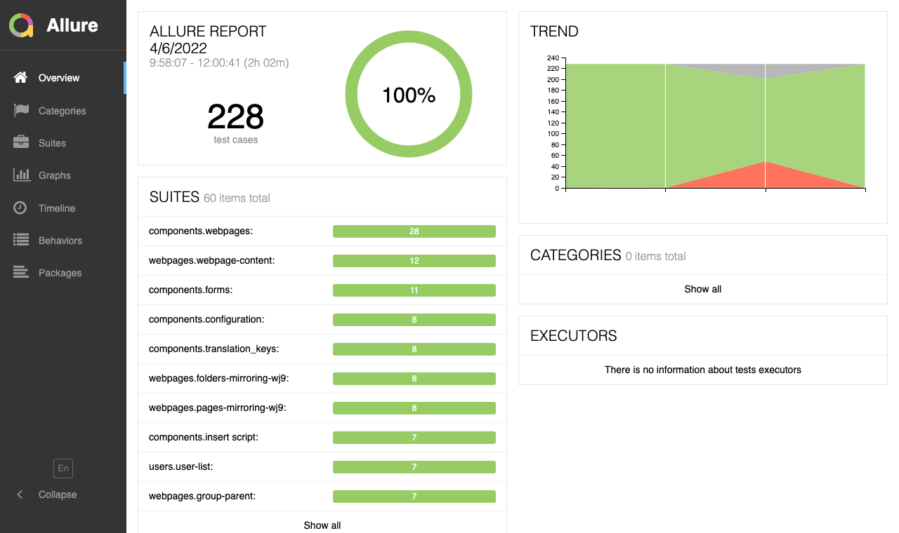

**Oprava chýb**

- Opravené zobrazenie zoznamu formulára (#54274).
- Opravená aplikácia Dotazník - chýbajúci CSRF token (#54274).
- Opravené ukladania nového používateľa v MS SQL a Oracle databáze (#54273).
- Opravené načítanie zmenených textov v Ninja šablóne po uložení skupiny šablón (#54345).
- Ninja - upravené prednastavené polia R-T v stránke v súlade s využitím v Ninja šablóne (#54345).
- Média - opravená kontrola práv ak používateľ nemá oprávnenie správa všetkých médií (#54273).
- Šablóny - opravené duplikovanie šablóny stránok (#54345).
- V starej v8 verzii opravené zobrazenie menu pre pridanie presmerovaní, pridaný odkaz na prepnutie na novú verziu (#53805).
- Úvod - doplnené odkazy na aplikácie v ikonách v prvom bloku (návštevy, formuláre...) (#53805).
- Formuláre - regulárne výrazy - opravené pridanie regulárneho výrazu na MS SQL (#54273).
- Oprava chyby zatvorenia vnoreného dialógového okna (napr. pre výber adresára) po kliknutí na stmavenú časť (#54433).
- Web stránky - opravené nastavenie domény pri zadanom ```groupid``` parametri v URL adrese.
- Mazanie dát - cache objekty - opravené zobrazenie potvrdzovacieho tlačidla pri mazaní.
- Opravené SQL chyby pri vytvorení čistej inštalácie nad Oracle databázou (verzia 19c) (#54457).
- Web stránky - opravená chyba ukladania značiek (perex skupín) (#53805).
- Média - opravené zobrazenie aplikácie Média v zozname aplikácií v editore stránok (#54381).


## 2022.0

> Verzia 2022.0 prináša bezpečnostnú aktualizáciu závislostí Java a JavaScript knižníc.

**Bezpečnosť**

- Aktualizované verzie Java knižníc na novšie verzie, aktualizovaný základný WebJET CMS na verziu 8.9.
- Pridaný nástroj [OWASP Dependency-Check](https://jeremylong.github.io/DependencyCheck/index.html) spúšťaný príkazom ```gradlew dependencyCheckAnalyze``` pre kontrolu zraniteľností v použitých Java a JavaScript knižniciach.
- POZOR: zmena logovania z ```log4j``` na ```logback```. Po aktualizácii overte, že sa úspešne zmazali súbory ```commons-logging-1.1.jar, log4j.jar, slf4j-api-1.5.3.jar``` (aktualizované na verziu 1.7.33), ```slf4j-jcl-1.5.3.jar``` z adresára ```/WEB-INF/lib```.
- Email / SMTP - pridaná možnosť nastaviť verziu ```TLS``` pre odosielanie emailov (pripojenie na SMTP server). Nastavuje sa cez konf. premennú ```smtpTLSVersion```, predvolene nastavené na ```TLSv1.2```.
- Súbory - zrušená funkcia konverzia z Word formátu do PDF (online služba, ktorú sme používali už nefunguje).
- POZOR: odstránená stará knižnica ```commons-httpclient-3.1```, API ```Tools.downloadUrl(String basePath, HttpServletRequest req)``` upravené na použitie v4 knižnice, zrušené metódy ```Tools.proxyUrl```. V aplikácií Proxy zrušená možnosť použitia ```ProxyByHttpClient``` (existujúce verzie použijú ```ProxyByHttpClient4```). Odporúčame použiť knižnicu ```Apache HttpClient Fluent API``` pre špecifické HTTP spojenia (príklady https://hc.apache.org/httpcomponents-client-4.5.x/current/tutorial/html/fluent.html).
- Aktualizovaná sada knižníc ```jQuery UI``` z 1.8.23 na 1.13.1.
- Foto galéria - aktualizovaná knižnica ```jquery.prettyPhoto```, opravená funkčnosť s jQuery v3.
- Zmazané nepoužívané/staré verzie jQuery knižnice, aktualizovaný ```moment.js, jquery-ui.min.js, jquery-ui.css, handlebars.min.js```.
- Aktualizovaná knižnica ```hibernate-validator``` z 6.0.13 na 6.0.22, ```jboss-logging``` na 3.4.3, ```joda-time``` na 2.10.13, ```junit``` na 4.13.2, ```guava``` na 30.1.
- Aktualizovaná knižnica ```velocity``` z 1.7 na 2.3, ```velocity-tools``` z 2.0 na 3.1 a ```commons-lang3``` z 3.3.2 na 3.12
- Aktualizovaná knižnica ```jsoup``` z 1.7.2 na 1.14.3, ```socialauth``` z 4.12 na 4.15 + ```openid4java``` z 0.9.5 na 0.9.6, ```snakeyaml``` z 1.12 na 1.30 ```http-client, http-core``` z 4.5.6 na 4.5.13, ```http-mime``` zmazané (nie je potrebné), ```commons-codec``` z 1.6 na 1.11
- Aktualizovaná knižnica ```standard.jar``` a ```jstl.jar``` z verzie 1.1.2 na 1.2.5 (nahradením za ```taglibs-standard-spec``` a ```taglibs-standard-impl```)
- POZOR: aktualizovaný ```Apache POI``` z 3.14-beta1 na 5.2.0, má zmenené API, zoznam typických zmien na http://docs.webjetcms.sk/v8/#/back-end/apache-poi/, pridané ```commons-math```, ```log4j-api```, ```log4j-to-slf4j-2.17.1```, ```SparseBitSet-1.2```.
- Aktualizovaný ```commons-collection4``` z 4.1 na 4.4, ```commons-compress``` z 1.10 na 1.21, ```commons-io``` z 2.6 na 2.11, ```pdfbox``` a ```fontbox``` z 2.0.2 na 2.0.25, ```xmlbeans``` z 2.6.0 na 5.0.3
- Aktualizovaný ```springfox/swagger``` z 2.6.1 na 3.0.0, ```commons-upload``` z 1.3.3 na 1.4
- Aktualizovaný ```Spring``` z 5.1.1.RELEASE na 5.3.15, aktualizovaný ```spring-data``` z 2.1.1 na 2.6.1
- Zrušený ```webdav/milton servlet``` (už sa dlhodobo nepoužíval), knižnice ```milton-api, milton-servlet```.
- Aktualizovaná knižnica ```jackson-annotations, jackson-core, jackson-databind``` z 2.0.7 na 2.13.1
- ```Apache Struts``` - zaplátané zraniteľnosti ```CVE-2014-0114, CVE-2016-1181, CVE-2016-1182, CVE-2015-0899``` podľa https://github.com/bingcai/struts-mini/commit/df4da55bc2b0c3c1f4687a61c49458dfbde0e3c3 a https://github.com/tkhanateconsysdotcom/struts1-forever/commit/eda3a79907ed8fcb0387a0496d0cb14332f250e8
- Zmazaná knižnica ```itext```, ktorá má neopravené zraniteľnosti a nová verzia je komerčná. Zrušená možnosť exportu PDF v ```DisplayTag``` a exportu formuláru do PDF (```/formtopdf.do```), ak potrebujete v projekte je potrebné si knižnicu ```itext``` manuálne pridať s rizikom možnej zraniteľnosti
- POZOR: aktualizované knižnice ```bcprov-jdk5on-154.jar``` na 1.70, ```common-beanutils-1.9.2.jar``` na 1.9.4, ```tink-1.2.2.jar``` na 1.6.1, skontrolujte adresár ```WEB-INF/lib``` po aktualizácii či sa korektné zmazali staré verzie.
- REST - dokumentácie k REST službám ```swagger``` aktualizovaná na verziu 4.2.1 a presunutá na URL adresu ```/admin/swagger-ui/index.html``` (potrebná autorizácia admin kontom a zároveň zapnutá konf. premenná ```swaggerEnabled``` na true). Z gradle projektov je potrebné zmazať ```implementation("sk.iway:webjet:${webjetVersion}:swagger-ui")```.
- Administrácia aktualizovaná na ```Bootstrap``` verzie 4.6.1

**Iné zmeny**

- Elektronický obchod - pridaná detekcia variantu v košíku, ak nie je nastavený ani sa nezobrazí.
- Elektronický obchod - doplnená možnosť Vydaná/Odoslaná do detailu objednávky.

**Oprava chýb**

- Galéria - opravené zobrazenie v karte Oblasť záujmu.
- Datatabuľky - nahratie súboru - opravené nastavenie stavu nahrávania po skončení (chybne zostalo zobrazené točiace koleso).

