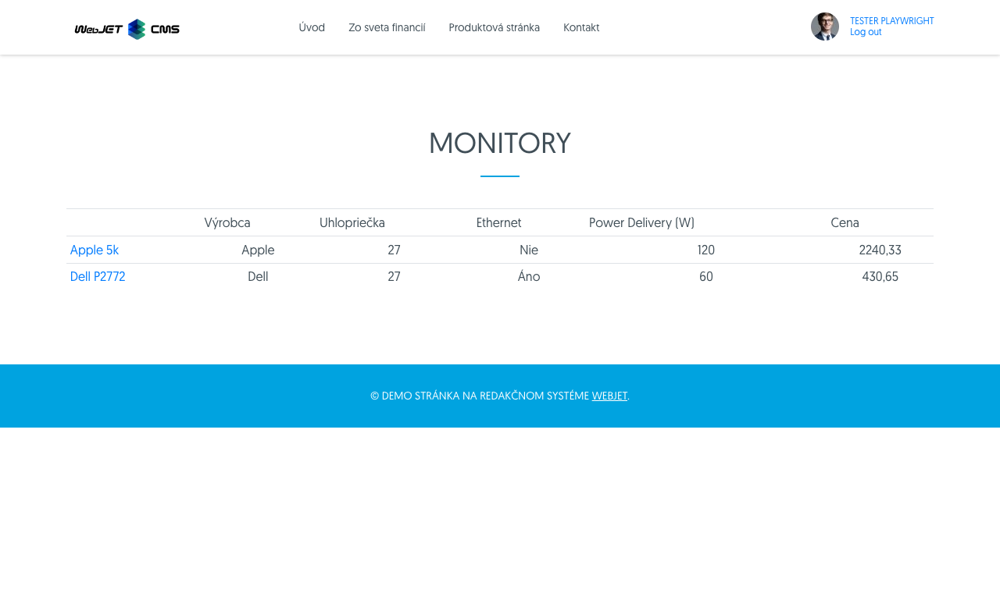

# WebJET 2023

Vitajte v dokumentácii k WebJET verzie 2023. Odporúčame prečítať si [zoznam zmien](CHANGELOG-2023.md.md) a [roadmap](ROADMAP.md).

<div class="video-container">
    <iframe width="560" height="315" src="https://www.youtube.com/embed/A5upeBuEMbg" title="YouTube video player" frameborder="0" allow="accelerometer; autoplay; clipboard-write; encrypted-media; gyroscope; picture-in-picture" allowfullscreen></iframe>
</div>

# Zoznam zmien v poslednej verzii

## 2023.18

> Verzia 2023.18 je zameraná na integráciu kódu pôvodnej verzie 8. **Zrušená** je možnosť **prepnutia do starej verzie 8**, odstránené sú časti kódu, ktoré sú už prerobené do nového dizajnu, alebo nie sú naďalej podporované. **Hlavné zmeny API** sú v použití **generických objektov** typu ```List/Map``` namiesto špecifických implementácií ```ArrayList/Hashtable```. Z toho dôvodu **je potrebné nanovo skompilovať vaše triedy a upraviť JSP súbory**.

Významné zmeny v tejto verzii:

- Web stránky
  - Aktualizovaná knižnica ```ckeditor``` (editor stránok) na najnovšiu verziu 4.21.
  - Doplnená možnosť nastaviť pomer [šírky stĺpca stromovej štruktúry a datatabuľky](redactor/webpages/README.md#nastavenie-zobrazenia-stromovej-štruktúry).
  - Doplnená integrácia [atribútov stránky do editora](redactor/webpages/doc-attributes/README.md).
- Aplikácie
  - Bannerový systém - prerobená **štatistika zobrazení a kliknutí** na banner na novú podobu.
  - Formuláre - doplnená možnosť **archivovať formulár**.
  - [Číselníky](redactor/apps/enumeration/README.md) - prerobené do nového dizajnu.
  - Používatelia - v multi doménovej inštalácii je v editácii používateľa a skupín práv možné vyberať priečinky web stránok a jednotlivé web stránky bez ohľadu na aktuálne zvolenú doménu.
  - Prekladové kľúče - zobrazenie **prekladových kľúčov** upravené do **tabuľkového formátu**, kde stĺpce predstavujú jazyky.
  - Šablóny - pridaná možnosť **zlúčiť dve šablóny** do jednej.
- Bezpečnosť
  - Vykonané **bezpečnostné testy** pri nasadení u klienta a testy automatizovaným nástrojom ```Acunetix OVS```.
  - Aktualizované viaceré knižnice.
- Systém
  - Zlepšená **podpora** databázového servera **Oracle a Microsoft SQL**.

Samozrejme bolo opravených aj viacero chýb, ktoré boli identifikované pri používaní WebJETu na viacerých projektoch.

### Odstránenie závislosti na verzii 8

Z dôvodu lepšej integrácie a budúceho vývoja je odstránená závislosť na WebJET CMS verzie 8, ktorá bola doteraz dostupná a to vrátane možnosti prepnutia používateľského rozhrania administrácie na verziu 8. Je dlhodobo neudržateľné podporovať obe verzie a zároveň používať nové technológie. Súbory verzie 8 presunuté priamo do verzie 2023, čo nám umožní ich priamu úpravu na nové rozhranie. Ešte neprerobené časti zostávajú v starom rozhraní, prerobené sú dostupné už len v novom rozhraní. Zrušená možnosť prepnutia používateľského rozhrania do verzie 8.

Pre zjednodušenie aktualizácie môžete použiť skript ```/admin/update/update-2023-18.jsp``` pre kontrolu a opravu JSP súborov. Zákaznícke Java triedy je potrebné nanovo skompilovať a opraviť chyby z dôvodu zmeny API.

Z ```build.gradle``` súboru je potrebné zmazať kód:

```
implementation("sk.iway:webjet:${webjetVersion}:struts")
implementation("sk.iway:webjet:${webjetVersion}:daisydiff")
implementation("sk.iway:webjet:${webjetVersion}:jtidy")
```

Prečistené/zmazané viaceré Java triedy a balíky a príslušné JSP súboru. Pre podporu zmazaných častí v projektoch je potrebné použiť buď príslušný produkt typu WebJET NET alebo do projektu ich preniesť z verzie 8:

- Odosielanie SMS správ ```SendSMS```, konverzia Sk na Eur ```SkkEuroLoader```, Import SAX ```XmlSaxImporter```, Vkladanie JS/CSS priamo do stránky (Packager), kompilácia ```sass``` ```SassFileMonitor```, ```Skriptovanie v editore```, import používateľov z ```TXT/CSV``` súboru v starom ```Outlook``` formáte (použite import z xlsx formátu).
- Značky ```iwcm:vue``` a ```vue.tld``` pre vkladanie VUE komponent, dnes odporúčame ich vkladať priamo ako JS súbory.
- Integrácia na ```Alfresco``` a ```Sharepoint``` (bude neskôr dostupné ako súčasť produktu NET).
- Aplikácie: Bazár, ```AppCache```, ```Chat```, ```Clipboard```, ```Docman```, ```emailAttachmentsPublisher```, ```Events```, Graf, Majetok, Inzercia, ```PageUpdateInfo```, Poradňa, SITA, Tip dňa, Úschovňa, ```Wiki```, Zmluvy (časť aplikácii je nahradená v produkte WebJET NET).
- Prihlasovanie cez sociálne siete, použitá bola knižnica bez podpory ```socialauth```. Plánovaná je integrácia ```OAuth```, alebo použitie Spring Social.
- Konverzia z Doc na PDF (služba už nebola dlhšie dostupná).
- Odstránené konf. premenné: ```editorEnableScripting,enableToPdfConversion,doc2pdfConvertUrl,packagerMode,packager*,```.

### Web stránky

- Pri duplikovaní web stránky sa pri otvorení okna prepne na kartu Základne pre jednoduchšiu zmenu názvu, zmaže sa hodnota poľa URL adresa a Názov položky v menu aby sa automaticky nastavili podľa nového názvu stránky. Podobne sa nastavia prázdne hodnoty pri duplikovaní priečinka (#54953-6).
- Doplnené duplikovanie médií pri duplikovaní web stránky (#54953-6).
- Doplnená možnosť nastaviť pomer [šírky stĺpca stromovej štruktúry a datatabuľky](redactor/webpages/README.md#nastavenie-zobrazenia-stromovej-štruktúry). Vhodné ak máte široký alebo naopak úzky monitor a potrebujete vidieť viac/menej v stromovej štruktúre (#54953-7).


- Upravené usporiadanie URL adries pri vyhľadávaní zadaním ID stránky. V zozname sú na začiatku stránky, ktorých URL adresa je najkratšia (usporiadanie podľa abecedy s ohľadom na dĺžku URL adresy) (#55001).
- V [histórii stránky](redactor/webpages/history.md) pridaný stĺpec Bude vypnuté s prípadným dátumom kedy bude vypnuté zobrazenie web stránky (#54953-10).
- Aktualizovaná knižnica ```ckeditor``` (editor stránok) na najnovšiu verziu 4.21.1, vytvorený [GIT repozitár](https://github.com/webjetcms/libs-ckeditor4/pull/1/files) s verziou pre WebJET CMS (#55093).
- Opravená funkcia Nastavenie bloku (#55093).
- Editor obrázkov (kliknutie na ceruzku po označení obrázka v stránke) nahradený novou verziou ako sa používa v galérii, vypnutá možnosť použiť ```Pixlr``` editor (prešiel na komerčnú verziu a nefunguje API prístup) (#54993).

### Atribúty stránky

Doplnená integrácia [atribútov stránky do editora](redactor/webpages/doc-attributes/README.md). Umožňuje definovať polia, ktoré sa následne nastavujú web stránke. Atribúty sa delia do skupín (napr. Monitory, Mobilné telefóny atď) z ktorých je možné vyberať (#55145).

Výhoda oproti voliteľným poliam je v teoreticky nekonečnom počte polí a zároveň v možnosti organizovať polia do skupín. V databáze sú hodnoty ukladané v korektných dátových typoch, čo umožňuje vykonávať usporiadanie pomocou databázových dotazov (voliteľné polia aj typ číslo dátovo ukladajú ako reťazec).


Po nastavení je možné atribúty zobrazovať v porovnávacej tabuľke:



Alebo je možné zadané atribúty zobraziť ako aplikáciu vo web stránke, napr. ako zoznam vlastností produktu:


Doplnené vlastnosti:

- Definícia atribútov je naviazaná na aktuálnu doménu, v každej doméne môžete mať definované nezávislé atribúty.

### Datatabuľky

- Voliteľné polia - pridaná možnosť nastaviť typ pola [textová oblasť a ne-editovateľný text](frontend/webpages/customfields/README.md#textová-oblasť) (#55001).
- Pridaná možnosť [nastaviť tabuľke](developer/datatables/README.md#možnosti-konfigurácie) výšku podľa jej obsahu (počtu riadkov) tak, že nevypĺňa celú výšku okna (napr. ak je za sebou viacero tabuliek alebo je pridaný aj graf) nastavením možnosti ```autoHeight: false``` (#54989).

### Bannerový systém

- Prerobená štatistika zobrazení a kliknutí na banner na novú podobu (datatabuľky, grafy) (#54989).

### Formuláre

- Doplnená možnosť archivovať formulár, prerobená sekcia Archív formulárov do datatabuľky. Odstránený starý kód zobrazenia zoznamu formulárov (#54993).

### Číselníky

- Aplikácia číselníky prerobená do nového dizajnu (#55009).


### Galéria

- Doplnená možnosť nastaviť pomer šírky stĺpca stromovej štruktúry a datatabuľky. Vhodné ak máte široký alebo naopak úzky monitor a potrebujete vidieť viac/menej v stromovej štruktúre (#54953-7).
- Doplnená možnosť zobraziť galériu so špecifikovaného priečinka v URL parametri ```dir```. Pri úprave nastavenia aplikácie galéria v stránke sa teda priamo zobrazí nastavený priečinok (#54953-8).
- Pri vytvorení nového priečinka sú hodnoty rozmerov (vrátane spôsobu zmeny veľkosti) a vodotlače prednastavené podľa rodičovského priečinka (#54953-11).
- Doplnená podpora zobrazenia priečinkov pri používaní doménových aliasov. Predvolene sa zobrazí/otvorí priečinok ```/images/ALIAS/gallery```, kvôli spätnej kompatibilite sa ale zobrazia aj iné priečinky galérie (ak neobsahujú v názve doménový alias inej domény) (#54953-12).

### Používatelia

- V multi doménovej inštalácii je v editácii používateľa a skupín práv možné vyberať priečinky web stránok a jednotlivé web stránky bez ohľadu na aktuálne zvolenú doménu. Domény sa zobrazia ako koreňové priečinky. Zobrazenie vybranej položky obsahuje prefix s doménovým menom, aby bolo možné rozlíšiť jednotlivé priečinky (často sa volajú v rôznych doménach rovnako, napr. Slovensky) (#54953-11).


- Používateľské rozhranie - odstránená možnosť upraviť profil používateľa kliknutím na meno v hlavičke, údaje používateľa môže modifikovať už len administrátor s právami do sekcie Používatelia.

### Proxy

- Aplikácia [Proxy](redactor/apps/proxy/README.md) prerobená do nového dizajnu/datatabuľky. Doplnená dokumentácia a automatizované testy (#55025).

### Prekladové kľúče

- Zobrazenie prekladových kľúčov upravené do tabuľkového formátu, kde stĺpce predstavujú jazyky. Naraz sú zobrazené teda preklady vo všetkých jazykoch (oproti pôvodnej verzii kde ste videli len preklad zvoleného jazyka) (#55001).
- Zobrazené jazyky sa definujú v [konf. premennej languages](admin/setup/languages.md).
- V nastavení zobrazených stĺpcov je možné zapnúť aj zobrazenie pôvodných hodnôt pred zmenou prekladového kľúča.


- Zrušený starý spôsob exportu/importu kľúčov v ```properties/json``` formáte, podporovaný je import a export cez Excel. (#54953-8).
- Optimalizovaná rýchlosť importu z Excel súboru - audituje sa len informácia o importe a nie jednotlivých záznamoch, prázdne hodnoty sa preskočia (typicky sa jedná o prázdne stĺpce nepoužívaných jazykov), porovnanie záznamov je voči cache tabuľke (pri importe sa nemusí pre každý záznam testovať, či v databáze existuje) (#MR342).

### Šablóny

- Pridaná možnosť zlúčiť dve šablóny do jednej. Pri zlúčení sa zmení zlúčená šablóna v priečinkoch a web stránkach za novo zvolenú šablónu (#55021).
- Upravený import - ak neexistujú príslušné stránky pre hlavičku/pätičku/menu tak sa vytvoria prázdne stránky aby nenastala chyba importu. Podobne pre skupinu šablón a priečinky (Zobraziť pre) (#MR348).

### Konfigurácia

- Pridaná možnosť importu a exportu konfiguračných premenných pomocou formátu Excel (#54513-11,MR360).

### Použiteľnosť

- Upravená použiteľnosť ```autocomplete``` polí (typicky výber skupiny v Bannerovom systéme, Ankete, Otázky a odpovede, Skripty). Kliknutím kurzora do poľa sa ihneď zobrazí výberové pole so zoznamom možností, do poľa je ale možné písať začiatok textu pre vyhľadanie v zozname a aj zadať novú hodnotu.

### Bezpečnosť

- Audit - pridané samostatné právo na Úrovne logovania, keďže tie umožňujú aj zobraziť logy servera. Právo je predvolene zakázané, po aktualizácii ho nastavte vhodným používateľom (#54953-5).
- Opravené nastavenie URL adresy s parametrom a pamätania hesla pri prihlasovaní - atribút ```autocomplete="off"```, atribút automaticky nastavený pre všetky polia typu heslo v editore datatabuľky (#JTB-1587).
- Doplnené vrátenie chyby 404 pre url typu ```/admin.tgz``` (#JTB-1587).
- Zlepšená kontrola prístupu do administrácie/kontroly práv na základe nálezov penetračných testov (#JTB-1606).
- Upravené chybové správy typu SQL pri uložení záznamu v datatabuľke - pre používateľa je zobrazená skrátená verzia chyby, kompletná je zaznamenaná v audite (#JTB-1606).
- Aktualizovaná knižnica ```Spring Security``` na verziu 5.8 (#54993).
- Web stránky - opravený možný XSS v názve stránky/priečinka (#55181).
- Web stránky - opravený možný XSS v náhľade aplikácie v stránke (#55181).
- Vyhľadať a nahradiť - opravený možný XSS v náhľade aplikácie v stránke (#55193).
- Odhlásenie - parameter ```forward``` umožňuje zadať len lokálnu URL adresu, externé je potrebné zadať pomocou presmerovania cez ```forwardDocId``` (#55193).

### Systém

- Zlepšená podpora databázového servera Oracle (#54953-6, #54953-7).
- Pri multi doménovej inštalácii s použitím doménových aliasov je pri generovaní ```/thumb``` obrázka overené, či existuje varianta v priečinku s pridaným doménovým aliasom (```/images/ALIAS/cesta/obrazok.jpg```). Ak neexistuje, použije sa pôvodne požadovaná cesta (#54993).
- Pridaná konf. premenná `languages` [nastavujúca dostupné jazykové mutácie](admin/setup/languages.md)
- Upravená pauza pri zápise štatistík - pôvodne sa náhodná pauza (0-10 sekúnd) vykonala pred každým zápisom SQL výrazu, po novom sa vykoná len pred prvým záznamom. Pauza je náhodná, aby v clustri nedochádzalo k nadmernému zaťaženiu databázy v 0 sekunde kedy sa predvolene vykonáva úloha na pozadí pre zápis štatistík.

### Oprava chýb

- Bannerový systém - opravená chyba zaznamenania počtu zobrazení a kliknutí na banner (#54273-40).
- Datatabuľka - opravená editácia bunky vo vnorenej tabuľke (editácia bunky nemala správne nastavené zobrazenie nad) (#54953-5).
- Formuláre - opravená možnosť dešifrovania údajov formuláru (#54993).
- Galéria - opravené nastavenie lupy v karte Oblasť záujmu v prehliadači Firefox a posun veľkého obrázka (#54953-5,6).
- Galéria - opravené zobrazenie pri type tabuľka - nesprávna výška tabuľky (#54953-7).
- Hromadný email - opravená možnosť zadania viacerých emailových adries pre odhlásenie (#54953-6).
- Datatabuľka - opravený výpočet percent pri importe z Excelu, doplnená aj informácia o riadku a celkovom počte riadkov do okna importu (#MR341).
- Datatabuľka - opravené hľadanie záznamu podľa ID v URL parametri pri usporiadaní na klientskej strane (keď je tabuľka usporiadaná inak ako podľa ID) (#55021).
- Datatabuľka - opravené hľadanie podľa ID ak primárny kľúč je iný ako ```id``` (napr. ```tempId```) (#55021).
- Datatabuľka - opravené vnorenie editácie a otváranie ďalších okien (napr. z web stránky editácia šablóny, tam editácia stránky hlavičky). Doplnené stmavenie hlavičky a pätičky rodičovského okna a mierne zmenšenie vnoreného dialógu (#54273-41).
- Datatabuľka - v režime duplikovať budú vnorené datatabuľky zobrazené s čiernou prekrytou vrstvou nedostupné na editáciu (stmavené). Typicky vnorené datatabuľky zobrazujú napojené dáta a v režime duplikovať by došlo k zmene údajov pôvodného záznamu. Typicky pri editácii web stránky úprava v karte Média (#54273-37).
- Galéria - opravené nastavenie lupy v karte Oblasť záujmu v prehliadači Firefox a posun veľkého obrázka (#54953-5,6).
- Galéria - opravené zobrazenie pri type tabuľka - nesprávna výška tabuľky (#54953-7).
- Galéria - opravené načítanie obrázkov v multidomain verzii s externými súbormi (#MR341).
- Hromadný email - opravené zobrazenie chyby neplatnej emailovej adresy v skupine pri jej pridaní (#54953-12).
- Mazanie dát - upravené zobrazenie položiek v menu, viaceré položky zlúčené do Databázové záznamy (#54953-7).
- Otázky a odpovede - upravené predvolené usporiadanie tak, aby najnovšie otázky boli na začiatku zoznamu (#54993).
- PageBuilder - upravené ovplyvňovanie štýlov tlačidiel stránky štýlmi administrácie (#54953-6).
- Používatelia - opravené zobrazenie neaktívnych výberových polí v stromovej štruktúre práv (#54953-9).
- Používatelia - opravená chyba validácie emailovej adresy (#54953-12).
- Prekladové kľúče - opravená chyba vloženia kľúča so znakom tabulátor na začiatku/konci (#MR-364).
- Web stránky - opravené prvotné načítanie zoznamu stránok ak priečinok obsahuje viac ako 10 záznamov (#54953-6).
- Web stránky - opravené duplikovanie priečinka ak nie je nastavená multi doménová konfigurácia (#54953-6).
- Web stránky - opravené znova načítanie zoznamu web stránok v priečinku po zmene hlavnej stránky priečinka (#54953-7).
- Web stránky - opravená kozmetická vada zobrazenie filtra podľa stavu a zobrazenie tabuľky v dialógovom okne (#54953-8).
- Web stránky - opravené vypnutie publikovania stránky po zadanom dátume - možnosť Odverejniť stránku po tomto dátume (#54953-10).
- Web stránky - opravené nastavenie aktuálneho dátumu do poľa Dátum začiatku pri nastavenej konf. premennej ```editorAutoFillPublishStart=true``` (#54953-11).
- Web stránky - opravená nastavenie hodnoty textu editora pri editácii bunky (#55057).
- Web stránky - opravená detekcia duplicitnej URL adresy pri adresách bez .html na konci a bez lomky (#55161).
- Web stránky - opravené ikony v úprave šablóny noviniek (#54953-13).
- Web stránky - upravené zobrazenie dialógov (napr. vlastnosti aplikácie) pri použití PageBuilder (okno je vo vrstve vyššie ako nástrojová lišta editora), opravená možnosť presúvania okna pre Spring aplikácie.

### Testovanie

- Do [testovania Datatabuľky](developer/testing/datatable.md#možnosti-nastavenia) ```DataTables.baseTest``` doplnená možnosť ```afterCreateSteps(I, options, requiredFields, DT, DTE)``` pre nastavenie napr. povinných polí po uložení záznamu (ak tabuľka neobsahuje žiadne povinné polia je možné nastaviť pole pre vyhľadávanie záznamu v ďalších krokoch).
- Doplnený test ```webpages.webpage-virtual-path ```nastavovania URL adries stránok - kontrola duplicity, kontrola adries so znakom hviezdička (#55161).

### Dokumentácia

- Doplnená dokumentácia pre nastavovanie [atribútov stránky v editore](redactor/webpages/doc-attributes/README.md) (#55145).

### Pre programátora

- Doplnená API metóda [DatatableRestControllerV2.afterDuplicate(T entity, Long originalId)](developer/datatables/restcontroller.md) volaná po duplikovaní záznamu. Môžete tak napr. duplikovať aj pripojené dáta ako sú média web stránky (#54953-6).
- Doplnená JavaScript funkcia ```WJ.selectMenuItem(href)``` pre [zvýraznenie zadanej menu položky](custom-apps/admin-menu-item/README.md#frontend) v ```master-detail``` stránkach (#54953-9).
- Doplnená podpora polí typu ```DataTableColumnType.JSON``` v [parametroch aplikácií](custom-apps/appstore/README.md#parametre-aplikácie) a priamo v Spring triede. Zladené je nastavenie polí pre editor (nastavenie aplikácie v editore) a pri zobrazení aplikácie na stránke. (#55169).
- Vytvorená dokumentácia k [rozšíreniu existujúcich Spring DATA repozitárov](custom-apps/spring/repository-extend.md) vo vašom projekte (#UCMWS-14).
- Doplnená možnosť [rozšírenia dialógov](developer/datatables/export-import.md#špeciálny-typ-exportu) pre špeciálny import a export údajov z datatabuľky (#54513-11,MR360).


[Kompletný zoznam zmien >>](CHANGELOG-2023.md)
