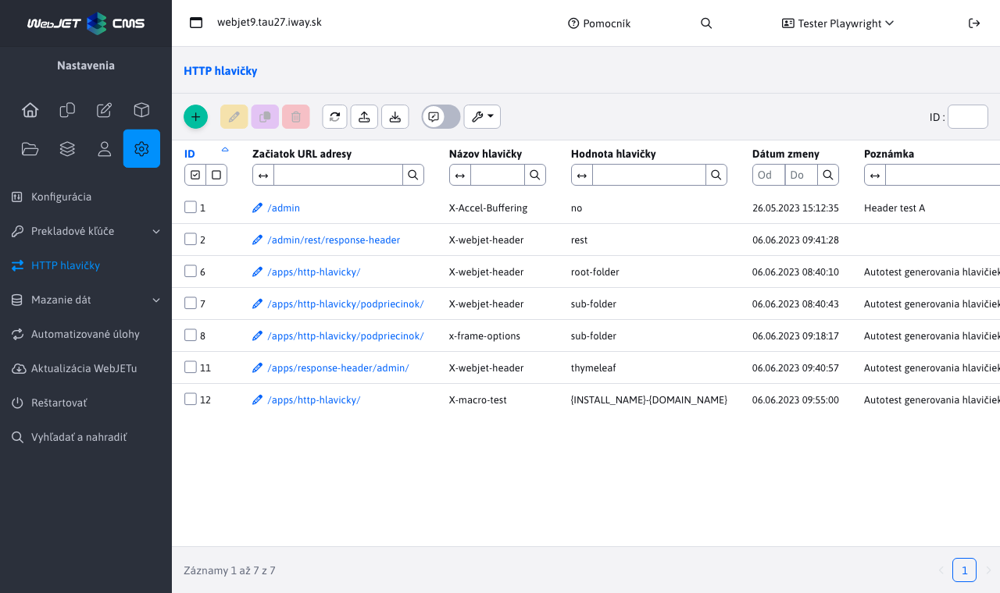
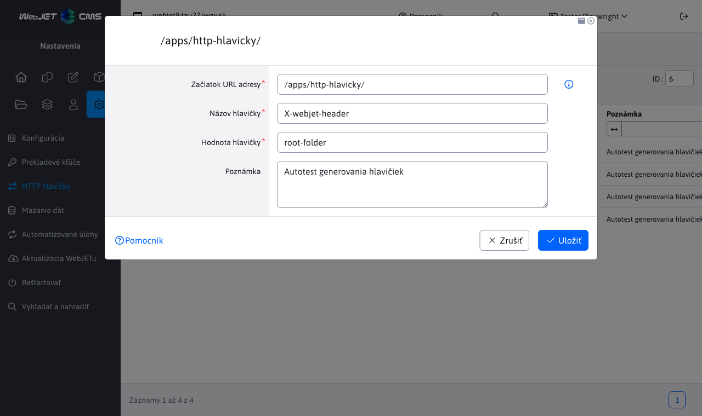

# HTTP hlavičky

Aplikácia HTTP hlavičky v sekcii Nastavenia umožňuje definovať HTTP hlavičky odpovede (`HTTP Response Header`) na základe URL adries zobrazenej stránky. Hlavičky sú oddelené podľa domén, nastavujú sa pre každú doménu samostatne.



Ak existuje viac hlavičiek s rovnakým názvom, použije sa hlavička s najdlhšou zhodou v URL adrese. V ukážke je vidno nastavenie rozdielnych hodnôt pre hlavičku `X-webjet-header` pre URL adresy `/apps/http-hlavicky/` a `/apps/http-hlavicky/podpriecinok/`. Hodnota pre stránku `/apps/http-hlavicky/podpriecinok/stranka.html` sa použije na základe najdlhšej zhody URL, čo znamená, že bude mať hodnotu `sub-folder`.



Editor hlavičiek obsahuje polia:

- `Začiatok URL adresy` určuje, pre ktoré URL adresy sa definuje hlavička. Hlavička sa generuje pre všetky URL, ktoré začínajú na zadanú hodnotu.
- `Názov hlavičky` udáva názov samotnej hlavičky, ktorá sa pridáva.
- `Hodnota hlavičky` udáva hodnotu nastavenej hlavičky.
- `Poznámka` doplnková informácia, napr. kto a kedy požadoval nastavenie danej hlavičky. Hodnota sa zobrazuje len v administrácii.

Ako príklad použijeme obrázok vyššie s editorom už vytvoreného záznamu. Tieto hodnoty určujú, že pre každú URL adresu, ktorá začína na `/apps/http-hlavicky/`, sa vygeneruje HTTP hlavička `x-webjet-header` s hodnotou `root-folder`.

V názve aj hodnote môžete použiť makro ```{HTTP_PROTOCOL}, {SERVER_NAME}/{DOMAIN_NAME}/{DOMAIN_ALIAS}, {HTTP_PORT}```, ktoré bude nahradené za hodnotu získanú na serveri. ```SERVER_NAME``` je doménové meno z ```request.getServerName()```, ```DOMAIN_NAME``` a ```DOMAIN_ALIAS``` sú hodnoty domén alebo alias-u nastavené vo web stránkach. Hodnota ```{INSTALL_NAME}``` reprezentuje meno inštalácie. Hodnota ```{HEADER_ORIGIN}``` obsahuje hodnotu HTTP hlavičky ```origin```.

Upozornenie: niektoré hlavičky sa nastavujú priamo cez konfiguračné premenné, viď zoznam pre [Bezpečnostné testy](../../../sysadmin/pentests/README.md#http-hlavičky).