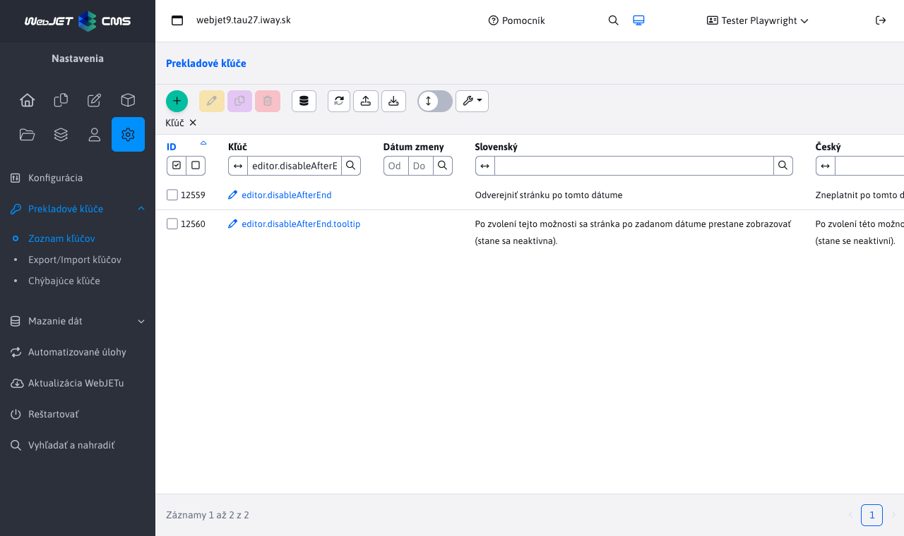
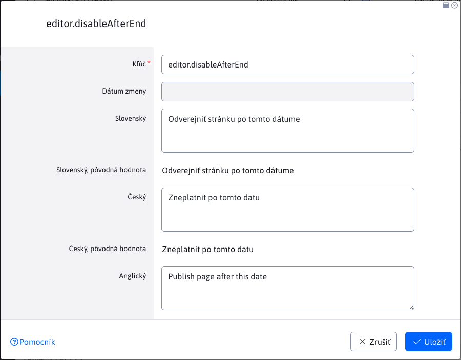

# Prekladové kľúče

Sekcia Prekladové kľúče umožňuje vytvárať/upravovať/duplikovať prekladové kľúče alebo ich importovať či exportovať.

Každý záznam v tabuľke obsahuje všetky jazykové kombinácie pre daný prekladový kľúč, ako aj ich pôvodné hodnoty pred zmenou. Ich pôvodná hodnota je daná súborom a vy môžete túto hodnotu aktualizovať alebo ju ponechať.

## Typy prekladových kľúčov

Prekladové kľúče, môžu mať pomyselné typy, v závislostí ako tento kľuč vznikol a aké operácie sa nad ním vykonali.

- Pôvodný kľuč - bol načítaný zo súboru s prekladovými kľúčmi a nikdy nebol upravený.
- Upravený kľúč - vznikne ak upravíte hodnotu pôvodného kľúča načítaného zo súboru. Či je hodnota rovnaká ako tá zo súboru alebo nie, nová verzia tohoto kľúča aj so všetkými hodnotami sa uloží do databázy a pôvodné hodnoty zo súboru sa budú zobrazovať v poliach pôvodná hodnota.
- Nový kľúč - je taký, ktorý nebol získaný zo súboru s prekladovými kľúčmi, ale bol vytvorený pomocou editoru. Takýto kľuč je uložený v databáze spolu s všetkými jazykovými prekladmi.

## Vytvorenie nového kľúča

Pri vytváraní nového prekladového kľúča je potrebné zadať samotný kľúča (mal by byť jedinečný a v prefixe obsahovať názov aplikácie/modulu pre jeho jasné odlíšenie) a jeho hodnotu prekladu v definovaných jazykoch. Taktiež si môžete všimnúť, že pri vytváraní nového kľúča sú polia s pôvodnými hodnotami skryté, nakoľko ide o nový záznam.

## Úprava existujúceho kľúča

Pri úprave už existujúceho záznamu sa nám v editore zobrazia aj polia s pôvodnými hodnotami pre každý jazyk zvlášť. Pôvodné hodnoty sú tie, ktoré boli získané zo súboru s prekladovými kľúčmi. Tieto polia s pôvodnou hodnotou vidíte ale nemôžete ich upraviť.

## Vymazanie kľúča

Zmazanie prekladového kľúča je zložitejší proces, ktorý sa môže líšiť v závislostí od typu prekladového kľúča. Mazať je možné len kľúče vytvorené/upravené v databáze, ktoré sa nenachádzajú priamo v prekladovom súbore:

- Nový kľúč - pri pokuse o jeho vymazanie sa vymažú všetky jeho jazykové preklady z databázy. To znamená, že tento prekladový kľuč už nebudete schopný nájsť v tabuľke.
- Pôvodný kľuč s novými hodnotami - pri pokuse o vymazanie tohto kľúča sa vymažú iba nové databázové hodnoty a z prekladového kľúča sa stane pôvodný kľuč definovaný v súbore (takže sa opäť nastavia hodnoty tak, ako boli vyčítané zo súboru). Tento kľuč budeme môcť ďalej nájsť v tabuľke.
- Pôvodný kľuč - **nie je možné odstrániť**. Tieto kľúče sa získali zo súboru s prekladovými kľúčmi a súbor nie je možné modifikovať. Pri pokuse o vymazanie takéhoto kľúča budete upozornení notifikáciou, že tento kľuč nie je možné vymazať.

