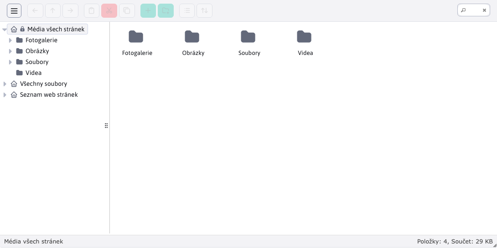
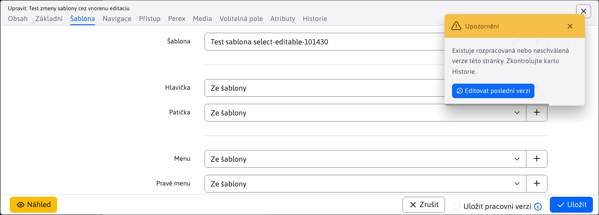
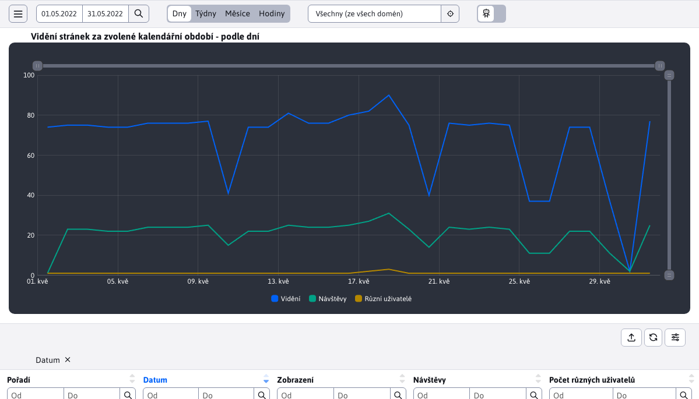
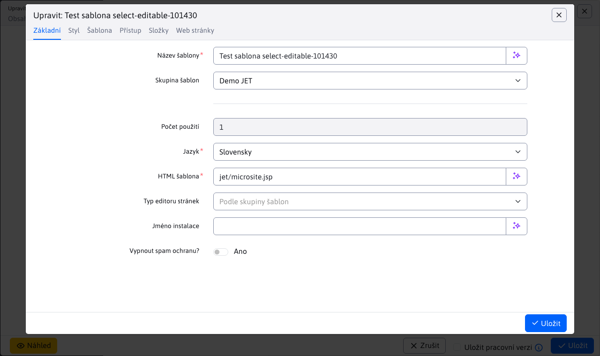
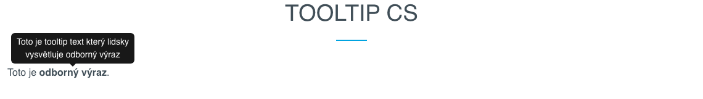
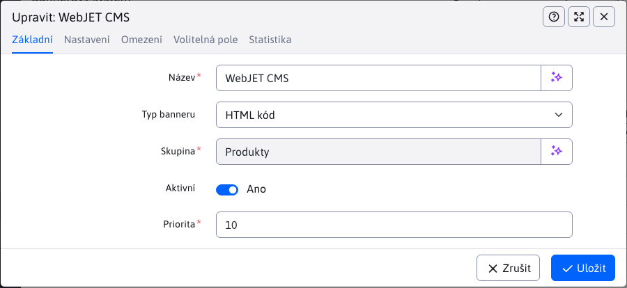
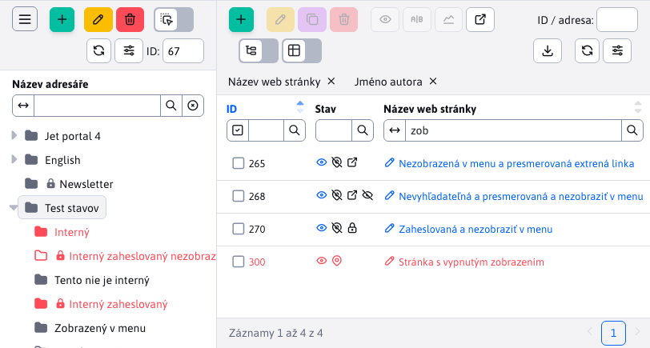
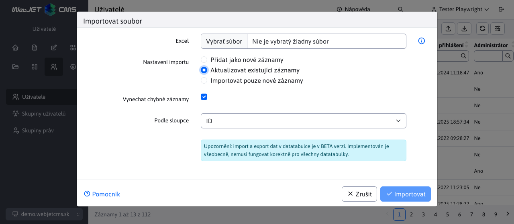
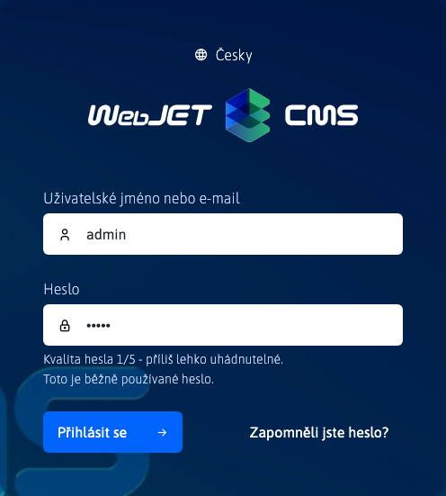
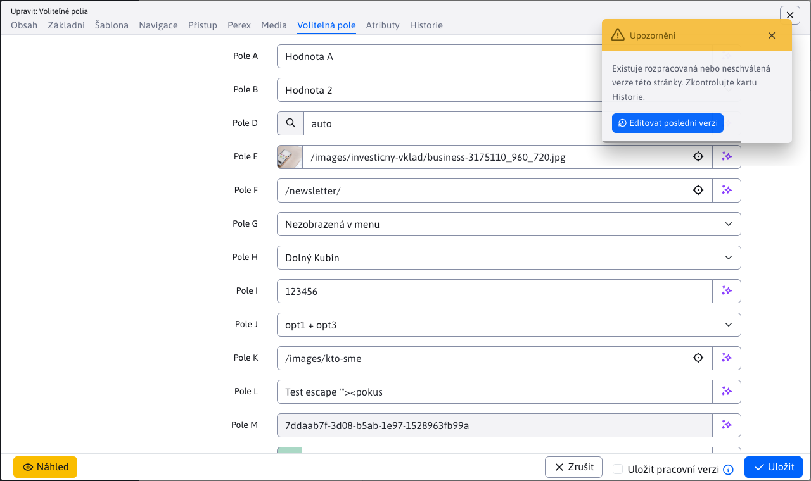

# Seznam změn verze 2021

## 2021.52

> Verze 2021.52 má nový design i pro starší verze aplikací, zlepšuje odezvu, přidává nová pole na webové stránky a zlepšuje chování adres URL stránek při jejich přesunu do jiného adresáře.

**Redesign verze 8**

Upravili jsme design starých aplikací verze 8 tak, aby barevné schéma a rozvržení odpovídalo designu nové verze WebJET CMS. Nabídky se chovají stejně jako v nové verzi pro pohodlnější přechod mezi starými a novými aplikacemi (# 54233).

Kliknutím na ikonu "Přepnout na verzi 8" v záhlaví můžete stále přepínat rozhraní na design verze 8.

**Webové stránky**

- Přidána možnost ukládání [funkční verze webových stránek](redactor/webpages/README.md). Bude uložen do historie a prozatím nebude návštěvníkům webu k dispozici (#54161).

- Kompletně přestavěný [Rozhraní API pro úpravy webových stránek](developer/apps/webpages/api.md) z originálu `EditorDB` na adrese `EditorFacade`. Webové stránky jsou načítány a ukládány prostřednictvím Spring DATA, což v budoucnu usnadní přidávání nových atributů databáze (také konkrétně u klientských projektů). V seznamu změn je to jen jeden řádek, ale reálně se jedná o 95 nových/změněných souborů (#54161).
- Přidána možnost otevřít jiný editor z editoru. Prozatím je tato funkce implementována v poli Šablona webové stránky v editoru stránky. Máte možnost kliknutím na tužku upravit nastavenou šablonu nebo kliknutím na ikonu + přidat novou šablonu, aniž byste opustili editor stránky. Postupně bude tato funkce přidána i do dalších polí, jako je záhlaví, zápatí, volná pole atd.

- Upraveno pole pro zadání domény ve vlastnostech adresáře - nyní se zobrazuje pouze pro kořenový adresář.
- Přidání popisného/informačního textu do polí v editoru stránek a složek.
- Ikony stavu byly přesunuty do samostatného sloupce s možností filtrování podle stavu, byla přidána ikona oka pro přímé zobrazení webové stránky se seznamem stránek.

- Přidána kontrola práv pro možnost vytvářet/upravovat/mazat webové stránky a adresáře a kontrola práv pro jednotlivé adresáře (#54257).
- Přidány stavové ikony do samostatného sloupce s možností filtrování a přímého zobrazení webové stránky kliknutím na ikonu oka (#54257).
- Přidány nezávislé možnosti nastavení zobrazení adresáře a webové stránky v mapě webu a navigačním panelu. Ve verzi 8 byly tyto možnosti vázány na zobrazení nabídky. Někdy však bylo nutné zobrazovat položky v nabídce a např. v mapě stránek odlišně (#54205).

- Na kartě šablony na webové stránce byla přidána možnost nastavit volný objekt A-D. Je tak možné měnit nejen záhlaví/zápatí/menu, ale také volné objekty šablony pro každou webovou stránku zvlášť. Je také možné nastavit prázdnou hodnotu.

- Přidány nové možnosti [automatické generování adresy URL stránky](redactor/webpages/editor.md#url-adresa) podle názvu položky nabídky (při přesunu do jiné složky se automaticky změní adresa URL) nebo možnost automaticky zdědit začátek adresy URL ze složky (při přesunu do jiné složky se automaticky změní počáteční část adresy URL) (#54237).

**Responzivní verze**

Vyplněná obecná verze podání pro [mobilní zařízení](redactor/admin/README.md). Pokud je šířka menší než 1200 pixelů, levé menu a záhlaví se skryjí a jsou dostupné po kliknutí na hamburger menu.

Při šířce menší než 992 pixelů se okno editoru zobrazí v plné velikosti; při šířce menší než 576 pixelů se názvy polí přesunou nad pole.

**Volitelná pole**

Přidána možnost [výběrové pole s více možnostmi](frontend/webpages/customfields/README.md#výběrové-pole-více-možností) zadáním předpony `multiple:` před seznamem možných hodnot. Hodnoty se pak uloží do pole odděleného znakem `|`.

**Úvod**

- Pro snadné používání nevyžaduje změna domény na domovské stránce potvrzení (doména se změní okamžitě).

**Konfigurace**

- Přidán import a export konfigurace podle verze 8, kdy je exportována do formátu XML a importována s porovnáním stávajících hodnot.
- Opraveno upravování buněk, přidána možnost upravovat také hodnotu.
- Opraveno zobrazení původní hodnoty a popisu po změně hodnoty.

**Datové tabulky**

- Přidán nový typ datového pole pro typ pole číselníku `select` s možností [editace nebo přidání záznamu](developer/datatables-editor/field-select-editable.md) ve výběrovém poli. Umožňují snadno upravit objekt, který je v poli vybrán, například šablonu stránky, odkaz na záhlaví stránky apod.

- Přidáno upozornění na konflikt - pokud má jiný uživatel otevřené okno editoru se stejným záznamem, zobrazí se upozornění se seznamem ostatních uživatelů. Zobrazí se při otevření okna a poté se kontroluje každou minutu.

- Přidána možnost vkládat `tooltip` do polí v editoru s formátováním pomocí [Formát Markdown](developer/frameworks/webjetjs.md#markdown-parser). Z bezpečnostních důvodů nelze vkládat odkazy a jiné než základní značky Markdown.
- Překladový klíč pro nápovědu je automaticky vyhledáván podle překladového klíče `title` s koncovkou `.tooltip`. Pokud tedy máte anotaci `@DataTableColumn(title = "group.superior_directory"` automaticky vyhledá text překladu pomocí klíče `group.superior_directory.tooltip`. Pokud existuje, použije se.
- Opraveno vyhledávání podle data v tabulkách s klientským stránkováním a nezobrazením některých sloupců (špatný index sloupce).
- Přidána možnost nastavení [stavové ikony](developer/datatables/README.md#stavové-ikony), odstranil původní možnost přidat ikony k odkazu pro otevření editoru pomocí funkce `addTextIcon` (z hlediska UX to bylo nevhodné).

**Deployment**

Upravený deployment na server artefaktů. Do `ant/build.xml` přidaný úkol `createUpdateZip` který vytvoří a nahraje na licenční server aktualizaci ve formátu používaném pro přechod na. `gradle` verze. Starší instalace WebJETu lze tedy snadno aktualizovat klasickým způsobem přes nabídku Ovládací panely->Aktualizace WebJETu (#54225).

Upravil a porovnal archivy se starou verzí 8, aby obsahovaly všechny potřebné soubory. Přidána chybějící písma pro knihovnu `pd4ml` pro generování souborů PDF.

Chcete-li povolit aktualizaci na verzi 2021, kontaktujte prosím [Obchodní oddělení InterWay](https://www.interway.sk/kontakt/).

Upozornění: vzhledem k velkému počtu změn v knihovnách spring bude nutné během aktualizace restartovat aplikační server. Před aktualizací se ujistěte, že máte k dispozici technickou podporu pro restart.

**Dokumentace**

- Doplněná dokumentace o skladování [pracovní verze webových stránek](redactor/webpages/README.md).
- Předem vygenerované snímky obrazovky dokumentace pro webové stránky.
- Připravený základ pro výrobu [Dokumentace JavaDoc](../javadoc/index.html). Upraveno `docsify` pro otevření dokumentace JavaDoc v novém okně.
- Webové stránky - doplněná dokumentace pro [programátora k API](developer/apps/webpages/api.md).
- Vytvořená dokumentace [hlavní ovládací prvky](redactor/admin/README.md) správa a [přihlášení a odhlášení](redactor/admin/logon.md).
- Dokumentace vytvořená pro [výběrové pole s úpravami](developer/datatables-editor/field-select-editable.md).
- Vyplněná dokumentace k funkci [WJ.openIframeModal](developer/frameworks/webjetjs.md?id=iframe-dialóg) pro možnost nastavení textu tlačítka, polohy zavíracího tlačítka a události `onload` provedeno po načtení obsahu modálního okna.
- Vyplněná dokumentace k funkci [WJ.hasPermission(oprávnění)](developer/frameworks/webjetjs.md?id=kontrola-práv) k řízení uživatelských práv.
- Vyplněná dokumentace k funkci [WJ.parseMarkdown(markdownText, options)](developer/frameworks/webjetjs.md#markdown-parser) převést formát Markdown na kód HTML.
- Přepracovaná dokumentace k nastavení ikon pro použití [stavové ikony](developer/datatables/README.md#stavové-ikony).
- Doplněný manuál pro redaktora o aplikacích [Nabídka](redactor/apps/menu/README.md), [Navigační panel](redactor/apps/navbar/README.md) a [Mapa stránek](redactor/apps/sitemap/README.md).
- Vytvořená dokumentace k možnostem generování adres URL [automatické generování adresy URL stránky](redactor/webpages/editor.md#url-adresa).

**Testy**

- Webové stránky - přidány nové testy pro uložení pracovní verze, oznámení při nastavení existující adresy URL, oznámení při změně odkazu na stránce (při přejmenování adresy stránky), oznámení při publikování se zadaným datem zahájení, ověření času publikování webové stránky.
- Vytvořená funkce `DTE.fillCkeditor(htmlCode)` pro vložení kódu HTML do aktuálně zobrazeného CKEditoru.
- Přidán test pro výběrová pole s možností editace a test pro chybu obnovení dat výběrových polí po uložení (pole nebylo možné změnit hodnotu).
- Webové stránky - přidán test vyhledávání podle stavových ikon.
- Webové stránky - přidán test práv k jednotlivým funkcím (přidávání, úpravy, mazání) a práv k jednotlivým adresářům (#54257).
- Webové stránky - přidán test nastavení URL (#54237).

**Oprava chyb**

- Opraveno zobrazení nastavení datové tabulky.
- Šablony - přidána možnost Prázdné pole pro záhlaví/zápatí/menu.
- Opraveno zobrazení textů tlačítek nápovědy v galerii, odstranění dat a uživatelských skupinách.
- Datové tabulky - načtení dat při duplikaci záznamu během načítání dat ze serveru (načtení všech dat před duplikací).
- Webové stránky - opraveno načítání záznamů z historie a karty Poslední změna.
- Webové stránky - opraveno nastavení prázdné hodnoty v poli `password_protected` (znak byl uložen nesprávně `,`).
- Datové tabulky - opravena aktualizace záznamu ze služby REST při označení více řádků nebo duplicitních záznamů.
- Opraveno zobrazení nápovědy na tlačítkách vlastností adresáře webové stránky a v aplikacích galerie, odstranění dat a uživatelských skupin.
- Opraveno zobrazování filtru v názvu stránky v aplikaci monitorování serveru a GDPR.
- Opraveno označování všech řádků v klientském stránkování - je označena pouze aktuální stránka (#54281).

## 2021.47

> Verze 2021.47 přidává do nového designu upravené aplikace Tooltip, Export dat, Hromadné e-maily/omezení domén a Banner. Přidali jsme oznámení o schválení při ukládání stránky a vylepšili mobilní verzi.

**Aplikace**

- Tooltip - administrace upravena do nového designu, dokončeno [dokumentace k editoru](redactor/apps/tooltip/README.md).

- Export dat - správa upravena do nového designu, doplněna [dokumentace k editoru](redactor/apps/export/README.md).

- Hromadný e-mail - Omezení domény - správa upravena na nový design, doplněno [dokumentace k editoru](redactor/apps/dmail/domain-limits/README.md).

- Bannerový systém - správa upravena do nového designu, doplněna [dokumentace k editoru](redactor/apps/banner/README.md).

**Webové stránky**

- Přidáno upozornění při publikování stránky, která podléhá schválení, a upozornění, pokud na stránce probíhají/nebyly schváleny změny.

- Na kartě Historie editoru je aktuálně zveřejněná verze stránky zvýrazněna tučně.

**Datové tabulky**

- Upravené kopírování atributů existující entity při její editaci. Ve výchozím nastavení nemusí všechny atributy entity pocházet z editoru, takže hodnoty existující entity a data zaslaná z editoru se před uložením sloučí. Ve výchozím nastavení se všechny ne `null` Atributy. To však neumožňuje zadat prázdné datum (po jeho nastavení). Proto jsou atributy typu DataTableColumn s poznámkou `Date` jsou převedeny, i když mají `null` Hodnota.

**Responzivní verze**

- Vylepšené zobrazení přihlašovací obrazovky na mobilních zařízeních.
- Upraveno zobrazení dialogového okna v mobilní verzi - okno je na celou výšku, záložky jsou na celou šířku okna, zápatí je nižší, aby se maximalizovalo místo.
- Na webových stránkách v editoru můžete tlačítka editoru posouvat prstem, abyste měli přístup ke všem tlačítkům editoru.
- Zrušeno obalování tlačítek v datové tabulce na druhý řádek, nyní se prostě nezobrazují.
- Upraveno zobrazení vyhledávacích značek v tabulce - přesunuto zpoza tlačítek do nového řádku pod tlačítky.

**Zabezpečení**

- Dokumentace vytvořená pro [nastavení oprávnění a řešení bezpečnostních nálezů](sysadmin/pentests/README.md) z bezpečnostních/průnikových testů. Dokumentace se nachází v sekci Provozní příručka a doporučuje se nastavení zkontrolovat při spuštění webu/aplikace do výroby a poté při každé větší změně, minimálně jednou za čtvrt roku.
- Knihovny JavaScriptu byly aktualizovány na nejnovější verze, čímž byly opraveny všechny zranitelnosti těchto knihoven. Knihovna Bootstrap aktualizována z verze 4 na verzi 5 (#54169).

**Dokumentace**

- Dokumentace vytvořená pro [odesílání oznámení ze služby REST](developer/datatables-editor/notify.md) DATATabulky.
- Dokumentace vytvořená pro [Aplikace Tooltip](redactor/apps/tooltip/README.md) redaktorovi.
- Dokumentace vytvořená pro [Aplikace pro export dat](redactor/apps/export/README.md) redaktorovi.
- Dokumentace vytvořená pro [Hromadný e-mail - Omezení domény](redactor/apps/dmail/domain-limits/README.md) redaktorovi.

**Oprava chyb**

- Opravena aktualizace mezipaměti `TemplatesDB` při ukládání stránky do místního (doménového) systémového adresáře.

## 2021.45

> Verze 2021.45 přidává zobrazení seznamu webových stránek z podadresářů, zlepšuje zobrazení administrace na mobilních zařízeních a přidává aplikaci otázek a odpovědí. Kromě toho obsahuje mnoho změn pod kapotou při práci se seznamem webových stránek (přechod na serverové stránkování a vyhledávání, použití Spring DATA pro přístup k databázi).

**Webové stránky**

Přidána možnost zobrazit webové stránky z podadresářů přepnutím přepínače. **Zobrazení stránek i z podadresářů** v záhlaví datového souboru. Po přepnutí do režimu zobrazení stránek z podadresářů se ve stromové struktuře zobrazí stránky z aktuálně vybraného adresáře včetně jeho podadresářů. Můžete kliknout na jiný adresář ve stromové struktuře, což opět způsobí zobrazení stránek z vybraného adresáře a jeho podadresářů.

- Služba REST pro získání seznamu webů přestavěných na úložiště Spring DATA.
- Umožňuje stránkování a vyhledávání na serveru, což je výhodné, pokud je v adresáři velký počet stránek.
- Byla vytvořena třída `DocBasic` která obsahuje společná data mezi tabulkami `documents` a `documents_history` a následné třídy `DocDetails` a `DocHistory`. Zpětná kompatibilita třídy je zachována `DocDetails` s verzí WebJET 8, i když jsme primitivní typy převedli na objekty (týká se to hlavně datových objektů, které používají jména kvůli kolizi jmen `publishStartDate, publishEndDate, startDateDate`). Používá se [dědičnost v entitách JPA](developer/backend/jpa.md#dědičnost-v-entitách-jpa).
- Karta Přístup rozdělená do sekce skupin uživatelů - přístup pro registrované uživatele a skupiny hromadných e-mailů podobné uživatelům.
- Editor - přidáno nastavení výběrového pole Formátovací styly podle aktuálně zobrazené stránky/šablony.
- Editor - přidán plovoucí panel nástrojů pro vlastnosti objektů v editoru (např. obrázky, tabulky, formuláře).

**Responzivní verze**

Začali jsme pracovat na optimalizaci administrace pro mobilní zařízení. Standardní prvky díky použití `bootstrap` framework funguje, ale bylo nutné odladit/opravit několik detailů.

- Na mobilních telefonech se dialogové okno editoru roztáhne na celou velikost displeje. V režimu na výšku jsou názvy polí nad polem (nikoli vlevo jako ve standardním zobrazení) a šedé zvýraznění názvů polí je skryté. Záhlaví a zápatí okna je nižší (#54133).
- Opraveno kliknutí na hamburger menu v mobilní verzi (#47428).
- Opraveno odsazení na domovské stránce (#47428).
- Opraveno pole pro výběr domény (#54133).

**Aplikace**

- [Otázky a odpovědi](redactor/apps/qa/README.md) přizpůsobil novému designu administrace a přidal možnost nastavení [volitelná pole](frontend/webpages/customfields/README.md).

**Správa dat více domén**

Do rozhraní REST datových tabulek jsme přidali systém pro podporu správy dat více domén (např. aplikace Otázky a odpovědi zobrazuje vždy pouze otázky a odpovědi aktuálně vybrané domény v instalaci s více doménami).

Použití je snadné rozšířením úložiště Spring DATA ze třídy `DomainIdRepository<T, ID>`, o zbytek se postará přímo `DatatableRestControllerV2`. Více informací najdete přímo v dokumentaci [Oddělení dat domény](developer/datatables/domainid.md).

**Datové tabulky**

- Podle vzoru webových stránek přidal do záhlaví každé datové tabulky pole ID s číslem [ID aktuálně upravovaného záznamu](developer/libraries/datatable-opener.md). ID je také nastaveno jako parametr v adrese URL v prohlížeči, po obnovení stránky s parametrem `?id=xxx` automaticky otevře zadaný záznam v dialogovém okně editoru. Hodnotu lze zadat také do pole ID v záhlaví a záznam bude vyhledán a zobrazen po stisknutí klávesy enter. Současná verze vyhledává zadané ID postupným stránkováním datové tabulky, to není vhodné pro datové tabulky, které mají velký počet záznamů (limit pro skenování je 30 stránek).

- Přepracované vyhledávání při použití typu úložiště Spring DATA `JpaSpecificationExecutor`. V tomto případě se vyhledávání vytvoří na základě `HTTP request` parametry začínající výrazem `search`. Již neplatí `ExampleMatcher` ale hledaný výraz je porovnáván na základě parametrů. To má tu výhodu, že v objektu lze použít primitivní i neprimitivní parametry. `NULL` atributy (které v případě `ExampleMatcher` automaticky zahrnuty do vyhledávání).

**Obecné**

- Přidána funkce JS `WJ.htmlToText` pro konverzi [Převod kódu HTML na text](developer/frameworks/webjetjs.md#další-funkce).

**Zabezpečení**

- Přidán nový převodník JPA `AllowSafeHtmlAttributeConverter` pro odstranění [škodlivý kód HTML](developer/backend/security.md) ze vstupních polí.

**Oprava chyb**

- Webové stránky - pevné načítání a ukládání stránky, která je ve více adresářích.
- Webové stránky - opraveno duplicitní volání pro načtení seznamu webových stránek při inicializaci (zbytečné volání služby REST).
- Datové tabulky - Opraveno zobrazení přepínače Upravit buňku ve vnořené tabulce v editoru.
- Datové tabulky - opravena duplikace ikony i pro buňku a opětovné otevření tabulky, která neobsahuje více karet.
- Datové tabulky - opraveno nastavení a získání kódu HTML při použití pole `QUILL` (implementováno v `app-init.js`).
- Datové tabulky - opraveno zobrazení filtrů po přidání sloupců do tabulky prostřednictvím jejího nastavení.

**Deployment**

Upravili jsme proces sestavování artefaktů nové verze. V této verzi jsou všechny třídy jazyka Java překompilovány ze souboru [zdrojový kód původního WebJETu](developer/install/deployment.md) 8 a zdrojový kód verze 2021. V nové verzi někdy upravujeme třídy jazyka Java z původní verze 8, což může vést k nekompatibilitě se starým API. Proto dochází ke kompletní rekompilaci tříd jazyka Java, aby se zabránilo nekompatibilitě API nebo aby se tato nekompatibilita zjistila.

**Testy**

- Aktualizace CodeceptJS na verzi 3.1.3 a Playwrightu na verzi 1.16.3.`BrowserContext`), která se pro každý scénář nově otevírá (má nový `BrowserContext`) a bylo nutné upravit několik testů (zejména galerii, kde je v selektoru ID použit znak /, který je třeba správně escapovat pomocí zpětného lomítka).
- Upravené automatizované testování datových tabulek - funkce `createSteps` a `editSteps` je zavolán před nastavením povinných polí.
- Vytvořená funkce `DTE.fillField(name, value)` vyplnit standardní pole podle jeho názvu v definici backend/json.
- Vytvořená funkce `DTE.fillQuill(name, value)` k vyplnění hodnoty v poli type `QUILL`.
- Vytvořil jsem test, ve kterém jsem použil otázky a odpovědi.
- Přidán test pro filtrování webových stránek podle `boolean` a `password_protected` Sloupce.
- Webové stránky - vytvořený test `webpage-spring.js` pro verzi se stránkováním serveru.
- Webové stránky - přidány testy `webpages.js` zobrazit webové stránky i z podadresářů.

**Dokumentace**

- Vytvoření nové sekce [Backend/Zabezpečení](developer/backend/security.md) v dokumentaci pro programátora.
- Dokumentace vytvořená pro [úvodní slovo redaktora](developer/libraries/datatable-opener.md) Podle `id` parametr v adrese URL.
- Vytvořil základ pro bezpečnostní dokumentaci. Dosud obsahuje informace o [nebezpečný kód HTML](developer/backend/security.md).
- Dokumentace vytvořená pro [Oddělení dat domény](developer/datatables/domainid.md).
- Rozšířený příklad použití [volitelná pole](developer/datatables-editor/customfields.md) v editoru pomocí třídy `BaseEditorFields`.
- Vytvořená dokumentace o možnosti použití [dědičnost v entitách](developer/datatables/restcontroller.md#dědičnost-v-entitách-jpa).
- Dokumentace vytvořená pro použití [dědičnost v entitách JPA](developer/datatables/restcontroller.md#dědičnost-v-entitách-jpa).

## 2021.40

> Verze 2021.40 přináší přepracovanou správu práv uživatelů, skupin a skupin a přepracovanou aplikaci GDPR do vizuálu WebJET 2021. Kromě toho přidává řadu drobných vylepšení a oprav.

**Uživatelé**

- [Seznam uživatelů](admin/users/README.md), [skupiny uživatelů](admin/users/user-groups.md) a [skupiny práv](admin/users/perm-groups.md) převeden na datovou tabulku a rozhraní REST.
- Doplněno [zvýraznění skupin práv](admin/users/README.md) v individuálních právech. Pomocí barevných kroužků pro zvýraznění práv ve skupině práv můžete na první pohled identifikovat práva, která skupina obsahuje.

- Přidány ikony pro jednotlivá práva až do úrovně 3.
- Volitelná pole v uživatelích [lze nakonfigurovat](developer/datatables-editor/customfields.md) podobně jako webové stránky pomocí překladových klíčů `user.field_x.type`.
- Pokud uživatel nemá nastaveno datum registrace (z historických důvodů), bude toto datum při uložení nastaveno na aktuální datum (#53985).

**GDPR**

- Přestavěná část [Správa regulárních výrazů](redactor/apps/gdpr/regexps.md) do návrhu verze 2021 (#53905).
- Přestavěná část [Správce souborů cookie](redactor/apps/gdpr/cookiesmanger.md) k návrhu 2021 (#53881).
- Přestavěná část [Vymazání dat](redactor/apps/gdpr/data-deleting.md) do návrhu verze 2021 (#53985).
- Přestavěná část [Vyhledávání](redactor/apps/gdpr/search.md) do návrhu verze 2021 (#53989).

**Překladové klíče**

- V poli hodnoty překladu již není vyžadována možnost zadat prázdnou hodnotu.

**Vlastní aplikace**

- Stanovený základ pro [vytváření zákaznických aplikací](custom-apps/admin-menu-item.md). Ty jsou vytvořeny v adresáři `/apps/` na rozdíl od staré verze z adresáře `/components/` (#54045).
- Aplikace jsou zakomponovány do návrhu [přímo z kódu html](custom-apps/admin-menu-item.md#frontend), není třeba vytvářet a kompilovat soubory pug.
- Vytvořená funkce [WJ.breadcrumb](developer/frameworks/webjetjs.md#navigační-panel) k vygenerování navigačního panelu.
- K navigačnímu panelu lze přistupovat pomocí makra `{LANGUAGE-SELECT}` vložit pole pro výběr jazyka.

**Export a import**

- Upraven export a import dat z/do datové tabulky tak, aby používal sloupce z editoru (oproti původní verzi, která používala sloupce v tabulce). Editor obvykle obsahuje více sloupců než tabulka a ty jsou potřeba pro správný import dat (#54097).
- Exportovány jsou také seznamy adresářů/stránek/adresářů v souborovém systému, které používají typ pole. `json`. Exportované i importované soubory jsou v zobrazení celé cesty (např. `/Slovensky/Novinky`).
- Dokumentace vytvořená pro [programátor](developer/datatables/export-import.md) Také [editora](redactor/datatables/export-import.md).

**Překladatel**

WebJET integruje možnost [překlad textů](admin/setup/translation.md), aktuálně podporovaný překladač [DeepL](https://www.deepl.com/). V aplikaci je podporován automatický překlad [zrcadlení struktury](redactor/apps/docmirroring/README.md).

**Webové stránky**

- Přidána možnost nuceného [obnova struktury stromů](developer/apps/docmirroring.md) nastavením atributu `RequestBean.setAttribute("forceReloadTree", Boolean.TRUE);`.
- Přidáno zobrazení textu "Zpracování" při použití funkce drag&drop ve stromové struktuře (což může při použití zrcadlení struktury trvat několik sekund).
- Podle `DocDetails` a `GroupDetails` přidána anotace atributu `fullPath` s úplnou cestou k webové stránce/adrese. Ve výchozím nastavení se nezobrazuje, v nastavení datové tabulky je možné zobrazení povolit.

**Formuláře**

- Pro formuláře obsahující více než 5000 záznamů (nastavitelné v konfigurační proměnné formsDatatableServerSizeLimit) se použije serverové zpracování.
- Vyhledávání - při zpracování serveru je podporováno pouze vyhledávání "Začíná na", ostatní možnosti jsou z hlavičky tabulky odstraněny, je podporováno vyhledávání v maximálně 6 sloupcích najednou.
- Vyhledávání - přidána možnost kombinovat vyhledávání podle data a hodnoty sloupce.
- Ve výchozím nastavení jsou seznam a podrobnosti formuláře uspořádány podle data vyplnění posledního formuláře.
- Upravil odkaz na detail formuláře podle příručky pro navrhování.
- Podporováno je vyhledávání až v 6 sloupcích najednou.
- Opraveno pořadí sloupců podle definice formuláře (dříve se sloupce zobrazovaly v náhodném pořadí).

**Datové tabulky**

- Přidán převodník JPA `DocDetailsConverter` a `DocDetailsNotNullConverter` mezi `doc_id` v databázi a objekt `DocDetailsDto` pro snadnější použití pole typu JSON pro výběr ID stránky. Převodník `NotNull` se vrací na `NULL` hodnota objektu `-1`.
- Přidán převodník JPA `GroupDetailsConverter` mezi `group_id` v databázi a objekt `GroupDetails` pro snadnější použití pole typu JSON pro výběr ID adresáře.
- Pro pole typu JSON [vybrat jednu stránku nebo adresář](developer/datatables-editor/field-json.md#možnosti-názvu-třídy) přidána možnost odstranit nastavenou hodnotu nastavením typu pole na hodnotu `dt-tree-group-null` pro adresář nebo `alebo dt-tree-page-null` pro webovou stránku.
- Přidána možnost pro pole typu JSON `null` objekt `Group/DocDetails`. Původní verze pro `null` objekt nezobrazoval ani pole pro výběr adresáře/stránky, nová verze zobrazí prázdné pole.
- Přidána možnost [nastavení záhlaví](developer/datatables-editor/datatable-columns.md#vlastnosti-datatablecolumneditor) před vnořenou datovou tabulkou na samostatné kartě nastavením atributu `data-dt-field-full-headline`.
- Přidána možnost [vynucené zobrazení sloupců](developer/datatables/README.md#možnosti-konfigurace) (např. pro vnořenou datovou tabulku) nastavením konfigurační možnosti `forceVisibleColumns`.
- Přidána možnost volat funkci JavaScriptu pro [upravit seznam sloupců](developer/datatables/README.md#možnosti-konfigurace) (např. pro vnořenou datovou tabulku) nastavením konfigurační možnosti `updateColumnsFunction`.
- Přidána možnost [přidání stylu CSS s přepínačem karet](developer/datatables-editor/README.md#karty-v-editoru) v editoru pomocí atributu `className`, pomocí stylu CSS `hide-on-create` je možné kartu při vytváření nového záznamu skrýt.
- Přidána možnost [skrýt kartu na základě práv](developer/datatables-editor/README.md#karty-v-editoru) v editoru pomocí atributu `perms`.
- Do třídy `DatatableRestControllerV2` přidaná metoda `public void afterSave(T entity, T saved)` zavolán po uložení entity (objektu `entity` je původní odeslaný objekt, `saved` je uložená verze - když je nový záznam `ID` se nachází pouze v `saved` entita).
- Do třídy `DatatableRestControllerV2` přidaná metoda `public void afterDelete(T entity, long id)` zavolán po odstranění entity.
- Přidaný typ pole `jstree` zobrazit [stromové struktury](developer/datatables-editor/field-jstree.md) s výběrovými poli uzlů stromu.
- Typ pole `json` rozšířeno o možnost [výběr seznamu adresářů souborového systému](developer/datatables-editor/field-json.md).
- Přidaná pole `HIDDEN, RADIO, PASSWORD` Pro `DatatableColumnType`.
- Zjednodušený proces práce s [další/vložené atributy](developer/datatables-editor/datatable-columns.md#vnořené-atributy), `editorFields` v řadiči REST. Implementací metod `processFromEntity` a `processToEntity` zajistit správné mapování dat mezi entitou a `editorFields` objekt.
- Import - přidány podmínky pro `domainId` aby se při importu aktualizovaly pouze záznamy aktuální domény.
- Import - upravený import s odpovídajícími záznamy podle vybraného sloupce pro použití API `insertItem` a `editItem` aby import fungoval i pro rozhraní REST, která nepoužívají úložiště Spring DATA.
- Import - upraveno dialogové okno tak, aby se při chybě importu zobrazovala chybová zpráva ze serveru.
- API - přidána metoda `getOneItem(long id)` získat jednu položku. Použití je místo původního `getOne` což je metoda REST (přepisování metod REST se nedoporučuje).
- Opraveny chyby v designu s výběrovými poli při najetí myší a zobrazení skrytých sloupců.
- Přidána možnost [zobrazit kód HTML](developer/datatables/README.md#zobrazit-html-kód) v buňce nastavením stylu CSS `allow-html` (#53989).
- Při volání `getAllItems` možnost je automaticky rozpoznána `serverSide` (na základě parametru URL `size`). Pokud není zjištěn, použije se volání `repo.findAll()` bez `Pageable` vrátit všechny záznamy.
- Zobrazení filtru pro zadání data se přizpůsobí velikosti - pokud je prázdné pole úzké, aby zbytečně nezabíralo šířku sloupce, pole se po zadání hodnoty automaticky zvětší. Velikost pole se také liší pro pole datum a datum+čas (#54097).
- Přidáno načtení všech dat řádku ze serveru před úpravou buňky, protože samotná datová tabulka nemusí vždy obsahovat všechna data potřebná pro editor (#54109).

**Zabezpečení**

Integrovaná kontrola kvality hesel. Používá knihovnu [zxcvbn-ts](https://zxcvbn-ts.github.io/zxcvbn/), který vyhodnocuje kvalitu hesla na základě několika parametrů. Kromě standardních pravidel, jako např. **Délka** hesla, **velké** dopisy, **Speciální pro** znaky zaškrtnuté i v hesle:
- posloupnost znaků na klávesnici, např. `asdf`
- data a roky
- opakující se sekvence typu `abcabc`
- běžná jména a příjmení
- známé slogany jako např. `password`

Knihovna má **vestavěný slovník nejčastěji používaných hesel** a jména, podle kterých kontroluje heslo.

Kontrola se provádí v administraci při vytváření/změně uživatele, ale také na přihlašovací stránce v administraci, kde informuje uživatele o kvalitě zadaného hesla.

Datová rozhraní REST upravená pro použití `ThreadLocal` objekt, který obsahuje místní informace (např. že se jedná o export dat), aby se zabránilo přepisování informací mezi více požadavky.

**Zlepšení použitelnosti**

- Upravena pozice dialogového okna pro nastavení sloupců a počtu záznamů na stránku v datové tabulce (pozice 5 % shora podobně jako v editoru). Upraveno zobrazení dvojitého ztmavení pozadí.
- Zvětšena velikost dialogového okna pro nastavení sloupců pro zobrazení ve 4 sloupcích, přidány možnosti zobrazení 1000 a 2000 záznamů na stránku.
- Přepracování ikony Upravit buňku na rolovací pole pro lepší zobrazení stavu.
- Upraveno `hover` stavy v polích pro výběr a výběr data a času.
- Přejmenování některých názvů tak, aby lépe odpovídaly skutečnosti (konfigurace, přesměrování, skupiny šablon).

**Testy**

- Vytvořené testy pro použití zrcadlení struktur.
- Upraveno časování vícenásobných testů (správné čekání na provedení místo pevného čekání).
- Přidaná funkce `I.getRandomTextShort()` získat kratší náhodný řetězec (ve tvaru mmddrnd).
- V automatizovaném testu datových tabulek upravena validace zobrazení sloupců (validují se pouze sloupce s nastaveným atributem `visibleOriginal=true`, tj. pouze ty, které se zobrazují ve standardním zobrazení).
- Přidána možnost [automatizované testování importu](developer/testing/datatable-import.md) z aplikace Excel do datové tabulky.

**Dokumentace**

- Dokumentace vytvořená pro [překladatel](admin/setup/translation.md).
- Vytvořená dokumentace uživatelských práv - [pro správce](admin/users/README.md), [pro vývojáře](developer/apps/users/README.md).
- Dokumentace vytvořená pro [typu pole jstree](developer/datatables-editor/field-jstree.md).
- Přidána dokumentace o možnosti rozšíření pole typu `json` o [vlastní verze](developer/datatables-editor/field-json.md#vlastní-konfigurace-zobrazené-stromové-struktury) struktury jsTree.
- Doplněná dokumentace [Definice slova hotový](developer/guidelines/definition-of-done.md) o podmínkách testování exportu a importu datových tabulek.
- Vytvořená dokumentace [seznam uživatelů](admin/users/README.md), [skupiny uživatelů](admin/users/user-groups.md) a [skupiny práv](admin/users/perm-groups.md).

**Oprava chyb**

- Datové tabulky - opraveno nastavení volitelných polí v nově vytvořeném záznamu.

## 2021.26

**Datové tabulky**

- Přidána možnost `onRowCallback` pro možnost [stylování řádků](developer/datatables/README.md#stylování-čar-a-ikon) na straně klienta (např. označení řádku jako neaktivního).
- Přidána možnost nastavit [výchozí hodnota](developer/datatables-editor/datatable-columns.md#vlastnosti-datatablecolumn) při vytváření nového záznamu pomocí atributu `defaultValue` Anotace `@DatatableColumn`. Podporována jsou také makra pro nastavení aktuálně vybrané domény nebo data a času.

**Testy**

- Přidána možnost generovat [allure](developer/testing/README.md#generování-html-sestav) Zprávy.

## 2021.24

> Verze 2021.24 přidává možnost duplikace záznamů v datových tabulkách, automatické otevírání kořenových adresářů, pokud doména obsahuje např. pouze slovenský a anglický adresář (max. 2 adresáře), umožňuje provádět hromadné úpravy na webových stránkách a na několika místech zvyšuje komfort práce.

**Webové stránky**

- Přejmenování názvu domény s možností automatického přejmenování prefixu domény v překladových klíčích a konfiguračních proměnných na prefix staré domény.
- Pokud stromová struktura obsahuje maximálně 2 adresáře (nastavitelné v konfigurační proměnné webpagesTreeAutoOpenLimit), budou se automaticky zobrazovat jako otevřené pro pohodlnější práci (#53805).
- V okně pro výběr nadřazeného adresáře se automaticky otevře kořenový adresář, aby bylo zobrazení hezčí a pohodlnější.
- Pokud pro aktuální doménu existuje místní doména `System` adresář nebude globální `System` zobrazit adresář ve stromové struktuře (např. při výběru nadřazeného adresáře stránky).
- Upraveno počáteční načítání seznamu stránek - zobrazí seznam stránek pro první adresář ve stromové struktuře.
- Při automatickém vytvoření domény `System` adresář (konf. proměnná `templatesUseDomainLocalSystemFolder=true` a uložení kořenového adresáře) se automaticky vytvoří také v adresářích Headers, Footers a Menus.
- Použití ckeditoru upraveného na standardní [datové pole datatable](developer/datatables-editor/field-wysiwyg.md).
- Při úpravách více řádků se ckeditor již chová jako standardní datové pole a umožňuje ponechat pro každý řádek samostatný kód/text HTML nebo nastavit všem vybraným řádkům stejný kód/text HTML.

**Galerie**

- Úprava stromové struktury převedené z komponenty VUE na datovou tabulku podle vzoru webové stránky (#53561).
- Do vlastností adresáře přidány možnosti Předgenerovat obrázky a Použít na všechny podsložky (#53561).
- Při odstranění adresáře se stromovou strukturou se odstraní i soubory na disku.
- Opraveno opětovné odesílání upravených dat fotografií z editoru obrázků.
- Opraveno ukládání obrázku z editoru obrázků (špatně inicializovaný adresář pro ukládání).

**Datové tabulky**

- Přidána funkce pro duplikování záznamů v tabulce. Na panel nástrojů bylo přidáno fialové tlačítko Duplikovat. Je také možné vybrat více řádků najednou.

- Přidána možnost obnovit původní nastavení zobrazených sloupců ze serveru. Uživatelská nastavení se odstraní a obnoví se původní viditelnost sloupců.
- Přidáno do editoru otevřením nápovědy kliknutím na ikonu otazníku v zápatí dialogového okna.
- Přidáno zvýraznění požadovaného pole pomocí znaku \*.
- Při zaškrtnutí požadovaných polí se zobrazí také zpráva vedle tlačítek pro uložení. Může se stát, že požadované pole je na jiné kartě, než je aktuálně zobrazená karta, a uživatel neví, proč se po kliknutí na tlačítko uložit nic nestalo. Proto se vždy zobrazí viditelné chybové hlášení.
- Přepracované ověřování polí pomocí anotací na [překladatelské klíče z WebJET](developer/datatables/restcontroller.md#validace---povinná-pole). Upravil zobrazované chybové zprávy na formát "Co způsobilo chybu. Co má uživatel udělat".

**Testy**

- Přidán test pro rozbalení první úrovně adresářové struktury.

**Dokumentace**

- Přidán popis datových typů a povinných polí pro [anotace datových souborů](developer/datatables-editor/datatable-columns.md).
- Vytvořená dokumentace pro datové pole [wysiwyg](developer/datatables-editor/field-wysiwyg.md).
- Doplněná dokumentace k označení [povinná pole](developer/datatables-editor/datatable-columns.md#povinná-pole) v anotacích.
- Rozšířená dokumentace o [validace pomocí anotací](developer/datatables/restcontroller.md#validace---povinná-pole).

**Oprava chyb**

- Datatable - U výběrových polí, která mají možnosti definované přímo v definicích JSON, jsou tyto možnosti předávány přímo do výběrového pole filtru.
- Přesměrování a přesměrování domény - odstraněny zbytečné položky pro přidání položky nabídky, upraveno zobrazení tak, aby možnost úprav byla pouze ve druhém sloupci, jak je tomu ve výchozím nastavení všude.
- Sledování serveru - opraven výchozí rozsah grafu na hodnotu za posledních 14 dní.
- Datatable - opraveno zvýraznění vybraných řádků po uložení, pokud přijatá data obsahují nastavení stylu řádků CSS - styl CSS bude zachován `selected` Také `highlight`.

## 2021.20

> Verze 2021.20 přidává zobrazení a konfiguraci [volitelná pole](frontend/webpages/customfields/README.md) pro webovou stránku a adresář webu a přidá (konečně) tlačítko pro zobrazení webové stránky na panel nástrojů datové tabulky.

**Volitelná pole**

Do webových stránek a adresářů webových stránek jsme implementovali univerzální funkčnost volitelných polí (původní název Custom Fields ve WebJETu 8) (ve WebJETu 8 nebylo možné nastavit typy polí pro adresáře). Díky tomu lze na webových stránkách a v adresářích snadno nastavit různé typy polí.

Připravili jsme dokumentaci s informacemi o [nastavení volitelných polí](frontend/webpages/customfields/README.md) pro frontendového programátora a dokumentaci s [technické informace](developer/datatables-editor/customfields.md) pro backendového programátora.

**Webové stránky**

- Na panel nástrojů datové tabulky bylo přidáno tlačítko pro zobrazení webové stránky. Lze vybrat více řádků a vybrané webové stránky lze zobrazit v nových listech najednou.

**Dokumentace**

- Volitelná pole - informace o [nastavení volitelných polí](frontend/webpages/customfields/README.md) pro frontendového programátora.
- Volitelná pole - [technické informace](developer/datatables-editor/customfields.md) pro backendového programátora.
- Testování - snímky obrazovky - informace a příklad s [Styly CSS lze nastavit](developer/testing/screenshots.md?id=Úprava-css-štýlov) před pořízením snímku obrazovky.
- Přidána dokumentace k funkcím WebJET JS - [Dialog pro výběr souboru/odkazu](developer/frameworks/webjetjs.md?id=dialóg-pre-výber-súboruodkazu).

**Testy**

- Volitelná pole - přidán základní test pro zobrazení volitelných polí na webové stránce a v adresáři webové stránky.
- Překladové texty - přidán test pro kontrolu práv k modulu a práv k Úprava textů - zobrazení všech textů.

**Oprava chyb**

- Webové stránky - opravené použití funkce API `wjEdit`, přidaná funkce `wjEditFetch` který rovněž obnoví data ze serveru. Upravené automatické otevření stránky podle zadaných údajů `docid` URL parametru pro použití funkce `wjEditFetch` získat seznam dostupných polí.
- Překladové klíče - přidána kontrola práv pro změnu překladového klíče, opravena duplikace klíče po změně.
- Překladové klíče - přidáno vyvolání změny klíče v interní mezipaměti a v mezipaměti clusteru.
- Překladové klíče - přidána kontrola a testování správnosti Úprava textu - zobrazení všech textů.

## 2021.18

> Verze 2021.18 automaticky vytvoří [Doména](frontend/setup/README.md), `System` přidá úpravy [značky](redactor/webpages/perexgroups.md) (skupiny perex), zlepšuje chování při úpravách buněk a opravuje chybu v zobrazení hodnot číselníku v datové tabulce. Administrace používá nové písmo `Asap`.

**Webové stránky**

- Přidáno automatické vytváření `System` složka při ukládání kořenového adresáře domény v režimu povolených konfiguračních proměnných. `templatesUseDomainLocalSystemFolder=true` (#53685).
- V seznamu záhlaví, zápatí, nabídek a volných objektů na webové stránce a v šabloně se zobrazuje položka `templatesUseDomainLocalSystemFolder=true` také zobrazit webové stránky z [první úrovně pod složkami](frontend/setup/README.md) pro možnost jejich organizace (#53685).
- Editor - přidáno automatické odstranění textu Nová webová stránka v názvu stránky po kliknutí do pole. Automatický přenos hodnoty také do pole Název položky nabídky a odstranění adresy URL, pokud obsahuje výraz Nová webová stránka.
- Skupiny šablon - upravený seznam složek - zobrazí se kompletní obsah složky `/templates` a ve složkách začínajících názvem (log)instalace se název instalace automaticky odstraní z hodnoty (pak se přidá `combine.jsp`, ale v databázi je hodnota uložena bez názvu instalace).

**Štítky (skupiny perex)**

- Přidána možnost přidat/upravit/odstranit [tagy (perexové skupiny)](redactor/webpages/perexgroups.md), která je k dispozici jako nová položka nabídky v části Webové stránky (#53701).

**Datovatelné**

- Upravit buňku - přidána možnost úprav [jednotlivé buňky](developer/datatables-editor/bubble.md) přímo v datové tabulce i pro editor obsahující samostatné listy (dosud to fungovalo pouze v editoru bez listů). Přidána možnost nastavit needitovatelné buňky.

- Upravená možnost přepsání metody `searchItem` v `DatatableRestControllerV2` pro vyhledávání. Nedoporučuje se přepisovat metodu REST přímo. `findByColumns`, protože to z něj dělá interní problém ve jaru pro zákaznické projekty (#53677).

**Administrace**

- Změna písma na řezu `Asap` (#53689).

**Dokumentace**

- Přidána první dokumentace pro [frontendový programátor](frontend/setup/README.md) popisuje, jak nastavit WebJET při správě více domén a používání místních domén. `System` složka.
- Přidána základní dokumentace pro [značky](redactor/webpages/perexgroups.md).

**Testy**

- Přidán test pro automatickou změnu a přenos hodnoty Nová webová stránka v záhlaví editoru stránky.
- Přidán test pro editaci tagů (skupin perexů) a jejich zobrazení na webové stránce podle adresářů.

**Oprava chyb**

- Webové stránky - opravena možná chyba JavaScriptu, pokud počáteční data při zobrazení seznamu stránek obsahují ukončovací značku skriptu.
- Webové stránky - opravené předgenerování adres URL stránek
- DateTables - opraveno nastavení třídy buněk CSS pro sloupce s datem, pokud jsou také nastaveny `cell-not-editable`. Datatable zřejmě ignoruje atribut `className` v `columnDefs` Pokud `className` není prázdný. Požadovaná hodnota je tedy již odeslána ze serveru.
- Datové tabulky - refaktorizovaný typ použití `TEXT_NUMBER` na adrese `NUMBER` pro přesné zobrazení čísel větších než 999. V režimu `TEXT_NUMBER` tyto zaokrouhlené hodnoty se zobrazují např. jako. `2 tis.`.
- Úprava textu - opravené vyhledávání v zákaznických projektech.
- Datové tabulky - opraveno zobrazení údajů číselníku v zobrazení seznamu vlastních sloupců (#53653).

## 2021.13

> Verze 2021.13 zlepšuje uživatelské prostředí zvýšením rychlosti zobrazování seznamu webových stránek, možností zadat ID stránky nebo adresáře pro jeho zobrazení (včetně jeho zapamatování v URL prohlížeče), možností nastavit sloupce zobrazované v datové tabulce, překlady v souborech JavaScript a řadou dalších vylepšení v celém WebJETu.

**Optimalizace rychlosti zobrazení**

Optimalizovali jsme [rychlost zobrazení seznamu webových stránek](developer/apps/webpages/README.md). Minimalizovali jsme počáteční volání REST, která jsou nahrazena vložením počátečních dat přímo do kódu HTML stránky. Při zobrazování stromové struktury není třeba čekat na dokončení dalšího požadavku na server. Upravili jsme také pořadí načítání souborů JavaScript, abychom snížili zatížení procesoru (některé soubory se načítají asynchronně až po zobrazení seznamu stránek) (#53513).

- V datové tabulce seznamu webových stránek se ve výchozím nastavení zobrazují pouze základní sloupce, další sloupce lze povolit v nastavení tabulky. Základní zobrazení však výrazně snižuje zatížení procesoru/prohlížeče při vykreslování tabulky.
- Optimalizované načítání seznamu stránek - odpadá zbytečné načítání seznamu médií a pole poznámek (načítá se pouze při otevření editoru stránek).
- Ve skryté datové tabulce pro úpravy adresáře se zobrazují pouze základní sloupce, stejně jako na webové stránce. Protože je tato datová tabulka skrytá, nemá smysl zobrazovat všechny sloupce a při vykreslování zbytečně zatěžovat procesor.
- Data pro kořenové adresáře stromové struktury jsou odesílána přímo v kódu HTML stránky bez nutnosti volat službu REST.
- Přepracované načítání adresářů při úpravách. Původní verze používala pro stromovou strukturu vrácený objekt `jstree` a při úpravě záznamu vyvolala obnovení objektu. Technicky však datová tabulka nezískala skutečné záznamy pro výběrové seznamy (`options`) podle aktuálního adresáře - např. všude se zobrazí stejný seznam všech šablon. Upravená verze před úpravou záznamu zavolá refresh datového seznamu, který zároveň načte aktuální hodnoty výběrových seznamů ze služby REST.
- První volání `refresher-a` se provede až 10 sekund po načtení webové stránky.
- Knihovna pro import dat z `XLSX` se inicializuje po otevření dialogového okna importu.
- Ve vnořené datové tabulce jsme optimalizovali načítání dat - datová tabulka (např. list Média nebo Historie v seznamu stránek) je inicializována a načítá data ze služby REST až po kliknutí na list. Pokud uživatel nepotřebuje zobrazit média nebo historii, pak nemusí být služba REST zbytečně volána a vnořená datová tabulka nemusí být z pohledu zpracovatele inicializována.

**Webové stránky**

- Přidána možnost upravit stránku podle zadaného ID stránky (`docid`) v parametru URL nebo zadáním do textového pole v datové tabulce. Pro zadané ID se automaticky otevře adresářová struktura a poté editor stránky. Při zadání prostřednictvím parametru URL se doména správně nastaví také v poli pro výběr domény (#53429).
- Byla přidána možnost zadat ID adresáře pro úpravy zadáním do textového pole nebo jako parametr adresy URL.
- Na domovské stránce upravte odkazy v seznamech Moje poslední stránky a Změněné stránky tak, aby odkazovaly na editor stránek.
- Adresář - přidáno zobrazení naplánovaných verzí a historie adresáře s možností upravit záznam podle historické/plánované verze.
- Přidáno zobrazení seznamu Naposledy změněné (seznam stránek naposledy změněných libovolným uživatelem v aktuální doméně) a seznamu Čekající na schválení (zobrazuje se pouze v případě, že existují stránky, které má aktuálně přihlášený uživatel schválit) (#53493).

**Administrace**

- Přidáno [zveřejnění události](developer/frameworks/thymeleaf.md#vkládání-vlastních-objektů-do-modelu), `ThymeleafEvent` při zobrazení stránky pro správu. Umožňuje dynamicky vkládat objekty do modelu stránky.

**Překlady**

Implementovaný framework pro [překlad textů v souborech JavaScript](developer/frameworks/jstranslate.md). Skládá se z `REST` služba poskytující mapu překladu klíčů a textů a knihovna JavaScriptu poskytující překlad na základě klíčů. Knihovna také zajišťuje, aby byly překladové klíče uloženy v paměti prohlížeče a aktualizovány při změně textu překladu (#53128).

Opravené texty byly nahrazeny překladovými klíči v souborech JavaScript `index.js` pro datovou tabulku a `webjet.js` pro globální funkce.

Během implementace bylo vytvořeno několik knihoven pro zobrazování protokolů v konzole prohlížeče, přístup k `storage` objekt prohlížeče a spouštění událostí. Ve výchozím nastavení již není možné použít událost `$(document).ready`, protože je třeba nejprve inicializovat úložiště překladových klíčů. Implementovali jsme vlastní funkci `window.domReady.add`, která se provede až po inicializaci úložiště překladových klíčů.

Celý systém překladu souborů JavaScriptu je implementován jako knihovna a v budoucnu jej lze snadno použít v dalších projektech (např. také v aplikacích Angular/VueJS).

**Konfigurace**

- Do listu Historie bylo přidáno zobrazení změn konfiguračních proměnných, takže změny není nutné vyhledávat pouze v auditu, ale jsou uloženy samostatně v databázi pro snadné zobrazení.
- Přidána možnost zašifrovat hodnotu a plánovat změnu hodnoty v budoucnu.
- Přidán plánovací list pro zobrazení plánovaných změn, hodnoty mohou být v budoucnu odstraněny.

**Datové tabulky**

- Přidána podpora pro vyhledávání anotací i v nadřazené třídě `Java beanu` (například pokud rozšiřujete stávající třídu).
- Metoda `DatatableRestControllerV2.throwError(String errorKey)` upraveno tak, aby používalo překladové klávesy (automaticky překládá zadanou klávesu na text), upraveno tak, aby používalo metodu v aktuálním kódu (pevné texty se mění na překladové klávesy).
- Přidána podpora pro vložení vnořené datové tabulky do listu, který již obsahuje jiná pole. Upraven výpočet výšky datové tabulky tak, aby zohledňoval další pole. Přepracováno odsazení v CSS, aby bylo možné vnořenou datovou tabulku umístit od okraje k okraji a zobrazit šedý blok pod názvy polí.
- Přidaná podpora `DATE` pole, původní verze podporovala pouze `DATETIME`.
- Přidána možnost automatického [skrýt některá tlačítka](developer/datatables/README.md#možnosti-konfigurace) na panelu nástrojů datové tabulky nastavením možnosti `hideButtons`.
- Přidána možnost použít primární data přímo z proměnné namísto volání služby REST nastavením objektu do vlastnosti. `initialData` v konfiguraci datového souboru.
- Zobecněné [vyhledávání podle uživatelského jména](\(developer/datatables/restcontroller.md#zobrazit-uživatelské-jméno-a-hledání\)) při ukládání pouze ID do databáze.
- Přidána možnost nastavit vlastní funkci pro správu otevírání editoru pomocí volby `onEdit` konfigurace datových souborů.
- Přidáno zapamatování nastavených sloupců v datovém zobrazení. Nastavení se ukládají do prohlížeče a pamatují si je pro aktuálně přihlášeného uživatele. (#53545)

**Obecné**

- Přidána možnost použít `autocomplete` Také [mimo datové tabulky](developer/datatables-editor/autocomplete.md#použití-mimo-datovou-tabulku).
- Přidána nová přihlašovací obrazovka do administrace (pro jednoznačné řešení WebJET 2021) (#53617).

**Testy**

- Testy přizpůsobené pro asynchronní inicializaci datových tabulek.
- Přidán test kontrolující dostupné šablony pro úpravy adresářů.

**Dokumentace**

- Dokumentace vytvořená pro [překlad v souborech JavaScript](developer/frameworks/jstranslate.md)
- Dokumentace vytvořená pro nové knihovny [Translator](developer/libraries/translator.md), [StorageHandler](developer/libraries/storage-handler.md), [Store](developer/libraries/store.md), [Nástroje](developer/libraries/tools.md), [ReadyExtender](developer/libraries/ready-extender.md).
- Dokumentace vytvořená pro [optimalizace rychlosti zobrazení](developer/apps/webpages/README.md) seznam webových stránek.
- Doplněná dokumentace k datové tabulce - doplněná [seznam možností konfigurace](developer/datatables/README.md#možnosti-konfigurace).
- Vytvořená dokumentace o možnosti [vkládání vlastních objektů](developer/frameworks/thymeleaf.md#vkládání-vlastních-objektů-do-modelu) k modelu v `Thymeleaf` na zadní straně.
- Přidána dokumentace ke knihovně jstree, která obsahuje informace o vkládání. [inicializační data](developer/jstree/README.md#Konfigurace).
- Přidána dokumentace o vyvolání obecné chyby v datové tabulce a o [zabránit úpravám nebo vymazání](developer/datatables/restcontroller.md#zabránění-vymazání---editace-záznamu.) záznamu.
- Doplněná dokumentace pro [zobrazení a vyhledávání podle uživatelského jména](developer/datatables/restcontroller.md#zobrazení-uživatelského-jména-a-vyhledávání) při ukládání pouze ID do databáze.
- Doplněná provozní dokumentace [seznam webových stránek](developer/apps/webpages/README.md) - zobrazit listy, které byly naposledy upraveny a čekají na schválení.

**Oprava chyb**

- Opraveno zobrazení seznamu šablon při přidávání/úpravě adresáře webových stránek. Šablony se nyní zobrazují podmíněně podle nastavených adresářů (původní verze zobrazovala všechny šablony všude).
- Opravena verze distribuce pro další projekty (repozitáře Spring DATA, chybějící soubory, aktualizované závislé knihovny).

## 2021.12

**Webové stránky**

- Přidána ikona pro import a export stránek ve formátu XML podle původní funkce WebJET 8 (#53497).

**Testy**

- Přidán test zobrazení ikon pro import a export stránek ve formátu XML, včetně ověření otevření okna importu.

## 2021.11

> Verze 2021.11 přidává zobrazení historie webových stránek s možnostmi úprav, zobrazení a porovnání.

**Webové stránky**

- List funkce Historie v editoru stránky. Umožňuje načíst webovou stránku z historie do editoru, zobrazit stránku z historie a porovnat aktuální verzi s historickou verzí (#53385).

**Datové tabulky**

- Přidaná funkce `$.fn.dataTable.Buttons.showIfOneRowSelected(this, dt);` zobrazit tlačítko, když je přesně označeno [jeden řádek](developer/datatables/README.md#přidání-nebo-odebrání-tlačítek).
- Možnost rozšířené konfigurace [vnořené datové tabulky](developer/datatables-editor/field-datatable.md) v editoru pomocí anotací jazyka Java. Umožňuje nastavit rozložení nebo zakázat stránkování serveru.

**Obecné**

- Do sady projektů [mapstruct](developer/backend/mapstruct.md) verze 1.4.2.

**Dokumentace**

- Přidána nová sekce WebJET CMS Programátor/Aplikace a moduly pro dokumentaci vývojářů specifickou pro aplikace/moduly/části WebJET CMS.
- Příručka editora doplněná o základní informace o [historie stránky](redactor/webpages/history.md).
- Přidána dokumentace k zobrazení [historie webových stránek](developer/apps/webpages/README.md).
- Přidána dokumentace a ukázka mapování [Objekty DTO](developer/backend/mapstruct.md) prostřednictvím rámce `mapstruct`.
- Rozšířená dokumentace o přidávání [datová tlačítka](developer/datatables/README.md#přidání-nebo-odebrání-tlačítek).

**Oprava chyb**

- Audit - zabránil odstranění řádků auditu ve službě REST.
- Vnořená datová tabulka - přidáno volání `deselect` před načtením nových dat vnořené datové tabulky správně nastavit tlačítka (deaktivovat je, pokud vyžadují vybraný řádek).
- Opravené volání `TABLE.hideButton` - skrýt tlačítka pouze v dané tabulce, nikoli ve všech tabulkách (přidáno omezení na ID tabulky při hledání tlačítek ve stromu DOM).

## 2021.10

> Verze 2021.10 opravuje chybu velikosti dialogu v editoru stránek a opravuje několik gramatických chyb v popisech aplikací.

**Webové stránky**

- Na základě testů práce s webovou stránkou byly upraveny texty v seznamu aplikací.
- Opraveno nastavení velikosti dialogového okna při vkládání prvků aplikace nebo formuláře v editoru stránky.
- Opraveno zobrazování varování při vkládání formuláře do stránky.
- Opraveno nastavení možnosti Povolená hodnota při vkládání textového pole/oblasti prvku formuláře podle nastavených regulárních výrazů ve formulářích.

**Testy**

- Přidány testy pro obsah webové stránky (přidat tabulku, najít a nahradit, vložit obrázek, krok zpět, vložit speciální znak).

## 2021.8

> Verze 2021.8 přidává **správa médií (soubory připojené k webové stránce)** a jejich skupiny. Oproti WebJET 8 přidává možnost spravovat média samostatně s možností vyhledávat weby používající konkrétní médium apod.

**Média**

- Přidána správa médií a skupin médií (#52462).
- Integrováno do webové stránky na kartě média jako vnořená datová tabulka (#52462).
- Do nabídky webové stránky byla přidána položka Média s možností upravovat všechna média a spravovat skupiny médií.
- Přidáno právo Média - Správa všech médií, které zobrazí seznam všech médií s možností globální úpravy médií (např. vyhledání všech médií odkazujících na konkrétní odkaz nebo obrázek).

**Datové tabulky**

- Pro datové pole typu `elfinder` je spuštěna událost `change` po nastavení hodnoty (pro možnost poslechu události změny).
- Upraveno získání adresy služby editoru REST ze statického volání na volání dynamického výpočtu `WJ.urlAddPath(DATA.url, '/editor')` pro možnost měnit adresu URL služby REST za běhu.
- Datové pole - přidáno nastavení velikosti a umístění sloupců záhlaví po zobrazení karty datové tabulky.
- Datové pole Datatable - atributy povoleny `fetchOnEdit, fetchOnCreate` pro obnovení dat při úpravách a přidávání nového záznamu.
- Datové pole Datatable - přidáno správné nastavení adresy URL služby REST při změně nadřazeného objektu (např. při změně ID stránky).
- Vyhledávač datových polí - přidáno vyvolání události `change` po výběru souboru v dialogovém okně.

**Zabezpečení**

- Datové tabulky - přidáno zobrazení chybové zprávy při vrácení chyby ze služby REST.

**Obecné**

- Třídy `PathFilter, WebjetSecurityService` přesunut do WebJET 8.
- Audit - přidán typ záznamu auditu `ADMINLOG_NOTIFY` pro seznam oznámení v auditu

**Testy**

- Přidána možnost programově [odebrat práva](developer/testing/README.md#odnětí-práva) aktuálně přihlášenému uživateli (platí pouze pro uživatele s přihlašovacím jménem `tester`).
- Přidána možnost automatizovaného testu datových souborů [kontrola práva](developer/testing/datatable.md#testování-práv).
- Do automatizovaných testů datových souborů byla přidána možnost testovat vnořený datový soubor (datové pole) pomocí příkazu `options.container`.
- Upraveny testy pro nové nastavení databáze - multidoména, přidány typy auditních záznamů, vylepšeno časování.
- Přidán test použití [Token CSRF](../src/test/webapp/tests/admin/security.js).
- Přidaná funkce `DT.checkPerms(perms, url)` Pro [kontrola práv](developer/testing/README.md#odnětí-práva) Volání služby REST.
- Přidaná funkce `I.jstreeNavigate(pathArray)` Pro [postupná kliknutí](developer/testing/README.md#další-funkce-webjetu) na zadané názvy.
- Přidány testy pro [Média](../src/test/webapp/tests/webpages/media-groups.js) a [mediální skupiny](../src/test/webapp/tests/webpages/media-groups.js).

**Dokumentace**

- Přidána dokumentace k funkci [WJ.dispatchEvent](developer/frameworks/webjetjs.md#další-funkce).
- Přidána dokumentace k datovému poli [datová tabulka](developer/datatables-editor/field-datatable.md).
- Doplněná dokumentace pro [možnosti nastavení](developer/testing/datatable.md#možnosti-nastavení) DATATabulky.
- Přidána dokumentace k možnosti [odnětí práv](developer/testing/README.md#odnětí-práva) během testování.
- Přidána základní dokumentace pro [použití médií](redactor/webpages/media.md) pro redaktora

**Oprava chyb**

- Modální okno - pevné nastavení události kliknutí pro modální okno volané přes `WJ.openIframeModal`. Vzhledem k tomu, že modální okno se používá pro různé adresy vloženého iframe, je nutné dynamicky nastavit funkci po kliknutí. Původní verze ji po nastavení neměnila a po zavření dialogu a otevření nového se původní `click` Akce. To způsobilo např. nastavení řádku z `elfinder` datového pole do více polí v editoru.
- Menu - opraveno zobrazení menu a aktivní položky při volání `/admin/v9/` adresy bez lomítka na konci. Adresy URL položek nabídky normalizované s lomítkem na konci.

## 2021.7

> Verze 2021.7 přidává kontrolu připojení k serveru a zobrazení chybové zprávy při chybě připojení nebo chybě bezpečnostního tokenu (CSRF). Zprovoznili jsme karty Systém a Koš na webových stránkách a přidali jsme první text příručky editoru. Provedli jsme kontrolu pravopisu v celém seznamu změn.

**Konfigurace**

- Přidán název konfigurační proměnné value whisperer (#52999).
- Přidáno přidání staré hodnoty a popisu také pro nově přidanou konfigurační proměnnou (#52999).
- Upraveno zobrazení varování o zobrazení pouze změněných konfiguračních proměnných na standardní upozornění na toast, které se po 10 sekundách skryje.

**Webové stránky**

- Vylepšili jsme viditelnost pole Poznámka editora - při načtení stránky, která nemá prázdnou poznámku editora, se zobrazí standardní oznámení s textem poznámky. Zobrazuje se po dobu 15 sekund.

- Funkcionalizovali jsme systém a karty košíků a připravili jsme první text. [příručka pro redaktora](redactor/webpages/README.md) s popisem chování těchto karet.
- Seznam webových stránek je filtrován podle vybrané domény (zobrazí se pouze složky a webové stránky z aktuálně vybrané domény).
- Při vytváření nové složky se automaticky nastaví doména.

**Datové tabulky**

- Přidána možnost přidat našeptávač/autodokončení do textových polí
- Upraveno stylování polí - jsou odsazena shora, nikoliv zdola, není třeba mít vypnuté odsazení u posledního pole (to lze při editaci skrýt, což způsobovalo nesprávné nastavení spodního odsazení).
- Přidáno posouvání první karty při zavření a opětovném otevření okna (#53119)

**Obecné**

- Přidali jsme funkce WJ do [formátování data a času](developer/frameworks/webjetjs.md#formátování-data-a-času) v jazyce JavaScript (#52999).
- Přidali jsme systém pro udržování spojení se serverem a zobrazení chybové zprávy při přerušení spojení a při chybě bezpečnostního tokenu (#53119).
- Oznámení - při najetí na oznámení s ukazatelem průběhu se ukazatel průběhu znovu spustí, jakmile myš opustíte. (#53131)

**Testy**

- Webové stránky - přidán test pro chybu zobrazení pozadí (#53131).
- Webové stránky - přidán test pro zobrazení poznámky editora (#53131).
- Webové stránky - přidán test změny domény
- Webové stránky - přidán systém testovacích karet a košík
- Konfigurace - upraven test tak, aby místo pevného čekání používal waitFor, upraveno generování výrazů na standardní I.getRandomText
- Konfigurace - přidán test pro editaci proměnné po jejím přidání a editaci hned po editaci (bez obnovení okna), backend nenastavil ID záznamu správně a došlo k chybě.
- Skripty, webové stránky - upraveno tak, aby se místo adresáře test23 používal adresář Test states

**Dokumentace**

- Přidána dokumentace k [whisperer/autocomplete](developer/datatables-editor/autocomplete) textová pole
- Přidána dokumentace k třídám CSS [zakázat zapnutí/skrýt zapnutí](developer/datatables-editor/README#možnosti-konfigurace-objektu-sloupců) pro redaktora
- Dokončená dokumentace údržby [připojení k serveru](developer/frameworks/webjetjs.md#udržování-spojení-se-serverem-refresher) (#53119)
- Přidáno formátování ukázek příkazového řádku (použito formátování shellu)
- Doplněná dokumentace k [generování snímků obrazovky](developer/testing/screenshots.md) pro dokumentaci
- Vytvořili jsme základ [definice použitých pojmů/termínů](developer/guidelines/terms.md) aby se všude používala stejná terminologie.
- Přidali jsme do VS Code rozšíření pro kontrolu pravopisu a zkontrolovali pravopis v souboru changelog.md.

**Oprava chyb**

- Datatable-editor - pevné vkládání řádků (`data-dt-field-hr`) pro editor bez záložek (listů) - při druhém otevření editoru se nezobrazovala dělící čára(#52999).
- Datatable-editor - opraveno skrývání pozadí (ztmaveného pozadí) při otevírání a zavírání oken různých editorů (např. v adresáři pro editaci webových stránek a následně webové stránky) - v některých kombinacích se pozadí neskrylo a okno nebylo možné dále používat. Původní verze používala skrývání pomocí odstranění CSS stylů, opravená verze používá modální API. (#53131)
- Oznámení - opraveno zobrazení oznámení na panelu průběhu (přechod CSS způsoboval anomálie) (#53131)
- Konfigurace - opravena chyba při přidávání a následné úpravě konfigurační proměnné (#53137)
- Webové stránky - opravena funkce přepínání domén v záhlaví administrace

## 2021.5

> Verze 2021.5 pokračuje v opravách chyb. V části věnované webovým stránkám jsme se zaměřili na automatizované testy a zkušenosti jsme shrnuli v novém oddílu osvědčených postupů v dokumentaci k testování.

**Webové stránky**

- Přenesení změn v úpravách formulářů z WebJET 8 - použití tříd CSS Bootstrap pro formuláře a tabulky.
- Po smazání adresáře se do seznamu webových stránek načte obsah kořenového adresáře (seznam stránek smazaného adresáře v něm nezůstane).
- Zatím nefunkční záložky Systém, Koš, Poslední změna označené žlutě (jako TODO).
- Přidáno jquery-ui-autocomplete.

**Testy**

- Zrychlení provádění testů - testy si mezi jednotlivými scénáři pamatují soubor cookie, není nutné přihlašovat uživatele před každým scénářem.
- Upravili jsme generování názvů pro testy a použili jsme jednotnou funkci I.getRandomText() pro získání jedinečného řetězce.
- Aktualizace CodeceptJS na verzi 3.0.5, smazání a opětovné vygenerování package-lock.json pro načtení nových verzí všech závislostí

**Dokumentace**

- Přidána sekce [Best practices](developer/testing/README.md#osvědčené-postupy) pro testování.

**Oprava chyb**

- Webové stránky - opraveny chyby v textech (diakritika, překlepy) (#52639).
- Webové stránky - opraveno vytvoření prázdné stránky (#52639).
- Webové stránky - opraveno nesprávné zobrazení webových stránek při výběru adresáře (#52639).
- Web - adresář - opraveno nastavení Použít na všechny podsložky Dostupnost veřejné složky (#52639).
- Webové stránky - opravena chyba JS při mazání stránky ihned po načtení (bez úprav) - prázdný objekt editoru JSON.
- Datové tabulky - při otevření dialogového okna se již nezobrazují chybové zprávy z předchozího uložení (#52639).
- Datové tabulky - opraveno zobrazení zprávy Opravdu chcete odstranit tento záznam? při úpravách (po zrušení smazání) (#52639).

## 2021.4

> Verze 2021.4 se zaměřuje na opravy chyb. Do automatizovaných testů jsme přidali možnost vizuálního porovnání a přidali jsme testy pro aplikační skripty.

**Skripty**

- přidány překlady klasifikace souborů cookie

**Datové tabulky**

- upravené generování datového filtru - pro pole typu select pole filtr automaticky generuje pole select (místo textového pole).
- prázdná hodnota pole výběru změněna z Nic vybraného na prázdnou hodnotu (aby se chování podobalo standardním textovým polím).
- přidány překlady textu při označování více řádků
- přidána možnost lokálního vyhledávání v kódu HTML (ve výchozím nastavení datová tabulka při vyhledávání automaticky odstraní kód HTML). Funkce se automaticky aktivuje u polí typu `DataTableColumnType.TEXTAREA` lze v případě potřeby aktivovat nastavením `className` na hodnotu `html-input`.

**Webové stránky**

- aktualizované bloky PageBuilder

**Testy**

- do přihlašovací sekvence přidáno nastavení velikosti okna
- Přidáno [podpora vizuálního testování](developer/testing/README.md#vizuální-testování) (porovnání obrázků), výsledkem je vizuální zvýraznění vadné oblasti růžovou barvou: 
- přidána funkce pro snadné nastavení výběrového pole filtru datatable [DT.filterSelect(name, value)](developer/testing/README.md#další-funkce-webjetu)

**Dokumentace**

- Testy - přidána dokumentace k možnosti [spuštění konkrétního scénáře](developer/testing/README.md#zahájení-testování)
- Testy - doplněná dokumentace pro [podpora vizuálního testování](developer/testing/README.md#vizuální-testování)
- Nasazení - přidali jsme popis činností, které je třeba provést před nasazením. [nové verze](developer/install/deployment.md).

**Oprava chyb**

- Webové stránky - nastavení konfiguračních proměnných `pixabayEnabled` a `editorImageAutoTitle`
- Webové stránky - vložení obrázku pomocí funkce Drag&Drop v editoru stránky
- Webové stránky - odstranění adresářů obsahujících v názvu znak :
- Datové tabulky - opraveno zobrazení nastavení datových tabulek (zobrazení nabídky výběru bez ořezu a pozice)

## 2021.2

> Verze 2021.2 zavádí datové pole pro vnořené datové tabulky (např. seznam médií na webové stránce) a výběr odkazu na soubor/obrázek/jinou webovou stránku (např. pole přesměrování nebo perexový obrázek). Vytvořili jsme první verzi dokumentace Definice hotového.

**Vyhledávač datových polí**

#52609 - Přidali jsme datové pole pro [Editor datových tabulek - Elfinder](developer/datatables-editor/field-elfinder.md) - výběr souboru. Integruje výběr odkazů na soubory do editoru datových souborů pomocí elfinder/files. Pole se zobrazí jako textové pole s ikonou tužky na konci. Kliknutím na ikonu se otevře dialogové okno elfinder/výběr souboru.

**Datové pole datatable**

#52351 - Přidali jsme nové datové pole pro Datatable Editor - [vnořená datová tabulka](developer/datatables-editor/field-datatable.md). Umožňuje zobrazit jinou datovou tabulku v editoru datových tabulek. Například v editoru stránky zobrazit datovou tabulku připojených médií.

Přepracovali jsme kód v index.js a přesunuli definici datových polí json a datatable do samostatných souborů. [field-type-json.js](../src/main/webapp/admin/v9/npm_packages/webjetdatatables/field-type-json.js) a [field-type-datatatable.js](../src/main/webapp/admin/v9/npm_packages/webjetdatatables/field-type-datatable.js)

**Webové stránky**

- přidán navigační list podobný listu pro složku obsahující pořadí uspořádání a nastavení zobrazení nabídky (#52609)
- přidán výběr obrázku perex a přesměrování odkazu pomocí nového pole typu elfinderu (#52609)
- přidáno políčko Zobrazit pro vypnutí zobrazení webové stránky (#52609)

**Datatable**

- #52351 - přidána možnost `nestedModal` (boolean): pokud je nastaveno na true, jedná se o datovou tabulku vloženou jako pole v editoru - [vnořená datová tabulka](../datatables-editor/field-datatable.md), vnořená tabulka má přidanou třídu CSS `DTE_nested_modal`.
- #52351 - upraven import pro možnost vkládání vnořených vlastností (např. `editorField.groupDetails`)
- #52351 - generovaný JSON z anotace objektu obsahuje atribut `array`, který definuje, že se jedná o objekt typu pole. Používá se při importu dat k nastavení správné hodnoty.
- upravené nastavení stylů řádků CSS z možnosti `createdRow` na adrese `rowCallback` který se volá také po změně dat (takže se třídy CSS řádku použijí po změně stavu, např. po vypnutí zobrazení webové stránky se barva změní na červenou) (#52609)
- Vzhledem k vysokému počtu písmen na webových stránkách je poměr mezi označením a hodnotou `col-sm-5/col-sm-6` na adrese `col-sm-4/col-sm-7` (#52609)

**Dokumentace**

- přidána nová sekce Požadavky na rozvoj, vytvořen základ [Definice slova Hotovo](developer/guidelines/definition-of-done.md)
- dokumentace pro [používání systému Gitlab](developer/guidelines/gitlab.md) přesunuta do nové sekce Požadavky na rozvoj
- dokumentace vytvořená pro [Datové pole - vnořená datová tabulka v editoru](developer/datatables-editor/field-datatable.md)
- dokumentace vytvořená pro [Datové pole - výběr elfinderu/souboru](developer/datatables-editor/field-elfinder.md)
- dokumentace k zahájení dokončena [dialogové okno iframe](developer/frameworks/webjetjs.md#dialog-iframe)

**Oprava chyb**

- editor datových tabulek - opraveno nastavení stylů CSS na `multi checkboxoch` (svržení `custom-switch`). Původně se CSS nastavovalo pouze při prvním otevření okna, ale při změně `options` (např. při přesunu do jiného adresáře) se přetvoří a zobrazí se jako standardní zaškrtávací políčka namísto posuvníků. Nastavení se nyní provádí při každém otevření okna editoru. (#52609)
- editor datových tabulek - opravena chyba, kdy po zavření okna zůstalo zobrazeno pozadí dialogového okna (nastala v situaci otevřít okno editoru, zrušit, otevřít okno složky, zrušit, znovu otevřít okno editoru, zrušit - pozadí zůstalo otevřené). Přidáno volání `$("div.modal-backdrop").hide();` po zavření okna editoru. (#52609)

## 2021.1

> 2021.1 přináší editaci adresářů webových stránek a aktualizovaný testovací rámec

**Úprava adresáře**

Přidány položky TODO do dialogového okna pro úpravu adresáře (kromě historie a plánování, které čekají na integraci datové tabulky do editoru, a nových nastavení menu, která čekají na změny datové tabulky v editoru `documents` a následnou implementaci v komponentách mapy webu a navigačního panelu). Jedná se o velkou změnu: 42 revizí, 27 změněných souborů.

- upraveno načítání dat pro Datatable Editor pouze po kliknutí na ikonu úprav - tím se ušetří jedno volání služby REST při každém kliknutí na adresář. Používá se `GroupDetails` objekt z jstree, který je uměle nastaven do datové tabulky prostřednictvím rozhraní API. Příklad je v [web-pages-list.pug](../src/main/webapp/admin/v9/views/pages/webpages/web-pages-list.pug) ve funkci `loadTablesForGroup`.
- po kliknutí na ikonu editace se aktualizují data ze serveru a poté se zobrazí editor, byla přidána animace ukazatele průběhu v ikoně editace.
- opravena chyba, kdy se při kliknutí na ikonu pro úpravu adresáře nic nestalo a bylo nutné kliknout znovu (starý kód změnil stav zaškrtávacího políčka místo jeho nastavení, takže při prvním kliknutí bylo zaškrtnuto a při druhém kliknutí bylo odškrtnuto, takže bylo nutné kliknout znovu).
- přidaná kontrola `multiDomain` pro zobrazení pole domény v editoru
- upravené rozestupy, dělící čáry, tlačítko pro nastavení adresáře v poli JSON podle grafického návrhu
- přidán nový list Navigace s nastavením zobrazování položek menu, navigační lišty a pořadí rozvržení (původně byl v listu Přístup, což je nelogické).

**Datové tabulky**

- přidáno zvýraznění chybového pole při ověřování + zobrazení obecné zprávy pro tlačítka (protože chyba může být na kartě, která není viditelná). Upraveno pro konfiguraci (kontrola práv k přidání proměnné), galerii (kontrola práv k adresáři), webový adresář (kontrola nastavení rodičů/samostatných/sledovatelů).
- Pole JSON pro výběr adresáře již obsahuje kořenový adresář (pro možnost nastavit nadřazený adresář na kořenový). Nastavuje se pomocí třídy CSS `dt-tree-group-root`
- opravená akvizice `true/false` hodnoty získané z `options` pole, kde je hodnota předávána jako řetězec (u výběrových polí). V index.js je funkce `fixOptionsValueType` hodnota správně převedena na `boolean` typ
- přidána nová událost `WJ.DTE.xhrfetch` vyvolán po načtení dat do editoru (při fetchOnEdit). Ve výchozím nastavení je stále otevřen ve stromu DOM a standardní události nefungují `opened`.

**Obecné**

- na `DocDetails` Doplněno `doc.getFullPath()` pro použití ve VueJS pro výběr cesty a zobrazení v datové tabulce, upraveno v aplikaci [InsertScriptDocBean](../src/main/java/sk/iway/iwcm/components/insertScript/InsertScriptDocBean.java)
- odstranil starý kód v [TemplateDetailService](../src/main/java/sk/iway/iwcm/components/templates/TemplateDetailsService.java) generování cesty k adresáři (standardní pole JSON je již použito).
- přidal nastavení atributů (`data-dt-field-hr`, `data-dt-field-headline`) do pole JSON (umožňuje správně zobrazit řádek před/za a nadpis před polem)
- Přidáno zobrazení zprávy při volání požadavků Ajax a chybě 401 (odhlášení) nebo 403 (nesprávný token CSRF).

**Testování**

- #52444 Aktualizace frameworku CodeceptJS na verzi 3.0.4. Stará verze 2.x nefungovala správně na macOS Big Sur (kvůli staré verzi). `playwright` Úprava si vyžádala také úpravu zápisu všech testovacích scénářů. Opraveny testy pro jstree drag & drop.

**Dokumentace**

- doplněná dokumentace pro [pomocí editorField](developer/datatables-editor/datatable-columns.md#vnořené-atributy)
- doplněná dokumentace pro [stylování čar a ikon](developer/datatables/README.md#stylování-čar-a-ikon)
- dokumentace o možnosti [vyvolání chybové zprávy](developer/datatables/restcontroller.md#validace---povinná-pole) při úpravě položky (metoda `throwError`)
- doplněná dokumentace pro

## 2021.0

> 2021.0 má novou úvodní obrazovku při přihlášení, přidal stromovou strukturu a ikony seznamu webových stránek a do dokumentace přidal část o zastaralých/nepodporovaných vlastnostech.

**Domovská obrazovka**

Přidán první návrh úvodní obrazovky. Zatím obsahuje seznam přihlášených správců, ToDo, seznam aplikací upravených pro WebJET 2021, souhrnný seznam změn a grafy monitorování serveru. Implementováno pomocí komponent Vue.

**Webové stránky**

- #52396 - přidána ikona "Načíst data ze serveru" pro stromovou strukturu (obnovení stromové struktury adresáře)
- #52396 - stromová struktura upravena tak, aby se po kliknutí na adresář automaticky otevřel (pro lepší použitelnost)
- #52396 - stromová struktura zobrazuje pouze adresáře, webové stránky se zobrazují v datové tabulce
- #52396 - upraveno zobrazení ikon adresářů, přidáno zobrazení ikon pro webové stránky
- #52396 - drag&drop je povoleno pouze tehdy, když je aktivní možnost "Povolit přetahování", přetahovaný objekt je stylizován

**Datové tabulky**

- #52396 - Přidána možnost stylovat řádky a přidávat další ikony, [Dokumentace](developer/datatables/README.md#stylování-čar-a-ikon).
- #52396 - Sloupce s prázdnými čísly `title` (nebo obsahující tvrdou mezeru) se v tabulce nezobrazí (obvykle se jedná o nějaké další zaškrtávací políčko).

**Dokumentace**

- #52384 - dokumentace spuštěna také na doméně http://docs.webjetcms.sk/ a rozdělena na dokumentaci pro WebJET 8 a WebJET 2021, upraveny odkazy, nastaveno `docsify`
- #52396 - přidána dokumentace k použití ikon v aplikaci [jstree](developer/jstree/README.md#jak-používat-ikony) a [datová tabulka](developer/datatables/README.md#stylování-čar-a-ikon)
- #52444 - doplněná dokumentace aplikace [npm](developer/frameworks/README.md#npm)

