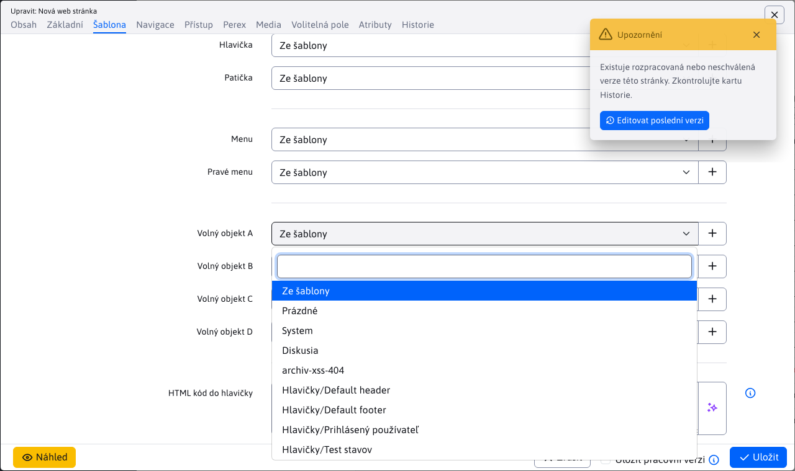
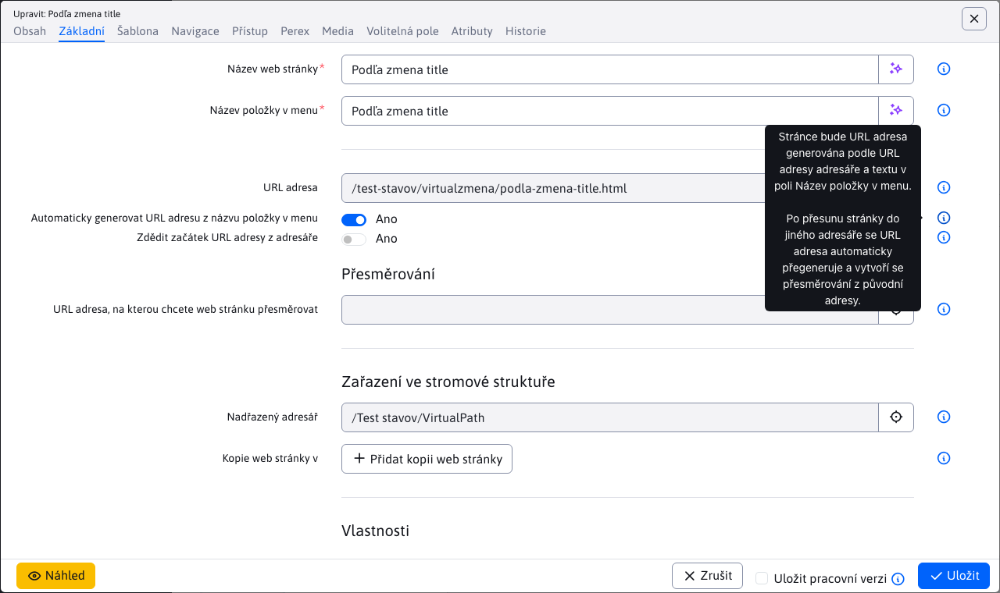
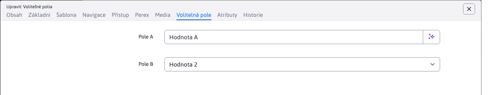
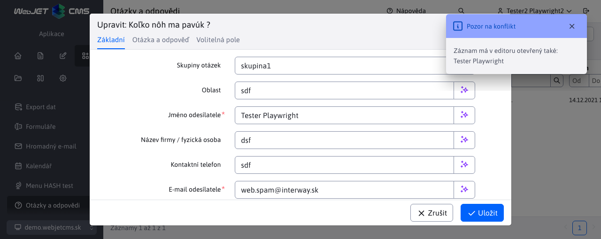
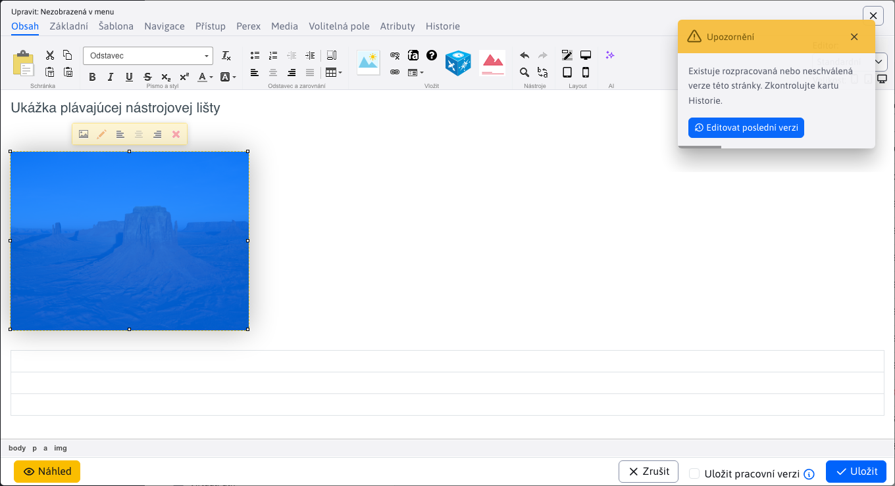
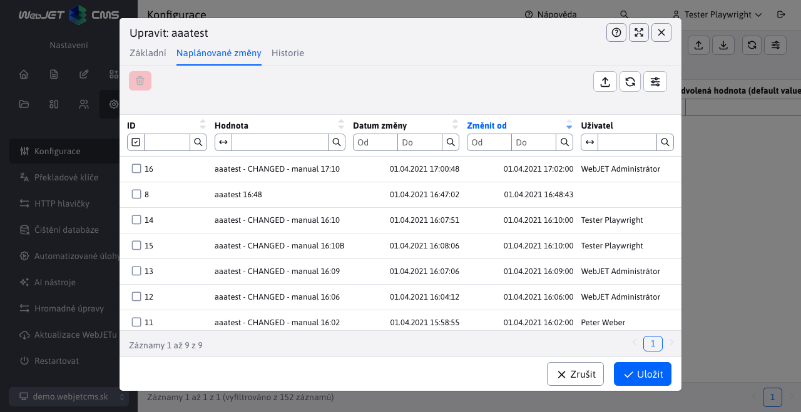

# Changelog verze 2021

## 2021.52

> Verze 2021.52 má nový design i pro staré verze aplikací, zlepšuje responzivní verzi, přidává nová pole web stránkám a zlepšuje chování URL adres stránek při jejich přesunu do jiného adresáře.

**Redesign verze 8**

Upravili jsme design aplikací staré verze 8 tak, aby barevné schéma a rozložení korespondovalo s designem nové verze WebJET CMS. Menu se chová stejně jako v nové verzi pro pohodlnější přechod mezi starými a novými aplikacemi (#54233).

Klepnutím na ikonu "Přepnout na verzi 8" v hlavičce, můžete stále přepnout rozhraní do designu verze 8.

**Web stránky**

- Přidána možnost uložit [pracovní verzi web stránky](redactor/webpages/README.md). Uloží se do historie a nebude zatím dostupná pro návštěvníky web sídla (#54161).

- Kompletně předělané [API editace web stránky](developer/apps/webpages/api.md) z původního `EditorDB` na `EditorFacade`. Web stránky se načítají a ukládají přes Spring DATA, což do budoucna umožní snadno přidávat nové databázové atributy (i specificky na klientských projektech). Je to jen jeden řádek v changelogu, ale reálně se jedná o 95 nových/změněných souborů (#54161).
- Přidána možnost otevřít z editoru další editor. Zatím je funkce implementována na pole Šablona web stránky v editoru stránek. Máte možnost klepnutím na tužku upravit nastavenou šablonu, nebo klepnutím na ikonu + přidat novou šablonu, aniž byste opustili editor stránky. Postupně bude tato funkce přidána i na další pole jako Hlavička, Patička, volná pole atp.

- Upravené pole pro zadání domény ve vlastnostech adresáře - zobrazuje se už jen pro kořenový adresář.
- Doplněno popisné/info texty k polím v editoru stránek a složky.
- Stavové ikony přesunuty do samostatného sloupce s možností filtrování podle stavu, přidána ikona oka pro přímé zobrazení web stránky ze seznamu stránek.

- Doplněna kontrola práv na možnost vytváření/editace/smazání web stránek a adresářů a kontrolu práv na jednotlivé adresáře (#54257).
- Doplněny stavové ikony do samostatného sloupce s možností filtrování a přímého zobrazení web stránky kliknutím na ikonu oka (#54257).
- Doplněny nezávislé možnosti nastavení zobrazení adresáře a web stránky v mapě stránek a v navigační liště. Verze 8 měla tyto možnosti navázané na zobrazení v menu. Někdy ale bylo třeba položky rozdílně zobrazovat v menu a např. v mapě stránek (#54205).

- Ve web stránce doplněna možnost nastavovat Volný objekt A-D v kartě šablona. Je tak možné měnit nejen hlavičky/patičky/menu, ale také volné objekty šablony pro každou web stránku zvlášť. Nastavit lze i prázdnou hodnotu.

- Přidány nové možnosti [automatického generování URL adresy stránky](redactor/webpages/editor.md#url-adresa) podle Název položky v menu (při přesunu do jiné složky se URL adresa automaticky změní), nebo možnost automaticky zdědit začátek URL adresy ze složky (při přesunu do jiné složky se počáteční část URL adresy automaticky změní) (#54237).

**Responzivní verze**

Dokončena generická verze administrace pro [mobilní zařízení](redactor/admin/README.md). Při šířce pod 1200 bodů se schová levé menu a hlavička, dostupné je po kliknutí na hamburger menu.

Při šířce méně než 992 bodů se okno editoru zobrazuje na celou velikost okna, při šířce méně než 576 bodů se názvy polí přesunou nad pole.

**Volitelná pole**

Přidána možnost [výběrového pole více možností](frontend/webpages/customfields/README.md#výběrové-pole-více-možností) zadáním prefixu `multiple:` před seznam možných hodnot. Hodnoty se do pole pak ukládají oddělené znakem `|`.

**Úvod**

- Pro snadnost použití nevyžaduje změna domény na stránce Úvod potvrzení (doméně se ihned změní).

**Konfigurace**

- Doplněný import a export konfigurace podle verze 8 ve kterém se exportuje do XML formátu a importuje se s porovnáním stávajících hodnot.
- Opravena úprava buňky, doplněna možnost upravovat i hodnotu.
- Opraveno zobrazení původní hodnoty a popisu po změně hodnoty.

**Data tabulky**

- Přidán nový typ datového pole pro číselníková pole typu `select` s možností [editace, nebo přidání záznamu](developer/datatables-editor/field-select-editable.md) do výběrového pole. Umožňují snadno upravit objekt, který se vybírá v poli, jako například. šablona stránky, odkaz na stránku hlavičky a podobně.

- Přidáno upozornění o konfliktu - pokud má okno editoru se stejným záznamem otevřený i jiný uživatel zobrazí se notifikace se seznamem ostatních uživatelů. Zobrazí se při otevření okna a následně se kontroluje každou minutu.

- Přidána možnost vkládat `tooltip` k polím v editoru s formátováním pomocí [Markdown formátu](developer/frameworks/webjetjs.md#markdown-parser). Kvůli bezpečnosti nelze vkládat odkazy a jiné než základní Markdown značky.
- Překladový klíč pro tooltip se automaticky hledá podle překladového klíče `title` se suffixem `.tooltip`. Máte-li tedy anotaci `@DataTableColumn(title = "group.superior_directory"` automaticky se hledá překladový text s klíčem `group.superior_directory.tooltip`. Pokud existuje, použije se.
- Opraveno vyhledávání podle dat v tabulkách s klientským stránkováním a nezobrazenými některými sloupci (špatně určený index sloupce).
- Doplněna možnost nastavení [stavových ikon](developer/datatables/README.md#stavové-ikony), zrušena původní možnost doplnění ikon k odkazu na otevření editoru pomocí funkce `addTextIcon` (to bylo nevhodné z UX pohledu).

**Deployment**

Upravený deployment na artifactory server. Do `ant/build.xml` přidán úkol `createUpdateZip`, která vytvoří a nahraje na licenční server aktualizaci ve formátu používaném pro přechodem na `gradle` verzi. Je tak snadno možné aktualizovat starší instalace WebJETu klasickým způsobem přes menu Ovládací panely ->Aktualizace WebJETu (#54225).

Upravené a srovnané archivy vůči staré verzi 8 tak, aby obsahovaly všechny potřebné soubory. Doplněna chybějící písma pro knihovnu `pd4ml` pro generování PDF souborů.

Pro povolení aktualizace na verzi 2021 kontaktujte [obchodní oddělení InterWay](https://www.interway.sk/kontakt/).

Upozornění: z důvodu velkého počtu změn v jaře knihovnách bude během aktualizace třeba provést restart aplikačního serveru. Přesvědčte se před aktualizací, že máte dostupnou technickou pomoc pro restart.

**Dokumentace**

- Doplněna dokumentace k uložení [pracovní verze web stránky](redactor/webpages/README.md).
- Pre-generované fotky obrazovky dokumentace k web stránkám.
- Připravený základ pro generování [JavaDoc dokumentace](../javadoc/index.html). Upraveno `docsify` pro otevírání JavaDoc dokumentace do nového okna.
- Web stránky - doplněná dokumentace pro [programátora k API](developer/apps/webpages/api.md).
- Vytvořená dokumentace [hlavních ovládacích prvků](redactor/admin/README.md) administrace a [přihlašování a odhlašování](redactor/admin/logon.md).
- Vytvořená dokumentace pro [výběrové pole s možností editace](developer/datatables-editor/field-select-editable.md).
- Doplněná dokumentace pro funkci [WJ.openIframeModal](developer/frameworks/webjetjs.md?id=iframe-dialóg) pro možnost nastavení textu tlačítka, pozice tlačítka pro zavření a události `onload` provedené po načtení obsahu modálního okna.
- Doplněná dokumentace pro funkci [WJ.hasPermission(permission)](developer/frameworks/webjetjs.md?id=kontrola-práv) pro kontrolu práv uživatele.
- Doplněná dokumentace pro funkci [WJ.parseMarkdown(markdownText, options)](developer/frameworks/webjetjs.md#markdown-parser) pro konverzi Markdown formátu do HTML kódu.
- Předělaná dokumentace nastavení ikon k použití [stavových ikon](developer/datatables/README.md#stavové-ikony).
- Doplněný manál pro redaktora o aplikace [Menu](redactor/apps/menu/README.md), [Navigační lišta](redactor/apps/navbar/README.md) a [Mapa stránek](redactor/apps/sitemap/README.md).
- Vytvořená dokumentace o možnostech generování URL adresy stránek [automatického generování URL adresy stránky](redactor/webpages/editor.md#url-adresa).

**Testy**

- Web stránky - doplněné nové testy pro uložení pracovní verze, notifikace při nastavení již existující URL adresy, notifikace při změně linky ve stránce (při přejmenování adresy stránky), notifikace při publikování se zadaným datem začátku, ověření časového publikování web stránky.
- Vytvořená funkce `DTE.fillCkeditor(htmlCode)` pro vložení HTML kódu do aktuálně zobrazeného CKEditoru.
- Doplněný test pro výběrové pole s možností editace is testem chyby obnovení údajů výběrových polí po uložení (polím se nedala změnit hodnota).
- Web stránky - doplněný test vyhledávání podle stavových ikon.
- Web stránky - doplněný test práv na jednotlivé funkce (přidat, editovat, smazat) a práv na jednotlivé adresáře (#54257).
- Web stránky - doplněný test nastavování URL adresy (#54237).

**Oprava chyb**

- Opraveno zobrazení nastavení datatabulky.
- Šablony - doplněna možnost Prázdné pro pole hlavičky/patičky/menu.
- Opraveno zobrazování pomocných textů tlačítek v galerii, mazání dat a skupinách uživatelů.
- Datatabulky - načtení údajů při duplikování záznamu při serverovém načítání dat (znovu načtení všech údajů před duplikací).
- Web stránky - opraveno načtení záznamů z historie a z karty Naposledy upraveno.
- Web stránky - opraveno nastavení prázdné hodnoty do pole `password_protected` (chybně se ukládal znak `,`).
- Datatabulky - opravena aktualizace záznamu z REST služby při označení více řádků, nebo při duplikování záznamů.
- Opraveno zobrazení pomocných textů (tooltip) tlačítek vlastností adresáře web stránek a v aplikacích galerie, mazání dat, skupiny uživatelů.
- Opraveno zobrazení filtru při nadpisu stránky v monitorování serveru a v aplikaci GDPR.
- Opraveno označení všech řádků při klientském stránkování - označí se pouze aktuální strana (#54281).

## 2021.47

> Verze 2021.47 přidává upravené aplikace Tooltip, Export dat, Hromadný-email/Doménové limity a Bannerový systém do nového designu. Přidali jsme oznámení o schvalování při uložení stránky a zlepšili mobilní verzi.

**Aplikace**

- Tooltip - administrace upravena na nový design, doplněna [dokumentace pro redaktora](redactor/apps/tooltip/README.md).

- Export dat - administrace upravena na nový design, doplněna [dokumentace pro redaktora](redactor/apps/export/README.md).

- Hromadný e-mail - Doménové limity - administrace upravena na nový design, doplněna [dokumentace pro redaktora](redactor/apps/dmail/domain-limits/README.md).

- Bannerový systém - administrace upravena na nový design, doplněna [dokumentace pro redaktora](redactor/apps/banner/README.md).

**Web stránky**

- Přidána notifikace při publikování stránky, která podléhá schvalování a notifikace pokud stránka má rozpracované/neschválené změny.

- V editoru v kartě Historie je tučným písmem zvýrazněna aktuálně publikovaná verze stránky.

**Data tabulky**

- Upraveno kopírování atributů existující entity při jejím editování. Standardně z editoru nemusí přicházet všechny atributy entity, proto se před uložením spojují hodnoty stávající entity a údajů zaslaných z editoru. Standardně se přepíší všechny ne `null` atributy. To ale neumožňuje zadat prázdné datum (pokud již bylo jednou nastaveno). Proto atributy anotovány DataTableColumn typu `Date` jsou přeneseny i když mají `null` hodnotu.

**Responzivní verze**

- Zlepšená zobrazení přihlašovací obrazovky na mobilních zařízeních.
- Upraveno zobrazení dialogového okna v mobilní verzi - okno je na plnou výšku, karty jsou na celou šířku okna, patička je nižší pro maximalizaci prostoru.
- Ve web stránkách v editoru lze prstem posouvat tlačítka editoru pro přístup ke všem tlačítkům editoru.
- Zrušené zalomení tlačítek v datatabulce do druhého řádku, nyní se jednoduše nezobrazí.
- Upravené zobrazení značek vyhledávání v tabulce - přesunuto z místa za tlačítky na nový řádek pod tlačítka.

**Bezpečnost**

- Vytvořená dokumentace pro [nastavení oprávnění a řešení bezpečnostních nálezů](sysadmin/pentests/README.md) z bezpečnostních/penetračních testů. Dokumentace se nachází v sekci Manuál pro provoz a je vhodné nastavení kontrolovat při spuštění web stránky/aplikace do produkce a následně při každé větší změně, minimálně jednou kvartálně.
- JavaScript knihovny aktualizovány na nejnovější verze, opravily se tak všechny zranitelnosti v těchto knihovnách. Knihovna Bootstrap aktualizována z verze 4 na verzi 5 (#54169).

**Dokumentace**

- Vytvořená dokumentace k [odesílání notifikací z REST služby](developer/datatables-editor/notify.md) datatabulky.
- Vytvořená dokumentace k [aplikaci Tooltip](redactor/apps/tooltip/README.md) pro redaktora.
- Vytvořená dokumentace k [aplikaci Export dat](redactor/apps/export/README.md) pro redaktora.
- Vytvořená dokumentace k [aplikaci Hromadný e-mail - Doménové limity](redactor/apps/dmail/domain-limits/README.md) pro redaktora.

**Oprava chyb**

- Opraveno aktualizování cache `TemplatesDB` při uložení stránky v lokálním (doménovém) Systém adresáři.

## 2021.45

> Verze 2021.45 přináší zobrazení seznamu web stránek iz podadresářů, zlepšuje zobrazení administrace na mobilních zařízeních a přidává aplikaci Otázky a odpovědi. Kromě toho obsahuje mnoho změn pod kapotou při práci se seznamem webových stránek (přechod na serverové stránkování a vyhledávání, použití Spring DATA pro přístup k databázi).

**Web stránky**

Přidána možnost zobrazit web stránky iz podadresářů přepnutím přepínače **Zobrazit stránky iz podadresářů** v hlavičce datatabulky. Po přepnutí do režimu zobrazení stránek z podadresářů se zobrazí stránky z aktuálně zvoleného adresáře ve stromové struktuře včetně jeho podadresářů. Ve stromové struktuře můžete kliknout na jiný adresář, což znovu způsobí zobrazení stránek z vybraného adresáře a jeho podadresářů.

- REST služba pro získání seznamu stránek předělaná k použití Spring DATA repozitářů.
- Umožňuje serverové stránkování a vyhledávání, což je výhodné při velkém množství stránek v adresáři.
- Vznikla třída `DocBasic`, která obsahuje společné údaje mezi tabulkami `documents` a `documents_history` a následné třídy `DocDetails` a `DocHistory`. Je dodržena zpětná kompatibilita třídy `DocDetails` s WebJET verze 8, i když jsme zkonvertovali primitivní typy na objekty (týká se hlavně datových objektů které kvůli kolizi jmen používají názvy `publishStartDate, publishEndDate, startDateDate`). Využívá se [dědění v JPA entitách](developer/backend/jpa.md#dědění-v-jpa-entitách).
- Karta přístup rozdělená na část skupiny uživatelů - přístup pro registrované uživatele a skupiny pro hromadný email podobně jako je tomu iv uživatelích.
- Editor - přidáno nastavení výběrového pole Formátování stylů podle aktuálně zobrazené stránky/šablony.
- Editor - přidána plovoucí nástrojová lišta vlastností objektů v editoru (např. obrázky, tabulky, formuláře).

**Responzivní verze**

Začali jsme práce na optimalizaci administrace pro mobilní zařízení. Standardní prvky díky použití `bootstrap` frameworku fungují, bylo ale zapotřebí odladit/opravit více detailů.

- Dialogové okno editoru je na mobilních telefonech roztaženo na celou velikost displeje. V režimu na výšku jsou názvy polí nad polem (ne nalevo jako u standardního zobrazení), šedé podbarvení názvů polí je schované. Hlavička a patička okna je nižší (#54133).
- Opraveno kliknutí na hamburger menu v mobilní verzi (#47428).
- Opraveno odsazení na úvodní stránce (#47428).
- Opraveno pole pro výběr domény (#54133).

**Aplikace**

- [Otázky a odpovědi](redactor/apps/qa/README.md) upraveno do nového designu administrace a přidána možnost nastavení [volitelných polí](frontend/webpages/customfields/README.md).

**Správa dat více domén**

Do REST rozhraní data tabulek jsme přidali systém pro podporu správy dat více domén (když např. aplikace Otázky a odpovědi zobrazuje v multi doménové instalaci vždy jen dotazy a odpovědi právě zvolené domény).

Použití je snadné rozšířením Spring DATA repozitáře ze třídy `DomainIdRepository<T, ID>`, o zbytek se postará přímo `DatatableRestControllerV2`. Více informací je přímo v dokumentaci [Oddělení údajů domén](developer/datatables/domainid.md).

**Data tabulky**

- Po vzoru web stránek přidáno do hlavičky každé datatabulky pole ID s [ID aktuálně editovaného záznamu](developer/libraries/datatable-opener.md). ID se nastaví také do URL adresy v prohlížeči jako parametr, po obnovení stránky s parametrem `?id=xxx` se automaticky otevře zadaný záznam v dialogovém okně editoru. Hodnotu lze zadat i do pole ID v hlavičce a po stisku klávesy enter se záznam vyhledá a zobrazí. Aktuální verze zadané ID vyhledává postupným stránkováním datatabulky, není to vhodné pro datatabulky, které mají velké množství záznamů (limit prohledání je 30 stran).

- Předělané vyhledávání v případě použití Spring DATA repozitáře typu `JpaSpecificationExecutor`. V takovém případě se vytvoří vyhledávání na základě `HTTP request` parametrů začínajících na výraz `search`. Nepoužije se již `ExampleMatcher` ale vyhledávací výraz se vyskládá na základě parametrů. Má to výhodu v tom, že v objektu mohou být použity i primitivní nebo ne `NULL` atributy (které by se v případě `ExampleMatcher` automaticky zahrnuli do vyhledávání).

**Obecné**

- Doplněna JS funkce `WJ.htmlToText` pro konverzi [HTML kódu na text](developer/frameworks/webjetjs.md#ostatní-funkce).

**Bezpečnost**

- Doplněn nový JPA konvertor `AllowSafeHtmlAttributeConverter` pro odstranění [nebezpečného HTML kódu](developer/backend/security.md) ze vstupních polí.

**Oprava chyb**

- Web stránky - opraveno načtení a ukládání stránky, která je ve více adresářích.
- Web stránky - opraveno duplicitní volání načítání seznamu web stránek při inicializaci (zbytečné volání REST služby).
- Datatabulky - opraveno zobrazení přepínače Úprava buňky ve vnořené tabulce v editoru.
- Datatabulky - opraveno duplikování ikony i při buňce a opětovném otevírání tabulky, která neobsahuje více karet.
- Datatabulky - opravené nastavení a získání HTML kódu při použití pole `QUILL` (implementováno v `app-init.js`).
- Datatabulky - opraveno zobrazení filtrů po přidání sloupců v tabulce přes její nastavení.

**Deployment**

Upravili jsme proces sestavení artifaktů nové verze. V této verzi se všechny Java třídy kompilují nově ze [zdrojového kódu původního WebJET](developer/install/deployment.md) 8 a zdrojového kódu verze 2021. V nové verzi někdy upravujeme Java třídy z původní verze 8, což může vést k nekompatibilitě se starým API. Z toho důvodu nastává kompletní zkompilování Java tříd, které zabrání nebo detekuje nekompatibilitu API.

**Testy**

- Aktualizován CodeceptJS na verzi 3.1.3 a Playwright na verzi 1.16.3. Nastala tam změna v chování okna (`BrowserContext`) které se pro každý scénář nově otevře (má nový `BrowserContext`) a bylo potřeba upravit několik testů (hlavně galerie kde se používá v ID selektoru znak /, který je třeba korektně escapovat přes zpětné lomítko).
- Upraveno automatizované testování datatabulek - funkce `createSteps` a `editSteps` se jmenuje před nastavením povinných polí.
- Vytvořená funkce `DTE.fillField(name, value)` pro vyplnění standardního pole podle jeho jména na backende/json definici.
- Vytvořená funkce `DTE.fillQuill(name, value)` pro vyplnění hodnoty v poli typu `QUILL`.
- Vytvořený test pro aplikaci otázky a odpovědi.
- Doplněný test filtrování web stránek podle `boolean` a `password_protected` sloupce.
- Web stránky - vytvořený test `webpage-spring.js` pro verzi se serverovým stránkováním.
- Web stránky - doplněné testy do `webpages.js` pro zobrazit web stránky iz podadresářů.

**Dokumentace**

- Vytvořená nová sekce [Backend/Bezpečnost](developer/backend/security.md) v dokumentaci pro programátora.
- Vytvořená dokumentace k [otevření editoru](developer/libraries/datatable-opener.md) podle `id` parametru v URL.
- Vytvořený základ dokumentace k bezpečnosti. Obsahuje zatím informaci k [nebezpečnému HTML kódu](developer/backend/security.md).
- Vytvořená dokumentace pro [oddělení údajů domén](developer/datatables/domainid.md).
- Vylepšený příklad použití [volitelných polí](developer/datatables-editor/customfields.md) v editoru s využitím třídy `BaseEditorFields`.
- Vytvořená dokumentace k možnosti použití [dědění v entitách](developer/datatables/restcontroller.md#dědění-v-jpa-entitách).
- Vytvořená dokumentace k použití [dědění v JPA entitách](developer/datatables/restcontroller.md#dědění-v-jpa-entitách).

## 2021.40

> Verze 2021.40 přináší předělanou správu uživatelů, skupin a skupin práv a předělanou aplikaci GDPR do vizuálu WebJET 2021. Kromě toho přidává množství drobných vylepšení a oprav.

**Uživatelé**

- [Seznam uživatelů](admin/users/README.md), [skupiny uživatelů](admin/users/user-groups.md) a [skupiny práv](admin/users/perm-groups.md) předělané na datatabulku a REST rozhraní.
- Doplněno [zvýraznění skupin práv](admin/users/README.md) v jednotlivých právech. Pomocí barevných kruhů zvýrazňuje práva ve skupině práv, na první pohled tak umíte identifikovat práva, která skupina obsahuje.

- Doplněny ikony jednotlivých práv až do 3. úrovně.
- Volitelná pole v uživatelích [lze konfigurovat](developer/datatables-editor/customfields.md) podobně jako pro web stránky pomocí překladových klíčů `user.field_x.type`.
- Pokud uživatel nemá nastavené datum registrace (z historických důvodů) nastaví se toto datum na aktuální při jeho uložení (#53985).

**GDPR**

- Předělaná část [Správa regulárních výrazů](redactor/apps/gdpr/regexps.md) do designu verze 2021 (#53905).
- Předělaná část [Cookie Manažer](redactor/apps/gdpr/cookiesmanger.md) do designu verze 2021 (#53881).
- Předělaná část [Mazání dat](redactor/apps/gdpr/data-deleting.md) do designu verze 2021 (#53985).
- Předělaná část [Vyhledávání](redactor/apps/gdpr/search.md) do designu verze 2021 (#53989).

**Překladové klíče**

- Pole s hodnotou překladu již není povinné pro možnost zadání prázdné hodnoty.

**Zakázkové aplikace**

- Vytvořený základ pro [tvorbu zákaznických aplikací](custom-apps/admin-menu-item.md). Ty se vytvářejí v adresáři `/apps/` na rozdíl od staré verze z adresáře `/components/` (#54045).
- Aplikace jsou vkládány do designu [přímo z html kódu](custom-apps/admin-menu-item.md#frontend), není třeba vytvářet a kompilovat pug soubory.
- Vytvořená funkce [WJ.breadcrumb](developer/frameworks/webjetjs.md#navigační-lišta) pro generování navigační lišty.
- Do navigační lišty je možné pomocí makra `{LANGUAGE-SELECT}` vložit výběrové pole pro jazyk.

**Export a import**

- Upravený export a import dat z/do datatabulky pro použití sloupců z editoru (oproti původní verzi, která používala sloupce v tabulce). Editor obvykle obsahuje více sloupců než tabulka a ty jsou potřebné pro korektní import dat (#54097).
- Exportovány jsou také seznamy adresářů/stránek/adresářů na souborovém systému, které používají typ pole `json`. Exportovány i importovány jsou v zobrazení celé cesty (např. `/Slovensky/Novinky`).
- Vytvořená dokumentace pro [programátora](developer/datatables/export-import.md) i [redaktora](redactor/datatables/export-import.md).

**Překladač**

WebJET integruje možnost [překladu textů](admin/setup/translation.md), aktuálně je podporován překladač [DeepL](https://www.deepl.com/). Automatický překlad je podporován v aplikaci [zrcadlení struktury](redactor/apps/docmirroring/README.md).

**Web stránky**

- Přidána možnost vynuceného [obnovení stromové struktury](developer/apps/docmirroring.md) nastavením atributu `RequestBean.setAttribute("forceReloadTree", Boolean.TRUE);`.
- Doplněno zobrazení textu "Zpracovávám" při použití drag\&drop ve stromové struktuře (což při použití zrcadlení struktury může trvat několik sekund).
- Objektem `DocDetails` a `GroupDetails` doplněna anotace atributu `fullPath` s celou cestou k web stránce/adresáři. Ve výchozím nastavení se nezobrazuje, v nastavení datatabulky lze zapnout zobrazení.

**Formuláře**

- Pro formuláře obsahující více než 5000 záznamů (nastavitelné v konf. proměnné formsDatatableServerSizeLimit) se používá serverové zpracování.
- Vyhledávání - při serverovém zpracování je podporováno pouze vyhledávání "Začíná na" ostatní možnosti jsou odstraněny z hlavičky tabulky, podporováno je vyhledávání maximálně v 6 sloupců najednou.
- Vyhledávání - doplněna možnost kombinování vyhledávání podle data a podle hodnoty ve sloupci.
- Seznam i detail formuláře je ve výchozím nastavení uspořádán podle data vyplnění posledního formuláře.
- Upravený odkaz na detail formuláře dle design manuálu.
- Podporováno je hledání v maximálně 6 sloupcích najednou.
- Opraveno pořadí sloupců podle definice formuláře (předtím se zobrazovaly sloupce v náhodném pořadí).

**Data tabulky**

- Doplněný JPA konvertor `DocDetailsConverter` a `DocDetailsNotNullConverter` mezi `doc_id` v databázi a objektem `DocDetailsDto` pro snazší použití pole typu JSON pro výběr ID stránky. Konverter `NotNull` vrátí při `NULL` objektu hodnotu `-1`.
- Doplněný JPA konvertor `GroupDetailsConverter` mezi `group_id` v databázi a objektem `GroupDetails` pro snazší použití pole typu JSON pro výběr ID adresáře.
- Pro pole typu JSON [pro výběr jedné stránky nebo adresáře](developer/datatables-editor/field-json.md#možnosti-classname) doplněna možnost smazat nastavenou hodnotu nastavením typu pole na hodnotu `dt-tree-group-null` pro adresář nebo `alebo dt-tree-page-null` pro web stránku.
- Pro pole typu JSON doplněna možnost `null` objektu `Group/DocDetails`. Původní verze pro `null` objekt nezobrazila ani pole pro výběr adresáře/stránky, nová verze zobrazí prázdné pole.
- Přidána možnost [nastavení nadpisu](developer/datatables-editor/datatable-columns.md#vlastnosti-datatablecolumneditor) před vnořenou datatabulku na samostatné kartě nastavením atributu `data-dt-field-full-headline`.
- Přidána možnost [vynuceného zobrazení sloupců](developer/datatables/README.md#možnosti-konfigurace) (např. pro vnořenou datatabulku) nastavením konfigurační možnosti `forceVisibleColumns`.
- Přidána možnost zavolat JavaScript funkci pro [úpravu seznamu sloupců](developer/datatables/README.md#možnosti-konfigurace) (např. pro vnořenou datatabulku) nastavením konfigurační možnosti `updateColumnsFunction`.
- Přidána možnost [doplnit CSS styl přepínačem karet](developer/datatables-editor/README.md#karty-v-editoru) v editoru atributem `className`, pomocí CSS stylu `hide-on-create` lze schovat kartu při vytváření nového záznamu.
- Přidána možnost [skrýt kartu na základě práv](developer/datatables-editor/README.md#karty-v-editoru) v editoru atributem `perms`.
- Do třídy `DatatableRestControllerV2` přidaná metoda `public void afterSave(T entity, T saved)` volána po uložení entity (objekt `entity` je původní odeslaný objekt, `saved` je uložena verze - při novém záznamu se `ID` nachází jen v `saved` entite).
- Do třídy `DatatableRestControllerV2` přidaná metoda `public void afterDelete(T entity, long id)` volána po smazání entity.
- Přidáno pole typu `jstree` pro zobrazení [stromové struktury](developer/datatables-editor/field-jstree.md) s výběrovými poly uzlů stromu.
- Pole typu `json` rozšířeno o možnost [výběru seznamu adresářů souborového systému](developer/datatables-editor/field-json.md).
- Přidána pole `HIDDEN, RADIO, PASSWORD` pro `DatatableColumnType`.
- Zjednodušený proces práce s [doplňkovými/vnořenými atributy](developer/datatables-editor/datatable-columns.md#vnořené-atributy), `editorFields` v REST controlleru. Implementací metod `processFromEntity` a `processToEntity` zajistíte korektní mapování dat mezi entitou a `editorFields` objektem.
- Import - doplněné podmínky pro `domainId` aby se při importu aktualizovaly pouze záznamy aktuální domény.
- Import - upravený import s párováním záznamů podle vybraného sloupce pro používání API `insertItem` a `editItem` aby import fungoval i pro REST rozhraní nepoužívající Spring DATA repozitáře.
- Import - upravené dialogové okno tak, aby se zobrazila chybová zpráva ze serveru při chybě importu.
- API - doplněná metoda `getOneItem(long id)` pro získání jedné položky. Použití je místo původní `getOne` co je REST metoda (přepisování REST metod není doporučeno).
- Upravené designové chyby u výběrových polí při přechodu myší a zobrazení skrytého sloupce.
- Přidána možnost [zobrazení HTML kódu](developer/datatables/README.md#zobrazení-html-kódu) v buňce nastavením CSS stylu `allow-html` (#53989).
- Při volání `getAllItems` se automaticky detekuje možnost `serverSide` (na základě URL parametru `size`). Není-li detekován použije se volání `repo.findAll()` bez `Pageable` parametru pro vrácení všech záznamů.
- Zobrazení filtru pro zadání data se přizpůsobuje velikosti - pokud je pole prázdné je úzké aby zbytečně nezabíralo šířku sloupce, po zadání hodnoty se pole automaticky zvětší. Velikost polí je také rozdílná pro pole datum a datum+čas (#54097).
- Doplněno načtení všech dat řádku ze serveru před editováním buňky, protože samotná datatabulka nemusí vždy obsahovat všechna data potřebná pro editor (#54109).

**Bezpečnost**

Integrovaná kontrola kvality hesla. Využívá knihovnu [zxcvbn-ts](https://zxcvbn-ts.github.io/zxcvbn/), která hodnotí kvalitu hesla na základě více parametrů. Kromě standardních pravidel jako **délka** hesla, **velké** písmena, **speciální** znaky kontroluje v hesle také:
- posloupnost znaků na klávesnici, například. `asdf`
- data a roky
- opakující sekvence typu `abcabc`
- běžná jména a příjmení
- známá hesla jako `password`

Knihovna má **vestavěný slovník nejpoužívanějších hesel** a jmen, vůči kterým kontroluje heslo.

Kontrola je implementována v administraci při vytváření/úpravě uživatele ale i do přihlašovací stránky v administraci, na které informuje uživatele o kvalitě zadaného hesla.

REST rozhraní datatabulek upravené pro použití `ThreadLocal` objektu, který drží lokální informace (např. že se jedná o export dat), aby nedocházelo k přepisování informací mezi více požadavky.

**Zlepšení použitelnosti**

- Upravená pozice dialogového okna pro nastavení sloupců a počet záznamů na straně v datatabulce (pozice 5% shora podobně jako má editor). Upraveno dvojité zobrazení tmavnutí pozadí.
- Zvětšená velikost dialogového okna pro nastavení sloupců pro zobrazení ve 4 sloupcích, přidány možnosti zobrazení 1000 a 2000 záznamů na stranu.
- Předělaná ikona Úprava buňky na posuvné pole pro lepší zobrazení stavu.
- Upraveno `hover` stavy ve výběrových polích a výběru data a času.
- Přejmenovány některé názvy aby lépe odpovídaly skutečnosti (konfigurace, přesměrování, skupiny šablon).

**Testy**

- Vytvořeno testy pro aplikaci zrcadlení struktury.
- Upraveno časování více testů (korektní čekání na provedení namísto fixních čekání).
- Přidána funkce `I.getRandomTextShort()` pro získání kratšího náhodného řetězce (ve formě mmddrnd).
- V automatizovaném testu datatabulek upraveno ověření zobrazení sloupce (ověřují se pouze sloupce s nastaveným atributem `visibleOriginal=true`, neboli pouze ty, které se zobrazují ve standardním zobrazení).
- Přidána možnost [automatizovaného testování importu](developer/testing/datatable-import.md) z Excelu do datatabulky.

**Dokumentace**

- Vytvořená dokumentace k [překladači](admin/setup/translation.md).
- Vytvořená dokumentace k právům uživatele - [pro správce](admin/users/README.md), [pro vývojáře](developer/apps/users/README.md).
- Vytvořená dokumentace k [typu pole jstree](developer/datatables-editor/field-jstree.md).
- Doplněna dokumentace o možnosti rozšíření pole typu `json` o [zakázkovou verzi](developer/datatables-editor/field-json.md#vlastní-konfigurace-zobrazené-stromové-struktury) jsTree struktury.
- Doplněná dokumentace [Definice hotového](developer/guidelines/definition-of-done.md) o podmínky testování exportu a importu datatabulek.
- Vytvořená dokumentace [seznam uživatelů](admin/users/README.md), [skupiny uživatelů](admin/users/user-groups.md) a [skupiny práv](admin/users/perm-groups.md).

**Oprava chyb**

- Datatabulky - opraveno nastavení volitelných polí při nově vytvářeném záznamu.

## 2021.26

**Data tabulky**

- Přidána volba `onRowCallback` pro možnost [stylování řádku](developer/datatables/README.md#stylování-řádku-a-ikony) na klientské straně (např. označení řádku jako neaktivního).
- Přidána možnost nastavit [výchozí hodnotu](developer/datatables-editor/datatable-columns.md#vlastnosti-datatablecolumn) při vytvoření nového záznamu pomocí atributu `defaultValue` anotace `@DatatableColumn`. Podporována jsou i makra pro nastavení aktuálně zvolené domény nebo data a času.

**Testy**

- Doplněna možnost generování [Allure](developer/testing/README.md#generování-html-reportu) reportů.

## 2021.24

> Verze 2021.24 přidává možnost duplikovat záznamy v data tabulkách, automatické otevření kořenových adresářů pokud doméně obsahuje například. pouze adresář Česky a Anglicky (max. 2 adresáře), umožňuje provádět hromadnou úpravu ve web stránkách a zlepšuje ve více místech komfort práce.

**Web stránky**

- Přejmenování doménového jména doplněné o možnost automatického přejmenování prefixu domény v překladových klíčích a konfiguračních proměnných s prefixem staré domény.
- Pokud stromová struktura obsahuje maximálně 2 adresáře (nastavitelné v konfigurační proměnné webpagesTreeAutoOpenLimit) automaticky se zobrazí otevřené pro pohodlnější práci (#53805).
- V okně výběru rodičovského adresáře je automaticky otevřen kořenový adresář pro krásnější a pohodlnější zobrazení.
- Pokud pro aktuální doménu existuje lokální `System` adresář nebude se globální `System` adresář zobrazovat ve stromové struktuře (např. při výběru rodičovského adresáře stránky).
- Upraveno iniciální načtení seznamu stránek - zobrazí se seznam stránek pro první adresář ve stromové struktuře.
- Při automatickém vytvoření doménového `System` adresáře (konf. proměnná `templatesUseDomainLocalSystemFolder=true` a uložení kořenového adresáře) se automaticky vytvoří i pod adresáře Hlavičky, Patičky a Menu.
- Použití ckeditor upraveno na standardní [datové pole datatabulky](developer/datatables-editor/field-wysiwyg.md).
- Při editaci více řádků se již ckeditor chová jako standardní pole datatabulky a umožňuje ponechat samostatný HTML kód/text jednotlivých řádků, nebo nastavit do všech označených řádků stejný HTML kód/text.

**Galerie**

- Úprava stromové struktury předělaná z VUE komponenty na datatabulku po vzoru web stránek (#53561).
- Doplněné možnosti pre-generovat obrázky a Aplikovat na všechny podsložky do vlastností adresáře (#53561).
- Při smazání adresáře stromové struktury se smažou i soubory z disku.
- Opraveno opakované odesílání údajů upravené fotky z editoru obrázků.
- Opraveno ukládání obrázku z editoru obrázků (špatně inicializovaný adresář pro uložení).

**Data tabulky**

- Doplněna funkčnost duplikování záznamů v tabulce. Do nástrojové lišty přidáno fialové tlačítko Duplikovat. Je možné najednou označit i více řádků.

- Doplněna možnost obnovit zobrazené sloupce podle originálního nastavení ze serveru. Nastavení uživatele se smaže a obnoví se originální viditelnost sloupců.
- Do editoru doplněno otevření nápovědy kliknutím na ikonu otazníku v patičce dialogového okna.
- Doplněno zvýraznění povinného pole pomocí znaku \*.
- Při kontrole povinných polí zobrazeno i hlášení u tlačítek pro uložení. Může se stát, že povinné pole je v jiné než aktuálně zobrazené kartě a uživatel tak nevěděl proč se po kliknutí na uložení nic nestalo. Takto se zobrazí vždy viditelné chybové hlášení.
- Předělaná validace polí pomocí anotací na [překladové klíče z WebJETu](developer/datatables/restcontroller.md#validace--povinná-pole). Upravena zobrazená chybová hlášení na formát "Co způsobilo chybu. Co má uživatel udělat".

**Testy**

- Doplněn test rozbalení první úrovně adresářové struktury.

**Dokumentace**

- Doplněn popis datových typů a povinných polí pro [anotace datatabulek](developer/datatables-editor/datatable-columns.md).
- Vytvořená dokumentace k datovému poli [wysiwyg](developer/datatables-editor/field-wysiwyg.md).
- Doplněna dokumentace k označování [povinných polí](developer/datatables-editor/datatable-columns.md#povinná-pole) v anotacích.
- Rozšířená dokumentace o [validacích pomocí anotací](developer/datatables/restcontroller.md#validace--povinná-pole).

**Oprava chyb**

- Datatabulka - Pro výběrová pole, která mají možnosti definované přímo v JSON definicích se možnosti přenesou přímo do výběrového pole filtru.
- Přesměrování a Přesměrování domén - zrušeny nepotřebné položky pro přidání záznamu v menu, upravené zobrazení, aby možnost editace byla jen na druhém sloupci jak je to standardně všude.
- Monitorování serveru - opraven výchozí rozsah grafů na hodnotu posledních 14 dnů.
- Datatabulka - opraveno zvýraznění označených řádků po uložení, pokud přijatá data obsahují nastavení CSS stylu řádku - zachová se CSS styl `selected` i `highlight`.

## 2021.20

> Verze 2021.20 přidává zobrazení a konfiguraci [volitelných polí](frontend/webpages/customfields/README.md) pro web stránku a adresář stránek a přidává (konečně) tlačítko pro zobrazení web stránky do nástrojové lišty datatabulky.

**Volitelná pole**

Implementovali jsme univerzální funkčnost volitelných polí (původní název Vlastní pole ve WebJET 8) do web stránek a adresářů web stránek (adresářům nebylo ve WebJET 8 možné najmout typy polí). Ve web stránkách a adresářích tak lze snadno nastavovat různé typy polí.

Připravili jsme dokumentaci s informacemi o [nastavení volitelných polí](frontend/webpages/customfields/README.md) pro frontend programátora i dokumentaci s [technickými informacemi](developer/datatables-editor/customfields.md) pro backend programátora.

**Web stránky**

- Přidáno tlačítko do nástrojové lišty datatabulky pro zobrazení web stránky. Označit lze i více řádků a najednou zobrazit v nových listech zvolené web stránky.

**Dokumentace**

- Volitelná pole - informacemi o [nastavení volitelných polí](frontend/webpages/customfields/README.md) pro frontend programátora.
- Volitelná pole - [technické informace](developer/datatables-editor/customfields.md) pro backend programátora.
- Testování - snímky obrazovky - doplněná informace a příklad s [možností nastavení CSS stylů](developer/testing/screenshots.md?id=Úprava-css-štýlov) před vyfocením snímku obrazovky.
- Doplněná dokumentace k WebJET JS funkcím - [Dialog pro výběr souboru/odkazu](developer/frameworks/webjetjs.md?id=dialóg-pre-výber-súboruodkazu).

**Testy**

- Volitelná pole - doplněný základní test zobrazení volitelných polí ve web stránce a v adresáři web stránky.
- Překladové texty - doplněný test kontroly práv na modul a práv na Editace textů - zobrazení všech textů.

**Oprava chyb**

- Web stránky - opraveno použití API funkce `wjEdit`, doplněná funkce `wjEditFetch`, která také obnoví data ze serveru. Upraveno automatické otevření stránky podle zadaného `docid` URL parametru pro použití funkce `wjEditFetch` pro získání seznamu volných polí.
- Překladové klíče - doplněná kontrola práv na změnu překladového klíče, opraveno duplikování klíče po změně.
- Překladové klíče - doplněné vyvolání změny klíče v interní cache a v cache clusteru.
- Překladové klíče - doplněná kontrola a test na právo Editace textů - zobrazení všech textů.

## 2021.18

> Verze 2021.18 automaticky vytvoří [doménový](frontend/setup/README.md), `System` složka, přidává editaci [značek](redactor/webpages/perexgroups.md) (perex skupin), vylepšuje chování editace buňky a opravuje chybu zobrazení číselníkových hodnot v datatabulce. Administrace používá nové písmo `Asap`.

**Web stránky**

- Přidáno automatické vytvoření `System` složky při uložení kořenového adresáře domény v režimu se zapnutou konfigurační proměnnou `templatesUseDomainLocalSystemFolder=true` (#53685).
- V seznamu hlaviček, patiček, menu a volných objektů ve web stránce a šabloně se v režimu `templatesUseDomainLocalSystemFolder=true` zobrazují také webové stránky z [první úrovně pod složek](frontend/setup/README.md) pro možnost jejich organizace (#53685).
- Editor - doplněno automatické smazání textu Nová web stránka v titulku stránky po kliknutí do pole. Automatický přenos hodnoty i do pole Název položky v menu a smazání URL adresy pokud obsahuje výraz Nová web stránka.
- Skupiny šablon - upravený seznam složek - zobrazuje se kompletní obsah složky `/templates`, přičemž ve složkách začínajících na jméno (log)instalace se jméno instalace z hodnoty automaticky odstraní (následně jej přidá `combine.jsp`, ale v databázi je hodnota uložena bez jména instalace).

**Značky (perex skupiny)**

- Přidána možnost přidávat/upravovat/mazat [značky (perex skupiny)](redactor/webpages/perexgroups.md), dostupné jako nová menu položka v části Web stránky (#53701).

**Datatabulka**

- Úprava buňky - přidána možnost upravovat [jednotlivé buňky](developer/datatables-editor/bubble.md) přímo v datatabulce i pro editor obsahující samostatné dopisy (dosud to fungovalo jen v editoru bez dopisů). Přidána možnost nastavit needitovatelné buňky.

- Upravená možnost přepsat metodu `searchItem` v `DatatableRestControllerV2` pro vyhledávání. Nedoporučuje se přepsat přímo REST metodu `findByColumns`, protože to u zákaznických projektů dělá vnitřní problém ve Spring-u (#53677).

**Administrace**

- Změněné písmo na řez `Asap` (#53689).

**Dokumentace**

- Přidána první dokumentace pro [frontend programátora](frontend/setup/README.md) s popisem nastavení WebJETu při správě více domén a použití lokálního `System` složky.
- Přidána základní dokumentace k [značkám](redactor/webpages/perexgroups.md).

**Testy**

- Doplněn test automatické změny a přenosu hodnoty Nová web stránka v titulku editoru stránek.
- Doplněný test editace značek (perex skupin) a jejich zobrazení ve web stránce podle adresářů.

**Oprava chyb**

- Web stránky - opravena možná JavaScript chyba pokud iniciální údaje při zobrazení seznamu stránek obsahují ukončující script značku.
- Web stránky - opraveno pre-generování URL adres stránek
- Datatabulky - opravené nastavení CSS třídy buňky pro datové sloupce pokud mají zároveň nastaveno `cell-not-editable`. Datatable zjevně ignoruje atribut `className` v `columnDefs` pokud `className` není prázdné. Potřebná hodnota se tedy posílá již ze serveru.
- Datatabulky - refaktorované použití typu `TEXT_NUMBER` na `NUMBER` pro přesné zobrazení čísel větších než 999. V režimu `TEXT_NUMBER` se zobrazují takové hodnoty zaokrouhlené jako např. `2 tis.`.
- Editace textů - opraveno vyhledávání v zákaznických projektech.
- Datatables - opraveno zobrazení číselníkových údajů při vlastním zobrazení seznamu sloupců (#53653).

## 2021.13

> Verze 2021.13 zlepšuje uživatelský zážitek zvýšením rychlosti zobrazení seznamu web stránek, možnost zadat ID stránky nebo adresáře pro její zobrazení (včetně zapamatování v URL adrese prohlížeče), možnost nastavení zobrazených sloupců v datatabulce, překlady v JavaScript souborech a řadu dalších vylepšení v celém WebJETu.

**Optimalizace rychlosti zobrazení**

Optimalizovali jsme [rychlost zobrazení seznamu web stránek](developer/apps/webpages/README.md). Minimalizovali jsme úvodní REST volání, která jsou nahrazena vložením prvotních dat přímo do HTML kódu stránky. Při zobrazení stromové struktury není třeba čekat na dokončení dalšího požadavku na server. Upravili jsme také pořadí načítání JavaScript souborů pro snížení zatížení CPU (některé soubory se načítají asynchronně až po zobrazení seznamu stránek) (#53513).

- V datatabulce seznamu web stránek se ve výchozím nastavení zobrazují pouze základní sloupce, přes nastavení tabulky lze zapnout zobrazení i ostatních sloupců. Základní zobrazení ale výrazně snižuje zatížení procesoru/prohlížeče při vykreslování tabulky.
- Optimalizované načítání seznamu stránek - nenačítá se zbytečně seznam médií a pole poznámka (načte se až při otevření editoru stránek).
- Ve skryté datatabulce pro editaci adresáře se stejně jako pro web stránku zobrazují jen základní sloupce. Jelikož tato datatabulka je skrytá ani nemá smysl zobrazit všechny sloupce a zbytečně zatěžovat procesor při jejím vykreslení.
- Údaje pro kořenové adresáře stromové struktury jsou poslány přímo v HTML kódu stránky bez potřeby volání REST služby.
- Předěláno načtení adresáře při editaci. Původní verze používala objekt vrácený pro stromovou strukturu `jstree` a při editování záznamu volala obnovení objektu. Technicky ale datatabulka nezískávala aktuální položky pro výběrové seznamy (`options`) dle aktuálního adresáře - všude se zobrazoval např. stejný seznam všech šablon. Upravená verze volá před editováním záznamu obnovení seznamu datatabulky, což načte z REST služby i aktuální hodnoty pro výběrové seznamy.
- První volání `refresher-a` je provedeno až 10 sekund po načtení web stránky.
- Knihovna pro import dat z `XLSX` je inicializována až po otevření dialogového okna importu.
- Ve vnořené datatabulce jsme optimalizovali načítání dat - datatabulka (např. list Média nebo Historie v seznamu stránek) se inicializuje a načte data z REST služby až po kliknutí na daný list. Pokud uživatel nepotřebuje média nebo historii zobrazit tak se nemusí zbytečně volat REST služba a z pohledu procesoru se nemusí inicializovat vnořená datatabulka.

**Web stránky**

- Přidána možnost editovat stránku podle zadaného ID stránky (`docid`) v URL parametru nebo zadáním do textového pole v datatabulce. Automaticky se pro zadané ID otevře adresářová struktura a následně se otevře editor stránky. Při zadání přes URL parametr se také korektně nastaví doména ve výběrovém poli domén (#53429).
- Přidána možnost zadat ID adresáře pro editaci zadáním do textového pole nebo jako URL parametr.
- Na úvodní stránce upravené odkazy v seznamu Moje poslední stránky i Změněné stránky tak, aby směřovaly do editoru stránek.
- Adresář - přidáno zobrazení plánovaných verzí a historie adresáře s možností editace záznamu podle historické/plánované verze.
- Přidáno zobrazení seznamu Naposledy upravené (seznam stránek, které naposledy upravoval libovolný uživatel v aktuální doméně) a Čekající na schválení (zobrazí se pouze pokud existují stránky, které má schválit aktuálně přihlášený uživatel) (#53493).

**Administrace**

- Přidáno [publikování události](developer/frameworks/thymeleaf.md#vložení-vlastních-objektů-do-modelu), `ThymeleafEvent` při zobrazení stránky administrace. Umožňuje dynamicky vkládat objekty do modelu stránky.

**Překlady**

Implementovaný framework pro [překlad textů v JavaScript souborech](developer/frameworks/jstranslate.md). Sestává z `REST` služby poskytující mapu překladový klíč-text a z JavaScript knihovny poskytující překlad na základě klíče. Knihovna zároveň zajišťuje uložení překladových klíčů do paměti prohlížeče a jejich aktualizaci při změně textu překladu (#53128).

Fixní texty byly nahrazeny překladovými klíči v JavaScript souborech `index.js` pro datatabulku a `webjet.js` pro globální funkce.

Během implementace vzniklo několik knihoven pro zobrazení logů v konzole prohlížeče, přístup k `storage` objektu prohlížeče a spouštění událostí. Standardně již nelze využívat událost `$(document).ready`, protože nejprve musí být inicializováno úložiště překladových klíčů. Implementovali jsme vlastní funkci `window.domReady.add`, která je provedena až po inicializaci úložiště překladových klíčů.

Celý systém překladů pro JavaScript soubory je implementován jako knihovna a lze jej v budoucnu snadno využít iv jiných projektech (i např. v Angular/VueJS aplikacích).

**Konfigurace**

- Doplněno zobrazení změn v konfigurační proměnné do listu Historie, změny tak není třeba vyhledávat pouze v auditu, ale se ukládají samostatně do databáze pro jejich snadné zobrazení.
- Přidána možnost šifrovat hodnotu a plánovat změnu hodnoty do budoucna.
- Doplněný list Plánování pro zobrazení plánovaných změn, hodnoty v budoucnu lze smazat.

**Datatabulky**

- Přidána podpora vyhledávání anotací iv rodičovské třídě `Java beanu` (pokud např. rozšiřujete stávající třídu).
- Metoda `DatatableRestControllerV2.throwError(String errorKey)` upravena pro použití překladových klíčů (automaticky přeloží zadaný klíč na text), upravené použití metody v aktuálním kódu (fixní texty změněny na překladové klíče).
- Přidána podpora vkládání vnořené datatabulky v listu, který obsahuje již jiná pole. Upravené počítání výšky datatabulky s ohledem na ostatní pole. Předěláno odsazení v CSS, aby vnořená datatabulka mohla být od kraje po kraj a zobrazení šedého bloku pod názvy polí.
- Přidána podpora `DATE` polí, původní verze podporovala jen `DATETIME`.
- Přidána možnost automaticky [schovat některá tlačítka](developer/datatables/README.md#možnosti-konfigurace) v nástrojové liště datatabulky nastavením možnosti `hideButtons`.
- Přidána možnost použít prvotní údaje přímo z proměnné namísto volání REST služby nastavením objektu do vlastnosti `initialData` v konfiguraci datatabulky.
- Zobecněné [hledání podle jména uživatele](\(developer/datatables/restcontroller.md#zobrazení-jména-uživatele-a-vyhledávání\)) při ukládání pouze ID v databázi.
- Přidána možnost nastavit vlastní funkci spravující otevření editoru přes možnost `onEdit` konfigurace datatabulky.
- Přidáno zapamatování si nastavených sloupců v zobrazení datatabulky. Nastavení se ukládá v prohlížeči a je v něm zapamatováno pro aktuálně přihlášeného uživatele. (#53545)

**Obecné**

- Doplněna možnost používat `autocomplete` i [mimo datatabulky](developer/datatables-editor/autocomplete.md#použití-mimo-datatabulky).
- Doplněna nová přihlašovací obrazovka do administrace (pro jednoznačné rozlišení WebJET 2021) (#53617).

**Testy**

- Testy upravené pro asynchronní inicializaci datatabulek.
- Doplněný test kontrolující dostupné šablony pro editaci adresáře.

**Dokumentace**

- Vytvořená dokumentace k [překladem v JavaScript souborech](developer/frameworks/jstranslate.md)
- Vytvořená dokumentace k novým knihovnám [Translator](developer/libraries/translator.md), [StorageHandler](developer/libraries/storage-handler.md), [Store](developer/libraries/store.md), [Tools](developer/libraries/tools.md), [ReadyExtender](developer/libraries/ready-extender.md).
- Vytvořená dokumentace k [optimalizaci rychlosti zobrazení](developer/apps/webpages/README.md) seznamu web stránek.
- Doplněna dokumentace k datatabulce - doplněn [seznam možností konfigurace](developer/datatables/README.md#možnosti-konfigurace).
- Vytvořená dokumentace k možnosti [vkládání vlastních objektů](developer/frameworks/thymeleaf.md#vložení-vlastních-objektů-do-modelu) do modelu v `Thymeleaf` na backendu.
- Doplněna dokumentace ke knihovně jstree o informaci o vložení [inicializačních dat](developer/jstree/README.md#konfigurace).
- Doplněna dokumentace k vyvolání obecné chyby v datatabulce ak [zabránění editace nebo smazání](developer/datatables/restcontroller.md#zabránění-smazání--editace-záznamu) záznamu.
- Doplněna dokumentace k [zobrazení a vyhledávání podle jména uživatele](developer/datatables/restcontroller.md#zobrazení-jména-uživatele-a-vyhledávání) při uložení pouze ID v databázi.
- Doplněna dokumentace k fungování [seznamu web stránek](developer/apps/webpages/README.md) - zobrazení dopisů naposledy upravené a čekající na schválení

**Oprava chyb**

- Opraveno zobrazení seznamu šablon při přidávání/úpravě adresáře web stránky. Šablony se již zobrazují podmíněně podle nastavených adresářů (původní verze zobrazovala všude všechny šablony).
- Opravena distribuční verze pro jiné projekty (Spring DATA repozitáře, chybějící soubory, aktualizované knihovny závislostí).

## 2021.12

**Web stránky**

- Doplněna ikona pro import a export stránek v XML formátu podle původní funkčnosti WebJET 8 (#53497).

**Testy**

- Doplněn test zobrazení ikony pro import a export stránek v XML formátu, včetně ověření otevření importního okna.

## 2021.11

> Verze 2021.11 přidává zobrazení historie web stránky s možností editace, zobrazení a porovnání.

**Web stránky**

- Zfunkčněný dopis Historie v editoru stránek. Umožňuje načíst web stránku z historie do editoru, zobrazit stránku z historie a porovnat aktuální verzi vůči historické verzi (#53385).

**Datatabulky**

- Přidána funkce `$.fn.dataTable.Buttons.showIfOneRowSelected(this, dt);` pro zobrazení tlačítka když je označen přesně [jeden řádek](developer/datatables/README.md#přidání-odebrání-tlačítek).
- Rozšířená možnost konfigurace [vnořené datatabulky](developer/datatables-editor/field-datatable.md) v editoru pomocí Java anotací. Umožňuje nastavit způsob uspořádání, nebo vypnout serverové stránkování.

**Obecné**

- Do projektu nastaven [mapstruct](developer/backend/mapstruct.md) ve verzi 1.4.2.

**Dokumentace**

- Přidána nová sekce Programátor WebJET CMS/Aplikace a moduly pro vývojářskou dokumentaci specifickou pro aplikace/moduly/části WebJET CMS.
- Manuál pro redaktora doplněný o základní informace k [historii stránky](redactor/webpages/history.md).
- Přidána dokumentace k zobrazení [historie web stránek](developer/apps/webpages/README.md).
- Přidána dokumentace a ukázka k mapování [DTO objektů](developer/backend/mapstruct.md) přes framework `mapstruct`.
- Rozšířená dokumentace k přidávání [tlačítek datatabulky](developer/datatables/README.md#přidání-odebrání-tlačítek).

**Oprava chyb**

- Audit - zamezené mazání řádků auditu na REST službě.
- Vnořená datatabulka - přidané volání `deselect` před načtením nových dat vnořené datatabulky, aby se korektně nastavila tlačítka (deaktivovala se, vyžadují-li zvolený řádek).
- Opraveno volání `TABLE.hideButton` - tlačítka schová jen v dané tabulce, ne ve všech (přidáno omezení na ID tabulky při hledání tlačítek v DOM stromu).

## 2021.10

> Verze 2021.10 opravuje chybu velikosti dialogového okna v editoru stránek a opravuje několik gramatických chyb v popisech aplikací.

**Web stránky**

- Na základě testů práce s web stránkou upraveny texty v seznamu aplikací.
- Opraveno nastavení velikosti dialogového okna při vkládání aplikace nebo formulářových prvků v editoru stránek.
- Opraveno zobrazení výstrahy při vkládání formuláře do stránky.
- Opraveno nastavení možnosti Povolená hodnota při vkládání formulářového prvku textové pole/oblast podle nastavených regulárních výrazů ve formulářích.

**Testy**

- Doplněné testy pro web obsah web stránky (přidání tabulky, najdi a nahraď, vložení obrázku, krok zpět, vložení speciálního znaku).

## 2021.8

> Verze 2021.8 přidává **správu médií (připojených souborů k web stránce)** a jejich skupin. Oproti WebJET 8 přidává možnost spravovat média samostatně s možností vyhledání stránek používajících určité médium a podobně.

**Média**

- Přidána zpráva médiím a médiím skupin (#52462).
- Integrované do web stránky v záložce média jako vnořená datatabulka (#52462).
- Přidána menu položka Média s možností editace všech médií a správy média skupin do menu Web stránky.
- Přidáno právo Média - správa všech médií pro zobrazení seznamu všech médií s možností globálních úprav médií (např. vyhledání všech médií odkazujících na určitou linku nebo obrázek).

**Datatabulky**

- Pro datové pole typu `elfinder` je vyvolána událost `change` po nastavení hodnoty (pro možnost poslechu události změny).
- Upravené získání adresy REST služby editoru ze statického volání pro dynamický výpočet voláním `WJ.urlAddPath(DATA.url, '/editor')` pro možnost změny URL adresy REST služby za běhu.
- Datové pole datatabulka - doplněno nastavení velikosti a pozice sloupců hlavičky po zobrazení karty s datatabulkou.
- Datové pole datatabulka - zapnuto atributy `fetchOnEdit, fetchOnCreate` pro obnovení údajů při editaci a přidání nového záznamu.
- Datové pole datatabulka - doplněno korektní nastavení URL adresy REST služby při změně rodičovského objektu (když se např. změní ID stránky).
- Datové pole elfinder - přidáno vyvolání události `change` po výběru souboru v dialogovém okně.

**Bezpečnost**

- Datatabulky - přidáno zobrazení chybové zprávy při vrácení chyby z REST služby.

**Obecné**

- Třídy `PathFilter, WebjetSecurityService` přesunuty do WebJET 8.
- Audit - přidaný typ auditního záznamu `ADMINLOG_NOTIFY` pro seznam notifikací v auditu

**Testy**

- Doplněna možnost programově [odebrat práva](developer/testing/README.md#odebrání-práva) aktuálně přihlášenému uživateli (aplikuje se pouze na uživatele s přihlašovacím jménem `tester`).
- Do automatizovaného testu datatabulky přidána možnost [kontroly práva](developer/testing/datatable.md#testování-práv).
- Do automatizovaného testu datatabulky doplněna možnost testovat vnořenou datatabulku (datové pole datatable) pomocí možnosti `options.container`.
- Upravené testy na nové nastavení databáze - multi domény, přidané typy auditových záznamů, zlepšené časování.
- Přidán test použití [CSRF tokenu](../src/test/webapp/tests/admin/security.js).
- Přidána funkce `DT.checkPerms(perms, url)` pro [kontrolu práv](developer/testing/README.md#odebrání-práva) volání REST služeb.
- Přidána funkce `I.jstreeNavigate(pathArray)` pro [postupné kliknutí](developer/testing/README.md#webjet-doplňkové-funkce) na zadané názvy.
- Přidány testy pro [média](../src/test/webapp/tests/webpages/media-groups.js) a [média skupiny](../src/test/webapp/tests/webpages/media-groups.js).

**Dokumentace**

- Doplněná dokumentace k funkci [WJ.dispatchEvent](developer/frameworks/webjetjs.md#ostatní-funkce).
- Doplněna dokumentace k datovému poli [datatable](developer/datatables-editor/field-datatable.md).
- Doplněna dokumentace k [možnostem nastavení](developer/testing/datatable.md#možnosti-nastavení) datatabulky.
- Přidána dokumentace k možnosti [odebrání práv](developer/testing/README.md#odebrání-práva) při testování.
- Přidaná dokumentace základní dokumentace k [používání Médii](redactor/webpages/media.md) pro redaktora

**Oprava chyb**

- Modální okno - opraveno nastavení událostí kliknutí pro modální okno volané přes `WJ.openIframeModal`. Jelikož modální okno je používáno pro různé adresy vloženého iframe je třeba dynamicky nastavovat funkci po kliknutí. Původní verze ji po nastavení nezměnila a po zavření dialogu a otevření nového se vyvolala i původní `click` akce. To například. způsobilo nastavení linky z `elfinder` datového pole do více polí v editoru.
- Menu - opraveno zobrazení menu a aktivní položky při volání `/admin/v9/` adresy bez lomítka na konci. URL adresy menu položek normalizované s lomítkem na konci.

## 2021.7

> Verze 2021.7 přidává kontrolu spojení se serverem a zobrazení chybového hlášení při chybě spojení, nebo chybě bezpečnostního (CSRF) tokenu. Zfunkčnili jsme karty Systém a Koš ve web stránkách a přidali první text manuálu pro redaktora. Celý changelog jsme zkontrolovali na pravopis.

**Konfigurace**

- Přidán našeptávač hodnoty Jméno konfigurační proměnné (#52999).
- Přidáno doplnění staré hodnoty a popisu i pro nově přidávanou konfigurační proměnnou (#52999).
- Upravené zobrazení varování o zobrazení pouze změněných konfiguračních proměnných na standardní toast notifikaci, která se po 10 sekundách schová.

**Web stránky**

- Zlepšili jsme viditelnost pole Poznámka redaktoru - při načtení stránky, která nemá prázdnou poznámku redaktoru se zobrazí standardní notifikace s textem poznámky. Zobrazena je 15 sekund.

- Zfunkčnili jsme karty Systém a Koš a připravili první text [manuálu pro redaktora](redactor/webpages/README.md) s popisem chování těchto karet.
- Seznam web stránek je filtrován podle zvolené domény (zobrazí se pouze složky a web stránky z aktuálně zvolené domény)
- Při vytváření nové složky je automaticky nastavena doména

**Datatables**

- Doplněna možnost přidání našeptávače/autocomplete k textovým polím
- Upravili jsme stylování polí - mají odsazení z horní strany a ne spodní, není třeba mít vypnuté odsazení na posledním poli (to může být při editaci skryto, což způsobilo nesprávné nastavení spodního odsazení)
- Doplněno posunutí obsahu (scroll) první záložky při zavření a znovu otevření okna (#53119)

**Obecné**

- Doplnili jsme WJ funkce na [formátování data a času](developer/frameworks/webjetjs.md#formátování-data-a-času) v JavaScriptu (#52999).
- Doplnili jsme systém pro udržování spojení se serverem a zobrazení chybového hlášení při přerušení spojení a při chybě bezpečnostního tokenu (#53119).
- Notifikace - při přechodu myší přes notifikaci s progress barem se po odchodu myši progress bar spustí nově. (#53131)

**Testy**

- Web stránky - přidán test chyby zobrazení backdropu (ztmaveného pozadí) (#53131).
- Web stránky - přidán test zobrazení poznámky redaktora (#53131).
- Web stránky - přidán test změny domény
- Web stránky - přidaný test karet systém a koš
- Konfigurace - upravený test na používání waitFor namísto fixního wait, upravené generování výrazu na standardní I.getRandomText
- Konfigurace - doplněný test úpravy proměnné po jejím přidání a editace hned po editaci (bez obnovy okna), backend nenastavil korektně ID záznamu a nastávala chyba
- Skripty, Web stránky - upraveno pro používání adresáře Test stavů namísto test23

**Dokumentace**

- Přidána dokumentace k [našeptávači/autocomplete](developer/datatables-editor/autocomplete) textových polí
- Doplněna dokumentace k CSS třídám [disable-on/hide-on](developer/datatables-editor/README#možnosti-konfigurace-columns-objektu) pro editor
- Doplněna dokumentace k udržování [spojení se serverem](developer/frameworks/webjetjs.md#udržování-spojení-se-serverem-refresher) (#53119)
- Doplněno formátování ukázek příkazového řádku (použité shell formátování)
- Doplněná dokumentace ke [generování screenshotů](developer/testing/screenshots.md) pro dokumentaci
- Vytvořili jsme základ [definice používaných termínů/výrazů](developer/guidelines/terms.md), aby všude bylo používáno stejné názvosloví
- Doplnili jsme rozšíření pro kontrolu pravopisu ve VS Code a zkontrolovali pravopis v souboru changelog.md

**Oprava chyb**

- Datatabulka-editor - opravené vkládání čáry (`data-dt-field-hr`) pro editor bez záložek (listů) - při druhém otevření editoru se rozdělovací čára nezobrazila(#52999).
- Datatabulka-editor - opravené schování backdrop (ztmavené pozadí) při otevření a zavření oken různých editorů (např. ve web stránkách editace adresáře a následně web stránky) - při určité kombinaci se backdrop neschoval a okno se dále nedalo použít. Původní verze používala schování přes odebírání CSS stylů, opravena používá modal API. (#53131)
- Notifikace - opraveno zobrazení progress baru notifikace (CSS transition způsobovala anomálie). (#53131)
- Konfigurace - opraveno chyba při přidání a následné editaci konfigurační proměnné (#53137)
- Web stránky - opravená funkčnost přepínání domén v hlavičce administrace

## 2021.5

> Verze 2021.5 pokračuje v opravě chyb. Zaměřili jsme se na automatizované testy v sekci web stránky, zkušenosti jsme shrnuli do nové sekce Best practices v dokumentaci k testování.

**Web stránky**

- Přenesené změny v editaci formulářů z WebJET 8 - použití Bootstrap CSS tříd pro formuláře a tabulky.
- Po smazání adresáře se do seznamu web stránek načte obsah kořenového adresáře (nezůstane tam seznam stránek smazaného adresáře).
- Zatím nefunkční karty Systém, Koš, Naposledy upravené označené žlutou barvou (jako TODO).
- Doplněno jquery-ui-autocomplete.

**Testy**

- Zrychlení provedení testů - testy si mezi scénáři pamatují cookie, nemusí před každým scénářem proběhnout přihlášení uživatele.
- Upravili jsme generování názvů pro testy, používají unifikovanou funkci I.getRandomText() pro získání unikátního řetězce.
- Aktualizovaná verze CodeceptJS na verzi 3.0.5, smazaný a nově vygenerovaný package-lock.json pro načtení nových verzí všech závislostí

**Dokumentace**

- Doplněná sekce [Best practices](developer/testing/README.md#best-practices) k testování.

**Oprava chyb**

- Web stránky - opravené chyby v textech (diakritika, překlepy) (#52639).
- Web stránky - opraveno vytvoření prázdné stránky (#52639).
- Web stránky - opraveno chybné zobrazení web stránek při výběru adresáře (#52639).
- Web stránky - adresář - opravená nastavení Aplikovat na všechny podsložky Dostupnost složky pro veřejnost (#52639).
- Web stránky - opravena JS chyba při mazání stránky ihned po načtení (bez editace) - prázdný JSON objekt editoru.
- Datatabulky - při otevření dialogu se již nezobrazují chybová hlášení z předchozího uložení (#52639).
- Datatabulky - opraveno zobrazení hlášení Opravdu chcete smazat tuto položku? v editaci (po zrušení smazání) (#52639).

## 2021.4

> Verze 2021.4 je zaměřena na opravu chyb. Do automatizovaných testů jsme doplnili možnost vizuálního srovnání a doplnili testy pro aplikaci skripty.

**Skripty**

- doplněny překlady cookie klasifikace

**Datatables**

- upravené generování filtru datatabulky - pro pole typu výběrové pole (select) se ve filtru automaticky generuje výběrové pole (namísto textové oblasti)
- prázdná hodnota výběrového pole změněna z Nothing selected na prázdnou hodnotu (aby bylo chování podobné jako standardní textová pole)
- doplněné překlady textu při označení více řádků
- přidána možnost lokálně vyhledávat v HTML kódu (výchozí datatabulka HTML kód při vyhledávání automaticky odstraňuje). Funkce je aktivována automaticky na pole typu `DataTableColumnType.TEXTAREA`, v případě potřeby lze aktivovat nastavením `className` na hodnotu `html-input`.

**Web stránky**

- aktualizované PageBuilder bloky

**Testy**

- do přihlašovací sekvence přidáno nastavení velikosti okna
- přidána [podpora vizuálního testování](developer/testing/README.md#vizuální-testování) (porovnání obrázků), výsledkem je vizuální zvýraznění chybné oblasti růžovou barvou: 
- přidána funkce pro snadné nastavení výběrového pole filtru datatabulky [ZN.filterSelect(name, value)](developer/testing/README.md#webjet-doplňkové-funkce)

**Dokumentace**

- Testy - doplněná dokumentace k možnosti [spuštění konkrétního scénáře](developer/testing/README.md#spuštění-testování)
- Testy - doplněná dokumentace k [podpora vizuálního testování](developer/testing/README.md#vizuální-testování)
- Deployment - doplnili jsme popis činností, které je třeba provést před deploymentem [nové verze](developer/install/deployment.md).

**Oprava chyb**

- Web stránky - nastavení konfiguračních proměnných `pixabayEnabled` a `editorImageAutoTitle`
- Web stránky - vkládání obrázku přes Drag\&Drop v editoru stránek
- Web stránky - mazání adresářů obsahujících znak : v názvu
- Datatables - opraveno zobrazení nastavení datatabulky (zobrazení výběrového menu bez oříznutí a pozice)

## 2021.2

> Verze 2021.2 přináší datové pole pro vnořené datatabulky (např. seznam médií ve web stránce) a výběr odkazu na soubor/obrázek/jinou web stránku (např. pole přesměrování nebo perex obrázek). Vytvořili jsme první verzi dokumentace Definition of Done.

**Datové pole elfinder**

#52609 - Přidali jsme datové pole pro [Datatables Editor - Elfinder](developer/datatables-editor/field-elfinder.md) - výběr souboru. Integruje do editoru datatabulky výběr odkazu na soubor pomocí aplikace elfinder/soubory. Pole se zobrazuje jako textové pole, na konci má ikonu tužky. Klepnutím na ikonu se otevře dialogové okno s elfinderem/výběrem souboru.

**Datové pole datatable**

#52351 - Přidali jsme nové datové pole pro Datatable Editor - [vnořená datatabulka](developer/datatables-editor/field-datatable.md). Umožňuje v rámci editoru datatabulky zobrazit další datatabulku. Např. v editoru stránek zobrazit datatabulku připojených médií.

Refaktorovali jsme kód v index.js a přesunuli definici datových polí json a datatable do samostatných souborů [field-type-json.js](../src/main/webapp/admin/v9/npm_packages/webjetdatatables/field-type-json.js) a [field-type-datatable.js](../src/main/webapp/admin/v9/npm_packages/webjetdatatables/field-type-datatable.js)

**Web stránky**

- přidaný list Navigace podobně jako pro složku obsahující pořadí uspořádání a nastavení zobrazení v menu (#52609)
- přidán výběr perex obrázku a odkazu přesměrování přes nové pole typu elfinder (#52609)
- přidáno zaškrtávací pole Zobrazovat pro možnost vypnutí zobrazení web stránky (#52609)

**Datatable**

- #52351 - přidána možnost `nestedModal` (boolean): pokud je nastaveno na true, jedná se o datatabulku vloženou jako pole v editoru - [vnořená datatabulka](../datatables-editor/field-datatable.md), vnořená tabulka má přidanou CSS třídu `DTE_nested_modal`.
- #52351 - upravený import pro možnost vkládání vnořených vlastností (např. `editorField.groupDetails`)
- #52351 - generovaný JSON z anotace objektu obsahuje atribut `array`, který definuje, že se jedná o objekt typu pole. Využívá se při importu dat pro nastavení korektní hodnoty.
- upravené nastavení CSS stylů řádku z možnosti `createdRow` na `rowCallback`, které se jmenuje i po změně dat (aby se CSS třídy řádku aplikovaly po změně stavu, např. po vypnutí zobrazování web stránky se změnila barva na červenou) (#52609)
- z důvodu vysokého počtu dopisů ve web stránkách byl upraven poměr mezi label a hodnotou z `col-sm-5/col-sm-6` na `col-sm-4/col-sm-7` (#52609)

**Dokumentace**

- přidána nová sekce Požadavky na vývoj, vytvořený základ [Definice hotového - Definition of Done](developer/guidelines/definition-of-done.md)
- dokumentace k [použití Gitlabu](developer/guidelines/gitlab.md) přesunuta do nové sekce Požadavky na vývoj
- vytvořená dokumentace k [Datatable pole - vnořená datatabulka v editoru](developer/datatables-editor/field-datatable.md)
- vytvořená dokumentace k [Datatable pole - elfinder/výběr souboru](developer/datatables-editor/field-elfinder.md)
- doplněná dokumentace k otevření [dialogového okna typu iframe](developer/frameworks/webjetjs.md#iframe-dialog)

**Oprava chyb**

- datatables editor - opravené nastavení CSS stylů na `multi checkboxoch` (obalení `custom-switch`). Původně se CSS nastavily jen při prvním otevření okna, ale při změně `options` hodnot (např. při přechodu do jiného adresáře) se regenerovaly a zobrazily se místo posuvníků jako standardní zaškrtávací pole. Nastavení se nyní provede při každém otevření okna editoru. (#52609)
- datatables editor - opravená chyba při které zůstal zobrazen backdrop dialogu po zavření okna (nastalo v situaci otevřít okno editoru, zrušit, otevřít okno složky, zrušit, otevřít znovu okno editoru, zrušit - backdrop zůstal otevřený). Přidáno volání `$("div.modal-backdrop").hide();` při zavření okna editoru. (#52609)

## 2021.1

> 2021.1 přináší editaci adresáře web stránek a aktualizovaný testovací framework

**Editace adresáře**

Doplněný dialog editace adresáře o TODO položky (kromě historie a plánování, které čekají na integraci datatable do editoru a nových nastavení menu, které čekají na datové změny v `documents` tabulce a následnou implementaci v komponentách mapa stránky a navigační lišta). Jedná se o velkou změnu: 42 komitů, 27 změněných souborů.

- upravené načtení dat pro Datatable Editor až po kliknutí na ikonu editace - ušetří se tak jedno volání REST služby při každém kliknutí na adresář. Využívá se `GroupDetails` objekt z jstree, který se uměle nastaví do datatabulky přes API. Příklad je v [web-pages-list.pug](../src/main/webapp/admin/v9/views/pages/webpages/web-pages-list.pug) ve funkci `loadTablesForGroup`.
- při kliknutí na ikonu editace se aktualizují data ze serveru a až následně se zobrazí editor, doplněná i animace ukazatele postupu v ikoně editace
- opravena chyba, kdy při kliknutí na ikonu editace adresáře se nic nestalo a bylo třeba kliknout znovu (starý kód měnil stav zaškrtávacího pole namísto jeho nastavení, takže se při prvním kliknutí zaškrtl a při druhém od škrtl a proto bylo třeba znovu kliknout).
- přidána kontrola `multiDomain` pro zobrazení pole domény v editoru
- upravené odstupy, rozdělovací čáry, tlačítko pro nastavení adresáře v JSON poli podle grafického návrhu
- přidán nový list Navigace s nastavením zobrazení menu položek, navigační lišty a pořadí uspořádání (původně to bylo v listu Přístup, což je nelogické)

**Datatables**

- doplněno zvýraznění vadného pole při validaci + zobrazení obecného hlášení u tlačítek (jelikož chyba může být v kartě, kterou není vidět). Upraveno pro konfiguraci (kontrola práv na přidání proměnné), galerie (kontrola práv na adresář), web stránky-adresář (kontrola nastavení rodiče sama sebe/potomka).
- JSON pole pro výběr adresáře již obsahuje také kořenový adresář (pro možnost nastavení rodičovského adresáře do kořene). Nastavuje se pomocí CSS třídy `dt-tree-group-root`
- opravené získávání `true/false` hodnot získané z `options` polí, kde se hodnota přenáší jako řetězec (pro výběrová pole). V index.js je ve funkci `fixOptionsValueType` hodnota korektně konvertována na `boolean` typ
- přidán nový event `WJ.DTE.xhrfetch` vyvolaný po načtení dat do editoru (při fetchOnEdit). Ten je standardně stále v DOM stromu otevřený a nefungují tak standardní eventy `opened`.

**Obecné**

- do `DocDetails` doplněno `doc.getFullPath()` pro použití ve VueJS výběru a zobrazení cesty v datatabulce, upraveno v [InsertScriptDocBean](../src/main/java/sk/iway/iwcm/components/insertScript/InsertScriptDocBean.java)
- smazaný starý kód v [TemplateDetailService](../src/main/java/sk/iway/iwcm/components/templates/TemplateDetailsService.java) generující cestu k adresáři (již se používá standardní JSON pole)
- přidáno nastavení atributů (`data-dt-field-hr`, `data-dt-field-headline`) na JSON pole (umožňuje korektně zobrazit čáru před/za a nadpis před polem)
- přidáno zobrazení hlášení při volání Ajax požadavků a chybě 401 (odhlášení) nebo 403 (nesprávný CSRF token)

**Testování**

- #52444 Aktualizovaný framework CodeceptJS na verzi 3.0.4. Stará verze 2.x nefungovala korektně na macOS Big Sur (z důvodu staré verze `playwright`). Úprava si vyžádala i úpravu zápisu všech testovacích scénářů. Opraveny testy pro jstree drag & drop.

**Dokumentace**

- doplněná dokumentace k [použití editorField](developer/datatables-editor/datatable-columns.md#vnořené-atributy)
- doplněná dokumentace k [stylování řádku a ikony](developer/datatables/README.md#stylování-řádku-a-ikony)
- doplněná dokumentace k možnosti [vyvolání chybové zprávy](developer/datatables/restcontroller.md#validace--povinná-pole) při editování položky (metoda `throwError`)
- doplněná dokumentace k

## 2021.0

> 2021.0 má novou úvodní obrazovku po přihlášení, doplněné ikony stromové struktury a seznamu web stránek a doplněnou sekci zrušen/nepodporovaných vlastnosti v dokumentaci

**Úvodní obrazovka**

Doplněn první návrh úvodní obrazovky. Obsahuje zatím seznam přihlášených administrátorů, ToDo, seznam aplikací upravených pro WebJET 2021, sumář seznamu změn a grafy monitorování serveru. Prováděno pomocí Vue komponent.

**Web stránky**

- #52396 - přidána ikona "Znovu načíst údaje ze serveru" pro stromovou strukturu (obnovení stromové struktury adresářů)
- #52396 - stromová struktura upravená tak, že po kliknutí na adresář se automaticky otevře (pro lepší použitelnost)
- #52396 - stromová struktura zobrazuje už jen adresáře, web stránky jsou zobrazeny v datatabulce
- #52396 - upravené zobrazení ikon adresářů, přidané zobrazení ikon pro web stránky
- #52396 - drag\&drop je povolen pouze při aktivní možnosti "Povolit přesouvání", přesouvaný objekt nastylovaný

**Datatables**

- #52396 - Přidána možnost stylování řádků a přidání doplňkových ikon, [dokumentace](developer/datatables/README.md#stylování-řádku-a-ikony).
- #52396 - Sloupce s prázdným `title` (nebo obsahující tvrdou mezeru) se v tabulce nezobrazí (obvykle se jedná o nějaké doplňkové zaškrtávací pole)

**Dokumentace**

- #52384 - dokumentace spuštěna i na doméně http://docs.webjetcms.sk/ a rozdělena na dokumentaci pro WebJET 8 a WebJET 2021, upravené linky, nastaven `docsify`
- #52396 - doplněná dokumentace k použití ikon v [jstree](developer/jstree/README.md#způsob-použití-ikon) a [datatabulce](developer/datatables/README.md#stylování-řádku-a-ikony)
- #52444 - doplněná dokumentace k použití [npm](developer/frameworks/README.md#npm)

