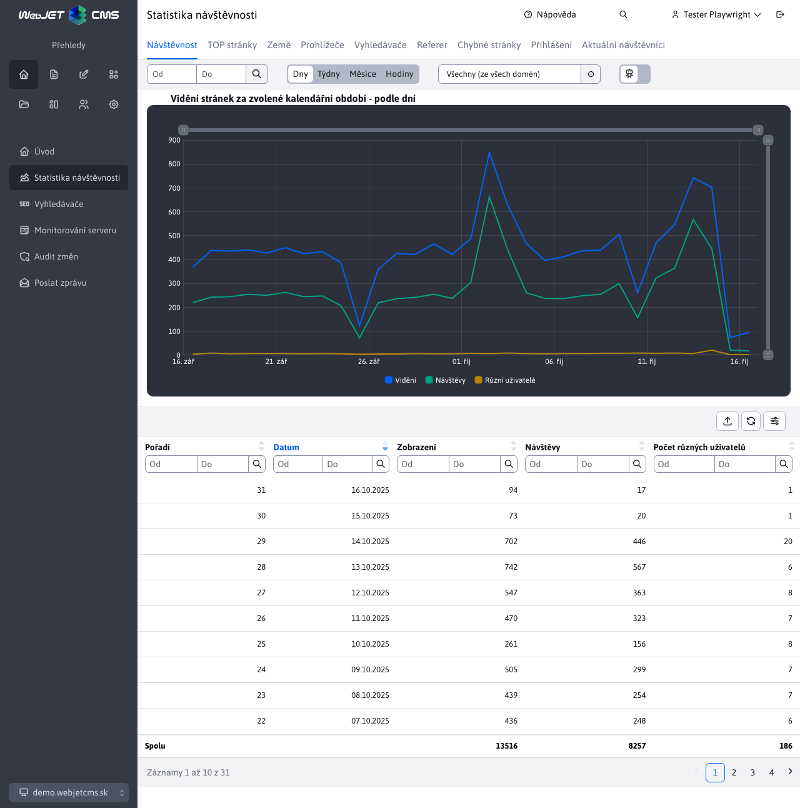
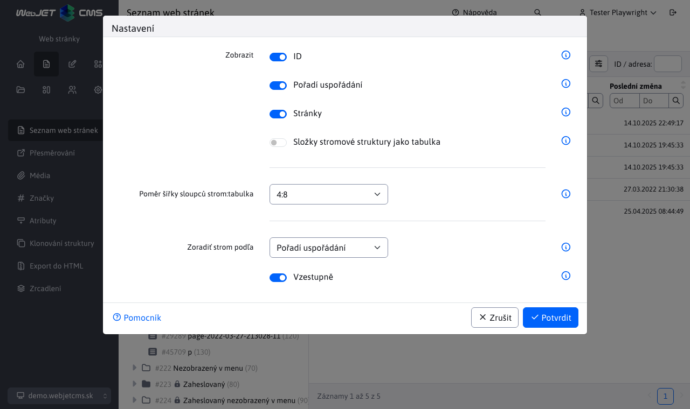
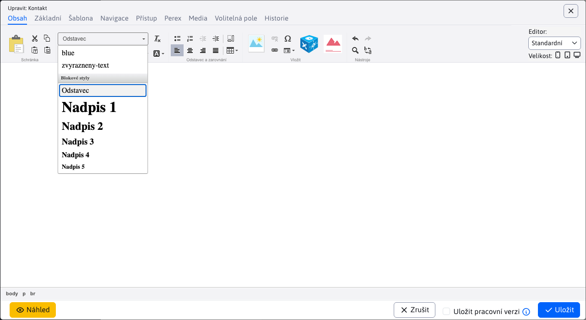
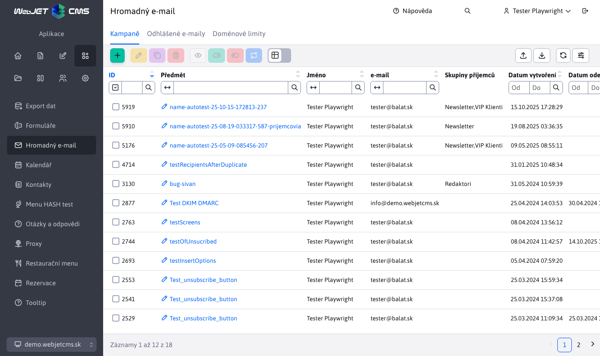
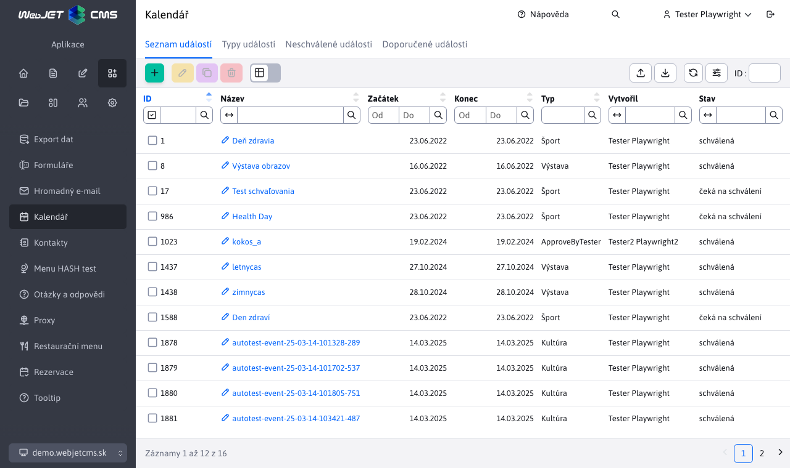
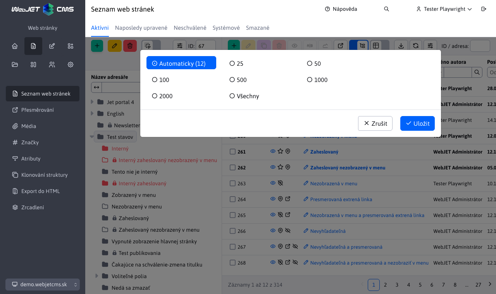
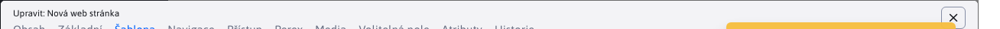
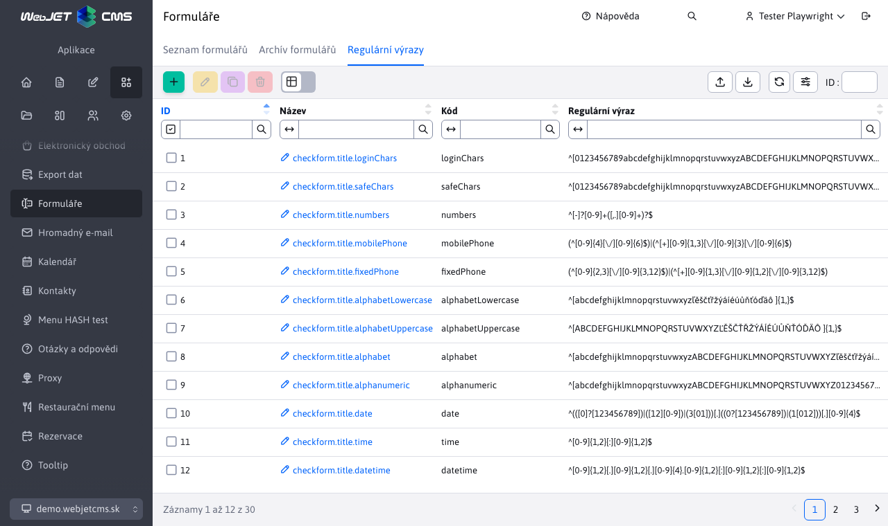
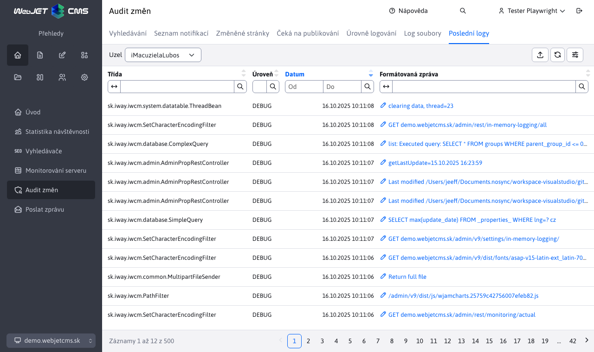

# Seznam změn verze 2022

## 2022.52

> Verze 2022.52 se zaměřuje na **lepší použitelnost**, obsahuje vylepšení na základě připomínek uživatelů. Byly přepracovány aplikace Poll, definice atributů, **Kontrola odkazů a prázdných stránek, Statistika**, Rezervace. Bannerová aplikace přidává možnost používat **volitelná pole**, v galerii je mnoho drobných vylepšení.

Významné změny v této verzi:
- Datové tabulky
  - Zapamatování nastaveného počtu záznamů na stránku - pokud nastavíte jinou než automatickou hodnotu, tabulka si bude pamatovat nastavený počet záznamů na stránku.
  - Import - vylepšeno zobrazení čísla řádku při chybě importu, přidáno odstranění mezer na začátku a na konci textu, zobrazeny informace při importu mnoha záznamů.
- Webové stránky
  - Při vytváření nové stránky se okno editoru přepne na kartu Základní, abyste mohli ihned zadat název stránky.
  - Přidána funkce [kontrola odkazů a prázdných stránek](redactor/webpages/linkcheck.md).
- Aplikace
  - Přepracováno: Atributy stránky, anketa, statistiky, rezervace a seznam objektů rezervace
  - Systém bannerů - přidaná možnost [nastavit volitelná pole A-F](frontend/webpages/customfields/README.md) v případě potřeby zaznamenat/zobrazit další informace (např. další nadpis/odkaz/text tlačítka v banneru).
  - Galerie - automatický výpočet počtu obrázků na stránku a zapamatování nastavené velikosti obrázku `SML`.
  - Galerie - přidána možnost otočit fotografii vlevo/vpravo (původně byla k dispozici pouze pravá možnost).
- Zabezpečení a API
  - Aktualizované knihovny `Spring Security` a další.
  - Přidána možnost použít Google reCaptcha v3.
  - [Přihlášení pomocí klíče API](custom-apps/spring/api-auth.md) odeslaný v hlavičce HTTP požadavku.

### Převratné změny

- Během paralelního testování jsme zjistili chybu v akvizici. `domainId` v instalacích s více doménami. Proto bylo načítání této hodnoty změněno podle nejnižší hodnoty. `groupId` složky v doméně (původně to bylo podle priority řazení). Tato změna může vést k narušení vztahů v databázi, proto je možné definovat konf. proměnnou `domainId-www.domena.sk` a hodnotu ID, která odkazuje na původně nastavenou hodnotu.
- `FtpDownloader` - třída zrušena.
- Banner - pokud používáte vlastní kód Java pro čtení bannerů, název primárního klíče byl změněn z `bannerId` na standardní `id`.

### Webové stránky

- Při vytváření kořenových složek s názvem `Slovensky, Česky, English, Deutsch` automaticky nastaví dvoupísmenný kód jazyka a pořadí uspořádání na `10, 20, 30, 40` (#market-245).
- Opraveno řazení seznamu webových stránek při prvním načtení, pokud je nastaveno jiné než výchozí řazení podle ID stránky.
- Opraven náhled nově vytvořené stránky.
- Pokud je definováno více než 30 značek (skupin Perex), zobrazí se na kartě Perex jako vyhledávací pole s více možnostmi výběru místo standardního seznamu zaškrtávacích políček (#54857).
- Při vytváření nové stránky se okno editoru přepne na kartu Základní, aby bylo možné ihned zadat název stránky (#54857).
- Při přepnutí domény na domovské stránce se automaticky přepne do sekce Webové stránky (pokud má uživatel práva) (#54857-4).
- FontAwesome - vylepšena podpora pro použití FontAwesome na webových stránkách (správné načítání písma v administraci) (#39751-51).
- Vlastnosti aplikace - upraveno vkládání seznamu objektů (seznam bannerů, galerie...) do nového návrhu v úpravě vlastností aplikace. Technicky se přesměrování z původní adresy URL na novou provede, pokud je definována v položce `MenuService`. (#54705).
- Opraveno filtrování složky Systém a Koš, pokud je podsložkou hlavní složky domény (při aktualizaci starého webu). Nyní již složka Systém není kořenovou složkou. Opraveno zobrazování stránek při přepínání karet Složky, Systém a Koš (někdy se nenačítal seznam stránek ve složce Systém) (#54953-4).
- Přidáno tlačítko na [zobrazit statistiky webových stránek](redactor/apps/stat/README.md) (#54953-3).
- Atributy stránky - [definování atributů](redactor/webpages/doc-attributes/README.md) převedeny na datové tabulky (#54709).
- Přidána funkce [kontrola odkazů a prázdných stránek](redactor/webpages/linkcheck.md) (#54697).


### Průzkum

- Aplikace přepracována do nového designu (#54705).
- Vytvořil [dokumentace k editoru](redactor/apps/inquiry/README.md) (#54705).


### Bannerový systém

- Přidána možnost nastavení banneru klienta, opraveno zobrazení statistik (možnost změny data a chyby, pokud banner neobsahuje žádné statistiky) (#39751-52).
- Přidána kontrola oprávnění "Zobrazit všechny bannery" - pokud uživatel toto oprávnění nemá, zobrazí se pouze bannery, u kterých je nastaven jako klient (#39751-52).
- Přidána možnost [nastavit volitelná pole A-F](frontend/webpages/customfields/README.md) aby bylo možné v případě potřeby zaznamenat/zobrazit další informace (např. další nadpis/odkaz/text tlačítka v banneru) (#39751-52).

### Galerie

- **Automatický výpočet počtu obrázků na stránku** - podobně jako se počítá počet řádků v datové tabulce, počítá se počet obrázků, které se vejdou do okna najednou, podle velikosti okna pro optimální stránkování (#54857).
- Textový editor - vylepšena kompatibilita se starým editorem, povoleno stylování textu (#39751-50).
- Autor - přidána možnost formátovat text se jménem autora (tučně, odkaz...) (#54857-4).
- **Nastavení velikosti paměti** - galerie si pamatuje nastavenou velikost miniatur (`S,M,L`) nebo zobrazení tabulky (#54857-4).
- Vytvořením nové složky se nastaví režim Vlastní zobrazení místo chybného Přesný rozměr, který zkresluje poměr stran (#54857-4).
- Atribut nastavený podle obrázku `loading="lazy"` načítat obrázek pouze při posouvání stránky (zvýšení rychlosti a snížení objemu dat u velkých galerií).
- Upravené stránkování (kompatibilita s Bootstrapem).
- Po přidání fotografie se provede její odstranění. `EXIF` informace z důvodu bezpečnosti a také z důvodu. **odstranění orientace (rotace)**, je-li nakonfigurován `ImageMagick`. Původní fotografie v editoru byla zobrazena s rotací podle `EXIF` ale ne zmenšené informace, což způsobilo nekonzistenci zobrazení (#54909).
- Při použití `ImageMagick` se nejprve odstraní z originálu, když se obrázek otočí `EXIF` informace o jeho natočení, aby se originál a náhledová fotografie nelišily (#54909).
- Přidána možnost **otočení fotografie vlevo/vpravo** (původně byla k dispozici pouze pravá možnost), opravena možnost otáčení obrázku s příponou `.jpeg` (#39751-52).
- Přidána možnost změnit název souboru v editoru (po změně se přejmenují i soubory s fotografiemi na disku) (#39751-52).
- Aby se v editoru nezobrazovala stará verze obrázku, přidali jsme k jeho cestě náhodný parametr URL. To způsobí, že se při každém otevření editoru znovu načte ze serveru (#39751-52).
- Přidáno **Nástroj lupa pro zvětšení/zmenšení obrázku** v editoru na kartě Oblast zájmu (#54953-3).

### Statistiky

Aplikace [Statistiky](redactor/apps/stat/README.md) kompletně přepracován do nové vizuální podoby. Aktualizované stránky [příručka pro redaktora](redactor/apps/stat/README.md) s popisem jednotlivých statistik (#54497, #54585).



- Přidána možnost nastavit konkrétní složku pro zobrazení statistik (#54953-3).

### Rezervace

Aplikace Rezervace a seznam objektů rezervace přepracované do nové vizuální podoby. Přidáno [příručka pro redaktora](redactor/apps/reservation/reservations/README.md) (#54701).


### Vyhledávání

- `Lucene` - Přidána podpora češtiny, angličtiny a němčiny. Pro tyto jazyky se používá standardní parser a `stemmer` k dispozici přímo v `Lucene` (`org.apache.lucene.analysis.JAZYK`).
- `Lucene` - při indexování webových stránek se bere v úvahu jazyk webové stránky (podle jazyka složky nebo šablony). Do indexu se přidávají pouze stránky ve stejném jazyce, jako je vytvořený index.

### Datové tabulky

- **Zapamatování nastaveného počtu záznamů na stránce** - pokud nastavíte jinou než automatickou hodnotu, tabulka si bude pamatovat nastavený počet záznamů na stránce (#39751-50).
- Stránkování - **zvýšený počet čísel stránek** v zápatí tabulky. U hlavních tabulek a šířky obrazovky větší než 800 pixelů se počet položek stránkování (původně 7 položek) počítá podle šířky tabulky (#39751-50,54857-4).
- `Quill` - jednoduchý editor HTML - rozšířeny možnosti jednoduchého editoru HTML (používá se např. v galerii, otázkách a odpovědích...) - přidáno nastavení pro horní/podsazený index, barvy, zarovnání, možnost upravovat kód HTML (#54857-4).
- Přidána možnost konfigurace [onPreXhr](developer/datatables/README.md) pro možnost přidání parametrů URL pro volání služby REST. To se používá, pokud je na stránce speciální filtr, například ve statistikách (#54585).
- Přidána možnost konfigurace [defaultSearch](developer/datatables/README.md#možnosti-konfigurace) pro inicializaci vyhledávání před prvním voláním služby REST (používá se v aplikaci Statistiky pro zapamatování dat od-do zadaných mezi jednotlivými stránkami statistik) (#54585).
- Přidána možnost nastavení hodnoty `null` (zadané jako řetězec) v poli výběru (pro možnost nastavení/filtrace `null/true/false`) (#54701).
- Přidaný typ pole `TIME_HM/TIME_HMS` Pro [výběr hodin a minut](developer/datatables-editor/standard-fields.md#time_hm-a-time_hms) (a případně sekundy) (#54701).
- Dovoz - doplněno **zobrazení čísla řádku při chybě** i když importovaná entita nedědí od entity `ActiveRecordBase` (#39751-53).
- Import - přidáno odstranění mezer na začátku a na konci hodnoty v buňce (aby např. nedošlo k chybě importu kvůli nesprávné e-mailové adrese) (#39751-53).
- Import - přidáno zobrazení průběhu importu v %, přidána ikona indikátoru k tlačítku importu (#39751-53).

### Zabezpečení

- Aktualizovaná knihovna `Spring Security` na verzi `5.6.+` (#39751-50).
- Aktualizované knihovny JavaScriptu (#54857-4).
- Opravena možná zranitelnost XSS v auditu (#54857-4).
- Registrace uživatele - přidána kontrola JavaScriptu pro pole Opakovat heslo, která zabrání odeslání formuláře, pokud se neshoduje s polem Heslo.
- Přidána možnost použít **Google reCaptcha v3**.

### Přístup k rozhraní API

- Přidána možnost programového volání služeb správy REST z externího systému (#54941).
- [Přihlášení pomocí klíče API](custom-apps/spring/api-auth.md) odeslaný v hlavičce HTTP požadavku.
- Klíč API se generuje v profilu příslušného uživatele zadáním znaku `*` je vygenerován náhodný klíč API.

### Další drobné změny

- Administrace - levé menu - když kliknete na položku, která je v menu nízko, menu se po načtení stránky posune výš, aby byla položka viditelná a zobrazily se všechny položky menu druhé úrovně (#54701).
- Animace načítání - přidána možnost zobrazit [animace načítání](developer/frameworks/webjetjs.md#animace-načítání), např. při generování grafu (#54585).
- Banner - přidána možnost nastavení [parametr URL kampaně](redactor/apps/banner/README.md#banner-s-obsahem) a zobrazení banneru pouze během kampaně.
- Dialogy - Upraveno zobrazení starších dialogů (např. nastavení aplikace, dialogy editoru stránek) na nový styl záhlaví a karet (#39751-52).
- Přesměrování domény - opraveno získávání doménového aliasu při detekci `xsrf` (při vytváření aliasu domény již není nutné přidávat doménu do proměnné conf. `xsrfReferers`).
- Formulář snadno - přidána detekce vložení `check_form` pro kontrolu vyplněných polí. Pokud se na stránce již nachází objekt (existuje `checkFormLoaded`) nebude nutné vkládat skript pro jeho vložení (#54393).
- Formulář snadno - upravené zobrazení textu tooltipu - podpora pro Bootstrap 5, nahrazení špatného textu `.popover` z `.tooltip` (#54393).
- Formulář snadno - upraveno generování ID polí pro výběrová a zaškrtávací pole, aby bylo možné správně kliknout na text a vybrat příslušnou možnost (#market-245).
- Snadno se tvoří - **nastavit minimální šířku pole pro zobrazení na řádku** aby se na mobilním telefonu pole zobrazovala na celou šířku a ne vedle sebe (kde jsou příliš malá) (#54857).
- Hromadný e-mail - přidána kontrola (ověření) e-mailové adresy při přihlašování/odhlašování k hromadnému e-mailu.
- Hromadný e-mail - přidaná možnost **zadat více e-mailových adres v dialogovém okně pro odhlášení odběru.** (#39751-53).
- Hromadné e-maily - přidána kontrola duplicit při zadávání odhlašovaných e-mailových adres (#39751-53).
- Hromadný e-mail - opravena chyba při přidávání e-mailu do kampaně, pokud je e-mail na seznamu pro odhlášení. Místo chyby je přidání považováno za správné a pokračuje na další záznam (#39751-53).
- Soubory - přidána možnost použít [externí adresář pro soubory](frontend/setup/README.md) jako součást webové aplikace. Nastavuje se jako konfigurační proměnná `cloudStaticFilesDir={FILE_ROOT}static-files` který nastaví ukládání souborů pro každou doménu zvlášť ve složce. `static_files` v kořenové složce webové aplikace (#39751-47).
- Šablony - v editoru přibyla karta Složky a webové stránky, která obsahuje **seznam složek a stránek, které používají zobrazenou šablonu.** (#54693).
- Zrcadlení struktury - kořenové složky se již nebudou synchronizovat, aby bylo možné nastavit jejich pořadí v administraci (např. první slovenská a druhá anglická).
- Přidána funkce API [WJ.prompt](developer/frameworks/webjetjs.md#získání-hodnoty) získat od uživatele hodnotu (např. heslo pro potvrzení smazání atd.) (#54701).

### Dokumentace

- Vytvoření dokumentace a optimalizace projektu `basecms` pro nastavení [režim ladění](custom-apps/vscode/debugging/README.md) v kódu VS pro soubory Java i JavaScript (#54393).
- Přidána dokumentace pro nastavení [parametr URL kampaně](redactor/apps/banner/README.md#banner-s-obsahem) a zobrazení banneru pouze během kampaně.
- Vyplněná dokumentace pro [Thymeleaf](frontend/thymeleaf/webjet-objects.md) objekty šablon (`${ninja.temp.baseCssLink},${ninja.temp.cssLink})`.
- Vytvořená dokumentace k aplikaci [Statistiky](redactor/apps/stat/README.md) (#54497).
- Dokumentace v sekci Programování zákaznických aplikací byla doplněna o možnost připojit k aplikaci modul JavaScriptu jako [položka v oblasti administrátora](custom-apps/admin-menu-item/README.md#přiložení-souboru-javascript) (#54585).
- Vytvořená dokumentace k editoru pro aplikaci [rezervace](redactor/apps/reservation/reservations/README.md) a [objekty rezervace](redactor/apps/reservation/reservation-objects/README.md) (#54701).
- Vytvořená dokumentace pro programování zákaznických aplikací - [Autorizace tokenů](custom-apps/spring/api-auth.md), [poskytování služeb REST](custom-apps/spring/rest-url.md), doplněné o dokumentaci k nastavení [SpringSecurity](custom-apps/spring-config/README.md#nastavení-zabezpečení-pružin) (#54941).
- Statistiky - přidány informace o ukládání statistik [bez souhlasu GDPR](redactor/apps/stat/README.md) (#54709).
- Atributy stránky - dokumentace vytvořená pro [definování atributů](redactor/webpages/doc-attributes/README.md) (#54709).
- Vytvořená dokumentace k editoru pro aplikaci [Galerie](redactor/apps/gallery/README.md) (#54953-4).

### Testování

- Webové stránky - přidány testy pro vyplňování polí webové stránky, čas publikování, duplikace, zobrazení historie, poznámky editora, výběr šablony atd. (#52996).
- Automatizované testy - přepracované volání `I.isFirefox/I.isChromium` do samostatného `Page` objekt `Browser`. Takže hovory jsou `Browser.isFirefox()/Browser.isChromium()/Browser.getBrowserType()` (#MR302).
- Automatizované testy - přepracované volání `I.wjDocsScreenshot` do samostatného `Page` objekt `Document`.
- Galerie - přidán test pro zapamatování nastavené velikosti obrázku a zobrazení HTML textu v popisu a autorovi fotografie (#54857-4).
- Překladové klíče - doplněný test hledání o začíná/končí s a rovná se (#54857-4).
- Přidané funkce `DT.checkTableCell, DT.checkTableRow` k otestování hodnoty v [buňce tabulky a v celém řádku](developer/testing/README.md#další-funkce-webjetu).
- Přidáno generování sestav [pokrytí kódu](developer/testing/codecoverage.md) během testování (#54909).
- Změna způsobu vizuálního porovnávání obrázků z [Podobají se](https://codecept.io/visual/#visual-testing) na adrese [pixelMatchHelper](https://github.com/stracker-phil/codeceptjs-pixelmatchhelper) který lze použít i při paralelním spouštění testů (#54909).
- Přidána možnost spouštět [paralelní testy](developer/testing/parallel.md) pro jejich rychlejší provádění (#54909).
- Přidána možnost [testování služeb REST](developer/testing/README.md#testovací-služby) (#54941).
- Přidaná funkce `Document.screenshotAppEditor(docId, path, callback, width, height)` vytvořit snímek nastavení aplikace (#54953-4).

### Oprava chyb

- Systém bannerů - opraveno zobrazení atributu Displayable při otevření okna editoru v datové tabulce (#54857).
- Bannerový systém - opraveno zobrazení seznamu bannerů, chybně se zobrazovalo pouze prvních 20 bannerů (#54697).
- Datové tabulky - opraveno (zbytečné) ukládání stavu tabulky, pokud je v konfiguraci nastaveno řazení podle určitého sloupce. Stav tabulky je možné uložit až 800ms po její inicializaci, kdy se očekává, že uživatel provede nějakou akci.
- Datové tabulky - opraveno zobrazení názvu objektu, který má být odstraněn, pokud je to `GroupDetails` objekt (#39751-53).
- Formuláře - opraveno zobrazení seznamu vyplněných formulářů, pokud název pole (sloupce) obsahuje znak závorky (#39751-52).
- Hromadný e-mail - přidána kontrola platnosti e-mailové adresy při importu příjemců, pokud je neplatná, zobrazí se chybová zpráva. Před importem jsou z e-mailu odstraněny mezery (#39751-51).
- Média - opravena kontrola práv při úpravách existujících médií na stránce (#39751-52).
- Sledování serveru - opraveno zobrazení textů překladu (#39751-52).
- Překladové klíče - opraveno vyhledávání klíčů podle začíná s, končí s a rovná se (#54857-4).
- Šablony - opraveno načítání seznamu pro výběr záhlaví/zápatí/menu, filtrování podle skupiny šablon (název vs. obsahuje shodu), filtrování podle ochrany proti spamu a počtu použití (#54857-4).
- Statistiky - opraveno načítání dat od začátku roku - problém s číslem týdne na přechodech mezi roky) (#39751-53).
- Webové stránky - opravené ukládání polí `Odverejniť stránku po tomto dátume` (#52996).
- Webové stránky - opraveno nastavení domény po přihlášení, pokud aktuální doména neodpovídá poli pro výběr domény (#39751-47).
- Webové stránky - opravena možnost zadat adresu URL obsahující znak @, aniž by byla považována za e-mailovou adresu (např. odkaz na profil TikTok).
- Webové stránky - opraveno stránkování v editoru na kartě Média (#39751-54).
- Webové stránky - opravena možnost duplikovat složku (54953-3).

### Pro programátora

- Přidaná funkce `WJ.confirm` Pro [získání hodnoty](developer/frameworks/webjetjs.md#získání-hodnoty) (#54701).


## 2022.40

> Verze 2022.40 se zaměřuje na **zlepšení bezpečnosti**. Obsahuje aktualizované knihovny Java a JavaScript a zkontrolované zranitelnosti. Přináší však i řadu dalších změn pro **zlepšování práce na základě zpětné vazby** - zapamatování poslední složky na webových stránkách, zapamatování pořadí sloupců a rozložení v datových tabulkách, možnost posouvání okna atd. Jemně **upravuje design uživatelského rozhraní** (novější sada ikon, jemnější barvy nabídky).

Významné změny v této verzi:
- Zabezpečení
  - Aktualizace knihoven Java a JavaScript, aktualizace VueJS z verze 2 na verzi 3.
  - Změněný algoritmus `hashovania` hesla na standardní [bcrypt](sysadmin/pentests/README.md#algoritmus-hashování-hesel).
  - Všechny chybové hlášky `Stack Trace` jsou směrovány přes `Logger`, takže se v seznamu objeví také [Poslední protokoly](sysadmin/audit/memory-logging.md) v sekci Audit.
  - Přidána možnost generování hlavičky HTTP `Access-Control-Allow-Origin` k zajištění přístupu ke službám REST.
- Datové tabulky
  - Přidáno dynamické počítání počtu řádků na stránce podle velikosti okna prohlížeče.
  - Přidána možnost přesouvat okno editoru.
  - Přidaná paměť [pořadí sloupců a způsob uspořádání.](redactor/datatables/README.md#pamatovat-na-uspořádání) tabulky.
  - Přidáno [klávesová zkratka](redactor/datatables/README.md#klávesové-zkratky), `CTRL+S/CMD+S` uložit záznam do databáze, aniž byste museli zavřít okno editoru a pokračovat v práci.
- Webové stránky
  - Nástroj pro tvorbu stránek - doplněno [přepínání velikosti obrazovky](redactor/webpages/pagebuilder.md#nastavení-šířky-sloupce) nastavit šířku sloupce pro počítače, tablety a mobilní zařízení.
  - Přidána možnost zobrazení [náhled kompletních webových stránek](redactor/webpages/editor.md#náhled-stránky) bez uložení.
  - Seznam webových stránek v rámci jednoho přihlášení si pamatuje naposledy zobrazenou složku (stromovou strukturu), při návratu se složka znovu rozbalí.
- Aplikace
  - Přepracováno: Hromadné e-maily, kalendář událostí/seznam a typy.
  - Formulář snadno - přidána možnost generovat formuláře s více poli v jednom řádku a typ pole Vybrat seznam - vybrat.
  - Vyhledávání - přidány váhy pro nadpis stránky (váha 20) a nadpisy (váha 10), aby bylo možné upřednostnit výsledky na stránkách, kde se hledaný výraz nachází v nadpisu nebo v nadpisu.

Níže najdete kompletní seznam změn v této verzi.

<div class="video-container">
  <iframe width="560" height="315" src="https://www.youtube.com/embed/ZJGYsQo-_Q4" title="Přehrávač videí YouTube" frameborder="0" allow="accelerometer; autoplay; clipboard-write; encrypted-media; gyroscope; picture-in-picture" allowfullscreen></iframe>
</div>

### PageBuilder

- Upravené zobrazení rámečků kolem prvků - nezobrazují se a zejména se ihned skrývají, ale jsou animované. To zlepšuje použitelnost kliknutí na tlačítko ozubeného kola, které nezmizí okamžitě při mírném posunutí myši mimo rámeček (#54345).
- Po zavření okna se náhled stránky odstraní, aby se při opětovném otevření okna nezobrazovala předchozí verze/webová stránka.
- Když odstraníte všechny karty nebo `accordion` se zobrazí tlačítko + pro přidání nové položky. Je tedy možné správně odstranit všechny prvky a poté je znovu přidat.
- Po odstranění všech sekcí (bloků) ze stránky se zobrazí modré tlačítko + pro přidání nové položky.
- Přidán styl CSS `pb-col` a `pb-col-auto` pro možnost nastavení sloupců, které [šířku nelze nastavit](frontend/page-builder/settings.md#sloupec-zelené-barvy).
- Doplněno [přepínání velikosti obrazovky](redactor/webpages/pagebuilder.md#nastavení-šířky-sloupce) pro stolní počítače, tablety a mobilní zařízení. Umožňuje upravit šířku sloupců podle vybraného zařízení (#39751).
- Velikost okna editoru zvýšena na 1210 pixelů na šířku, aby bylo možné nastavit třídy CSS `col-xl-` pro šířku 1200 bodů `desktop` (#39751).
- Přidána podpora provádění `data-th-src` a `data-th-href` atributy včetně `${ninja.temp.basePathXXX}` při vkládání bloku do stránky (#39751-38).

### Webové stránky

- Při vytváření nové domény se ve složce Systém automaticky vytvoří základní stránky záhlaví/zápatí/menu pro nastavení záhlaví/zápatí a menu.
- Při vytváření složky se prázdné pole URL automaticky nastaví na dvoupísmenný kód jazyka (např. `sk`) pro názvy `Slovensky, English, Deutsch a Česky`.
- Pokud existuje jak místní (pro doménu), tak globální (s nenakonfigurovanou doménou) složka Systém zobrazí v seznamu webových stránek pouze místní složku (aby se nezobrazovaly dvě složky se stejným názvem, které nelze na první pohled rozlišit).
- Ve vlastnostech složky jsou skupiny rozděleny tak, aby omezovaly přístup a hromadné e-maily stejně jako na webových stránkách (#54493).
- Přidána možnost zobrazení [náhled kompletních webových stránek](redactor/webpages/editor.md#náhled-stránky) bez uložení (#54513).


- Přidána možnost ve stromové struktuře [zobrazit ID adresáře, pořadí uspořádání a také seznam webových stránek](redactor/webpages/README.md#nastavení-zobrazení-stromové-struktury) (pro účely přetahování) (#54513).
- Přidáno vyhledávání v jazyce záhlaví/zápatí/menu (hledání stránky `LNG-meno`) při nastavování jazyka adresáře, i když se nepoužívá místní jazyk. `System` Složka (#39751).
- Upravená velikost a poloha okna vlastností aplikace - okno je vycentrované a jeho maximální velikost se vypočítává podle dostupné plochy (#39751).



- Modifikované pořízení [seznam stylů CSS pro výběrové pole v editoru.](frontend/examples/template-bare/README.md#seznam-stylů-pro-editor) - pokud je v šabloně nastaven minifikovaný soubor CSS, vyhledá se jeho neminifikovaná verze. Současně se při čtení souboru CSS hledání zastaví po nalezení `@media` výraz, který obvykle po vložení `bootstrap` na začátku znamená, že nebudou nalezeny žádné styly. Nový kód prohledá soubor CSS ještě jednou a vyhledá komentář `/* editor */`. Pokud je nalezena, použije se definice z předchozího řádku (#39751-35).



- V Editoru stránek na kartě Šablona přidány stránky menu do seznamu volných objektů (původně se zobrazoval pouze seznam záhlaví a zápatí) (#39751-36).
- Pokud má stránka nastavenou možnost "Automaticky generovat URL z názvu položky menu" a již existuje stránka se stejnou URL/názvem (např. v koši), zobrazí se hlášení "Zadaná virtuální cesta je již na stránce použita" pouze při vytváření stránky, poté se použije adresa s pořadovým číslem na konci.
- Karty Systém a Koš se nezobrazí, pokud uživatel nemá oprávnění ke složce nebo stránce na těchto kartách (#39751-39).
- Přidáno zobrazení složek ve stromové struktuře podle práv ke konkrétním stránkám. V seznamu složek se poté zobrazí pouze stránky, ke kterým má uživatel práva (#39751-39).
- V kartách [Historie](redactor/webpages/history.md) zobrazuje datum plánovaného zveřejnění stránky, změnil pořadí záznamů tak, aby plánované události byly na začátku seznamu (#54513-15).
- Historie - přidána možnost odstranit naplánovanou změnu na webové stránce (#54513-15).
- Přidáno [Karta Složky](redactor/webpages/README.md#karty-webových-stránek) do tabulky dat. Umožňuje používat funkce datové tabulky, jako jsou hromadné operace, úpravy buněk, duplikování a na složkách se stromovou strukturou (#54797).


- Zapamatování naposledy otevřené složky - seznam webových stránek si pamatuje naposledy otevřenou složku v rámci jednoho přihlášení, při návratu do seznamu webových stránek se složka znovu otevře (#39751-45).

### AB testování

- Přidána možnost vytvořit verzi B stránky pro testovací aplikaci AB
- Vytvořil [dokumentace k editoru](redactor/apps/abtesting/README.md).


### Šablony

- [Šablony Thymeleaf](frontend/thymeleaf/tags.md#provádění-značek-include) přidána možnost zachovat obalový prvek nastavením atributu `data-iwcm-remove` zachovat strukturu shodnou s prototypováním a možnost používat prvky jako `header, article, footer`.
- Upravený editor šablon a skupin šablon - lepší rozdělení polí do karet.
- Skupiny šablon - přidán přepínač jazyka Metadata, opraveno nastavení českého překladu, opraveno nastavení polí `Generator` (#39751).

### Formulář snadno

- Přidána možnost zobrazit jednotlivá pole v řádku (takže pole se zobrazují vedle sebe, nikoli pod sebou). Přidáno pole Nový řádek pro vytvoření nového řádku a pole Prázdná buňka pro vložení prázdného místa do řádku. Pole v řádku jsou automaticky rovnoměrně rozdělena podle místa v řádku.
- Pokud je zadáno textové pole zástupného znaku, ale pole Hodnota je prázdné, název pole se nad ním nezobrazí, zobrazí se pouze text zástupného znaku. To umožňuje vytvořit formulář, který zabírá méně místa.


- Přidána možnost [vytvořit skupiny polí](redactor/apps/formsimple/README.md#Položky), např. výběrová pole a zaškrtávací políčka. Znak se používá jako oddělovač `|` nebo znak `,` nebo mezery. Znak `|` musí být použita, pokud má jedna z možností obsahovat čárku.


- Přidány hodnoty z pole Select list - select, jednotlivé hodnoty jsou odděleny znakem `,`, je možné zadat různý text a hodnotu ve formuláři `Pomaranč:orange,Jablko:apple`.

### Formuláře

- Upraveno filtrování dat tak, aby umožňovalo vyhledávání ve všech sloupcích (původní verze neumožňovala vyhledávání v žádném sloupci).
- Rozšířená stránka [možnosti exportu](redactor/apps/form/README.md) - přidána možnost exportovat filtrovaná data, dosud neexportované a také označené řádky (#54513).


- V dialogovém okně se zobrazí náhled vyplněného formuláře pro vybraný jednotlivý řádek. Pokud je označeno více řádků, zobrazí se každý formulář na nové kartě pro snadnější porovnání (#39751-40).

### GDPR

- Správce souborů cookie - upraveny styly pro standard Bootstrap, tlačítka změněna z odkazu na standardní tlačítko, aby nedocházelo ke kolizi barev tlačítek odkazu a patičky (#54345).
- Hledání - přidány odkazy pro zobrazení podrobností nalezeného záznamu (#54513).
- GDPR Cookies - přidána možnost zobrazit lištu cookies v zadaném jazyce, lze nastavit pomocí parametru `lng` (#39751).

### Hromadný e-mail

Aplikace v novém vizuálním provedení. Přidána možnost nastavení začátku odesílání kampaně. Import příjemců je možný z `xlsx` formátu, výběrem skupiny uživatelů nebo zadáním e-mailových adres.



- Přidán jednodušší formulář pro přihlášení k odběru hromadných e-mailů (zobrazuje pouze pole pro zadání e-mailové adresy). Přihlašuje do všech e-mailových skupin, které mají tuto možnost povolenou `Povoliť pridávanie/odoberanie zo skupiny samotným používateľom` a `Vyžadovať potvrdenie e-mailovej adresy`. Neobsahuje ani `captcha` prvek, takže je vyžadováno potvrzení e-mailové adresy. Formulář používá `Bootstrap v5` zobrazit formulář a dialogové okno.
- Vytvořená dokumentace s popisem provozu [zasílání hromadných e-mailů](redactor/apps/dmail/campaings/how-sender-works.md).
- Do editoru byla přidána karta Náhled pro zobrazení vybrané stránky e-mailu. Pokud stránka používá inline editaci/PageBuilder, lze ji také upravovat (#39751-44).

### Kalendář akcí

- Přepracovaný seznam událostí s novými vizuálními prvky a tabulkami dat. Připravil [příručka pro redaktora](redactor/apps/calendar/README.md) (#54473).
- Konfigurace typů událostí přepracovaná do nových vizuálů a datových tabulek. Připravil [příručka pro redaktora](redactor/apps/calendar/calendar-types/README.md) (#54473).



### Uživatelé

- V seznamu skupin uživatelů v editoru přibyla karta Uživatelé se seznamem uživatelů v editované skupině (#54493).
- V seznamu uživatelských skupin upraveno načítání seznamu webových stránek pro stránkování serveru (#54493).
- Seznam uživatelů lze filtrovat podle skupiny uživatelů (#54493).

### Vyhledávání

- `Lucene` - upravené indexování - název stránky je indexován s váhou 20 (zatímco název je indexován jak v původní podobě, tak v základní podobě prostřednictvím `Lemmas`), jsou všechny nadpisy extrahovány ze stránky a použity s váhou 10. Chcete-li zobrazit výsledky, musíte nastavit `orderType="score"`, který pak seřadí výsledky podle počtu dosažených bodů.
- `Lucene` - modifikované vyhledávání - zadaný text je nejprve převeden do základního tvaru (tzv. `Lemmas`) a teprve poté se prohledává.

### Datové tabulky

- Editovatelné výběrové pole - zvětšila se velikost editačního okna na stejnou velikost, jakou má editace webové stránky, aby se lépe zobrazovalo (např. při úpravě záhlaví z editace šablony) (#54345).
- Přidána možnost importovat a exportovat i z vnořených tabulek (správně zobrazených nad otevřeným oknem editoru se správným stmíváním) (#54377).
- Přidána metoda pro použití specifických parametrů vyhledávání také pro [první (úplné) načtení tabulky](developer/datatables/restcontroller.md#filtrování-při-zobrazení-všech-záznamů) (volání `addSpecSearch` při volání `getAll`). Jen ve vaší implementaci `getAll` metoda volání `getAllItemsIncludeSpecSearch` (#54493).
- Přidána možnost exportovat data ve formátu `CSV` (#54513).
- Přidaný typ pole [MULTISELECT](developer/datatables-editor/standard-fields.md) (#54273).
- Upravena velikost sloupce Stav tak, aby zbytečně nezabíral šířku tabulky (#54273-26).
- Přidány popisky ikon pro maximalizaci okna editoru, přidáno tlačítko pro zavření okna v záhlaví (#54273-26).
- Přidáno dynamické počítání počtu řádků na stránce podle velikosti okna prohlížeče (#54273-26).



- Přidáno [klávesová zkratka](redactor/datatables/README.md#klávesové-zkratky), `CTRL+S/CMD+S`, který uloží záznam do databáze, ale ponechá otevřené okno editoru (#54273-26).
- Import - při chybě importu se v chybové zprávě zobrazí číslo řádku a také podrobný seznam chyb (#39751-39).
- Přidána možnost `tab.hideOnCreate` a `tab.hideOnEdit` k ukrytí [karty v editoru](developer/datatables-editor/README.md#karty-v-editoru) pro nový záznam a úpravu stávajícího záznamu (#54749).
- Doplněno [název upravované položky](redactor/datatables/README.md#zobrazení-názvu-v-záhlaví-okna) v záhlaví editoru a v seznamu položek v dialogovém okně pro potvrzení odstranění (#54753).


- Zlepšená vizuální konzistence starých tabulek generovaných pomocí `displaytag` a prostřednictvím starší verze `DataTables`. Stránkování je posunuto doprava, řádkování a přejetí myší je (#39751-42).
- Přidána možnost nastavit kartu na [plná výška okna editoru](developer/datatables-editor/README.md#karty-v-editoru) (#39751-42).
- Přidána možnost [přesunout okno](redactor/datatables/README.md#možnost-přesunout-okno) editor (#54513-21).
- Přidaná paměť [pořadí sloupců a způsob uspořádání.](redactor/datatables/README.md#pamatovat-na-uspořádání) Tabulky (#54513-22).

### Jazykové mutace

- Opraveno načítání administrace v jiných jazycích než ve slovenštině.
- Stránky skenované pro statické texty bez překladů, texty nahrazené překladovými klíči.
- Přidány překlady pro češtinu a angličtinu.
- Přidána možnost použít parametry pro použití překladu [klíče v souborech JavaScript](developer/frameworks/jstranslate.md#frontendová-knihovna).

### Zabezpečení

- Aktualizace knihoven spring na verzi 5.6.5 a thymeleaf na verzi 3.0.15.
- Změněný algoritmus `hashovania`, [hesla do bcrypt](sysadmin/pentests/README.md#algoritmus-hashování-hesel).
- Doplněno [kontrola práv k zobrazení stránky](developer/frameworks/thymeleaf.md#kontrola-práv) v administraci (původně bylo kontrolováno pouze volání služby REST). Je založena na vyhledání adresy URL v nabídce a následném získání práva pro tuto adresu URL. To se pak ověřuje pomocí práv přihlášeného uživatele (#54649).
- Na adrese [testy datových souborů](developer/testing/datatable.md#testování-práv) je nutné zadat možnost `perms` pro testování práv.
- Volání skriptu `/admin/mem.jsp` je povolen pouze pro IP adresy nastavené v proměnné conf. `serverMonitoringEnableIPs`. Původně byl skript k dispozici vždy (sloužil k základnímu monitorování), ale zobrazuje potenciálně citlivé údaje.
- Doplněná dokumentace [Bezpečnostní zkoušky pro provoz](sysadmin/pentests/README.md) další řešení pro zjištění zabezpečení a nastavení pro nezobrazování podrobných chyb a verzí `Apache Tomcat` (#43144).
- Odstraněna možnost přímého zobrazení komponenty JSP `/components/user/logon.jsp`. Při přístupu k souboru chráněnému heslem se přesměrování na stránku `logon.jsp`, ale vnitřní `forward`, takže adresa URL zůstane původní. V případě potřeby doporučujeme použít proměnnou conf. `fileAccessDeniedDocId` nastavit ID stránky pro zobrazení přihlášení při přístupu k souboru a nastavit správné ID stránky pro přihlášení složky webu (#43144).
- Upravené přesměrování při použití znaků `//` v adrese URL - doména i port jsou zachovány (absolutní adresa s doménou se nepoužívá) (#43144).
- Diskuze/Fórum - Volání AJAXu `/components/forum/new.jsp` lze zavolat pouze po zobrazení diskusního fóra, tuto stránku nelze zavolat, pokud stránka neobsahuje diskusi (#43144).
- Upravená výzva `/topdf` zobrazit chybu 404 místo prázdného PDF v případě nenalezení stránky, také přesměrování stránky (#43144) ošetřeno.
- Odstranění staré verze `jquery.cookie.js` v aplikaci GDPR - nahrazena verzí v aplikaci `_common` adresář (#43144).
- Aktualizace knihovny Spring na verzi `5.3.+`, `Amazon AWS` 1.12.+ a `Jquery UI` na verzi 1.13.2 (#546734).
- Aktualizováno `Vue.js` z verze 2.6 na verzi 3.2.37, `vue-router` na verzi 4.1 a `vue-advanced-cropper` v bodě 2.8.
- Aktualizace všech knihoven JavaScriptu pro `/admin/v9/` (#54721-3).
- Aktualizováno FontAwesome (ikony) na verzi 6 (#54721-3).


- Všechny chybové hlášky `Stack Trace` přesměrován ze standardního výstupu prostřednictvím `Logger`. Takže se také objeví v seznamu [Poslední protokoly](sysadmin/audit/memory-logging.md) v sekci Audit (#54269).
- Přidána možnost generování hlavičky HTTP `Access-Control-Allow-Origin`, je nastaven v konfiguračních proměnných `accessControlAllowOriginValue a accessControlAllowOriginUrls`. Ve výchozím nastavení se hlavička generuje pro adresy URL začínající na `/rest/,/private/rest/,/admin/rest/`.
- Aktualizovaná knihovna `org.json` na adrese 20220924.

### Další drobné změny

- Systém bannerů - přidána možnost filtrovat bannery podle zobrazitelnosti - kontroluje nejen aktivní možnost, ale také omezení počtu zobrazení/kliknutí a omezení data (#39751-44).
- Systém bannerů - přidáno tlačítko pro zobrazení statistik bannerů, do editoru přidána karta statistik (#39751-44).
- Hromadný e-mail - když získáte kód HTML hromadného e-mailu, do stránky se nevloží jQuery, což je pro e-mailovou verzi zbytečné.
- Optimalizace výkonu - optimalizováno načítání seznamu šablon - upraveno načítání skupin šablon, data jednotlivých objektů (stránek) se načítají dynamicky pouze v případě potřeby (#53273).
- Otázky a odpovědi - přidána kontrola SPAMu a možnost zobrazit obrázek Captcha (přidáním hodnoty `,qa` na konf. proměnnou `captchaComponents`). Dokud je přihlášen správce, není kontrolována.
- Hledání v administraci - vyhledávání po kliknutí na název stránky otevře editor v novém okně (původně se ve staré verzi editoru otevíralo ve vyskakovacím okně) (#39751-44).
- Úvod - přidány překlady sekcí Aplikace přizpůsobené pro WebJET a Novinky ve WebJETu. Seznam novinek je načítán z externího serveru, a proto je aktualizován bez aktualizace samotného WebJETu. Uživatelé tak mohou vidět seznam změn i ve verzi, kterou ještě nenasadili (#39751-45).

### Dokumentace

- Vytvořená dokumentace [Vzor šablony Bare](frontend/examples/template-bare/README.md) pro frontendového programátora.
- Vytvořená dokumentace k editoru - [Hromadné e-mailové kampaně](redactor/apps/dmail/campaings/README.MD) a [Přihlašovací formulář](redactor/apps/dmail/form/README.md).
- Vytvořená dokumentace s popisem provozu [zasílání hromadných e-mailů](redactor/apps/dmail/campaings/how-sender-works.md).
- Vytvořená dokumentace k editoru pro aplikaci [seznam formulářů](redactor/apps/form/README.md).
- Dokumentace vytvořená pro [náhled celé webové stránky](redactor/webpages/editor.md#náhled-stránky) bez uložení pro editor a také pro [programátor](developer/apps/webpages/README.md#náhled-stránky).
- Dokumentace vytvořená pro použití [specifický JavaScript](developer/frameworks/README.md#webpack) pro vložení do souboru pug.
- Přidána dokumentace k možnosti přidat tlačítko do [editor datových souborů](developer/datatables-editor/README.md#Speciální-tlačítka).
- Vytvořená dokumentace k editoru pro aplikaci [AB testování](redactor/apps/abtesting/README.md).
- Vytvořená dokumentace pro programátora [nastavení trvalého uživatele](developer/frameworks/webjetjs.md#nastavení-trvalého-uživatele)
- Vytvořena dokumentace pro editor aplikace Kalendář akcí - [Seznam událostí](redactor/apps/calendar/README.md) a [Konfigurace typů událostí](redactor/apps/calendar/calendar-types/README.md) (#54473).
- Vytvořená dokumentace pro programátora se seznamem [typy polí pro editor DataTables](developer/datatables-editor/standard-fields.md) (#54273).
- Přidána dokumentace pro webdesignéra popisující metodu [přidání stylů do výběrového pole v editoru](frontend/examples/template-bare/README.md#seznam-stylů-pro-editor) (#39751-35).
- Vytvořená ukázka a dokumentace [nahrávání souborů](custom-apps/spring-mvc/admin-with-upload.md) a [import z aplikace Excel](custom-apps/spring-mvc/admin-excel-import.md) pro programátora zákaznických aplikací (#54449).
- Doplněná dokumentace [Bezpečnostní zkoušky pro provoz](sysadmin/pentests/README.md) další řešení pro zjištění zabezpečení a nastavení pro nezobrazování podrobných chyb a verzí `Apache Tomcat` (#43144).
- Odkaz na nápovědu v administraci směřoval na hlavní stránku dokumentace nebo na konkrétní stránku (pokud již existuje), místo aby směřoval na starou dokumentaci k verzi 8 (#39751-40).
- Vytvořená dokumentace auditu s [popis typů auditních záznamů](sysadmin/audit/README.md) pro provoz (#54269).
- Přidána dokumentace pro programátora o [použití validace polí](developer/datatables-editor/datatable-columns.md#validace) (#54597).
- Přidána dokumentace k editoru - [Webové stránky - karty webových stránek](redactor/webpages/README.md#karty-webových-stránek) (#54797).
- Přidána dokumentace pro nastavení [Záhlaví zabezpečení HTTP](sysadmin/pentests/README.md#hlavičky-http).

### Testování

- Upraveno automatické testování datové tabulky - po smazání záznamu se tabulka obnoví a znovu se zkontroluje, zda byl záznam smazán (pokud např. došlo k chybě při mazání z mezipaměti) (#54513).
- Vytvořený test nastavení zobrazení stromové struktury `jstreesettings.js` (#54513).
- Skripty - přidán test pro kontrolu vložení skriptů do stránky podle podmínek struktury i data (#39751).
- Skupiny šablon - přidán test pro ukládání a zobrazování metadat na stránce, ověření ukládání podle jazyka (#39751).
- Sestavovač stránek - vytvořen test přepínání a režimu Sestavovač stránek a Standard (#39751).
- Datatable - přidán test pro maximalizaci okna, jeho zavření kliknutím na ikonu v záhlaví a dynamický výpočet počtu řádků na stránce (#54273-16).
- Webové stránky - přidán test pro uložení stránky pomocí klávesové zkratky CTRL+s/CMS+s (#54273-16).
- Na adrese [testy datových souborů](developer/testing/datatable.md#testování-práv) je nutné zadat možnost `perms` pro testování práv.
- Kontrola práv k souborům - přidán test `links.js` ověřit přihlašovací údaje při přístupu k souboru v základní verzi, a to i s pěknou přihlašovací stránkou.
- Přidány testy zobrazení médií (`media.js`) na webové stránce, včetně testů dat změn webové stránky (#54689).
- Aktualizováno `CodeceptJS` na verzi `3.3.5`, Chromium na verzi 105, Firefox na verzi 103 (#54721-4).
- Přidán test pro kontrolu práv k úpravám konfiguračních proměnných (omezená práva) (#54749).

### Oprava chyb

- Výběrové pole s možností úprav - opraveno zavírání okna při úpravách záhlaví ze šablony, kde je otevřeno třetí okno, např. pro úpravy médií (#54345).
- Vylepšeno nastavení velikosti ckeditoru při zobrazení z upravitelného výběrového pole (#54345).
- Opraveno načítání překladových souborů v jiném jazyce než SK.
- Opravena funkce restartování WebJETu kliknutím na nabídku v Ovládacích panelech.
- Opraveno vyhledávání ve vnořené datové tabulce - po zadání termínu a stisknutí klávesy Enter se vyhledávání nespustilo, ale byly vybrány všechny řádky (#54493).
- Opraveno abecední řazení v hlavní nabídce v sekci Aplikace (správně zpracovává i diakritiku) (#53273).
- Šablony - opraveno získávání aktuálně nastavené šablony HTML při úpravách. I když na disku neexistuje, bude zachována v seznamu dostupných šablon HTML (#53273).
- Šablony - opraveno nastavení ID prázdné stránky v šabloně (bylo nesprávně nastaveno na -2, které se používá na webových stránkách místo -1) (#53273).
- Monitorování serveru - opravena velikost místa na disku (#54513).
- Skripty - upraveno zobrazení karty Skript tak, aby bylo zřejmé, že obsahuje textovou oblast (#54513).
- Šablony - opravené obnovení `cache` paměti po odstranění šablony.
- PageBuilder - přidáno odstranění tříd CSS a kódu HTML PageBuilderu, pokud je kód nesprávný (např. vnořený `div.section` na `div.section`) nebo byl nástroj ponechán otevřený (např. nastavení šířky sloupce) (#39751).
- Skripty - opraveno vkládání skriptů do stránky, které nemají nastavená omezení (#39751).
- Firefox - přidáno podržení pozice okna při kliknutí na aplikaci v editoru v režimu Page Builder (Firefox nesprávně přesouval okno úplně dolů nebo na místo, kde je kurzor) (#39751).
- Webové stránky - opravena smyčka otevírání webové stránky, pokud je hodnota `domainName`, `NULL` (#39751).
- Galerie - opravena možnost zavřít dialogové okno pro nahrávání souborů, opravena chyba při ukládání obrázku, kdy i kliknutí na tlačítko zrušit uložilo změnu v editoru (#39751).
- Galerie - opravena duplicita záznamu - také soubor/fotografie je správně zkopírován. Název je nastaven na název v záložce Popis, případně je existence souboru testována přidáním čísla 1-100 na konec názvu souboru.
- Webové stránky - přidáno obnovení stromové struktury, pokud se při změně názvu, pořadí, stavu zobrazení, složky a externího odkazu zobrazují také webové stránky (#39751).
- Webové stránky / datové tabulky - opravena editace více záznamů najednou - `fetch` ze serveru byl původně proveden pouze na prvním záznamu, opraven tak, aby byl proveden na všech označených záznamech. Chyba způsobovala, že se při úpravě více webových stránek neukládal text. `data not loaded` do těla webové stránky (#39751-36).
- Mapa stránek - opravené zobrazení `/sitemap.xml` (#54637).
- Webové stránky - přidané funkce API `openLinkDialogWindow` a `openImageDialogWindow` z verze 8 otevřít dialogové okno pro výběr odkazu/obrázku, např. v dialogovém okně tlačítka (#39751).
- Bannery - opravena chyba nastavení `domainId` pro instalaci jedné domény podle kompatibility s verzí 8 (#54645).
- Bannery - opravena chyba ve vyhledávání podle aktivity banneru (#39751-44).
- Média - opraveno nastavení oprávnění pro zobrazení aplikace Média v editoru stránky (#39751).
- Média - při úpravách prostřednictvím nástroje Správa všech médií bude zachováno datum poslední změny média, takže se bude na webové stránce zobrazovat i nadále (obvykle se média zobrazují pouze starší než datum posledního uložení související webové stránky). U nových médií bude datum a čas nastaven na datum a čas posledního uložení přiřazené webové stránky (#54689).
- Přehrávač videa - přidána podpora `Bootstrap 5` - Nastavení stylu CSS `ratio ratio-16x9` pro správný poměr stran zobrazeného videa (#39751-39).
- Datové tabulky - při maximalizaci okna se následně maximalizovalo i potvrzení o odstranění, což nevypadalo dobře. Upraveno tak, aby se při zobrazení potvrzení o smazání záznamu maximalizace zrušila (#39751-39).
- Nástroj pro tvorbu stránek - opraveno nastavení šablony při vytváření nové stránky - nastavuje se podle šablony složky, nikoli podle šablony hlavní stránky (#39751-39).
- Webové stránky - opravené otevření stránky po zadání jejího ID ve složce Systém, pokud je nastavení povoleno. `templatesUseRecursiveSystemFolder=true` (#54513-16).
- Datové tabulky - opravena úprava buněk po přesunutí sloupce (#54513-16).
- Webová stránka - opraveno zobrazení jména autora v datové tabulce po úpravě stránky (#54753).
- Webové stránky - opravené vyhledávání podle skupiny perex (#39751-42).
- Galerie - opraveno abecední řazení položek ve stromové struktuře (#39751-43).
- Galerie - opraveno nastavení velikosti editoru obrázků a oblasti zájmu při maximalizaci okna, vylepšena podpora úprav velkých fotografií (posunutí fotografie v okně) (#39751-43).
- Galerie - opravena úprava více řádků textu perexu/anotace (#39751-44).
- Cluster - opraveno mazání objektů mezipaměti voláním `Cache.getInstance().removeObjectStartsWithName` - požadavek na smazání začínající místo přesného seznamu (který může být v každém uzlu jiný) se zapíše přímo do clusteru (#54273-32).
- Hromadné e-maily - opraveno počáteční nastavení příjemců, počtu příjemců a odeslaných e-mailů při ukládání kampaně, neodstranění e-mailů, pokud je uživatel ve vybrané i odstraněné skupině (#39751-44).
- Datová tabulka - opraveno vyhledávání po změně pořadí sloupců (#43144).


## 2022.18

> Verze 2022.18 přidává integraci PageBuilderu do webových stránek, možnost používat šablony návrhu napsané ve frameworku Thymeleaf, zobrazení posledních zpráv v protokolech, mnoho vylepšení použitelnosti na základě připomínek uživatelů, přepracované Formuláře - regulární výrazy, Hromadná pošta - odhlášení e-mailů. Na domovskou stránku přidány miniaplikace Záložky a Zpětná vazba.

<div class="video-container">
  <iframe width="560" height="315" src="https://www.youtube.com/embed/6IPrdHvhYrc" title="Přehrávač videí YouTube" frameborder="0" allow="accelerometer; autoplay; clipboard-write; encrypted-media; gyroscope; picture-in-picture" allowfullscreen></iframe>
</div>

**PageBuilder**

Nástroj Page Builder je integrován do editoru webových stránek. V tomto režimu se neupravuje celá stránka, ale pouze její vybrané části. Nástroj Page Builder odděluje úpravu textu/obrázků a úpravu struktury stránky. Tím se zabrání náhodnému odstranění strukturálních prvků webové stránky při úpravě jejího textu (#54349).

Pro nově vytvořené šablony doporučujeme připravit a použít bloky nástroje Page Builder namísto původních bloků HTML. Zajistíte tak lepší a snadnější úpravy složitých stránek. Režim Page Builder je třeba nastavit a povolit ve skupině šablon.

Dokumentace pro [editora](redactor/webpages/pagebuilder.md), [webdesignér](frontend/page-builder/README.md) Také [programátor](developer/apps/webpages/pagebuilder.md).


- Přidána možnost generovat náhodné ID při vkládání bloku do stránky zadáním hodnoty. `__ID__` do kódu bloku (#54345).
- Přidána možnost neoznačovat sekce nastavením třídy CSS `pb-not-section`, nastavení kontejneru `pb-not-container` a nastavení sloupců `pb-not-column` (#54345).

**Webové stránky**

Přidána možnost zobrazení [akční tlačítka](developer/datatables-editor/notify.md) v oznámení. Pokud například existuje pracovní verze stránky, zobrazí se tlačítko pro otevření poslední pracovní verze stránky. Editor tak nemusí přecházet na kartu Historie a klikat na tlačítko pro úpravu pracovní verze (#54375).


Byla přidána možnost vytvořit nový objekt záhlaví/zápatí/menu/volný objekt přímo při úpravě webové stránky nebo šablony, který se použije místo verze šablony, nebo upravit stávající stránku (např. pokud potřebujete upravit logo nebo text v zápatí).



- Vylepšené vytváření nových složek domény. Opraveno automatické vytváření složek `system` s podsložkami záhlaví, zápatí a menu. Po vytvoření se stránka v prohlížeči obnoví, aby se nová doména správně odrazila ve výběru domény záhlaví. Přidána metoda API `EditorFacade.createEmptyWebPage` pro jednoduché [vytvoření nové stránky](developer/apps/webpages/api.md).
- Upravena ikona pro výběr ikony Nadřazená složka a Přesměrovat na kříž. Původní ikona tužky evokuje, že se chystáte upravit daný adresář nebo adresu přesměrování, ale ve skutečnosti se jedná o výběr existujícího adresáře (nikoliv o jeho úpravu/změnu).
- Seznam značek (skupin perexů) je řazen abecedně bez ohledu na velikost písma a diakritiku (#53805).
- Přidána ikona stavu hlavní stránky (hvězdička) pro filtrování webových stránek podle hlavní stránky (užitečné i při zobrazování webových stránek z podsložek) (#54381).
- Po kliknutí do pole ID/adresa se pole zvětší, aby bylo možné snadněji zadat název stránky (#54381).

**Formuláře**

Sekce Regulární výrazy, v níž se definují pravidla pro kontrolu vyplnění polí, je přepracována a má nový design a datovou tabulku.



Ve formuláři byly přidány podrobnosti:
- Tlačítko pro náhled vyplněného formuláře a ikona "oka" přímo v řádku formuláře pro snadné zobrazení (# 54273).
- Zobrazení odkazu pro stažení souborů formuláře.
- Možnost zadat komentář do formuláře.
- Zobrazení údajů přihlášeného uživatele (ve výchozím nastavení vypnuto, nastaveno na zobrazení sloupců v tabulce).
- Zaznamená datum posledního exportu formuláře.
- Datum posledního vyplnění formuláře v seznamu formulářů, nastavené na řazení podle tohoto sloupce.
- Oddělené zobrazení formulářů podle domén (`domainId`).
- Přidáno mazání záznamu formuláře a všech záznamů (celého formuláře).
- Přidaná kontrola práv v rámci `docId` (v seznamu se zobrazují pouze formuláře webových stránek, ke kterým má uživatel oprávnění - hodnota je zaškrtnuta `docId` posledního odeslaného formuláře).

**Formulář snadno**

- Přidán typ pole pro nahrávání souborů (libovolný typ souboru), dokumentů (soubory typu .doc,.docx,.xls,.xlsx,.ppt,.pptx,.pdf) a obrázků (soubory typu .gif,.png,.jpg,.jpeg,.svg) (#54273).
- Přidána možnost nastavit zástupný text (`placeholder`) pro standardní textová pole. Umožňuje zobrazit pomocný text v prázdném poli (např. formát očekávaného telefonního čísla 0903xxxyyy) (#54381).

**Šablony**

- Přidána možnost použít [Šablony Thymeleaf](frontend/thymeleaf/README.md) místo starého JSP. To přináší výhodu lepší možnosti prototypování designu přímo v kódu HTML.

```html
<span data-th-text="${docDetails.title}">Titulok stránky</span>
<body data-th-class="${docDetails.fieldA}">
<meta name="author" data-th-content="${ninja.temp.group.author}" />
<link rel="canonical" data-th-href="${ninja.page.url}" />

<div data-iwcm-write="doc_data"/>
<div data-iwcm-write="!INCLUDE(/components/gdpr/gtm_init.jsp)!" />
```
- Šablony položek menu upraveny tak, aby přímo obsahovaly podpoložky Seznam šablon a Seznam skupin šablon (položky jsou přesunuty do první úrovně menu).
- Pro místní adresář Systém přidáno vyhledávání jazykové verze záhlaví/zápatí/menu podle jazyka adresáře. Pokud má šablona nastavené záhlaví `SK-Default hlavička` a adresář nastavit jazyk Angličtina hledá `EN-Default hlavička` (na třetím místě musí být -). Pokud existuje, použije se.

**Automatizované úkoly**

- Přidána možnost ručního spuštění automatizované úlohy kliknutím na tlačítko v datové tabulce (#54273).

**Audit**

Přidána možnost ukládat poslední zprávy protokolu do paměti serveru s možností jejich snadného zobrazení. Podporována je také možnost načítat zprávy protokolu z jiného uzlu clusteru (např. z uzlu CMS si můžete vyžádat poslední zprávy protokolu z veřejných uzlů).



**Hromadný e-mail**

Přepracování sekce s neodebíranými e-maily na datovou tabulku, vytvoření [dokumentace k editoru](redactor/apps/dmail/unsubscribed/README.md).


**Překladové klíče**

- Přidáno tlačítko pro vymazání mezipaměti překladových klíčů a jejich opětovné načtení ze souboru a databáze. Užitečné, pokud během provozu změníte překladový soubor a potřebujete jej znovu načíst (#54401).
- Přidána informační zpráva při pokusu o odstranění klíče, který je v souboru překladu (lze odstranit pouze upravené klíče v databázi).
- Pevné uspořádání klíčů podle ID.
- Opraveno zobrazení duplicitních klíčů, které se vyskytují jak v souboru, tak v databázi (zobrazí se změněný klíč z databáze).

**Aplikace**

Přidána možnost [přidání aplikace do seznamu aplikací](custom-apps/appstore/README.md) pomocí anotace Java `@WebjetAppStore` a možnost nastavit parametry aplikace pomocí anotací. `@DataTableColumn`. Díky tomu lze aplikaci snadno zobrazit v seznamu aplikací, vložit ji do stránky a upravit její parametry bez dalšího programování (#54333).


- Seznam aplikací je v nabídce uspořádán abecedně. První jsou zákaznické aplikace (v souboru `modinfo.properties` mají atribut `custom=true`), následované standardními aplikacemi WebJET CMS (#54381).

**Datové tabulky**

- Přidána zjednodušená možnost [nastavení číselníku pro výběrová pole](developer/datatables/restcontroller.md#číselníky-pro-výběrová-pole) přepsáním metody `getOptions(DatatablePageImpl<T> page)`
- Přidána možnost [neexportovat vybraný sloupec](developer/datatables/README.md#exportimport) pomocí nastavení `className` atribut na hodnotu `not-export` (#54273).
- Přidána možnost nastavit [hodnoty výběrového pole](developer/datatables-editor/datatable-columns.md#možnosti-výběrového-pole) voláním metod rozhraní Java API nebo hodnot z číselníku aplikace.
- Opravena úprava buněk, pokud se neprovede načtení záznamu ze serveru (podmínka `fetchOnEdit` Je `false`).
- Přidána kontrola duplicitních zpráv při volání `DatatableRestControllerV2.addNotify`. Stejná zpráva se opakuje pouze jednou, přičemž se kontroluje, zda nadpis, text a typ oznámení souhlasí.
- Přidána kontrola otevřeného okna editoru při opuštění stránky. Pokud je otevřené, zobrazí se při přechodu na jinou stránku potvrzení o opuštění stránky. Neplatí pro uživatele s přihlašovacím jménem začínajícím na `tester` (#54413).
- Typ pole Výběrové pole s možností editace umožňuje upravovat a přidávat webové stránky [také ze systému karet a košíku](developer/datatables-editor/field-select-editable.md). Přidány popisy ikon (`tooltip`) a skrytí ikony úprav, pokud má vybraná webová stránka ID menší než 1.
- Přidán typ pole pro výběr adresáře v souborovém systému pomocí [typ pole json](developer/datatables-editor/field-json.md#možnosti-názvu-třídy) a hodnoty `className='dt-tree-dir-simple'` (#54433).
- Přidána možnost pro volitelná pole typu pole výběru [zadejte prázdnou hodnotu](frontend/webpages/customfields/README.md#výběrové-pole) (#53805).
- Upravená nastavení [sloupce zobrazené v datové tabulce](redactor/datatables/README.md#nastavení-zobrazení-sloupců). Zobrazení je sloupcové a kromě názvu sloupce obsahuje také název karty v editoru, případný nadpis a pomocný text. To usnadňuje identifikaci potřebných sloupců (#54381).


- Přidána možnost maximalizovat dialogové okno editoru (#54381).
- Po kliknutí na tlačítko uložit v editoru se animace zobrazí také přímo na tlačítku (ne jen v horní části okna), aby byla jasnější (#54381).

**Úvod**

Přidáno [Aplikace Záložky mini](redactor/admin/welcome.md?id=záložky) kde můžete přidat odkazy na často používané sekce ze systému WebJET CMS. Po přihlášení nemusíte sekci vyhledávat v nabídce, ale můžete přejít přímo na svou oblíbenou sekci v záložkách.


Přidáno [Aplikace Zpětná vazba mini](redactor/admin/welcome.md?id=spätná-väzba) prostřednictvím kterého můžete programátorům systému WebJET CMS zaslat svůj komentář nebo pochvalu. Vaše připomínky zvážíme a přidáme je do [mapy rozvoje](ROADMAP.md). Svým názorem můžete také zlepšit fungování systému WebJET CMS.


Přidáno rozbalovací menu v záhlaví po kliknutí na jméno přihlášeného uživatele. Obsahuje možnosti:
- Profil - úprava vlastního profilu (jméno, e-mail... - po změně profilu se musíte odhlásit a znovu přihlásit).
- Dvoufázové ověřování - možnost aktivovat dvoufázové ověřování pomocí aplikace. `Google Authenticate` při přihlašování do administrace. Tím se zvýší bezpečnost vašeho účtu, protože kromě hesla musíte pro přihlášení zadat také kód z mobilního zařízení. Doporučujeme toto nastavení u všech účtů, jejichž prostřednictvím lze spravovat uživatelské účty a práva.
- Správa šifrovacích klíčů - umožňuje vytvořit nový šifrovací klíč pro šifrování formulářů a zadat stávající klíč pro jejich dešifrování. Vyžaduje právo Formuláře.
- Odhlášení - odhlášení ze správy.

Aplikace todo, která ještě nebyla implementována, se zatím nezobrazuje na domovské stránce (#54381).

**Další změny**

- Přidána možnost použít [Šablony Thymeleaf](custom-apps/spring-mvc/README.md#frontend) pro aplikace Spring MVC.
- Menu - použití menu při nastavování parametru `classes="bootstrap"` také generuje třídy `nav-item,nav-link,dropdown,dropdown-toggle`.
- Volitelná pole - přidaná pole pro [výběr adresáře](frontend/webpages/customfields/README.md#výběr-adresáře-souborového-systému) v souborovém systému (#54433).


- Sledování serveru - do seznamu Aktuální hodnoty byl v případě instalace clusteru přidán seznam počtu otevřených relací v jednotlivých uzlech (#54453).
- Sledování serveru - přidáno mazání konfiguračních proměnných `statDistinctUsers-` a `statSessions-` z databáze v režimu `cluster auto`. Jsou vymazány starší než 30 minut, což již považujeme za nedostupný uzel clusteru. Tyto proměnné se již nezobrazují v seznamu konfiguračních proměnných, protože pro uživatele nemá smysl je měnit.

**Zabezpečení**

- Přidáno nahrazování speciálních znaků HTML v chybových zprávách entitami, aby se v případě chyby nemusel spouštět kód HTML.
- Aktualizace verze jara z 3.5.15 na 3.5.18 kvůli zranitelnosti [CVE-2022-22965: Spring Framework RCE přes Data Binding na JDK 9+](https://spring.io/blog/2022/03/31/spring-framework-rce-early-announcement).
- Aktualizované knihovny `dom4j` v bodě 2.1.3, `jackson-annotations, jackson-core, jackson-databind` v bodě 2.13.2, `medatata-extractor` v bodě 2.17, `poi` v bodě 5.2.2, `mariadb-java-client` v bodě 2.7.5.
- Aktualizované knihovny `spring` v bodě 5.3.19, `zxcvbn` na verzi 2.0.1, `moment` v bodě 2.29.3.

**Dokumentace**

- Dokumentace pro programování zákaznických aplikací byla doplněna o nastavení [Spring](custom-apps/spring-config/README.md) a upravený [příklad datové tabulky](custom-apps/admin-menu-item/README.md) do aplikace Kontakty.
- Přidán příklad pro programování [Aplikace Spring MVC](custom-apps/spring-mvc/README.md) (#54273).
- K dispozici je externí úložiště artefaktů WebJET CMS maven (vyžaduje přístupové údaje) a ukázka [repozitář github](https://github.com/webjetcms/basecms).
- Přidána dokumentace k použití skenování zranitelností v knihovnách pro [programátor](developer/backend/security.md#skenování-zranitelností-v-knihovnách) Také [provoz](sysadmin/dependency-check/README.md).
- Dokumentace vytvořená pro použití [Šablony webových stránek Thymeleaf](frontend/thymeleaf/README.md).
- Vytvořená dokumentace k nástroji Page Builder pro [editora](redactor/webpages/pagebuilder.md), [webdesignér](frontend/page-builder/README.md) Také [programátor](developer/apps/webpages/pagebuilder.md).
- Vytvořená dokumentace o možnosti [neexportovat vybraný sloupec](developer/datatables/README.md#exportimport) datové tabulky (#54273).
- Dokumentace vytvořená pro [Úvodní obrazovka](redactor/admin/welcome.md) používat záložky a posílat zpětnou vazbu.
- Dokumentace vytvořená pro [odhlášeným e-mailem](redactor/apps/dmail/unsubscribed/README.md) z aplikace pro hromadné e-maily.
- Opraveno zobrazení grafů v dokumentaci.
- Dokumentace vytvořená pro možnost nastavení [hodnoty výběrového pole](developer/datatables-editor/datatable-columns.md#možnosti-výběrového-pole) editoru dat voláním funkce API nebo vložením dat z aplikace dialeru.
- Dokumentace vytvořená pro [přidání aplikace do seznamu aplikací](custom-apps/appstore/README.md) pro programátora vlastních aplikací.
- Vytvořena sekce Šablony v dokumentaci k editoru - [Úprava webové stránky](redactor/webpages/editor.md).
- Přidána dokumentace pro nastavení volitelného pole [typu výběru adresáře souborového systému](frontend/webpages/customfields/README.md#výběr-adresáře-souborového-systému).
- Vytvořená dokumentace [Monitorování serveru](sysadmin/monitoring/README.md) pro provoz (#54453).
- Vytvořená dokumentace k aplikaci [Formulář snadno](redactor/apps/formsimple/README.md) (#54831).
- Vytvořená dokumentace k editoru [nastavení zobrazení sloupců](redactor/datatables/README.md#nastavení-zobrazení-sloupců) v datové tabulce (#54381).

**Testování**

- Přidána možnost nastavení hodnoty pole pro [automatizovaný test datových souborů](developer/testing/datatable.md#možnosti-nastavení) prostřednictvím možnosti `testingData`. To je nutné, pokud má pole specifický formát (např. e-mailová adresa, číslo, omezený počet znaků).
- Přidána autodetekce [povinné pole typu email](developer/testing/datatable.md#metoda-generování-povinných-polí) (podle názvu pole obsahujícího výraz e-mail), pole se pak správně vyplní názvem domény.
- Přidán test pro zobrazení seznamu aplikací, vyhledávání podle názvu, vkládání aplikací JSP a Spring do stránky a úpravu jejich parametrů - `tests/webpages/appstore.js` (#54333).
- Upraveno spouštění testů ve Firefoxu (#54437).
- Přidané funkce `Browser.isChromium() a Browser.isFirefox()` Pro [detekce prohlížeče](developer/testing/README.md#detekce-prohlížeče) v testech (#54437).
- Přidán test pro nastavení tagů (perexových skupin) pro webovou stránku (#53805).
- Přidáno generování sestav prostřednictvím knihovny [Allure](developer/testing/allure.md). Jsou publikovány pro [chrom](http://docs.webjetcms.sk/allure/chromium/) také pro [firefox](http://docs.webjetcms.sk/allure/firefox/) (#54437).


**Oprava chyb**

- Opraveno zobrazení seznamu formulářů (#54274).
- Opravena aplikace Dotazník - chybějící CSRF token (#54274).
- Opraveno ukládání nových uživatelů v databázích MS SQL a Oracle (#54273).
- Opraveno načítání změněného textu v šabloně Ninja po uložení skupiny šablon (#54345).
- Ninja - upravená pole předvolby R-T na stránce v souladu s použitím v šabloně Ninja (#54345).
- Média - Opravena kontrola oprávnění, pokud uživatel nemá oprávnění spravovat všechna média (#54273).
- Šablony - opravena duplicita šablon stránek (#54345).
- Ve staré verzi v8 opraveno zobrazení menu pro přidávání přesměrování, přidán odkaz pro přechod na novou verzi (#53805).
- Úvod - přidány odkazy na aplikace v ikonách v prvním bloku (návštěvy, formuláře...) (#53805).
- Formuláře - regulární výrazy - opraveno přidání regulárního výrazu do MS SQL (#54273).
- Opravena chyba při zavírání vnořeného dialogu (např. pro výběr adresáře) po kliknutí na ztmavenou část (#54433).
- Webové stránky - opravené nastavení domény pro zadané `groupid` parametry v adrese URL.
- Odstranění dat - objekty cache - opraveno zobrazení potvrzovacího tlačítka při odstraňování.
- Opraveny chyby SQL při vytváření čisté instalace nad databází Oracle (verze 19c) (#54457).
- Webové stránky - opravena chyba při ukládání značek (skupiny perex) (#53805).
- Média - Opraveno zobrazení aplikace Média v seznamu aplikací v editoru stránky (#54381).


## 2022.0

> Verze 2022.0 přináší bezpečnostní aktualizaci závislostí knihoven Java a JavaScript.

**Zabezpečení**

- Aktualizace knihoven Java na novější verze, aktualizace základního systému WebJET CMS na verzi 8.9.
- Přidaný nástroj [Kontrola závislostí OWASP](https://jeremylong.github.io/DependencyCheck/index.html) vyvolaný příkazem `gradlew dependencyCheckAnalyze` ke kontrole zranitelností v použitých knihovnách Java a JavaScript.
- **Varování:** změnit protokolování z `log4j` na adrese `logback`. Po aktualizaci ověřte, zda byly soubory úspěšně odstraněny. `commons-logging-1.1.jar, log4j.jar, slf4j-api-1.5.3.jar` (aktualizováno na verzi 1.7.33), `slf4j-jcl-1.5.3.jar` z adresáře `/WEB-INF/lib`.
- E-mail / SMTP - přidána možnost nastavení verze `TLS` pro odesílání e-mailů (připojení k serveru SMTP). Nastavuje se pomocí konfigurační proměnné `smtpTLSVersion`, ve výchozím nastavení nastaveno na `TLSv1.2`.
- Soubory - funkce pro převod z formátu Word do formátu PDF byla odstraněna (online služba, kterou jsme používali, již nefunguje).
- **Varování:** stará knihovna odstraněna `commons-httpclient-3.1`, API `Tools.downloadUrl(String basePath, HttpServletRequest req)` upraveno pro použití v knihovně v4, metody odstraněny `Tools.proxyUrl`. V aplikaci Proxy je možné použít možnost `ProxyByHttpClient` (stávající verze používají `ProxyByHttpClient4`). Doporučujeme používat knihovnu `Apache HttpClient Fluent API` pro konkrétní připojení HTTP (příklady https://hc.apache.org/httpcomponents-client-4.5.x/current/tutorial/html/fluent.html).
- Aktualizovaná sada knihoven `jQuery UI` z verze 1.8.23 na 1.13.1.
- Fotogalerie - aktualizovaná knihovna `jquery.prettyPhoto`, opravená funkčnost s jQuery v3.
- Odstranění nepoužívaných/starých verzí knihovny jQuery, aktualizace `moment.js, jquery-ui.min.js, jquery-ui.css, handlebars.min.js`.
- Aktualizovaná knihovna `hibernate-validator` od verze 6.0.13 do 6.0.22, `jboss-logging` v bodě 3.4.3, `joda-time` dne 2.10.13, `junit` v bodě 4.13.2, `guava` dne 30.1.
- Aktualizovaná knihovna `velocity` z 1,7 na 2,3, `velocity-tools` z 2.0 na 3.1 a `commons-lang3` z 3.3.2 na 3.12
- Aktualizovaná knihovna `jsoup` z 1.7.2 na 1.14.3, `socialauth` od 4.12 do 4.15 + `openid4java` z verze 0.9.5 na 0.9.6, `snakeyaml` od 1.12 do 1.30 `http-client, http-core` od 4.5.6 do 4.5.13, `http-mime` smazáno (není nutné), `commons-codec` z 1.6 na 1.11
- Aktualizovaná knihovna `standard.jar` a `jstl.jar` z verze 1.1.2 na verzi 1.2.5 (nahrazením `taglibs-standard-spec` a `taglibs-standard-impl`)
- **Varování:** Aktualizováno `Apache POI` z verze 3.14-beta1 na 5.2.0, změnilo se API, seznam typických změn na http://docs.webjetcms.sk/v8/#/back-end/apache-poi/, přidáno `commons-math`, `log4j-api`, `log4j-to-slf4j-2.17.1`, `SparseBitSet-1.2`.
- Aktualizováno `commons-collection4` od 4.1 do 4.4, `commons-compress` z 1,10 na 1,21, `commons-io` z 2,6 na 2,11, `pdfbox` a `fontbox` z verze 2.0.2 na 2.0.25, `xmlbeans` z verze 2.6.0 na 5.0.3
- Aktualizováno `springfox/swagger` z verze 2.6.1 na 3.0.0, `commons-upload` z verze 1.3.3 na 1.4
- Aktualizováno `Spring` z verze 5.1.1.RELEASE na 5.3.15, aktualizováno `spring-data` z 2.1.1 na 2.6.1
- Zrušeno `webdav/milton servlet` (již dlouho se nepoužívá), knihovny `milton-api, milton-servlet`.
- Aktualizovaná knihovna `jackson-annotations, jackson-core, jackson-databind` z verze 2.0.7 na 2.13.1
- `Apache Struts` - opravené zranitelnosti `CVE-2014-0114, CVE-2016-1181, CVE-2016-1182, CVE-2015-0899` Podle https://github.com/bingcai/struts-mini/commit/df4da55bc2b0c3c1f4687a61c49458dfbde0e3c3 a https://github.com/tkhanateconsysdotcom/struts1-forever/commit/eda3a79907ed8fcb0387a0496d0cb14332f250e8
- Odstraněná knihovna `itext` která obsahuje neopravené zranitelnosti a nová verze je komerční. Odstraněna možnost exportu do PDF v `DisplayTag` a exportovat formulář do formátu PDF (`/formtopdf.do`), pokud potřebujete v projektu získat knihovnu `itext` ručně přidat s rizikem možné zranitelnosti
- **Varování:** aktualizované knihovny `bcprov-jdk5on-154.jar` na 1,70, `common-beanutils-1.9.2.jar` v bodě 1.9.4, `tink-1.2.2.jar` na verzi 1.6.1 zkontrolujte adresář `WEB-INF/lib` po aktualizaci, pokud byly staré verze správně odstraněny.
- REST - dokumentace ke službám REST `swagger` aktualizováno na verzi 4.2.1 a přesunuto na adresu URL `/admin/swagger-ui/index.html` (vyžadováno oprávnění účtu správce a současně povolena konfigurační proměnná) `swaggerEnabled` na true). Je třeba odstranit z projektů gradle `implementation("sk.iway:webjet:${webjetVersion}:swagger-ui")`.
- Správa aktualizována na `Bootstrap` verze 4.6.1

**Další změny**

- Elektronický obchod - přidána detekce varianty v košíku, pokud není nastavena nebo se nezobrazuje.
- Elektronický obchod - do detailu objednávky byla přidána možnost Vydáno/odesláno.

**Oprava chyb**

- Galerie - opravené zobrazení na kartě Oblast zájmu.
- Datové tabulky - odesílání souborů - opraveno nastavení stavu odesílání po dokončení (nesprávně zůstalo zobrazeno točící se kolečko).


