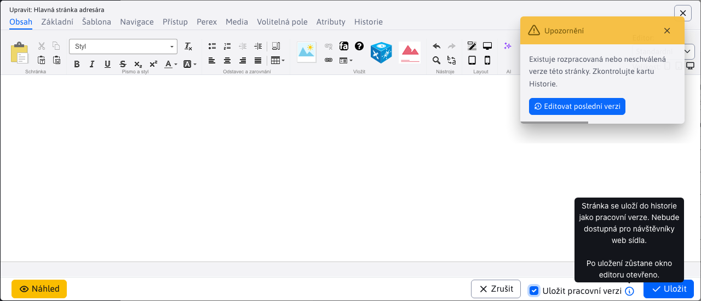
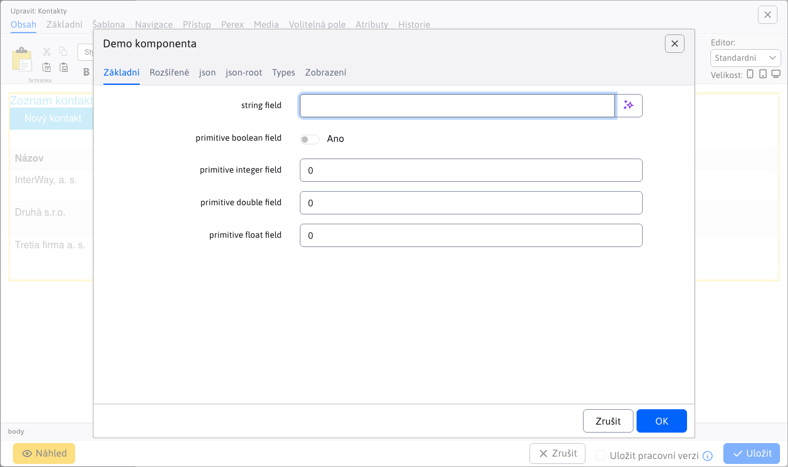
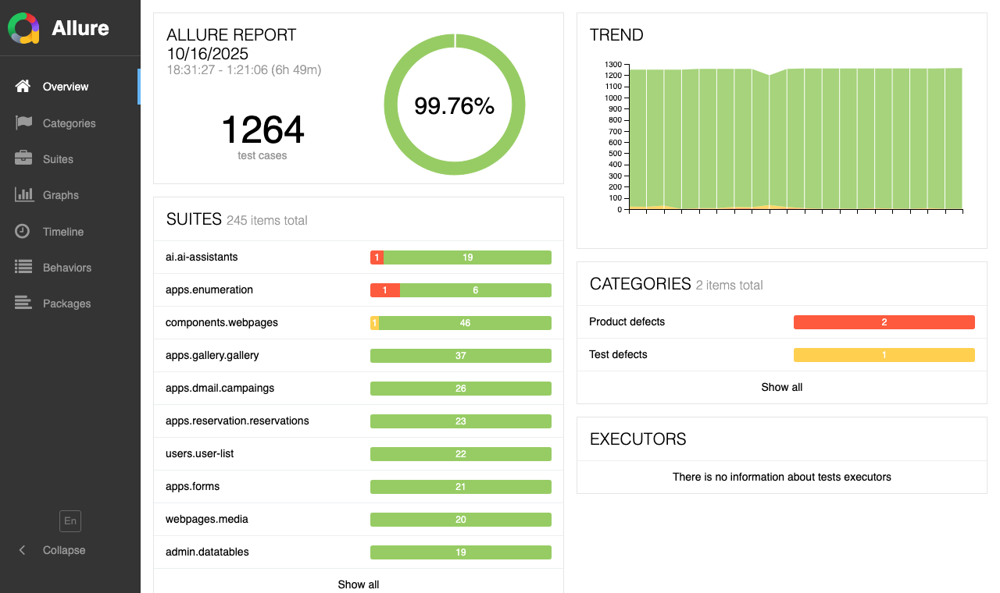

# Seznam změn verze 2022

## 2022.52

> Verze 2022.52 je zaměřena na **zlepšení použitelnosti**, obsahuje vylepšení na základě připomínek uživatelů. Předělány do nového designu jsou aplikace Anketa, definování atributů, **Kontrola odkazů a prázdných stránek, Statistika**, Rezervace. Aplikace Banner přidává možnost použití **volitelných polí**, v galerii je množství drobných zlepšení.

Významné změny v této verzi:
- Datatabulky
  - Pamatování nastaveného počtu záznamů na straně - pokud nastavíte jinou než automatickou hodnotu tabulka si bude pamatovat nastavený počet záznamů na straně.
  - Import - zlepšené zobrazení čísla řádku při chybě importu, doplněné odstranění mezer na začátku a na konci textu, zobrazená informace při importu spousty záznamů.
- Web stránky
  - Při vytváření nové stránky se okno editoru přepne do karty Základní, aby bylo možné hned zadat jméno stránky.
  - Přidána funkce na [kontrolu odkazů a prázdných stránek](redactor/webpages/linkcheck.md).
- Aplikace
  - Předěláno do nového designu: Atributy stránky, Anketa, Statistika, Rezervace a Seznam rezervačních objektů
  - Bannerový systém - doplněna možnost [nastavovat volitelná pole A-F](frontend/webpages/customfields/README.md), které umožní v případě potřeby evidovat/zobrazovat dodatečné informace (např. dodatečný nadpis/odkaz/text tlačítka v banneru).
  - Galerie - automatický výpočet počtu obrázků na stranu a pamatování si nastavené velikosti obrázků `SML`.
  - Galerie - přidána možnost otočit fotku doleva/doprava (původně byla jen možnost doprava).
- Bezpečnost a API
  - Aktualizované knihovny `Spring Security` a další.
  - Přidána možnost použít Google reCaptcha v3.
  - [Přihlašování pomocí API klíče](custom-apps/spring/api-auth.md) posílaného v HTTP hlavičce požadavku.

### Průlomové změny

- Během paralelního testování jsme identifikovali chybu v získávání `domainId` v multi doménových instalacích. Z toho důvodu došlo ke změně získání této hodnoty podle nejnižšího `groupId` složky v dané doméně (původně to bylo podle priority uspořádání). Tato změna může vést k zkažení vztahů v databázi, proto je možné definovat konf. proměnnou `domainId-www.domena.sk` a hodnotou ID, která odkazuje na původně nastavenou hodnotu.
- `FtpDownloader` - třída zrušena.
- Banner - pokud používáte vlastní Java kód pro čtení bannerů došlo ke změně názvu primárního klíče z `bannerId` na standardní `id`.

### Web stránky

- Při vytváření kořenových složek s názvem `Slovensky, Česky, English, Deutsch` se u prázdného pole URL adresa automaticky nastaví dvou písmenový kód jazyka a pořadí uspořádání na `10, 20, 30, 40` (#market-245).
- Opraveno uspořádání seznamu web stránek při prvním načtení, pokud je nastaveno jinak než na výchozí uspořádání podle ID stránky.
- Opraveno zobrazení náhledu nově vytvořené stránky.
- Pokud je definováno více než 30 značek (perex skupin) zobrazí se v kartě Perex jako multi výběrové pole s vyhledáváním namísto standardního seznamu zaškrtávacích polí (#54857).
- Při vytváření nové stránky se okno editoru přepne do karty Základní, aby bylo možné hned zadat jméno stránky (#54857).
- Při přepnutí domény na úvodní stránce se automaticky přepne do sekce Web stránky (pokud má uživatel práva) (#54857-4).
- FontAwesome - zlepšená podpora používání FontAwesome ve web stránkách (korektní načtení fontu v administraci) (#39751-51).
- Vlastnosti aplikace - upravené vkládání seznamu objektů (seznam bannerů, galerie...) pro nový design v editaci vlastností aplikace. Technicky se provede přesměrování z původní URL adresy na novou pokud je definována v `MenuService`. (#54705).
- Opraveno filtrování složky Systém a Koš pokud je to podsložka hlavní složky domény (při aktualizaci starého webu). Nově bývá složka Systém již jako kořenová složka. Opraveno zobrazení stránek při přepnutí karet Složky, Systém a Koš (někdy se nenačetl znovu seznam stránek ve složce Systém) (#54953-4).
- Doplněno tlačítko na [zobrazení statistiky web stránky](redactor/apps/stat/README.md) (#54953-3).
- Atributy stránky - [definování atributů](redactor/webpages/doc-attributes/README.md) předěláno do datatabulek (#54709).
- Přidána funkce na [kontrolu odkazů a prázdných stránek](redactor/webpages/linkcheck.md) (#54697).


### Anketa

- Aplikace předělané na do nového designu (#54705).
- Vytvořeno [dokumentace pro redaktora](redactor/apps/inquiry/README.md) (#54705).


### Bannerový systém

- Doplněna možnost nastavit k banneru klienta, opraveno zobrazení statistiky (možnost změnit data a chyba pokud banner neobsahuje žádnou statistiku) (#39751-52).
- Doplněna kontrola práva "Zobrazit všechny bannery" - pokud uživatel toto právo nemá, zobrazí se mu jen bannery kde je nastaven jako klient (#39751-52).
- Doplněna možnost [nastavovat volitelná pole A-F](frontend/webpages/customfields/README.md), které umožní v případě potřeby evidovat/zobrazovat dodatečné informace (např. dodatečný nadpis/odkaz/text tlačítka v banneru) (#39751-52).

### Galerie

- **Automatický výpočet počtu obrázků na stránku** - podobně jako se počítá počet řádků v datatabulce, tak se podle velikosti okna počítá počet obrázků, které se vejdou najednou do okna pro optimální stránkování (#54857).
- Editor textu - zlepšená kompatibilita se starým editorem, povoleno stylování textu (#39751-50).
- Autor - přidána možnost formátovat text se jménem autora (tučné písmo, odkaz...) (#54857-4).
- **Pamatování nastavené velikosti** - galerie si pamatuje nastavenou velikost náhledů (`S,M,L`), nebo zobrazení ve formě tabulky (#54857-4).
- Vytvoření nové složky nastaví režim Zobrazení na míru namísto chybného Přesný rozměr který deformuje poměr stran (#54857-4).
- Obrázkem nastavený atribut `loading="lazy"` pro načtení obrázku až při posunu stránky (zvýšení rychlosti a snížení objemu dat u velkých galerií).
- Upravené stránkování (Bootstrap kompatibilita).
- Po přidání fotky se provede odstranění `EXIF` informace kvůli bezpečnosti a také kvůli **odstranění orientace (otočení)**, je-li nakonfigurován `ImageMagick`. Originál fotka v editoru totiž byla zobrazena s otočením podle `EXIF` informace, ale zmenšeniny ne, což vytvářelo nesoulad zobrazení (#54909).
- Při použití `ImageMagick` se při otočení obrázku nejprve z originálu odstraní `EXIF` informace o jeho otočení, aby nevznikaly rozdíly mezi originál a náhledovou fotkou (#54909).
- Přidána možnost **otočit fotku doleva/doprava** (původně byla jen možnost doprava), opravena možnost otočit obrázek s příponou `.jpeg` (#39751-52).
- Přidána možnost změnit jméno souboru v editoru (po změně se přejmenují i soubory fotografie na disku) (#39751-52).
- Aby se předešlo zobrazení staré verze obrázku v editoru přidali jsme náhodný URL parametr k jeho cestě. To způsobí, že se při každém otevření editoru načte nově ze serveru (#39751-52).
- Přidán **nástroj Lupa pro zvětšení/zmenšení obrázku** v editoru v kartě Oblast zájmu (#54953-3).

### Statistika

Aplikace [Statistika](redactor/apps/stat/README.md) kompletně předěláno do nového vizuálu. Doplněno [manuál pro redaktora](redactor/apps/stat/README.md) s popisem jednotlivých statistik (#54497, #54585).


- Doplněna možnost nastavit specifickou složku pro zobrazení statistiky (#54953-3).

### Rezervace

Aplikace rezervace a seznam rezervačních objektů předělané do nového vizuálu. Doplněno [manuál pro redaktora](redactor/apps/reservation/reservations/README.md) (#54701).


### Vyhledávání

- `Lucene` - doplněna podpora českého, anglického a německého jazyka. Pro tyto jazyky se používá standardní analyzér a `stemmer` dostupný přímo v `Lucene` (`org.apache.lucene.analysis.JAZYK`).
- `Lucene` - při indexování web stránek se bere v úvahu jazyk web stránky (dle jazyka složky nebo šablony). Do indexu se přidají pouze stránky ve shodném jazyce jako je vytvořený index.

### Datatabulky

- **Pamatování nastaveného počtu záznamů na straně** - pokud nastavíte jinou než automatickou hodnotu tabulka si bude pamatovat nastavený počet záznamů na straně (#39751-50).
- Stránkování - **zvětšený počet čísel stránkování** v patičce tabulky. Pro hlavní tabulky a šířku obrazovky více než 800 bodů je podle šířky tabulky vypočten počet položek stránkování (původně 7 položek) (#39751-50,54857-4).
- `Quill` - jednoduchý HTML editor - rozšířené možnosti jednoduchého HTML editoru (používaného např. v galerii, dotazy a odpovědi...) - přidáno nastavení horní/dolní index, barvy, zarovnání, možnost upravit HTML kód (#54857-4).
- Přidána konfigurační možnost [onPreXhr](developer/datatables/README.md) pro možnost přidání URL parametrů pro volání REST služby. Používá se, pokud je na stránce speciální filtr, například ve statistice (#54585).
- Přidána konfigurační možnost [defaultSearch](developer/datatables/README.md#možnosti-konfigurace) pro inicializování vyhledávání před prvním voláním REST služby (používá se v aplikaci Statistika k pamatování zadaných dat od-do mezi jednotlivými stránkami statistiky) (#54585).
- Přidána možnost nastavit hodnotu `null` (zadanou jako řetězec) ve výběrovém poli (pro možnost nastavení/filtrování `null/true/false`) (#54701).
- Přidán typ pole `TIME_HM/TIME_HMS` pro [výběr hodin a minut](developer/datatables-editor/standard-fields.md#time_hm-a-time_hms) (a případně vteřin) (#54701).
- Import - doplněno **zobrazení čísla řádku při chybě** i když importovaná entita nedědí z `ActiveRecordBase` (#39751-53).
- Import - doplněno odstranění mezer na začátku a konci hodnoty v buňce (aby např. nenastala chyba importu kvůli nesprávné email adrese) (#39751-53).
- Import - doplněno zobrazení progresu importu v %, doplněna indikační ikona na tlačítko importu (#39751-53).

### Bezpečnost

- Aktualizovaná knihovna `Spring Security` na verzi `5.6.+` (#39751-50).
- Aktualizováno JavaScript knihovny (#54857-4).
- Opravena možná XSS zranitelnost v auditu (#54857-4).
- Registrace uživatele - doplněna JavaScript kontrola pole Zopakovat heslo, aby nešel formulář odeslat, pokud se neshoduje s polem Heslo.
- Přidána možnost použít **Google reCaptcha v3**.

### API přístup

- Přidána možnost volat REST služby administrace programově z externího systému (#54941).
- [Přihlašování pomocí API klíče](custom-apps/spring/api-auth.md) posílaného v HTTP hlavičce požadavku.
- API klíč je se generuje v profilu příslušného uživatele, zadáním znaku `*` se vygeneruje náhodný API klíč.

### Jiné drobné změny

- Administrace - levé menu - při kliknutí na položku která je nízko v menu se při načtení stránky posune menu výše, aby byla položka viditelná a byly zobrazeny případné položky druhé úrovně menu (#54701).
- Animace načítání - přidána možnost zobrazit [animaci načítání](developer/frameworks/webjetjs.md#animace-načítání) Např. během generování grafů (#54585).
- Banner - přidána možnost nastavení [kampaňového URL parametru](redactor/apps/banner/README.md#banner-typu-obsahový-banner) a zobrazení banneru jen při kampani.
- Dialogová okna - upravený vizuál dialogových oken starších částí (např. nastavení aplikace, dialogy v editoru stránek) na nový styl hlavičky a karet (#39751-52).
- Doménové přesměrování - opraveno získání doménového aliasu při detekci `xsrf` (již není nutné při vytvoření doménového aliasu přidat doménu i do konf. proměnné `xsrfReferers`).
- Formulář snadno - přidána detekce vložení `check_form` pro kontrolu vyplněných polí. Pokud se již ve stránce nachází (existuje objekt `checkFormLoaded`) nebude se zbytečně vkládat skript na jeho vložení (#54393).
- Formulář snadno - upravené zobrazování tooltip textu - podpora pro Bootstrap 5, nahrazení vadného `.popover` z `.tooltip` (#54393).
- Formulář snadno - upravené generování ID pole pro výběrová a zaškrtávací pole, aby se korektně dalo kliknout na text a zvolila se příslušná možnost (#market-245).
- Formulář snadno - **nastavená minimální šířka pole při řádkovém zobrazení** tak, aby se na mobilním telefonu pole zobrazily na celou šířku a ne vedle sebe (kde jsou příliš malé) (#54857).
- Hromadný email - doplněná kontrola email adresy (validace) při přihlášení/odhlášení z hromadného emailu.
- Hromadný email - přidána možnost **zadat více email adres v dialogu odhlášeného emailu** (#39751-53).
- Hromadný email - přidána kontrola duplicit při zadávání odhlášených email adres (#39751-53).
- Hromadný email - opravena chyba přidání emailu do kampaně pokud je email na seznamu odhlášených emailů. Namísto chyby se přidání považuje za korektní a pokračuje se na další záznam (#39751-53).
- Soubory - přidána možnost používat [externí adresář pro soubory](frontend/setup/README.md) jako součást web aplikace. Nastavuje se jako konf. proměnná `cloudStaticFilesDir={FILE_ROOT}static-files` což nastaví ukládání souborů pro každou doménu samostatně ve složce `static_files` v kořenové složce web aplikace (#39751-47).
- Šablony - v editoru přidána karta Složky a Web stránky se **seznamem složek a stránek používajících zobrazenou šablonu** (#54693).
- Zrcadlení struktury - kořenovou složkou se již nebude synchronizovat pořadí uspořádání, aby se dalo nastavit jejich pořadí v administraci (např. první Česky a druhé English).
- Doplněna API funkce [WJ.prompt](developer/frameworks/webjetjs.md#získání-hodnoty) pro získání hodnoty od uživatele (např. heslo pro potvrzení smazání a podobně) (#54701).

### Dokumentace

- Vytvořená dokumentace a optimalizovaný projekt `basecms` pro nastavení [debug režimu](custom-apps/vscode/debugging/README.md) ve VS Code pro Java i JavaScript soubory (#54393).
- Doplněna dokumentace pro nastavení [kampaňového URL parametru](redactor/apps/banner/README.md#banner-typu-obsahový-banner) a zobrazení banneru jen při kampani.
- Doplněna dokumentace pro [Thymeleaf](frontend/thymeleaf/webjet-objects.md) objekty šablony (`${ninja.temp.baseCssLink},${ninja.temp.cssLink})`.
- Vytvořená dokumentace pro aplikaci [statistika](redactor/apps/stat/README.md) (#54497).
- Doplněna dokumentace v sekci Programování zákaznických aplikací o možnost přiložení JavaScript modulu k aplikaci jako [položka v admin části](custom-apps/admin-menu-item/README.md#přiložení-javascript-souboru) (#54585).
- Vytvořená dokumentace pro redaktora pro aplikaci [rezervace](redactor/apps/reservation/reservations/README.md) a [rezervační objekty](redactor/apps/reservation/reservation-objects/README.md) (#54701).
- Vytvořená dokumentace pro Programování zákaznických aplikací - [Autorizace tokenem](custom-apps/spring/api-auth.md), [zabezpečení REST služeb](custom-apps/spring/rest-url.md), doplněná dokumentace o nastavení [SpringSecurity](custom-apps/spring-config/README.md#nastavení-springsecurity) (#54941).
- Statistika - doplněná informace o ukládání statistiky [bez GDPR souhlasu](redactor/apps/stat/README.md) (#54709).
- Atributy stránky - vytvořená dokumentace k [definování atributů](redactor/webpages/doc-attributes/README.md) (#54709).
- Vytvořená dokumentace pro redaktora pro aplikaci [galerie](redactor/apps/gallery/README.md) (#54953-4).

### Testování

- Web stránky - doplněné testy vyplnění polí web stránky, časového publikování, duplikování, zobrazení historie, poznámky redaktora, výběr šablony atp. (#52996).
- Automatizované testy - předělané volání `I.isFirefox/I.isChromium` do samostatného `Page` objektu `Browser`. Čili volání jsou `Browser.isFirefox()/Browser.isChromium()/Browser.getBrowserType()` (#MR302).
- Automatizované testy - předělané volání `I.wjDocsScreenshot` do samostatného `Page` objektu `Document`.
- Galerie - doplněný test pamatování nastavené velikosti obrázků a zobrazení HTML textu v popisu a autorovi fotografie (#54857-4).
- Překladové klíče - doplněný test hledání podle začíná/končí na a rovná se (#54857-4).
- Přidané funkce `DT.checkTableCell, DT.checkTableRow` pro testování hodnoty v [buňce tabulky a v celém řádku](developer/testing/README.md#webjet-doplňkové-funkce).
- Přidáno generování reportu [pokrytí kódu](developer/testing/codecoverage.md) během testování (#54909).
- Změněný způsob vizuálního porovnání obrázků z [Resemble](https://codecept.io/visual/#visual-testing) na [pixelMatchHelper](https://github.com/stracker-phil/codeceptjs-pixelmatchhelper), který umí být použit i při paralelním spuštění testů (#54909).
- Přidána možnost spouštět [testy paralelně](developer/testing/parallel.md) pro jejich rychlejší provedení (#54909).
- Přidána možnost [testovat REST služby](developer/testing/README.md#testování-rest-služeb) (#54941).
- Přidána funkce `Document.screenshotAppEditor(docId, path, callback, width, height)` pro pořízení snímku nastavení aplikace (#54953-4).

### Oprava chyb

- Bannerový systém - opraveno zobrazení atributu Zobrazitelný při otevření okna editoru v datatabulce (#54857).
- Bannerový systém - opraveno zobrazení seznamu bannerů, chybně se zobrazilo jen prvních 20 bannerů (#54697).
- Datatabulky - opraveno (zbytečné) uložení stavu tabulky, pokud má nastavenou konfigurační možnost uspořádání podle určitého sloupce. Stav tabulky je možné až 800ms po její inicializaci, kdy se předpokládá provedení akce uživatelem.
- Datatabulky - opraveno zobrazení názvu objektu ke smazání pokud se jedná o `GroupDetails` objekt (#39751-53).
- Formuláře - opraveno zobrazení seznamu vyplněných formulářů pokud jméno pole (sloupec) obsahuje znak závorky (#39751-52).
- Hromadný e-mail - doplněna kontrola platnosti email adresy při importu příjemců, pokud je neplatná zobrazí se chybová zpráva. Z emailu jsou před importem odstraněny mezery (#39751-51).
- Média - opravena kontrola práv při editaci stávajícího média ve stránce (#39751-52).
- Monitorování serveru - opraveno zobrazení překladových textů (#39751-52).
- Překladové klíče - opraveno vyhledávání klíče podle začíná na, končí na a rovná se (#54857-4).
- Šablony - opravené načtení výběrového seznamu hlaviček/patiček/menu, filtrování podle skupiny šablon (shoda názvu vs obsahuje), filtrování podle spam ochrany a počtu použití (#54857-4).
- Statistika - opravené načítání údajů od začátku roku - problém s číslem týdne na přechodu let) (#39751-53).
- Web stránky - opravené ukládání pole `Odverejniť stránku po tomto dátume` (#52996).
- Web stránky - opraveno nastavení domény po přihlášení pokud aktuální doména není ve shodě s polem pro výběr domény (#39751-47).
- Web stránky - opravena možnost zadat URL adresu obsahující znak @, aniž by to bylo považováno za email adresu (např. odkaz na TikTok profil).
- Web stránky - opravené stránkování v editoru v kartě Média (#39751-54).
- Web stránky - opravena možnost duplikovat složku (54953-3).

### Pro programátora

- Doplněná funkce `WJ.confirm` pro [získání hodnoty](developer/frameworks/webjetjs.md#získání-hodnoty) (#54701).


## 2022.40

> Verze 2022.40 je zaměřena na **zlepšení bezpečnosti**. Obsahuje aktualizované Java i JavaScript knihovny a zkontrolované zranitelnosti. Přináší ale i řadu jiných změn pro **zlepšení práce na základě zpětné vazby** - zapamatování poslední složky ve web stránkách, pamatování pořadí sloupců a uspořádání v data tabulkách, možnost posouvat okno atp. Jemně **upravuje design uživatelského rozhraní** (novější sada ikon, jemnější barevnost menu).

Významné změny v této verzi:
- Bezpečnost
  - Aktualizováno Java a JavaScript knihovny, aktualizováno VueJS z verze 2 na verzi 3.
  - Změněný algoritmus `hashovania` hesel na standard [bcrypt](sysadmin/pentests/README.md#algoritmus-hashování-hesel).
  - Všechny chybové výpisy `Stack Trace` jsou směrovány přes `Logger`, zobrazí se tedy iv seznamu [Posledních logů](sysadmin/audit/memory-logging.md) v sekci Audit.
  - Přidána možnost generovat HTTP hlavičku `Access-Control-Allow-Origin` pro zajištění přístupu k REST službám.
- Datatabulky
  - Doplněno dynamické počítání počtu řádků na stranu podle velikosti okna prohlížeče.
  - Přidána možnost přesouvat okno editoru.
  - Přidáno zapamatování [pořadí sloupců a způsobu uspořádání](redactor/datatables/README.md#pamatování-uspořádání) tabulky.
  - Přidána [klávesová zkratka](redactor/datatables/README.md#klávesové-zkratky), `CTRL+S/CMD+S` pro uložení záznamu do databáze bez zavření okna editoru pro pokračování v práci.
- Web stránky
  - Page Builder - doplněno [přepínání velikosti obrazovky](redactor/webpages/pagebuilder.md#nastavení-šířky-sloupců) pro nastavení šířky sloupce pro desktop, tablet a mobilní telefon.
  - Přidána možnost zobrazit [náhled kompletní web stránky](redactor/webpages/editor.md#náhled-stránky) bez jejího uložení.
  - Seznam web stránek si v rámci jednoho přihlášení pamatuje naposledy zobrazenou složku (stromovou strukturu), při návratu se složka znovu rozbalí.
- Aplikace
  - Předěláno do nového designu: Hromadný e-mail, Kalendář událostí/Seznam a typy.
  - Formulář snadno - přidána možnost generovat formuláře s více poli v jednom řádku a typ pole Výběrový seznam - select.
  - Vyhledávání - přidána váhy pro titulek stránky (váha 20) a nadpisy (váha 10) pro možnost uspořádání výsledků s prioritou stránek, kde je hledaný výraz v titulku nebo nadpisu.

Níže naleznete kompletní seznam změn v této verzi.

<div class="video-container">
  <iframe width="560" height="315" src="https://www.youtube.com/embed/ZJGYsQo-_Q4" title="YouTube video player" frameborder="0" allow="accelerometer; autoplay; clipboard-write; encrypted-media; gyroscope; picture-in-picture" allowfullscreen></iframe>
</div>

### PageBuilder

- Upravené zobrazení rámů kolem elementů - nejsou zobrazeny a hlavně schovány okamžitě, ale jsou animovány. Zlepšuje to použitelnost kliknutí na tlačítko ozubeného kola, které nezmizí okamžitě když přejedete myší mírně mimo rámeček (#54345).
- Po zavření okna se smaže náhled stránky, aby při novém otevření okna neblikla předchozí verze/web stránka.
- Při smazání všech karet nebo `accordion` se zobrazí tlačítko + pro přidání nové položky. Je tak možné korektně smazat všechny elementy a následně je nově přidat.
- Při smazání všech sekcí (bloků) ze stránky se zobrazí modré tlačítko + pro přidání nové položky.
- Přidán CSS styl `pb-col` a `pb-col-auto` pro možnost nastavení sloupců, kterým se [nelze nastavovat šířka](frontend/page-builder/settings.md#column-zelená-barva).
- Doplněno [přepínání velikosti obrazovky](redactor/webpages/pagebuilder.md#nastavení-šířky-sloupců) pro desktop, tablet a mobilní telefon. Umožňuje nastavit šířky sloupce podle zvoleného zařízení (#39751).
- Velikost okna editoru zvětšená na šířku 1210 bodů, aby bylo možné nastavovat CSS třídy `col-xl-` pro šířku 1200 bodů `desktop` (#39751).
- Přidána podpora provedení `data-th-src` a `data-th-href` atributů včetně `${ninja.temp.basePathXXX}` při vložení bloku do stránky (#39751-38).

### Web stránky

- Při vytvoření nové domény se automaticky vytvoří stránky Základní hlavička/patička/menu ve složce Systém pro nastavení hlavičky/patičky a menu.
- Při vytvoření složky se prázdné pole URL adresa automaticky nastaví na dvou písmenový kód jazyka (např. `sk`) pro názvy `Slovensky, English, Deutsch a Česky`.
- Pokud existuje lokální (pro doménu) i globální (s nenastavenou doménou) složku Systém v seznamu web stránek se zobrazí jen lokální (aby se nezobrazovaly dvě složky se stejným názvem, které nelze na první pohled odlišit).
- Ve vlastnostech složky jsou rozděleny skupiny pro omezení přístupu a hromadný e-mail stejně jako ve web stránkách (#54493).
- Přidána možnost zobrazit [náhled kompletní web stránky](redactor/webpages/editor.md#náhled-stránky) bez jejího uložení (#54513).



- Přidána možnost ve stromové struktuře [zobrazit ID adresáře, pořadí uspořádání a také seznam web stránek](redactor/webpages/README.md#nastavení-zobrazení-stromové-struktury) (pro účely drag\&drop) (#54513).
- Přidáno hledání jazykové mutace hlavičky/patičky/menu (hledá se stránka `LNG-meno`) při nastavení jazyka adresáře i když se nepoužívá lokální `System` složka (#39751).
- Upravená velikost a pozice okna vlastností aplikace - okno je umístěno na střed a je vypočten maximální rozměr dle dostupné plochy (#39751).


- Upravené získání [seznamu CSS stylů pro výběrové pole v editoru](frontend/examples/template-bare/README.md#seznam-stylů-pro-editor) - pokud je v šabloně nastaven minifikovaný CSS soubor hledá se jeho ne-minifikovaná verze. Zároveň při čtení CSS souboru skončí prohledávání po nalezení `@media` výrazu, což typicky při vložení `bootstrap` pro začátek znamená, že se nenajdou žádné styly. Nový kód prohledává CSS soubor ještě jednou a hledá komentář `/* editor */`. Pokud se najde použije se definice z předchozího řádku (#39751-35).


- V editoru stránek v kartě Šablona do seznamu pro volné objekty přidány i stránky pro menu (původně se zobrazoval pouze seznam pro hlavičky a patičky) (#39751-36).
- Pokud má stránka nastavenu možnost "Automaticky generovat URL adresu z názvu položky v menu" a již existuje stránka se stejnou URL adresou/názvem (např. v koši) zobrazí se hlášení "Zadaná virtuální cesta je již použita na stránce" pouze při vytvoření stránky, následně se bude používat adresa s pořadovým číslem na konci.
- Karty Systém a Koš se nezobrazí, pokud uživatel nemá právo na některou složku nebo stránku v těchto kartách (#39751-39).
- Doplněno zobrazení složek ve stromové struktuře podle práv na konkrétní stránky. V seznamu stránek se ve složce následně zobrazí pouze stránky, na které má uživatel práva (#39751-39).
- V kartě [Historie](redactor/webpages/history.md) se zobrazuje datum plánovaného publikování stránky, změněné uspořádání záznamů tak, aby plánované události byly na začátku seznamu (#54513-15).
- Historie - přidána možnost smazat naplánovanou změnu ve web stránce (#54513-15).
- Přidána [karta Složky](redactor/webpages/README.md#karty-web-stránek) do datatabulky. Umožňuje využívat funkce datatabulky jako hromadné operace, úprava buňky, duplikovat i na stromovou strukturu složek (#54797).


- Zapamatování naposledy otevřené složky - seznam web stránek si vrámci jednoho přihlášení pamatuje naposledy otevřenou složku, při návratu na seznam web stránek se složka znovu otevře (#39751-45).

### AB testování

- Přidána možnost vytvořit B verzi stránky pro aplikaci AB testování
- Vytvořeno [dokumentace pro redaktora](redactor/apps/abtesting/README.md).


### Šablony

- [Thymeleaf šablonám](frontend/thymeleaf/tags.md#provedení-include-značky) přidána možnost zachovat obalovací element nastavením atributu `data-iwcm-remove` pro zachování struktury shodné s prototypováním a možností použití elementů jako `header, article, footer`.
- Upravený editor šablon a skupin šablon - lepší rozdělení polí do karet.
- Skupiny šablon - doplněn přepínač jazyka Metadat, opraveno nastavení českých překladů, opraveno nastavení pole `Generator` (#39751).

### Formulář snadno

- Přidána možnost zobrazit jednotlivá pole v řádku (čili pole jsou zobrazena vedle sebe, ne pod sebou). Přidáno pole Nový řádek pro vytvoření nového řádku a Prázdná buňka pro vložení prázdného prostoru do řádku. Polím v řádku se automaticky stejným dílem přerozdělí prostor v řádku.
- Je-li zadáno pole Zástupný text ale pole Hodnota je prázdné, tak se nad polem nezobrazí název pole, zobrazen je pouze zástupný text. Umožňuje to vytvořit formulář, který zabírá menší prostor.


- Přidána možnost [vytvářet skupiny polí](redactor/apps/formsimple/README.md#Položky) Např. výběrová pole a zaškrtávací pole. Jako rozdělovač se používá znak `|`, nebo znak `,` nebo mezera. Znak `|` je třeba použít pokud jedna z možností má obsahovat čárku.


- Přidán ty pole Výběrový seznam - select, jednotlivé hodnoty se oddělují znakům `,`, je možné zadat rozdílný text a hodnotu ve formě `Pomaranč:orange,Jablko:apple`.

### Formuláře

- Upraveno filtrování dat pro možnost vyhledávání ve všech sloupcích (původní varianta neumožňovala hledat v libovolném sloupci).
- Rozšířené [možnosti exportu](redactor/apps/form/README.md) - přidána možnost exportovat vyfiltrovaná data, zatím neexportované a také označené řádky (#54513).


- Náhled vyplněného formuláře se pro označený jeden řádek zobrazí v dialogovém okně. Pokud je označeno více řádků zobrazí se každý formulář v nové kartě pro snazší porovnání (#39751-40).

### GDPR

- Cookie Manažer - upravené styly pro standard Bootstrap, tlačítka změněná z odkazu na standardní tlačítko, aby nekolidovala barvy odkazu a tlačítka v patičce (#54345).
- Vyhledávání - doplněné odkazy na zobrazení detailu nalezeného záznamu (#54513).
- GDPR Cookies - přidána možnost zobrazit cookies lištu v zadaném jazyce, ten nastavíte parametrem `lng` (#39751).

### Hromadný e-mail

Aplikace předělána do nového vizuálu. Přidána možnost nastavení začátku odesílání kampaně. Import příjemců je možný z `xlsx` formátu, výběrem skupiny uživatelů, nebo zadáním emailových adres.


- Přidán jednodušší formulář pro registraci do hromadného emailu (zobrazuje jen pole pro zadání emailové adresy). Registruje do všech emailových skupin, které mají zapnutou možnost `Povoliť pridávanie/odoberanie zo skupiny samotným používateľom` a `Vyžadovať potvrdenie e-mailovej adresy`. Neobsahuje ani `captcha` element, proto je vyžadováno zapnuté potvrzení e-mailové adresy. Formulář využívá `Bootstrap v5` pro zobrazení formuláře a dialogového okna.
- Vytvořená dokumentace s popisem fungování [odesílání hromadných emailů](redactor/apps/dmail/campaings/how-sender-works.md).
- Do editoru přidána karta Náhled se zobrazením zvolené stránky emailu. Pokud stránka používá inline editaci/PageBuilder, lze ji také upravovat (#39751-44).

### Kalendář událostí

- Seznam událostí předělaný do nového vizuálu a datatabulek. Připraven [manuál pro redaktora](redactor/apps/calendar/README.md) (#54473).
- Konfigurace typů událostí předělaná do nového vizuálu a datatabulek. Připraven [manuál pro redaktora](redactor/apps/calendar/calendar-types/README.md) (#54473).


### Uživatelé

- V seznamu skupin uživatelů v editoru doplněna karta Uživatelé se seznamem uživatelů v editované skupině (#54493).
- V seznamu skupin uživatelů upraveno načtení seznamu web stránek na serverové stránkování (#54493).
- V seznamu uživatelů je možné filtrování podle skupin uživatelů (#54493).

### Vyhledávání

- `Lucene` - upravené indexování - indexuje se titulek stránky s váhou 20 (přičemž titulek se indexuje v původním tvaru i v základním přes `Lemmas`), ze stránky se získají všechny nadpisy a použijí se s váhou 10. Pro zobrazení výsledků je třeba nastavit `orderType="score"`, které následně seřadí výsledky podle dosaženého počtu bodů.
- `Lucene` - upravené vyhledávání - zadaný text se nejprve převede do základního tvaru (tzv. `Lemmas`) a až následně se vyhledává.

### Datatabulky

- Výběrové pole s možností editace – zvětšená velikost okna editace na stejnou velikost jako má editace web stránky pro lepší responzivní zobrazení (např. při úpravě hlavičky z editace šablony) (#54345).
- Přidána možnost importu a exportu iz vnořených tabulek (korektně se zobrazí přes otevřené okno editoru se správným zatemněním) (#54377).
- Přidána metoda pro aplikování specifických parametrů hledání i při [prvním (kompletním) načtení tabulky](developer/datatables/restcontroller.md#filtrování-při-zobrazení-všech-záznamů) (volá `addSpecSearch` při volání `getAll`). Stačí ve vaší implementaci `getAll` volat metodu `getAllItemsIncludeSpecSearch` (#54493).
- Přidána možnost exportovat data i ve formátu `CSV` (#54513).
- Přidán typ pole [MULTISELECT](developer/datatables-editor/standard-fields.md) (#54273).
- Upravená velikost sloupce Stav, tak aby zbytečně nezabíral šířku tabulky (#54273-26).
- Doplněno popisky ikony pro maximalizování okna editoru, doplněno tlačítko pro zavření okna v hlavičce (#54273-26).
- Doplněno dynamické počítání počtu řádků na stranu podle velikosti okna prohlížeče (#54273-26).


- Přidána [klávesová zkratka](redactor/datatables/README.md#klávesové-zkratky), `CTRL+S/CMD+S`, která provede uložení záznamu do databáze, ale zároveň ponechá otevřené okno editoru (#54273-26).
- Import - při chybě importu se v chybové zprávě zobrazí číslo řádku a také podrobný seznam chyb (#39751-39).
- Doplněna možnost `tab.hideOnCreate` a `tab.hideOnEdit` pro schování [karty v editoru](developer/datatables-editor/README.md#karty-v-editoru) pro nový záznam a editaci existujícího záznamu (#54749).
- Doplněno [název editované položky](redactor/datatables/README.md#zobrazení-názvu-v-hlavičce-okna) v hlavičce editoru a seznam položek v dialogovém okně potvrzení smazání (#54753).


- Zlepšená jednotnost vizuálu starých tabulek generovaných přes `displaytag` a přes starší verzi `DataTables`. Stránkování je posunuto napravo, řádkování a přechod myší přes řádky je (#39751-42).
- Přidána možnost nastavit kartu na [plnou výšku okna editoru](developer/datatables-editor/README.md#karty-v-editoru) (#39751-42).
- Přidána možnost [přesouvat okno](redactor/datatables/README.md#možnost-přesouvat-okno) editoru (#54513-21).
- Přidáno zapamatování [pořadí sloupců a způsobu uspořádání](redactor/datatables/README.md#pamatování-uspořádání) tabulky (#54513-22).

### Jazykové mutace

- Opraveno načtení administrace v jiném než slovenském jazyce.
- Prohledané stránky na výskyt statických textů bez překladů, texty nahrazené překladovými klíči.
- Doplněny překlady pro češtinu a angličtinu.
- Přidána možnost použití parametrů pro použití překladových [klíčů v JavaScript souborech](developer/frameworks/jstranslate.md#frontend-knihovna).

### Bezpečnost

- Aktualizované knihovny spring na 5.6.5 a thymeleaf na 3.0.15.
- Změněný algoritmus `hashovania`, [hesel na bcrypt](sysadmin/pentests/README.md#algoritmus-hashování-hesel).
- Doplněna [kontrola práv při zobrazení stránky](developer/frameworks/thymeleaf.md#kontrola-práv) v administraci (původně se kontrolovalo jen volání REST služby). Založeno je na vyhledání URL adresy v menu a následném získání práva pro danou URL adresu. To se následně ověří s právy přihlášeného uživatele (#54649).
- Při [testu datatabulek](developer/testing/datatable.md#testování-práv) je povinné zadání možnosti `perms` pro testování práv.
- Volání skriptu `/admin/mem.jsp` je povoleno pouze pro IP adresy nastavené v konf. proměnné `serverMonitoringEnableIPs`. Původně byl skript dostupný vždy (používal se pro základní monitorování), ale zobrazuje potenciálně citlivé údaje.
- Doplněná dokumentace [Bezpečnostní testy pro provoz](sysadmin/pentests/README.md) o další řešení bezpečnostních nálezů a nastavení pro nezobrazení podrobné chyby a verze `Apache Tomcat` (#43144).
- Zrušená možnost přímo zobrazit JSP komponentu `/components/user/logon.jsp`. Při přístupu k zaheslovanému souboru se již neprovede přesměrování na `logon.jsp`, ale se provede vnitřní `forward`, čili URL adresa zůstane původní. V případě potřeby doporučujeme použít konf. proměnnou `fileAccessDeniedDocId` k nastavení ID stránky pro zobrazení přihlášení při přístupu k souboru a nastavit korektně ID stránky pro přihlášení složkou web stránek (#43144).
- Upravené přesměrování při použití znaků `//` v URL adrese - zachová se doména i port (nepoužije se absolutní adresa is doménou) (#43144).
- Diskuse/Fórum - AJAX volání `/components/forum/new.jsp` je možné jen po zobrazení diskusního fóra, není tuto stránku možné volat, pokud web neobsahuje diskusi (#43144).
- Upravené volání `/topdf` aby v případě nenalezené stránky zobrazilo chybu 404 namísto prázdného PDF, ošetřeno i přesměrování stránky (#43144).
- Odstraněná stará verze `jquery.cookie.js` v aplikaci GDPR - nahrazena verzí v `_common` adresáři (#43144).
- Aktualizovaná knihovna Spring na verzi `5.3.+`, `Amazon AWS` na 1.12.+ a `Jquery UI` na 1.13.2 (#546734).
- Aktualizováno `Vue.js` z verze 2.6 na verzi 3.2.37, `vue-router` na verzi 4.1 a `vue-advanced-cropper` na 2.8.
- Aktualizováno všechny JavaScript knihovny pro `/admin/v9/` (#54721-3).
- Aktualizován FontAwesome (ikony) na verzi 6 (#54721-3).


- Všechny chybové výpisy `Stack Trace` přesměrováno ze standardního výstupu přes `Logger`. Zobrazí se tedy iv seznamu [Posledních logů](sysadmin/audit/memory-logging.md) v sekci Audit (#54269).
- Přidána možnost generovat HTTP hlavičku `Access-Control-Allow-Origin`, nastavuje se v konf. proměnných `accessControlAllowOriginValue a accessControlAllowOriginUrls`. Ve výchozím nastavení se hlavička generuje pro URL začínající na `/rest/,/private/rest/,/admin/rest/`.
- Aktualizovaná knihovna `org.json` na 20220924.

### Jiné drobné změny

- Bannerový systém - doplněná možnost filtrování banneru podle zobrazitelný - kontroluje nejen možnost aktivní, ale také omezení na počet zobrazení/kliknutí a datumová omezení (#39751-44).
- Bannerový systém - doplněno tlačítko pro zobrazení statistiky banneru, doplněná karta se statistikou do editoru (#39751-44).
- Hromadný email - při získání HTML kódu hromadného emailu se do stránky nebude vkládat jQuery, které je pro emailovou verzi zbytečné.
- Optimalizace výkonu - optimalizované načítání seznamu šablon - upravené získání skupiny šablon, data jednotlivých objektů (stránek) se načítají dynamicky až v případě jejich potřeby (#53273).
- Otázky a odpovědi - přidána SPAM kontrola a možnost zobrazení Captcha obrázku (přidáním hodnoty `,qa` do konf. proměnné `captchaComponents`). Nekontroluje se pokud je přihlášen administrátor.
- Vyhledávání v administraci - vyhledávání po kliknutí na jméno stránky otevře editor v novém okně (původně otevíral v popup okně starou verzi editoru) (#39751-44).
- Úvod - doplněné překlady sekce Aplikace upravené pro WebJET a Novinky ve WebJETu. Seznam novinek je čten z externího serveru a aktualizuje se tedy i bez aktualizace samotného WebJETu. Uživatelé tak mohou vidět seznam změn i ve verzi, kterou ještě nemají nasazenou (#39751-45).

### Dokumentace

- Vytvořená dokumentace [ukázkové Bare šablony](frontend/examples/template-bare/README.md) pro frontend programátora.
- Vytvořená dokumentace pro redaktora - [Hromadný email kampaně](redactor/apps/dmail/campaings/README.MD) a [Formulář pro přihlášení](redactor/apps/dmail/form/README.md).
- Vytvořená dokumentace s popisem fungování [odesílání hromadných emailů](redactor/apps/dmail/campaings/how-sender-works.md).
- Vytvořená dokumentace pro redaktora pro aplikaci [seznam formulářů](redactor/apps/form/README.md).
- Vytvořená dokumentace k [náhledu kompletní web stránky](redactor/webpages/editor.md#náhled-stránky) bez jejího uložení pro redaktora a také pro [programátora](developer/apps/webpages/README.md#náhled-stránky).
- Vytvořená dokumentace k použití [specifického JavaScript](developer/frameworks/README.md#webpack) souboru pro vkládání do pug souboru.
- Doplněna dokumentace pro možnost přidání tlačítka do [editora datatabulky](developer/datatables-editor/README.md#Speciální-tlačítka).
- Vytvořená dokumentace pro redaktora pro aplikaci [AB testování](redactor/apps/abtesting/README.md).
- Vytvořená dokumentace pro programátora k použití [perzistentních nastavení uživatele](developer/frameworks/webjetjs.md#perzistentní-nastavení-uživatele)
- Vytvořená dokumentace pro redaktora k aplikaci Kalendář událostí - [Seznam událostí](redactor/apps/calendar/README.md) a [Konfigurace typů událostí](redactor/apps/calendar/calendar-types/README.md) (#54473).
- Vytvořená dokumentace pro programátora se seznamem [typů polí pro DataTables editor](developer/datatables-editor/standard-fields.md) (#54273).
- Přidána dokumentace pro web designéra s popisem způsobu [přidání stylů do výběrového pole v editoru](frontend/examples/template-bare/README.md#seznam-stylů-pro-editor) (#39751-35).
- Vytvořená ukázka a dokumentace [nahrání souboru](custom-apps/spring-mvc/admin-with-upload.md) a [importu z Excelu](custom-apps/spring-mvc/admin-excel-import.md) pro programátora zákaznických aplikací (#54449).
- Doplněná dokumentace [Bezpečnostní testy pro provoz](sysadmin/pentests/README.md) o další řešení bezpečnostních nálezů a nastavení pro nezobrazení podrobné chyby a verze `Apache Tomcat` (#43144).
- Odkaz Nápověda v administraci směrovaný na hlavní stránku dokumentace, nebo na specifickou stránku (pokud již existuje) místo směrování do staré dokumentace pro verzi 8 (#39751-40).
- Vytvořená dokumentace Audit s [popisem typů auditních záznamů](sysadmin/audit/README.md) pro provoz (#54269).
- Doplněna dokumentace pro programátora o [použití validace polí](developer/datatables-editor/datatable-columns.md#validace) (#54597).
- Doplněna dokumentace pro redaktora - [Web stránky - karty web stránek](redactor/webpages/README.md#karty-web-stránek) (#54797).
- Doplněna dokumentace pro nastavení [bezpečnostních HTTP hlaviček](sysadmin/pentests/README.md#http-hlavičky).

### Testování

- Upraveno automatizované testování datatabulky - po smazání záznamu je tabulka obnovena a znovu je zkontrolováno, zda se záznam smazal (pokud nastala např. chyba smazání v cache) (#54513).
- Vytvořený test nastavení zobrazení stromové struktury `jstreesettings.js` (#54513).
- Skripty - doplněný test kontroly vkládání skriptů do stránky podle podmínek struktury i dat (#39751).
- Skupiny šablon - doplněn test ukládání a zobrazení metadat ve stránce, ověření ukládání podle jazykové mutace (#39751).
- Page Builder - vytvořený test přepínání a režimu Page Builder a Standardní (#39751).
- Datatabulka - přidán test maximalizace okna, jeho zavření kliknutím na ikonu v hlavičce a dynamického výpočtu počtu řádků na straně (#54273-16).
- Web stránky - přidán test ukládání stránky klávesovou zkratkou CTRL+s/CMS+s (#54273-16).
- Při [testu datatabulek](developer/testing/datatable.md#testování-práv) je povinné zadání možnosti `perms` pro testování práv.
- Kontrola práv na soubor - přidaný test `links.js` pro ověření zadávání přihlašovacích údajů při přístupu k souboru v základní verzi i se zobrazením pěkné přihlašovací stránky.
- Doplněné testy zobrazení médií (`media.js`) na webové stránce včetně testů dat změny webové stránky (#54689).
- Aktualizován `CodeceptJS` na verzi `3.3.5`, Chromium na verzi 105, Firefox na verzi 103 (#54721-4).
- Doplněn test kontroly práv editace konf.

### Oprava chyb

- Výběrové pole s možností editace - opraveno zavření okna při editaci hlavičky ze šablony kde je otevřeno třetí okno nap. pro editaci médií (#54345).
- Zlepšené nastavení velikosti ckeditora při zobrazení z výběrového pole s možností editace (#54345).
- Opraveno načtení překladových souborů v jiném než SK jazyce.
- Opravena funkce restartování WebJETu kliknutím na menu v Ovládací panely.
- Opraveno vyhledávání ve vnořené datatabulce - po zadání výrazu a stisku klávesy Enter se nespustilo vyhledávání ale se označily všechny řádky (#54493).
- V hlavním menu v sekci Aplikace opraveno uspořádání podle abecedy (korektně zpracuje i diakritiku) (#53273).
- Šablony - opraveno získání aktuálně nastavené HTML šablony při editaci. I když neexistuje na disku zachová se v seznamu dostupných HTML šablon (#53273).
- Šablony - opravené nastavení ID prázdné stránky v šabloně (chybně se nastavovalo -2, které se používá ve web stránkách namísto hodnoty -1) (#53273).
- Monitorování serveru - opravený tooltip velikosti místa na disku (#54513).
- Skripty - upravené zobrazení karty Skript aby bylo jasné, že obsahuje textovou oblast (#54513).
- Šablony - opraveno obnovení `cache` paměti po smazání šablony.
- PageBuilder - doplněno odstranění CSS tříd a HTML kódu PageBuilder pokud je kód nekorektní (např. vnořeno `div.section` do `div.section`), nebo zůstal otevřený některý nástroj (např. nastavení šířky sloupce) (#39751).
- Skripty - opraveno vkládání skriptů do stránky, které nemají nastavená omezení (#39751).
- Firefox - doplněné držení pozice okna při kliknutí na aplikaci v editoru v režimu Page Builder (Firefox chybně posunul okno na úplný spodek, nebo na místo kde je kurzor) (#39751).
- Web stránky - opraveno zacyklení otevření web stránky pokud je hodnota `domainName`, `NULL` (#39751).
- Galerie - opravena možnost zavřít dialog nahrávání souborů, opravena chyba uložení obrázku, kdy se i po kliknutí na zrušit uložila změna v editoru (#39751).
- Galerie - opraveno duplikování záznamu - korektně se zkopíruje i soubor/fotografie. Jméno se nastaví podle názvu v kartě Popis, nebo se testuje existence souboru přidáním čísla 1-100 na konec jména souboru.
- Web stránky - doplněné obnovení stromové struktury pokud jsou zobrazeny i web stránky při změně názvu, pořadí, stavu zobrazení, složky a externího odkazu (#39751).
- Web stránky / datatabulky - opravena editace více záznamů najednou - `fetch` ze serveru se původně provedl pouze na první záznam, opraveno aby se provedl na všechny označené záznamy. Chyba způsobila při editaci více web stránek uložení textu `data not loaded` do těla webové stránky (#39751-36).
- Mapa stránek - opraveno zobrazení `/sitemap.xml` (#54637).
- Web stránky - doplněné API funkce `openLinkDialogWindow` a `openImageDialogWindow` z verze 8 pro otevření dialogu výběru odkazu/obrázku, např. v dialogu tlačítka (#39751).
- Bannery - opravená chyba nastavení `domainId` při jedno doménové instalaci podle kompatibility s verzí 8 (#54645).
- Bannery - opravena chyba hledání podle aktivnosti banneru (#39751-44).
- Média - opraveno nastavení práv pro zobrazení aplikace Média v editoru stránek (#39751).
- Média - při editaci přes Správa všech médií zůstane zachováno datum poslední změny média aby se nadále zobrazovalo na web stránce (typicky se média zobrazí jen starší než datum posledního uložení přiřazené web stránky). U nového média se nastaví datum a čas na datum a čas posledního uložení zadané webové stránky (#54689).
- Video přehrávač - přidána podpora `Bootstrap 5` - nastavení CSS stylu `ratio ratio-16x9` pro korektní poměr stran zobrazeného videa (#39751-39).
- Datatabulky - při maximalizaci okna se následně i potvrzení smazání zobrazovalo maximalizované, což nevypadalo dobře. Upraveno tak, aby při zobrazení potvrzení smazání záznamu se maximalizování zrušilo (#39751-39).
- Page Builder - opraveno nastavení šablony při vytvoření nové stránky - nastaví se podle šablony složky ne podle šablony hlavní stránky (#39751-39).
- Web stránky - opraveno otevření stránky po zadání jejího ID v Systém složky při zapnutém nastavení `templatesUseRecursiveSystemFolder=true` (#54513-16).
- Datatabulky - opravena editace buňky po přesunu sloupce (#54513-16).
- Web stránky - opraveno zobrazení jména autora v datatabulce po editaci stránky (#54753).
- Web stránky - opraveno vyhledávání podle perex skupiny (#39751-42).
- Galerie - opraveno uspořádání položek ve stromové struktuře podle abecedy (#39751-43).
- Galerie - opraveno nastavení velikosti editoru obrázků a oblasti zájmu při maximalizování okna, zlepšená podpora při úpravě velkých fotografií (posun fotky v okně) (#39751-43).
- Galerie - opravena editace více řádkového textu perexu/anotace (#39751-44).
- Cluster - opravené mazání cache objektů voláním `Cache.getInstance().removeObjectStartsWithName` - do clusteru se zapíše přímo požadavek na mazání začínající na místo přesného seznamu (který může být na jednotlivých nodech rozdílný) (#54273-32).
- Hromadný email - opraveno prvotní nastavení příjemců, počet příjemců a odeslaných emailů při uložení kampaně, ne-odstranění emailů je-li uživatel ve zvolené i odstraněné skupině (#39751-44).
- Datatabulka - opraveno vyhledávání po změně pořadí sloupců (#43144).


## 2022.18

> Verze 2022.18 přidává integraci nástroje PageBuilder do web stránek, možnost používat designové šablony psané ve frameworku Thymeleaf, zobrazení posledních zpráv v logech, mnohá zlepšení použitelnosti na základě připomínek uživatelů, předělané aplikace Formuláře - regulární výrazy, Hromadný email - odhlášené emaily. Na úvodní stránku přidány mini aplikace Záložky a zpětná vazba.

<div class="video-container">
  <iframe width="560" height="315" src="https://www.youtube.com/embed/6IPrdHvhYrc" title="YouTube video player" frameborder="0" allow="accelerometer; autoplay; clipboard-write; encrypted-media; gyroscope; picture-in-picture" allowfullscreen></iframe>
</div>

**PageBuilder**

Do editoru web stránek je integrován Page Builder. V tomto režimu není editována celá stránka ale jen její vybrané části. Page Builder odděluje editaci textů/obrázků a struktury stránek. Nestane se tak to, že omylem smažete strukturální elementy web stránky při editaci jejího textu (#54349).

Pro nově vytvářené šablony doporučujeme připravit a používat bloky pro Page Builder namísto původních HTML bloků. Zaručíte tak lepší a jednodušší editaci komplexních stránek. Režim Page Builder je třeba nastavit a povolit ve skupině šablon.

Vytvořena je dokumentace pro [redaktora](redactor/webpages/pagebuilder.md), [web designéra](frontend/page-builder/README.md) i [programátora](developer/apps/webpages/pagebuilder.md).


- Přidána možnost generovat náhodné ID při vložení bloku do stránky zadáním hodnoty `__ID__` do kódu bloku (#54345).
- Přidána možnost neoznačit sekci nastavením CSS třídy `pb-not-section`, kontejner nastavením `pb-not-container` a sloupec nastavením `pb-not-column` (#54345).

**Web stránky**

Přidána možnost zobrazovat [akční tlačítka](developer/datatables-editor/notify.md) v notifikaci. Např. pokud existuje pracovní verze stránky zobrazí se tlačítko pro otevření poslední pracovní verze stránky. Redaktor tak nemusí přecházet do karty Historie a tam klepnout na tlačítko pro editaci pracovní verze (#54375).


Přidána možnost přímo při editaci web stránky nebo šablony vytvořit novou hlavičku/patičku/menu/volný objekt, která se použije namísto verze ze šablony nebo editovat existující stránku (např. pokud potřebujete upravit logo, nebo text v patičce).


- Vylepšené vytváření složky nové domény. Opraveno automatické vytvoření složky `system` s pod přihrádkami hlavičky, patičky a menu. Po vytvoření se obnoví stránka v prohlížeči, aby se nová doména korektně promítla do výběrového menu domén v hlavičce. Přidána API metoda `EditorFacade.createEmptyWebPage` pro snadné [vytvoření nové stránky](developer/apps/webpages/api.md).
- Upravená ikona pro výběr Nadřazené složky a Přesměrování na ikonu kříže. Původní ikona tužky evokuje, že daný adresář nebo adresu přesměrování lze upravovat, realita ale je, že vybíráte existující adresář (ne editujete/upravujete).
- Seznam značek (perex skupin) je uspořádán podle abecedy bez ohledu na velikost písma a diakritiku (#53805).
- Přidána stavová ikona hlavní stránky (hvězda) možnost filtrovat web stránky podle hlavní stránky (vhodné použití při zobrazení web stránek iz podsložek) (#54381).
- Po kliknutí do pole ID/adresa se pole zvětší pro pohodlnější psaní jména stránky (#54381).

**Formuláře**

Sekce regulární výrazy, přes kterou se definují pravidla pro kontrolu vyplnění polí, předělána do nového designu a datatabulky.


V detailu formuláře přidáno:
- Tlačítko pro zobrazení náhledu vyplněného formuláře a ikona "oka" přímo v řádku formuláře pro snadné zobrazení (#54273).
- Zobrazení odkazu ke stažení souborů formuláře.
- Možnost zadat poznámku k formuláři.
- Zobrazení údajů přihlášeného uživatele (výchozí vypnuto, pro zobrazení nastavte zobrazení sloupců v tabulce).
- Evidence data posledního exportu formuláře.
- Datum posledního vyplnění formuláře v seznamu formulářů, nastavené uspořádání podle tohoto sloupce.
- Oddělené zobrazení formulářů podle domény (`domainId`).
- Doplněno mazání záznamu formuláře i všech záznamů (celého formuláře).
- Doplněna kontrola práv podle `docId` (v seznamu se zobrazí pouze formuláře web stránek, na které má uživatel oprávnění - kontroluje se hodnota `docId` posledně odeslaného formuláře).

**Formulář snadno**

- Přidán typ pole pro nahrání souborů (libovolný typ souboru), dokumentů (soubory typu .doc,.docx,.xls,.xlsx,.ppt,.pptx,.pdf) a obrázků (soubory typu .gif,.png,.jpg,.jpeg,.svg) (#54273).
- Přidána možnost nastavení zástupného textu (`placeholder`) pro standardní textová pole. Umožňují zobrazit pomocný text v prázdném poli (např. formát očekávaného telefonního čísla 0903xxxyyy) (#54381).

**Šablony**

- Přidána možnost používat [Thymeleaf šablony](frontend/thymeleaf/README.md) stránek namísto starých JSP. Přináší to výhodu v lepší možnosti prototypování designu přímo v HTML kódu.

```html
<span data-th-text="${docDetails.title}">Titulok stránky</span>
<body data-th-class="${docDetails.fieldA}">
<meta name="author" data-th-content="${ninja.temp.group.author}" />
<link rel="canonical" data-th-href="${ninja.page.url}" />

<div data-iwcm-write="doc_data"/>
<div data-iwcm-write="!INCLUDE(/components/gdpr/gtm_init.jsp)!" />
```
- Menu položka šablony upravena tak, že přímo obsahuje pod položky Seznam šablon a Seznam skupin šablon (položky jsou přesunuty na první uroveň menu).
- Pro lokální System adresář doplněno hledání jazykové verze hlavičky/patičky/menu podle jazyka adresáře. Pokud má šablona nastavenou hlavičku `SK-Default hlavička` a adresář nastaven jazyk Anglicky hledá se `EN-Default hlavička` (na třetím místě musí být znak -). Pokud existuje, použije se.

**Automatizované úkoly**

- Doplněna možnost manuálně spustit automatizovanou úlohu kliknutím na tlačítko v datatabulce (#54273).

**Audit**

Přidána možnost ukládat poslední log zprávy do paměti serveru s jednoduchou možností jejich zobrazení. Podporována je i možnost načíst log zprávy z jiného uzlu clusteru (např. z CMS uzlu umíte vyžádat poslední log zprávy z veřejných uzlů).


**Hromadný email**

Předělaná část odhlášené emaily do datatabulky, vytvořená [dokumentace pro redaktora](redactor/apps/dmail/unsubscribed/README.md).


**Překladové klíče**

- Přidáno tlačítko pro smazání cache paměti překladových klíčů a jejich znovu načtení ze souboru a databáze. Vhodné pokud změníte během provozu překladový soubor a potřebujete jej znovu načíst (#54401).
- Doplněno informační hlášení při pokusu o smazání klíče, který se nachází v překladovém souboru (mazat je možné jen upravené klíče nacházející se v databázi).
- Opraveno uspořádání klíčů podle ID.
- Opraveno zobrazení duplicitních klíčů, které se nacházejí v souboru i databázi (zobrazí se upravený klíč z databáze).

**Aplikace**

Přidána možnost [vložit aplikaci do seznamu aplikací](custom-apps/appstore/README.md) pomocí Java anotace `@WebjetAppStore` a možnost nastavení parametrů aplikace pomocí anotací `@DataTableColumn`. Jednoduše je tak možné bez dodatečného programování zobrazit aplikaci v seznamu aplikací, vkládat ji do stránky a upravovat její parametry (#54333).



- Seznam aplikací je v menu uspořádán podle abecedy. První jsou aplikace zákazníka (v souboru `modinfo.properties` mají atribut `custom=true`), následují standardní aplikace WebJET CMS (#54381).

**Datatabulky**

- Přidána zjednodušená možnost [nastavení číselníků pro select boxy](developer/datatables/restcontroller.md#číselníky-pro-select-boxy) přepsáním metody `getOptions(DatatablePageImpl<T> page)`
- Přidána možnost [neexportovat vybraný sloupec](developer/datatables/README.md#exportimport) pomocí nastavení `className` atributu na hodnotu `not-export` (#54273).
- Přidána možnost nastavovat [hodnoty výběrového pole](developer/datatables-editor/datatable-columns.md#možnosti-výběrového-pole) voláním Java API metody nebo hodnotami z aplikace číselník.
- Opravena editace buňky pokud se nemá provést načtení záznamu ze serveru (podmínka `fetchOnEdit` je `false`).
- Doplněna kontrola duplicit notifikačních zpráv při volání `DatatableRestControllerV2.addNotify`. Opakovaná stejná zpráva se zobrazí jen jednou, kontroluje se shoda titulku, textu a typu notifikace.
- Přidána kontrola otevřeného okna editoru při opuštění stránky. Pokud je otevřen zobrazí se potvrzení opuštění stránky při přechodu na jinou stránku. Nepoužije se pro uživatele s přihlašovacím jménem začínajícím na `tester` (#54413).
- Pole typu Výběrové pole s možností editace umožňuje editovat a přidávat web stránky [iz karet Systém a koš](developer/datatables-editor/field-select-editable.md). Přidány popisy ikon (`tooltip`) a schování ikony pro editaci, pokud je vybraná web stránka s ID méně než 1.
- Přidán typ pole pro výběr adresáře na souborovém systému pomocí [typu pole json](developer/datatables-editor/field-json.md#možnosti-classname) a hodnoty `className='dt-tree-dir-simple'` (#54433).
- Pro volitelná pole typu výběrové pole přidána možnost [zadat prázdnou hodnotu](frontend/webpages/customfields/README.md#výběrové-pole) (#53805).
- Upravené nastavení [zobrazených sloupců v datatabulce](redactor/datatables/README.md#nastavení-zobrazení-sloupců). Zobrazení je sloupcové, kromě jména sloupce obsahuje také jméno karty v editoru, případný nadpis a pomocný text. Lépe se tak dají identifikovat potřebné sloupce (#54381).


- Přidána možnost maximalizovat dialogové okno editoru (#54381).
- Po klepnutí na tlačítko uložit v editoru se zobrazí animace i přímo na tlačítku (nejen v horní části okna) pro jasnější indikaci (#54381).

**Úvod**

Přidána [mini aplikace Záložky](redactor/admin/welcome.md?id=záložky), do které si můžete přidat odkazy na často používané sekce z WebJET CMS. Po přihlášení tak nemusíte hledat sekci v menu, ale přímo v záložkách přejdete do vaší oblíbené sekce.


Přidána [mini aplikace Zpětná vazba](redactor/admin/welcome.md?id=spätná-väzba) přes kterou můžete poslat vaši připomínku, komentář nebo pochvalu k WebJET CMS nám programátorem. Vaše připomínky posoudíme a přidáme do [mapy rozvoje](ROADMAP.md). Můžete tak i vašim názorům zlepšit fungování WebJET CMS.


Přidáno výsuvné menu v hlavičce po kliknutí na jméno přihlášeného uživatele. Obsahuje možnosti:
- Profil - upravit vlastní profil (jméno, email... - po změně profilu je třeba se odhlásit a znovu přihlásit).
- Dvoustupňové ověřování - možnost aktivovat dvoustupňové ověřování pomocí aplikace `Google Authenticate` při přihlašování do administrace. Zvyšuje se tak bezpečnost vašeho účtu, protože kromě hesla je pro přihlášení třeba zadat také kód z vašeho mobilního zařízení. Doporučujeme nastavit na všechny účty, přes které lze spravovat uživatelské účty a práva.
- Správa šifrovacích klíčů – umožňuje vytvořit nový šifrovací klíč pro šifrování formulářů a zadat existující klíč pro jejich dešifrování. Vyžaduje právo Formuláře.
- Odhlášení - odhlášení z administrace.

Aplikace todo, která dosud nebyla implementována se zatím na úvodní stránce nezobrazuje (#54381).

**Jiné změny**

- Přidána možnost používat [Thymeleaf šablony](custom-apps/spring-mvc/README.md#frontend) pro Spring MVC aplikace.
- Menu - aplikace menu při nastavení parametru `classes="bootstrap"` generuje také třídy `nav-item,nav-link,dropdown,dropdown-toggle`.
- Volitelná pole - přidána ty pole pro [výběr adresáře](frontend/webpages/customfields/README.md#výběr-adresáře-souborového-systému) na souborovém systému (#54433).


- Monitorování serveru - do seznamu Aktuální hodnoty v případě cluster instalace přidán seznam počtu otevřených session na jednotlivých uzlech (#54453).
- Monitorování serveru - doplněno mazání konf. proměnných `statDistinctUsers-` a `statSessions-` z databáze v režimu `cluster auto`. Mažou se starší 30 minut, což pokládáme za již nedostupný uzel clusteru. Tyto proměnné se již nezobrazují v seznamu konfiguračních proměnných, protože nemá smysl je uživatelsky měnit.

**Bezpečnost**

- Doplněno nahrazení speciálních znaků HTML v chybových hlášeních za entity, aby nedošlo k provedení HTML kódu v případě chyby.
- Aktualizovaná verze Spring z 3.5.15 na 3.5.18 z důvodu zranitelnosti [CVE-2022-22965: Spring Framework RCE s datem Binding on JDK 9+](https://spring.io/blog/2022/03/31/spring-framework-rce-early-announcement).
- Aktualizované knihovny `dom4j` na 2.1.3, `jackson-annotations, jackson-core, jackson-databind` na 2.13.2, `medatata-extractor` na 2.17, `poi` na 5.2.2, `mariadb-java-client` na 2.7.5.
- Aktualizované knihovny `spring` na 5.3.19, `zxcvbn` na 2.0.1, `moment` na 2.29.3.

**Dokumentace**

- Doplněna dokumentace pro programování zákaznických aplikací o nastavení [Spring](custom-apps/spring-config/README.md) a upraven [příklad datatabulky](custom-apps/admin-menu-item/README.md) na aplikaci Kontakty.
- Doplněný příklad pro programování [Spring MVC aplikace](custom-apps/spring-mvc/README.md) (#54273).
- Zpřístupněný externí repozitář maven artefaktů WebJET CMS (vyžaduje přístupové údaje) a ukázkový [github repozitář](https://github.com/webjetcms/basecms).
- Doplněna dokumentace použití kontroly zranitelností v knihovnách pro [programátora](developer/backend/security.md#kontrola-zranitelností-v-knihovnách) i [provoz](sysadmin/dependency-check/README.md).
- Vytvořená dokumentace k používání [Thymeleaf šablon web stránek](frontend/thymeleaf/README.md).
- Vytvořená dokumentace k Page Builder pro [redaktora](redactor/webpages/pagebuilder.md), [web designéra](frontend/page-builder/README.md) i [programátora](developer/apps/webpages/pagebuilder.md).
- Vytvořená dokumentace k možnosti [neexportovat vybraný sloupec](developer/datatables/README.md#exportimport) datatabulky (#54273).
- Vytvořená dokumentace k [úvodní obrazovce](redactor/admin/welcome.md) pro použití záložek a zaslání zpětné vazby.
- Vytvořená dokumentace k [odhlášeným emailem](redactor/apps/dmail/unsubscribed/README.md) z aplikace hromadný email.
- Opraveno zobrazení grafů v dokumentaci.
- Vytvořená dokumentace pro možnost nastavení [hodnot výběrového pole](developer/datatables-editor/datatable-columns.md#možnosti-výběrového-pole) editoru datatabulky pomocí volání API funkce nebo pomocí vložení údajů z aplikace číselník.
- Vytvořená dokumentace pro [vložení aplikace do seznamu aplikací](custom-apps/appstore/README.md) pro programátora zakázkových aplikací.
- Vytvořená sekce Šablona v dokumentaci pro redaktora - [Editace web stránky](redactor/webpages/editor.md).
- Doplněna dokumentace pro nastavení volitelného pole [typu výběr adresáře souborového systému](frontend/webpages/customfields/README.md#výběr-adresáře-souborového-systému).
- Vytvořená dokumentace [Monitorování serveru](sysadmin/monitoring/README.md) pro provoz (#54453).
- Vytvořená dokumentace k aplikaci [Formulář snadno](redactor/apps/formsimple/README.md) (#54831).
- Vytvořená dokumentace pro redaktora k [nastavení zobrazení sloupců](redactor/datatables/README.md#nastavení-zobrazení-sloupců) v datatabulce (#54381).

**Testování**

- Přidána možnost nastavit hodnotu pole pro [automatizovaný test datatabulky](developer/testing/datatable.md#možnosti-nastavení) přes možnost `testingData`. Je to nutné, pokud má pole specifický formát (např. email adresa, číslo, limitovaný počet znaků).
- Přidána autodetekce [povinného pole typu email](developer/testing/datatable.md#způsob-generování-povinných-polí) (na základě jména pole obsahujícího výraz email), pole se následně korektně vyplní is doménovým jménem.
- Přidán test zobrazení seznamu aplikací, vyhledání podle jména, vložení JSP i Spring aplikace do stránky a editace jejich parametrů - `tests/webpages/appstore.js` (#54333).
- Upravené testy pro běh v prohlížeči firefox (#54437).
- Doplněné funkce `Browser.isChromium() a Browser.isFirefox()` pro [detekci prohlížeče](developer/testing/README.md#detekce-prohlížeče) v testech (#54437).
- Přidán test nastavení značek (perex skupin) pro web stránku (#53805).
- Přidáno generování reportů přes knihovnu [Allure](developer/testing/allure.md). Zveřejněny jsou pro [chromium](http://docs.webjetcms.sk/allure/chromium/) i pro [firefox](http://docs.webjetcms.sk/allure/firefox/) (#54437).



**Oprava chyb**

- Opraveno zobrazení seznamu formuláře (#54274).
- Opravena aplikace Dotazník - chybějící CSRF token (#54274).
- Opraveno ukládání nového uživatele v MS SQL a Oracle databázi (#54273).
- Opraveno načtení změněných textů v Ninja šabloně po uložení skupiny šablon (#54345).
- Ninja - upravená přednastavená pole R-T ve stránce v souladu s využitím v Ninja šabloně (#54345).
- Média - opravena kontrola práv pokud uživatel nemá oprávnění správa všech médií (#54273).
- Šablony - opraveno duplikování šablony stránek (#54345).
- Ve staré v8 verzi opraveno zobrazení menu pro přidání přesměrování, přidán odkaz na přepnutí na novou verzi (#53805).
- Úvod - doplněné odkazy na aplikace v ikonách v prvním bloku (návštěvy, formuláře...) (#53805).
- Formuláře - regulární výrazy - opraveno přidání regulárního výrazu na MS SQL (#54273).
- Oprava chyby zavření vnořeného dialogového okna (např. pro výběr adresáře) po kliknutí na ztmavenou část (#54433).
- Web stránky - opraveno nastavení domény při zadaném `groupid` parametru v URL adrese.
- Mazání dat - cache objekty - opraveno zobrazení potvrzovacího tlačítka při mazání.
- Opraveny SQL chyby při vytvoření čisté instalace nad Oracle databází (verze 19c) (#54457).
- Web stránky - opravena chyba ukládání značek (perex skupin) (#53805).
- Média - opraveno zobrazení aplikace Média v seznamu aplikací v editoru stránek (#54381).


## 2022.0

> Verze 2022.0 přináší bezpečnostní aktualizaci závislostí Java a JavaScript knihoven.

**Bezpečnost**

- Aktualizované verze Java knihoven na novější verze, aktualizovaný základní WebJET CMS na verzi 8.9.
- Přidaný nástroj [OWASP Dependency-Check](https://jeremylong.github.io/DependencyCheck/index.html) spouštěný příkazem `gradlew dependencyCheckAnalyze` pro kontrolu zranitelností v použitých Java a JavaScript knihovnách.
- **Upozornění:** změna logování z `log4j` na `logback`. Po aktualizaci ověřte, že se úspěšně smazaly soubory `commons-logging-1.1.jar, log4j.jar, slf4j-api-1.5.3.jar` (aktualizováno na verzi 1.7.33), `slf4j-jcl-1.5.3.jar` z adresáře `/WEB-INF/lib`.
- Email / SMTP - přidána možnost nastavit verzi `TLS` pro odesílání emailů (připojení na SMTP server). Nastavuje se přes konf. proměnnou `smtpTLSVersion`, ve výchozím nastavení nastaveno na `TLSv1.2`.
- Soubory - zrušena funkce konverze z Word formátu do PDF (online služba, kterou jsme používali již nefunguje).
- **Upozornění:** odstraněna stará knihovna `commons-httpclient-3.1`, API `Tools.downloadUrl(String basePath, HttpServletRequest req)` upraveno pro použití v4 knihovny, zrušené metody `Tools.proxyUrl`. V aplikaci Proxy zrušena možnost použití `ProxyByHttpClient` (existující verze použijí `ProxyByHttpClient4`). Doporučujeme použít knihovnu `Apache HttpClient Fluent API` pro specifické HTTP spojení (příklady https://hc.apache.org/httpcomponents-client-4.5.x/current/tutorial/html/fluent.html).
- Aktualizovaná sada knihoven `jQuery UI` z 1.8.23 na 1.13.1.
- Foto galerie - aktualizovaná knihovna `jquery.prettyPhoto`, opravena funkčnost s jQuery v3.
- Smazané nepoužívané/staré verze jQuery knihovny, aktualizován `moment.js, jquery-ui.min.js, jquery-ui.css, handlebars.min.js`.
- Aktualizovaná knihovna `hibernate-validator` z 6.0.13 na 6.0.22, `jboss-logging` na 3.4.3, `joda-time` na 2.10.13, `junit` na 4.13.2, `guava` na 30.1.
- Aktualizovaná knihovna `velocity` z 1.7 na 2.3, `velocity-tools` z 2.0 na 3.1 a `commons-lang3` z 3.3.2 na 3.12
- Aktualizovaná knihovna `jsoup` z 1.7.2 na 1.14.3, `socialauth` z 4.12 na 4.15 + `openid4java` z 0.9.5 na 0.9.6, `snakeyaml` z 1.12 na 1.30 `http-client, http-core` z 4.5.6 na 4.5.13, `http-mime` smazané (není třeba), `commons-codec` z 1.6 na 1.11
- Aktualizovaná knihovna `standard.jar` a `jstl.jar` z verze 1.1.2 na 1.2.5 (nahrazením za `taglibs-standard-spec` a `taglibs-standard-impl`)
- **Upozornění:** aktualizován `Apache POI` z 3.14-beta1 na 5.2.0, má změněné API, seznam typických změn na http://docs.webjetcms.sk/v8/#/back-end/apache-poi/, přidáno `commons-math`, `log4j-api`, `log4j-to-slf4j-2.17.1`, `SparseBitSet-1.2`.
- Aktualizován `commons-collection4` z 4.1 na 4.4, `commons-compress` z 1.10 na 1.21, `commons-io` z 2.6 na 2.11, `pdfbox` a `fontbox` z 2.0.2 na 2.0.25, `xmlbeans` z 2.6.0 na 5.0.3
- Aktualizován `springfox/swagger` z 2.6.1 na 3.0.0, `commons-upload` z 1.3.3 na 1.4
- Aktualizován `Spring` z 5.1.1.RELEASE na 5.3.15, aktualizován `spring-data` z 2.1.1 na 2.6.1
- Zrušen `webdav/milton servlet` (již se dlouhodobě nepoužíval), knihovny `milton-api, milton-servlet`.
- Aktualizovaná knihovna `jackson-annotations, jackson-core, jackson-databind` z 2.0.7 na 2.13.1
- `Apache Struts` - zaplátané zranitelnosti `CVE-2014-0114, CVE-2016-1181, CVE-2016-1182, CVE-2015-0899` podle https://github.com/bingcai/struts-mini/commit/df4da55bc2b0c3c1f4687a61c49458dfbde0e3c3 a https://github.com/tkhanateconsysdotcom/struts1-forever/commit/eda3a7c9 50e8
- Smazaná knihovna `itext`, která má neopravené zranitelnosti a nová verze je komerční. Zrušena možnost exportu PDF v `DisplayTag` a exportu formuláře do PDF (`/formtopdf.do`), pokud potřebujete v projektu je třeba si knihovnu `itext` manuálně přidat s rizikem možné zranitelnosti
- **Upozornění:** aktualizované knihovny `bcprov-jdk5on-154.jar` na 1.70, `common-beanutils-1.9.2.jar` na 1.9.4, `tink-1.2.2.jar` na 1.6.1, zkontrolujte adresář `WEB-INF/lib` po aktualizaci zda se korektní smazaly staré verze.
- REST - dokumentace k REST službám `swagger` aktualizována na verzi 4.2.1 a přesunuta na URL adresu `/admin/swagger-ui/index.html` (potřebná autorizace admin účtem a zároveň zapnutá konf. proměnná `swaggerEnabled` na true). Z gradle projektů je třeba smazat `implementation("sk.iway:webjet:${webjetVersion}:swagger-ui")`.
- Administrace aktualizována na `Bootstrap` verze 4.6.1

**Jiné změny**

- Elektronický obchod - přidána detekce varianty v košíku, není-li nastaven ani se nezobrazí.
- Elektronický obchod - doplněna možnost Vydáno/Odesláno do detailu objednávky.

**Oprava chyb**

- Galerie - opraveno zobrazení v kartě Oblast zájmu.
- Datatabulky - nahrání souboru - opraveno nastavení stavu nahrávání po skončení (chybně zůstalo zobrazeno točící kolo).


