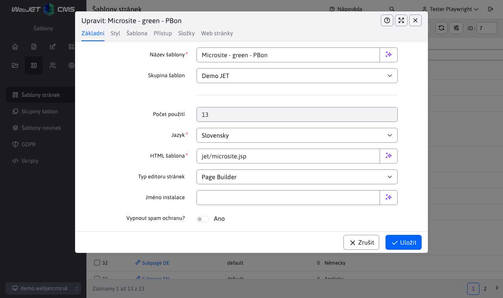
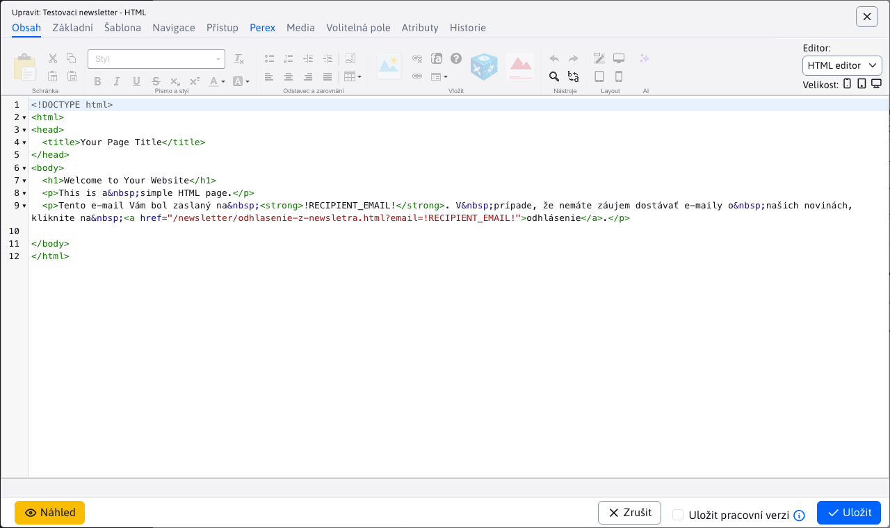
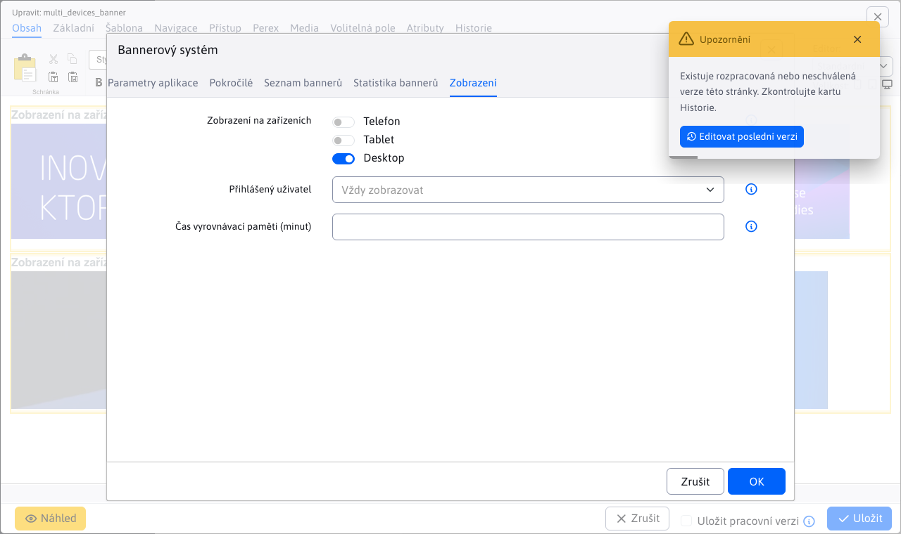
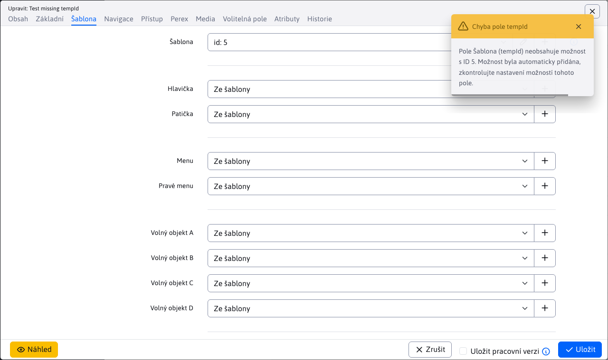
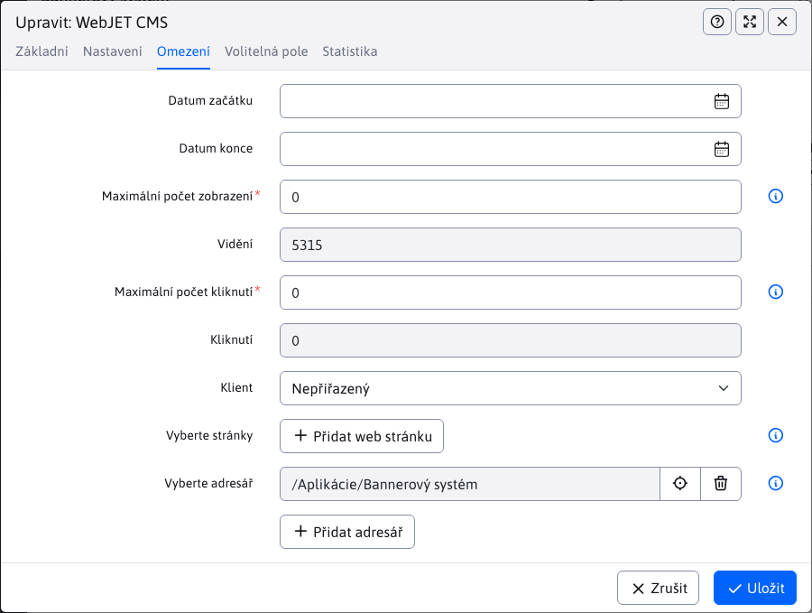
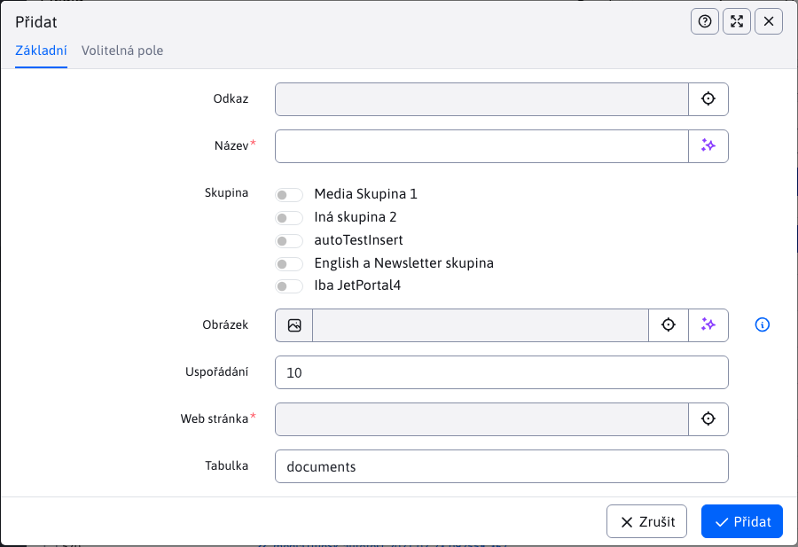
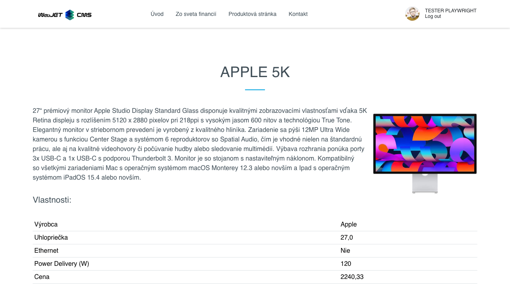
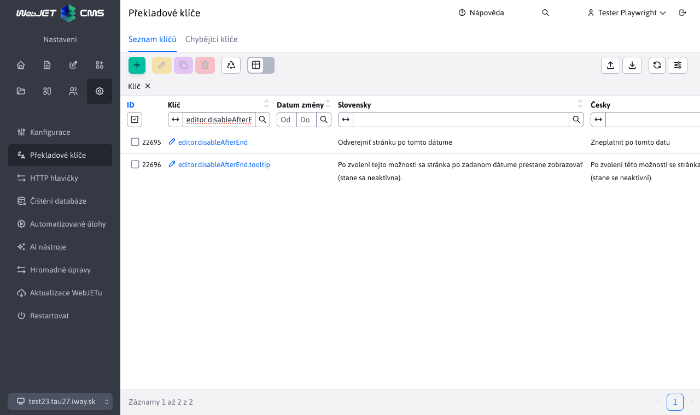

# Seznam změn verze 2023

## 2023.52/2024.0

> Verze 2023.52/2024.0 obsahuje novou verzi **aktualizace popisující změny**, **struktura klonování** integrovaná s funkcí zrcadlení (včetně možnosti prokládání), přidává možnost zrcadlení. **Převzato z** webové stránky nebo **celou složku z koše**, dodává **Editor HTML** a možnost nastavit typ editoru přímo pro šablonu, **aplikace** je to možné **povolit zobrazení pouze pro vybrané typy zařízení** mobil, tablet, PC a samozřejmě zvyšuje bezpečnost a komfort práce.

<div class="video-container">
  <iframe width="560" height="315" src="https://www.youtube.com/embed/YGvWne70czo" title="Přehrávač videí YouTube" frameborder="0" allow="accelerometer; autoplay; clipboard-write; encrypted-media; gyroscope; picture-in-picture" allowfullscreen></iframe>
</div>

### Převratné změny

Tato verze přináší několik změn, které nemusí být zpětně kompatibilní:
- Diskuse/Fórum - přidat nový příspěvek a schválení upraveno ze Struts na Spring, použít volání `/admin/update/update-2023-18.jsp` Pro [základní ošetření](install/README.md#zmeny-pri-aktualizácii-na-202318). Editace profilu uživatele zrušena, doporučujeme použít standardní editační komponentu. [registrovaný uživatel](redactor/zaheslovana-zona/README.md) (#55649).
- Import z Excelu - pokud máte v projektu speciální verzi importu z Excelu, která volá adresu URL. `/admin/importxls.do` upravit formulář a adresu URL podle `/admin/spec/import_xls.jsp`. Aktualizační skript by měl vyřešit základy pro vás `/admin/update/update-2023-18.jsp` (#55905).
- Obnovení menu - předělání ze Struts na Spring, použití aktualizačního skriptu a ověření, že se menu zobrazuje na webové stránce (#55945).

### Vylepšení uživatelského rozhraní

- Webové stránky - Bloky - zvětšena velikost okna pro vkládání bloků, přidána možnost přímé editace webové stránky, pokud je vložena pomocí dynamického odkazu (#56017).
- Editor webových stránek - zvětšená výška nabídky výběru textových stylů/nadpisů pro lepší přehlednost/možnosti výběru (#56017).
- Aplikace - opět vylepšena velikost oken aplikací - na výšku i na šířku včetně oken při použití PageBuilderu. Optimalizována velikost vnořených datových tabulek. Úpravy v `top.jsp,datatables-wjfunctions.js` (#56013).
- Aplikace - aktualizované fotografie aplikací a jejich popis v seznamu aplikací v editoru stránky. Opraveny různé drobné vizuální chyby v nastavení aplikací (#55293).
- Datové tabulky - během dlouhotrvající operace může dojít k přerušení spojení se serverem, v takovém případě se zobrazí zpráva "Při komunikaci se serverem došlo k chybě. Je možné, že operace trvá příliš dlouho a bude provedena později. Vyčkejte a po chvíli zkontrolujte, zda se operace provede.". aby se odlišila od standardní chyby při ukládání záznamu.
- Datové tabulky - přidána možnost [importovat pouze nové záznamy](redactor/datatables/export-import.md#import-dát)pokud záznam u vybraného sloupce již existuje, zůstane beze změny (#56061).


### Webové stránky

- Import/Export - přidáno nastavení ID místních složek při vytváření šablony. Řeší problém při úpravě stránky po importu, kdy je šablona vytvořena, ale nemá nastaven správný přístup do složky. Neexistující složky jsou odfiltrovány. Doporučujeme zkontrolovat nastavení šablony po importu (#55993).
- Při vytváření nové webové stránky a nahrávání obrázku/souboru/média se složka Média pro tuto stránku vytvoří ještě před uložením. Vytvoří se podle hodnoty zadané v poli Název položky v nabídce (#54953-29).
- Při úpravách jedné webové stránky si okno pro vložení obrázku/odkazu pamatuje poslední složku i po jejím zavření a po opětovném otevření se nepřepne zpět do části Média na dané stránce. To je praktičtější, pokud vkládáte více obrázků z různých složek. Do sekce Média na této stránce se stále můžete přepnout kliknutím ve stromové struktuře (#54953-29).
- Přidána podpora pro , [Obnovení webových stránek a složek z koše](redactor/webpages/recover.md) (#55937).
- Složka `/files` s fulltextovým indexem souborů je přesunut na kartu Systém (#54953-30).
- Šablony - byla přidána možnost nastavit typ editoru stránky (dříve Editor struktury inline) pro šablonu, výchozí nastavení je Podle skupiny šablon, kde je typ editoru stránky nastaven přiřazenou skupinou šablon (#56129).



- Editor - přidán typ editoru stránky HTML, kde se editor stránky zobrazuje přímo v režimu HTML (kód HTML). Umožňuje upravovat speciální typy stránek, které se např. kvůli speciálnímu kódu nemohou přepnout do vizuálního režimu (#56129).



- Editor - přidána možnost nastavit velikost/šířku editoru i ve standardním režimu. Stránku tak můžete zobrazit v režimu na šířku pro mobil, tablet i počítač (#56129).
- Editor - sjednocené přepínání režimů Standardní/Stavebník stránek (#56129).
- Ninja - přidána podpora pro další prohlížeče, aby bylo možné definovat minimální podporovanou verzi v. `config.properties` typ `minBrowserVersion.crazy\u0020browser=10` (#56129).
- U stránek s vypnutým zobrazením také upravil barvu názvu stránky na červenou (#55997).
- Editor - upraveno Vložit jako prostý text a Vložit z Wordu, aby se otevřelo dialogové okno pro vložení textu ze schránky (#56189).


- Editor - vylepšeno čištění kódu vloženého z aplikace Excel - odstraněna šířka buněk a nastavení tříd stylů CSS (#56189).
- Editor - upravené vkládání odkazů na e-mailovou adresu - nesprávné zobrazení předpony http při zadávání e-mailové adresy (#56189).

### Page Builder

- Page Builder byl přepracován tak, aby používal nové soubory JavaScriptu shodné se soubory používanými při úpravách webové stránky (dosud se používaly staré soubory z verze 8). Kód stránky se vkládá přímo při jejím zobrazení, není třeba volat službu REST. Další soubory CSS a JavaScript se vkládají pomocí `combine` jedním voláním. Počet požadavků HTTP byl snížen ze 42 na 24 (#56017) při zobrazení normální stránky.
- Načítání v editoru by mělo být rychlejší, nová verze neobsahuje staré části kódu, některé objekty budou použity znovu.
- V budoucnu bude v sekci Webová stránka k dispozici pouze verze Page Builder, samostatná inline editace při zobrazení webové stránky bude odstraněna (z důvodu konzistence skriptů).
- Nastavení viditelnosti upraveno na možnosti pro mobilní zařízení, tablety a stolní počítače v souladu s přepínačem šířky editoru (#56017).
- Přidána možnost [vygenerovat nabídku](frontend/page-builder/blocks.md#podpora-menu) Pro `single page` typy stránek. Menu se generuje automaticky podle sekcí na webové stránce (#56017).

### Spring aplikace

- Do okna nastavení přidán název aplikace místo obecného názvu Upravit (#55997).
- Spring aplikace mají navíc [Zobrazit kartu](custom-apps/appstore/README.md#karta-zobrazenie) pro nastavení zobrazení aplikace na různých zařízeních a možnost nastavit výstup HTML do mezipaměti pro rychlejší zobrazení webové stránky. Pokud není vybráno žádné zařízení, aplikace se zobrazí vždy.


### Restaurační menu

- Sekce menu restaurace (aplikace) převedená do tabulek s daty [Restaurační menu](redactor/apps/restaurant-menu/README.md) (#55945).


### Aktualizace WebJET

Zlepšený proces [Aktualizace systému WebJET CMS](sysadmin/update/README.md), převeden do nového designu, přidány akcenty do seznamu změn, zobrazen seznam změn se zvýrazněným textem a obrázky.


### Bannerový systém

- Přidána podpora pro [Zobrazení banneru pro konkrétní typ zařízení](redactor/apps/banner/README.md#zobrazenie-banneru-pre-špecificky-typ-zariadenia), tj. zobrazení pouze na mobilním telefonu nebo například pouze na tabletu. Můžete tak zobrazovat různé bannery pro různá zařízení (#55921).



### Formuláře

- Přidání pole Firma do seznamu polí přihlášeného uživatele při vyplňování formuláře (#55961).

### Galerie

- Optimalizovaná inicializace editoru obrázků - po první inicializaci se použije stávající instance (#55853).
- Optimalizace načítání dat - snížení počtu volání služby REST z 6 na 1 při zobrazování galerie (#56093).

### Hlavičky HTTP

- Přidána možnost nastavení záhlaví `Content-Language`, [automatické nastavení](admin/settings/response-header/README.md#nastavenie-pre-súbory) hlavičky souborů.
- Přidaná podpora [nastavení záhlaví](admin/settings/response-header/README.md) pro přesnou shodu URL pomocí `^/path/subpath/$` a možnost nastavit ji pro určité přípony `/path/subpath/*.pdf,*.jpg` (#56109).


### Kalendář akcí

- Přidána možnost vytvořit typ události s mezerou v názvu (#56054).
- Přidáno Odstranění mezipaměti po přidání nové události (#56054).

### Klonovací struktura

- [Klonovací struktura](redactor/apps/clone-structure/README.md) je integrován s [zrcadlením](redactor/apps/docmirroring/README.md) pro možnost vytváření překladových a odkazových stránek při klonování jazykové mutace. Jazyk se přebírá z nastavení zdrojové a cílové složky (#55733).
- Po vytvoření klonu se automaticky nastaví zrcadlení změn, v případě potřeby jej můžete zrušit úpravou proměnné conf. `structureMirroringConfig`. Změny se přenesou mezi klonem a původní strukturou.


### Novinky

- Na [šablony zpráv](redactor/apps/news/README.md#šablóna) přidané objekty `$pagesAll` s celým seznamem stránek (`$pages` obsahuje zkrácený seznam) a `$totalPages` s celkovým počtem stránek.

### Uživatelé

- Odstranění uživatele - opravena situace, kdy se aktuálně přihlášený uživatel pokusí odstranit sám sebe (#55917).
- [Seznam uživatelů](admin/users/README.md) - přidal do tabulky sloupce Oprávnění adresáře a webu a Schválení. Kvůli vnořeným údajům ve sloupcích není možné vyhledávat a řadit podle hodnoty (#55897).
- Seznam uživatelů - přidáno zobrazení Skupiny práv pro zobrazení skupin práv správce v tabulce s možností filtrování podle vybrané skupiny (#55601).

### Překladové klíče

- Přidána možnost [importovat pouze nové](admin/settings/translation-keys/README.md) (dosud neexistující) klíče. Existence klíče se kontroluje pro každý jazyk (#56061).


### Přesměrování

- Přesměrování cest - v instalaci s více doménami se zobrazují pouze záznamy podle aktuálně vybrané domény a záznamy, které nemají nastavenou doménu (#55957).

### Proxy

- Přidáno nastavení záhlaví HTTP `Content-Type` Podle [odpovědi od zmocněnce](redactor/apps/proxy/README.md) (při použití proxy serveru ve službě REST/bez vložení do webové stránky) (#56054).

### Statistiky

- Filtr pro výběr složky v zobrazení statistik zobrazuje pouze složky, ke kterým má uživatel oprávnění v seznamu webových stránek. Při první návštěvě se statistiky zobrazí pro první povolenou složku. To umožňuje zobrazit statistiky i editorům s omezenými právy ke stromové struktuře webových stránek (#55941).
- Přidáno oprávnění Zobrazit statistiky pro všechny složky, které umožňuje zobrazit celou stromovou strukturu bez ohledu na oprávnění webu (#55941).

### Volitelná pole

- Přidaný field type `UUID` pro generování [jedinečný identifikátor](frontend/webpages/customfields/README.md#unikátny-identifikátor).


### Značky

- Tagy - seznam dostupných tagů se zobrazuje podle práv k sekcím webu. Správu tagů tak můžete zpřístupnit pouze pro určitou stromovou sekci webu (nebo doménu). Pokud má tedy uživatel povolen přístup pouze do sekce /Newsletter webu, zobrazí se pouze tagy, které mají tuto sekci přidanou, nebo tagy bez omezení zobrazení (#55961).

### Zrcadlení struktury

- Přidána možnost přidat ID další složky pro pozdější zrcadlení pomocí [Klonovací struktura](redactor/apps/clone-structure/README.md) je možné přidat obsah nového jazyka (#55733).
- Přidána kontrola nastavení synchronizace - pokud z konfigurační proměnné odstraníte ID složky. `structureMirroringConfig` stránky a složky v odstraněné struktuře již nebudou synchronizovány (#55733).
- Přidána možnost vytváření v zrcadlených složkách [stránky a složky se zapnutým zobrazením](redactor/apps/docmirroring/README.md#priebeh-zrkadlenia) (např. ve fázi vývoje stránky), stačí nastavit proměnnou conf. `structureMirroringDisabledOnCreate` na hodnotu `false` (#55733).
- Překladač- [Pro DeepL](admin/setup/translation.md) je možné v konf. proměnné `deepl_api_url` nastavit adresu API služby. Výchozí hodnota je pro bezplatnou verzi, při použití `Pro` verze nastavené na `https://api.deepl.com/v2/translate`. Úprava způsobu autorizace proti API na novou verzi pomocí hlavičky HTTP `Authorize` (#55733).

### Zabezpečení

- Aktualizovaná knihovna `logback` na verzi 1.3.14.
- Zranitelnost opravena `CVE-2022-26960` v knihovně `elfinder`.
- Uživatelé - Profil - přidány informace o kvalitě hesla při jeho změně (#56077).

### Změny systému

- Optimalizovaná velikost souboru JavaScriptu - knihovna `moment` se načtou pouze potřebné jazyky namísto všech dostupných jazyků (používá se `MomentLocalesPlugin`). Velikost zmenšena o 300 kB (#56093).
- Aktualizace - od verze 2023.40-SNAPSHOT má aktualizační server připraveny také balíčky pro aktualizaci WebJETu běžícího v režimu JAR, aktualizační server poskytne aktualizační soubor podle typu režimu.
**Přechod ze systému Struts na Spring**
- Aktualizace WebJET - přepracovaný WebJET aktualizace [Aktualizace WebJET](sysadmin/update/README.md) (#55797)
- Diskuze/Fórum - přepracováno přidání nového příspěvku ze Struts do Spring, přepracováno schvalování (#55649).
- Hodnocení webu - přepracováno [Hodnocení/hodnocení](redactor/apps/rating/README.md). Třída `RatingDB` nahrazen `RatingService` a `RatingBean` Pro `RatingEntity` (#55729).
- Import XLS - adresa URL pro import souborů XLS se změnila z `/admin/importxls.do` na adrese `/admin/import/excel/`, použijte příklad v `/admin/spec/import_xls.jsp` aktualizovat své soubory (#55905).
- Restaurační menu - přepracovaný na jaře, třídy `MenuDB,MealDB,MenuBean,MealBean` nahrazen `RestaurantMenuService,RestaurantMenuEntity,RestaurantMenuMealsEntity` (#55945).
- Webové stránky - přepracovaná možnost klonování ze struts na Spring [Klonovací struktura](redactor/apps/clone-structure/README.md) (#55733).
- Webové stránky - přepracovaný import stránek z archivu ZIP [Import webových stránek z archivu ZIP](redactor/webpages/import-export.md#importovanie-web-stránok-zo-zip-archívu) (#55905).
- Webové stránky - přepracovaný import stránek ze souboru aplikace Excel [Import webových stránek ze souboru aplikace Excel](redactor/webpages/import-export.md#import-štruktúry-z-excel-súboru) (#55905).

### Oprava chyb

- Číselníky - opraveno stránkování v číselnících (#56013).
- Datové tabulky - opravena pozice okna z vnořené datové tabulky tak, aby se celé vešlo do prohlížeče.
- Formuláře - opravena chyba zobrazování data v poli Naposledy odesláno v seznamu formulářů v databázi Oracle.
- Formuláře - opraven export dat formuláře a duplicitní generování exportního souboru (#56141).
- Galerie, Zobrazení souborů, Archiv souborů - opraven výběr složky ve vlastnostech aplikace na stránce (#54953-27).
- Galerie - opraveno dvojité lomítko v adrese URL galerie v některých scénářích (#56017).
- Hromadné e-maily - přidána kontrola duplicitních e-mailových adres bez ohledu na velikost písmen (#55961).
- Konfigurace - opraveno duplicitní zobrazení proměnné conf. při přidání existující proměnné (#55733).
- Konfigurace - opraven import speciálních znaků jako `'&#<` a hledat v této hodnotě (#55993).
- Editor Json - opraveno nastavení a změna obrázku v aplikacích používajících editor Json (např. Doporučení, Působivá prezentace atd.) (#55293).
- Uživatelé - opraveno zobrazování práv uživatelů při editaci - zobrazovala se i práva podle skupin, nikoli pouze nastavená (#55797).
- Uživatelé - Profil - opravena chyba při změně hesla (#56077).
- Restart - opravena funkce Restart v nabídce Nastavení (#54953-30).
- Skripty - opraveno vkládání skriptů do stránky - vyhledávání názvu pozice se nesprávně používalo jako podřetězec a skript se vložil, i když název pozice přesně neodpovídal (#54953-30).
- `Slider` - Opravena kompatibilita s knihovnou jQuery (#55293).
- Šablony - opraveno zobrazení šablon, které jsou nastaveny tak, aby se zobrazovaly pouze pro určitou složku, a zároveň má tato složka prázdný název domény (#55993).
- Webové stránky - přidána podpora pro schvalování webových stránek v režimu bez akce (#55897).
- Webové stránky - odstranění záznamů o schválení, které zůstaly po odstranění složky z koše (#55897).
- Webové stránky - přidáno automatické nastavení malých písmen při zadávání domény (doména se ve výchozím nastavení zadává s malými písmeny) (#55993).
- Webové stránky - opraveno přepnutí na kartu Základní po přidání nového média na nové webové stránce (#54953-29).
- Webové stránky - opraveno zobrazení náhledu, pokud je ve výchozím nastavení Spring nastaven na JSON odpovědi (#56054).
- Webové stránky - opraveno přejmenování domény - Systém složek nezměnil doménu (#54953-30).
- Webové stránky - bloky - vylepšené nastavení velikosti okna při vkládání bloku (#55293).
- Zobrazení souborů - opraveno zobrazení souborů (detekce domény) (#54953-27).
- Opravena chyba v odesílání parametrů pro externí filtry, datum do hodnoty je nastaveno na 23:59:59 (#56021).

### Pro programátora

- Aplikace - přidána možnost zobrazit aplikaci na stránce [podle typu zařízení](custom-apps/appstore/README.md#podmienené-zobrazenie-aplikácie) (mobil, tablet, počítač) přidáním parametru `!INCLUDE(/components..., device=mobil)!`. Pro [Bannerový systém](redactor/apps/banner/README.md) nastavení je přidáno také do rozhraní nastavení aplikace.
- Datové tabulky - přidána podpora `LocalDate/LocalDateTime` pro datová pole, přidán atribut `alwaysCopyProperties` na `DatatableColumn` pro možnost kopírování při úpravách z [existujícího záznamu](developer/datatables-editor/datatable-columns.md).
- Uživatelé - doplněná dokumentace k použití `afterSaveInterceptor` Na adrese [registrace uživatele](custom-apps/apps/user/README.md) a možnost neodesílat standardní uvítací e-mail přepsáním metody `shouldSendUserWelcomeEmail` (#54953-28).

## 2023.40

> Verze 2023.40 přidává možnost **vyhledávání v průzkumníku**/soubory, možnost používat **video banner**, zlepšuje uživatelské rozhraní, zrychluje načítání dat na webových stránkách. **Banner** přidá nastavení omezení pro **zobrazit pouze na zadaných webových stránkách a ve složkách**. Nová aplikace **Hlavičky HTTP** umožňuje nastavit hlavičky HTTP pro zadané adresy URL. **Médiím** jsme přidali **volitelná pole**. Zrcadlení nosné konstrukce **překlad hlavní části webové stránky** a zlepšuje detekci změn. Přepracované aplikace **Monitoring serverů, SEO, Novinky, Diskuze**. Cílem verze je také odstranit staré části kódu, a proto je nutné znovu [zkompilovat třídy a upravit soubory JSP](install/README.md#zmeny-pri-aktualizácii-na-202318).

<div class="video-container">
  <iframe width="560" height="315" src="https://www.youtube.com/embed/5hlbQYoOF6U" title="Přehrávač videí YouTube" frameborder="0" allow="accelerometer; autoplay; clipboard-write; encrypted-media; gyroscope; picture-in-picture" allowfullscreen></iframe>
</div>

### Převratné změny

Tato verze přináší několik změn, které nemusí být zpětně kompatibilní:
- Upravené přihlášení pomocí `ActiveDirectory` z knihovny `Struts` na adrese `Spring`, ověřte funkčnost přihlášení (#55489-4) v testovacích prostředích před nasazením do výroby.
- Upravené přihlášení návštěvníků do zóny chráněné heslem z knihovny `Struts` na adrese `Spring`. Pokud používáte vlastní přihlašovací JSP, musíte upravit jeho kód (použít html značky struts - nahradit standardními HTML značkami). Standardní změny budou automaticky upraveny voláním `/admin/update/update-2023-18.jsp`, který doporučujeme znovu spustit pro kontrolu kompilace souborů JSP (#55489-4).
- Aktualizovaná verze knihovny `Thymeleaf` na verzi 3.1. [několik změn](https://www.thymeleaf.org/doc/articles/thymeleaf31whatsnew.html) ve srovnání s verzí 3.0, zejména odstranění objektů `#request, #response, #session, #servletContext`. WebJET automaticky přidává objekty do modelu pro aplikace. `request,session` ale je nutné upravit kód HTML aplikací tak, aby používaly objekt. `${request` spíše než `${#request`. Může automaticky nastavit volání `/admin/update/update-2023-18.jsp`, která je rovněž rozšířena o opravu `.html` Soubory šablon Thymeleaf.

Po nasazení této verze zkontrolujte minimum:
- Přihlášení pomocí `ActiveDirectory` do administrace a sekce chráněné heslem (pokud používáte integraci na `ActiveDirectory`).
- Přihlášení a registrace návštěvníků do sekce chráněné heslem (pokud máte na svých webových stránkách sekci chráněnou heslem).
- Aplikace a šablony využívající knihovnu `Thymeleaf`.
- Proces schvalování webových stránek (pokud je používáte).

### Vylepšení uživatelského rozhraní

- Aplikace - **zvětšené okno nastavení aplikace**, například seznam fotografií v aplikaci galerie. Výška a šířka okna se přizpůsobí aktuálnímu rozlišení prohlížeče. Na velkých monitorech se okno nastavení aplikace zobrazuje výrazně větší než v předchozí verzi (#54953-15).


- Aplikace - upraven počet sloupců v seznamu všech aplikací na 4, aby bylo možné zobrazit větší počet aplikací najednou (#54953-15).
- Datové tabulky - opravena pozice okna v režimu úprav buněk pro typ `quill` (např. perex/anotace v galerii). Okno bylo příliš vysoké a nedalo se posouvat, v nové verzi je bublina širší pro pohodlnější práci (#54953-15).
- Datové tabulky - **zrychlené vyhledávání záznamů podle ID** v adrese URL, zrychlené přepínání stránek, pokud na první stránce není žádný záznam (#54273).
- Datové tabulky - **přidána možnost filtrovat seznam podle ID**takže můžete snadno najít záznam i při vysokém počtu stránek. Na rozdíl od pole ID na panelu nástrojů pouze filtruje záznamy, neotevírá automaticky také editor. Zadáním ID na panelu nástrojů se stránkuje až 5 stránek a poté se pomocí filtrování ID otevře editor. Upravena možnost označit/odznačit všechny záznamy na jednu ikonu. Pokud nejsou označeny žádné záznamy, jsou označeny všechny záznamy, pokud jsou některé označeny, jsou odznačeny (#55581).
- Datové tabulky - upravený název souboru s exportem do formátu `názov-YYYYMMDD-HHmmss.xlsx` pro lepší abecední řazení exportovaných souborů ve standardním průzkumníku počítače (#55581).
- Datové tabulky - pokud editor obsahuje hodnotu, která není ve výběrovém poli jako možnost, bude přidána alespoň s hodnotou ID a zobrazí se upozornění. Situace nastane, pokud například přesunete stránku do jiné složky a přiřazená šablona by neměla být v nové složce použita z důvodu omezení (#54953-16).



- Galerie - přidáno pamatování zobrazených sloupců a jejich pořadí v tabulkovém zobrazení (#54953-15).
- Galerie - přidána ikona pro zobrazení vybraného obrázku na nové kartě prohlížeče (#54953-15).
- Webové stránky - editor - **předvolba režimu editoru (Standardní/PageBuilder) je uložena v nastavení.** uživatele na serveru a přetrvává mezi přihlášeními uživatele. (#54953-15).
- Webové stránky - editor - tabulka - při vkládání nové tabulky do stránky je přednastavena šířka `100%` místo původní hodnoty `500px` (#54273).
- Webové stránky - **optimalizovaná data** při načítání seznamu stránek a stromové struktury po zadání ID stránky/složky do adresy URL. Potřebná data jsou při načítání stránky odesílána přímo ze serveru. Urychluje to např. zobrazení záhlaví stránky z editoru šablony apod. (vnořený editor z nabídky výběru záhlaví/zápatí/navigace) (#54273).
- Webové stránky - historie - verze se zamítnutým schválením jsou zobrazeny červeně (#55493).
- Webové stránky - **upravené zobrazení ikon pro menší poměr** mezi sloupcem stromové struktury a seznamem webových stránek. Konflikt se vstupním polem ID, hezčí zobrazení ikon ve 2 řádcích při nízkém rozlišení. Přepočet výšky převeden z CSS na výpočet v JavaScriptu (#54953-22).
- Externí filtr - nyní podporuje také filtrování pomocí webových stránek a vyhledávače (#55537).
- Průzkumník - přidána možnost **vyhledávání souborů/obrázků/webových stránek**. Tato funkce je k dispozici také v editoru stránky při vkládání obrázku nebo odkazu na soubor/stránku. Vyhledávat můžete v aktuální složce nebo v podsložkách (#54953-25).


### Komunitní verze/Open Source

- Přidána podpora pro spuštění WebJET bez **licenční číslo ve verzi Community/Open Source** (#55789).
- Vydal [zdrojový kód](https://github.com/webjetcms/webjetcms) (#55789).
- Některé placené aplikace lze zakoupit spolu s verzí.
- Seznam dostupných aplikací naleznete na adrese [www.webjetcms.sk](https://www.webjetcms.sk/) (#55773).

### Webové stránky

- Přetištěno z **schvalovací proces** z původní verze do úložišť Spring DATA a služeb REST. Optimalizace kódu, odstranění duplicitních částí (#55493,#54953-21).
- Přetištěno z **proces mazání webových stránek a schvalování smazání.** na službách Spring DATA a REST (#55493).
- Přidána možnost zadat znak `/` v názvu složky nebo webové stránky. Interně je uložen jako entita HTML. `&#47;` ale v editoru a stromové struktuře se zobrazuje jako lomítko (#55517).
- Optimalizováno počáteční načítání dat pro uživatele s omezenými právy k zobrazení pouze určité webové stránky (#54953-17).
- Upraveno **vkládání z dokumentů Word** - jsou odstraněny styly (barvy, velikost písma...), tabulkám je nastavena třída CSS podle standardní tabulky, jsou upraveny značky HTML. `b,i` na adrese `strong,em`, odstraněno `span` Prvky (#55681).
- Při uložení webové stránky do více složek se režim zobrazení ostatních stránek změní z přesměrování na standardní zobrazení (stránky jsou jakoby samostatné). Režim přesměrování na hlavní stránku lze zapnout pomocí proměnné conf. `multigroupRedirectSlavesToMaster=true` (#54953-23).
- Přidána možnost otevřít webovou stránku s verzí z historie v editoru zadáním parametru URL `&historyid=XXX`. Používá se např. při inline editaci k zobrazení historie změn po kliknutí na jméno uživatele, který stránku naposledy změnil. (#54953-25).
- Průzkumník - v sekci Seznam webových stránek se zobrazí následující informace. **seznam filtrovaný podle aktuálně vybrané domény** (#54953-25).

### Bannerový systém

- Informace o počtu zobrazení a kliknutí na banner byly přidány také do okna editoru (#55285).
- Přidáno zobrazení obrázku banneru a možnost kliknutím otevřít odkaz na datovou tabulku (#55285).
- Přidána možnost **nastavení pro omezení zobrazení bannerů** pouze v uvedeném [webové stránky a složky](redactor/apps/banner/README.md). To vám umožní nastavit **zobrazení banneru ve stromové struktuře webových stránek.** (#55285).



- Přidána podpora pro [Video bannery](redactor/apps/banner/README.md#banner-typu-video) ve formátu `mp4` a `YouTube` a podporu pro **přidání videa** na pozadí banneru Obsah (#55817).


### Diskuse

- Oddíly [Diskuse](redactor/apps/forum/forum-list.md) přepracováno (#55501).

### Export dat

- Přidána možnost **vytvořit vlastní typ exportu dat** s [vlastní soubor JSP](redactor/apps/export/README.md#vlastný-formát-exportu) (#54953-19).
- Přidán formát exportu dat pro `Úradní desku` v [OpenData Česká republika](https://ofn.gov.cz/úřední-desky/2021-07-20/) JSON (#54953-19).

### Formuláře

- Modifikované čtení seznamu formulářů - kontrolní řádky jsou čteny podle `NULL` hodnoty ve sloupci `create_date`, původně podle sloupce `html` (#54273-43).

### Galerie

- Přidáno pamatování zobrazených sloupců a jejich pořadí v tabulkovém zobrazení (#54953-15).
- Přidána ikona na **zobrazit vybraný obrázek** na nové kartě prohlížeče (#54953-15).
- Doplněno **ochrana systémových složek**, např. `/images/DOMAIN-ALIAS` a složky, do kterých uživatel **nemá žádná práva**. Složka se zobrazuje jako neupravitelná a nelze do ní nahrát fotografii (#54953-26).

### Hlavičky HTTP

Nová aplikace [Hlavičky HTTP](admin/settings/response-header/README.md) v sekci Nastavení umožňuje definovat hlavičky odpovědi HTTP (`HTTP Response Header`) na základě adres URL zobrazené stránky. Hlavičky se nastavují podle nejdelší odpovídající adresy URL a v názvu i hodnotě je možné použít makroproměnnou.


### Média

- Sekce Správa všech médií je **filtrováno podle aktuálně vybrané domény**. Zobrazí se tedy pouze média pro stránky v aktuální doméně, podobně jako v jiných aplikacích (#55197).
- V přehledu všech médií přibyla tabulka filtrování podle skupiny a názvu/cesty k webové stránce, sloupec Obrázek se zobrazuje s náhledem obrázku, sloupec **Odkaz a webová stránka zobrazená s klikatelným odkazem** (#55197).
- Přidána možnost použít [volitelná pole](frontend/webpages/customfields/README.md) také médiím (#55685).
- Opravena úprava médií na stránce s více složkami (#54953-23).
- V části Spravovat všechna média editoru je pole `DOC ID` nahrazeno výběrem webové stránky ze stromové struktury (#55197).



### Monitorování serveru

- Přepracované získávání zátěže procesoru přímo z Javy `OperatingSystemMXBean` bez potřeby externí knihovny, grafy doplněné o hodnotu zatížení procesoru procesu WebJET, automatický zápis do zaznamenaných hodnot/databáze (#55865).
- Přepracování sekce Aplikace, WEB stránky, SQL dotazy (#55497).
- Doplněná dokumentace [Výměna dat uzlu clusteru](sysadmin/monitoring/nodes-logic.md).


### SEO

- Přepracování celé sekce SEO (#55537).
- Doplněná dokumentace o [Sekce SEO](redactor/apps/seo/README.md).


### Novinky

- Přepracovaná aplikace [Novinky](redactor/apps/news/README.md) (v sekci Příspěvky) na nový design. Umožňuje pracovat se zprávami stejně jako s webovými stránkami. (#55441).
- **Seznam možných složek se generuje automaticky** pomocí zpravodajské aplikace na webových stránkách (#55441).
- Upravený design nastavení aplikace na webové stránce (#55441).


- Při nastavení aplikace na stránce se seznam značek/perfektních skupin filtruje podle vybraných složek. To umožňuje vybrat značky i v případě, že vkládáte seznam novinek do složky mimo složky určené pro značky. Seznam se neaktualizuje dynamicky, nejprve nastavte složky, klepnutím na tlačítko OK vložte aplikaci a poté znovu otevřete nastavení aplikace, aby se aktualizoval seznam značek (#54953-17).

### Uživatelé

- Upraveno **vyhledávání podle skupiny** - pokud je nastaveno na hodnotu Rovná se, jsou nalezeni uživatelé, kteří mají pouze tuto jednu skupinu (žádné další skupiny nejsou zadány) (#54953-20).
- Schválení uživatele - přidáno **schválení uživatele pro registraci** do zóny chráněné heslem. Přidáno [dokumentace popisující celý proces](redactor/zaheslovana-zona/README.md) (#55545).


- Do nabídky zobrazené po kliknutí na jméno uživatele v záhlaví byla přidána možnost upravit profil. **Profil je k dispozici pouze v nové verzi** (např. na domovské stránce), nelze profil ve starých souborech JSP upravovat. (#54953-22).
- Import - vylepšený **chybová zpráva při importu**pokud buňka obsahuje nesprávnou hodnotu JSON (#54953-22).
- Import - vylepšený test importu - přidána kontrola buněk, které jsou po importu zachovány - nenalezeny jako sloupec v souboru Excel - nastavením hodnoty `preserveColumns` (#54953-22).

### Překladové klíče

Sekce **Chybějící klíče** přepracované. Přidány informace o **poslední čas a URL chybějícího volání klíče.**. Kliknutím na název klíče se zobrazí editor, kde můžete snadno doplnit chybějící překlad.


- Upravený import z aplikace Excel - **jsou importovány pouze jazyky zadané v souboru Excel** jako sloupec. Pokud potřebujete importovat pouze jeden jazyk, odstraňte sloupce s překlady v ostatních jazycích v aplikaci Excel. Tím nedojde k přepsání změn v překladech ostatních jazyků.

### Proxy

- Přidána možnost vytvořit **proxy server pro službu REST ve vnitřní síti.**. Chcete-li zabránit vložení odpovědi ze služby REST do stránky, zadejte do pole Extensions inserted into page prázdnou hodnotu (#54953-21,#55689).
- Přidána možnost zadat [více adres URL](redactor/apps/proxy/README.md#nastavenie-aplikácie) v poli Místní adresa URL a možnost použít přesnou shodu a končit na adrese URL (#55689).

### Šablony

- Seznam souborů pro pole Šablona HTML zohledňuje hodnotu v poli Název instalace, seznam se dynamicky načítá po kliknutí na pole, nikoliv při otevření editoru (#54953-17).
- Seznam šablon je následující **filtrováno podle aktuálně zobrazené domény**. Filtrování je založeno na vybraných složkách v poli Zobrazit pro a na shodě názvu domény (pokud šablona nemá žádná omezení přístupu, zobrazí se ve všech doménách). Filtrování se použije pouze v případě, že je nastavena proměnná conf. `enableStaticFilesExternalDir=true` (#54953-17).

### Zrcadlení struktury

- Přidána kontrola existence složky/stránky po nastavení zrcadlení na **složky/stránky nejsou zbytečně duplikovány, pokud již v jazyce existují.** (a překlad odpovídá) (#55193).
- Přidána mezipaměť překladů pro urychlení načítání překladů a snížení zátěže API (#55193).
- Doplněno [překlad textu webových stránek](redactor/apps/docmirroring/README.md#automatický-preklad) (#55709).
- Doplněno o lepší [identifikace automatického překladu](redactor/apps/docmirroring/README.md#úprava-existujúcej-web-stránky) s možností **průběžná aktualizace přeložených stránek** až do jejich revize. Automaticky přeložené stránky mají nastaveného autora `autotranslate` pro jednoznačnou identifikaci (#55709)

### Zabezpečení

- Aktualizovaná knihovna `xlsx` pro import souborů XLSX do verze 0.19.3. `amcharts` zatím nemá aktualizaci, ale to není žádný problém, protože `xlsx` knihovna se zde používá pouze pro generování souborů XLSX (#55193).
- Aktualizovaná knihovna `tui-image-editor` použít novější verzi `fabricjs` (#55193).
- Aktualizovaná knihovna `bootstrap-select` na verzi 1.13.14.
- Aktualizované knihovny `slf4j` a `logback`.
- Aktualizovaná verze knihovny `Thymeleaf` na verzi 3.1.
- Aktualizace modulů NPM na novější verzi (#55193).
- Audit - vylepšené auditování úloh na pozadí - protokol auditu je nastaven na IP adresu serveru a je zaznamenán uživatel, pod kterým je aplikační server spuštěn (#55441).
- Audit - zlepšení kontroly záznamů entit, které používají `@MappedSuperclass`. Kontrolují se také vlastnosti nadřazené třídy (#54953-22).
- Přidáno automatické nasazení na server CI/CD pro penetrační testování, nastavení kontinuálního penetračního testování pomocí nástroje `Acunetix OVS` (#55193).
- Logovaní - opraveno možné XSS v nastavení úrovně logovaní (#54273).
- Odstranění starých `Flash/SWF` soubory pro systém bannerů, YouTube a přehrávač videa (#55285).
- Knihovna odstraněna `org.bouncycastle:bcprov-jdk15on:1.70`, byl používán pouze pro službu `Pay24` a obsahoval možnou zranitelnost (#55193-4).
- Při volání adres URL obsahujících `/rest` Všechny metody HTTP jsou povoleny (#54273-44).
- Přihlášení - zapnuto [prodloužení doby nemožnosti přihlášení.](sysadmin/pentests/README.md#blokovanie-prihlásenia) po dobu 60 sekund po 5 neúspěšných pokusech o zadání hesla (#55489-4).
- Dvoufaktorové ověřování - pokud používáte ověřování proti `ActiveDirectory/SSO` serveru můžete zakázat položku nabídky pro nastavení dvoufaktorového ověřování nastavením proměnné conf. `2factorAuthEnabled` na hodnotu `false`.

### Aktualizace WebJET

- Vylepšené stránky **Proces aktualizace WebJET** přímo přes WebJET. Během aktualizace se odstraní soubory, které byly smazány během aktualizace na verzi 2023.18 (#55293).
- Upravena kombinace souborů na přihlašovací obrazovce, aby se po aktualizaci znovu načetly soubory JS/CSS (#55293).
- Přidaná kontrola `web.xml` souboru po aktualizaci, přičemž se kontroluje výskyt `web-app_2_4.xsd`, pokud je nalezen, je aktualizován podle souboru `web-v2023.xml`což je `web-app_3_0.xsd` (#55293).

### Změny systému

- Knihovna `Amcharts` pro generování grafů aktualizován na verzi 5. Podpora verze 4 byla zrušena a všechny funkce pro práci s grafy ve verzi 5 byly doplněny. [chart-tools.js](../src/main/webapp/admin/v9/src/js/libs/chart/chart-tools.js) byly upraveny tak, aby fungovaly s verzí v5 (#55405).


- Aktualizace WebJET - vylepšená kontrola odstranění souborů po aktualizaci, ty, které se nepodaří odstranit, se zapíší do souboru. `/WEB-INF/update/error-log.txt` (#55441).
- Cluster - doplněný **možnost použít posledních 16 znaků** z `HOSTNAME` v režimu `clusterNames=auto` nastavením proměnné conf. `clusterHostnameTrimFromEnd=true`. Potřebné např. pro `Kubernetes`, kde je náhodná hodnota na konci `HOSTNAME` (#54953-22).
- Datové tabulky - přidána možnost změny **omezení maximálního počtu řádků** pro export pomocí konfigurační proměnné `datatablesExportMaxRows`, výchozí hodnota 50000. Vysoká hodnota může způsobit nadměrné zatížení serveru a počítače editora (#54953-17).
- **Optimalizace velikosti souborů JavaScriptu** - modifikované vložení knihovny `amcharts` generovat grafy v hlavním souboru JavaScriptu. Knihovna se do stránky vkládá asynchronně pouze v případě potřeby. Velikost souboru byla zmenšena o 1 MB, což urychluje počáteční načítání a snižuje paměťovou náročnost (#55405).
- Oracle - na `autoupdate` Přidáno `trigger` po přihlášení, které nastaví `NLS_SORT=BINARY_AI NLS_COMP=LINGUISTIC` podporovat vyhledávání bez rozlišení velkých a malých písmen (#JTB1684).
- Knihovna odstraněna `backport-util-concurrent` a `org.mnode.ical4j` - se ve standardním systému WebJET CMS nepoužívají, pokud je pro svůj projekt potřebujete, můžete je přidat do svého systému. `build.gradle` (#54953-19).
- Odstraněné nepoužívané soubory `/admin/FCKeditor/editor/dialog/editor_check_file_exist.jsp,/admin/file_browser/dragdropupload.js.jsp` a složky `/admin/swfupload/*` (#55609).
- Na domovské stránce přibylo **informace o minimální požadované verzi Javy na serveru.**. Minimální verze je nastavena v proměnné conf. `javaMinimalVersion`, nastavením na hodnotu `0` upozornění je vypnuto (#54953-17).


**Přechod ze systému Struts na Spring**
- Zahájili jsme přechod od [Framework Struts na platformě Spring](developer/frameworks/struts/README.md). Hovory jsou přepracovány `/admin/findex.do->/admin/fbrowser/fulltext-index/index/` (#55389). Volání Struts `/sync/getobject.do` je zastaralý (používal se pro online synchronizaci mezi WebJETy), synchronizace pomocí souborů XML/zip je podporována (#55489-3).
- Anketa - hlasování - přestavěno z rámce (volání `/inquiry.answer.do`) (#55389).
- Upravené přihlášení pomocí `ActiveDirectory` (volání `/ntlm/logon.do`), před nasazením do produkčního prostředí ověřte funkčnost přihlášení v testovacích prostředích. Odstranění knihovny `jcifs` (#55489-4).
- Upravené přihlášení návštěvníka do zóny chráněné heslem (volání `/usrlogon.do`) (#55489-4).
- Odstraněná volání služby Struts, která se již nepoužívají `/admin/newgroup.do,/admin/media.do` a třídy `NewGroupAction/Form,MediaAction/Form` (#55489).
- Otázky a odpovědi - přepracovaná výzva `/qa.add.do` na jaře (#55493).
- Webové stránky - přepracovaný design schválení změn na webu (`/admin/approve.do,/admin.approvedel.do`) na jaře (#55493).
- Webové stránky - přepracované nahrávání obrázků, které jsou `drag&drop` do editoru webové stránky. Přepracované staré struny `/admin/uploadfile.do` Logika na jaře `/admin/web-pages/upload/` (#55609).
- Průzkumník - přepracované okno pro nastavení adresářů a souborů ze strutů `/admin/fbrowser.savedir.do,/admin/fbrowser.save.do` na jaře `/admin/fbrowser/dirprop/,/admin/fbrowser/fileprop/` (#55617).
- Při použití `jar-packaging` je soubor `struts-config.xml` načtení ze souboru JAR pro možnost aktualizace pomocí WebJET, původní soubor v souborovém systému je smazán.
- Stáhnout přílohu ve formulářích - převedeno ze struts `/admin/formatt.do` na jaře `/apps/forms/admin/attachment/` (#55613).
- Odstranění nepoužívaných volání `/admin/FCKeditor/styles.do,/admin/dir.do,/admin/editornewdir.do,/admin/formsendnotify.do,/admin/dragdropupload.do` a odpovídající třídy jazyka Java (#55489).
- Odstraněná výzva `/admin/savedoc.do`, upraveno `inline_page_toolbar.jsp` o použití formuláře Spring (#55489).
- Odstranění nepoužívané třídy `SearchForm` a formuláře `uploadFileForm,formNoteForm` (#55489).
- Přepracované stránky [Inicializace WebJET](install/setup/README.md) a nastavení [licenční klíč](install/license/README.md) (#55701)

### Dokumentace

- V části [Příručka pro redaktora](redactor/README.md) a [Příručka pro správce](admin/README.md) doplněné dokumenty ve formátu `docx` ke stažení obsahující základní informace o práci v systému WebJET CMS (#43144).
- Dokumentace vytvořená pro [nainstalovat](install/setup/README.md) a [základní konfigurace](install/config/README.md) (#54953-23).

### Oprava chyb

- Automatizované úlohy - přidáno chybějící pole Spuštěno na uzlu pro nastavení uzlu v instalaci clusteru (#55193).
- Slovníky - opraveno nastavení ID číselníku pro import, opraven import číselníku, který ještě nemá žádný záznam (#55569).
- Číselníky - opraveno filtrování podle vybraného typu číselníku (#55541).
- Datové tabulky - opravena duplicita záznamů pro některé případy (např. omezení domény, kde se jako ID používá primitivní int).
- Datové tabulky - opraveno zobrazení nastavení sloupců při jejich přesouvání - špatně zobrazený seznam v okně Zobrazení sloupců (#54953-15).
- Datové tabulky - Import/Export - upravený formát exportu pro hodnoty typu `1,2,3` aby byl považován za řetězec, nikoliv za číslo (#55569).
- Datové tabulky - upravené vyhledávání při zadání hodnoty, ale kliknutí na ikonu lupy v jiném sloupci (nebo zadání více kritérií filtru najednou) (#54953-18).
- Datové tabulky - opraveno nastavení šířky sloupce po zadání data do filtru (#55497).
- Datové tabulky - export - přidáno použití externího filtru při exportu dat (#55845).
- Diskuzní fórum - opraven HTML kód při vytváření diskuze s více tématy, přidány nástroje pro nastavení diskuze v administraci (nastavení schvalování, termíny).
- E-mail - opraveno nastavení portu serveru SMTP, pokud se nepoužívá přihlašovací jméno a heslo (#55545).
- Formuláře - opraveno dešifrování kódu formuláře HTML.
- Formuláře - pevný konflikt názvu sloupce a názvu systému (např. `note`) (#54273-47).
- Formuláře - opraveno odesílání formuláře jako přílohy (#55705).
- Formulář snadno - přidána možnost použít znak `+` v textovém poli zástupného symbolu (#54953-21).
- Galerie - přidáno pro generování `/thumb` obrázku při změně oblasti zájmu - po uložení je obrázek nastaven na aktuální datum a čas, což vyvolá jeho opětovné vygenerování (#54953-15).
- Galerie - opraveno načítání obrázku při přihlášení uživatele, zadáno `v` parametr a jeho nepřítomnost nebo přesměrování (#54953-17).
- Galerie - opraveno nahrávání obrázku do galerie, pokud obrázek již existuje (přepsání). `o_` obrázek) (#54953-25).
- HTMLBox - přidána podpora pro vkládání souborů přes protokol httpS při použití `/components/htmlbox/include.jsp`. Protokol httpS se používá, pokud je připojení k webové stránce zabezpečené (#55489-4).
- Novinky - opraveno zobrazování chyby v protokolech serveru pro neexistující značku. Opraveno zbytečné volání staré komponenty JSP pro zobrazení novinek v editoru (#54953-18).
- Oracle - opraveno vyhledávání podle jména (např. v auditu) (#JTB1684).
- Počasí - upraven vzhled nastavení aplikace, přidána kompatibilita se spuštěním v Javě 11 (#55293).
- Překladač - opravené nastavení kódování znaků `utf-8` pro správný přenos diakritiky (#55193).
- Překladové klíče - opravena možnost vyhledávání ve více sloupcích, přidáno pamatování zobrazených sloupců (#54953-18).
- Přesměrování domény - opravena aktualizace mezipaměti a clusteru při vytváření nového typu přesměrování `ALIAS` (#55489-4).
- Průzkumník - opraveno nastavení souborů a složek, odstraněny duplicitní a nepodporované možnosti (vytvoření archivu, převod do PDF atd.) (#55489-1).
- Průzkumník - opravena funkce Duplikát a zobrazení nabídky přihlášeného uživatele (#54953-22).
- Uživatelé - opravena kontrola povinného pole Přihlašovací jméno, opravena kontrola kvality hesla.
- Uživatelé - opraveno nastavení práv při načítání editoru s parametrem URL `id` (#54953-22).
- Skupiny šablon - opraven import seznamu skupin šablon - prázdná hodnota `renderFormat` (#55285).
- Šablony - Skupiny šablon - Opravena možnost nastavit prázdnou hodnotu v metadatech (#54273-47).
- Statistiky - opraveno zobrazení Zobrazení stránek v sekci TOP stránky (#55193).
- Vyhledávání v administraci - opraven odkaz na úpravu klíče překladu na novou verzi a odkaz na zobrazení složky webových stránek (#54953-22).
- Webové stránky - přidáno ovládání textu `data not loaded` při ukládání stránky. K tomu může dojít, pokud jsou data webové stránky před úpravami nesprávně načtena (#54273-43).
- Webové stránky - upravený import webových stránek - uložení seznamu bannerů (#55285).
- Webové stránky - PageBuilder - opravené styly CSS pro nastavení nulového rámečku pro prvky `div.row div.row` (#54953-15).
- Webové stránky - PageBuilder - Opravena chyba nastavení šablony pro nově vytvořenou stránku, pokud se šablona složky a šablona hlavní stránky složky neshodují (#55441).
- Webové stránky - opraveno duplikování kořenové složky při úpravách (pokud je to hlavní složka domény) (#55441).
- Webové stránky - opraveno načítání stránky z historie, pokud je stránka uložena ve více složkách (#54953-20).
- Webové stránky - opraven náhled nově vytvořené (dosud neuložené) stránky (#54953-20).
- Webové stránky - opraveno přesouvání stránek uložených ve více složkách ve stromové struktuře (#54953-21).
- Webové stránky - opraveno filtrování podle značek při použití výběrového pole - je definováno více než 30 značek (#54953-23).
- Webové stránky - opraveno nastavení URL, pokud již existuje stránka se stejným názvem/URL (#54953-23).
- Webové stránky - opraveno načítání seznamu stránek ke schválení v DB Oracle s vysokým počtem složek (#54953-24).
- Webové stránky - oprava chyby při nastavení hodnoty 0 na atribut `viewsTotal` při ukládání webové stránky (#54953-24).
- Webové stránky - opraveno ukládání atributů pro webové stránky ve více složkách (#54953-24).
- Webové stránky - opraveno zobrazení seznamu médií této stránky při použití galerie a doménových aliasů (duplicitní zobrazení Obrázky místo Fotogalerie) (#54953-25).
- Webové stránky - opraveno zobrazení správné složky při změně existujícího obrázku (vyberte obrázek a klikněte na ikonu vložení obrázku) (#54953-25).
- Kampaně - opraveno řazení v editoru vnořených datových tabulek. Vytvořen autotest pro ověření funkčnosti (#55565).
- Externí filtr - při přednastavení hodnot z externího filtru se hodnota zapsala i do datové tabulky (pokud se sloupce jmenovaly stejně) a tato hodnota v datové tabulce zabránila filtrování přes externí filtr. Oprava, tyto hodnoty se již do datatable nenastavují + jeho filtr přes takový sloupec se stává `disabled` aby se této chybě předešlo (#55537).
- Šířka tabulky - opravena chyba, kdy se šířka tabulky neupravovala pomocí parametru tabulky `autoHeight` pokud jsme filtrovali v dané tabulce (#55537).
- Webové stránky - Opraveno načítání seznamu regulárních výrazů při úpravě stránky pro uživatele, kteří nemají práva k sekci formulářů (#55501).
- Webové stránky - přidána logika pro mazání stránek v aplikaci [více složek](redactor/webpages/editor.md#zaradenie-v-stromovej-štruktúre). Při odstranění hlavní webové stránky z koše se odstraní i všechny stránky v ostatních složkách (#55813).

### Pro programátora

- Datovatelné - přidáno `renderFormat = "dt-format-image"` zobrazit [malý náhledový obrázek](developer/datatables/README.md#nastavenie-stĺpcov) s odkazem na plnou verzi a textem odkazu na obrázek (#55285).
- Datová tabulka - přidána možnost přidat [oznámení](developer/datatables-editor/notify.md) také při volání `/all` (#55497).
- Upravené konstruktory `Tools/DB/utility` třídy z `private` na adrese `protected` pro rozšiřitelnost v klientských projektech (#54953-14).
- Knihovna odstraněna `com.googlecode.lambdaj:lambdaj`, výrazy nahrazeny standardními lambda funkcemi v Javě 8 (#54425).
- Přidána podpora vzorků [vývoj v oblasti kontejnerů](developer/install/devcontainers/README.md) pomocí specifikace `devcontainers`.


- Dokumentace vytvořená pro [přechod ze systému Struts na Spring](developer/frameworks/struts/README.md)
- Upravené zpracování nahrávání/`upload` soubor. Pro adresy URL `path.contains("spring") || path.contains("rest") || path.startsWith("/admin/v9/") || queryString.contains("__sfu=0")` staré `MultipartWrapper.getFileParameterValue(key)` ale standardní Spring `MultipartFile`.


## 2023.18

> Verze 2023.18 je zaměřena na integraci kódu původní verze 8. **Zrušeno** je možnost **přechod na starou verzi 8**, části kódu, které byly přepracovány nebo již nejsou podporovány, jsou odstraněny. **Hlavní změny API** jsou používány **generické objekty** typ `List/Map` místo konkrétních implementací `ArrayList/Hashtable`. Proto **je třeba překompilovat třídy a upravit soubory JSP.**.

Významné změny v této verzi:
- Webové stránky
	- Aktualizovaná knihovna `ckeditor` (editor stránek) na nejnovější verzi 4.21.
	- Přidána možnost nastavení poměru [šířky sloupců stromové struktury a datové tabulky](redactor/webpages/README.md#nastavenie-zobrazenia-stromovej-štruktúry).
	- Přidaná integrace [atributy stránky v editoru](redactor/webpages/doc-attributes/README.md).
- Aplikace
	- Systém bannerů - přepracovaný **statistiky zobrazení a kliknutí** na banneru na nový formulář.
	- Formuláře - přidána možnost **archivní formulář**.
	- [Číselníky](redactor/apps/enumeration/README.md) - přepracované.
	- Uživatelé - V případě instalace s více doménami umožňuje úprava uživatelů a skupin práv vybrat složky webových stránek a jednotlivé webové stránky bez ohledu na aktuálně vybranou doménu.
	- Překladové klíče - zobrazení **překladové klíče** upraveno na **formát tabulky**kde sloupce představují jazyky.
	- Šablony - přidána možnost **sloučení dvou šablon** k jedné.
- Zabezpečení
	- Převzato z **bezpečnostní testy** při nasazení u klienta a testech pomocí automatizovaného nástroje. `Acunetix OVS`.
	- Aktualizováno více knihoven.
- Systém
	- Vylepšené stránky **Podpora** databázový server **Oracle a Microsoft SQL**.
Samozřejmě byla také opravena řada chyb, které byly zjištěny při používání WebJETu na několika projektech.

<div class="video-container">
  <iframe width="560" height="315" src="https://www.youtube.com/embed/A5upeBuEMbg" title="Přehrávač videí YouTube" frameborder="0" allow="accelerometer; autoplay; clipboard-write; encrypted-media; gyroscope; picture-in-picture" allowfullscreen></iframe>
</div>

### Odstranění závislosti na verzi 8

Z důvodu lepší integrace a budoucího vývoje byla odstraněna závislost na WebJET CMS verze 8, která byla dosud k dispozici, včetně možnosti přepnout administrační rozhraní na verzi 8. Je dlouhodobě neudržitelné podporovat obě verze a zároveň používat nové technologie. Soubory verze 8 byly přesunuty přímo do verze 2023, což nám umožní jejich přímé přizpůsobení novému rozhraní. Dosud nepřepracované části zůstávají ve starém rozhraní, přepracované části jsou k dispozici pouze v novém rozhraní. Odstraněna možnost přepnout uživatelské rozhraní na verzi 8.

Chcete-li aktualizaci zjednodušit, můžete použít skript `/admin/update/update-2023-18.jsp` pro kontrolu a opravu souborů JSP. Je třeba překompilovat třídy Java zákazníka a opravit chyby v důsledku změn API.

Z `build.gradle` souboru je třeba odstranit kód:

```
implementation("sk.iway:webjet:${webjetVersion}:struts")
implementation("sk.iway:webjet:${webjetVersion}:daisydiff")
implementation("sk.iway:webjet:${webjetVersion}:jtidy")
```

Vyčištění/odstranění několika tříd a balíčků jazyka Java a příslušného souboru JSP. Chcete-li odstraněné části podporovat v projektech, musíte buď použít příslušný produkt WebJET NET, nebo je přenést do projektu z verze 8:
- Odesílání zpráv SMS `SendSMS`, převod Sk na euro `SkkEuroLoader`, Import SAX `XmlSaxImporter`, Vkládání JS/CSS přímo do stránky (Packager), kompilace `sass`, `SassFileMonitor`, `Skriptovanie v editore`, import uživatelů z `TXT/CSV` soubor ve starém `Outlook` (použijte import z formátu xlsx).
- Značky `iwcm:vue` a `vue.tld` pro vkládání komponent VUE, dnes doporučujeme vkládat je přímo jako soubory JS.
- Integrace na `Alfresco` a `Sharepoint` (bude k dispozici později jako součást produktu NET).
- Aplikace, `AppCache`, `Chat`, `Clipboard`, `Docman`, `emailAttachmentsPublisher`, `Events`, graf, majetek, reklama, `PageUpdateInfo`, Poradna, SITA, Tip dne, Zavazadla, `Wiki`, Smlouvy (část aplikace je nahrazena v produktu WebJET NET).
- Přihlášení přes sociální sítě, byla použita nepodporovaná knihovna `socialauth`. Integrace je plánována `OAuth`nebo použijte aplikaci Spring Social.
- Převod dokumentů do PDF (služba již nebyla k dispozici).
- Odstranění konf. proměnných: `editorEnableScripting,enableToPdfConversion,doc2pdfConvertUrl,packagerMode,packager*,`.

### Webové stránky

- Při duplikování webové stránky se okno po otevření přepne na kartu Základní pro snazší změnu názvu a odstraní hodnoty polí URL a Název položky nabídky, aby se automaticky nastavily na nový název stránky. Podobně se při duplikování složky nastaví prázdné hodnoty (#54953-6).
- Přidáno duplikování médií při duplikování webové stránky (#54953-6).
- Přidána možnost nastavení poměru [šířky sloupců stromové struktury a datové tabulky](redactor/webpages/README.md#nastavenie-zobrazenia-stromovej-štruktúry). Vhodné, pokud máte široký nebo úzký monitor a potřebujete vidět více/méně ve stromové struktuře (#54953-7).


- Upraveno řazení adres URL při vyhledávání zadáním ID stránky. V seznamu jsou stránky, jejichž URL je nejkratší, nahoře (abecední pořadí podle délky URL) (#55001).
- V [historie stránky](redactor/webpages/history.md) přidán sloupec Bude zakázáno s možným datem, kdy bude zobrazení webové stránky zakázáno (#54953-10).
- Aktualizovaná knihovna `ckeditor` (editor stránek) na nejnovější verzi 4.21.1, vytvořenou [repozitář GIT](https://github.com/webjetcms/libs-ckeditor4/pull/1/files) s verzí pro WebJET CMS (#55093).
- Opravena funkce Nastavení bloku (#55093).
- Editor obrázků (kliknutí na tužku po výběru obrázku na stránce) nahrazen novou verzí, jaká se používá v galerii, vypnuta možnost používat `Pixlr` editor (přešel na komerční verzi a přístup k API nefunguje) (#54993).

### Atributy stránky

Přidaná integrace [atributy stránky v editoru](redactor/webpages/doc-attributes/README.md). Umožňuje definovat pole, která se pak nastaví na webové stránce. Atributy jsou rozděleny do skupin (např. Monitory, Mobilní telefony atd.), ze kterých je možné vybírat (#55145).

Výhodou oproti volitelným polím je teoreticky nekonečný počet polí a možnost uspořádat pole do skupin. V databázi jsou hodnoty uloženy ve správných datových typech, což umožňuje provádět řazení pomocí databázových dotazů (volitelná pole i datový typ číslo jsou uloženy jako řetězec).


Po nastavení lze atributy zobrazit ve srovnávací tabulce:


Nebo můžete zadané atributy zobrazit jako aplikaci na webové stránce, např. jako seznam vlastností produktu:



Přidané funkce:
- Definice atributu je vázána na aktuální doménu; v každé doméně můžete mít definovány nezávislé atributy.

### Datové tabulky

- Volitelná pole - přidána možnost nastavit field type [textová oblast a needitovatelný text](frontend/webpages/customfields/README.md#textová-oblasť) (#55001).
- Přidána možnost [nastavit stůl](developer/datatables/README.md#možnosti-konfigurácie) výšku podle obsahu (počtu řádků) tak, aby nevyplňovala celou výšku okna (např. pokud je v řádku více tabulek nebo je přidán graf) nastavením možnosti `autoHeight: false` (#54989).

### Bannerový systém

- Přepracování zobrazení bannerů a statistik kliknutí do nové podoby (datové tabulky, grafy) (#54989).

### Formuláře

- Přidána možnost archivovat formulář, sekce Archiv formulářů byla přepracována na datovou tabulku. Odstraněn starý kód zobrazení seznamu formulářů (#54993).

### Číselníky

- Přepracovaná aplikace vytáčení (#55009).


### Galerie

- Přidána možnost nastavit poměr šířky sloupců stromové struktury a datové tabulky. Užitečné, pokud máte široký nebo úzký monitor a potřebujete ve stromové struktuře vidět více/méně (#54953-7).
- Přidána možnost zobrazit galerii ze zadané složky v parametru URL `dir`. Při úpravě nastavení aplikace galerie na stránce se tedy zobrazí přímo nastavená složka (#54953-8).
- Při vytváření nové složky jsou rozměry (včetně způsobu změny velikosti) a hodnoty vodoznaku přednastaveny podle nadřazené složky (#54953-11).
- Přidána podpora zobrazování složek při použití doménových aliasů. Ve výchozím nastavení se zobrazí/otevře složka `/images/ALIAS/gallery`, ale kvůli zpětné kompatibilitě se zobrazí i ostatní složky galerie (pokud neobsahují v názvu doménový alias jiné domény) (#54953-12).

### Uživatelé

- Při instalaci s více doménami umožňuje úprava uživatelů a skupin práv vybrat složky webových stránek a jednotlivé webové stránky bez ohledu na aktuálně vybranou doménu. Domény se zobrazují jako kořenové složky. Zobrazení vybrané položky obsahuje předponu s názvem domény pro rozlišení složek (často se v různých doménách jmenují stejně, např. slovensky) (#54953-11).


- Uživatelské rozhraní - odstraněna možnost upravovat profil uživatele kliknutím na jméno v záhlaví, údaje uživatele může upravovat pouze správce s právy v sekci Uživatelé.

### Proxy

- Aplikace [Proxy](redactor/apps/proxy/README.md) přepracován do nového designu/datového štítku. Přidána dokumentace a automatizované testy (#55025).

### Překladové klíče

- Zobrazení překladových klíčů upravených do tabulkového formátu, kde sloupce představují jazyky. Tak se zobrazují překlady ve všech jazycích najednou (oproti původní verzi, kde se zobrazoval pouze překlad vybraného jazyka) (#55001).
- Zobrazené jazyky jsou definovány v [konf. proměnné jazyky](admin/setup/languages.md).
- V nastavení zobrazených sloupců je také možné povolit zobrazení původních hodnot před změnou klíče překladu.



- Starý způsob exportu/importu klíčů v aplikaci `properties/json` formát, je podporován import a export prostřednictvím aplikace Excel. (#54953-8).
- Optimalizovaná rychlost importu ze souboru Excel - kontrolují se pouze informace o importu, nikoli jednotlivé záznamy, přeskakují se prázdné hodnoty (typicky prázdné sloupce nepoužívaných jazyků), porovnání záznamů se provádí s tabulkou mezipaměti (při importu není nutné u každého záznamu testovat, zda existuje v databázi) (#MR342).

### Šablony

- Přidána možnost sloučit dvě šablony do jedné. Při sloučení se sloučená šablona změní ve složkách a na webových stránkách na nově vybranou šablonu (#55021).
- Upravený import - pokud neexistují odpovídající stránky pro záhlaví/zápatí/menu, vytvoří se prázdné stránky, aby se zabránilo chybě importu. Podobně pro skupinu šablon a složek (zobrazit pro) (#MR348).

### Konfigurace

- Přidána možnost importu a exportu konfiguračních proměnných ve formátu Excel (#54513-11,MR360).

### Použitelnost

- Upravená použitelnost `autocomplete` pole (typicky výběr skupiny v banneru, anketa, otázky a odpovědi, skripty). Kliknutím kurzoru do pole se ihned zobrazí výběrové pole se seznamem možností, ale můžete zadat začátek textu v poli a prohledat seznam a také zadat novou hodnotu.

### Zabezpečení

- Audit - přidáno samostatné právo pro Úrovně logovaní, které rovněž umožňují zobrazit protokoly serveru. Toto právo je ve výchozím nastavení zakázáno, po aktualizaci jej nastavte příslušnému uživateli (#54953-5).
- Opraveno nastavení URL s parametrem a zapamatování hesla při přihlášení - atribut `autocomplete="off"`, atribut automaticky nastavený pro všechna pole typu heslo v editoru datové tabulky (#JTB-1587).
- Přidáno vrácení chyby 404 pro typ url `/admin.tgz` (#JTB-1587).
- Vylepšená kontrola administrátorského přístupu/oprávnění na základě výsledků penetračního testu (#JTB-1606).
- Upraveny chybové Novinky typu SQL při ukládání záznamu do datové tabulky - uživateli se zobrazí zkrácená verze chyby, plná verze se zaznamená do auditu (#JTB-1606).
- Aktualizovaná knihovna `Spring Security` na verzi 5.8 (#54993).
- Webové stránky - opraveno možné XSS v názvu stránky/složky (#55181).
- Webové stránky - opraveno možné XSS v náhledu aplikace na stránce (#55181).
- Hledání a nahrazování - opraveno možné XSS v náhledu aplikace na stránce (#55193).
- Odhlášení - parametr `forward` umožňuje zadat pouze místní adresu URL, externí adresy URL je nutné zadat pomocí přesměrování přes aplikaci `forwardDocId` (#55193).
- Aktualizace knihovny Datatables na verzi 1.13.4 pro stránky a knihovnu verze 8 ve formátu `/components/_common/datatables` složka (#55193).
- Opraveny možné chyby při vytváření archivu ZIP (přidána validace cesty) (#55193).
- Přidány konfigurační proměnné `DocTools.removeCharsDir` a `FileBrowserTools.forbiddenSymbols` pro možnost definovat zakázané znaky v názvu souboru/adresáře (#MR445).

### Systém

- Vylepšená podpora databázového serveru Oracle (#54953-6, #54953-7).
- V instalaci s více doménami používající doménové aliasy se při generování `/thumb` obrázek ověřil, že ve složce existuje varianta s přidaným aliasem domény (`/images/ALIAS/cesta/obrazok.jpg`). Pokud neexistuje, použije se původně požadovaná cesta (#54993).
- Přidána proměnná conf. `languages`, [nastavení dostupných jazykových mutací](admin/setup/languages.md)
- Úprava pauzy při zápisu statistik - původně se před každým zápisem výrazu SQL prováděla náhodná pauza (0-10 sekund), nyní se provádí pouze před prvním záznamem. Pauza je náhodná, aby nedocházelo k přetěžování databáze clusteru v čase 0 sekund, kdy je standardně prováděna úloha na pozadí pro zápis statistik.

### Oprava chyb

- Systém bannerů - opravena chyba v zaznamenávání počtu zobrazení a kliknutí na banner (#54273-40).
- Datová tabulka - opravena editace buněk ve vnořené tabulce (editace buněk nebyla správně nastavena na zobrazení nahoře) (#54953-5).
- Formuláře - opravena možnost dešifrovat data formuláře (#54993).
- Galerie - opraveno nastavení lupy na kartě Oblast zájmu ve Firefoxu a posun velkého obrázku (#54953-5,6).
- Galerie - opraveno zobrazení typu tabulky - nesprávná výška tabulky (#54953-7).
- Hromadný e-mail - opravena možnost zadat více e-mailových adres pro odhlášení (#54953-6).
- Datová tabulka - opraven výpočet procent při importu z aplikace Excel, do okna importu přidány informace o řádku a celkovém počtu řádků (#MR341).
- Datatable - Opraveno vyhledávání záznamů podle ID v parametru URL při uspořádání na straně klienta (pokud je tabulka uspořádána jinak než podle ID) (#55021).
- Datatable - opravené vyhledávání podle ID, pokud je primární klíč jiný než `id` (např. `tempId`) (#55021).
- Datová tabulka - pevné vnoření editace a otevření dalších oken (např. ze šablony pro editaci webové stránky, tam pro editaci záhlaví stránky). Opraveno ztmavení záhlaví a zápatí nadřazeného okna a mírné zmenšení vnořeného dialogu (#54273-41).
- Datová tabulka - v režimu duplikování nebudou vnořené datové tabulky zobrazené s černým překrytím dostupné pro úpravy (ztmavené). Typicky se u vnořených datových tabulek zobrazují propojená data a v režimu duplikátu by se data původního záznamu změnila. Typicky při úpravě webové stránky editované na kartě Média (# 54273-37).
- Galerie - opraveno nastavení lupy na kartě Oblast zájmu ve Firefoxu a posun velkého obrázku (#54953-5,6).
- Galerie - opraveno zobrazení typu tabulky - nesprávná výška tabulky (#54953-7).
- Galerie - opraveno načítání obrázků v multidoménové verzi s externími soubory (#MR341).
- Hromadný e-mail - opraveno zobrazování chyby neplatné e-mailové adresy ve skupině při jejím přidávání (#54953-12).
- Odstranění dat - upravené zobrazení položek nabídky, více položek sloučených do záznamů databáze (#54953-7).
- Otázky a odpovědi - upraveno výchozí rozložení tak, aby nejnovější otázky byly na začátku seznamu (#54993).
- PageBuilder - upraveno ovlivnění stylů tlačítek stránky styly administrace (#54953-6).
- Uživatelé - opraveno zobrazení neaktivních polí výběru ve stromu práv (#54953-9).
- Uživatelé - opravena chyba při ověřování e-mailové adresy (#54953-12).
- Překladové klávesy - opravena chyba vkládání klávesy se znakem tabulátoru na začátku/konci (#MR-364).
- Webové stránky - opraveno počáteční načítání seznamu stránek, pokud složka obsahuje více než 10 položek (#54953-6).
- Webové stránky - opravena duplikace složek, pokud není nastavena konfigurace více domén (#54953-6).
- Webové stránky - opraveno načítání seznamu webových stránek ve složce po změně hlavní stránky složky (#54953-7).
- Webové stránky - opravena kosmetická vada při zobrazování filtru podle stavu a zobrazování tabulky v dialogu (#54953-8).
- Webové stránky - Opraveno zakázání publikování stránky po zadaném datu - možnost Publikovat stránku po tomto datu (#54953-10).
- Webové stránky - opraveno nastavení aktuálního data v poli Datum začátku při nastavení proměnné conf. `editorAutoFillPublishStart=true` (#54953-11).
- Webová stránka - opraveno nastavení hodnoty textového editoru při úpravě buňky (#55057).
- Webové stránky - opravena detekce duplicitních adres URL pro adresy bez .html na konci a bez lomítka (#55161).
- Webové stránky - opravené ikony v úpravě šablony zpráv (#54953-13).
- Webové stránky - upraveno zobrazování dialogových oken (např. vlastností aplikace) při použití PageBuilderu (okno je ve vyšší vrstvě než panel nástrojů editoru), opravena možnost přesouvání okna u aplikací Spring.

### Testování

- Na [Testování datových tabulek](developer/testing/datatable.md#možnosti-nastavenia), `DataTables.baseTest` přidána možnost `afterCreateSteps(I, options, requiredFields, DT, DTE)` pro nastavení např. povinných polí po uložení záznamu (pokud tabulka neobsahuje žádná povinná pole, je možné pole pro vyhledávání záznamů nastavit v dalších krocích).
- Dokončený test `webpages.webpage-virtual-path `nastavení URL - kontrola duplicity, kontrola URL s hvězdičkou (#55161).

### Dokumentace

- Přidána dokumentace pro nastavení [atributy stránky v editoru](redactor/webpages/doc-attributes/README.md) (#55145).

### Pro programátora

- Přidána metoda API [DatatableRestControllerV2.afterDuplicate(T entita, Long originalId)](developer/datatables/restcontroller.md) volán po duplikování záznamu. Duplikovat lze například také připojená data, jako jsou média webových stránek (#54953-6).
- Přidána funkce JavaScript `WJ.selectMenuItem(href)` Pro [zvýraznění zadané položky nabídky](custom-apps/admin-menu-item/README.md#frontend) v `master-detail` Stránky (#54953-9).
- Přidána podpora pro pole typu `DataTableColumnType.JSON` v [parametry aplikace](custom-apps/appstore/README.md#parametre-aplikácie) a přímo v Spring třídě. Nastavení polí pro redaktora (nastavení aplikace v editoru) a při zobrazení aplikace na stránce jsou zarovnána. (#55169).
- Dokumentace vytvořená pro [rozšíření stávajících úložišť Spring DATA.](custom-apps/spring/repository-extend.md) ve svém projektu (#UCMWS-14).
- Přidána možnost [rozšíření dialogu](developer/datatables/export-import.md#špeciálny-typ-exportu) pro speciální import a export datových souborů (#54513-11,MR360).


## 2023.0

<div class="video-container">
  <iframe width="560" height="315" src="https://www.youtube.com/embed/_Rt-GJk-E1Y" title="Přehrávač videí YouTube" frameborder="0" allow="accelerometer; autoplay; clipboard-write; encrypted-media; gyroscope; picture-in-picture" allowfullscreen></iframe>
</div>

Verze 2023.0 je totožná s verzí 2023.0. [verze 2022.52](CHANGELOG-2022.md).
