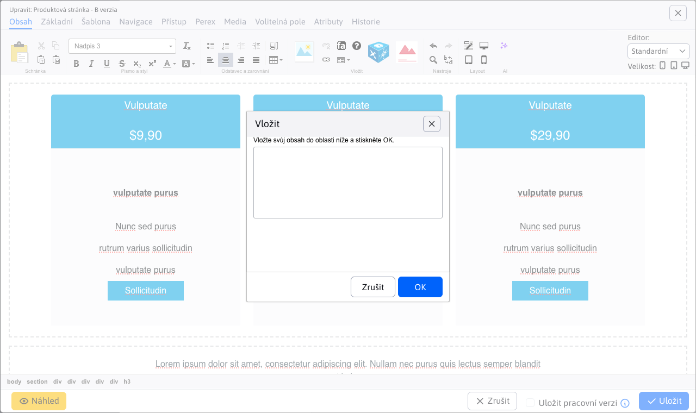
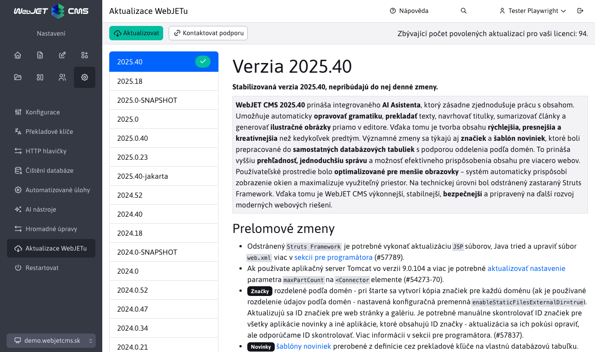
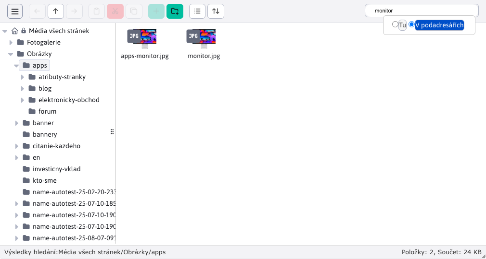
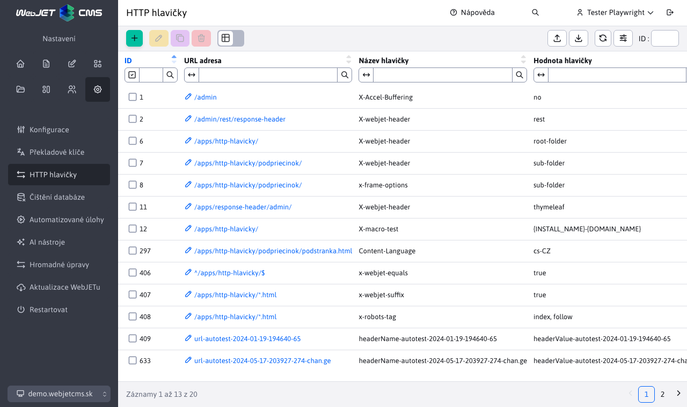
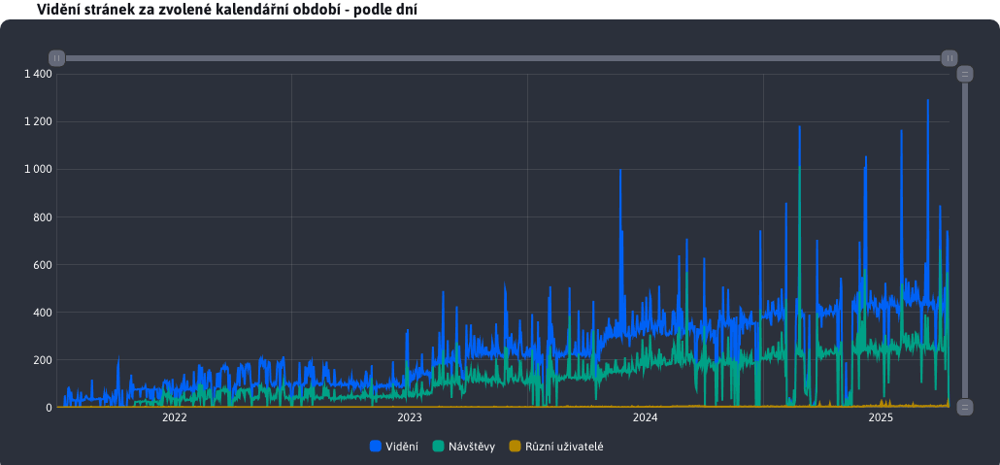
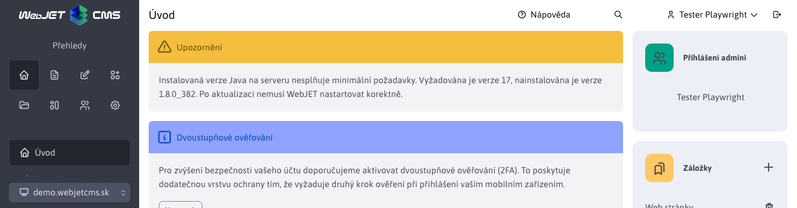
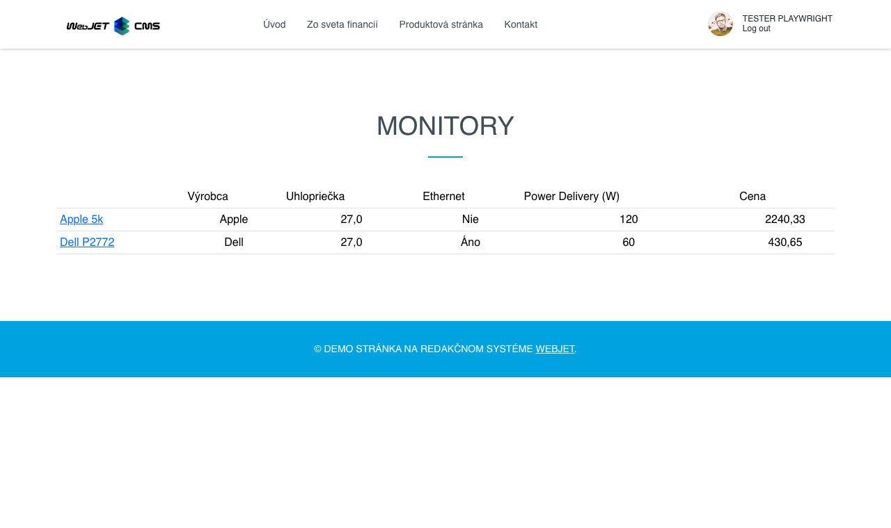

# Seznam změn verze 2023

## 2023.52/2024.0

> Verze 2023.52/2024.0 obsahuje novou verzi **aktualizace s popisem změn**, **klonování struktury** integrované s funkcí zrcadlení (včetně možnosti překladů), přidává možnost **obnovit** web stránku, nebo **celá složka z koše**, přidává **editor typu HTML** a možnost nastavení typu editoru přímo pro šablonu, **aplikacím** je možné **zapnout zobrazení pouze pro zvolené typy zařízení** mobil, tablet, PC a samozřejmě zlepšuje bezpečnost a komfort práce.

<div class="video-container">
  <iframe width="560" height="315" src="https://www.youtube.com/embed/YGvWne70czo" title="YouTube video player" frameborder="0" allow="accelerometer; autoplay; clipboard-write; encrypted-media; gyroscope; picture-in-picture" allowfullscreen></iframe>
</div>

### Průlomové změny

Tato verze přináší několik změn, které nemusí být zpětně kompatibilní:
- Diskuse/Fórum - přidání nového příspěvku a schvalování upravené z frameworku Struts na Spring, použijte volání `/admin/update/update-2023-18.jsp` pro [základní úpravu](install/README.md#změny-při-aktualizaci-na-202318). Zrušená editace profilu uživatele, doporučujeme použít standardní komponentu pro editaci [registrovaného uživatele](redactor/zaheslovana-zona/README.md) (#55649).
- Import z Excelu - pokud máte v projektu speciální verzi importu z Excelu, která volá URL adresu `/admin/importxls.do` upravte formulář a URL adresu podle `/admin/spec/import_xls.jsp`. Základ by vám měl vyřešit aktualizační skript `/admin/update/update-2023-18.jsp` (#55905).
- Restaurační menu - předělané ze Struts na Spring, použijte aktualizační skript a ověřte zobrazení menu na web stránce (#55945).

### Vylepšení uživatelského rozhraní

- Web stránky - Bloky - zvětšená velikost okna pro vkládání bloků, přidána možnost přímo editovat web stránku při jejím vložení Dynamickým odkazem (#56017).
- Web stránky - Editor - zvýšená výška výběrového menu stylů textu/nadpisu pro lepší přehled/výběr možnosti (#56017).
- Aplikace – ještě jednou vylepšená velikost okna pro aplikace – výška i šířka včetně oken při použití PageBuilder. Optimalizovaná velikost vnořených datatabulek. Úprava v `top.jsp,datatables-wjfunctions.js` (#56013).
- Aplikace - aktualizované fotky aplikací a jejich popis v seznamu aplikací v editoru stránek. Opraveny různé drobné vizuální chyby v nastavení aplikací (#55293).
- Datatabulky - při dlouho trvající operaci může dojít k přerušení spojení se serverem, v takovém případě se zobrazí hlášení "Při komunikaci se serverem se vyskytla chyba. Je možné, že operace trvá příliš dlouho a bude provedena později. Počkejte a po chvíli zkontrolujte, zda je operace provedena." pro odlišení od standardní chyby uložení záznamu.
- Datatabulky - přidána možnost [importovat pouze nové záznamy](redactor/datatables/export-import.md#import-dat), pokud záznam podle zvoleného sloupce již existuje je ponechán beze změny (#56061).


### Web stránky

- Import/Export - přidáno nastavení lokálních ID složek při vytvoření šablony. Řeší problém při editaci stránky po importu, kde šablona sice je vytvořena, ale nemá správně nastaven přístup ke složkám. Neexistující složky jsou odfiltrovány. Po importu doporučujeme zkontrolovat nastavení šablon (#55993).
- Při vytvoření nové webové stránky a vkládání obrázku/souboru/média je již před uložením vytvořena složka pro Média této stránky. Vytvoří se podle hodnoty zadané v poli Název položky v menu (#54953-29).
- Při editaci jedné web stránky si okno pro vložení obrázku/vytvoření odkazu pamatuje i po zavření poslední složku a nepřepne se zpět do sekce Média této stránky při znovuotevření. Pokud vkládáte více obrázků z jiné složky, je to praktičtější. Do sekce Média této stránky se stále můžete přepnout kliknutím ve stromové struktuře (#54953-29).
- Přidána podpora pro , [Obnovení web stránek a složek z koše](redactor/webpages/recover.md) (#55937).
- Složka `/files` s plně textovým indexem souborů je přesunut do karty Systém (#54953-30).
- Šablony - přidána možnost nastavit Typ editoru stránek (původně Inline editor struktury) pro šablonu, výchozí hodnota je Podle skupiny šablon, kdy se Typ editoru stránek nastaví podle přiřazené skupiny šablon (#56129).


- Editor - přidán Typ editoru stránek HTML, kdy se editor stránky zobrazí přímo v HTML režimu (HTML kód). Umožňuje upravovat speciální typy stránek, které se nesmí přepnout do vizuálního režimu z důvodu např. speciálního kódu (#56129).


- Editor - přidána možnost nastavit velikost/šířku editoru iv režimu Standardní. Umíte tak zobrazit stránku v režimu šířky pro mobilní telefon, tablet a počítač (#56129).
- Editor - sjednocené přepínání režimu Standardní/Page Builder (#56129).
- Ninja - přidána podpora dodatečných prohlížečů pro definování minimální podporované verze v `config.properties` typu `minBrowserVersion.crazy\u0020browser=10` (#56129).
- Pro stránky s vypnutým zobrazením upravena i barva názvu stránky na červenou (#55997).
- Editor - upravená funkce Vložit jako čistý text a Vložit z Wordu pro otevření dialogového okna, do kterého se vloží text ze schránky (#56189).



- Editor - zlepšené čištění kódu vloženého z Excelu - odstraněno je nastavení šířky buněk a třídy CSS stylů (#56189).
- Editor - upravené vkládání odkazů na email adresu - chybné zobrazení http prefixu při zadávání email adresy (#56189).

### Page Builder

- Page Builder předělaný na používání nových JavaScript souborů identických jako při editaci web stránky (dosud se používaly staré z verze 8). Kód stránky je vložen přímo při zobrazení, nemusí se provést volání REST služby. Doplňkové CSS a JavaScript soubory jsou vloženy pomocí `combine` jedním voláním. Při zobrazení běžné stránky se snížil počet HTTP požadavků z 42 na 24 (#56017).
- Načtení v editoru by mělo být rychlejší, nová verze neobsahuje staré části kódu, některé objekty se znovu použijí.
- Do budoucna bude dostupná už jen verze Page Builder v sekci Web stránky, samostatná inline editace při zobrazení web stránky bude zrušena (z důvodu jednotnosti skriptů).
- Nastavení viditelnosti upravené na možnosti Mobil, Tablet, Desktop ve shodě s možností přepnutí šířky editoru (#56017).
- Přidána možnost [generovat menu](frontend/page-builder/blocks.md#podpora-menu) pro `single page` typy stránek. Menu se generuje automaticky podle sekcí ve web stránce (#56017).

### Aplikace Spring

- Přidán název aplikace do okna nastavení namísto generického názvu Upravit (#55997).
- Aplikace typu Spring mají přidanou [kartu Zobrazení](custom-apps/appstore/README.md#karta-zobrazení) pro nastavení zobrazení aplikace na různých zařízeních a možnost nastavit ukládání HTML výstupu do vyrovnávací paměti pro rychlejší zobrazení web stránky. Pokud není zvoleno žádné zařízení aplikace se zobrazí vždy.


### Restaurační menu

- Sekce (aplikace) Restaurační menu předělaná do datatabulek [Restaurační menu](redactor/apps/restaurant-menu/README.md) (#55945).


### Aktualizace WebJETu

Vylepšený proces [aktualizace WebJET CMS](sysadmin/update/README.md), přeneseny do nového designy, doplněna diakritika do seznamu změn, zobrazení seznamu změn se zvýrazněnými texty a obrázky.



### Bannerový systém

- Přidána podpora pro [Zobrazení banneru pro specificky typ zařízení](redactor/apps/banner/README.md#zobrazení-banneru-pro-specificky-typ-zařízení), tedy zobrazení jen např. na mobilním telefonu, nebo jen na tabletu. Umíte tak zobrazovat různé bannery pro různá zařízení (#55921).


### Formuláře

- Doplněno pole Firma do seznamu polí přihlášeného uživatele při vyplnění formuláře (#55961).

### Galerie

- Optimalizovaná inicializace editoru obrázků - po první inicializaci se použije existující instance (#55853).
- Optimalizované načítání dat - při zobrazení galerie snížený počet volání REST služby z 6 na 1 (#56093).

### HTTP hlavičky

- Doplněna možnost nastavení hlavičky `Content-Language`, [automatické nastavení](admin/settings/response-header/README.md#nastavení-pro-soubory) hlavičky pro soubory.
- Doplněna podpora [nastavení hlaviček](admin/settings/response-header/README.md) pro přesnou shodu URL adresy pomocí `^/path/subpath/$` a možnost nastavení pro určité přípony `/path/subpath/*.pdf,*.jpg` (#56109).


### Kalendář událostí

- Přidána možnost vytvořit typ události s mezerou v názvu (#56054).
- Přidáno smazání Cache po přidání nové události (#56054).

### Klonování struktury

- [Klonování struktury](redactor/apps/clone-structure/README.md) je integrováno se [zrcadlením](redactor/apps/docmirroring/README.md) pro možnost vytvoření překladu a propojení stránek při klonování jazykové mutace. Jazyk se stahuje z nastavení zdrojové a cílové složky (#55733).
- Po vytvoření klonu je automaticky nastaveno zrcadlení změn, v případě potřeby jej můžete zrušit úpravou konf. proměnné `structureMirroringConfig`. Mezi klonem a originální strukturou se budou přenášet změny.


### Novinky

- Do [šablony novinek](redactor/apps/news/README.md#šablona) přidané objekty `$pagesAll` s celým seznamem stránkování (`$pages` obsahuje zkrácený seznam) a `$totalPages` s celkovým počtem stránek.

### Uživatelé

- Vymazání uživatele - ošetřená situace, kdy aktuálně přihlášený uživatel se snaží vymazat sám sebe (#55917).
- [Seznam uživatelů](admin/users/README.md) - v tabulce přidány sloupce Práva na adresáře a stránky a Schvalování. Vzhledem ke vnořeným datům ve sloupcích nelze vyhledávat a uspořádat podle hodnoty (#55897).
- Seznam uživatelů - přidáno zobrazení Skupiny práv pro zobrazení skupin práv administrátorů v tabulce s možností filtrování podle zvolené skupiny (#55601).

### Překladové klíče

- Přidána možnost [importovat pouze nové](admin/settings/translation-keys/README.md) (ještě neexistující) klíče. Existence klíče se kontroluje pro každý jazyk (#56061).


### Přesměrování

- Přesměrování cest - ve více doménové instalaci se zobrazují pouze záznamy podle aktuální zvolené domény a záznamy, které nemají nastavenou doménu (#55957).

### Proxy

- Přidáno nastavení HTTP hlavičky `Content-Type` podle [odpovědi z proxy](redactor/apps/proxy/README.md) (při použití proxy na REST služby/bez vložení do webové stránky) (#56054).

### Statistika

- Filtr výběru složek v zobrazení statistiky zobrazuje pouze složky, na které má uživatel práva v seznamu webových stránek. Při první návštěvě se statistika zobrazí pro první povolenou složku. Umožňuje to zobrazit statistiku i redaktorům s omezenými právy na stromovou strukturu web stránek (#55941).
- Přidáno právo Zobrazit statistiku pro všechny složky, které povolí zobrazení celé stromové struktury bez ohledu na práva na webové stránky (#55941).

### Volitelná pole

- Přidán typ pole `UUID` pro generování [unikátního identifikátoru](frontend/webpages/customfields/README.md#unikátní-identifikátor).


### Značky

- Značky – seznam dostupných značek se zobrazuje podle práv na sekce web stránek. Umíte tak zpřístupnit administraci značek pouze pro určitou stromovou sekci web stránek (nebo doménu). Pokud má tedy uživatel povolen pouze přístup do sekce web stránek / Newsletter zobrazí se mu jen značky, které mají přidanou tuto sekci, nebo značky bez omezení zobrazení (#55961).

### Zrcadlení struktury

- Přidána možnost později doplnit ID další složky na zrcadlení, pomocí [Klonování struktury](redactor/apps/clone-structure/README.md) lze doplnit obsah nového jazyka (#55733).
- Doplněna kontrola nastavení synchronizace - pokud odstraníte ID složky z konf. proměnné `structureMirroringConfig` nebudou se stránky a složky v odebrané struktuře dále synchronizovat (#55733).
- Přidána možnost vytvářet v zrcadlených složkách [stránky a složky se zapnutým zobrazením](redactor/apps/docmirroring/README.md#průběh-zrcadlení) (např. během fáze vývoje stránky), stačí nastavit konf. proměnnou `structureMirroringDisabledOnCreate` na hodnotu `false` (#55733).
- Překladač - [pro DeepL](admin/setup/translation.md) je možné v konf. proměnné `deepl_api_url` nastavit URL adresu API služby. Výchozí je hodnota pro volnou verzi, při použití `Pro` verze nastavte na `https://api.deepl.com/v2/translate`. Upravený způsob autorizace vůči API na novou verzi pomocí HTTP hlavičky `Authorize` (#55733).

### Bezpečnost

- Aktualizovaná knihovna `logback` na verzi 1.3.14.
- Opravena zranitelnost `CVE-2022-26960` v knihovně `elfinder`.
- Uživatelé - Profil - doplněna informace o kvalitě hesla při jeho změně (#56077).

### Systémové změny

- Optimalizovaná velikost JavaScript souborů - knihovna `moment` je načtena pouze s potřebnými jazyky namísto všemi dostupnými (použitý `MomentLocalesPlugin`). Velikost snížena o 300kB (#56093).
- Aktualizace - od 2023.40-SNAPSHOT jsou na aktualizačním serveru připraveny také balíky pro aktualizaci WebJETu běžícího v JAR režimu, aktualizační server poskytne aktualizační soubor podle typu režimu.

**Přechod z knihovny Struts na Spring**

- Aktualizace WebJETu - předělané aktualizace WebJETu [Aktualizace WebJETu](sysadmin/update/README.md) (#55797)
- Diskuse/Fórum - předělané přidání nového příspěvku ze Struts na Spring, předělané schvalování (#55649).
- Hodnocení stránek - předělané [Hodnocení/Rating](redactor/apps/rating/README.md). Třída `RatingDB` nahrazena za `RatingService` a `RatingBean` za `RatingEntity` (#55729).
- Import XLS - URL adresa pro import XLS souborů změněna z `/admin/importxls.do` na `/admin/import/excel/`, použijte příklad v `/admin/spec/import_xls.jsp` pro aktualizaci vašich souborů (#55905).
- Restaurační menu - předělané na Spring, třídy `MenuDB,MealDB,MenuBean,MealBean` nahrazeno za `RestaurantMenuService,RestaurantMenuEntity,RestaurantMenuMealsEntity` (#55945).
- Web stránky - předělaná možnost Klonování struktur ze struts na Spring [Klonování struktury](redactor/apps/clone-structure/README.md) (#55733).
- Web stránky - předělané importování stránek ze ZIP archivu [Importování web stránek ze ZIP archivu](redactor/webpages/import-export.md#importování-web-stránek-ze-zip-archivu) (#55905).
- Web stránky - předělané importování stránek z Excel souboru [Importování web stránek z Excel souboru](redactor/webpages/import-export.md#import-struktury-z-excel-souboru) (#55905).

### Oprava chyb

- Číselníky - opravené stránkování v číselnících (#56013).
- Datatabulky - opravená pozice okna z vnořené datatabulky aby se vešlo celé do prohlížeče.
- Formuláře - opravena chyba zobrazení data v Naposledy odeslán v seznamu formulářů na Oracle databázi.
- Formuláře - opravený export dat z formuláře a duplicitní generování export souboru (#56141).
- Galerie, Zobrazení souborů, Archiv souborů - opraven výběr složky ve vlastnostech aplikace ve stránce (#54953-27).
- Galerie - opravena dvojitá lomítko v URL adrese galerie v některých scénářích (#56017).
- Hromadný email - doplněná kontrola duplicity emailových adres bez ohledu na velikost písmen (#55961).
- Konfigurace - opraveno duplicitní zobrazení konf. proměnné při přidání již existující proměnné (#55733).
- Konfigurace - opraven import speciálních znaků jako je `'&#<` a vyhledávání v takové hodnotě (#55993).
- Json editor - opravené nastavení a změna obrázku v aplikacích používajících Json editor (např. Doporučení, Působivá prezentace atd.) (#55293).
- Uživatelé - opravené zobrazení práv uživatele v editaci - zobrazovaly se zaškrtnutá i práva podle skupiny, nejen ta nastavená (#55797).
- Uživatelé - Profil - opravena chyba změny hesla (#56077).
- Restartovat - opravena funkce Restartovat v menu Nastavení (#54953-30).
- Skripty - opravené vkládání skriptů do stránky - pro jméno pozice se chybně používalo vyhledávání jako podřetězec a skript se vkládal i když se jméno pozice neshodovalo přesně (#54953-30).
- `Slider` - opravena kompatibilita knihovny jQuery (#55293).
- Šablony - opraveno zobrazení šablon, které mají nastavené zobrazení pouze pro určitou složku a zároveň tato složka má prázdné doménové jméno (#55993).
- Web stránky - přidána podpora při schvalování web stránky v módu žádná akce (#55897).
- Web stránky - odstranění záznamů schvalování, které zůstaly po vymazání složky z koše (#55897).
- Web stránky - doplněno automatické nastavení malých písmen při zadání domény (doména se zadává standardně jen s malými písmeny) (#55993).
- Web stránky - opraveno přepnutí na kartu Základní po přidání nového média v nové web stránce (#54953-29).
- Web stránky - opraveno zobrazení náhledu pokud je Spring nastaven ve výchozím nastavení na JSON odpovědi (#56054).
- Web stránky - opravené přejmenování domény - Systém složky se doména nezměnila (#54953-30).
- Web stránky - bloky - vylepšené nastavení velikosti okna při vkládání Bloku (#55293).
- Zobrazení souborů - opraveno zobrazení souborů (detekce domény) (#54953-27).
- Oprava chyby posílání parametrů u externích filtrů, hodnotě datum do se nastaví čas na 23:59:59 (#56021).

### Pro programátora

- Aplikace - přidána možnost zobrazit aplikaci ve stránce [podle typu zařízení](custom-apps/appstore/README.md#podmíněné-zobrazení-aplikace) (mobil, tablet, pc) přidáním parametru `!INCLUDE(/components..., device=mobil)!`. Pro [Bannerový systém](redactor/apps/banner/README.md) je přidáno nastavení i do rozhraní nastavení aplikace.
- Datatabulky - přidaná podpora `LocalDate/LocalDateTime` pro datová pole, přidaný atribut `alwaysCopyProperties` do `DatatableColumn` pro možnost kopírování při editaci z [stávajícího záznamu](developer/datatables-editor/datatable-columns.md).
- Uživatelé - doplněná dokumentace k použití `afterSaveInterceptor` při [registraci uživatele](custom-apps/apps/user/README.md) a možnost neposlat standardní uvítací email přepsáním metody `shouldSendUserWelcomeEmail` (#54953-28).


## 2023.40

> Verze 2023.40 přidává možnost **vyhledávání v průzkumníku** /souborech, možnost použít **video banner**, zlepšuje uživatelské rozhraní, zrychluje načítání dat ve web stránkách. **Banner** přidává nastavení omezení pro **zobrazení jen v zadaných web stránkách a složkách**. Nová aplikace **HTTP hlavičky** umožňuje nastavovat HTTP hlavičky pro zadané URL adresy. **Médiím** jsme přidali **volitelná pole**. Zrcadlení struktury podporuje **překlad i těla web stránky** a zlepšuje detekci změn. Do nového designu předělané aplikace **Monitorování serveru, SEO, Novinky, Diskuse**. Verze je zaměřena i na odstranění starých částí kódu, z toho důvodu je třeba nově [zkompilovat vaše třídy a upravit JSP soubory](install/README.md#změny-při-aktualizaci-na-202318).

<div class="video-container">
  <iframe width="560" height="315" src="https://www.youtube.com/embed/5hlbQYoOF6U" title="YouTube video player" frameborder="0" allow="accelerometer; autoplay; clipboard-write; encrypted-media; gyroscope; picture-in-picture" allowfullscreen></iframe>
</div>

### Průlomové změny

Tato verze přináší několik změn, které nemusí být zpětně kompatibilní:
- Upravené přihlašování pomocí `ActiveDirectory` z knihovny `Struts` na `Spring`, před nasazením na produkci ověřte na testovacích prostředích funkčnost přihlašování (#55489-4).
- Upraveno přihlášení návštěvníka do zaheslované zóny z knihovny `Struts` na `Spring`. Pokud používáte vlastní přihlašovací JSP je třeba upravit její kód (použití struts html tagů - nahradit za standardní HTML tagy). Standardní změny upraví automaticky volání `/admin/update/update-2023-18.jsp`, které doporučujeme znovu spustit pro kontrolu kompilace JSP souborů (#55489-4).
- Aktualizovaná verze knihovny `Thymeleaf` na verzi 3.1. Obsahuje [několik změn](https://www.thymeleaf.org/doc/articles/thymeleaf31whatsnew.html) oproti verzi 3.0, hlavně odstranění objektů `#request, #response, #session, #servletContext`. WebJET automaticky pro aplikace do modelu přidává objekty `request,session` ale je třeba upravit HTML kód aplikací aby používali objekt `${request` a ne `${#request`. Automaticky to umí upravit volání `/admin/update/update-2023-18.jsp`, které je rozšířeno io opravu `.html` souborů Thymeleaf šablon.

Po nasazení této verze zkontrolujte minimálně:
- Přihlašování pomocí `ActiveDirectory` do administrace i zaheslované sekce (pokud používáte integraci na `ActiveDirectory`).
- Přihlašování a registraci návštěvníků do zaheslované sekce (pokud na web stránce máte zaheslovanou sekci).
- Aplikace a šablony používající knihovnu `Thymeleaf`.
- Proces schvalování web stránek (pokud používáte).

### Vylepšení uživatelského rozhraní

- Aplikace - **zvětšené okno pro nastavení aplikace** Např. seznam fotografií v aplikaci galerie. Výška i šířka okna se přizpůsobuje aktuálnímu rozlišení prohlížeče. Na velkých monitorech se okno nastavení aplikace zobrazí výrazně větší než v předchozí verzi (#54953-15).


- Aplikace - upravený počet sloupců v seznamu všech aplikací na 4 pro zobrazení vyššího počtu aplikací najednou (#54953-15).
- Datatabulky - opravená pozice okna v režimu editace buňky u typu `quill` (např. perex/anotace v galerii). Okno bylo příliš vysoké a nedalo se posunout, v nové verzi je bublina širší pro pohodlnější práci (#54953-15).
- Datatabulky - **zrychlené hledání záznamu podle ID** v URL adrese, zrychlené přepínání stránek není-li záznam na první straně (#54273).
- Datatabulky - **přidána možnost filtrovat seznam podle ID**, umíte tak snadno vyhledat záznam i při vysokém počtu stran. Na rozdíl od pole ID v nástrojové liště záznamy jen filtruje, neotevře automaticky i editor. Zadání ID v nástrojové liště stránkuje do 5 strany a následně použije filtrování podle ID pro otevření editoru. Upravena možnost označení/od-značení všech záznamů na jednu ikonu. Pokud nejsou označeny žádné záznamy označí se všechny, pokud jsou nějaké označené odznačí se (#55581).
- Datatabulky - upravený název souboru s exportem na formát `názov-YYYYMMDD-HHmmss.xlsx` pro lepší uspořádání exportovaných souborů podle abecedy ve standardním průzkumníku počítače (#55581).
- Datatabulky - pokud editor obsahuje hodnotu, která se nenachází ve výběrovém poli jako možnost, přidá se alespoň s ID hodnotou a zobrazí se varování. Situace nastane-li například. stránku přesunete do jiné složky a přiřazená šablona se v nové složce kvůli omezením nemá používat (#54953-16).


- Galerie - doplněné zapamatování zobrazených sloupců a jejich pořadí v tabulkovém zobrazení (#54953-15).
- Galerie - doplněna ikona pro zobrazení zvoleného obrázku v nové kartě prohlížeče (#54953-15).
- Web stránky - editor - **preference režimu editoru (Standardní/PageBuilder) se uloží do nastavení** uživatele na serveru a je perzistentní mezi jednotlivými přihlášeními uživatele. (#54953-15).
- Web stránky - editor - tabulka - při vložení nové tabulky do stránky je přednastavená šířka `100%` namísto původní hodnoty `500px` (#54273).
- Web stránky - **optimalizovaná data** při načtení seznamu stránek a stromové struktury při zadání ID stránky/složka v URL. Potřebná data jsou odeslána přímo ze serveru během načítání stránky. Např. zobrazení stránky hlavičky z editoru šablon a podobně (vnořený editor z výběrového menu hlavičky/patičky/navigace) (#54273).
- Web stránky - historie - verze se zamítnutým schválením jsou zobrazeny červenou barvou (#55493).
- Web stránky - **upravené zobrazení ikon při menším poměru** mezi sloupcem stromové struktury a seznamu web stránek. Konflikt s polem pro zadávání ID, krásnější zobrazení ikon ve 2 řádcích při malém rozlišení. Přepočet výše předělaný z CSS na JavaScript výpočet (#54953-22).
- Externí filtr - nyní podporuje také filtrování pomocí Web stránek a Vyhledávače (#55537).
- Průzkumník - přidána možnost **vyhledání souboru/obrázky/web stránky**. Funkce je dostupná také v editoru stránek při vložení obrázku, nebo odkazu na soubor/stránku. Vyhledávat lze v aktuální složce, nebo iv pod složkách (#54953-25).



### Community/Open Source verze

- Přidána podpora spuštění WebJETu bez **licenčního čísla v komunitní/Open Source verzi** (#55789).
- Zveřejněný [zdrojový kód](https://github.com/webjetcms/webjetcms) (#55789).
- K verzi lze dokoupit některé placené aplikace.
- Seznam dostupných aplikací se nachází na stránce [www.webjetcms.sk](https://www.webjetcms.sk/) (#55773).

### Web stránky

- Předělaný **proces schvalování** z původní verze na Spring DATA repozitáře a REST služby. Optimalizovaný kód, smazané duplicitní části (#55493,#54953-21).
- Předělaný **proces mazání web stránek a schvalování mazání** na Spring Data a služby REST (#55493).
- Doplněna možnost zadat znak `/` do názvu složky nebo web stránky. Interně se uloží jako HTML entita `&#47;` ale v editoru a stromové struktuře se zobrazí jako lomítko (#55517).
- Optimalizované iniciální načítání dat pro uživatele s omezenými právy pouze pro zobrazení konkrétní webové stránky (#54953-17).
- Upraveno **vkládání z Word dokumentů** - odstraněny jsou styly (barvy, velikost písma...), tabulkám je nastavena CSS třída podle standardní tabulky, upraveno HTML značky `b,i` na `strong,em`, odstraněno `span` elementy (#55681).
- Při uložení webové stránky do více složek se změní režim zobrazení dalších stránek z přesměrování na standardní zobrazení (stránky jsou jakoby samostatné). Režim přesměrování na hlavní stránku lze zapnout konf. proměnnou `multigroupRedirectSlavesToMaster=true` (#54953-23).
- Doplněna možnost otevřít web stránku s verzí z historie v editoru zadáním URL parametru `&historyid=XXX`. Využívá se například. v inline editaci v zobrazení historie změn po kliknutí na jméno uživatele, který stránku naposledy změnil. (#54953-25).
- Průzkumník - v části Seznam web stránek se zobrazuje **seznam filtrován podle aktuálně zvolené domény** (#54953-25).

### Bannerový systém

- Doplněna informace o počtu vidění a kliknutí na banner i do okna editoru (#55285).
- Doplněno zobrazení obrázku banneru a možnost kliknout pro otevření odkazu do datatabulky (#55285).
- Přidána možnost **nastavení omezení pro zobrazení banneru** jen v zadaných [web stránkách a složkách](redactor/apps/banner/README.md). Umožňuje vám to nastavit **zobrazení banneru ve stromové struktuře web stránek** (#55285).


- Přidána podpora pro [bannery typu Video](redactor/apps/banner/README.md#banner-typu-video) ve formátu `mp4` a `YouTube` a podpora pro **přidání videa** do pozadí Obsahového banneru (#55817).


### Diskuse

- Sekce [diskuse](redactor/apps/forum/forum-list.md) předělána do nového designu (#55501).

### Export dat

- Přidána možnost **vytvořit vlastní typ exportu dat** s [vlastním JSP souborem](redactor/apps/export/README.md#vlastní-formát-exportu) (#54953-19).
- Přidán export dat ve formátu pro `Úradní desku` v [OpenData ČR](https://ofn.gov.cz/úřední-desky/2021-07-20/) JSON (#54953-19).

### Formuláře

- Upravená četba seznamu formulářů - řídící řádky se čtou podle `NULL` hodnoty ve sloupci `create_date`, původně podle sloupce `html` (#54273-43).

### Galerie

- Doplněno zapamatování zobrazených sloupců a jejich pořadí v tabulkovém zobrazení (#54953-15).
- Doplněna ikona na **zobrazení zvoleného obrázku** v nové kartě prohlížeče (#54953-15).
- Doplněna **ochrana systémových složek** Např. `/images/DOMAIN-ALIAS` a složek na které uživatel **nemá práva**. Složka je zobrazena jako needitovatelná a nelze do ní nahrát fotografii (#54953-26).

### HTTP hlavičky

Nová aplikace [HTTP hlavičky](admin/settings/response-header/README.md) v sekci Nastavení umožňuje definovat HTTP hlavičky odpovědi (`HTTP Response Header`) na základě URL adres zobrazené stránky. Hlavičky jsou nastaveny podle nejdelší shody URL adresy a lze použít v názvu i hodnotě makro proměnnou.



### Média

- Sekce Správa všech médiích je **filtrována podle aktuálně zvolené domény**. Zobrazí se tedy pouze média pro stránky v aktuální doméně podobně jako v jiných aplikacích (#55197).
- Ve správa všech médií doplněno filtrování tabulky podle skupiny a názvu/cesty k web stránce, sloupec Obrázek zobrazeno s náhledem obrázku, sloupec **Linka a Web stránka zobrazena s možností kliknutí na odkaz** (#55197).
- Doplněna možnost použít [volitelná pole](frontend/webpages/customfields/README.md) i pro média (#55685).
- Opravena editace médií ve stránce ve více složkách (#54953-23).
- V sekci Správa všech médií je v editoru pole `DOC ID` nahrazeno výběrem web stránky ze stromové struktury (#55197).


### Monitorování serveru

- Předěláno získání zatížení CPU přímo z Java `OperatingSystemMXBean` bez potřeby externí knihovny, doplněné grafy o hodnotu Zatížení CPU WebJET procesu, automatické zapisování do zaznamenaných hodnot/databáze (#55865).
- Sekce Aplikace, WEB stránky, SQL dotazy předělána do nového designu (#55497).
- Doplněná dokumentace [Výměna údajů uzlů clusteru](sysadmin/monitoring/nodes-logic.md).


### SEO

- Celá sekce SEO předělána do nového designu (#55537).
- Doplněna dokumentace o [SEO sekci](redactor/apps/seo/README.md).


### Novinky

- Předělaná aplikace [Novinky](redactor/apps/news/README.md) (v sekci Příspěvky) do nového designu. Umožňuje pracovat s novinkami podobně jako se pracuje s web stránkami. (#55441).
- **Seznam možných složek je automaticky generován** podle použití aplikace novinky ve web stránkách (#55441).
- Upravený design nastavení aplikace ve web stránce (#55441).


- Při nastavení aplikace ve stránce je seznam značek/perex skupin filtrován podle vybraných složek. To vám umožní vybrat značky, i když vkládáte seznam novinek do složky mimo zadané složky pro značky. Seznam se neaktualizuje dynamicky, nejprve nastavte složky, klikněte na OK pro vložení aplikace a následně znovu otevřete její nastavení pro aktualizaci seznamu značek (#54953-17).

### Uživatelé

- Upraveno **vyhledávání podle skupin** - při nastavení možnosti Rovná se vyhledají uživatelé, kteří mají jen tuto jednu skupinu (nemají zadané jiné skupiny) (#54953-20).
- Schvalování uživatelů - přidáno **schvalování uživatelů při registraci** do zaheslované zóny. Přidána [dokumentace popisující celý proces](redactor/zaheslovana-zona/README.md) (#55545).


- Doplněna možnost editace profilu do menu zobrazeného po kliknutí na uživatelské jméno v hlavičce. **Profil je dostupný pouze v nové verzi** (např. na stránce Úvod), ve starých JSP souborech profil nelze upravovat. (#54953-22).
- Import - zlepšena **chybová zpráva při importu**, pokud buňka obsahuje nesprávnou JSON hodnotu (#54953-22).
- Import - zlepšený test importu - doplněna kontrola buněk, které jsou po importu zachovány - nenacházejí se jako sloupec v Excel souboru - nastavením hodnoty `preserveColumns` (#54953-22).

### Překladové klíče

Sekce **Chybějící klíče** předělaná do nového designu. Doplněna informace o **nedávné době a URL adrese volání chybějícího klíče**. Klepnutím na jméno klíče se zobrazí editor, ve kterém můžete jednoduše doplnit chybějící překlad.


- Upravený import z Excelu - **importují se pouze jazyky zadané v Excel souboru** jako sloupec. Pokud potřebujete importovat pouze jeden jazyk smažte v Excelu sloupce s překlady v ostatních jazycích. Nepřepíší se vám tak případné změny v překladech jiných jazyků.

### Proxy

- Přidána možnost vytvořit **proxy pro REST službu ve vnitřní síti**. Aby se odpověď z REST služby nevkládala do stránky zadejte do pole Přípony vložené do stránky prázdnou hodnotu (#54953-21,#55689).
- Přidána možnost zadat [více URL adres](redactor/apps/proxy/README.md#nastavení-aplikace) do pole Lokální URL adresa a možnost použít přesnou shodu a končí na u URL adrese (#55689).

### Šablony

- Seznam souborů pro pole HTML Šablona bere v úvahu hodnotu v poli Jméno instalace, seznam je dynamicky načten při kliknutí do pole, nikoli při otevření editoru (#54953-17).
- Seznam šablon je **filtrován podle aktuálně zobrazené domény**. Filtrování je na základě vybraných složek v poli Zobrazit pro a shody doménových jmen (pokud nemá šablona žádné omezení přístupu zobrazí se ve všech doménách). Filtrování se použije jen když je nastavena konf. proměnná `enableStaticFilesExternalDir=true` (#54953-17).

### Zrcadlení struktury

- Doplněna kontrola existence složky/stránky po nastavení zrcadlení, aby se **složky/stránky zbytečně neduplikovaly, pokud již v daném jazyce existují** (a překlad se shoduje) (#55193).
- Doplněna cache překladů pro urychlení opakovaného získání překladu a snížení zatížení API (#55193).
- Doplněno [překládání textu web stránky](redactor/apps/docmirroring/README.md#automatický-překlad) (#55709).
- Doplněna lepší [identifikace automatického překladu](redactor/apps/docmirroring/README.md#úprava-stávající-web-stránky) s možností **kontinuální aktualizace přeložených stránek** do momentu jejich revize. Automaticky přeložené stránky mají nastaveného autora `autotranslate` pro jednoznačnou identifikaci (#55709)

### Bezpečnost

- Aktualizovaná knihovna `xlsx` pro import XLSX souborů na verzi 0.19.3. Knihovna `amcharts` ještě nemá aktualizaci, nevzniká v ní ale problém, jelikož `xlsx` knihovna se tam používá pouze ke generování XLSX souborů (#55193).
- Aktualizovaná knihovna `tui-image-editor` pro použití novější verze `fabricjs` (#55193).
- Aktualizovaná knihovna `bootstrap-select` na verzi 1.13.14.
- Aktualizované knihovny `slf4j` a `logback`.
- Aktualizovaná verze knihovny `Thymeleaf` na verzi 3.1.
- Aktualizováno NPM moduly na novější verzi (#55193).
- Audit - zlepšené auditování úloh na pozadí - do auditního záznamu se nastaví IP adresa serveru a zaznamená se uživatel, pod kterým je spuštěn aplikační server (#55441).
- Audit - zlepšené auditování záznamů entit používajících `@MappedSuperclass`. Auditovány jsou také vlastnosti ze super třídy (#54953-22).
- Do CI/CD doplněno automatické nasazení na server pro penetrační testování, nastaveno kontinuální penetrační testování nástrojem `Acunetix OVS` (#55193).
- Logování - opravena možná XSS v nastavení úrovní logování (#54273).
- Odstraněno staré `Flash/SWF` soubory pro bannerový systém, YouTube a video přehrávač (#55285).
- Odstraněná knihovna `org.bouncycastle:bcprov-jdk15on:1.70`, používala se jen pro službu `Pay24` a obsahovala možnou zranitelnost (#55193-4).
- Při volání URL adres obsahujících `/rest` jsou povoleny všechny HTTP metody (#54273-44).
- Přihlášení - zapnuto [prodloužení doby nemožnosti přihlášení](sysadmin/pentests/README.md#blokování-přihlášení) na 60 sekund po 5 neúspěšných pokusech zadání hesla (#55489-4).
- Dvoustupňové ověřování - pokud používáte ověřování vůči `ActiveDirectory/SSO` serveru můžete vypnout menu položku pro nastavení dvoustupňového ověření nastavením konf. proměnné `2factorAuthEnabled` na hodnotu `false`.

### Aktualizace WebJETu

- Zlepšený **proces aktualizace WebJETu** přímo přes WebJET. Během aktualizace jsou smazány soubory, které byly smazány během přechodu na verzi 2023.18 (#55293).
- Upravená kombinace souborů na přihlašovací obrazovce pro znovu načtení JS/CSS souborů po aktualizaci (#55293).
- Doplněna kontrola `web.xml` souboru po aktualizaci, kontroluje se výskyt `web-app_2_4.xsd`, pokud se nachází aktualizuje se podle souboru `web-v2023.xml`, který je `web-app_3_0.xsd` (#55293).

### Systémové změny

- Knihovna `Amcharts` pro generování grafů aktualizována na verzi 5. Podpora pro v4 byla zrušena a všechny funkce pro práci s grafy v [chart-tools.js](../src/main/webapp/admin/v9/src/js/libs/chart/chart-tools.js) byly upraveny pro práci s v5 (#55405).



- Aktualizace WebJETu - zlepšená kontrola smazání souborů po aktualizaci, ty které se nepodaří smazat se zapíší do souboru `/WEB-INF/update/error-log.txt` (#55441).
- Cluster - doplněna **možnost použít posledních 16 znaků** z `HOSTNAME` v režimu `clusterNames=auto` nastavením konf. proměnné `clusterHostnameTrimFromEnd=true`. Potřebné např. pro `Kubernetes`, kde je náhodná hodnota na konci `HOSTNAME` (#54953-22).
- Datatabulky - přidána možnost změnit **limit maximálního počtu řádků** pro export pomocí konf. proměnné `datatablesExportMaxRows`, ve výchozím nastavení 50000. Vysoká hodnota může způsobit nadměrné zatížení serveru i počítače redaktora (#54953-17).
- **Optimalizace velikosti JavaScript souborů** - upravené vkládání knihovny `amcharts` pro generování grafů do hlavního JavaScript souboru. Knihovna je vkládána do stránky asynchronně jen v případě potřeby. Velikost souboru se zmenšila o 1MB, což zrychlí jeho prvotní načtení a snižuje paměťovou náročnost (#55405).
- Oracle - do `autoupdate` přidán `trigger` po přihlášení, který nastaví `NLS_SORT=BINARY_AI NLS_COMP=LINGUISTIC` pro podporu vyhledávání bez ohledu na diakritiku a velikost písmen (#JTB1684).
- Odstraněná knihovna `backport-util-concurrent` a `org.mnode.ical4j` - ve standardním WebJET CMS se nepoužívají, v případě potřeby pro váš projekt si je můžete přidat do vašeho `build.gradle` (#54953-19).
- Odstraněné nepoužívané soubory `/admin/FCKeditor/editor/dialog/editor_check_file_exist.jsp,/admin/file_browser/dragdropupload.js.jsp` a složku `/admin/swfupload/*` (#55609).
- Na úvodní stránku doplněna **informace o minimálně vyžadované verzi Javy na serveru**. Minimální verze se nastavuje v konf. proměnné `javaMinimalVersion`, nastavením na hodnotu `0` se upozornění vypne (#54953-17).



**Přechod z knihovny Struts na Spring**

- Začali jsme přechod ze [Struts framework na Spring](developer/frameworks/struts/README.md). Předělána jsou volání `/admin/findex.do->/admin/fbrowser/fulltext-index/index/` (#55389). Struts volání `/sync/getobject.do` je zrušeno (používalo se k online synchronizaci mezi WebJET-mi), podporována je synchronizace pomocí XML/zip souborů (#55489-3).
- Anketa - hlasování - předělané z frameworku (volání `/inquiry.answer.do`) (#55389).
- Upravené přihlašování pomocí `ActiveDirectory` (volání `/ntlm/logon.do`), před nasazením na produkci ověřte na testovacích prostředích funkčnost přihlašování. Odstraněná knihovna `jcifs` (#55489-4).
- Upravené přihlašování návštěvníka do zaheslované zóny (volání `/usrlogon.do`) (#55489-4).
- Smazané již nepoužívané Struts volání `/admin/newgroup.do,/admin/media.do` a třídy `NewGroupAction/Form,MediaAction/Form` (#55489).
- Otázky a odpovědi - předělané volání `/qa.add.do` na Spring (#55493).
- Web stránky - předělané schvalování změn ve stránce (`/admin/approve.do,/admin.approvedel.do`) na Spring (#55493).
- Web stránky - předělané nahrání obrázků, které jsou `drag&drop` do editoru web stránek. Předělaná stará struts `/admin/uploadfile.do` logika na Spring `/admin/web-pages/upload/` (#55609).
- Průzkumník - předělané okno pro Nastavení adresáře a souboru ze struts `/admin/fbrowser.savedir.do,/admin/fbrowser.save.do` na Spring `/admin/fbrowser/dirprop/,/admin/fbrowser/fileprop/` (#55617).
- Při použití `jar-packaging` je soubor `struts-config.xml` čtený z JAR souboru pro možnost jeho aktualizace s WebJETem, původní na souborovém systému je smazán.
- Stažení přílohy ve formulářích - předělané ze struts `/admin/formatt.do` na Spring `/apps/forms/admin/attachment/` (#55613).
- Odstraněná nepoužívaná volání `/admin/FCKeditor/styles.do,/admin/dir.do,/admin/editornewdir.do,/admin/formsendnotify.do,/admin/dragdropupload.do` a příslušné Java třídy (#55489).
- Odstraněné volání `/admin/savedoc.do`, upraven `inline_page_toolbar.jsp` k použití Spring form (#55489).
- Odstraněná nepoužívaná třída `SearchForm` a formuláře `uploadFileForm,formNoteForm` (#55489).
- Předělaná [inicializace WebJETu](install/setup/README.md) a nastavení [licenčního klíče](install/license/README.md) (#55701)

### Dokumentace

- V sekci [Manuál pro redaktora](redactor/README.md) a [Manuál pro správce](admin/README.md) doplněné dokumenty ve formátu `docx` ke stažení, které obsahují základní informace o práci ve WebJET CMS (#43144).
- Vytvořená dokumentace pro [instalaci](install/setup/README.md) a [základní konfiguraci](install/config/README.md) (#54953-23).

### Oprava chyb

- Automatizované úlohy - doplněno chybějící pole Běží na uzlu pro nastavení uzlu v cluster instalaci (#55193).
- Číselníky - opraveno nastavení ID číselníku pro import, opravený import číselníku, který ještě nemá žádný záznam (#55569).
- Číselníky - opraveno filtrování podle zvoleného typu číselníku (#55541).
- Datatabulky - opraveno duplikování záznamu pro některé případy (např. doménové limity kde se používá jako ID primitivní int).
- Datatabulky - opraveno zobrazení nastavení sloupců při jejich přesunutí - špatně zobrazený seznam v okně Zobrazení sloupců (#54953-15).
- Datatabulky - Import/Export - upravený formát exportu pro hodnoty typu `1,2,3` aby byly považovány za řetězec, ne číslo (#55569).
- Datatabulky - upravené vyhledávání když zadáte hodnotu ale kliknete na ikonu lupy v jiném sloupci (nebo zadáte více filtrovacích kritérií najednou) (#54953-18).
- Datatabulky - opraveno nastavení šířky sloupců po zadání data do filtru (#55497).
- Datatabulky - export - doplněno použití externího filtru při exportu dat (#55845).
- Diskusní fórum - opravený HTML kód při vytváření vícetémové diskuse, doplněné nástroje pro nastavení diskuse v administraci (nastavení schvalování, termíny).
- Email - opraveno nastavení SMTP server portu pokud se nepoužívá přihlašovací jméno a heslo (#55545).
- Formuláře - opraveno dešifrování HTML kódu formuláře.
- Formuláře - opraven konflikt názvů sloupců a systémového názvu (např. `note`) (#54273-47).
- Formuláře - opraveno odesílání formuláře jako přílohy (#55705).
- Formulář snadno - přidána možnost použít znak `+` v poli zástupný text (#54953-21).
- Galerie - doplněno pro generování `/thumb` obrázku při změně oblasti zájmu - po uložení se obrázku nastaví aktuální datum a čas, což vyvolá jeho pro generování (#54953-15).
- Galerie - opravené načtení obrázku při přihlášeném uživateli, zadaném `v` parametry a jeho neexistenci/přesměrování (#54953-17).
- Galerie - opravené nahrání obrázku do galerie pokud obrázek již existuje (přepsání `o_` obrázku) (#54953-25).
- HTMLBox - přidána podpora vkládání souborů přes httpS protokol při použití `/components/htmlbox/include.jsp`. Protokol httpS se použije, pokud je spojení s web stránkou zabezpečeno (#55489-4).
- Novinky - opraveno zobrazení chyby v logech serveru u neexistující značky. Opraveno zbytečné volání staré JSP komponenty pro zobrazení novinek v editoru (#54953-18).
- Oracle - opraveno vyhledávání podle jména (např. v auditu) (#JTB1684).
- Počasí - upravený vzhled nastavení aplikace, doplněná kompatibilita s během na Java 11 (#55293).
- Překladač - opraveno nastavení kódování znaků `utf-8` pro korektní přenos diakritiky (#55193).
- Překladové klíče - opravena možnost vyhledávání podle více sloupců, přidáno zapamatování zobrazených sloupců (#54953-18).
- Přesměrování domén - opravena aktualizace cache a clustra při vytvoření nového přesměrování typu `ALIAS` (#55489-4).
- Průzkumník - opraveno nastavení souboru a složky, smazány duplicitní a nepodporované možnosti (vytvořit archiv, konvertovat do PDF atd.) (#55489-1).
- Průzkumník - opravená funkce Duplikovat a zobrazení menu přihlášeného uživatele (#54953-22).
- Uživatelé - opravena kontrola povinného pole Přihlašovací jméno, opravena kontrola kvality hesla.
- Uživatelé - opraveno nastavení práv při načítání editoru s URL parametrem `id` (#54953-22).
- Skupiny šablon - opraven import seznamu skupin šablon - prázdná hodnota `renderFormat` (#55285).
- Šablony - skupiny šablon - opravena možnost nastavit prázdnou hodnotu do metadat (#54273-47).
- Statistika - opraveno zobrazení Vidění stránek v sekci TOP stránky (#55193).
- Vyhledávání v administraci - opravený odkaz na editaci překladového klíče na novou verzi a odkaz na zobrazení složky web stránek (#54953-22).
- Web stránky - doplněná kontrola textu `data not loaded` při ukládání stránky. To může nastat při chybném načtení údajů web stránky před editací (#54273-43).
- Web stránky - upravený import web stránek - uložení seznamu bannerů (#55285).
- Web stránky - PageBuilder - opraveny CSS styly pro nastavení nulového okraji pro elementy `div.row div.row` (#54953-15).
- Web stránky - PageBuilder - opravena chyba nastavení šablony pro nově vytvářenou stránku, pokud se neshoduje šablona složky a hlavní stránky složky (#55441).
- Web stránky - opraveno duplikování kořenové složky při její editaci (pokud se jedná o hlavní doménovou složku) (#55441).
- Web stránky - opraveno načtení stránky z historie pokud je stránka uložena ve více složkách (#54953-20).
- Web stránky - opraveno zobrazení náhledu nově vytvářené (ještě neuložené) stránky (#54953-20).
- Web stránky - opraveno přesouvání stránek uložených ve více složkách ve stromové struktuře (#54953-21).
- Web stránky - opravené filtrování podle značek, je-li použito výběrové pole - je definováno více než 30 značek (#54953-23).
- Web stránky - opraveno nastavení URL adresy stránky pokud již stránka se stejným názvem/URL adresou existuje (#54953-23).
- Web stránky - opraveno načtení seznamu stránek pro schvalování v Oracle DB při vysokém množství složek (#54953-24).
- Web stránky - opravena chyba nastavení hodnoty 0 do atributu `viewsTotal` při uložení web stránky (#54953-24).
- Web stránky - opraveno uložení atributů u webové stránky ve více složkách (#54953-24).
- Web stránky - opraveno zobrazení seznamu Média této stránky při galerii a použití doménových aliasů (duplicitní zobrazení Obrázky namísto Fotogalerie) (#54953-25).
- Web stránky - opraveno zobrazení správné složky při změně existujícího obrázku (označit obrázek a kliknout na ikonu vložení obrázku) (#54953-25).
- Kampaně - opravené sortování ve vnořených datatabulkách editoru. Vytvořen autotest pro ověření fungování (#55565).
- Externí filtr - při přednastavení hodnot z externího filtru se hodnota zapsala i do datatabulky (pokud se sloupce jmenovaly stejně), a tato hodnota v datatabulce bránila filtrování přes externí filtr. Oprava, tyto hodnoty se již nenastaví do datatabulky + její filtr nad takovým sloupcem se stává `disabled` aby se takové chybě předešlo (#55537).
- Šířka tabulky - opravená chyba kde šířka tabulky se neupravovala s parametrem tabulky `autoHeight` v případě, že jsme v dané tabulce filtrovali (#55537).
- Web stránky - opraveno načtení seznamu regulárních výrazů při editaci stránky pro uživatele, který nemají práva na sekci formuláře (#55501).
- Web stránky - doplněna logika mazání stránek ve [více složkách](redactor/webpages/editor.md#zařazení-ve-stromové-struktuře). Při smazání hlavní webové stránky z koše se vymažou i všechny stránky v ostatních složkách (#55813).

### Pro programátora

- Datatabulka - přidán `renderFormat = "dt-format-image"` pro zobrazení [malého náhledu obrázku](developer/datatables/README.md#nastavení-sloupců) s odkazem na plnou verzi a textem linky na obrázek (#55285).
- Datatabulka - přidána možnost přidat [notifikaci](developer/datatables-editor/notify.md) i při volání `/all` (#55497).
- Upravené konstruktory `Tools/DB/utility` tříd z `private` na `protected` pro možnost jejich rozšíření v klientských projektech (#54953-14).
- Odstraněná knihovna `com.googlecode.lambdaj:lambdaj`, výrazy nahrazeny standardními Lambda funkcemi Java 8 (#54425).
- Přidána ukázková podpora [vývoje v kontejnerech](developer/install/devcontainers/README.md) za použití specifikace `devcontainers`.


- Vytvořená dokumentace pro [přechod ze Struts do Spring](developer/frameworks/struts/README.md)
- Upravené zpracování nahrání/`upload` souboru. Pro URL adresy `path.contains("spring") || path.contains("rest") || path.startsWith("/admin/v9/") || queryString.contains("__sfu=0")` se nepoužije starý `MultipartWrapper.getFileParameterValue(key)` ale standardní Spring `MultipartFile`.


## 2023.18

> Verze 2023.18 je zaměřena na integraci kódu původní verze 8. **Zrušeno** je možnost **přepnutí do staré verze 8**, odstraněny jsou části kódu, které jsou již předělány do nového designu, nebo nejsou nadále podporovány. **Hlavní změny API** jsou v použití **generických objektů** typu `List/Map` namísto specifických implementací `ArrayList/Hashtable`. Z toho důvodu **je třeba nově zkompilovat vaše třídy a upravit JSP soubory**.

Významné změny v této verzi:
- Web stránky
  - Aktualizovaná knihovna `ckeditor` (editor stránek) na nejnovější verzi 4.21.
  - Doplněna možnost nastavit poměr [šířky sloupce stromové struktury a datatabulky](redactor/webpages/README.md#nastavení-zobrazení-stromové-struktury).
  - Doplněná integrace [atributů stránky do editoru](redactor/webpages/doc-attributes/README.md).
- Aplikace
  - Bannerový systém - předělaná **statistika zobrazení a kliknutí** na banner na novou podobu.
  - Formuláře - doplněna možnost **archivovat formulář**.
  - [Číselníky](redactor/apps/enumeration/README.md) - předěláno do nového designu.
  - Uživatelé – v multi doménové instalaci je v editaci uživatele a skupin práv možné vybírat složky web stránek a jednotlivé web stránky bez ohledu na aktuálně zvolenou doménu.
  - Překladové klíče - zobrazení **překladových klíčů** upraveno do **tabulkového formátu**, kde sloupce představují jazyky.
  - Šablony - přidána možnost **sloučit dvě šablony** do jedné.
- Bezpečnost
  - Provedeno **bezpečnostní testy** při nasazení u klienta a testy automatizovaným nástrojem `Acunetix OVS`.
  - Aktualizováno několik knihovny.
- Systém
  - Zlepšená **podpora** databázového serveru **Oracle a Microsoft SQL**.

Samozřejmě bylo opraveno i několik chyb, které byly identifikovány při používání WebJETu na více projektech.

<div class="video-container">
  <iframe width="560" height="315" src="https://www.youtube.com/embed/A5upeBuEMbg" title="YouTube video player" frameborder="0" allow="accelerometer; autoplay; clipboard-write; encrypted-media; gyroscope; picture-in-picture" allowfullscreen></iframe>
</div>

### Odstranění závislosti na verzi 8

Z důvodu lepší integrace a budoucího vývoje je odstraněna závislost na WebJET CMS verze 8, která byla dosud dostupná a to včetně možnosti přepnutí uživatelského rozhraní administrace na verzi 8. Je dlouhodobě neudržitelné podporovat obě verze a zároveň používat nové technologie. Soubory verze 8 přesunuty přímo do verze 2023, což nám umožní jejich přímou úpravu na nové rozhraní. Ještě neprodělané části zůstávají ve starém rozhraní, předělané jsou dostupné už jen v novém rozhraní. Zrušena možnost přepnutí uživatelského rozhraní do verze 8.

Pro zjednodušení aktualizace můžete použít skript `/admin/update/update-2023-18.jsp` pro kontrolu a opravu JSP souborů. Zákaznické Java třídy je třeba nově zkompilovat a opravit chyby z důvodu změny API.

Z `build.gradle` souboru je třeba smazat kód:

```
implementation("sk.iway:webjet:${webjetVersion}:struts")
implementation("sk.iway:webjet:${webjetVersion}:daisydiff")
implementation("sk.iway:webjet:${webjetVersion}:jtidy")
```

Přečištěno/smazáno více Java třídy a balíky a příslušné JSP souboru. Pro podporu smazaných částí v projektech je třeba použít buď příslušný produkt typu WebJET NET nebo do projektu je přenést z verze 8:
- Odesílání SMS zpráv `SendSMS`, konverze Kč na Eur `SkkEuroLoader`, Import SAX `XmlSaxImporter`, Vkládání JS/CSS přímo do stránky (Packager), kompilace `sass`, `SassFileMonitor`, `Skriptovanie v editore`, import uživatelů z `TXT/CSV` souboru ve starém `Outlook` formátu (použijte import z xlsx formátu).
- Značky `iwcm:vue` a `vue.tld` pro vkládání VUE komponent, dnes doporučujeme je vkládat přímo jako JS soubory.
- Integrace na `Alfresco` a `Sharepoint` (bude později dostupné jako součást produktu NET).
- Aplikace: Bazar, `AppCache`, `Chat`, `Clipboard`, `Docman`, `emailAttachmentsPublisher`, `Events`, Graf, Majetek, Inzerce, `PageUpdateInfo`, Poradna, SITA, Tip dne, Úschovna, `Wiki`, Smlouvy (část aplikací je nahrazena v produktu WebJET NET).
- Přihlašování přes sociální sítě, použita byla knihovna bez podpory `socialauth`. Plánovaná je integrace `OAuth`, nebo použití Spring Social.
- Konverze z Doc na PDF (služba již nebyla déle dostupná).
- Odstraněno konf. proměnné: `editorEnableScripting,enableToPdfConversion,doc2pdfConvertUrl,packagerMode,packager*,`.

### Web stránky

- Při duplikování web stránky se při otevření okna přepne na kartu Základny pro snadnější změnu názvu, smaže se hodnota pole URL adresa a Název položky v menu aby se automaticky nastavily podle nového názvu stránky. Podobně se nastaví prázdné hodnoty při duplikování složky (#54953-6).
- Doplněno duplikování médií při duplikování web stránky (#54953-6).
- Doplněna možnost nastavit poměr [šířky sloupce stromové struktury a datatabulky](redactor/webpages/README.md#nastavení-zobrazení-stromové-struktury). Vhodné pokud máte široký nebo naopak úzký monitor a potřebujete vidět více/méně ve stromové struktuře (#54953-7).


- Upravené uspořádání URL adres při vyhledávání zadáním ID stránky. V seznamu jsou na začátku stránky, jejichž URL adresa je nejkratší (uspořádání podle abecedy s ohledem na délku URL adresy) (#55001).
- V [historii stránky](redactor/webpages/history.md) přidán sloupec Bude vypnuto s případným datem kdy bude vypnuto zobrazení web stránky (#54953-10).
- Aktualizovaná knihovna `ckeditor` (editor stránek) na nejnovější verzi 4.21.1, vytvořený [GIT repozitář](https://github.com/webjetcms/libs-ckeditor4/pull/1/files) s verzí pro WebJET CMS (#55093).
- Opravena funkce Nastavení bloku (#55093).
- Editor obrázků (kliknutí na tužku po označení obrázku ve stránce) nahrazen novou verzí jak se používá v galerii, vypnuta možnost použít `Pixlr` editor (přešel na komerční verzi a nefunguje API přístup) (#54993).

### Atributy stránky

Doplněná integrace [atributů stránky do editoru](redactor/webpages/doc-attributes/README.md). Umožňuje definovat pole, která se následně nastavují web stránce. Atributy se dělí do skupin (např. Monitory, Mobilní telefony atd.) ze kterých lze vybírat (#55145).

Výhoda oproti volitelným polím je v teoreticky nekonečném počtu polí a zároveň v možnosti organizovat pole do skupin. V databázi jsou hodnoty ukládány v korektních datových typech, což umožňuje provádět uspořádání pomocí databázových dotazů (volitelná pole i typ číslo datově ukládají jako řetězec).


Po nastavení lze atributy zobrazovat ve srovnávací tabulce:



Nebo je možné zadané atributy zobrazit jako aplikaci ve web stránce. jako seznam vlastností produktu:


Doplněné vlastnosti:
- Definice atributů je navázána na aktuální doménu, v každé doméně můžete mít definované nezávislé atributy.

### Datatabulky

- Volitelná pole - přidána možnost nastavit typ pole [textová oblast a needitovatelný text](frontend/webpages/customfields/README.md#textová-oblast) (#55001).
- Přidána možnost [nastavit tabulce](developer/datatables/README.md#možnosti-konfigurace) výšku podle jejího obsahu (počtu řádků) tak, že nevyplňuje celou výšku okna (např. pokud je za sebou více tabulek nebo je přidán i graf) nastavením možnosti `autoHeight: false` (#54989).

### Bannerový systém

- Předělaná statistika zobrazení a kliknutí na banner na novou podobu (datatabulky, grafy) (#54989).

### Formuláře

- Doplněna možnost archivovat formulář, předělaná sekce Archiv formulářů do datatabulky. Odstraněn starý kód zobrazení seznamu formulářů (#54993).

### Číselníky

- Aplikace číselníky předělána do nového designu (#55009).


### Galerie

- Doplněna možnost nastavit poměr šířky sloupce stromové struktury a datatabulky. Vhodné pokud máte široký nebo naopak úzký monitor a potřebujete vidět více/méně ve stromové struktuře (#54953-7).
- Doplněna možnost zobrazit galerii ze specifikované složky v URL parametru `dir`. Při úpravě nastavení aplikace galerie ve stránce se tedy přímo zobrazí nastavená složka (#54953-8).
- Při vytvoření nové složky jsou hodnoty rozměrů (včetně způsobu změny velikosti) a vodoznaku přednastaveny podle rodičovské složky (#54953-11).
- Doplněna podpora zobrazení složek při používání doménových aliasů. Ve výchozím nastavení se zobrazí/otevře složka `/images/ALIAS/gallery`, kvůli zpětné kompatibilitě se ale zobrazí i jiné složky galerie (pokud neobsahují v názvu doménový alias jiné domény) (#54953-12).

### Uživatelé

- V multi doménové instalaci je v editaci uživatele a skupin práv možné vybírat složky web stránek a jednotlivé web stránky bez ohledu na aktuálně zvolenou doménu. Domény se zobrazí jako kořenové složky. Zobrazení vybrané položky obsahuje prefix s doménovým jménem, aby bylo možné rozlišit jednotlivé složky (často se jmenují v různých doménách stejně, např. Česky) (#54953-11).


- Uživatelské rozhraní - odstraněna možnost upravit profil uživatele kliknutím na jméno v hlavičce, data uživatele může modifikovat už jen administrátor s právy do sekce Uživatelé.

### Proxy

- Aplikace [Proxy](redactor/apps/proxy/README.md) předělaná do nového designu/datatabulky. Doplněna dokumentace a automatizované testy (#55025).

### Překladové klíče

- Zobrazení překladových klíčů upravené do tabulkového formátu, kde sloupce představují jazyky. Najednou jsou zobrazeny tedy překlady ve všech jazycích (oproti původní verzi kde jste viděli jen překlad zvoleného jazyka) (#55001).
- Zobrazené jazyky jsou definovány v [konf. proměnné languages](admin/setup/languages.md).
- V nastavení zobrazených sloupců lze zapnout i zobrazení původních hodnot před změnou překladového klíče.


- Zrušený starý způsob exportu/importu klíčů v `properties/json` formátu, podporován je import a export přes Excel. (#54953-8).
- Optimalizovaná rychlost importu z Excel souboru – audituje se pouze informace o importu a ne jednotlivých záznamech, prázdné hodnoty se přeskočí (typicky se jedná o prázdné sloupce nepoužívaných jazyků), porovnání záznamů je vůči cache tabulce (při importu se nemusí pro každý záznam testovat, zda v databázi existuje) (#MR342).

### Šablony

- Přidána možnost sloučit dvě šablony do jedné. Při sloučení se změní sloučená šablona ve složkách a web stránkách za nově zvolenou šablonu (#55021).
- Upravený import - pokud neexistují příslušné stránky pro hlavičku/patičku/menu tak se vytvoří prázdné stránky aby nenastala chyba importu. Podobně pro skupinu šablon a složky (Zobrazit pro) (#MR348).

### Konfigurace

- Přidána možnost importu a exportu konfiguračních proměnných pomocí formátu Excel (#54513-11,MR360).

### Použitelnost

- Upravená použitelnost `autocomplete` polí (typicky výběr skupiny v Bannerově systému, Anketě, Otázky a odpovědi, Skripty). Klepnutím kurzoru do pole se ihned zobrazí výběrové pole se seznamem možností, do pole je ale možné psát začátek textu pro vyhledání v seznamu a také zadat novou hodnotu.

### Bezpečnost

- Audit - přidáno samostatné právo na Úrovně logování, protože ty umožňují i zobrazit logy serveru. Právo je ve výchozím nastavení zakázáno, po aktualizaci jej nastavte vhodným uživatelem (#54953-5).
- Opraveno nastavení URL adresy s parametrem a pamatování hesla při přihlašování - atribut `autocomplete="off"`, atribut automaticky nastaven pro všechna pole typu heslo v editoru datatabulky (#JTB-1587).
- Doplněno vrácení chyby 404 pro url typu `/admin.tgz` (#JTB-1587).
- Zlepšená kontrola přístupu do administrace/kontroly práv na základě nálezů penetračních testů (#JTB-1606).
- Upravené chybové zprávy typu SQL při uložení záznamu v datatabulce - pro uživatele je zobrazena zkrácená verze chyby, kompletní je zaznamenána v auditu (#JTB-1606).
- Aktualizovaná knihovna `Spring Security` na verzi 5.8 (#54993).
- Web stránky - opraven možný XSS v názvu stránky/složka (#55181).
- Web stránky - opraven možný XSS v náhledu aplikace ve stránce (#55181).
- Vyhledat a nahradit - opraven možný XSS v náhledu aplikace ve stránce (#55193).
- Odhlášení - parametr `forward` umožňuje zadat pouze lokální URL adresu, externí je třeba zadat pomocí přesměrování přes `forwardDocId` (#55193).
- Aktualizovaná knihovna Datatables na verzi 1.13.4 pro stránky verze 8 a knihovna v `/components/_common/datatables` složky (#55193).
- Opraveny možné zranitelnosti při vytváření ZIP archivu (doplněna validace cesty) (#55193).
- Přidáno konfigurační proměnné `DocTools.removeCharsDir` a `FileBrowserTools.forbiddenSymbols` pro možnost definovat zakázané znaky v názvu souboru/adresáře (#MR445).

### Systém

- Zlepšená podpora databázového serveru Oracle (#54953-6, #54953-7).
- Při multi doménové instalaci s použitím doménových aliasů je při generování `/thumb` obrázku ověřeno, zda existuje varianta ve složce s přidaným doménovým aliasem (`/images/ALIAS/cesta/obrazok.jpg`). Pokud neexistuje, použije se původně požadovaná cesta (#54993).
- Přidána konf. proměnná `languages`, [nastavující dostupné jazykové mutace](admin/setup/languages.md)
- Upravená pauza při zápisu statistik - původně se náhodná pauza (0-10 sekund) provedla před každým zápisem SQL výrazu, nově se provede jen před prvním záznamem. Pauza je náhodná, aby v clusteru nedocházelo k nadměrnému zatížení databáze v 0 vteřině kdy se ve výchozím nastavení vykonává úloha na pozadí pro zápis statistik.

### Oprava chyb

- Bannerový systém - opravena chyba zaznamenání počtu zobrazení a kliknutí na banner (#54273-40).
- Datatabulka - opravená editace buňky ve vnořené tabulce (editace buňky neměla správně nastaveno zobrazení nad) (#54953-5).
- Formuláře - opravena možnost dešifrování údajů formuláře (#54993).
- Galerie - opraveno nastavení lupy v kartě Oblast zájmu v prohlížeči Firefox a posun velkého obrázku (#54953-5,6).
- Galerie - opraveno zobrazení u typu tabulka - nesprávná výška tabulky (#54953-7).
- Hromadný email - opravena možnost zadání více emailových adres pro odhlášení (#54953-6).
- Datatabulka - opravený výpočet procent při importu z Excelu, doplněna také informace o řádku a celkovém počtu řádků do okna importu (#MR341).
- Datatabulka - opravené hledání záznamu podle ID v URL parametru při uspořádání na klientské straně (když je tabulka uspořádána jinak než podle ID) (#55021).
- Datatabulka - opravené hledání podle ID pokud primární klíč je jiný než `id` (Např. `tempId`) (#55021).
- Datatabulka - opraveno vnoření editace a otevírání dalších oken (např. z web stránky editace šablony, tam editace stránky hlavičky). Doplněno ztmavení hlavičky a patičky rodičovského okna a mírné zmenšení vnořeného dialogu (#54273-41).
- Datatabulka - v režimu duplikovat budou vnořené datatabulky zobrazeny s černou překrytou vrstvou nedostupné k editaci (ztmavené). Typicky vnořené datatabulky zobrazují napojená data a v režimu duplikovat by došlo ke změně údajů původního záznamu. Typicky při editaci web stránky úprava v kartě Média (#54273-37).
- Galerie - opraveno nastavení lupy v kartě Oblast zájmu v prohlížeči Firefox a posun velkého obrázku (#54953-5,6).
- Galerie - opraveno zobrazení u typu tabulka - nesprávná výška tabulky (#54953-7).
- Galerie - opraveno načtení obrázků v multidomain verzi s externími soubory (#MR341).
- Hromadný email - opraveno zobrazení chyby neplatné emailové adresy ve skupině při jejím přidání (#54953-12).
- Mazání dat - upravené zobrazení položek v menu, několik položky sloučené do Databázové záznamy (#54953-7).
- Otázky a odpovědi - upravené výchozí uspořádání tak, aby nejnovější otázky byly na začátku seznamu (#54993).
- PageBuilder - upravené ovlivňování stylů tlačítek stránky styly administrace (#54953-6).
- Uživatelé - opraveno zobrazení neaktivních výběrových polí ve stromové struktuře práv (#54953-9).
- Uživatelé - opravena chyba validace emailové adresy (#54953-12).
- Překladové klíče - opravena chyba vložení klíče se znakem tabulátor na začátku/konci (#MR-364).
- Web stránky - opraveno prvotní načtení seznamu stránek pokud složka obsahuje více než 10 záznamů (#54953-6).
- Web stránky - opraveno duplikování složky pokud není nastavena multi doménová konfigurace (#54953-6).
- Web stránky - opraveno znovu načtení seznamu web stránek ve složce po změně hlavní stránky složky (#54953-7).
- Web stránky - opravená kosmetická vada zobrazení filtru podle stavu a zobrazení tabulky v dialogovém okně (#54953-8).
- Web stránky - opraveno vypnutí publikování stránky po zadaném datu - možnost Odveřejnit stránku po tomto datu (#54953-10).
- Web stránky - opraveno nastavení aktuálního data do pole Datum začátku při nastavené konf. proměnné `editorAutoFillPublishStart=true` (#54953-11).
- Web stránky - opravena nastavení hodnoty textu editoru při editaci buňky (#55057).
- Web stránky - opravena detekce duplicitní URL adresy u adres bez .html na konci a bez lomítka (#55161).
- Web stránky - opraveny ikony v úpravě šablony novinek (#54953-13).
- Web stránky - upravené zobrazení dialogů (např. vlastnosti aplikace) při použití PageBuilder (okno je ve vrstvě vyšší než nástrojová lišta editoru), opravena možnost přesouvání okna pro Spring aplikace.

### Testování

- Do [testování Datatabulky](developer/testing/datatable.md#možnosti-nastavení), `DataTables.baseTest` doplněna možnost `afterCreateSteps(I, options, requiredFields, DT, DTE)` pro nastavení např. povinných polí po uložení záznamu (pokud tabulka neobsahuje žádná povinná pole je možné nastavit pole pro vyhledávání záznamu v dalších krocích).
- Doplněný test `webpages.webpage-virtual-path ` nastavování URL adres stránek - kontrola duplicity, kontrola adres se znakem hvězdička (#55161).

### Dokumentace

- Doplněná dokumentace pro nastavování [atributů stránky v editoru](redactor/webpages/doc-attributes/README.md) (#55145).

### Pro programátora

- Doplněna API metoda [DatatableRestControllerV2.afterDuplicate(T entity, Long originalId)](developer/datatables/restcontroller.md) volána po duplikování záznamu. Můžete tak např. duplikovat i připojená data jako jsou média web stránky (#54953-6).
- Doplněna JavaScript funkce `WJ.selectMenuItem(href)` pro [zvýraznění zadané menu položky](custom-apps/admin-menu-item/README.md#frontend) v `master-detail` stránkách (#54953-9).
- Doplněna podpora polí typu `DataTableColumnType.JSON` v [parametrech aplikací](custom-apps/appstore/README.md#parametry-aplikace) a přímo ve Spring třídě. Sladěno je nastavení polí pro editor (nastavení aplikace v editoru) a při zobrazení aplikace na stránce. (#55169).
- Vytvořená dokumentace k [rozšíření stávajících Spring DATA repozitářů](custom-apps/spring/repository-extend.md) ve vašem projektu (#UCMWS-14).
- Doplněna možnost [rozšíření dialogů](developer/datatables/export-import.md#speciální-typ-exportu) pro speciální import a export dat z datatabulky (#54513-11,MR360).


## 2023.0

<div class="video-container">
  <iframe width="560" height="315" src="https://www.youtube.com/embed/_Rt-GJk-E1Y" title="YouTube video player" frameborder="0" allow="accelerometer; autoplay; clipboard-write; encrypted-media; gyroscope; picture-in-picture" allowfullscreen></iframe>
</div>

Verze 2023.0 je shodná s [verzí 2022.52](CHANGELOG-2022.md).
