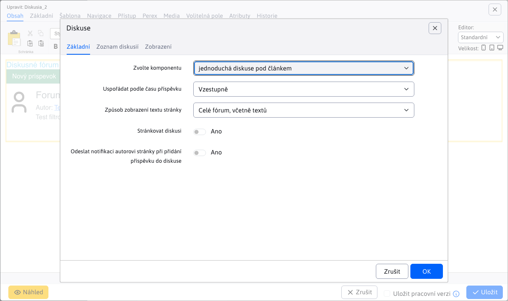
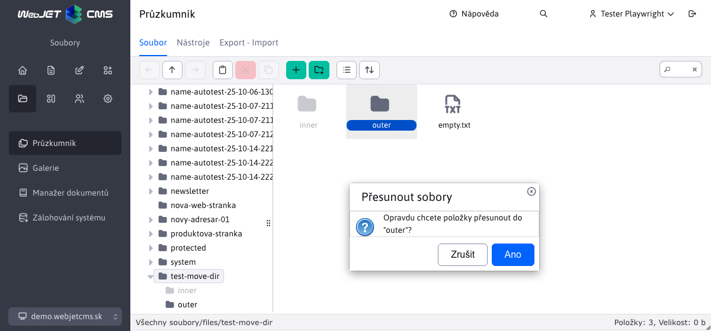
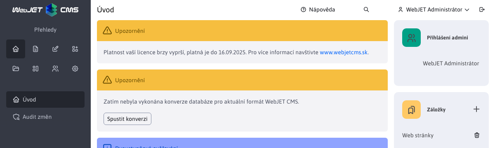

# Seznam změn verze 2024

## 2024.52

> Ve verzi 2024.52 je na webu přidána možnost nastavit **způsob uspořádání** a **vyhledávání ve stromové struktuře**, import ZIP umožňuje nastavit způsob porovnání stávající verze stránky. **Elektronické obchodování** obdržel nový design seznamu objednávek a produktů. Přidáno **statistiky průzkumu**, lepší editor obrázků v průzkumníku a vylepšené vyhledávání v administraci. V **hromadné e-maily** přidána možnost **nastavit potvrzení odhlášení**. Galerie obsahuje nové pole pro **adresa URL zdroje obrázku**, která se vyplní automaticky při použití fotobanky, **Štítky** Přidávají **jazykové mutace** a nepovinná pole.

### Převratné změny

- Aktualizace knihoven Java a JavaScript na novější verze, změny najdete v sekci pro programátory níže. Můžete použít aktualizační skript `/admin/update/update-2023-18.jsp`.
- Zvýšená bezpečnost [veřejné služby REST](custom-apps/spring/public-services.md) pokud je používáte, musíte si vyřídit povolení. Zrušená služba REST `/admin/rest/property/set` (#57202).
- FontAwesome - upravené vkládání [Ikony FontAwesome](frontend/webpages/fontawesome/README.md) v editoru (#57461).
- Elektronický obchod - metody v `DocDetails` pro získání ceny upravené z návratové hodnoty `double` na adrese `BigDecimal`. Můžete použít skript `/admin/update/update-2023-18.jsp` pro základní aktualizaci souborů JSP. V případě potřeby můžete dočasně použít metody `getPriceDouble/getVatDouble/getLocalPriceDouble/getLocalPriceDouble` (#56385).

### Webové stránky

- Přidána možnost zvolit způsob a směr uspořádání [stromové struktury](redactor/webpages/README.md#nastavení-zobrazení-stromové-struktury) (#57257).


- Struktura stromu - přidání možností [vyhledávání ve stromové struktuře](redactor/webpages/README.md#vyhledávání-ve-stromové-struktuře) složky webu do hloubky (#57265).


- Štítky - přidaná možnost [nastavení jazyka](redactor/webpages/perexgroups.md#překlady-karet) název skupiny perex pro zobrazení značky title podle jazyka webové stránky (#57273).


- FontAwesome - upravené vkládání [Ikony FontAwesome](frontend/webpages/fontawesome/README.md) v editoru (#57461).
- Import webových stránek z archivu ZIP - přidání možnosti výběru parametru [porovnat existenci](redactor/webpages/import-export.md#import-webových-stránek-z-archivu-zip) webové stránky, upravené vizuály, přidané možnosti o/z/označení všech stránek/souborů, otevření/zavření složek a přidané informace o průběhu importu. Volitelné pole Porovnání umožňuje stránkám nastavit jedinečný identifikátor pro jednoznačnou identifikaci webové stránky (#57441) prostřednictvím volitelného typu pole.


- Importování webových stránek z archivu ZIP - přidáno oddělení dat na adrese `multi-domain` kde jsou při hledání existující verze importovaných dat ignorována data jiné domény (#57493).
- Vylepšený přenos názvu instalace ze šablony do `CombineTag`. Hodnota je uložena v `session` a budou také použity při načítání souborů během provádění programu `combine` (#56325).
- Vyhledávání souboru šablony JSP bere v úvahu název instalace nastavený v šabloně (#56325).
- Štítky - přidaná karta s [nepovinná pole](redactor/webpages/perexgroups.md#nepovinná-pole-na-kartě) pro možnost přidávat do značek vlastní údaje. Například nastavení barvy značky, designu značky atd. (#57449).
- Klonování struktury - při klonování je zakázána synchronizace názvu webové stránky a složky, aby byly zachovány názvy podle původní složky. Konfigurační proměnná `syncGroupAndWebpageTitle` je nastavena na hodnotu `false` a po dokončení klonování se nastaví na původní hodnotu (#57489).
- Upravené číslování, pokud existuje webová stránka se stejným názvem/URL adresou - nově vytvořená stránka začíná od čísla 2 namísto čísla 1, čímž se vytvoří URL typu `/en/page.html,/en/page-2.html,/en/page-3.html` místo `/en/page.html,/en/page-1.html,/en/page-2.html` Kde: `-1.html` nebylo sémanticky optimální (#54273-50).
- Přidána možnost změnit chování posledního `/` Na adrese [generování adres URL pro stránky](frontend/setup/config.md). Ve výchozím nastavení končí adresa URL hlavní stránky složky znakem `/`, takže např. `/en/products/`, po nastavení konfigurační proměnné `virtualPathLastSlash` na hodnotu `false` bude adresa URL vygenerována bez posledního `/` tedy jako `/en/products` (#54273-50).

### Průzkum

- Přidáno [statistiky odezvy](redactor/apps/inquiry/inquiry-stat.md) ankety (#57337).


### Elektronické obchodování

- [Seznam objednávek](redactor/apps/eshop/invoice/README.md) a [Seznam produktů](redactor/apps/eshop/product-list/README.md) upraveno na nový design datových tabulek (#56325).


- Metody v `DocDetails` pro získání ceny upravené z návratové hodnoty `double` na adrese `BigDecimal` (#56385).

### Galerie

- Výchozí typ vizuálního stylu galerie lze nastavit pomocí proměnné conf. `galleryDefaultStyle`, ve výchozím nastavení `photoSwipe` (#56393-18).
- Přidána možnost zvolit způsob a směr uspořádání [stromové struktury](redactor/webpages/README.md#nastavení-zobrazení-stromové-struktury) (#57257).
- Přidáno pole URL zdroje obrázku s možností zadat adresu, ze které jste obrázek získali. Pole se automaticky nastaví při použití [fotobanky](redactor/webpages/working-in-editor/README.md#karta-fotobanky) v seznamu webových stránek (#57313).
- Přidána možnost **vyhledávání ve stromové struktuře** podle názvu, podobně jako na webových stránkách (#57437).


### Hromadný e-mail
- Odesílání - při odesílání se certifikát SSL webové stránky ignoruje, protože v interním prostředí se často používá dočasný certifikát SSL (#57525).
- Odhlášení - vytvořena nová aplikace pro nastavení odhlášení. Přidána možnost zadat vlastní text před odhlášením a možnost zobrazit potvrzení místo okamžitého odhlášení kliknutím na odkaz v e-mailu (#57525).
- Odhlášení - upravený formulář pro hromadné odhlášení e-mailů - přidána možnost zobrazení potvrzení odhlášení a možnost opětovného vrácení e-mailu po odhlášení (#57525).


### Průzkumník

- Kompletní náhrada editoru obrázků v akci [editace souborů](redactor/files/fbrowser/file-edit/README.md) v sekci průzkumníka za editorem ve tvaru `DataTable` podle fotogalerie (#57313).
- Vylepšené zobrazení na mobilních telefonech pro lepší použitelnost - upravená výška, velikost (#55645).

### Další

- Přepracované vyhledávání v administraci datových tabulek (#57333).


- Přejmenování možnosti Upravit buňku na Upravit v zobrazení mřížky podle názvosloví použitého v dokumentu `Microsoft SharePoint`.
- Vyhledávání - upravil vyhledávací formulář na webové stránce o možnost definovat zástupný text (`placeholder`) namísto standardního Hledání. Poté můžete zadat vlastní text, který se zobrazí ve formuláři, například Search Web Page (#54273-53).

### Zabezpečení

- Modifikovaný startovací protokol - citlivé informace jako hesla, tokeny, certifikáty z konfiguračních proměnných jsou nahrazeny výrazem `********` (#MR643).
- [Pro veřejné služby REST](custom-apps/spring/public-services.md) přidána možnost nastavit povolené IP adresy pro každou službu zvlášť (#57202).
- Překladové klíče - přidána možnost filtrovat klíče ve službě REST [/rest/properties/](custom-apps/spring/public-services.md) podle konf. proměnné `propertiesRestControllerAllowedKeysPrefixes` znemožnit veřejné načtení všech klíčů ze systému WebJET CMS (#57202).
- Přidání hlavičky HTTP do auditu `Referer` (#57565).

### Oprava chyb

- Opraveno generování adresy URL pro testování AB, pokud původní adresa URL obsahuje znak `*` (#54273-50).
- Editor obrázků - opraveno přejmenování obrázku v editoru obrázků otevřeném z průzkumníka (#57269).
- Přesměrování domény - byla opravena možnost zadat protokol pro doménu přesměrování. Přidána logika přesměrování `https` verze při výběru možnosti `http` původního protokolu - předpokládané přesměrování na `https` Verze (#56393-20).
- Webové stránky - Nástroj pro tvorbu stránek - opraveno vkládání aplikací a bloků na správné místo kurzoru (#57613).
- Webové stránky - Bloky - Opraveno odstranění prázdného místa ve Firefoxu při vkládání bloku (#57613).

### Dokumentace

- Dokumentace vytvořená pro [zlepšení výkonu serveru](sysadmin/performance/README.md) (#57357).
- Vytvořená dokumentace ve formátu PDF pro [editora](_media/manuals/webjetcms-redactor.pdf), [Správce](_media/manuals/webjetcms-admin.pdf), [provoz](_media/manuals/webjetcms-sysadmin.pdf) a [nainstalovat](_media/manuals/webjetcms-install.pdf). Dokumentace PDF je automaticky generována z aktuální dokumentace MarkDown a obsahuje datum verze WebJET CMS (#57269).

### Pro programátora

- Změněné rozhraní API pro datovou tabulku `table.ajax.url(newUrl); -> table.setAjaxUrl(newUrl);`, `table.ajax.url() -> table.getAjaxUrl()` (#57365).
- Aktualizováno `Swagger-UI` na adrese `/admin/swagger-ui/` na verzi `org.webjars:swagger-ui:5.17.14` (#57365).
- Aktualizovaná knihovna `Bootstrap` z 4.6.1 na 5.3.3 a `jQuery` z verze 3.5.1 na 3.7.1 pro starou administraci v8 (#57365).
- Knihovny odstraněné ve verzi 8 `bootstrap-modal,bootstrap-switch,bootstrap-toastr,uniform,simple-line-icons` (#57365).
- Potřebujete upravit přepínání karet v souborech JSP, vyhledejte položku `data-toggle="tab"` a nahradit je textem `data-bs-toggle="tab"`, `LI` nastavit prvek `class="nav-item"` a na první `A` nastavit prvek `class="active"`:

```html
<ul class="nav nav-tabs">
    <li class="nav-item">
        <a class="active" href="#tabMenu1" data-bs-toggle="tab">
            <iwcm:text key="components.filter"/>
        </a>
    </li>
    <li class="nav-item">
        <a href="#tabMenu2" data-bs-toggle="tab" onclick="loadComponentIframe();">
            <iwcm:text key="components.file_archiv.waiting_files"/>
        </a>
    </li>
</ul>
```
- Odstraněné metody `DocDB.searchTextAll,searchTextUrl`, použijte třídu `sk.iway.iwcm.search.SearchService` (#57333).
- Aplikace prostřednictvím `!INCLUDE` lze vložit také ze složek `/apps` a `/templates` (#56325).
- [Volitelná pole](frontend/webpages/customfields/README.md#barva) - přidaný typ pole `color` pro výběr barvy (#57449).
- Pro [aplikace v editoru](custom-apps/appstore/README.md#použití-anotace) je možné definovat více souborů JSP, pro které se bude používat, např. `@WebjetAppStore(...componentPath = "/components/search/search.jsp,/components/search/lucene_search.jsp")`. První soubor JSP v seznamu (#54273-53) se použije při vkládání nové aplikace.


## 2024.40

> Ve verzi 2024.40 přináší **Průzkumník** nové funkce a vylepšení. Při přesouvání souborů pomocí **při přetahování se nyní zobrazí potvrzení** abyste se vyhnuli chybám při správě souborů. V editoru obrázků byla přidána možnost nastavit **velikost a ořezávání podle šablon.** &#x6B;terá usnadňuje úpravy obrázků přímo v rozhraní.
>
> Dalším vylepšením je přepracování nastavení několika funkcí. **aplikace v novém, přehlednějším designu**. Autor stránky nyní obdrží **oznámení o včasném zveřejnění stránky** a také při přidávání **příspěvek do diskusního fóra** což zlepšuje kontrolu nad obsahem. Nová aplikace pro rezervace na základě času umožňuje snadné a přehledné nastavení **rezervace zařízení, jako jsou tenisové kurty nebo zasedací místnosti**. Tato aplikace také nabízí statistiky podle uživatelů a objektů, což usnadňuje správu rezervací.
>
> Vylepšili jsme také PageBuilder a opravili chyby při publikování v Archivu souborů, čímž jsme zajistili lepší stabilitu a výkon při práci s obsahem.

### Převratné změny

- AB testování - zabráněno volání adres URL verze B (obsahující výraz `abtestvariant`), pokud není přihlášen žádný správce. Přímé volání takových adres URL můžete povolit nastavením proměnné conf. `ABTestingAllowVariantUrl` na hodnotu `true` (#56677).
- Připojení k databázi - změněná knihovna pro správu připojení k databázi z `Apache DBCP` na adrese [HikariCP](https://github.com/brettwooldridge/HikariCP) (#56821).
- Inicializace - upravená inicializace WebJET pomocí `Spring.onStartup` místo `InitServlet`. Správné pořadí načítání konfiguračních proměnných a jejich použití v systému `SpringBean` objekty (#56913).
- Kódování znaků - kvůli změně inicializace se kódování znaků načítá z proměnné conf. `defaultEncoding` s výchozí hodnotou `utf-8`. Pokud jste v minulosti používali kódování `windows-1250` je nutné upravit hodnotu v konfiguraci. Hodnota v `web.xml` Pro `SetCharacterEncodingFilter` ale hodnotu v konfiguraci WebJET. Filtrovat můžete z `web.xml` vymazat. Podpora nastavení chybové zprávy v případě přerušení spojení s databází pomocí parametru `dbErrorMessageText`, je třeba vytvořit soubor `/wjerrorpages/dberror.html` zobrazit konkrétní stránku HTML při chybě připojení k databázi (#56913, #56393-12).
- Optimalizované získávání přesměrování v `404.jsp`, ve vašich projektech gradle doporučujeme aktualizovat soubor `404.jsp` Podle [basecms](https://github.com/webjetcms/basecms/blob/master/src/main/webapp/404.jsp) projekt (#53469).
- Archiv souborů - upravená výchozí hodnota proměnné conf. `fileArchivIndexOnlyMainFiles` na hodnotu `true`. Do vyhledávacího/plnotextového indexu se tedy zapisují pouze hlavní soubory, nikoli archivní verze. Důvodem je, že nechceme uživatele ve výchozím nastavení přesměrovat z vyhledávání na starší (archivní) verze souborů (#57037).
- Archivní soubory - opraveno řazení souborů v archivu podle času, přidána možnost řazení podle priority (takto bylo řazeno, když původní možnost byla podle času) (#57037).
- Uzamčená zóna - funkce upraveného přihlášení a zapomenutého hesla, pokud jste soubor upravili. `/components/user/logon.jsp` nebo `/components/user/change_password.jsp` ověřit správné chování a případně upravit podle standardní verze (#57185).

### Webové stránky

- Klonování struktury - přidána možnost [zachovat adresy URL při klonování](redactor/apps/clone-structure/README.md). Z adres URL se odstraní předpona zdrojové složky a přidá se předpona cílové složky. Pokud tedy klonujete například novou jazykovou mutaci, přidá se pouze např. `/en/` ale ostatní adresy URL zůstávají beze změny (#56673).


- Editor obrázků - přidána možnost nastavit bod zájmu na libovolný obrázek (#57037).
- Editor obrázků - upraveno nastavení velikosti obrázku, aby bylo možné lépe využít funkci změny velikosti (pokud je obrázek menší než aktuální okno, zmenší se) (#56969).
- Audit - upraveno protokolování auditu při ukládání webové stránky do standardní datové tabulky se seznamem všech změněných vlastností (#57037).
- Porovnávání stránek - opraveno zobrazení "Zobrazit pouze text stránky" při porovnávání verzí stránky z historie (#57037).
- Obrázky - při změně obrázku, který má v názvu výraz `placeholder` nebo `stock` v okně průzkumníka se nezobrazí složka s tímto obrázkem, ale zobrazí se Média této stránky/Obrázky pro snadné nahrání nového obrázku místo zástupného obrázku (#57037).
- Obrázek Perex - upraveno otevírání okna tak, aby se nejprve zobrazilo Média této stránky a poté výběr všech médií (nezobrazuje se seznam všech souborů a odkazů na webové stránky) (#57037).
- Nástroj pro tvorbu stránek - opraveno nastavení složky podle názvu nové stránky při vkládání obrázku (#57037).
- Sestavovač stránek - opravena duplicita bloku pro `accordion` - Oprava nastavení ID editoru, aby nedošlo k přepsání textu při ukládání (#57037).
- Nástroj pro tvorbu stránek - opravené nastavení [šířky sloupců](frontend/page-builder/blocks.md#nastavení-šířky-sloupce) - je zohledněna šířka okna, nikoliv šířka prvku (#57037).
- Seznam promo aplikací při vkládání nové aplikace se nastavuje pomocí proměnné conf. `appstorePromo`, je možné zadat přímo název složky kromě `itemKey` hodnotu, např. `cmp_news` pro podporu aplikací jara. Výchozí hodnota je `cmp_news,menuGallery,menuBanner,cmp_video` (#57157).
- Export do HTML - vytvořeno [Dokumentace](redactor/webpages/export-to-html/README.md), testy, zakázaná kontrola certifikátu SSL pro použití `SelfSigned` certifikáty během vývoje nebo testování (#57141).
- Publikování webových stránek - přidán audit času úspěšného publikování webových stránek a přidána možnost [odeslat oznámení autorovi](redactor/webpages/editor.md#publikování-webových-stránek) webové stránky po úspěšném zveřejnění (#57173).


- Štítky - přidaná proměnná `perexGroupsRenderAsSelect` určit, z čeho [počet značek](redactor/webpages/perexgroups.md) se začne generovat jako pole s vícenásobným výběrem, původně byla tato hodnota v kódu nastavena na 30 (#57185).
- Štítky - i při vysokém počtu definovaných štítků se filtrování vždy zobrazí jako textové pole v tabulce (#57185).
- Volitelná pole - přidáno nastavení názvu sloupce [volitelná pole](frontend/webpages/customfields/README.md) v seznamu webových stránek, včetně předpony textových klíčů (např. `temp-3.editor.field_a`) podle šablony složky (#57185).

### Aplikace

Přepracované nastavení vlastností aplikace v editoru ze starého kódu v části `JSP` na adrese `Spring` Použití. Aplikace také automaticky získávají možnost nastavit [zobrazení na zařízeních](custom-apps/appstore/README.md#podmíněné-zobrazení-aplikace). Design je v souladu se zbytkem systému CMS a datových tabulek WebJET.
- [Cookie bar](redactor/apps/app-cookiebar/README.md)
- [Obsahový blok](redactor/apps/content-block/README.md)
- [Komentáře Disqus](redactor/apps/app-disqus/README.md)
- [Tlačítko To se mi líbí na Facebooku](redactor/apps/app-facebook_like/README.md)
- [Rámeček To se mi líbí na Facebooku](redactor/apps/app-facebook_like_box/README.md)
- [Souhlas s GDPR Soubory cookie](redactor/apps/gdpr/README.md)
- [Vyhledávání na Googlu](redactor/apps/app-vyhladavanie/README.md)
- [Živý chat (SmartsUpp)](redactor/apps/app-smartsupp/README.md)
- [Navigační menu](redactor/apps/menu/README.md)
- [Počasí](redactor/apps/app-weather/README.md)
- [Odeslání stránky e-mailem](redactor/apps/send_link/README.md)
- [Statistiky - klikněte na mapu](redactor/apps/stat/README.md)
- [Vložení dokumentu](redactor/apps/app-docsembed/README.md)
- [Vložení kódu HTML](redactor/apps/app-htmlembed/README.md)
- [Vyhledávání](redactor/apps/search/README.md)
- [Zobrazit soubory](redactor/apps/site-browser/README.md)


### Audit

- Vylepšený zápis změn entit, přidaná podpora pro pole, získání hodnoty pro datum (`Date` objektu nebo proměnné pomocí `date` v názvu), přidána podpora tagů (výpis názvu místo ID) (#57037).
- Přepracovaná sekce **Úrovně logovaní** v sekci Audit->[Úrovně logovaní](sysadmin/audit/audit-log-levels.md) a Audit->[Soubory protokolu](sysadmin/audit/audit-log-files.md) na nový design (#56833).


- Upraveno oprávnění pro sekce Audit - změněné stránky a Audit - čekající publikování, aby se správně skrývaly v nabídce - vyžadují oprávnění k auditu i k výpisu webových stránek (#57145).
- Upravena špatná role pro sekci Soubory auditního protokolu (#57145).
- Vylepšená kontrola záznamů úloh na pozadí - přidán seznam změn při úpravě/vytvoření úlohy, přidáno ID úlohy (#56845).
- [Oznámení](sysadmin/audit/audit-notifications.md) - upraveno pole "Pouze pokud obsahuje text" na víceřádkové pole pro možnost odesílání oznámení s víceřádkovou kontrolou výrazů (#57229).


### AB testování

- Pro vyhledávací roboty (např. Google) se vždy zobrazuje varianta A, aby byl text stránky konzistentní. Bot je detekován stejným způsobem jako u statistik podle `User-Agent` hlavičky nastavené v proměnné conf. `statDisableUserAgent` (#56677).
- Přidána třída Ninja [identifikace zobrazené varianty](frontend/ninja-starter-kit/ninja-bp/README.md) přes `data-ab-variant="${ninja.abVariant}` (#56677).
- Zabráněno volání adres URL verze B (obsahující výraz `abtestvariant`), pokud není přihlášen žádný správce. Přímé volání takových adres URL můžete povolit nastavením proměnné conf. `ABTestingAllowVariantUrl` na hodnotu `true` (#56677).

### Archivní soubory

- Upraveno generování názvu souboru při aktualizaci tak, aby byl vždy zachován původní název souboru a starší verze byly uloženy jako `_v1,_v2` atd (#57037).
- Opraveno publikování souboru nastaveného jako Nahrát soubor později (#57037).
- Opraveno vytváření fulltextového indexu pro vyhledávání souborů (#57037).
- Upravená výchozí hodnota proměnné conf. `fileArchivIndexOnlyMainFiles` na hodnotu `true`. Do vyhledávacího/plnotextového indexu se tedy zapisují pouze hlavní soubory, nikoli archivní verze. Důvodem je, že nechceme uživatele ve výchozím nastavení přesměrovat z vyhledávání na starší (archivní) verze souborů (#57037).
- Opraveno řazení souborů v archivu podle času, přidána možnost řazení podle priority (takto bylo řazeno, když původní možnost byla podle času) (#57037)
- Přidáno zobrazení poznámky a platnost rozsahu data i pro archivní verze souborů (#57037).


### Číselníky

- Upravená kontrola ID záznamu při importu dat z číselníku - kontroluje se, zda ID není v jiném typu číselníku, pokud ano, nastaví se jeho hodnota. `ID` na adrese `-1` importovat nový záznam. To chrání přepsání dat v jiném než vybraném číselníku, pokud by náhodou existoval záznam se stejným ID (#57149).

### Diskuse

- Přidána možnost [Odeslání oznámení autorovi stránky, když je do diskuse přidán příspěvek.](redactor/apps/forum/README.md#karta---parametry-aplikace) při načítání aplikace Diskuze do stránky. Nastavení konfigurační proměnné `forumAlwaysNotifyPageAuthor` na hodnotu `true` můžete zapnout automatické upozornění pro všechny diskuse/fóra (#57013).



### Formuláře

- Po odeslání formuláře prostřednictvím publikované události AJAX `WJ.formSubmit`, které lze poslouchat po připojení k síti `DataLayer`, např. jako:

```javascript
    window.addEventListener("WJ.formSubmit", function(e) { console.log("DataLayer, submitEvent: ", e); dataLayer.push({"formSubmit": e.detail.formDiv, "formSuccess": e.detail.success}); });
```
- Pro formuláře, které [požadovat potvrzení platnosti vaší e-mailové adresy.](redactor/apps/form/README.md#nastavení-potvrzení-e-mailové-adresy) klikněte na odkaz v e-mailu, upravte zprávu o úspěšném odeslání na "Formulář byl odeslán, na váš e-mail jsme odeslali zprávu s žádostí o potvrzení odeslání kliknutím na odkaz.". tak, aby návštěvník obdržel informaci o nutnosti potvrdit odeslání v e-mailové zprávě (#57125).
- Formuláře, které vyžadují potvrzení platnosti e-mailové adresy kliknutím na odkaz v e-mailu a dosud nejsou potvrzeny, jsou v seznamu formulářů zobrazeny červeně (#57125).


### Galerie

- Upraveno zobrazování obrázků v administraci tak, aby se nebral v úvahu nastavený bod zájmu, ale aby se v seznamu obrázků zobrazoval celý obrázek (#56969).
- Přidána možnost nastavit [šablony pro změnu velikosti a ořezávání obrázků.](redactor/image-editor/README.md) (#57201).
- Opraveno vkládání textu v samostatném editoru obrázků a překlad chybějícího textu (#57201).
- Přesunutí panelu nástrojů v editoru obrázků doleva, aby se lépe využila plocha monitoru (#57201).


- Zvětšení velikosti pole autora z 255 znaků na textové pole s rozsahem 64000 znaků (#57185).
- Upraveno formátování kódu HTML v polích Perex - zakázáno obtékání řádků/formátování kódu, aby se zabránilo vycpávkám (#57185).
- Přidáno vyčištění kódu HTML od formátování při vkládání textu přes schránku (#57185).

### Novinky

- Přidána kontrola práv složek - pole pro výběr složky pro zobrazení novinek je filtrováno podle práv složek webových stránek (#56661).

### Uživatelé

- Přidána možnost nastavit [skupina uživatelů](admin/users/user-groups.md) % sleva z ceny, která se použije např. při rezervaci, ale v budoucnu se bude používat i v jiných aplikacích (#57049).
- Upravená logika změn [zapomenuté heslo](redactor/admin/password-recovery/README.md). Pokud zadaný e-mail patří více uživatelům, můžete při změně hesla pomocí výběrového pole určit, kterému uživateli se zadaným e-mailem bude heslo změněno (#57185).


### Průzkumník

- Nová verze knihovny [elfinder](https://github.com/webjetcms/libs-elFinder/tree/feature/webjetcms-integration) Pro [správa souborů](redactor/files/fbrowser/README.md). Upravený design podle vzhledu datových tabulek pro lepší integraci.


- Výchozí kódování souboru pro editor je nastaveno podle proměnné conf. `defaultEncoding`. Pro soubory JSP je kódování `utf-8/windows-1250` zjištěno podle atributu `pageEncoding` pokud soubor obsahuje na začátku výraz `#encoding=` se používá podle této hodnoty (#55849).
- Po nastavení konfigurační proměnné `iwfs_useVersioning` na adrese `true` začne se zapisovat historie změn v souborech (každý soubor je po nahrání a před přepsáním archivován ve složce `/WEB-INF/libfilehistory`). Seznam je k dispozici v průzkumníku v kontextové nabídce Nastavení souboru s možností porovnání, zobrazení historické verze a vrácení změny (#57037).
- Opraveno přejmenování souborů ve složkách `/images,/files` automaticky odstranit diakritiku (#57053).
- Indexování souborů - datum poslední změny souboru (#57177) přidáno do Perex-Start of publication.
- Přidána možnost [potvrzení přesunu souborů/složek](redactor/files/fbrowser/README.md#Konfigurace). Ověřování můžete zakázat nastavením konfigurační proměnné `elfinderMoveConfirm` na hodnotu `false` (#57297).



### Rezervace

- Přidána podpora pro automatický výpočet ceny rezervace při jejím vytvoření (#56841).
- Přidáno nové MVC [Aplikace Rezervace času](redactor/apps/reservation/time-book-app/README.md), pro rezervace vybraných objektů v hodinových intervalech (#56841).
- Přidána podpora pro získání slev na [cena rezervace](redactor/apps/reservation/reservations/README.md#Základní) ceny rezervace podle nastavené skupiny uživatelů (#57049).
- Přidána sekce [Statistiky rezervací](redactor/apps/reservation/reservations-stat/README.md) pro časové i denní rezervace (#57049).


- Přidána možnost nastavit [skupina uživatelů](admin/users/user-groups.md) sleva ve výši % z ceny, která se uplatní při rezervaci (#57049).
- Přidáno [statistiky rezervací](redactor/apps/reservation/reservations-stat/README.md) kde můžete vidět počet a cenu rezervací podle uživatelů (#57049).


### Zabezpečení

- Upraveny dialogy pro zadání hesla, změnu hesla a vícefaktorovou autorizaci tak, aby podporovaly 64znaková hesla, přidány testy změny hesla (#56657).
- Upravená logika pro [resetování hesla](redactor/admin/password-recovery/README.md) kde použitý e-mail pro obnovení patřil k více účtům a byla přidána možnost zvolit, kterému uživateli se heslo změní (#57185).
- Uživatelé - Pokud při duplikování uživatele není zadáno žádné heslo, je pro nového uživatele nastaveno náhodné heslo (#57185).

### Dokumentace

- Přidání dokumentace k chybějícím aplikacím do oddílu [Pro redaktora](redactor/README.md) (#56649).
- Aktualizovaná dokumentace k aplikaci [skripty](redactor/apps/insert-script/README.md) (#56965).
- Přidána anglická verze dokumentace (#56773).
- Doplněná dokumentace pro [editor obrázků](redactor/image-editor/README.md) (#56969).
- Aktualizovaná dokumentace pro generování [náhledové obrázky](frontend/thumb-servlet/README.md) a nastavení [bod zájmu](frontend/thumb-servlet/interest-point.md) (#56969).
- Dokumentace vytvořená pro [práce v editoru stránek](redactor/webpages/working-in-editor/README.md) (#56981).
- Doplněná dokumentace pro [archiv souborů](redactor/apps/file_archiv/README.md) (#56891).
- Doplněná dokumentace pro [před připraveným blokem](redactor/apps/htmlbox/README.md) (#56981).
- Přidáno [Česká verze](https://docs.webjetcms.sk/latest/cs/) Dokumentace (#57033).
- Upraveno generování odkazů na zdrojový kód tak, aby odkazovaly na [Verze pro GitHub](https://github.com/webjetcms/webjetcms/tree/main/src) zdrojový kód (#57033).
- Vytvořená dokumentace pro provoz - [Vymazání dat](sysadmin/data-deleting/README.md), [Zálohování systému](sysadmin/files/backup/README.md) a [Restartování](sysadmin/restart.md) (#57141).
- Dokumentace vytvořená pro správce - [Automatizované úkoly](admin/settings/cronjob/README.md) (#57141).
- Vytvořená dokumentace k editoru - [Odeslat zprávu](redactor/admin/send-message.md), [Export do HTML](redactor/webpages/export-to-html/README.md), [Přesměrování](redactor/webpages/redirects/README.md) (#57141).
- Dokumentace vytvořená pro použití funkce [zapomenuté heslo](redactor/admin/password-recovery/README.md) (#57185).
- Dokumentace vytvořená pro nastavení [Ochrana proti spamu](install/config/spam-protection.md) (#57185).

### Testování

- Vytvořený objekt `TempMail` pro snadnější práci s e-mailovou schránkou [tempmail.plus](https://tempmail.plus) pro testování odeslaných e-mailů (#56929).
- Všechny základní testy (pomocí `DataTables.baseTest`) doplněné o testování funkce Duplicate (#56849).
- Přidány znaky s diakritikou do automatizovaných testů datových tabulek pro testování ukládání a filtrování s ohledem na diakritiku (#56393-12).

### Změny systému

- Inicializace - přidána možnost [inicializovat hodnoty](install/external-configuration.md) pro klastr (např. `clusterMyNodeName,clusterMyNodeType,useSMTPServer,pkeyGenOffset`) a nastavením proměnných prostředí s předponou `webjet_` nebo systém s předponou `webjet.` (#56877).
- Inicializace - upravená inicializace WebJET pomocí `Spring.onStartup` místo `InitServlet`. Správné pořadí načítání konfiguračních proměnných a jejich použití v systému `SpringBean` objekty (#56913).
- Kódování znaků - kvůli změně inicializace se kódování znaků načítá z proměnné conf. `defaultEncoding` s výchozí hodnotou `utf-8`. Pokud jste v minulosti používali kódování `windows-1250` je nutné upravit hodnotu v konfiguraci. Hodnota v `web.xml` Pro `SetCharacterEncodingFilter` ale hodnotu v konfiguraci WebJET. Filtrovat můžete z `web.xml` vymazat. Podpora nastavení chybové zprávy v případě přerušení spojení s databází pomocí parametru `dbErrorMessageText`, je třeba vytvořit soubor `/wjerrorpages/dberror.html` zobrazit konkrétní stránku HTML při chybě připojení k databázi (#56913, #56393-12).
- Upraveno získání přesměrování z nové adresy URL (String) pro přímé získání databázové entity. Tím se také přímo získá kód přesměrování (301,302...) bez nutnosti dalšího volání databáze. Tím se zlepší výkonnost provádění stránky 404 (#53469).
- PostgreSQL - opraveno ukládání historie změn složek a mazání schválení při mazání složky (57061).
- Přidána informace o blížícím se vypršení platnosti licence, která se zobrazí 2 měsíce před vypršením platnosti na úvodní obrazovce (#57169).



- Upravená volání metod `before*/after*` v `DatatableRestControllerV2` aby byly povolány pro všechny `REST` služby a zároveň byly povolány během přetížení. `insertItem,editItem,deleteItem` (#57186).
- Pro veřejné uzly clusteru, které nemají [povoleno během monitorování](sysadmin/monitoring/README.md) záznam v tabulce `_conf_/webjet_conf` lze nastavit konf. proměnnou `monitoringEnableCountUsersOnAllNodes` na hodnotu `false`. Tím se zakáže počet `sessions` na jednotlivých uzlech do konfigurace (#43144-3).
- Ochrana proti spamu - při odstraňování všech objektů mezipaměti v sekci [Vymazání dat](sysadmin/data-deleting/README.md) obsah ochrany proti spamu je také odstraněn. Díky tomu lze v případě potřeby ochranu proti spamu snadno obnovit (#57185).

### Pro programátora

- Datové tabulky - přidána možnost nastavení tlačítek v okně editoru (ve výchozím nastavení obsahuje tlačítko Vytvořit) také pro [vytvoření nového záznamu](developer/datatables-editor/README.md#speciální-tlačítka) nastavením `createButtons` (#55849).
- Dialogové okno - přidaná funkce `WJ.openIframeModalDatatable` pro otevření [modální okno](developer/frameworks/webjetjs.md#dialog-iframe) obsahující editor datových souborů (editace záznamů). Automatické nastavení možností pro uložení a zavření okna po uložení záznamu datové tabulky (#55849).
- Podpora knihoven zrušena `Apache Commons DBCP, Commons Pool a Oracle UCP`. Připojení k databázi jsou spravována pomocí [HikariCP](https://github.com/brettwooldridge/HikariCP). Zrušené rozhraní API `ConfigurableDataSource.printStackTraces` (#56821).
- Připojení k databázi - dodatečný audit neuzavřených připojení k databázi (připojení otevřená déle než 5 minut). V auditu se zaznamenávají jako typ `SQLERROR` s textem `Connection leak detection triggered` a výpis zásobníku, aby bylo možné sledovat, kde se spojení neuzavírá (#56821).
- Podpora knihoven zrušena `Apache Commons DBCP, Commons Pool, Oracle UCP`. Připojení k databázi jsou spravována pomocí [HikariCP](https://github.com/brettwooldridge/HikariCP). Zrušené rozhraní API `ConfigurableDataSource.printStackTraces` (#56821).
- Připojení k databázi - dodatečný audit neuzavřených připojení k databázi (připojení otevřená déle než 5 minut). V auditu se zaznamenávají jako typ `SQLERROR` s textem `Connection leak detection triggered` a výpis zásobníku, aby bylo možné sledovat, kde se spojení neuzavírá (#56821).
- Anotace [@WebjetAppStore](custom-apps/appstore/README.md) umožňuje nastavit atribut `custom` zadat vlastní aplikaci, která bude uvedena na začátku seznamu před standardními aplikacemi (#56841).
- Inicializace - upravená inicializace WebJET pomocí `Spring.onStartup` místo `InitServlet`. Správné pořadí načítání konfiguračních proměnných a jejich použití v systému `SpringBean` objekty (#56913).
- `SpringSecurity` - anotace `@EnableGlobalMethodSecurity(securedEnabled = true, prePostEnabled=true)` Nahrazeno `@EnableMethodSecurity(securedEnabled = true, prePostEnabled=true)` (#56913)
- Na `RequestBean` přidaná metoda `addAuditValue(String key, String value)` který umožňuje přidat další parametry, které se mají zaznamenat do auditu před zápisem do Auditu, např. `RequestBean.addAuditValue("historyId", String.valueOf(historyId));` (#57037).
- Přidáno do Datatable [typ pole](developer/datatables-editor/standard-fields.md#boolean_text), `DataTableColumnType.BOOLEAN_TEXT` který zobrazuje titulek vpravo místo vlevo a možnost Ano vedle zaškrtávacího políčka (#57157).
- Přidáno do Datatable [typ pole](developer/datatables-editor/standard-fields.md#barva), `DataTableColumnType.COLOR` pro výběr barvy v `HEX` formát např. `#FF0000` (#57157).
- Přidáno do Datatable [typ pole](developer/datatables-editor/standard-fields.md#iframe), `DataTableColumnType.IFRAME` vložit další stránku pomocí `iframe` položka (#57157).
- Přidáno do Datatable [typ pole](developer/datatables-editor/standard-fields.md#base64), `DataTableColumnType.BASE64` pro kódování a dekódování hodnot prostřednictvím `base64` Algoritmus (#57161).
- Přidáno do Datatable [typ pole](developer/datatables-editor/standard-fields.md#static_text), `DataTableColumnType.STATIC_TEXT` zobrazit statický text v pravé části okna editoru (#57161).
- Datové tabulky - pro [typ pole](developer/datatables-editor/standard-fields.md#json), `JSON dt-tree-dir-simple` přidána možnost nastavit kořenovou složku pomocí `@DataTableColumnEditorAttr(key = "data-dt-field-root", value = "/images/gallery")`. Pole nemá nastavený žádný atribut `disabled`, takže hodnotu lze zadat i přímo (#57157).
- Datové tabulky - přidána možnost nastavení `editorLocking` zakázat víceuživatelské ovládání úprav záznamu (#57161).
- Přidána možnost pro aplikace Spring v editoru [inicializace dat](custom-apps/appstore/README.md#inicializace-dat) zavedením metody `initAppEditor` a možnost [nastavení výběrových polí](custom-apps/appstore/README.md#nastavení-výběrových-polí) zavedením metody `getAppOptions` (#57157).
- Amcharts - přidána podpora pro nový typ grafu [DoublePie](developer/frameworks/charts/frontend/statjs.md#graf-typu-double_pie) pro statistické účely (#57049).
- `Base64` - přidané funkce `WJ.base64encode(text),WJ.base64decode(encodedText)` pro kódování a dekódování textu pomocí algoritmu `base64` s podporou `utf-8` Postavy (#57161).
- Doplněné metody `Adminlog.getChangelog(Long id, Object newObj, Object originalObj),Adminlog.getChangelogDelete(Long id, Object obj)` získat seznam změn při vytváření/úpravě/odstranění jednoduchého objektu Java (nikoli entity JPA) (#56845).


## 2024.18

> Verze 2024.18 obsahuje **nová sada ikon**, Formulář snadno vyplní **pokročilá nastavení** (příjemci, přesměrování...), AB Testování, Audit (čeká na zveřejnění, změněné stránky), Blog, Dotazníky, Kalendář akcí (schvalování) byly přepracovány. Přidány stránky **Podpora instalace MultiWebu** (oddělení dat domény) v šablonách, hromadných e-mailech a dalších aplikacích. Nová knihovna na **detekce prohlížeče**, ve Statistice-prohlížečích budou drobné rozdíly, ale údaje o prohlížeči anonymně zaznamenáváme i bez souhlasu Cookies.

!>**Varování:** Chcete-li spustit verzi 2024, musíte mít na serveru nainstalovanou Javu verze 17.

### Převratné změny

Tato verze přináší několik změn, které nemusí být zpětně kompatibilní:
- Hromadný e-mail - upravená podpora pro odesílání e-mailů prostřednictvím služby `Amazon SES` z použití speciálního rozhraní API na [standardní protokol SMTP](install/config/README.md#nastavení-amazon-ses).
- [Odstraněné knihovny](install/versions.md#změny-při-přepnutí-na-snímek-20240), `bsf,c3p0,cryptix,datetime,jericho-html,jsass,opencloud,spring-messaging,uadetector,joda-time,aws-java-sdk-core,aws-java-sdk-ses,jackson-dataformat-cbor,jmespath-java` (#56265).
- Odstranění značky `iwcm:forEach`, by měl být nahrazen tímto `c:forEach`. Rozdíl spočívá v tom, že objekt Java není přístupný přímo, ale je třeba jej získat pomocí funkce `pageContext.getAttribute("name")`. Použijte volání `/admin/update/update-2023-18.jsp` aktualizovat soubory JSP (#56265).
- Hromadné e-maily - oddělujte kampaně, příjemce a odhlašovací e-maily podle domén, starší záznamy jsou přiřazeny doménám podle adresy URL odesílající webové stránky. Výhoda v oddělení odhlašovaných e-mailů je v případě provozování více webových stránek a různých seznamů příjemců, kdy se odhlašování provádí pro každou doménu zvlášť. **Varování:** aktuální neodebrané e-maily jsou nastaveny pro doménu s ID 1, pokud primárně používáte hromadný e-mail na jiné doméně než na první doméně, aktualizujte sloupec `domain_id` v databázové tabulce `emails_unsubscribe` (#56425).
- Hromadný e-mail - odstraněné nepoužívané metody z třídy Java `sk.iway.iwcm.dmail.EmailDB`, pokud je ve svém projektu používáte, přesuňte je z položky [původní zdrojový kód](https://github.com/webjetcms/webjetcms/blob/ef495c96da14e09617b4dc642b173dd029856092/src/webjet8/java/sk/iway/iwcm/dmail/EmailDB.java) do vlastní třídy (#56425).
- Ikony - kvůli přechodu na řešení Open Source jsme změnili sadu ikon z původní sady FontAwesome na novou sadu. [Ikony tabulek](https://tabler.io/icons). Pokud používáte ikony FontAwesome ve svých vlastních aplikacích, musíte upravit kód a nahradit je ikonami FontAwesome. `Tabler Icons`. Můžete použít skript `/admin/update/update-2023-18.jsp` pro úpravu nejčastěji používaných ikon v administraci (upravuje pouze soubory, které vyžadují přihlášení).

### Přechod na jazyk Java 17

WebJET CMS verze 2024 přešel na Javu verze 17. Obsahuje následující změny:
- Aktualizace několika knihoven, např. `AspectJ 1.9.19, lombok 1.18.28`.
- Aktualizace knihovny Eclipselink na standardní verzi pomocí systému WebJET CMS `PkeyGenerator` nastaveno podle třídy `JpaSessionCustomizer` a `WJGenSequence`.
- Aktualizováno `gradle` na verzi 8.1.
- Odstranění staré knihovny `ch.lambdaj`, použijte standardní výrazy lambda jazyka Java (#54425).
- Odstranění značky `<iwcm:forEach`, použití nahrazeno standardním `<c:forEach` (#56265).
- Chcete-li aktualizaci zjednodušit, můžete použít skript `/admin/update/update-2023-18.jsp` pro kontrolu a opravu souborů JSP. Je třeba překompilovat třídy Java zákazníka a opravit chyby v důsledku změn API.

### Nová sada ikon

Vzhledem k přechodu na řešení Open Source jsme změnili sadu ikon z původní sady FontAwesome na novou sadu. [Ikony tabulek](https://tabler.io/icons). Některé ikony byly upraveny tak, aby lépe odrážely funkci tlačítka.


U datových tabulek jsou ikony pro nastavení tabulky, načtení dat, import a export přesunuty doprava, aby se lépe oddělily standardní funkce od nastavení a pokročilých operací. Obrázky ukazují srovnání nové (nahoře) a staré verze (dole).


### Vylepšení uživatelského rozhraní

- Menu - ikony položek menu/sekcí (Přehled, Webové stránky, Příspěvky...) se zobrazí pouze v případě, že má uživatel přístup k položce v dané sekci (#56169).
- Novinky - upravené přidávání novinek - přepnutí na záložku Základní pro snadnější nastavení titulku novinky a nastavení zařazení do stromové struktury podle vybrané sekce v záhlaví stránky (#56169).
- Úvod - sekce Přihlášení správci, Moje poslední stránky, Změněné stránky a Audit se zobrazují pouze v případě, že má uživatel potřebná oprávnění (#56169).
- Úvod - přidány informace o složce v seznamu posledních stránek, přidána možnost otevřít auditní záznam (#56397).
- Webové stránky - vylepšené úpravy na mobilních zařízeních - panel nástrojů editoru je posuvný, všechny ikony jsou dostupné (#56249-5).
- Datové tabulky - vylepšeno rozložení panelu nástrojů editoru při nízkých rozlišeních - ikony jsou správně přesunuty na druhý řádek, možnost zadat ID zůstává vpravo nahoře (#56249-5)
- Datové tabulky - ikona pro označení/neoznačení všech záznamů mění stav podle toho, zda jsou řádky označeny nebo ne (#56397).
- Datové tabulky - zmenšené rozestupy mezi sloupci, zmenšená výška nadpisu stránky, panel nástrojů a zápatí pro zobrazení více sloupců na obrazovce/zkrácení informací. V tabulce na stejné obrazovce by se měl zobrazit alespoň jeden řádek navíc. (#56397).

### Webové stránky

- Standardní [synchronizace titulků](redactor/webpages/group.md#synchronizace-názvu-složky-a-webové-stránky) a hlavní webová stránka se nepoužívá, pokud je jedna webová stránka nastavena jako hlavní webová stránka více složkami nebo pokud je hlavní stránka z jiné složky (#56477).

### MultiWeb

Přidaná podpora [provoz v režimu MultiWeb](install/multiweb/README.md) - správa více samostatných domén v jednom WebJETu. Domény jsou navenek oddělené a každá se tváří jako samostatná instalace WebJET CMS.
- Seznam uživatelů - oddělený podle ID domény (#56421).
- Úvod - přihlášení administrátoři - odděleni podle domén (#56421).
- Práva k limitům domény, hlavičkám HTTP, úrovním protokolování, posledním protokolům, skupinám uživatelů a skupinám práv jsou k dispozici pouze v první doméně/doméně správce (#56421).
- Webové stránky - přidána možnost vytvořit více kořenových složek (#56421).
- Statistiky - chybové stránky - přidán sloupec `domain_id` do databáze pro oddělení špatných adres URL podle domén (#56421).
- Média - skupiny médií - seznam rozdělený podle aktuálně zobrazené domény a práv stromové struktury webových stránek (#56421).

### AB testování

- Seznam stránek v testu AB převedený na [nový design](redactor/apps/abtesting/abtesting.md), přidána část pro nastavení konfigurace testování AB (#56177).


### Audit

- Přidána podpora filtrování uživatelů také podle zadané e-mailové adresy.
- Přepracovaná sekce Audit->[Čeká se na zveřejnění](sysadmin/audit/audit-awaiting-publish-webpages.md) na nový design. Přehledně zobrazuje seznam stránek, které budou v budoucnu změněny (#56165).
- Přepracovaná sekce Audit->[Změněné stránky](sysadmin/audit/audit-changed-webpages.md) na nový design. Zobrazí kompletní seznam změněných stránek za vybrané období (#56165).


### Blog

- Přepracování blogu v nové správě. Sekce seznamu článků používá standardní volby jako v seznamu webových stránek/novinek (#56169, #56173).
- Původní seznam diskusních příspěvků byl přesunut přímo do sekce Diskuse, uživatelé/blogeři získávají právo i na tuto sekci (#56169).
- K zobrazení seznamu článků se používá standardní aplikace zpráv.
- Správa bloggerů (správa uživatelů) převedená do datové tabulky umožňuje vytvořit bloggera a správně nastavit jeho práva.


### Dotazníky

Aplikace [dotazníky](redactor/apps/quiz/README.md) přepracované. Umožňuje vytvářet dotazníky s vyhodnocením správné odpovědi. Dotazník může být s jednou správnou odpovědí nebo s bodovanými odpověďmi. Součástí aplikace je také statistické vyhodnocení (#55949).


### Formulář snadno

- Byla přidána karta pro pokročilé s rozšířenými možnostmi pro nastavení zpracování formuláře podobně jako u standardních formulářů HTML. Přidány možnosti nastavení příjemců, přesměrování, ID stránky s verzí pro e-mail atd. Upraven seznam položek formuláře pro lepší využití místa (#56481).


- Přidán typ pole Formátovaný text pro zadávání textu s formátováním, jako je tučné písmo, odrážky, číslovaný seznam atd. (#56481).


### GDPR Soubory cookie

- Integrace s [Správce značek Google](redactor/apps/gdpr/gtm.md) doplněné o nové typy souhlasů `ad_user_data` a `ad_personalization` které jsou spojeny se souhlasem s marketingovými soubory cookie. Upravené generování objektu JSON z hodnot `true/false` na správné hodnoty `granted/denied` (#56629).

### Hromadný e-mail
- Upravená podpora pro odesílání e-mailů prostřednictvím služby `Amazon SES` z použití speciálního rozhraní API na [standardní protokol SMTP](install/config/README.md#nastavení-amazon-ses) (#56265).
- Nastavení omezení domény přidáno jako samostatné právo, ve výchozím nastavení není povoleno, musí být přidáno příslušným uživatelem (#56421).
- Oddělujte kampaně, příjemce a odhlašovací e-maily podle domén, starší záznamy jsou rozděleny do domén podle adresy URL odesílající webové stránky. Výhoda v rozdělení odhlašovaných e-mailů je v případě provozování více webových stránek a různých seznamů příjemců, kdy se odhlašování provádí pro každou doménu zvlášť. **Varování:** aktuální neodebrané e-maily jsou nastaveny pro doménu s ID 1, pokud primárně používáte hromadný e-mail na jiné doméně než na první doméně, aktualizujte sloupec `domain_id` v databázové tabulce `emails_unsubscribe`, (#56425).
- Přidána možnost přímého [odhlášení z hromadných e-mailů](redactor/apps/dmail/form/README.md#odhlášení) klikněte na odkaz zobrazený v e-mailovém klientovi/Gmailu nastavením záhlaví e-mailu. `List-Unsubscribe` a `List-Unsubscribe=One-Click` (#56409).

### Kalendář akcí

- Neschválené a doporučené akce - postup [schválení nových akcí](redactor/apps/calendar/non-approved-events/README.md) a [doporučené akce](redactor/apps/calendar/suggest-events/README.md) přepracováno (#56181).

### Novinky

- Přidána možnost Vyloučit stránky hlavní složky v [seznam novinek](redactor/apps/news/README.md#nastavení-aplikace-na-webové-stránce) vyloučit hlavní stránky z podsložek v seznamu novinek. Za předpokladu, že podsložky obsahují hlavní stránku se seznamem novinek v této složce, jsou takové stránky vyloučeny a v seznamu novinek se nepoužívají (#56169).

### Otázky a odpovědi

- Přidáno samostatné ukládání odpovědi do e-mailu i databáze pro pozdější ověření odpovědi (#56533).
- Opraveno zobrazení sloupce Již zodpovězená otázka (#56533).
- Výběrem možnosti Zobrazit na webové stránce zkopírujete e-mailovou odpověď do odpovědi na webové stránce (pokud již byla zadána) (#56533).

### Šablony

- Oddělený seznam šablon podle domény - zobrazí se pouze šablony, které nemají omezení zobrazení složky nebo obsahují omezení na složku aktuálně zobrazené domény (#56509).

### Statistiky

- Upraveno získávání čísla týdne podle ISO 8601, hodnoty ve statistikách podle týdnů se mohou lišit od předchozí verze (#56305).
- Chybové stránky - přidán sloupec `domain_id` do databáze, aby se špatné adresy URL oddělily podle domén. Historická data nejsou oddělena (zobrazí se ve všech doménách), ale od okamžiku aktualizace se budou zobrazovat již chybné adresy URL oddělené podle domén (#56421).
- Upraveno [detekce prohlížeče](redactor/apps/stat/README.md#prohlížeče) používání knihovny [UAP-java](https://github.com/ua-parser/uap-java). Některé údaje jsou detekovány jinak než původně - Safari a Mobile Safari v systému iOS jsou rozlišeny, operační systém pro telefony s Androidem je nastaven na Android místo Unix, Linux je v některých případech detekován místo Unix, MacOS je detekován jako Mac OS X. Přidána podpora pro interní detekci prohlížečů Instagram a Facebook. Po aktualizaci na tuto verzi se tedy mohou objevit rozdíly v zobrazení období před a po aktualizaci. Soubor s definicí prohlížeče je možné aktualizovat nastavením cesty na hodnotu [YAML](https://github.com/ua-parser/uap-core/blob/master/regexes.yaml) soubor v proměnné conf. `uaParserYamlPath` (#56221).
- Typ prohlížeče a operačního systému se do statistik zapisuje i bez souhlasu s ukládáním souborů cookie, protože tyto údaje nepoužívají soubory cookie. Údaje jsou anonymizovány a zadávány s časem zaokrouhleným na 15 minut (#56221).

### Zabezpečení

- 404 - přidána možnost vypnout ochranu volání stránky 404 (počet požadavků) jako u jiných ochran proti spamu nastavením IP adresy do konfigurační proměnné. `spamProtectionDisabledIPs`. Ostatní ochrany proti SPAMu (pro opakovaná volání) jsou pro danou IP adresu rovněž vypnuty.
- Přidána kontrola licencí pro používané knihovny, když `deployment` nová verze (#56265).
- Aktualizace několika knihoven na novější verze, změna hlavních verzí pro `mariadb-java-client` ze 2 na 3, `pdfbox` z 2 na 3 (#56265).

### Testování

- Přidali jsme/upravili jsme automatizované testování front-endu (nikoli administrátorské části) aplikací Map, `Carousel`, Archiv souborů, `Content Block`, Datum, Vyhledávání Google, Odkazy na sociální sítě, Doporučení, Odeslat stránku e-mailem, Počasí, Související stránky, Působivá prezentace, `Slider`, `Slit Slider`, Video, `Carousel Slider`, Vložení kódu HTML, Vložení dokumentu, Hledání, Podmíněné zobrazení, Bloky (#56413).
- Přidána podpora pro automatické testování/kontrolu oddělení záznamů mezi doménami do [DataTables.baseTest](developer/testing/datatable.md#možnosti-nastavení) (#56509).

### Pro programátora

- Hromadný e-mail - odstraněné nepoužívané metody z třídy Java `sk.iway.iwcm.dmail.EmailDB`, pokud je ve svém projektu používáte, přesuňte je z položky [původní zdrojový kód](https://github.com/webjetcms/webjetcms/blob/ef495c96da14e09617b4dc642b173dd029856092/src/webjet8/java/sk/iway/iwcm/dmail/EmailDB.java) do vlastní třídy (#56425).
- `MailHelper` - přidána možnost nastavit hlavičky e-mailu voláním `addHeader(String name, String value)`, API `SendMail` upraveno pro použití `MailHelper` který doporučujeme používat především pro odesílání e-mailů (#56409).
- Přidána možnost zobrazení seznamu konfiguračních proměnných v aplikaci pomocí [zadaný prefix](./custom-apps/config/README.md), (#56177).
- Přidána možnost kontrolovat práva při vytváření, úpravách, mazání, provádění akcí a také při načítání záznamu implementací metody `public boolean checkItemPerms(T entity, Long id)`, (#56421).
- Přidaná třída `DatatableRestControllerAvailableGroups` pro snadnou implementaci kontroly uživatelských práv také na základě práv ke stromové struktuře webových stránek (#56421).

### Změny systému

- WebJET CMS je k dispozici přímo v [centrální úložiště maven](https://repo1.maven.org/maven2/com/webjetcms/webjetcms/), projekty GitHub [basecms](https://github.com/webjetcms/basecms) a [dema](https://github.com/webjetcms/democms) přizpůsobené k přímému použití tohoto úložiště. Sestavení se mírně liší od původního sestavení, knihovny `wj*.jar` jsou spojeny do `webjet-VERZIA-libs.jar`. Použitá knihovna [pd4ml](https://pd4ml.com/support-topics/maven/) je ve verzi 4, pro generování souborů PDF vyžaduje zadání licence v souboru. `pd4ml.lic` v [pracovní složka](https://pd4ml.com/support-topics/pd4ml-v4-programmers-manual/) server nebo složku, kde je umístěn. `pd4ml.jar`. Později bude přidána možnost zadat licenční číslo prostřednictvím konfigurační proměnné (#43144).
- Odstranění podpory indexování plného textu `rar` archivy (#43144).
- NTLM - přidána konfigurační proměnná `ntlmLogonAction.charsetEncoding` s názvem kódování znaků pro přihlášení do LDAP. Pokud je prázdný, nepoužije se a znaky se ponechají v kódování, které vrátil server LDAP.
- PostgreSQL - přidána podpora [Databáze PostgreSQL](install/setup/README.md#vytvoření-schématu-db) (#56305).

Odstranili jsme několik nepoužívaných knihoven a málo používané knihovny jsme nahradili alternativními:
- Odstranění značky `<iwcm:forEach`, použití nahrazeno standardním `<c:forEach`. Proveďte změnu z `<iwcm:forEach items="${iii}" var="vvv" type="sk.iway.ttt">` na adrese `<c:forEach items="${iii}" var="vvv"><%sk.iway.ttt vvv = (sk.iway.ttt)pageContext.getAttribute("vvv");%>`.
- Odstraněná knihovna JSP `datetime` pokud používáte značky JSP `<datetime:xxx>` můžete ji přidat do `build.gradle` Stejně jako `implementation("taglibs:datetime:1.0.1")`.
- Knihovna odstraněna `c3p0` a podporovat používání této databáze `pool`.
- Odstranění starých funkcí JS `saveEditor` a `historyPageClick` včetně staré služby REST `/admin/rest/document/`.
- Hromadný e-mail - upravená podpora pro odesílání e-mailů prostřednictvím služby `Amazon SES` od použití speciálního rozhraní API/knihovny k [standardní protokol SMTP](install/config/README.md#nastavení-amazon-ses).

Pokud některou z těchto knihoven ve svém projektu potřebujete, přidejte ji do své `build.gradle`:

```gradle
dependencies {
    implementation("com.amazonaws:aws-java-sdk-core:1.12.+")
    implementation("com.amazonaws:aws-java-sdk-ses:1.12.+")
    implementation("bsf:bsf:2.4.0")
    implementation("commons-validator:commons-validator:1.3.1")
    implementation("taglibs:datetime:1.0.1")
    implementation("net.htmlparser.jericho:jericho-html:3.1")
    implementation("joda-time:joda-time:2.10.13")
    implementation("io.bit3:jsass:5.1.1")
    implementation("org.jsoup:jsoup:1.15.3")
    implementation("org.mcavallo:opencloud:0.3")
    implementation("org.springframework:spring-messaging:${springVersion}")
    implementation("net.sf.uadetector:uadetector-core:0.9.22")
    implementation("net.sf.uadetector:uadetector-resources:2014.10")
    implementation("cryptix:cryptix:3.2.0")
    implementation("org.springframework:spring-messaging:${springVersion}")
    implementation("com.google.protobuf:protobuf-java:3.21.7")
    implementation("com.google.code.findbugs:jsr305:3.0.2")
    implementation("org.apache.taglibs:taglibs-standard-spec:1.2.5")
    implementation("org.apache.taglibs:taglibs-standard-impl:1.2.5")
    implementation('com.mchange:c3p0:0.9.5.5')
}
```

### Oprava chyb

2024.0.x

- Webové stránky - opraveno nastavení značek pro nastavenou konfigurační proměnnou `perexGroupUseJoin=true` (#57453).
- Statistika - chybné stránky - zvýšení limitu maximálního počtu záznamů z 1000 na hodnotu podle konfigurační proměnné `datatablesExportMaxRows`, ve výchozím nastavení `50000`. Upravena tabulka pro stránkování a vyhledávání na serveru (#57453).
- `Stripes` - opravené formátování data a času pomocí `Tools.formatDate/Time` pro konzistentní formáty data a času (#57405).
- Zabezpečení - opravena možnost přesměrování na externí doménu při odhlášení uživatele (#57521).
- Zabezpečení - přidána možnost zakázat `basic` a `api-token` autorizace [pro služby REST](sysadmin/pentests/README.md#Konfigurace) nastavením konfigurační proměnné `springSecurityAllowedAuths` (#57521).
- Zabezpečení - přidána možnost chránit odhlášení uživatele [Token CSRF](custom-apps/spring/rest-url.md) nastavením konfigurační proměnné `logoffRequireCsrfToken` na hodnotu `true` (#57521).
- Zabezpečení - přidaná možnost [vyžadovat token CSRF](custom-apps/spring/rest-url.md#token-csrf) pro zadané adresy URL nastavením konfigurační proměnné `csrfRequiredUrls` (#57521).
- Administrace - upravené zvýraznění položek menu pro podporu `#hash-tag` v adrese URL aplikace v `Angular/Vue` v administrativě (#57557)
- Hledání - opraveno vyhledávání stránek z jiné než aktuální domény (#57573).
- Uživatelé - opraven výběr složky domény - složka s názvem domény není skutečnou složkou v databázi (#54273-54).
- Uživatelé - přidáno datum registrace a datum posledního přihlášení k exportu, pole se zobrazí (nelze editovat) také v editaci uživatele na kartě Základní (#56393-19).
- Uživatelé - Opraveno zobrazení seznamu uživatelů, pokud některý z uživatelů obsahuje schválení odstraněné složky (#56393-21).
- Konfigurace - opraven import z XML, pokud název proměnné obsahuje speciální znaky `[].` (#54273-54).
- Konfigurace - upraven import z Excelu - přidána možnost aktualizovat záznam podle jména, importovat pouze nové záznamy, odstraněny nepotřebné sloupce z exportu (#54273-54).
- Webové stránky - při úpravě odkazu, který obsahuje parametry URL typu `/odhlasenie-z-odberu-noviniek.html?email=!RECIPIENT_EMAIL!` Parametry adresy URL jsou při úpravě nebo změně odkazu zachovány. Můžete tak snadno změnit odkaz na jinou webovou stránku a zachovat potřebné parametry (#57529).
- Zabezpečení - aktualizovaná knihovna `logback`.
- Úvod - opraveno načítání ilustračního obrázku z externí domény, upraveno načítání seznamu novinek WebJET na zpožděné pro rychlejší zobrazení celé stránky.
- `Multi Domain` - Upraveno získávání názvu domény, pokud hlavička HTTP obsahuje port (někdy vložený proxy serverem).
- Webové stránky - pevné vložení odkazu na stránku, která obsahuje znak v adrese URL/parametru. `:` tak, aby se zobrazoval i protokol (#56393-19).

2024.0.47

- Datové tabulky - opraven název sloupce zobrazený při nastavení zobrazení sloupců, pokud je změněno jejich pořadí (#56393-14).
- Export do HTML - opravena kontrola práv, opraveno zobrazení vygenerovaných souborů ve složce `/html` (#57141).
- Trvalé objekty mezipaměti - opravené ukládání záznamů - nastavení správného typu (#56393-15).
- Úlohy na pozadí - opraveno opětovné spuštění úloh na pozadí po odstranění úlohy (#56393-14).
- Webové stránky - opravené ukládání webových stránek, jejichž název je jednopísmenný `N,B,S,P` (#56393-15).
- Webové stránky - Page Builder - vylepšená klávesová zkratka `CTRL/CMD+S` uložit stránku bez zavření editoru, je aktivní i mimo zelené části s editorem.
- Zálohování systému - opravena kontrola práv (#57141).
- Štítky - upraveno zobrazení a výběr složky tak, aby bylo možné vybrat štítek ze všech domén (#56393-15).
- `DatatableRestControllerV2` předané volání `afterDelete` vnější metody `deleteItem` aby při přetížení této metody `afterDelete` správně nazvaná.
- Formuláře - opraveno nastavení jazyka při přesměrování formuláře na stránku, která obsahuje `Spring` aplikace (#56393-15).
- Webové stránky - Editor - oprava nastavení jazyka ve vloženém náhledu `Spring` Žádost (#56393-15).
- Audit - Oznámení - opraveno ukládání nového oznámení při použití databáze MicroSoft SQL, přidáno mazání mezipaměti seznamu oznámení při úpravě záznamu (#57225).
- Galerie - Opraveno zobrazení možnosti přidat složku, pokud má uživatel omezená práva ke složkám (#56393-17).
- Galerie - přidána možnost nastavit vodoznak rekurzivně i na podadresáře a generovat obrázky po změně vodoznaku (#MR181).
- Galerie - dokumentace vytvořená pro [nastavení vodoznaku](redactor/apps/gallery/watermark.md) v galerii (#MR181).
- Galerie - opraveno ověřování práv k přesunu složek pomocí funkce Drag&Drop (#MR11).
- Galerie - opravena chyba se zobrazováním obrázků při přesouvání složky pomocí funkce Drag&Drop (#MR11).
- Monitorování - doplněné monitorování `Spring` aplikace (#67357).
- Automatické úkoly - opraveno stránkování a zobrazení více než 25 úkolů (#56393-18).
- Aplikace - pro jarní aplikace pomocí výběru složek `dt-tree-dir-simple` Přidána možnost přímého zadání hodnoty z klávesnice (#56393-18).
- Webové stránky - pevné vložení odkazu na stránku, která obsahuje znak v adrese URL/parametru. `:` (#56393-18).
- Webové stránky - opravené vkládání `FontAwesome` Ikony. Pokud vaše šablona používá `FontAwesome` nastavit konfigurační proměnnou `editorEnableFontAwesome` na adrese `true` zobrazit možnost vkládání ikon v editoru (#56393-18).
- Formuláře - opraven regulární výraz pro kontrolu typu e-mailové adresy `email@domena,com` (#56393-18).
- Video - upravená nastavení `referrerpolicy` pro videa YouTube, která způsobovala nepřehratelnost některých videí (#56393-18).
- Aktualizované knihovny Java, přidané výjimky pro `DependencyCheck` (#56393-18).

2024.0.34

- Audit - opraveno zobrazení popisu auditu ve Firefoxu.
- Zabezpečení - pokud dojde k chybě při nahrávání souboru, server nezobrazí chybu, ale obecnou chybovou zprávu (#56277-13).
- Číselníky - optimalizováno načítání dat, upraveno nastavení rodiče číselníku na `autocomplete` pro optimálnější čtení dat (#57017).
- Datové tabulky - opraveno vyhledávání podle ID záznamu - typ vyhledávání se rovná, nikoliv obsahuje pro tabulky bez stránkování serveru (#56993).
- Galerie - opraveno vyhledávání - vyhledává pouze v aktuálně zobrazené složce, nikoli ve všech složkách (#56945).
- GDPR/Cookies - oprava nastavení cookies v jedné doméně WebJET (duplicita nastavení cookies).
- Datové tabulky - zakázáno filtrování podle ID v tabulkách, kde ID není primárním klíčem, např. Konfigurace, Odstranění dat, Překladové klíče (#56277-12).
- Formuláře - opraveno zobrazení sloupce Datum potvrzení souhlasu u formulářů s nastaveným [potvrzením své e-mailové adresy](redactor/apps/form/README.md#nastavení-potvrzení-e-mailové-adresy) (#56393-7).
- Formuláře - opraveno zobrazení "prázdného" textu v tabulce (#56277-10).
- Formuláře - upravený export čísel - čísla s desetinným číslem odděleným čárkou jsou převedena na oddělovač teček a na číselnou reprezentaci pro správný formát v Excelu. Neplatí pro čísla začínající + nebo 0 (#56277-10).
- Formuláře - opraven duplicitní export při přecházení mezi více formuláři bez obnovení stránky (#56277-10).
- Formuláře - s vypnutou ochranou proti spamu `spamProtection=false` již nebude při odesílání formuláře kontrolovat token CSRF (#56277-13).
- Galerie - opraveno odstranění složky galerie vytvořené prostřednictvím webové stránky při vložení obrázku (#56393-8).
- Galerie - Opraveno nastavení parametrů složky galerie, pokud nadřazená složka nemá uložená nastavení (je bílá). Hledání uložených nastavení složky směrem ke kořenovému adresáři (#56393-10).
- Galerie/ Editor obrázků - přidána chybějící funkce pro změnu velikosti obrázku.
- Hromadné e-maily - opravena chyba při vkládání příjemce ze skupiny uživatelů, která se nesmí přihlásit (je deaktivovaná nebo nemá platné datum od-do) (#56701).
- Struktura klonování - opraveno nastavení propojování složek při klonování (mohlo dojít k neúplnému klonování složek) (#56277-7).
- Mapa stránek - opravené generování souborů `/sitemap.xml` podle nastavených atributů zobrazení webové stránky v Mapě webu (karta Navigace na webové stránce) (#56993).
- Překladové klíče - upraveno zobrazení tak, aby se v tabulce zobrazoval možný HTML kód hodnoty klíče (#56993).
- Skripty, Banner System, Skupiny práv - opravena funkce duplicitních záznamů (#56849).
- Statistiky - přidána možnost [nastavit licenční číslo](install/config/README.md#licence) pro knihovnu amcharts pro zobrazení grafů (#56277-7).
- Statistiky - upraveno zaznamenávání nesprávných adres URL - odstraněn identifikátor relace `jsessionid` které mohou někteří roboti přidávat do adres URL (#56277-11).
- Úlohy na pozadí - opraveno opětovné spuštění úloh na pozadí po uložení úlohy.
- Úrovně logovaní - opravené nastavení úrovní na `Logger` objekt (#56277-12).
- Video - přidána podpora pro vkládání odkazů na `YouTube Shorts` stránka (#56993).
- Webové stránky - opraveno otevírání složky zadáním jejího ID, pokud je složka v jiné doméně (#56277-7).
- Webové stránky - PageBuilder - opraveno vkládání odkazů (duplikování okna souboru), vkládání formulářových polí a upraven vizuál podle aktuální verze (#56277-9).
- Webové stránky - přidána podpora pro zobrazení cesty ve stromové struktuře k existujícímu obrázku s předponou v okně pro vložení obrázku. `/thumb` (#56277-9).
- Webové stránky - opraveno zobrazení překladových klíčů na základě předpony ID šablony (#56393-7).
- Webové stránky - opraveno odstranění stránky, která má také nastaveno budoucí publikování/oznámení (a před odstraněním byla zobrazena v editoru stránky) (#56393-8).
- Webové stránky - Nástroj pro tvorbu stránek - opraveno vkládání videosouborů (odkazy na videa YouTube) (#56993).
- Webové stránky - při vložení odkazu na webovou stránku se filtrují složky. `images,files` s fulltextovým indexem, i když se nejedná o kořenovou složku (#56981).

2024.0.21

!>**Varování:** Upravené načítání a ukládání uživatelských hesel, po nasazení ověření práce s uživatelskými účty, zejména změna hesla, zapomenuté heslo atd. Použijte skript `/admin/update/update-2023-18.jsp` pro základní úpravy souborů.
- Zabezpečení - pevné řízení přístupu k souborům ve složce `/files/protected/` při použití externích souborů - sada konfiguračních proměnných `cloudStaticFilesDir` (#56277-6).
- Zabezpečení - opravena kontrola typu souboru pro nahrávání ve formulářích a použití `/XhrFileUpload` (#56633).
- Ecommerce - opravený import ceníků
- Hromadný e-mail - vrácená třída `EMailAction` pro použití v úlohách na pozadí pro hromadné odesílání e-mailů.
- Instalace - upravená detekce `JarPackaging` při spuštění, pokud žádný soubor neexistuje `poolman.xml`.
- Struktura klonování - pevné klonování při instalaci jedné domény.
- Klonování struktury - při klonování složky přidáno kopírování všech atributů původní složky (html kód v záhlaví, název instalace, přístupová práva, zobrazení v mapě webu a navigačním panelu) (#56633).
- Fulltextové vyhledávání - přidáno zaškrtnutí políčka Indexovat soubory pro vyhledávání v nastavení složky. Pokud toto políčko není zaškrtnuto, soubory ve složce nebudou indexovány. Původní verze kontrolovala pouze existenci složky `/files` na kartě Systém na webu (#56277-6).
- PostgreSQL - opraveny chyby při načítání dat z databáze (boolean hodnota) - Kalendář událostí, Rezervace, Nepoužívané soubory, Zprávy, Seznam správců (#56277-6).
- Uživatelé - pevné ukládání hesel bez šifrování při použití rozhraní API `UsersDB.getUser/UsersDB.saveUser` při průchodu grafickým uživatelským rozhraním. Předpokládalo se, že hesla budou během volání API předem zašifrována, což se nestalo. Kód doplněný o detekci `hash`, při načítání hesel z databáze, `salt` a klíč API není načten a je nastavena hodnota "Heslo beze změny". Při změně hesla budou ostatní relace téhož uživatele odhlášeny. (#56277-6).
- Hledání - vyloučené indexování souborů ze složky začínající na `/files/protected/` pro `Lucene` vyhledávání přidána kontrola této cesty, odkaz nebude do vyhledávání zahrnut (standardní vyhledávání v databázi již tuto podmínku obsahovalo) (#56277-6).
- Zrcadlení/klonování struktury - přidáno kopírování volných polí složek (#56637).
- Webové stránky - upravené načítání stránek z podadresářů - filtrovaný seznam stránek pro fulltextové vyhledávání, pokud se nacházejí v hlavní složce domény (#56277-6).

2024.0.17

- Bezpečnost - opraveny zranitelnosti z penetračních testů (#55193-5).
- Zabezpečení - modifikované vkládání objektů pomocí zápisu `!REQUEST` aby byly [filtrované speciální znaky HTML](frontend/thymeleaf/text-replaces.md#parametry-a-atributy) (#55193-6).
- Bezpečnost - třída `BrowserDetector` vrací hodnoty s filtrovanými speciálními znaky HTML (#55193-6).
- Zabezpečení - opraveno generování QR kódu pro dvoufaktorovou autorizaci, opraveno ukládání autorizačního tokenu při vynucené dvoufaktorové autorizaci po přihlášení (pokud je nastavena konfigurační proměnná `isGoogleAuthRequiredForAdmin` na true) (#56593).
- Datové tabulky - přidána možnost přeskočit chybové záznamy při importu z xlsx, chybová hlášení jsou kumulována do jednoho společného oznámení (#56465).
- Datové tabulky - opraven import pouze nových záznamů (#56393-4).
- Formuláře - Opraveno přepínání karet kliknutím na šipky na klávesnici při zadávání textu na kartách Rozšířené nastavení nebo Omezení souborů (#56393-3).
- Formuláře - přidána možnost vytisknout formulář v seznamu formulářů (#56393-3).
- Formuláře - opraveno zobrazení náhledu formuláře odeslaného e-mailem bez formátování (#55193-6).
- Hlavička HTTP `Strict-Transport-Security` je ve výchozím nastavení nastavena na hodnotu `max-age=31536000` (#55193-5).
- Hromadný e-mail - opraveno získávání webové stránky z adresy URL (#56393-3).
- Hromadný e-mail - opraveno nastavení příjemce pro nově vytvořený e-mail (#56409).
- Hromadné e-maily - přidána možnost ručně zadat více příjemců e-mailů oddělených znakem mezery (podporováno je oddělení čárkou, středníkem, mezerou nebo novým řádkem) a přeskočit chybné e-maily (#56465).
- Hromadné e-maily - při obnovení kampaně/zahájení a ukončení odesílání se z kampaně odstraní aktuálně neodebraní příjemci (aby se zabránilo opětovnému odeslání e-mailu po odhlášení), vylepšená kontrola duplicit při ručním přidávání a importu z xlsx (#56465).
- Hromadná pošta - upravena kontrola e-mailových adres, povoleny také jednopísmenné domény a e-mailové adresy (#56465).
- Odstranění dat - objekty mezipaměti - upravena dostupnost tlačítek odstranit vše pouze pro případ, že není vybrán ani jeden řádek.
- Média - výběr médií skupiny, která má omezená práva.
- Oznámení - přidána možnost procházení seznamu oznámení - v případě, že se zobrazí dlouhé oznámení nebo velký počet oznámení (#56465).
- PDF - pevné generování souborů PDF s vloženým obrázkem prostřednictvím protokolu httpS - knihovna `pd4ml` nesprávně zjistí verzi Javy z druhého čísla podle původního číslování. `1.8`, se současným používáním `17.0`. Upraveno dočasnou změnou druhého čísla na 8 (#56393-2).
- Uživatelé - vylepšený import uživatelů - automatické generování přihlašovacího jména, hesla a přidání čísla řádku v případě chybného zadání (#56465).
- Statistiky - opraven jazyk a formát data v grafech statistik podle zvoleného přihlašovacího jazyka (#56381).
- Otázky a odpovědi - opraveno zobrazení sloupce Otázka již zodpovězena, při ukládání odpovědi se odpověď zkopíruje do e-mailu s odpovědí na webové stránce, jak tomu bylo ve verzi 8 (#56533).
- Vložení dokumentu - doplněno o načtení náhledu dokumentu, pokud se jej nepodaří načíst na první pokus (#56393-3).
- Webové stránky - odstraněna klávesová zkratka `ctrl+shift+v` pro vkládání jako prostý text, protože tuto možnost již ve výchozím nastavení poskytuje přímo prohlížeč (#56393-3).

2024.0.9

- Datové tabulky - opravený export dat ve statistikách (pro tabulku s `serverSide=false`) (#56277-3).
- Galerie - opraveno načítání seznamu fotografií při zobrazení galerie ze zadané složky (např. na webové stránce) (#56277-1).
- Uživatelé - práva k zobrazení webových stránek a složek upravena tak, aby se každý záznam zobrazoval na novém řádku pro lepší přehled (#56269).
- Uživatelé - upraven export a import tak, aby podporoval doménová jména při nastavování práv k webovým stránkám a složkám (#56269).
- Webové stránky - opraveno nastavení složky podle názvu stránky, když webová stránka ještě není uložena a přetažení obrázku přímo do editoru (#56277-1)
- Webové stránky - přidána možnost zadat telefonní číslo do odkazu ve formuláři `tel:0903xxxyyy` (#56277-4)
- SEO - oprava zaznamenávání přístupu robotů bez souhlasu GDPR (statistiky robotů jsou zaznamenávány bez ohledu na souhlas) (#56277-5).

### Testování

- Datové tabulky - základní test - u povinných polí, která mají přednastavenou hodnotu, je přeskočen test povinnosti pole (#56265).


## 2024.0

> Verze 2024.0 obsahuje novou verzi **aktualizace popisující změny**, **struktura klonování** integrovaná s funkcí zrcadlení (včetně možnosti prokládání), přidává možnost zrcadlení. **Převzato z** webové stránky nebo **celou složku z koše**, dodává **Editor HTML** a možnost nastavit typ editoru přímo pro šablonu, **aplikace** je to možné **povolit zobrazení pouze pro vybrané typy zařízení** mobil, tablet, PC a samozřejmě zvyšuje bezpečnost a komfort práce.

<div class="video-container">
  <iframe width="560" height="315" src="https://www.youtube.com/embed/YGvWne70czo" title="Přehrávač videí YouTube" frameborder="0" allow="accelerometer; autoplay; clipboard-write; encrypted-media; gyroscope; picture-in-picture" allowfullscreen></iframe>
</div>

Seznam změn je totožný s verzí [2023.53-java17](CHANGELOG-2023.md).
