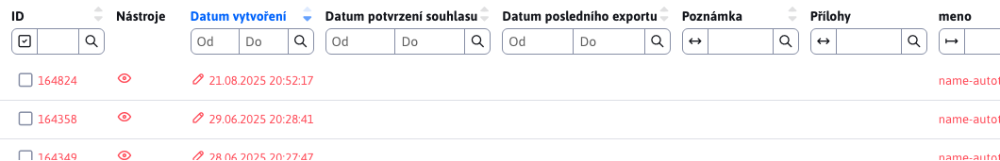

# Seznam změn verze 2024

## 2024.52

> Ve verzi 2024.52 Web stránky přidávají možnost nastavit **způsob uspořádání** a **vyhledávat ve stromové struktuře**, import ZIP umožňuje nastavit způsob porovnání stávající verze stránky. **Elektronický obchod** dostal nový design seznamu objednávek a produktů. Přidána **statistika anket**, lepší editor obrázků v průzkumníku a vylepšené vyhledávání v administraci. V **hromadných e-mailech** přibyla možnost **nastavit potvrzení odhlášení**. Galerie obsahuje nové pole pro **URL adresu zdroje obrázku**, které je vyplněno automaticky při použití fotobanky, **Značky** přidávají **jazykové mutace** a volitelná pole.

### Průlomové změny

- Aktualizováno Java a JavaScript knihovny na novější verze, zkontrolujte změny v sekci pro programátora níže. Můžete použít aktualizační skript `/admin/update/update-2023-18.jsp`.
- Zvýšené zabezpečení [veřejných REST služeb](custom-apps/spring/public-services.md), pokud je využíváte je třeba doplnit povolení. Zrušená REST služba `/admin/rest/property/set` (#57202).
- FontAwesome - upravené vkládání [FontAwesome ikon](frontend/webpages/fontawesome/README.md) v editoru (#57461).
- Elektronický obchod - metody v `DocDetails` pro získání ceny upravené z návratové hodnoty `double` na `BigDecimal`. Můžete použít skript `/admin/update/update-2023-18.jsp` pro základní aktualizaci vašich JSP souborů. V případě potřeby můžete dočasně použít metody `getPriceDouble/getVatDouble/getLocalPriceDouble/getLocalPriceDouble` (#56385).

### Web stránky

- Přidána možnost výběru způsobu a směru pro uspořádání [stromové struktury](redactor/webpages/README.md#nastavení-zobrazení-stromové-struktury) (#57257).


- Stromová struktura - doplnění možnosti [vyhledávání ve stromové struktuře](redactor/webpages/README.md#vyhledávání-ve-stromové-struktuře) složek web stránek do hloubky (#57265).


- Značky - přidána možnost [nastavení jazykových mutací](redactor/webpages/perexgroups.md#karta-překlady) názvu perex skupiny pro zobrazení názvu značky podle jazyka web stránky (#57273).


- FontAwesome - upravené vkládání [FontAwesome ikon](frontend/webpages/fontawesome/README.md) v editoru (#57461).
- Importování web stránek ze ZIP archivu - doplnění možnosti volby parametru [pro porovnání existence](redactor/webpages/import-export.md#importování-web-stránek-ze-zip-archivu) web stránky, upravený vizuál, doplněné možnosti o/od/značení všech stránek/souborů, otevření/zavření složek a doplněná informace o progrese importu. Porovnání podle volitelného pole umožňuje stránkám přes typ volitelného pole nastavit Unikátní identifikátor pro jednoznačnou identifikaci web stránky (#57441).


- Importování web stránek ze ZIP archivu - doplněné oddělení dat při `multi-domain`, kde data jiné domény se ignorují při hledání existující verze importovaných dat (#57493).
- Zlepšený přenos jména instalace ze šablony do `CombineTag`. Hodnota se uloží do `session` a použije iv získání souborů během provedení `combine` (#56325).
- Hledání JSP souboru šablony bere v úvahu jméno instalace nastavené v šabloně (#56325).
- Štítky - přidaná karta s [volitelnými poli](redactor/webpages/perexgroups.md#karta-volitelná-pole) pro možnost přidání vlastních dat ke značkám. Například nastavení barvy značky, jejího designu a podobně (#57449).
- Klonování struktury - během klonování je vypnuto synchronizování názvu webové stránky a složky, aby se zachovaly názvy podle původní složky. Konfigurační proměnná `syncGroupAndWebpageTitle` je nastavena na hodnotu `false` a po skončení klonování nastavena na původní hodnotu (#57489).
- Upravené číslování existuje-li web stránka se stejným názvem/URL adresou - nově vytvořená stránka začíná od čísla 2 namísto čísla 1, vznikají tak URL adresy typu `/en/page.html,/en/page-2.html,/en/page-3.html` místo `/en/page.html,/en/page-1.html,/en/page-2.html` kde `-1.html` nebylo významově optimální (#54273-50).
- Přidána možnost změnit chování posledního `/` při [generování URL adres stránek](frontend/setup/config.md). Standardně pro hlavní stránky složky URL adresa končí znakem `/`, tedy například `/en/products/`, po nastavení konfigurační proměnné `virtualPathLastSlash` na hodnotu `false` bude URL adresa generována bez posledního `/` tedy jak `/en/products` (#54273-50).

### Anketa

- Přidána [statistika odpovědí](redactor/apps/inquiry/inquiry-stat.md) ankety (#57337).


### Elektronický obchod

- [Seznam objednávek](redactor/apps/eshop/invoice/README.md) a [Seznam produktů](redactor/apps/eshop/product-list/README.md) upraven na nový design do datatabulek (#56325).


- Metody v `DocDetails` pro získání ceny upravené z návratové hodnoty `double` na `BigDecimal` (#56385).

### Galerie

- Výchozí typ vizuálního stylu galerie lze nastavit přes konf. proměnnou `galleryDefaultStyle`, výchozí `photoSwipe` (#56393-18).
- Přidána možnost výběru způsobu a směru pro uspořádání [stromové struktury](redactor/webpages/README.md#nastavení-zobrazení-stromové-struktury) (#57257).
- Přidáno pole URL adresa zdroje obrázku s možností zadat adresu, ze které jste obrázek získali. Pole se automaticky nastavuje při použití [fotobanky](redactor/webpages/working-in-editor/README.md#karta-fotobanka) v seznamu web stránek (#57313).
- Přidána možnost **vyhledávat ve stromové struktuře** podle názvu, podobně jako je tomu ve web stránkách (#57437).


### Hromadný e-mail
- Odesílání - při odesílání je ignorován SSL certifikát web stránky, jelikož často ve vnitřním prostředí je použit dočasný SSL certifikát (#57525).
- Odhlášení - vytvořena nová aplikace pro nastavení odhlášení. Přidána možnost zadat vlastní text před odhlášením a možnost zobrazení potvrzení namísto okamžitého odhlášení kliknutím na odkaz v e-mailu (#57525).
- Odhlášení - upravený formulář pro odhlášení z hromadného e-mailu - doplněna možnost zobrazit potvrzení odhlášení a možnost znovu vrátit email po odhlášení (#57525).


### Průzkumník

- Kompletní výměna editoru obrázků při akci [úprava souborů](redactor/files/fbrowser/file-edit/README.md) v části průzkumník za editor ve formě `DataTable` podle foto galerie (#57313).
- Zlepšené zobrazení na mobilních telefonech pro lepší použitelnost - upravená výška, velikosti (#55645).

### Jiné

- Převedené vyhledávání v administraci na datové tabulky (#57333).


- Přejmenovaná možnost Úprava buňky na Upravit v zobrazení mřížky podle názvosloví používaného v `Microsoft SharePoint`.
- Vyhledávání - upravený formulář vyhledávání na web stránce pro možnost definování zástupného textu (`placeholder`) namísto standardního Vyhledávání. Můžete tak zadat vlastní text, který se zobrazí ve formuláři. Hledat na webové stránce (#54273-53).

### Bezpečnost

- Upravený log při startu - citlivé informace jako hesla, token, certifikáty z konfiguračních proměnných jsou nahrazeny výrazem `********` (#MR643).
- [Pro veřejné REST služby](custom-apps/spring/public-services.md) přidána možnost nastavovat povolené IP adresy pro každou službu samostatně (#57202).
- Překladové klíče - přidána možnost filtrovat klíče v REST službě [/rest/properties/](custom-apps/spring/public-services.md) podle konf. proměnné `propertiesRestControllerAllowedKeysPrefixes`, aby nebylo možné veřejně získat všechny klíče z WebJET CMS (#57202).
- Do auditu přidána HTTP hlavička `Referer` (#57565).

### Oprava chyb

- Opraveno generování URL adresy pro AB Testování pokud původní URL adresa obsahuje znak `*` (#54273-50).
- Editor obrázků - opraveno přejmenování obrázku v editoru obrázků otevřeným z průzkumníka (#57269).
- Přesměrování domén - opravena možnost zadat protokol pro doménu přesměrování. Doplněna logika přesměrování na `https` verzi při zvolení možnosti `http` původního protokolu - předpokládá se přesměrování na `https` verzi (#56393-20).
- Web stránky - Page Builder - opraveno vkládání aplikací a bloků na správné místo kurzoru (#57613).
- Web stránky - Bloky - opraveno smazání prázdné mezery v prohlížeči Firefox při vkládání bloku (#57613).

### Dokumentace

- Vytvořená dokumentace pro [zlepšení výkonu serveru](sysadmin/performance/README.md) (#57357).
- Vytvořená dokumentace v PDF pro [redaktora](_media/manuals/webjetcms-redactor.pdf), [správce](_media/manuals/webjetcms-admin.pdf), [provoz](_media/manuals/webjetcms-sysadmin.pdf) a [instalaci](_media/manuals/webjetcms-install.pdf). Dokumentace v PDF je vygenerována automaticky z aktuální dokumentace ve formátu MarkDown a obsahuje také datum verze WebJET CMS (#57269).

### Pro programátora

- Změněno API pro datatabulku `table.ajax.url(newUrl); -> table.setAjaxUrl(newUrl);`, `table.ajax.url() -> table.getAjaxUrl()` (#57365).
- Aktualizován `Swagger-UI` na adrese `/admin/swagger-ui/` na verzi `org.webjars:swagger-ui:5.17.14` (#57365).
- Aktualizovaná knihovna `Bootstrap` z 4.6.1 na 5.3.3 a `jQuery` z 3.5.1 na 3.7.1 pro starou v8 administraci (#57365).
- Ve verzi 8 odstraněny knihovny `bootstrap-modal,bootstrap-switch,bootstrap-toastr,uniform,simple-line-icons` (#57365).
- Je třeba upravit přepínání karet ve vašich JSP souborech, vyhledejte `data-toggle="tab"` a nahraďte za `data-bs-toggle="tab"`, `LI` elementem nastavte `class="nav-item"` a prvnímu `A` elementu nastavte `class="active"`:

```html
<ul class="nav nav-tabs">
    <li class="nav-item">
        <a class="active" href="#tabMenu1" data-bs-toggle="tab">
            <iwcm:text key="components.filter"/>
        </a>
    </li>
    <li class="nav-item">
        <a href="#tabMenu2" data-bs-toggle="tab" onclick="loadComponentIframe();">
            <iwcm:text key="components.file_archiv.waiting_files"/>
        </a>
    </li>
</ul>
```
- Odstraněné metody `DocDB.searchTextAll,searchTextUrl`, použijte třídu `sk.iway.iwcm.search.SearchService` (#57333).
- Aplikace přes `!INCLUDE` lze vkládat iz složek `/apps` a `/templates` (#56325).
- [Volitelná pole](frontend/webpages/customfields/README.md#barva) - přidaný typ pole `color` pro výběr barvy (#57449).
- Pro [aplikaci v editoru](custom-apps/appstore/README.md#použití-anotace) je možné definovat více JSP souborů pro které se použije, například `@WebjetAppStore(...componentPath = "/components/search/search.jsp,/components/search/lucene_search.jsp")`. Při vložení nové aplikace se použije první JSP soubor v seznamu (#54273-53).


## 2024.40

> Ve verzi 2024.40 přináší **Průzkumník** nové funkce a vylepšení. Při přesunu souborů pomocí **drag\&drop se nyní zobrazí potvrzení**, což zamezí chybám při správě souborů. V editoru obrázků byla přidána možnost nastavení **velikosti a oříznutí podle šablon**, což usnadňuje úpravu obrázků přímo v rozhraní.
>
> Dalším vylepšením je přepracování nastavení více **aplikací do nového, přehlednějšího designu**. Autor stránky nyní dostává **notifikace při časovém publikování stránky**, jakož i při přidání **příspěvku do diskusního fóra**, což zlepšuje kontrolu nad obsahem. Nová aplikace pro rezervace podle času umožňuje jednoduché a přehledné **rezervování objektů, jako jsou tenisové kurty nebo zasedačky**. Tato aplikace také nabízí statistiky podle uživatelů a objektů, což usnadňuje správu rezervací.
>
> Vylepšili jsme také fungování nástroje PageBuilder a opravili chyby v publikování v Archivu souborů, čímž jsme zabezpečili lepší stabilitu a výkon při práci s obsahem.

### Průlomové změny

- AB Testování - zamezené volání URL adres B verze (obsahujících výraz `abtestvariant`) pokud není přihlášen administrátor. Povolit přímé volání takových URL lze nastavením konf. proměnné `ABTestingAllowVariantUrl` na hodnotu `true` (#56677).
- Databázové připojení - změněná knihovna pro management databázových spojení z `Apache DBCP` na [HikariCP](https://github.com/brettwooldridge/HikariCP) (#56821).
- Inicializace - upravená inicializace WebJETu použitím `Spring.onStartup` místo `InitServlet`. Zabezpečeno je správné pořadí načítání konfiguračních proměnných a jejich použití v `SpringBean` objektech (#56913).
- Kódování znaků - vzhledem ke změně v inicializaci je kódování znaků čteno z konf. proměnné `defaultEncoding` s výchozí hodnotou `utf-8`. Pokud historicky používáte kódování `windows-1250` je třeba hodnotu v konfiguraci upravit. Už se nepoužívá hodnota ve `web.xml` pro `SetCharacterEncodingFilter` ale hodnota v konfiguraci WebJETu. Filtr můžete z `web.xml` smazat. Zrušená podpora nastavení chybové zprávy při nefunkčním databázovém spojení nastavením parametru `dbErrorMessageText`, třeba je vytvořit soubor `/wjerrorpages/dberror.html` chcete-li zobrazit specifickou HTML stránku při chybě databázového spojení (#56913, #56393-12).
- Optimalizované získání přesměrování v `404.jsp`, ve vašich gradle projektech doporučujeme aktualizovat soubor `404.jsp` podle [basecms](https://github.com/webjetcms/basecms/blob/master/src/main/webapp/404.jsp) projektu (#53469).
- Archiv souborů - upravená výchozí hodnota konf. proměnné `fileArchivIndexOnlyMainFiles` na hodnotu `true`. Do vyhledávání/plno textového indexu se zapisují tedy jen hlavní soubory a ne archivní verze. Důvod je, že nechceme uživatele z vyhledávání standardně směřovat na starší (archivní) verze souborů (#57037).
- Archiv souborů - opravené uspořádání souborů v archivu podle času, přidána možnost uspořádání podle priority (tak se pořádalo při původní volbě podle času) (#57037).
- Zaheslovaná zóna - upravené přihlašování a funkce zapomenutého hesla, pokud máte vámi upravený soubor `/components/user/logon.jsp` nebo `/components/user/change_password.jsp` ověřte korektní chování a případně podle standardní verze upravte (#57185).

### Web stránky

- Klonování struktury - doplněná možnost [ponechat URL adresy při klonování](redactor/apps/clone-structure/README.md). Z URL adres se odstraní prefix podle zdrojové složky a doplní se prefix podle cílové. Pokud tedy klonujete například. novou jazykovou mutaci, přidá se jen např. `/en/` prefix, ale ostatní URL adresy zůstanou beze změny (#56673).


- Editor obrázků - doplněna možnost nastavit Bod zájmu na libovolný obrázek (#57037).
- Editor obrázků - upravené nastavení velikosti obrázku pro lepší použití funkce změny velikosti (je-li obrázek menší než aktuální okno bude se zmenšovat) (#56969).
- Audit - upravené zapisování auditního záznamu při uložení web stránky na standardní data tabulkový zápis se seznamem všech změněných vlastností (#57037).
- Porovnání stránek - opraveno zobrazení "Zobrazit pouze text stránky" při porovnání verzí stránky z historie (#57037).
- Obrázky - při změně obrázku, který má v názvu výraz `placeholder` nebo `stock` se v okně průzkumníka nezobrazí složka s tímto obrázkem, ale zobrazí se Média této stránky/Obrázky pro snadné nahrání nového obrázku namísto zástupného obrázku (#57037).
- Perex obrázek - upravené otevření okna tak, aby zobrazilo Média této stránky jako první a následně výběr všech médií (nezobrazí se seznam všech souborů a odkazů na web stránky) (#57037).
- Page Builder - opraveno nastavení složky podle titulku nové stránky při vkládání obrázku (#57037).
- Page Builder - opraveno duplikování bloku pro `accordion` - korektní nastavení ID editoru aby nedošlo k přepsání textu při uložení (#57037).
- Page Builder - opravené nastavení [šířky sloupců](frontend/page-builder/blocks.md#nastavení-šířky-sloupců) - v úvahu se bere šířka okna ne šířka elementu (#57037).
- Seznam promo aplikací při vkládání nové aplikace se nastavuje přes konf. proměnnou `appstorePromo`, lze tam kromě názvu složky zadat přímo i `itemKey` hodnotu, například. `cmp_news` pro podporu Spring aplikací. Výchozí hodnota je `cmp_news,menuGallery,menuBanner,cmp_video` (#57157).
- Export do HTML - vytvořena [dokumentace](redactor/webpages/export-to-html/README.md), testy, vypnuta kontrola SSL certifikátů pro možnost použití `SelfSigned` certifikátů během vývoje nebo testování (#57141).
- Publikování web stránky - přidáno auditování úspěšného časového publikování web stránky a přidána možnost [poslat notifikaci autorovi](redactor/webpages/editor.md#publikování-web-stránky) web stránky při úspěšném publikování (#57173).


- Značky - přidaná proměnná `perexGroupsRenderAsSelect` k určení od jakého [počtu značek](redactor/webpages/perexgroups.md) se začnou generovat jako vícenásobné výběrové pole, původně byla tato hodnota nastavena v kódu na 30 (#57185).
- Značky - i při vysokém počtu definovaných značek se v tabulce bude vždy filtrování zobrazovat jako textové pole (#57185).
- Volitelná pole - doplněno nastavení názvů sloupců [volitelných polí](frontend/webpages/customfields/README.md) v seznamu web stránek včetně prefixu textových klíčů (např. `temp-3.editor.field_a`) podle šablony složky (#57185).

### Aplikace

Předěláno nastavení vlastností aplikací v editoru ze starého kódu v `JSP` na `Spring` aplikace. Aplikace automaticky získávají i možnost nastavit [zobrazení na zařízeních](custom-apps/appstore/README.md#podmíněné-zobrazení-aplikace). Design je ve shodě se zbytkem WebJET CMS a datových tabulek.
- [Cookie lišta](redactor/apps/app-cookiebar/README.md)
- [Content Block](redactor/apps/content-block/README.md)
- [Disqus komentáře](redactor/apps/app-disqus/README.md)
- [Facebook Like tlačítko](redactor/apps/app-facebook_like/README.md)
- [Facebook Like Box](redactor/apps/app-facebook_like_box/README.md)
- [GDPR Cookies souhlas](redactor/apps/gdpr/README.md)
- [Google vyhledávání](redactor/apps/app-vyhladavanie/README.md)
- [Live chat (SmartsUpp)](redactor/apps/app-smartsupp/README.md)
- [Menu navigační](redactor/apps/menu/README.md)
- [Počasí](redactor/apps/app-weather/README.md)
- [Poslat stránku emailem](redactor/apps/send_link/README.md)
- [Statistika - mapa kliknutí](redactor/apps/stat/README.md)
- [Vložení dokumentu](redactor/apps/app-docsembed/README.md)
- [Vložení HTML kódu](redactor/apps/app-htmlembed/README.md)
- [Vyhledávání](redactor/apps/search/README.md)
- [Zobrazení souborů](redactor/apps/site-browser/README.md)


### Audit

- Zlepšený zápis změn v entitě, přidaná podpora polí, získání hodnoty pro datum (`Date` objekt nebo proměnná s `date` v názvu), přidána podpora značek (výpis názvu namísto ID) (#57037).
- Předělaná sekce **Úrovně logování** na sekce Audit->[Úrovně logování](sysadmin/audit/audit-log-levels.md) a Audit->[Log soubory](sysadmin/audit/audit-log-files.md) do nového designu (#56833).


- Upravená práva pro sekci Audit-Změněné stránky a Audit-Čeká na publikování aby se správně skrývaly v menu - vyžadují právo na audit i seznam web stránek (#57145).
- Upravena špatná role pro sekci Audit-Log soubory (#57145).
- Zlepšené auditování záznamů úloh na pozadí - doplněný seznam změn při úpravě/vytvoření úlohy, doplněné ID úlohy (#56845).
- [Notifikace](sysadmin/audit/audit-notifications.md) - upravené pole "Jen obsahuje-li text" na více řádkové pole pro možnost zaslání oznámení s kontrolou více řádkového výrazu (#57229).


### AB Testování

- Pro vyhledávací boty (např. Google) se vždy zobrazí A varianta, aby text stránek byl konzistentní. Bot se detekuje stejně jako pro statistiku podle `User-Agent` hlaviček nastavených v konf. proměnné `statDisableUserAgent` (#56677).
- Do Ninja třídy přidána [identifikace zobrazené varianty](frontend/ninja-starter-kit/ninja-bp/README.md) pomocí `data-ab-variant="${ninja.abVariant}` (#56677).
- Zamezené volání URL adres B verze (obsahujících výraz `abtestvariant`) pokud není přihlášen administrátor. Povolit přímé volání takových URL lze nastavením konf. proměnné `ABTestingAllowVariantUrl` na hodnotu `true` (#56677).

### Archiv souborů

- Upravené generování názvů souborů při aktualizaci tak, aby vždy byl zachován původní název souboru a starší verze se ukládaly jako `_v1,_v2` atd. (#57037).
- Opraveno publikování souboru nastaveného jako Nahrát soubor později (#57037).
- Opraveno vytvoření plně textového indexu pro vyhledávání v souborech (#57037).
- Upravená výchozí hodnota konf. proměnné `fileArchivIndexOnlyMainFiles` na hodnotu `true`. Do vyhledávání/plno textového indexu se zapisují tedy jen hlavní soubory a ne archivní verze. Důvod je, že nechceme uživatele z vyhledávání standardně směřovat na starší (archivní) verze souborů (#57037).
- Opraveno uspořádání souborů v archivu podle času, přidána možnost uspořádání podle priority (tak se pořádalo při původní volbě podle času) (#57037)
- Doplněno zobrazení poznámky a rozsahu platnosti dat i pro archivní verze souborů (#57037).


### Číselníky

- Upravená kontrola ID záznamu při importu dat číselníku - kontroluje se, zda se dané ID nenachází v jiném typu číselníku, pokud ano je nastavená hodnota `ID` na `-1` pro import nového záznamu. Chrání se tak přepsání dat v jiném než zvoleném číselníku ak náhodou existuje záznam se stejným ID (#57149).

### Diskuse

- Přidána možnost [Odeslat notifikaci autorovi stránky při přidání příspěvku do diskuse](redactor/apps/forum/README.md#karta---parametry-aplikace) při vkládání aplikace Diskuse do stránky. Nastavením konf. proměnné `forumAlwaysNotifyPageAuthor` na hodnotu `true` můžete notifikaci zapnout automaticky pro všechny diskuse/fóra (#57013).


### Formuláře

- Po odeslání formuláře přes AJAX publikovaná událost `WJ.formSubmit`, na kterou lze poslouchat při napojení na `DataLayer` Např. jako:

```javascript
    window.addEventListener("WJ.formSubmit", function(e) { console.log("DataLayer, submitEvent: ", e); dataLayer.push({"formSubmit": e.detail.formDiv, "formSuccess": e.detail.success}); });
```
- Pro formuláře, které [vyžadují potvrdit platnost email adresy](redactor/apps/form/README.md#nastavení-potvrzení-emailové-adresy) kliknutím na odkaz v emailu, upravené hlášení o úspěšnosti odeslání na text "Formulář byl odeslán, na váš email jsme odeslali zprávu, ve které je třeba potvrdit odeslání kliknutím na odkaz." aby návštěvník obdržel informaci o nutnosti potvrzení odeslání v email zprávě (#57125).
- Formuláře, které vyžadují potvrdit platnost email adresy kliknutím na odkaz v emailu a zatím nejsou potvrzeny se v seznamu formulářů zobrazují červeně (#57125).



### Galerie

- Upravené zobrazení obrázků v administraci tak, aby se nebral v úvahu nastavený bod zájmu, ale v seznamu obrázků byl zobrazen celý obrázek (#56969).
- Doplněna možnost nastavit [šablony pro změnu velikosti obrázku a oříznutí](redactor/image-editor/README.md) (#57201).
- Opraveno vkládání textu v samostatném editoru obrázků a překlad chybějícího textu (#57201).
- Přesunutá nástrojová lišta v editoru obrázků vlevo, aby se lépe využila plocha monitoru (#57201).


- Zvětšená velikost pole autor z 255 znaků na textové pole s rozsahem 64000 znaků (#57185).
- Upraveno formátování HTML kódu v polích Perex - vypnuto zalamování řádků/formátování kódu aby nedocházelo k doplnění mezer (#57185).
- Doplněno čištění HTML kódu od formátování při vložení textu přes schránku (#57185).

### Novinky

- Doplněna kontrola práv na složky - výběrové pole složky pro zobrazení novinek je filtrováno podle práv na složky webových stránek (#56661).

### Uživatelé

- Přidána možnost nastavit [skupině uživatelů](admin/users/user-groups.md) slevu z ceny v %, která se použije např. při vytvoření rezervace ale v budoucnu bude použita iv jiných aplikacích (#57049).
- Upravená logika při změně [zapomenutého hesla](redactor/admin/password-recovery/README.md). Pokud zadaný email patří více uživatelům, při změně hesla lze pomocí výběrového pole určit, kterému uživateli s daným emailem bude heslo změněno (#57185).


### Průzkumník

- Nová verze knihovny [elfinder](https://github.com/webjetcms/libs-elFinder/tree/feature/webjetcms-integration) pro [správu souborů](redactor/files/fbrowser/README.md). Upravený design dle vzhledu datatabulek pro krásnější integraci.


- Výchozí kódování souborů pro editor je nastaveno podle konf. proměnné `defaultEncoding`. Pro JSP soubory je kódování `utf-8/windows-1250` detekováno podle atributu `pageEncoding`, pokud soubor na začátku obsahuje výraz `#encoding=` použije se podle této hodnoty (#55849).
- Po nastavení konf. proměnné `iwfs_useVersioning` na `true` se začne zapisovat historie změn v souborech (každý soubor se po nahrání a před přepsáním archivuje do složky `/WEB-INF/libfilehistory`). Seznam je dostupný v průzkumníku v kontextovém menu Nastavení souboru s možností porovnání, zobrazení historické verze a vrácení změny (#57037).
- Opraveno přejmenování souborů ve složkách `/images,/files` tak, aby se automaticky odstranila diakritika (#57053).
- Indexování souborů - do Perex-Začátek publikování doplněno datum poslední změny souboru (#57177).
- Doplněna možnost [potvrzení přesunu souboru/složka](redactor/files/fbrowser/README.md#konfigurace). Potvrzování můžete vypnout nastavením konfigurační proměnné `elfinderMoveConfirm` na hodnotu `false` (#57297).


### Rezervace

- Přidána podpora pro automatické vypočítání ceny rezervace při jejím vytváření (#56841).
- Přidána nová MVC [Aplikace Rezervace času](redactor/apps/reservation/time-book-app/README.md), pro rezervaci zvolených objektů v hodinových intervalech (#56841).
- Přidána podpora pro získání slevy na [cenu rezervace](redactor/apps/reservation/reservations/README.md#základní) z ceny rezervace podle nastavené skupiny uživatelů (#57049).
- Přidána sekce [Statistika rezervací](redactor/apps/reservation/reservations-stat/README.md) pro časové i celodenní rezervace (#57049).


- Přidána možnost nastavit [skupině uživatelů](admin/users/user-groups.md) slevu z ceny v %, která se použije při vytvoření rezervace (#57049).
- Přidána [statistika rezervací](redactor/apps/reservation/reservations-stat/README.md) kde jsou vidět počty i ceny rezervací podle uživatelů (#57049).


### Bezpečnost

- Upravené dialogy pro hesla, jejich změnu a multi faktorovou autorizaci pro podporu hesel délky 64 znaků, doplněné testy změny hesla (#56657).
- Upravená logika pro [obnovení hesla](redactor/admin/password-recovery/README.md), kde použitý email pro obnovení patřil více účtům a přidána byla možnost výběru, kterému uživateli z nich se dané heslo změní (#57185).
- Uživatelé - při duplikování uživatele, pokud není zadané heslo je novému uživateli nastaveno náhodné heslo (#57185).

### Dokumentace

- Doplněna dokumentace k chybějícím aplikacím do sekce [Pro redaktora](redactor/README.md) (#56649).
- Doplněná dokumentace k aplikaci [skripty](redactor/apps/insert-script/README.md) (#56965).
- Doplněna anglická verze dokumentace (#56773).
- Doplněna dokumentace k [editoru obrázků](redactor/image-editor/README.md) (#56969).
- Doplněna dokumentace pro generování [náhledových obrázků](frontend/thumb-servlet/README.md) a nastavení [bodu zájmu](frontend/thumb-servlet/interest-point.md) (#56969).
- Vytvořená dokumentace pro [práci v editoru stránek](redactor/webpages/working-in-editor/README.md) (#56981).
- Doplněna dokumentace k [archivu souborů](redactor/files/file-archive/README.md) (#56891).
- Doplněna dokumentace k [před připraveným blokem](redactor/apps/htmlbox/README.md) (#56981).
- Přidána [česká verze](https://docs.webjetcms.sk/latest/cs/) dokumentace (#57033).
- Upravené generování odkazů na zdrojový kód tak, aby směřovaly na [GitHub verzi](https://github.com/webjetcms/webjetcms/tree/main/src) zdrojového kódu (#57033).
- Vytvořená dokumentace pro provoz - [Mazání dat](sysadmin/data-deleting/README.md), [Zálohování systému](sysadmin/files/backup/README.md) a [Restartovat](sysadmin/restart.md) (#57141).
- Vytvořená dokumentace pro správce - [Automatizované úkoly](admin/settings/cronjob/README.md) (#57141).
- Vytvořená dokumentace pro redaktora - [Poslat zprávu](redactor/admin/send-message.md), [Export do HTML](redactor/webpages/export-to-html/README.md), [Přesměrování](redactor/webpages/redirects/README.md) (#57141).
- Vytvořená dokumentace k použití funkce [zapomenuté heslo](redactor/admin/password-recovery/README.md) (#57185).
- Vytvořená dokumentace k nastavení [Spam ochrany](install/config/spam-protection.md) (#57185).

### Testování

- Vytvořený objekt `TempMail` pro jednodušší práci s email schránkou [tempmail.plus](https://tempmail.plus) pro testování odeslaných emailů (#56929).
- Všechny základní testy (používající `DataTables.baseTest`) doplněno o testování funkce Duplikovat (#56849).
- V automatických testech Data Tabulek přidány znaky s diakritikou pro testování ukládání a filtrování s ohledem na diakritiku (#56393-12).

### Systémové změny

- Inicializace - přidána možnost [inicializovat hodnoty](install/external-configuration.md) pro cluster (např. `clusterMyNodeName,clusterMyNodeType,useSMTPServer,pkeyGenOffset`) i nastavením environmentálních proměnných s prefixem `webjet_` nebo systémových s prefixem `webjet.` (#56877).
- Inicializace - upravená inicializace WebJETu použitím `Spring.onStartup` místo `InitServlet`. Zabezpečeno je správné pořadí načítání konfiguračních proměnných a jejich použití v `SpringBean` objektech (#56913).
- Kódování znaků - vzhledem ke změně v inicializaci je kódování znaků čteno z konf. proměnné `defaultEncoding` s výchozí hodnotou `utf-8`. Pokud historicky používáte kódování `windows-1250` je třeba hodnotu v konfiguraci upravit. Už se nepoužívá hodnota ve `web.xml` pro `SetCharacterEncodingFilter` ale hodnota v konfiguraci WebJETu. Filtr můžete z `web.xml` smazat. Zrušená podpora nastavení chybové zprávy při nefunkčním databázovém spojení nastavením parametru `dbErrorMessageText`, třeba je vytvořit soubor `/wjerrorpages/dberror.html` chcete-li zobrazit specifickou HTML stránku při chybě databázového spojení (#56913, #56393-12).
- Upraveno získání přesměrování z nové URL adresy (String) na přímé získání databázové entity. Přímo se tak získá i přesměrovací kód (301,302...) bez potřeby dodatečného databázového volání. Zvýší se tak výkon provedení stránky 404 (#53469).
- PostgreSQL - opraveno ukládání historie změn ve složce a mazání schvalování při smazání složky (#57061).
- Doplněná informace o blížícím se konci platnosti licence, zobrazí se 2 měsíce před jejím expirací na úvodní obrazovce (#57169).


- Upravené volání metod `before*/after*` v `DatatableRestControllerV2` tak, aby byly volány pro všechny `REST` služby a zároveň byly volány i při přetížení `insertItem,editItem,deleteItem` (#57186).
- Pro veřejné uzly clusteru, které nemají [povolen během monitorování](sysadmin/monitoring/README.md) zápis do tabulky `_conf_/webjet_conf` lze nastavit konf. proměnnou `monitoringEnableCountUsersOnAllNodes` na hodnotu `false`. To vypne zapisování počtu `sessions` na jednotlivých uzlech do konfigurace (#43144-3).
- Spam ochrana - při smazání všech cache objektů v sekci [Mazání dat](sysadmin/data-deleting/README.md) je smazán i obsah Spam ochrany. V případě potřeby tak snadno umíte resetovat spam ochranu (#57185).

### Pro programátora

- Datatabulky - přidána možnost nastavit tlačítka v okně editoru (standardně obsahuje tlačítko Vytvořit) i pro [vytvoření nového záznamu](developer/datatables-editor/README.md#speciální-tlačítka) nastavením `createButtons` (#55849).
- Dialogové okno - přidaná funkce `WJ.openIframeModalDatatable` pro otevření [modálního okna](developer/frameworks/webjetjs.md#iframe-dialog) obsahujícího editor datatabulky (editace záznamu). Automaticky nastaví možnosti pro uložení a zavření okna po uložení záznamu datatabulky (#55849).
- Zrušená podpora knihoven `Apache Commons DBCP, Commons Pool a Oracle UCP`. Databázová připojení jsou manažována pomocí [HikariCP](https://github.com/brettwooldridge/HikariCP). Zrušeno API `ConfigurableDataSource.printStackTraces` (#56821).
- Databázové připojení - doplněné auditování nezavřených databázových spojení (spojení, která jsou otevřena déle než 5 minut). Do auditu se zaznamenají jako typ `SQLERROR` s textem `Connection leak detection triggered` a výpisem zásobníku pro dohledání místa, kde se spojení nezavírá (#56821).
- Zrušená podpora knihoven `Apache Commons DBCP, Commons Pool, Oracle UCP`. Databázová připojení jsou manažována pomocí [HikariCP](https://github.com/brettwooldridge/HikariCP). Zrušeno API `ConfigurableDataSource.printStackTraces` (#56821).
- Databázové připojení - doplněné auditování nezavřených databázových spojení (spojení, která jsou otevřena déle než 5 minut). Do auditu se zaznamenají jako typ `SQLERROR` s textem `Connection leak detection triggered` a výpisem zásobníku pro dohledání místa, kde se spojení nezavírá (#56821).
- Anotace [@WebjetAppStore](custom-apps/appstore/README.md) umožňuje nastavit atribut `custom` pro určení zákaznické aplikace, která je v seznamu na začátku před standardními aplikacemi (#56841).
- Inicializace - upravená inicializace WebJETu použitím `Spring.onStartup` místo `InitServlet`. Zabezpečeno je správné pořadí načítání konfiguračních proměnných a jejich použití v `SpringBean` objektech (#56913).
- `SpringSecurity` - anotace `@EnableGlobalMethodSecurity(securedEnabled = true, prePostEnabled=true)` nahrazena `@EnableMethodSecurity(securedEnabled = true, prePostEnabled=true)` (#56913)
- Do `RequestBean` přidaná metoda `addAuditValue(String key, String value)` která umožňuje před zápisem do Auditu přidat dodatečné parametry, které se zaznamenají v auditu, například. `RequestBean.addAuditValue("historyId", String.valueOf(historyId));` (#57037).
- Do Datatabulky přidán [typ pole](developer/datatables-editor/standard-fields.md#boolean_text), `DataTableColumnType.BOOLEAN_TEXT` který zobrazí titulek napravo místo nalevo a možnosti Ano při zaškrtávacím poli (#57157).
- Do Datatabulky přidán [typ pole](developer/datatables-editor/standard-fields.md#color), `DataTableColumnType.COLOR` pro výběr barvy v `HEX` formátu např. `#FF0000` (#57157).
- Do Datatabulky přidán [typ pole](developer/datatables-editor/standard-fields.md#iframe), `DataTableColumnType.IFRAME` pro vložení jiné stránky přes `iframe` prvek (#57157).
- Do Datatabulky přidán [typ pole](developer/datatables-editor/standard-fields.md#base64), `DataTableColumnType.BASE64` pro kódování a dekódování hodnoty přes `base64` algoritmus (#57161).
- Do Datatabulky přidán [typ pole](developer/datatables-editor/standard-fields.md#static_text), `DataTableColumnType.STATIC_TEXT` pro zobrazení statického textu v pravé části okna editoru (#57161).
- Datatabulky - pro [typ pole](developer/datatables-editor/standard-fields.md#json), `JSON dt-tree-dir-simple` přidána možnost nastavení kořenové složky přes `@DataTableColumnEditorAttr(key = "data-dt-field-root", value = "/images/gallery")`. Pole nemá nastavený atribut `disabled`, hodnotu lze tedy zadat i přímo (#57157).
- Datatabulky - přidána možnost nastavení `editorLocking` pro vypnutí kontroly editace záznamu více uživateli (#57161).
- Pro Spring aplikace v editoru přidána možnost [inicializace dat](custom-apps/appstore/README.md#inicializace-dat) implementací metody `initAppEditor` a možnost [nastavení výběrových polí](custom-apps/appstore/README.md#nastavení-výběrových-polí) implementací metody `getAppOptions` (#57157).
- Amcharts - přidána podpora pro nový typ grafu [DoublePie](developer/frameworks/charts/frontend/statjs.md#graf-typu-double_pie) pro účely statistik (#57049).
- `Base64` - přidané funkce `WJ.base64encode(text),WJ.base64decode(encodedText)` pro kódování a dekódování textu algoritmem `base64` s podporou `utf-8` znaků (#57161).
- Doplněné metody `Adminlog.getChangelog(Long id, Object newObj, Object originalObj),Adminlog.getChangelogDelete(Long id, Object obj)` pro získání seznamu změn při vytvoření/úpravě/smazání jednoduchého Java objektu (ne JPA entity) (#56845).


## 2024.18

> Verze 2024.18 obsahuje **novou sadu ikon**, Formulář snadno doplněn o **pokročilá nastavení** (příjemci, přesměrování...), do nového designu jsou předělané aplikace AB Testování, Audit (čeká na publikování, změněné stránky), Blog, Dotazníky, Kalendář událostí (schvalování). Přidává **podporu instalace typu MultiWeb** (oddělení údajů domén) v Šablonách, Hromadném e-mailu a dalších aplikacích. Nová knihovna na **detekci prohlížečů**, v Statistika-Prohlížeče dojde k drobným rozdílům, ale údaje o prohlížeči anonymizovaně zaznamenáváme i bez Cookies souhlasu.

!>**Upozornění:** ke spuštění verze 2024 je třeba mít na serveru instalovanou Java verze 17.

### Průlomové změny

Tato verze přináší několik změn, které nemusí být zpětně kompatibilní:
- Hromadný email - upravená podpora odesílání emailů přes službu `Amazon SES` z použití speciálního API na [standardní SMTP protokol](install/config/README.md#nastavení-amazon-ses).
- [Odstraněné knihovny](install/versions.md#změny-při-přechodu-na-20240-snapshot), `bsf,c3p0,cryptix,datetime,jericho-html,jsass,opencloud,spring-messaging,uadetector,joda-time,aws-java-sdk-core,aws-java-sdk-ses,jackson-dataformat-cbor,jmespath-java` (#56265).
- Odstraněná značka `iwcm:forEach`, je třeba ji nahradit za `c:forEach`. Rozdíl je v tom, že Java objekt není přímo dostupný, je třeba jej získat pomocí `pageContext.getAttribute("name")`. Použijte volání `/admin/update/update-2023-18.jsp` pro aktualizaci vašich JSP souborů (#56265).
- Hromadný email - oddělené kampaně, příjemci a odhlášené emaily podle domén, starší záznamy jsou do domén zařazeny podle URL adresy web stránky pro odeslání. Výhoda v oddělení odhlášených emailů je v případě provozování více web sídel a rozdílných seznamů příjemců, kdy se odhlašuje odděleně pro jednotlivé domény. **Upozornění:** aktuálně odhlášené emaily se nastaví pro doménu s ID 1, pokud používáte primární hromadný email na jiné než první doméně aktualizujte sloupec `domain_id` v databázové tabulce `emails_unsubscribe` (#56425).
- Hromadný email - smazané nepoužívané metody z Java třídy `sk.iway.iwcm.dmail.EmailDB`, pokud je ve vašem projektu používáte přetáhněte si je z [původního zdrojového kódu](https://github.com/webjetcms/webjetcms/blob/ef495c96da14e09617b4dc642b173dd029856092/src/main/java/sk/iway/iwcm/dmail/EmailDB.java) do vaší vlastní třídy (#56425).
- Ikony - z důvodu přechodu na Open Source řešení jsme změnili sadu ikon z původní FontAwesome na novou sadu [Tabler Icons](https://tabler.io/icons). Pokud ve vašich vlastních aplikacích používáte ikony ze sady FontAwesome je třeba upravit kód a nahradit je ikonami ze sady `Tabler Icons`. Můžete použít skript `/admin/update/update-2023-18.jsp` pro úpravu nejčastěji používaných ikon v administraci (upraví pouze soubory, které vyžadují přihlášení).

### Přechod na Java 17

WebJET CMS verze 2024 přešel na Java verze 17. Obsahuje následující změny:
- Aktualizováno několik knihovn, například. `AspectJ 1.9.19, lombok 1.18.28`.
- Aktualizovaná knihovna Eclipselink na standardní verzi, použití WebJET CMS `PkeyGenerator` nastaveno pomocí třídy `JpaSessionCustomizer` a `WJGenSequence`.
- Aktualizován `gradle` na verzi 8.1.
- Odstraněná stará knihovna `ch.lambdaj`, použijte standardní Java Lambda výrazy (#54425).
- Odstraněná značka `<iwcm:forEach`, použití nahrazeno standardním `<c:forEach` (#56265).
- Pro zjednodušení aktualizace můžete použít skript `/admin/update/update-2023-18.jsp` pro kontrolu a opravu JSP souborů. Zákaznické Java třídy je třeba nově zkompilovat a opravit chyby z důvodu změny API.

### Nová sada ikon

Z důvodu přechodu na Open Source řešení jsme změnili sadu ikon z původní FontAwesome na novou sadu [Tabler Icons](https://tabler.io/icons). Některé ikony byly upraveny, aby lépe vystihovaly funkci tlačítka.


U datatabulek jsou ikony pro nastavení tabulky, znovu načtení údajů, import a export přesunuty napravo, aby lépe oddělily standardní funkce od nastavení a pokročilých operací. Na obrázcích je vidět srovnání nové (nahoře) a staré verze (dole).


### Vylepšení uživatelského rozhraní

- Menu - menu položky/ikony sekce (Přehled, Web stránky, Příspěvky...) se zobrazí pouze pokud má uživatel přístup k některé položce v dané sekci (#56169).
- Novinky - upravené přidání novinky - přepnutí na kartu Základní pro jednodušší nastavení titulku novinky a nastavení zařazení ve stromové struktuře dle zvolené sekce v hlavičce stránky (#56169).
- Úvod - sekce Přihlášení admini, Moje poslední stránky, Změněné stránky a Audit se zobrazují pouze pokud má uživatel potřebná práva (#56169).
- Úvod - doplněna informace o složce v seznamu posledních stránek, doplněna možnost otevřít auditní záznam (#56397).
- Web stránky - zlepšená editace na mobilních zařízeních - nástrojová lišta editoru je posouvatelná, dostupné jsou všechny ikony (#56249-5).
- Datatabulky - zlepšené uspořádání nástrojové lišty editoru při malých rozlišeních - ikony se korektně posunou na druhý řádek, možnost zadat ID zůstává vpravo nahoře (#56249-5)
- Datatabulky - ikona pro označení/odznačení všech záznamů mění stav podle toho, zda jsou označeny řádky, nebo ne (#56397).
- Datatabulky - zmenšené mezery mezi sloupci, snížená výška názvu stránky, nástrojové lišty a patičky pro zobrazení více sloutlců na obrazovce/zhuštění informací. Na stejné obrazovce by se měl v tabulce zobrazit minimálně jeden řádek navíc. (#56397).

### Web stránky

- Standardní [synchronizace titulku](redactor/webpages/group.md#synchronizace-názvu-složky-a-web-stránky) složky a hlavní webové stránky se nepoužije, pokud je jedna web stránka nastavena jako hlavní více složek, nebo když je hlavní stránka z jiné složky (#56477).

### MultiWeb

Přidána podpora [provozu v režimu MultiWeb](install/multiweb/README.md) - multi tenantní správa více samostatných domén v jednom WebJETu. Domény jsou navenek samostatné a každá se tváří jako samostatná instalace WebJET CMS.
- Seznam uživatelů - oddělený podle ID domény (#56421).
- Úvod - Online admini - oddělen podle domén (#56421).
- Práva na Doménové limity, HTTP záhlaví, Úrovně logování, Poslední logy, Skupiny uživatelů, Skupiny práv jsou dostupné pouze v první/správcovské doméně (#56421).
- Web stránky - přidána možnost vytvořit více kořenových složek (#56421).
- Statistika - Chybné stránky - přidaný sloupec `domain_id` do databáze pro oddělení vadných URL adres podle domén (#56421).
- Média - skupiny médií - seznam rozdělený podle aktuální zobrazení domény a práv stromové struktury web stránek (#56421).

### AB testování

- Seznam stránek v AB testu předělaný do [nového designu](redactor/apps/abtesting/abtesting.md), přidána sekce pro nastavení konfigurace AB testování (#56177).


### Audit

- Doplněna podpora filtrování uživatele i podle zadané email adresy.
- Předělaná sekce Audit->[Čeká na publikování](sysadmin/audit/audit-awaiting-publish-webpages.md) do nového designu. Přehledně zobrazuje seznam stránek, které budou v pozměněné v budoucnosti (#56165).
- Předělaná sekce Audit->[Změněné stránky](sysadmin/audit/audit-changed-webpages.md) do nového designu. Zobrazuje kompletní seznam změněných stránek za zvolené období (#56165).


### Blog

- Blog předělaný do nové administrace. Sekce seznam článků používá standardní možnosti jak jsou použity v seznamu web stránek/novinek (#56169, #56173).
- Původní seznam diskusních příspěvků je přesunut přímo do sekce Diskuse, uživatelé/blogeři získávají právo i na tuto část (#56169).
- Pro zobrazení seznamu článků je používána standardní aplikace pro novinky.
- Správa blogerů (administrace uživatelů) předělaná na datatabulku, umožňuje zjednodušeně vytvořit blogera a korektně mu nastavit práva.


### Dotazníky

Aplikace [dotazníky](redactor/apps/quiz/README.md) předělaná do nového designu. Umožňuje vytvořit dotazníky s vyhodnocením správné odpovědi. Dotazník může být s jednou správnou odpovědí nebo s bodovanými odpověďmi. Aplikace obsahuje také statistické vyhodnocení (#55949).


### Formulář snadno

- Přidaná karta rozšířena s pokročilými možnostmi nastavení zpracování formuláře podobně jako mají standardní HTML formuláře. Přidány možnosti nastavení příjemců, přesměrování, ID stránky s verzí do emailu atp. Upravený seznam položek formuláře pro lepší využití prostoru (#56481).


- Přidaný typ pole Formátované textové pole pro zadávání textů s formátováním jako je tučné písmo, odrážky, číslovaný seznam a podobně (#56481).


### GDPR Cookies

- Integrace s [Google Tag Manager](redactor/apps/gdpr/gtm.md) doplněna o nové typy souhlasů `ad_user_data` a `ad_personalization`, které jsou napojeny na souhlas s marketingovými cookies. Upraveno generování JSON objektu z hodnot `true/false` na správné hodnoty `granted/denied` (#56629).

### Hromadný e-mail
- Upravená podpora odesílání emailů přes službu `Amazon SES` z použití speciálního API na [standardní SMTP protokol](install/config/README.md#nastavení-amazon-ses) (#56265).
- Nastavení doménových limitů přidáno jako samostatné právo, ve výchozím nastavení je nepovoleno, je třeba jej přidat vhodným uživatelům (#56421).
- Oddělené kampaně, příjemci a odhlášené emaily podle domén, starší záznamy jsou do domén zařazeny podle URL adresy web stránky pro odeslání. Výhoda v oddělení odhlášených emailů je v případě provozování více web sídel a rozdílných seznamů příjemců, kdy se odhlašuje odděleně pro jednotlivé domény. **Upozornění:** aktuálně odhlášené emaily se nastaví pro doménu s ID 1, pokud používáte primární hromadný email na jiné než první doméně aktualizujte sloupec `domain_id` v databázové tabulce `emails_unsubscribe`, (#56425).
- Přidána možnost přímého [odhlášení se z hromadného emailu](redactor/apps/dmail/form/README.md#odhlášení) kliknutím na odkaz zobrazený v emailovém klientovi/Gmail nastavením hlavičky emailu `List-Unsubscribe` a `List-Unsubscribe=One-Click` (#56409).

### Kalendář událostí

- Neschválené a doporučené události - proces [schvalování nových událostí](redactor/apps/calendar/non-approved-events/README.md) a [doporučených událostí](redactor/apps/calendar/suggest-events/README.md) předěláno do nového designu (#56181).

### Novinky

- Přidána možnost Vyloučit hlavní stránky složek v [seznamu novinek](redactor/apps/news/README.md#nastavení-aplikace-ve-web-stránce) pro vyloučení hlavních stránek z pod složek v seznamu novinek. Předpokládá se, že podadresáře obsahují hlavní stránku se seznamem novinek v této složce, tyto stránky se vyloučí a nepoužijí se v seznamu novinek (#56169).

### Otázky a odpovědi

- Přidáno samostatné ukládání odpovědi do emailu i do databáze pro pozdější ověření odpovědi (#56533).
- Opraveno zobrazení sloupce Otázka již byla zodpovězena (#56533).
- Při zvolení možnosti Zobrazovat na web stránce se zkopíruje odpověď do emailu do odpovědi na web stránku (je-li již zadána) (#56533).

### Šablony

- Oddělený seznam šablon podle domén - zobrazují se pouze šablony, které nemají omezení zobrazení podle složek nebo obsahují omezení na složku aktuálně zobrazené domény (#56509).

### Statistika

- Upraveno získání čísla týdne podle ISO 8601, hodnoty ve statistikách podle týdne mohou být rozdílné vůči předchozí verzi (#56305).
- Chybné stránky - přidaný sloupec `domain_id` do databáze pro oddělení vadných URL adres podle domén. Historické údaje nejsou odděleny (zobrazí se ve všech doménách), ale od momentu aktualizace se budou zobrazovat již chybné URL oddělené podle domén (#56421).
- Upravena [detekce prohlížeče](redactor/apps/stat/README.md#prohlížeče) s využitím knihovny [UAP-java](https://github.com/ua-parser/uap-java). Některé údaje jsou detekovány jinak než původně - rozlišuje se Safari a Mobile Safari na iOS, operační systém pro Android telefony je namísto Unix nastaven na Android, pro některé případy je detekován Linux namísto Unix, macOS jako Mac OS X. Přidána podpora detekce Instagram a Facebook interního prohlížeče. Po aktualizaci na tuto verzi mohou tedy nastat rozdíly při zobrazení období před a po aktualizaci. Je možné aktualizovat soubor s definicí prohlížečů nastavením cesty k [YAML](https://github.com/ua-parser/uap-core/blob/master/regexes.yaml) souboru v konf. proměnné `uaParserYamlPath` (#56221).
- Typ prohlížeče a operační systém je zapsán do statistiky i bez souhlasu s ukládáním cookies, jelikož tento údaj cookies nepoužívá. Údaj je anonymizován a zapsán se zaokrouhleným časem na 15 minut (#56221).

### Bezpečnost

- 404 - přidána možnost vypnout ochranu volání 404 stránky (počet požadavků) podobně jako jiné spam ochrany nastavením IP adresy do konf. proměnné `spamProtectionDisabledIPs`. Pro danou IP adresu se vypnou i další SPAM ochrany (pro opakovaná volání).
- Přidána kontrola licencí použitých knihoven při `deployment` nové verze (#56265).
- Aktualizováno několik knihovn na novější verze, majoritní verze změněny pro `mariadb-java-client` ze 2 na 3, `pdfbox` ze 2 na 3 (#56265).

### Testování

- Přidali/upravili jsme automatizované testování front-end části (ne admin části) aplikací Mapa, `Carousel`, Archiv souborů, `Content Block`, Datum, Google Vyhledávání, Odkazy na sociální sítě, Doporučení, Poslat stránku emailem, Počasí, Příbuzné stránky, Působivá prezentace, `Slider`, `Slit Slider`, Video, `Carousel Slider`, Vložení HTML kódu, Vložení dokumentu, Vyhledávání, Podmíněné zobrazení, Bloky (#56413).
- Přidána podpor pro automatické otestování/kontrolu mezi-doménového oddělení záznamů do [DataTables.baseTest](developer/testing/datatable.md#možnosti-nastavení) (#56509).

### Pro programátora

- Hromadný email - smazané nepoužívané metody z Java třídy `sk.iway.iwcm.dmail.EmailDB`, pokud je ve vašem projektu používáte přetáhněte si je z [původního zdrojového kódu](https://github.com/webjetcms/webjetcms/blob/ef495c96da14e09617b4dc642b173dd029856092/src/main/java/sk/iway/iwcm/dmail/EmailDB.java) do vaší vlastní třídy (#56425).
- `MailHelper` - přidána možnost nastavit hlavičky emailu voláním `addHeader(String name, String value)`, API `SendMail` upraveno pro použití `MailHelper`, který doporučujeme primárně používat k odesílání emailů (#56409).
- Přidána možnost zobrazit ve vaší aplikaci seznam konf. proměnných podle [zadaného prefixu](./custom-apps/config/README.md), (#56177).
- Přidána možnost kontrolovat práva při vytvoření, editaci, mazání, provedení akce ale i při získání záznamu implementací metody `public boolean checkItemPerms(T entity, Long id)`, (#56421).
- Přidána třída `DatatableRestControllerAvailableGroups` pro snadnou implementaci kontroly práv uživatele i na základě práv na stromovou strukturu web stránek (#56421).

### Systémové změny

- WebJET CMS je dostupný přímo v [repozitáři maven central](https://repo1.maven.org/maven2/com/webjetcms/webjetcms/), GitHub projekty [basecms](https://github.com/webjetcms/basecms) a [democms](https://github.com/webjetcms/democms) upraveno pro použití přímo tohoto repozitáře. Sestavení je mírně odlišné od původního sestavení, knihovny `wj*.jar` jsou spojeny do `webjet-VERZIA-libs.jar`. Použitá knihovna [pd4ml](https://pd4ml.com/support-topics/maven/) je ve verzi 4, pro generování PDF souborů vyžaduje zadání licence do souboru `pd4ml.lic` v [pracovní složce](https://pd4ml.com/support-topics/pd4ml-v4-programmers-manual/) serveru nebo složky kde se nachází `pd4ml.jar`. Později bude doplněna možnost zadat licenční číslo přes konfigurační proměnnou (#43144).
- Zrušená podpora plně textového indexování `rar` archivů (#43144).
- NTLM - přidána konf. proměnná `ntlmLogonAction.charsetEncoding` s názvem kódování znaků pro LDAP přihlášení. Pokud je prázdné, nepoužije se a znaky se ponechají v kódování jak je vrátí LDAP server.
- PostgreSQL - přidaná podpora [databáze PostgreSQL](install/setup/README.md#vytvoření-db-schématu) (#56305).

Odstranili jsme několik nepoužívané knihovny, málo používané jsme nahradili alternativami:
- Odstraněná značka `<iwcm:forEach`, použití nahrazeno standardním `<c:forEach`. Změnu proveďte z `<iwcm:forEach items="${iii}" var="vvv" type="sk.iway.ttt">` na `<c:forEach items="${iii}" var="vvv"><%sk.iway.ttt vvv = (sk.iway.ttt)pageContext.getAttribute("vvv");%>`.
- Odstraněná JSP knihovna `datetime`, pokud používáte JSP značky `<datetime:xxx>` můžete si ji přidat do `build.gradle` jak `implementation("taglibs:datetime:1.0.1")`.
- Odstraněná knihovna `c3p0` a podpora použití tohoto databázového `pool`.
- Odstraněné staré JS funkce `saveEditor` a `historyPageClick` včetně staré REST služby `/admin/rest/document/`.
- Hromadný email - upravená podpora odesílání emailů přes službu `Amazon SES` z použití speciálního API/knihovny na [standardní SMTP protokol](install/config/README.md#nastavení-amazon-ses).

V případě potřeby některé z uvedených knihoven ve vašem projektu si ji přidejte do vašeho `build.gradle`:

```gradle
dependencies {
    implementation("com.amazonaws:aws-java-sdk-core:1.12.+")
    implementation("com.amazonaws:aws-java-sdk-ses:1.12.+")
    implementation("bsf:bsf:2.4.0")
    implementation("commons-validator:commons-validator:1.3.1")
    implementation("taglibs:datetime:1.0.1")
    implementation("net.htmlparser.jericho:jericho-html:3.1")
    implementation("joda-time:joda-time:2.10.13")
    implementation("io.bit3:jsass:5.1.1")
    implementation("org.jsoup:jsoup:1.15.3")
    implementation("org.mcavallo:opencloud:0.3")
    implementation("org.springframework:spring-messaging:${springVersion}")
    implementation("net.sf.uadetector:uadetector-core:0.9.22")
    implementation("net.sf.uadetector:uadetector-resources:2014.10")
    implementation("cryptix:cryptix:3.2.0")
    implementation("org.springframework:spring-messaging:${springVersion}")
    implementation("com.google.protobuf:protobuf-java:3.21.7")
    implementation("com.google.code.findbugs:jsr305:3.0.2")
    implementation("org.apache.taglibs:taglibs-standard-spec:1.2.5")
    implementation("org.apache.taglibs:taglibs-standard-impl:1.2.5")
    implementation('com.mchange:c3p0:0.9.5.5')
}
```

### Oprava chyb

2024.0.x

- Web stránky - opraveno nastavení pořadí uspořádání web stránek při použití `Drag&Drop` ve stromové struktuře (#57657-1).
- Web stránky - při duplikování web stránky/složka se nastaví hodnota `-1` do pole Pořadí uspořádání pro zařazení na konec seznamu. Hodnotu `-1` můžete také zadat ručně pro získání nové hodnoty pořadí uspořádání (#57657-1).
- Web stránky - import web stránek - opraveno nastavení média skupin při importu stránek obsahujících média. Při importu se automaticky vytvoří všechna Média skupiny (i nepoužívaná) z důvodu, že se při importu stránek překládá i média skupina nastavená pro média aplikaci `/components/media/media.jsp` ve stránce (ta může obsahovat i ID média skupiny mimo importované stránky) (#57657-1).

2024.0.52

- Web stránky - opraveno nastavení značek při nastavené konfigurační proměnné `perexGroupUseJoin=true` (#57453).
- Statistika - vadné stránky - zvětšený limit maximálního počtu záznamů z 1000 na hodnotu podle konfigurační proměnné `datatablesExportMaxRows`, výchozí `50000`. Tabulka upravená pro stránkování a vyhledávání na serveru (#57453).
- `Stripes` - opravené formátování data a času za použití `Tools.formatDate/Time` pro konzistentní formáty dat a času (#57405).
- Bezpečnost - opravena možnost přesměrovat na externí doménu při odhlášení uživatele (#57521).
- Bezpečnost - přidána možnost zakázat `basic` a `api-token` autorizaci [pro REST služby](sysadmin/pentests/README.md#konfigurace) nastavením konfigurační proměnné `springSecurityAllowedAuths` (#57521).
- Bezpečnost - přidána možnost chránit odhlášení uživatele [CSRF tokenem](custom-apps/spring/rest-url.md) nastavením konfigurační proměnné `logoffRequireCsrfToken` na hodnotu `true` (#57521).
- Bezpečnost - přidána možnost [vyžadovat CSRF token](custom-apps/spring/rest-url.md#csrf-token) pro zadané URL adresy nastavením konfigurační proměnné `csrfRequiredUrls` (#57521).
- Administrace - upravené zvýrazňování menu položek pro podporu `#hash-tag` v URL adrese pro aplikace v `Angular/Vue` v administraci (#57557)
- Vyhledávání - opraveno vyhledávání stránek z jiných než aktuální domény (#57573).
- Uživatelé - opravena možnost výběru doménové složky - složka s názvem domény není skutečná složka v databázi (#54273-54).
- Uživatelé - doplněné datum registrace a datum posledního přihlášení do exportu, pole se zobrazí (needitovatelně) iv editaci uživatele v kartě Základní (#56393-19).
- Uživatelé - opraveno zobrazení seznamu uživatelů pokud některý uživatel obsahuje schvalování smazané složky (#56393-21).
- Konfigurace - opravený import z XML pokud název proměnné obsahuje speciální znaky `[].` (#54273-54).
- Konfigurace - upravený import z Excelu - přidána možnost aktualizovat záznam podle jména, importovat pouze nové záznamy, zrušeny nepotřebné sloupce z exportu (#54273-54).
- Web stránky - při editaci odkazu, který obsahuje URL parametry typu `/odhlasenie-z-odberu-noviniek.html?email=!RECIPIENT_EMAIL!` jsou při úpravě odkazu, nebo jeho změně zachovány URL parametry. Můžete tak snadno změnit odkaz na jinou web stránku se zachováním potřebných parametrů (#57529).
- Bezpečnost - aktualizovaná knihovna `logback`.
- Úvod - opraveno čtení ilustračního obrázku z externí domény, upraveno načtení seznamu novinek WebJET na opožděné pro rychlejší zobrazení celé stránky.
- `Multi Domain` - upravené získání doménového jména, pokud v HTTP hlavičce obsahuje i port (někdy ho tam vkládá proxy server).
- Web stránky - opraveno vložení odkazu na stránku, která v URL adrese/parametru obsahuje znak `:` tak, aby i protokol zůstal zobrazen (#56393-19).

2024.0.47

- Datatabulky - opraveno zobrazené jméno sloupce při nastavení zobrazení sloupců pokud je upraveno jejich pořadí (#56393-14).
- Export do HTML - opravena kontrola práv, opraveno zobrazení generovaných souborů ve složce `/html` (#57141).
- Persistent cache objekty - opraveno uložení záznamu - nastavení správného typu (#56393-15).
- Úlohy na pozadí - opravený restart úloh na pozadí po smazání úlohy (#56393-14).
- Web stránky - opraveno uložení web stránek, jejichž název je jedno písmenový `N,B,S,P` (#56393-15).
- Web stránky - Page Builder - zlepšená klávesová zkratka `CTRL/CMD+S` pro uložení stránky bez zavření editoru, je aktivní i mimo zelené části s editorem.
- Zálohování systému - opravena kontrola práv (#57141).
- Značky - upravené zobrazení složek a jejich výběr tak, aby bylo možné volit značku ze všech domén (#56393-15).
- `DatatableRestControllerV2` přesunuté volání `afterDelete` mimo metodu `deleteItem` aby při přetížení této metody bylo `afterDelete` korektně zavolané.
- Formuláře - opraveno nastavení jazyka při přesměrování formuláře na stránku, která obsahuje `Spring` aplikaci (#56393-15).
- Web stránky - Editor - opraveno nastavení jazyka v náhledu vložené `Spring` aplikace (#56393-15).
- Audit - Notifikace - opraveno uložení nové notifikace při použití MicroSoft SQL databáze, doplněné smazání cache seznamu notifikací při úpravě záznamu (#57225).
- Galerie - opraveno zobrazení možnosti přidání složky, pokud má uživatel omezená práva na složky (#56393-17).
- Galerie - přidána možnost nastavení vodoznaku rekurzivně i na pod adresáře a pro generování obrázků po změně vodoznaku (#MR181).
- Galerie - vytvořená dokumentace pro [nastavení vodoznaku](redactor/apps/gallery/watermark.md) v galerii (#MR181).
- Galerie - opravena kontrola práv na přesun složky pomocí Drag\&Drop (#MR11).
- Galerie - opravena chyba zobrazení obrázků při přesunu složky pomocí Drag\&Drop (#MR11).
- Monitorování - doplněné monitorování `Spring` aplikací (#67357).
- Automatizované úlohy - opraveno stránkování a zobrazení více než 25 úloh (#56393-18).
- Aplikace - pro Spring aplikace používající výběr složky `dt-tree-dir-simple` přidána možnost přímo zadat hodnotu z klávesnice (#56393-18).
- Web stránky - opraveno vložení odkazu na stránku, která v URL adrese/parametru obsahuje znak `:` (#56393-18).
- Web stránky - opravené vkládání `FontAwesome` ikon. Pokud vaše šablona používá `FontAwesome` nastavte konfigurační proměnnou `editorEnableFontAwesome` na `true` pro zobrazení možnosti vkládat ikony v editoru (#56393-18).
- Formuláře - opravený regulární výraz pro kontrolu email adresy typu `email@domena,com` (#56393-18).
- Video - upravené nastavení `referrerpolicy` pro YouTube videa, která způsobovala, že některá videa nelze přehrávat (#56393-18).
- Aktualizováno Java knihovny, doplněno výjimky pro `DependencyCheck` (#56393-18).

2024.0.34

- Audit - opraveno zobrazení popisu auditu v prohlížeči Firefox.
- Bezpečnost - při chybě nahrávání souboru nebude zobrazena chyba ze serveru ale generická chybová zpráva (#56277-13).
- Číselníky - optimalizované načítání údajů, upravené nastavení rodiče číselníku na `autocomplete` pro optimálnější čtení dat (#57017).
- Datatabulky - opraveno vyhledávání podle ID záznamu - hledá se typ rovná se, ne obsahuje u tabulek bez serverového stránkování (#56993).
- Galerie - opravené vyhledávání - hledá se pouze v aktuálně zobrazené složce ne všech složkách (#56945).
- GDPR/Cookies - opraveno nastavení cookies v jedno doménovém WebJETu (duplikování nastavených cookies).
- Datatabulky - vypnuta možnost filtrování dle ID v tabulkách, kde ID není primární klíč, například. Konfigurace, Mazání dat, Překladové klíče (#56277-12).
- Formuláře - opravené zobrazení sloupce Datum potvrzení souhlasu u formulářů s nastaveným [potvrzením email adresy](redactor/apps/form/README.md#nastavení-potvrzení-emailové-adresy) (#56393-7).
- Formuláře - opraveno zobrazení textu "prázdné" v tabulce (#56277-10).
- Formuláře - upravený export čísel - čísla s desetinném místem odděleným znakem čárka jsou zkonvertovány na oddělovač tečka a na číselnou reprezentaci pro správný formát v Excelu. Nepoužije se na čísla začínající znakem + nebo 0 (#56277-10).
- Formuláře - opravený duplicitní export při přechodu mezi více formuláři bez obnovení stránky (#56277-10).
- Formuláře - při vypnuté spam ochraně `spamProtection=false` se již nebude kontrolovat CSRF token při odeslání formuláře (#56277-13).
- Galerie - opraveno smazání složky galerie vytvořené přes web stránku při vkládání obrázku (#56393-8).
- Galerie - opraveno nastavení parametrů složky galerie, pokud rodičovská složka nemá uložená nastavení (je bílá). Hledá se uložené nastavení složky směrem ke kořeni (#56393-10).
- Galerie/Editor obrázků - doplněna chybějící funkce pro změnu velikosti obrázku.
- Hromadný email - opravena chyba vložení příjemce ze skupiny uživatelů, který nemá povolené přihlášení (je deaktivován, nebo nemá platné data přihlášení od-do) (#56701).
- Klonování struktury - opraveno nastavení propojení složek při klonování (mohlo docházet k neúplnému klonování složek) (#56277-7).
- Mapa stránek - opraveno generování souboru `/sitemap.xml` podle nastavených atributů zobrazení web stránky v Mapě stránek (karta Navigace web stránky) (#56993).
- Překladové klíče - upravené zobrazení aby se zobrazil v tabulce případný HTML kód hodnoty klíče (#56993).
- Skripty, Bannerový systém, Skupiny práv - opravená funkce duplikovat záznam (#56849).
- Statistika - přidaná možnost [nastavit licenční číslo](install/config/README.md#licence) pro knihovnu amcharts k zobrazení grafů (#56277-7).
- Statistika - upravené zaznamenávání chybných URL adres - odstraněný identifikátor session `jsessionid`, který mohou přidávat do URL adresy některé roboty (#56277-11).
- Úlohy na pozadí - opravený restart úloh na pozadí po uložení úkolu.
- Úrovně logování - opraveno nastavení úrovní do `Logger` objektu (#56277-12).
- Video - přidána podpora vkládání odkazů na `YouTube Shorts` stránku (#56993).
- Web stránky - opraveno otevření složky zadáním jeho ID, pokud se složka nachází v jiné doméně (#56277-7).
- Web stránky - PageBuilder - opraveno vkládání odkazu (duplikování okna souborů), vkládání formulářových polí a upravený vizuál podle aktuální verze (#56277-9).
- Web stránky - v okně vložení obrázku přidána podpora zobrazení cesty ve stromové struktuře ke stávajícímu obrázku s prefixem `/thumb` (#56277-9).
- Web stránky - opraveno zobrazení překladových klíčů na základě prefixu ID šablony (#56393-7).
- Web stránky - opraveno smazání stránky, která má nastaveno i publikování do budoucna/notifikaci (a před smazáním byla zobrazena v editoru stránek) (#56393-8).
- Web stránky - Page Builder - opraveno vkládání video souborů (odkazů na YouTube video) (#56993).
- Web stránky - při vkládání odkazu na web stránku jsou filtrovány složky `images,files` s plně textovým indexem i když se nejedná o kořenovou složku (#56981).

2024.0.21

!>**Upozornění:** upravené čtení a ukládání hesel uživatelů, po nasazení ověřte práci s uživatelským účtem, zejména změnu hesla, zapomenuté heslo atp. Použijte skript `/admin/update/update-2023-18.jsp` pro základní úpravu souborů.
- Bezpečnost - opravena kontrola přístupu k souborům ve složce `/files/protected/` při použití externích souborů - nastavena konf. proměnná `cloudStaticFilesDir` (#56277-6).
- Bezpečnost - opravena kontrola typů souborů při nahrávání ve formulářích a použití `/XhrFileUpload` (#56633).
- Elektronický obchod - opravený import ceníku
- Hromadný email - vrácená třída `EMailAction` pro použití v úkolech na pozadí pro odesílání hromadného emailu.
- Instalace - upravená detekce `JarPackaging` při startu pokud neexistuje soubor `poolman.xml`.
- Klonování struktury - opraveno klonování v jedno doménové instalaci.
- Klonování struktury - při klonování složky doplněné kopírování všech atributů původní složky (html kód do hlavičky, jméno instalace, přístupová práva, zobrazení v mapě stránek a navigační liště) (#56633).
- Plně textové vyhledávání - doplněna kontrola nastavení zaškrtávacího pole Indexovat soubory pro vyhledávání v nastavení složky. Pokud pole není zaškrtnuté, soubory ve složce se nebudou indexovat. Původní verze kontrolovala pouze existenci složky `/files` v kartě System ve web stránkách (#56277-6).
- PostgreSQL - opravené chyby získání údajů z databáze (boolean hodnota) - Kalendář událostí, Rezervace, Nepoužívané soubory, Posílání zpráv, Seznam administrátorů (#56277-6).
- Uživatelé - opraveno uložení hesla bez šifrování při použití API `UsersDB.getUser/UsersDB.saveUser` při přechodu přes GUI. Předpokládalo se, že hesla budou při API volání předem zašifrována, což se neudálo. Kód doplněný o detekci `hash`, při čtení z databáze se hesla, `salt` a API klíč nečte a nastaví se hodnota "Heslo nezměněno". Při změně hesla dojde k odhlášení ostatních relací téhož uživatele. (#56277-6).
- Vyhledávání - vyloučeno indexování souborů ze složky začínající na `/files/protected/`, pro `Lucene` vyhledávání doplněna kontrola na tuto cestu, odkaz nebude do vyhledání zařazen (standardní databázové vyhledávání podmínku již obsahovalo) (#56277-6).
- Zrcadlení struktury/Klonování - doplněno kopírování volných polí složky (#56637).
- Web stránky - upravené načítání stránek z podadresářů - filtrován je seznam stránek plně textového vyhledávání, pokud se nachází v hlavní složce domény (#56277-6).

2024.0.17

- Bezpečnost - opraveny zranitelnosti z penetračních testů (#55193-5).
- Bezpečnost - upravené vkládání objektů pomocí zápisu `!REQUEST` tak, aby byly [filtrované speciální HTML znaky](frontend/thymeleaf/text-replaces.md#parametry-a-atributy) (#55193-6).
- Bezpečnost - třída `BrowserDetector` vrátí hodnoty s filtrovanými speciálními HTML znaky (#55193-6).
- Bezpečnost - opraveno generování QR kódu pro dvou faktorovou autorizaci, opraveno uložení autorizačního tokenu při vynucené dvou faktorové autorizaci po přihlášení (když je nastavena konf. proměnná `isGoogleAuthRequiredForAdmin` na hodnotu true) (#56593).
- Datatabulky - přidána možnost přeskočit chybné záznamy při importu z xlsx, chybové zprávy jsou kumulovány do jedné společné notifikace (#56465).
- Datatabulky - opraven import pouze nových záznamů (#56393-4).
- Formuláře - opraveno přepínání karet kliknutím na šipky na klávesnici při zadávání textu v kartách Rozšířená nastavení nebo Limity na soubory (#56393-3).
- Formuláře - doplněna možnost vytisknout formulář v seznamu formulářů (#56393-3).
- Formuláře - opraveno zobrazení náhledu formuláře odeslaného jako email bez formátování (#55193-6).
- HTTP hlavička `Strict-Transport-Security` je ve výchozím nastavení nastavena na hodnotu `max-age=31536000` (#55193-5).
- Hromadný email - opraveno získání web stránky z URL adresy (#56393-3).
- Hromadný email - opraveno nastavení příjemců pro nově vytvářený email (#56409).
- Hromadný email - přidána možnost manuálně zadat více příjemců emailu oddělených i znakem mezera (podporováno je oddělení znakem čárka, středník, mezera nebo nový řádek) a přeskočit vadné emaily (#56465).
- Hromadný email - při znovu uložení kampaně/spuštění a zastavení odesílání jsou z kampaně smazáni aktuálně odhlášení příjemci (aby nedošlo k opětovnému odeslání emailu po odhlášení), zlepšená kontrola duplicit při manuálním přidání a importu z xlsx (#56465).
- Hromadný email - upravená kontrola email adresy, povoleno i jedno písmenové domény a email adresy (#56465).
- Mazání dat - cache objekty - upravená dostupnost tlačítek smazat vše jen pro případ, kdy není označen ani jeden řádek.
- Média - výběr média skupiny, která má omezená práva.
- Notifikace - přidána možnost posouvání seznamu notifikací - pro případ zobrazení dlouhé notifikace, nebo velkého množství notifikací (#56465).
- PDF - opravené generování PDF souborů s vloženým obrázkem přes httpS protokol - knihovna `pd4ml` chybně detekuje verzi Javy z druhého čísla podle původního číslování `1.8`, přičemž aktuálně se používá `17.0`. Upraveno dočasnou změnou druhého čísla na hodnotu 8 (#56393-2).
- Uživatelé - zlepšený import uživatelů - automatické generování přihlašovacího jména, hesla a doplněné číslo řádku při chybném záznamu (#56465).
- Statistika - opravený jazyk a formát dat v grafech statistiky podle zvoleného jazyka přihlášení (#56381).
- Otázky a odpovědi - opraveno zobrazení sloupce Otázka již byla zodpovězena, při uložení odpovědi se zkopíruje odpověď do emailu do odpovědi na web stránku jako bylo ve verzi 8 (#56533).
- Vložení dokumentu - doplněno opakované získání náhledu dokumentu, pokud se ho nepodaří načíst na první pokus (#56393-3).
- Web stránky - zrušená klávesová zkratka `ctrl+shift+v` pro vložení jako čistý text, jelikož tuto možnost již standardně poskytuje přímo prohlížeč (#56393-3).

2024.0.9

- Datatabulky - opravený export dat ve statistice (při tabulce se `serverSide=false`) (#56277-3).
- Galerie - opraveno načtení seznamu fotografií při zobrazení galerie se zadané složky (např. ve webové stránce) (#56277-1).
- Uživatelé - zobrazení práv na webové stránky a složky upravené pro zobrazení každého záznamu na novém řádku pro lepší přehled (#56269).
- Uživatelé - upravený export a import pro podporu doménových jmen při nastavení práv na web stránky a složky (#56269).
- Web stránky - opraveno nastavení složky podle titulku stránky u ještě neuložené webové stránky a přetažení obrázku přímo do editoru (#56277-1)
- Web stránky - přidána možnost zadat do odkazu telefonní číslo ve formě `tel:0903xxxyyy` (#56277-4)
- SEO - oprava zaznamenání přístupu robota bez odsouhlaseného GDPR (statistika robota se zaznamená bez ohledu na souhlas) (#56277-5).

### Testování

- Datatabulky - základní test - u povinných polí, která mají předem nastavenou hodnotu se přeskočí test povinnosti pole (#56265).


## 2024.0

> Verze 2024.0 obsahuje novou verzi **aktualizace s popisem změn**, **klonování struktury** integrované s funkcí zrcadlení (včetně možnosti překladů), přidává možnost **obnovit** web stránku, nebo **celá složka z koše**, přidává **editor typu HTML** a možnost nastavení typu editoru přímo pro šablonu, **aplikacím** je možné **zapnout zobrazení pouze pro zvolené typy zařízení** mobil, tablet, PC a samozřejmě zlepšuje bezpečnost a komfort práce.

<div class="video-container">
  <iframe width="560" height="315" src="https://www.youtube.com/embed/YGvWne70czo" title="YouTube video player" frameborder="0" allow="accelerometer; autoplay; clipboard-write; encrypted-media; gyroscope; picture-in-picture" allowfullscreen></iframe>
</div>

Seznam změn je shodný s verzí [2023.53-java17](CHANGELOG-2023.md).
