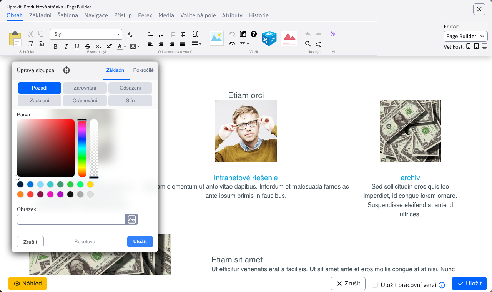
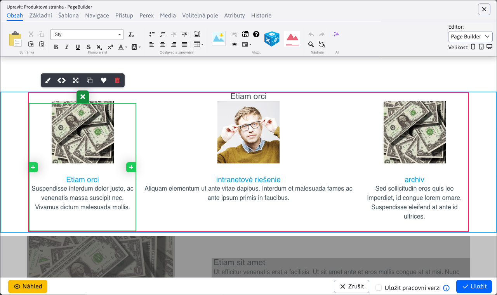
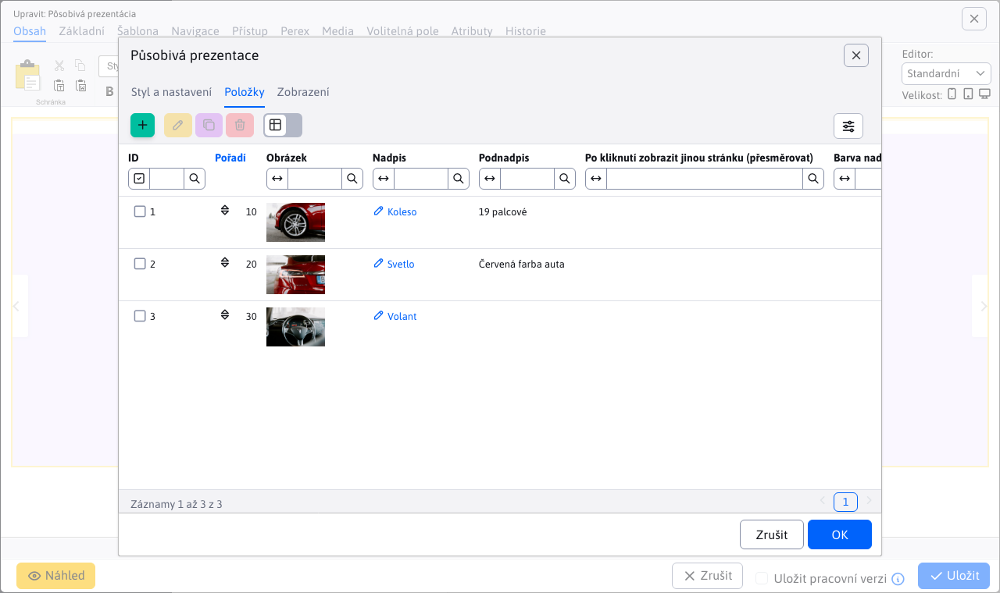

# Seznam změn verze 2025

## 2025.40

> **WebJET CMS 2025.40** přináší integrovaného **AI Asistenta**, který zásadně zjednodušuje práci s obsahem. Umožňuje automaticky **opravovat gramatiku**, **překládat** texty, navrhovat titulky, sumarizovat články a generovat **ilustrační obrázky** přímo v editoru. Díky tomu je tvorba obsahu **rychlejší, přesnější a kreativnější** než kdykoli předtím.
>
> Významné změny se týkají také **značek** a **šablon novinek**, které byly přepracovány do **samostatných databázových tabulek** s podporou oddělení podle domén. To přináší vyšší **přehlednost, jednodušší správu** a možnost efektivního přizpůsobení obsahu pro více webů. Uživatelské prostředí bylo **optimalizováno pro menší obrazovky** – systém automaticky přizpůsobí zobrazení oken a maximalizuje využitelný prostor.
>
> Na technické úrovni byl odstraněn zastaralý Struts Framework. Díky tomu je WebJET CMS výkonnější, stabilnější, **bezpečnější** a připraven k dalšímu rozvoji moderních webových řešení.

### Průlomové změny

- Odstraněn `Struts Framework`, je třeba provést aktualizaci `JSP` souborů, Java tříd a upravit soubor `web.xml`, více v [sekci pro programátora](#pro-programátora) (#57789).
- Pokud používáte aplikační server Tomcat ve verzi 9.0.104 a více je třeba [aktualizovat nastavení](install/versions.md#změny-při-přechodu-na-tomcat-90104) parametru `maxPartCount` na `<Connector` elemente (#54273-70).
- Značky - rozdělené podle domén - při startu se vytvoří kopie značek pro každou doménu (je-li používáno rozdělení údajů podle domén - nastavena konfigurační proměnná `enableStaticFilesExternalDir=true`). Aktualizují se ID značek pro web stránky a galerii. Je třeba manuálně zkontrolovat ID značek pro všechny aplikace novinky a jiné aplikace, které obsahují ID značky – aktualizace se je pokusí opravit, ale doporučujeme ID zkontrolovat. Více informací v sekci pro programátora. (#57837).
- Novinky - [šablony novinek](frontend/templates/news/README.md) předělané z definice přes překladové klíče na vlastní databázovou tabulku. Při startu WebJETu se zkonvertují záznamy z původního formátu. Jsou odděleny podle domén, pokud obsahují doménový alias vytvoří se pouze v příslušné doméně (#57937).
- Bezpečnost - přísnější kontrola URL adres administrace - je třeba, aby URL adresa v administraci měla na konci znak `/`, nesprávná adresa je `/admin/v9/webpages/web-pages-list` nebo `/apps/quiz/admin`, správná `/admin/v9/webpages/web-pages-list/` nebo `/apps/quiz/admin/`. Je třeba aby programátor zkontroloval definice URL adres v souborech `modinfo.properties` (#57793).

### AI Asistent

V dnešním světě je umělá inteligence všude kolem nás a samozřejmě WebJET jako moderní redakční systém nechce zůstat pozadu. Proto s hrdostí představujeme novou verzi WebJET CMS, kde jsme integrovali [pokročilé AI nástroje](redactor/ai/README.md).


Tyto funkce vám usnadní tvorbu a úpravu obsahu – od opravy gramatiky, přes překlady textů, návrhy titulků, až po generování ilustračních obrázků.

<div class="video-container">
  <iframe width="560" height="315" src="https://www.youtube.com/embed/LhXo7zx7bEc" title="YouTube video player" frameborder="0" allow="accelerometer; autoplay; clipboard-write; encrypted-media; gyroscope; picture-in-picture" allowfullscreen></iframe>
</div>

### Web stránky

- AB Testování - přidána možnost [zobrazovat AB verzi](redactor/apps/abtesting/README.md) podle stavu přihlášeného uživatele - nepřihlášenému uživateli se zobrazí A verze a přihlášenému B verze. Režim aktivujete nastavením konfigurační proměnné `ABTestingForLoggedUser` na hodnotu `true` (#57893).
- [Page Builder](redactor/webpages/pagebuilder.md) - upravený vizuál, aby lépe zapadal do aktuálního designu WebJET CMS (#57893).



- Povoleno zobrazení stránek obsahujících `404.html` v URL adrese ze systémových složek, aby vám taková technická stránka nepřekážela mezi standardními web stránkami (#57657-8).
- Značky - rozdělené zobrazení značek podle aktuálně zvolené domény, abyste mohli mít značky zvlášť pro každou doménu ve WebJETu (#57837).
- Klonování struktury - přidána informace o nakonfigurovaném překladači a kolik volných znaků k překladu zbývá (#57881).
- Zrcadlení struktury - přidána možnost vymazat `sync_id` hodnoty pro zvolenou složku (rekurzivní). Aby bylo snadno možné zrušit/resetovat zrcadlení stránek (#57881).


- Zrcadlení - přidání nové sekce [zrcadlení](redactor/webpages/mirroring/README.md) pro sledování a správu provázaných složek a stránek po akci zrcadlení (#57941).


- Při výběru obrázku nebo video souboru, v editoru stránek jsou v průzkumníku zobrazeny jen vhodné typy souborů, ostatní jsou filtrovány (#57921).

### Šablony

- Přidána nová sekce [Šablony novinek](frontend/templates/news/README.md) pro správu a správu šablon novinek (#57937).


### Uživatelské rozhraní

- Při použití malého monitoru (výška okna méně než 760 bodů) se zobrazí okno automaticky na celou plochu a zmenší se hlavička a patička (titulek okna je menším písmem). Zvýší se tak zobrazené množství informací, což je zapotřebí hlavně v sekci web stránky. Používá se u oken používajících CSS třídu `modal-xl`, což jsou aktuální web stránky, foto galerie, editor obrázků a uživatelé (#57893).



- V editoru přidána možnost kliknout na ikonu obrázku na začátku pole, pro jeho zobrazení v nové kartě.


### Aplikace

- Přidána možnost zobrazit aplikaci pouze přihlášenému/nepřihlášenému uživateli. Režim se nastavuje v kartě [Zobrazení nastavení aplikace](redactor/webpages/working-in-editor/README.md#karta-zobrazení) v editoru stránek (#57893).


Předěláno nastavení vlastností aplikací v editoru ze starého kódu v `JSP` na `Spring` aplikace. Aplikace automaticky získávají i možnost nastavit [zobrazení na zařízeních](custom-apps/appstore/README.md#podmíněné-zobrazení-aplikace). Design je ve shodě se zbytkem WebJET CMS a datových tabulek (#57409).
- [Carousel Slider](redactor/apps/carousel_slider/README.md)
- [Emotikony](redactor/apps/emoticon/README.md)
- [Fórum/Diskuse](redactor/apps/forum/README.md)
- [Otázky a odpovědi](redactor/apps/qa/README.md)
- [Uživatelé](redactor/apps/user/README.md)
- [Působivá prezentace](redactor/apps/app-impress_slideshow/README.md)
- [Restaurační menu](redactor/apps/restaurant-menu/README.md)
- [Slider](redactor/apps/slider/README.md)
- [Slit slider](redactor/apps/app-slit_slider/README.md)
- [Sociální ikony](redactor/apps/app-social_icon/README.md)
- [Video](redactor/apps/video/README.md)


### Menu

- Pokud [menu web stránky](redactor/apps/menu/README.md) nemá zadanou kořenovou složku (hodnota je nastavena na 0), automaticky se použije kořenová složka pro aktuálně zobrazenou web stránku. Je to výhodné pokud se zobrazuje menu ve více jazykových mutacích kde každá je kořenová složka - nemusíte mít menu/hlavičky pro každý jazyk samostatně, stačí jedna společná (#57893).

### Statistika

- V sekcí [návštěvnost](redactor/apps/stat/README.md#návštěvnost) přidán sumární počet Vidění, Návštěv a Počet různých uživatelů pro snadný přehled celkové návštěvnosti za zvolené období (#57929).


- V sekcí [vadné stránky](redactor/apps/stat/README.md#vadné-stránky) přidáno filtrování podle botů (aplikuje se pouze na nově zaznamenané údaje) a sumární počet v patičce. Je třeba upravit stránku `404.jsp` ve vašem projektu přidáním objektu `request` do volání `StatDB.addError(statPath, referer, request);` (#58053).


### Volitelná pole

- Přidána podpora pro nové typy [volitelných polí](frontend/webpages/customfields/README.md):
  - [Výběr složky webových stránek](frontend/webpages/customfields/README.md#výběr-složky-webových-stránek) (#57941).
  - [Výběr webové stránky](frontend/webpages/customfields/README.md#výběr-webové-stránky) (#57941).


Bezpečnost

### Opravena možná zranitelnost v Safari při speciální URL adrese směřující na archiv souborů v kombinaci s pěknou 404 stránkou (#57657-8).
- Jiné menší změny

### Audit změn - vyhledávání - pole Typ je uspořádáno podle abecedy (#58093).
- Elektronický obchod - přidána možnost nastavit&#x20;
- kořenová složka[ se seznamem produktů pomocí konfigurační proměnné ](redactor/apps/eshop/product-list/README.md), pokud nevyhovuje automatické hledání podle vložené aplikace seznam produktů (#58057).`basketAdminGroupIds`Elektronický obchod - aplikace pro nastavení platebních metod přesunuta ze složky&#x20;
- &#x20;do standardního `/apps/eshop/admin/payment-methods/` (#58057 `/apps/basket/admin/payment-methods/`Elektronický obchod - po smazání objednávky jsou smazány z databáze i její položky a platby (#58070).
- Monitorování serveru - aktuální hodnoty - přidaný typ databázového serveru (MariaDB, Microsoft SQL, Oracle, PostgreSQL) (#58101).
- Překladač - u překladače&#x20;
- &#x20;se zlepšilo zpracování vrácených chybových hlášek, pro přesnější identifikování problému (#57881 `DeepL`Překladač - přidána podpora pro implementaci více překladačů a jejich automatické zpracování/využití (#57881).
- Překladač - přidáno automatické&#x20;
- auditování počtu spotřebovaných znaků[ při každém překladu. Do audit záznamu typu ](admin/setup/translation.md) se do sloupce `TRANSLATION` zapíše spotřebované množství kreditů při překladu. Audituje se i počet dostupných znaků, výsledek je uložen do cache a aktualizuje se znovu nejdříve o 5 minut (#57965).`EntityID`Průzkumník - optimalizované načítání, opraveno duplicitní čtení knihovny&#x20;
- &#x20;(#57997).`jQuery UI`Oprava chyb

### Datové tabulky - opraveno nastavení možností do výběrového menu externího filtru (#57657-8).
- Klonování struktury - opravena validace zadaných id složek a přidán výpis chybové zprávy (#57941).
- Galerie - přidána podpora pro výběr složky galerie, v aplikaci Galerie ve web stránce, při použití doménových aliasů a editace záznamu v galerii s doménovým aliasem (#57657-11).
- Webové stránky - opraveno zobrazení seznamu stránek při zobrazení složek jako tabulky (#57657-12).
- Grafy - opraveno zobrazení velkého množství legend v grafech, automaticky se využije posouvání v legendách (#58093).
- Dokumentace

### Doplněna dokumentace pro nastavení a používání&#x20;

- dvoustupňového ověřování/autorizace[ (#57889).](redactor/admin/logon.md#dvojstupňové-overovanie) Pro programátora

### Zrušená třída&#x20;

- , která se používala v importech z `ImportXLSForm` formátu v `XLS` spec/import\_xls.jsp[. Technicky třída není nutná, stačí smazat referenci v JSP a upravit formulář na standardní HTML formulář (#57789).](../../src/main/webapp/admin/spec/import_xls.jsp) Zlepšený aktualizační skript&#x20;
- &#x20;pro Archiv souborů - umí aktualizovat standardní změny a doplnit potřebné změny do vaší verze `/admin/update/update-2023-18.jsp` a pomocných tříd (#57789).`FileArchivatorBean`Třída&#x20;
- &#x20;nahrazena objektem `org.apache.struts.action.ActionMessage`, třída `String` nahrazena `ActionMessages` (#57789).`List<String>`Zrušený framework&#x20;
- , tagy `Struts` nahrazeno za odpovídající `<logic:present/iterate/...`, pozor `<iwcm:present/iterate/...` za `<bean:write`.`<iwcm:beanWrite`V Java kódu jsou z důvodu odstranění&#x20;
- &#x20;následující změny:`Struts` nahrazen za&#x20;
  - `ActionMessage` nahrazen za `String`
  - `ActionMessages` vrátí `List<String>`
  - `BasicLdapLogon.logon` místo `List<String>` nahrazen `ActionMessages`
  - `org.apache.struts.util.ResponseUtils.filter` Amcharts - přidána podpora pro zadání funkce pro transformaci textu ve štítcích kategorií u grafu typu `sk.iway.iwcm.tags.support.ResponseUtils.filter`
- &#x20;(#58093).`PIE`Amcharts - přidána podpora pro zadání funkce pro transformaci textu v legendě grafu typu&#x20;
- &#x20;(#58093).`LINE`Amcharts - přidána možnost skrýt tooltip když hodnota je&#x20;
- &#x20;nebo `null` v grafu typu `0` (#58093).`LINE`Pro konverzi JSP i Java souborů můžete použít skript&#x20;

. Zadáte-li jako cestu hodnotu `/admin/update/update-2023-18.jsp` provede se nahrazení iv `java` souborech. Problémem je spuštění projektu, pokud obsahuje chyby. Můžete ale složku `../java/*.java` přejmenovat na `src/main/java` aby šel spustit čistý WebJET. Následně můžete použít aktualizační skript. Ten prohledává a aktualizuje složku `src/main/java-update` i `../java/*.java`.`../java-update/*.java`V souboru&#x20;

&#x20;již není nutná inicializace `WEB-INF/web.xml`, smažte celou `Apache Struts` sekci obsahující `<servlet>` a `<servlet-class>org.apache.struts.action.ActionServlet</servlet-class>` obsahující `<servlet-mapping>`.`<servlet-name>action</servlet-name>`Rozdělené značky podle domén (je-li nastavena konfigurační proměnná&#x20;
- ), aby bylo možné jednoduše mít samostatné značky pro každou doménu. Při spuštění WebJET nakopíruje stávající značky pro všechny definované domény. Přeskočí značky, které mají nastavené zobrazení pouze ve specifické složce, kde podle první složky nastaví doménu pro značku. Aktualizuje značky pro Novinky, tedy pro aplikaci `enableStaticFilesExternalDir=true` kde vyhledá výraz `/components/news/news-velocity.jsp` a `perexGroup` u kterých se pokusí ID značek aktualizovat podle domény dané web stránky. Informace se zapíše do historie a v Auditu vznikne záznam s podrobností jak se `perexGroupNot` nahradil, příklad:`INCLUDE`Pro první&#x20;

```txt
UPDATE:
id: 76897

news-velocity.jsp - update perexGroups+perexGroupsNot for domainId, old code::
INCLUDE(/components/news/news-velocity.jsp, groupIds="24", alsoSubGroups="false", publishType="new", order="date", ascending="false", paging="false", pageSize="1", offset="0", perexNotRequired="false", loadData="false", checkDuplicity="true", contextClasses="", cacheMinutes="0", template="news.template.dlazdica-3", perexGroup="625", perexGroupNot="626")
new code:
INCLUDE(/components/news/news-velocity.jsp, groupIds="24", alsoSubGroups="false", publishType="new", order="date", ascending="false", paging="false", pageSize="1", offset="0", perexNotRequired="false", loadData="false", checkDuplicity="true", contextClasses="", cacheMinutes="0", template="news.template.dlazdica-3", perexGroup="", perexGroupNot="")

INCLUDE(/components/news/news-velocity.jsp, groupIds="24", alsoSubGroups="false", publishType="new", order="date", ascending="false", paging="false", pageSize="1", offset="0", perexNotRequired="false", loadData="false", checkDuplicity="true", contextClasses="", cacheMinutes="0", template="news.template.dlazdica-3", perexGroup="3+645", perexGroupNot="794")
new code:
INCLUDE(/components/news/news-velocity.jsp, groupIds="24", alsoSubGroups="false", publishType="new", order="date", ascending="false", paging="false", pageSize="1", offset="0", perexNotRequired="false", loadData="false", checkDuplicity="true", contextClasses="", cacheMinutes="0", template="news.template.dlazdica-3", perexGroup="1438+1439", perexGroupNot="1440")
```

&#x20;byly odstraněny značky s ID 625 a 626, protože ty se nezobrazují v dané složce/doméně - měly nastavené zobrazení pouze pro určitou složku. Ve druhém `INCLUDE` byly změněny značky `INCLUDE` na nově vzniklé `3+645` a `1438+1439` za `794`.`1440`| perex\_group\_id | perex\_group\_name | domain\_id | available\_groups |
| -------------- | -------------------- | --------- | ---------------- |
| 3 | další perex skupina | 1 | NULL |
| 645 | deletedPerexGroup | 1 | NULL |
| 794 | kalendář-událostí | 1 | NULL |
| 1438 | další perex skupina | 83 | NULL |
| 1439 | deletedPerexGroup | 83 | NULL |
| 1440 | kalendář-událostí | 83 | NULL |

Před spuštěním aktualizace existovaly v databázi pouze záznamy&#x20;

, kterým se nastavilo `3, 645 a 794`. Záznamy `domain_id=1` vznikly při aktualizaci pro `1438, 1439 a 1440`.`domain_id=83`Datové tabulky - přidána podpora pro úpravu&#x20;
- lokálních JSON dat[ (#57409).](developer/datatables-editor/field-datatable.md#lokálne-json-dáta) Datové tabulky - přidané rozšíření&#x20;
- Row Reorder[ pro možnost uspořádání seznamu pomocí funkce ](https://datatables.net/extensions/rowreorder/) (#57409).`Drag&Drop`Datatabulky - Přidána možnost nastavení&#x20;
- Patičky pro součet hodnot[ (#57929).](developer/datatables/README.md#pätička-pre-súčet-hodnôt) Aplikace - doplněna možnost použít lokální JSON data pro nastavení položek aplikace, například položek pro&#x20;
- působivou prezentaci[ (#57409).](redactor/apps/app-impress_slideshow/README.md) 2025.18



## Verze&#x20;

> 2025.1&#x38;**&#x20;přináší kompletně předělaný modul&#x20;**&#x45;lektronického obchod&#x75;**&#x20;s podporou&#x20;**&#x70;latební brány GoPa&#x79;**&#x20;a vylepšeným seznamem objednávek. Aplikace&#x20;**&#x4B;alendář novine&#x6B;**&#x20;byla oddělena jako&#x20;**&#x73;amostatná aplikac&#x65;**&#x20;a zároveň jsme předělali nastavení více aplikací v editoru stránek do nového designu.&#x20;**&#x4D;anažer dokument&#x16F;**&#x20;(původně Archiv souborů) prošel&#x20;**&#x76;izuálním i funkčním restarte&#x6D;**&#x20;včetně nových nástrojů pro správu, export a import dokumentů.**&#x56;ylepšen byl i systém&#x20;
>
> Hromadného e-mail&#x75;**&#x20;s novými možnostmi pro odesílatele a pohodlnějším výběrem příjemců.&#x20;**&#x52;ezervac&#x65;**&#x20;získali nové možnosti jako**nadměrné rezervac&#x65;**, vytváření rezervací zpětně do minulosti a zasílání notifikací na specifické emaily pro každý rezervační objekt.**&#x4F;ptimalizovali jsme počet souborů v&#x20;
>
> Průzkumník&#x75;**, což vede k&#x20;**&#x72;ychlejšímu načítán&#xED;**&#x20;a přidali nové informace do&#x20;**&#x4D;onitorování server&#x75;**.**&#x50;růlomové změny

### Aplikace Kalendář novinek oddělena do samostatné aplikace, pokud kalendář novinek používáte je třeba upravit cestu&#x20;

- &#x20;na `/components/calendar/news_calendar.jsp` (#57409 `/components/news-calendar/news_calendar.jsp`Upravená inicializace Spring a JPA, více informací v sekci pro programátora (#43144).
- Předělaná backend část aplikace elektronický obchod, více v sekci pro programátora (#57685).
- Datové tabulky

### Při nastavení filtru číselné hodnoty od-do se pole zvětší pro lepší zobrazení zadané hodnoty podobně jako to dělá datové pole (#57685).
- Aplikace Archiv souborů byla předělána na Spring aplikaci. Bližší informace naleznete v sekci pro programátora (#57317).
- Aplikace Elektronický obchod byla na&#x20;
- &#x20;části předělaná. Bližší informace naleznete v sekci pro programátora (#56609 `BE`Manažer dokumentů (Archiv souborů)

### Seznam souborů

- **&#x20;předělaný do nového designu s přidáním nové logiky oproti staré verzi. Více se dočtete v části&#x20;** &#x41;rchiv souborů[ (#57317).](redactor/files/file-archive/README.md) Manažer kategorií


- **&#x20;opraven a předělán do nového designu. Více se dočtete v části&#x20;** &#x4D;anažer kategorií[ (#57317).](redactor/files/file-archive/category-manager.md) Manažer produktů
- **&#x20;byl přidán jako nová sekce. Více se dočtete v části** Manažer produktů[ (#57317).](redactor/files/file-archive/product-manager.md) Export hlavních souborů
- **&#x20;byl upraven tak, aby nabízel širší možnosti exportu souborů a zlepšil přehlednost výpisů. Více se dočtete v části&#x20;** &#x45;xport hlavních souborů[ (#57317).](redactor/files/file-archive/export-files.md) Import hlavních souborů


- **&#x20;byl opraven a upraven, aby dokázal pracovat s rozšířenými možnostmi exportu. Více se dočtete v části&#x20;** &#x49;mport hlavních souborů[ (#57317).](redactor/files/file-archive/import-files.md) Indexování
- **&#x20;dokumentů ve vyhledávačích typu&#x20;** &#x20;upraveno tak, aby se neindexovaly staré/historické verze dokumentů a dokumenty mimo datum platnosti (nastavená HTTP hlavička `Google`). Indexování těchto dokumentů lze povolit v editoru v manažerovi dokumentů (#57805).`X-Robots-Tag=noindex, nofollow`Aplikace

### Předěláno nastavení vlastností aplikací v editoru ze starého kódu v&#x20;

&#x20;na `JSP` aplikace. Aplikace automaticky získávají i možnost nastavit `Spring` zobrazení na zařízeních[. Design je ve shodě se zbytkem WebJET CMS a datových tabulek (#57409).](custom-apps/appstore/README.md#podmienené-zobrazenie-aplikácie) Anketa
- [Bannerový systém](redactor/apps/inquiry/README.md)
- [Datum a čas, Datum a svátek](redactor/apps/banner/README.md)
- [ - sloučeno do jedné společné aplikace](redactor/apps/app-date/README.md) Dotazníky
- [Hromadný e-mail](redactor/apps/quiz/README.md)
- [Kalendář událostí](redactor/apps/dmail/form/README.md)
- [Kalendář novinek](redactor/apps/calendar/README.md)
- [Mapa stránek](redactor/apps/news-calendar/README.md)
- [Média](redactor/apps/sitemap/README.md)
- [Příbuzné stránky](redactor/webpages/media.md)
- [Rating](redactor/apps/related-pages/README.md)
- [Rezervace](redactor/apps/rating/README.md)
- [Zrychlené načtení dat aplikace v editoru - data jsou vložena přímo ze serveru, není třeba provést volání REST služby (#57673).](redactor/apps/reservation/reservation-app/README.md)


- Upravený vizuál - název aplikace při vkládání do stránky přesunut do hlavního okna (namísto původního nadpisu Aplikace) pro zvětšení velikosti plochy pro nastavení aplikaci (#57673).
- Doplněny fotky obrazovky aplikací v české jazykové mutaci pro většinu aplikací (#57785).


- Hromadný e-mail

### Přesunuté pole Web stránka

- **&#x20;– nyní se nachází před polem&#x20;** &#x50;ředmě&#x74;**, aby se po výběru stránky předmět automaticky vyplnil podle názvu zvolené web stránky (#57541).**&#xDA;prava pořadí v kartě Skupiny
- **&#x20;– e-mailové skupiny jsou nyní zobrazeny před skupinami uživatelů (#57541).** &#x4E;ové možnosti pro jméno a e-mail odesílatele
- **&#x20;– jsou-li konfigurační proměnné&#x20;** &#x20;a `dmailDefaultSenderName` nastaveno, použijí se tyto hodnoty. Pokud jsou prázdné, systém automaticky vyplní jméno a e-mail aktuálně přihlášeného uživatele. (#57541)`dmailDefaultSenderEmail`Pomocí těchto proměnných lze nastavit&#x20;
  - fixní hodnot&#x79;**&#x20;(např. název společnosti) pro všechny&#x20;**&#x6B;ampaně[, bez ohledu na to, kdo je přihlášen.](redactor/apps/dmail/campaings/README.md) Hromadný email - optimalizace tvorby seznamu příjemců - karta&#x20;


- skupiny[ přesunuta do dialogového okna. Po zvolení skupiny příjemců je ihned vidíte v kartě Příjemci a umíte je snadno upravovat, již není potřeba email nejprve uložit pro zobrazení příjemců (#57537).](redactor/apps/dmail/campaings/README.md#pridanie-zo-skupiny) Odhlášení - při přímém zadání emailu na odhlášení (ne kliknutí na odkaz v emailu) je zaslán na zadanou email adresu potvrzující email. V něm je třeba kliknout na odkaz pro odhlášení. Původní verze nekontrolovala žádným způsobem platnost/vlastnictví email adresy a bylo možné odhlásit i cizí email (#57665).


- Kalendář novinek

### Kalendář novinek oddělen jako samostatná aplikace, původně to byla možnost v aplikaci Kalendář (#57409).

- Zobrazuje kalendář napojený na seznam novinek s možností filtrovat novinky podle zvoleného data v kalendáři.
- Monitorování serveru


### Doplněna tabulka s informací o databázových spojeních a obsazené paměti (#54273-61).
- Doplněna informace o verzi knihoven
- &#x20;do sekce Monitorování serveru-Aktuální hodnoty (#57793).`Spring (Core, Data, Security)`Rezervace

### Podpora pro nadměrnou rezervaci

- **&#x20;– umožňuje administrátorům vytvořit více rezervací&#x20;** &#x20;na tentýž termín (#57405).`overbooking`Vylepšená validace při importu
- **&#x20;– nyní lze importovat&#x20;** &#x72;ezervace[ i do minulosti, nebo vytvořit ](redactor/apps/reservation/reservations/README.md) rezervace při importu údajů (#57405).`overbooking`Podpora pro přidání rezervace do minulosti
- **&#x20;– umožňuje administrátorům vytvořit rezervace v minulosti (#57389).** &#x44;o&#x20;
- rezervačních objektů[ byl přidán sloupec ](redactor/apps/reservation/reservation-objects/README.md) Emaily pro notifikac&#x65;**, který pro každý zadaný platný email (oddělený čárkou) odešle email pokud byla rezervace přidána a schválena (#57389).**&#x4E;otifikacím pro potvrzení rezervace a dalším systémovým notifikacím lze nastavit jméno a email odesílatele pomocí konfiguračních proměnných&#x20;
- &#x20;(#57389).`reservationDefaultSenderName,reservationDefaultSenderEmail`Přidána nová aplikace&#x20;
- Rezervace dní[, pro rezervaci celodenních objektů na určitý interval pomocí integrovaného kalendáře (#57389).](redactor/apps/reservation/day-book-app/README.md) Galerie


### Přidána podpora pro&#x20;

- změnu složk&#x79;**&#x20;obrázku, která umožňuje&#x20;**&#x70;řesunout obrázek[ při úpravě nebo duplikování do jiné složky. Užitečné to je právě při duplikování, kdy můžete rovnou nastavit novou složku, kam chcete obrázek duplikovat. Pokud složku zadáte manuálně a neexistuje, automaticky se vytvoří a nastaví se mu vlastnosti podle nejbližší existující rodičovské složky (#57885).](redactor/apps/gallery/README.md#) Elektronický obchod

### !>&#x20;

Upozornění:**&#x20;z důvodu aktualizace databáze může první start serveru trvat déle - do databáze se vypočítají hodnoty pro počet položek a cenu pro rychlejší načtení seznamu objednávek.**&#x50;řidána karta&#x20;
- Osobní informac&#x65;**&#x20;do seznamu objednávek - obsahuje podrobné informace o&#x20;**&#x61;drese doručen&#xED;**&#x20;jakož i&#x20;**&#x6B;ontaktní informac&#x65;**&#x20;vše na jednom místě (#57685).**&#x50;řidána karta&#x20;
- Volitelná pol&#x65;**&#x20;do seznamu objednávek -&#x20;**&#x76;olitelná pole[ podle potřeby implementace (#57685).](frontend/webpages/customfields/README.md) Export seznamu objednávek - doplněné sloupce celková cena s DPH a počet položek (#57685).
- Formulář pro objednání - doplněna možnost definovat dostupný seznam zemí přes konfigurační proměnnou&#x20;
- &#x20;(#57685).`basketInvoiceSupportedCountries`Upravené zobrazení údajů z karty&#x20;
- Osobní údaj&#x65;**&#x20;v seznamu objednávek, jejich logické rozdělení do částí pro lepší přehled (#57685).**&#x56; seznamu objednávek byly přidány sloupce&#x20;
- Počet polože&#x6B;**,&#x20;**&#x43;ena bez DP&#x48;**&#x20;a&#x20;**&#x43;ena s DP&#x48;**. Hodnoty se automaticky přepočítají při změně položek objednávky (#57685).**&#x44;o seznamu položek doplněna možnost zobrazení web stránky produktu kliknutím na ikonu, produkt se zobrazí také v kartě Náhled při otevření editoru položky (#57685).
- V seznamu objednávek předělán výběr země přes výběrové pole, který nabízí pouze země definované konstantou&#x20;
- &#x20;(#57685).`basketInvoiceSupportedCountries`Nová verze


- konfigurace způsobů platby[ a integrace na platební brány. Údaje jsou odděleny podle domén. Přidali jsme podporu ](redactor/apps/eshop/payment-methods/README.md) platební brány GoPay[, což znamená i akceptaci platebních karet, podporu ](https://www.gopay.com), platby přes internet banking, `Apple/Google Pay`, `PayPal` atd. Kromě toho jsou podporovány platby převodem a dobírka Pro každý typ platby je možné nastavit i cenu, která při zvolení možnosti bude automaticky připočtena k objednávce.`Premium SMS`Nová aplikace Seznam objednávek se seznamem objednávek aktuálně přihlášeného uživatele. Klepnutím na objednávku lze zobrazit detail objednávky a stáhnout ji v PDF formátu (#56609).


- Jiné menší změny

### Vyhledávání v administraci - upravené rozhraní na vlastní&#x20;
- &#x20;a `RestController` (#57561 `Service`Průzkumník - rychlejší načítání a nižší zatížení serveru snížením počtu souborů/požadavek na server (#56953).
- &#x20;\- přidána podpora na&#x20;
- `dt-tree-dir-simple` skrytí rodičovských složek[ v zobrazené stromové struktuře atributem ](developer/datatables-editor/field-json.md#možnosti-classname) (#57885).`data-dt-field-hideRootParents`Oprava chyb

### Hromadný email - při duplikování kampaně doplněno duplikování seznamu příjemců (#57533).
- Datové tabulky - import - upravená logiky&#x20;
- Přeskočit vadné záznam&#x79;**&#x20;při importu tak, aby se při této možnosti zpracovaly i generické chyby&#x20;**&#x20;a bylo zajištěno dokončení importu bez přerušení. Tyto chyby se následně zobrazí uživateli pomocí notifikace v průběhu importování (#57405 `Runtime`Soubory - opraven výpočet velikosti souborů/složek v patičce průzkumníka a při zobrazení detailu složky (#57669).
- Navigace - opravená navigace pomocí karet v mobilním zobrazení (#57673).
- Autocomplete - opravená chyba u pole typu&#x20;
- , kde první získaná hodnota v případě `Autocomplete` nebyla korektní (#57317).`jstree`Pro programátora

### !>&#x20;

Upozornění:**&#x20;upravená inicializace Spring a JPA, postupujte podle&#x20;**&#x6E;ávodu v sekci instalace[.](install/versions.md#změny-při-přechodu-na-20250-snapshot) Jiné změny:

Přidána možnost provést&#x20;

- doplňkový HTML/JavaScript kód[ ve Spring aplikaci s anotací ](custom-apps/appstore/README.md#doplňkový-html-kód) nastavením atributu `@WebjetAppStore` (#57409).`customHtml = "/apps/calendar/admin/editor-component.html"`V datatable editoru přidán typ pole&#x20;
- IMAGE\_RADIO[ pro výběr jedné z možnosti pomocí obrázku (#57409).](developer/datatables-editor/standard-fields.md#image_radio) Přidán typ pole&#x20;
- &#x20;pro `UPLOAD` nahrání souboru[ v editoru datatabulky (#57317).](developer/datatables-editor/field-file-upload.md) Při inicializaci
- vnořené datatabulky[ přidána možnost upravit ](developer/datatables-editor/field-datatable.md) objekt zadáním JavaScript funkce do atributu `columns` anotace (#57317).`data-dt-field-dt-columns-customize`Přidána podpora pro získání jména a emailu odesílatele pro různé emailové notifikace použitím&#x20;
- &#x20;(#57389).`SendMail.getDefaultSenderName(String module, String fallbackName), getDefaultSenderEmail(String module, String fallbackEmail)`Přidána možnost nastavit kořenovou složku pro&#x20;
- pole typu JSON[ ve formátu ID i cesty: ](developer/datatables-editor/field-json.md) nebo `@DataTableColumnEditorAttr(key = "data-dt-field-root", value = "/Aplikácie/Atribúty stránky")`.`@DataTableColumnEditorAttr(key = "data-dt-field-root", value = "26")`Spuštění úloh na pozadí se provede až po kompletní inicializaci včetně&#x20;
- &#x20;(#43144).`Spring`Doplněna možnost nastavit&#x20;
- všechny vlastnosti HikariCP[ (#54273-61).](install/setup/README.md#vytvorenie-db-schémy) Doplněna kontrola, zda databázový ovladač podporuje nastavení sekvencí (#54273-61).
- Upravená funkce&#x20;
- , pokud posloucháte na změnu karty doporučujeme použít událost typu `WJ.headerTabs`, kde v `$('#pills-tabsFilter a[data-wj-toggle="tab"]').on('click', function (e) {` získáte kartu, na kterou se kliklo (#56845-20250325 `e`Předělaná aplikace Manažer dokumentů (Archiv souborů) na Spring aplikaci. Pokud používáte původní verzi a chcete ji zachovat, musíte přidat zpět soubory&#x20;
- &#x20;a `/components/file_archiv/file_archiv.jsp` a potřebné třídy ze `components/file_archiv/editor_component.jsp` starší verze WebJET CMS[.](https://github.com/webjetcms/webjetcms/tree/release/2025.0/src/webjet8/java/sk/iway/iwcm/components/file_archiv) Manažer dokumentů (Archiv souborů) - upravené API&#x20;
- &#x20;vrátí `FileArchivatorBean.getId()/getReferenceId()/saveAndReturnId()`, můžete použít `Long` pro včetně `getFileArchiveId()` hodnoty. Smazané nepoužívané metody, v případě jejich potřeby je přeneste do vašich tříd. Nedoporučujeme modifikovat WebJET třídy, vytvořte si nové třídy typu.`int` ve vašem projektu kde metody přidáte. Pokud jsme smazali celou třídu, kterou používáte (např. `FileArchivatorProjectDB`), můžete si ji přímo přidat do vašeho projektu (#57317).`FileArchivatorAction`Přidáno automatické nastavení filtrování sloupce na hodnotu&#x20;
- , v případě že hodnota je `false` (nenastavená) a jde o sloupec, který je vnořený, jako např. `null` sloupce (#57685).`editorFields`Přidána možnost&#x20;
- speciálního uspořádání[ přepsáním metody ](developer/datatables/restcontroller.md#uspořádání) (#57685).`DatatableRestControllerV2.addSpecSort(Map<String, String> params, Pageable pageable)`Přidána možnost v anotaci&#x20;
- &#x20;nastavit atribut `@DataTableColumn` který určí`orderProperty`sloupce pro uspořádání[Např. ](developer/datatables/restcontroller.md#uspořádání). Výhodné pro `orderProperty = "contactLastName,deliverySurName"` třídy, které mohou agregovat data z více sloupců (#57685).`EditorFields`Pro pole typu&#x20;
- &#x20;s nastaveným `dt-tree-dir-simple` doplněna stromová struktura rodičovských složek pro lepší`data-dt-field-root`zobrazení stromové struktury[ (předtím se složky zobrazovaly až od zadané kořenové složky). Přidána možnost definovat seznam složek, které se ve stromové struktuře nezobrazí pomocí konfigurační proměnné nastavené do ](developer/datatables-editor/field-json.md).`data-dt-field-skipFolders`Výběrové&#x20;
- pole s možností editace[ upraveno tak, aby po přidání nového záznamu byl tento záznam automaticky v poli zvolen (#57757).](developer/datatables-editor/field-select-editable.md) Předělaná aplikace Elektronický obchod na&#x20;
- &#x20;části. Jelikož se využívají již nové třídy, pro správné fungování musíte:`BE`využít aktualizační skript&#x20;
  - &#x20;pro základní aktualizaci vašich JSP souborů`/admin/update/update-2023-18.jsp`nakolik se nyní využívá typ&#x20;
  - &#x20;místo `BigDecimnal`, musíte navíc upravit všechna srovnání těchto hodnot. Typ `float` se nesrovnává klasicky pomocí `BigDecimal` ale pomocí `<, =, >` musíte odstranit volání souborů, nebo zpětně přidat všechny soubory, které byly odstraněny, protože nebyly využívány`BigDecimal.compareTo( BigDecimal )`
  - Testování

### Média - doplněný test vkládání médií ve web stránce pokud uživatel nemá právo na všechna média (#57625).
- Web stránky - doplněný test vytvoření nové stránky s publikováním v budoucnosti (#57625).
- Galerie - doplněn test vodoznaku s porovnáním obrázku, doplněn test kontroly práv (#57625).
- Web stránky - doplněný test volitelných polí při vytváření web stránky (#57625).
- Allure - doplněné výsledky jUnit testů do společného Allure reportu (#57801).
- 2025.0.40


## Opravná verze původní verze 2025.0.

> !>&#x20;

Upozornění:**&#x20;možná změna chování polí typu&#x20;**&#x20;pro odrážkový seznam v datových tabulkách (#54273-72).`quill`PDF - opraveno nastavení cesty do&#x20;
- &#x20;složky s písmy. Je třeba zadat plnou cestu na disku serveru (#57657).`fonts`Aktualizovaná knihovna&#x20;
- &#x20;na verzi 1.11.0.`Apache Commons BeanUtils`Inicializace - doplněna kontrola existence souboru&#x20;
- , aby na veřejných uzlech clusteru nepsalo chybu při startu WebJETu (#54273-68).`autoupdate.xml`Bezpečnost - doplněná kontrola výrazu&#x20;
- &#x20;u URL parametrů pro zamezení provedení XSS útoku (#54273-68).`onwebkit`Pole typu&#x20;
- &#x20;(malý HTML editor používaný v Bannerech, Galerii...) - opraveno duplikování `QUILL` elementu obsahuje-li CSS třídu nebo jiný atribut (#54273-69).`P`Bezpečnost - v anotaci&#x20;
- &#x20;povoleno vkládání atributů `@AllowSafeHtmlAttributeConverter` pro `alt,title` a `img` pro elementy `class` (#54273-69).`a,img,div,span,p,h1,h2,h3,h4,h5,h6,i,b,strong,em`Bezpečnost - aktualizovaná knihovna&#x20;
- &#x20;na verzi `hibernate-validator` (#54273-69).`6.2.5.Final`Bezpečnost - opravena možná zranitelnost v AB testování.
- Bezpečnost - opraveno zbytečné čtení&#x20;
- &#x20;v JSON objektu `dataAsc`.`DocBasic`Bezpečnost - snížené množství textu při logování chyby&#x20;
- &#x20;při zahlcení/útoku na web server (#BVSSLA-34).`Session has already been invalidated`Administrace - přidána možnost vkládat&#x20;
- doplňkový CSS/JavaScript[ soubor do administrační části, například. pro vlastní CSS styly pro ](custom-apps/apps/customize-admin.md)pole typu Quill[ (#54273-69).](developer/datatables-editor/standard-fields.md#quill) Datové tabulky - pro Oracle a Microsoft SQL vypnuta možnost uspořádání podle sloupců obsahujících dlouhý text (
- ) - tyto databázové systémy nepodporují uspořádání v případě použití tohoto datového typu. Atribut musí v `ntext/clob` mít anotaci `Entite`, která pro uvedené databáze vypne možnost uspořádání pro daný sloupec. Pro MariaDB a PostgreSQL je uspořádání stále podporováno (#54273-70 `@Lob`Datové tabulky - opravené vyhledávání pokud v jednom poli zvolíte možnost "Začíná na" a v jiném poli například. "Končí na" (#54273-70).
- Datové tabulky / vyhledávání v administraci - povoleny speciální znaky (např. uvozovky) pro vyhledávání v datových tabulkách (#54273-70).
- Formuláře - schované zbytečné tlačítko pro vytvoření nového záznamu v seznamu vyplněných formulářů (#54273-70).
- Formulář snadno - opraveno nastavení povinných polí v položkách formuláře (#57657-12).
- Webové stránky - doplněna možnost vkládat HTML kód do názvů složek jako například&#x20;
- &#x20;\- v seznamu webových stránek se z důvodu bezpečnosti HTML kód neprovede, ale v aplikacích jako Menu a navigační lišta se HTML kód zobrazí korektně a provede se. Důležitá podmínka je, aby kód obsahoval uzavírací značku `WebJET<sup>TM</sup>`. HTML kód je odstraněn iz automaticky generované URL adresy. Povolen je pouze bezpečný HTML kód povolený ve třídě `</...>` (#54273-70 `AllowSafeHtmlAttributeConverter`Webové stránky - opraveno zobrazení karty média u starých uživatelů, kteří neměli právo na správu médií (#57657-10).
- Datové tabulky - pro pole typu malý HTML editor (
- ) `quill` upravené chování pro odrážkový sezna&#x6D;**&#x20;(HTML značka&#x20;**). Původní editor nastavoval pro tento případ na `ul` elemente atribut `li` a nedokázal použít přímo `data-list="bullet"` element místo `ul` elementu. Nové chování používá korektní HTML značku `ol` a odstraňuje nepotřebný atribut `ul` (#54273-72 `data-list="bullet"`Galerie - opraveno zobrazení perex skupin pokud je jich více než 30 v galerii a editoru obrázků - zobrazeno jako výběrové pole. Opraveno načítání a uložení skupin v editoru obrázků (#57657-9).
- Průzkumník - opraveno nahrávání celé složky s pod složkami do&#x20;
- &#x20;přes Průzkumník - korektní vytvoření `/images/gallery` a `o_` obrázků (#57657-11).`s_`Galerie - opraveno zobrazení ikony sdílení v galerii typu&#x20;
- &#x20;(#57657-11 `PrettyPhoto`Galerie - opraveno zobrazení seznamu složek při použití doménových aliasů (zobrazení pouze složek z aktuálně zvolené domény) (#57657-11).
- Galerie - opraveno získání vodoznaku pro galerie používající doménový alias (#57657-11).
- Nahrávání souborů - upravené zpracování souborů nahrávaných přes&#x20;
- . Upravená verze umožní restartovat server a následně po obnovení `/XhrFileUpload` soubor korektně zpracovat. Doplněno zobrazení varování pokud soubor je nepovoleného typu (#PR75).`session`Galerie - zrušeno nastavení URL adresy při zobrazení fotografií v galerii typu&#x20;
- &#x20;pro snazší použití tlačítka zpět v prohlížeči (#57657-12 `PrettyPhoto`Novinky - opraveno nastavení zobrazení hlavních stránek ze složek (#57657-12).
- PDF - při generování PDF opravena chyba odhlášení uživatele, pokud PDF obsahuje obrázky vložené přes&#x20;
- &#x20;prefix (#57657-13).`/thumb`2025.0.23

## Opravná verze původní verze 2025.0.

> Oprava chyb

### Datové tabulky - opraveno chybné zobrazení karet, které se nemají zobrazovat při vytváření nového záznamu (např. v šablonách) (#57533).
- Datové tabulky - doplněný limit počtu záznamů při zobrazení všechny. Hodnota je shodná s maximálním počtem řádků pro exportu, nastavuje se v konfigurační proměnné&#x20;
- &#x20;(#57657-2 `datatablesExportMaxRows`Datové tabulky - opravený počet záznamů na straně když stránka obsahuje navigační karty (#57725-1).
- Datové tabulky - opravený nadpis Duplikovat místo Upravit při duplikování záznamu, upravena ikona tlačítka pro duplikování (#57725-3).
- Datové tabulky - sjednocený název&#x20;
- &#x20;sloupce z původních`ID` na sjednocený `ID, Id, id`. Pro `ID` není třeba nastavit `DataTableColumnType.ID` atribut, automaticky se použije klíč `title`. Některé překladové klíče smazány, protože nejsou nutné (#49144)`datatables.id.js`Editor obrázků - při editaci obrázku ze vzdáleného serveru doplněna notifikace o potřebě stažení obrázku na lokální server (#57657-2).
- Web stránky - opraveno vložení bloku obsahující aplikaci (#57657-2).
- Web stránky - doplněn&#x20;
- &#x20;objekt při vkládání aplikace do nové webové stránky (#57389 `ninja`Web stránky - stránky v koši se již nebudou zobrazovat v kartě Neschváleno, pokud schvalovatel klikne na odkaz v emailu zobrazí se chyba Stránka je v koši, aby se náhodou neschválila stránka, která byla mezi tím smazána (#54273-62).
- Web stránky - schvalování - opraveno načtení seznamu v kartě Neschváleno při použití databázového serveru&#x20;
- &#x20;(#54273-62 `Oracle`Web stránky - opravená aktualizace nodů clusteru při změně značek (#57717).
- Web stránky - opraveno zobrazení seznamu stránek pokud má uživatel právo pouze na vybrané webové stránky (#57725-4).
- Web stránky - doplněný přepínač domén i když není nastavena konfigurační proměnná&#x20;
- &#x20;ale jen `enableStaticFilesExternalDir` (#57833).`multiDomainEnabled`Aplikace - opraveno zobrazení karty překladové klíče při použití komponenty&#x20;
- &#x20;(#54273-57).`editor_component_universal.jsp`Aplikace - přidána podpora vkládání nového řádku přes klávesovou zkratku&#x20;
- &#x20;do jednoduchého textového editoru používaného např. v Otázky a odpovědi (#57725-1 `SHIFT+ENTER`Číselníky - přesunutý výběr číselníku přímo do nástrojové lišty datové tabulky (#49144).
- Novinky - přesunutý výběr sekce přímo do nástrojové lišty datové tabulky (#49144).
- Přihlášení - opravena chyba přihlášení při exspirování časové platnosti hesla (#54273-57).
- Přihlášení - opravené přihlášení v multiweb instalaci (#54273-57).
- GDPR - opravené zobrazení karty Čištění databáze při použití&#x20;
- &#x20;databáze (#54273-57 `Oracle/PostgreSQL`Archiv souborů - opraveno zobrazení ikon v dialogu data a času (#54273-57).
- Bezpečnost - aktualizovaná knihovna&#x20;
- &#x20;na verzi `Swagger UI`, doplněné výjimky v `5.20.0`.`dependency-check-suppressions.xml`Aktualizace - doplněno mazání nepotřebných souborů při aktualizaci rozbalené verze (#57657-4).
- Multiweb - doplněná kontrola&#x20;
- &#x20;domény při registraci návštěvníka web sídla (#57657-4 `ID`Uživatelé - přidána možnost vybrat také Kořenovou složku v právech uživatele v sekci Nahrávání souborů do adresářů (54273-60).
- Uživatelé - upravené nastavení práv - zjednodušené nastavení práv administrátorů a registrovaných uživatelů (již není třeba zvolit i právo Uživatelé), opravené duplicitní položky, upravené seskupení v sekci Šablony (#57725-4).
- Průzkumník - doplněna lepší hlášení při chybě vytvoření ZIP archivu (#56058).
- Statistika - opraveno vytvoření tabulky pro statistiku kliknutí v teplotní mapě.
- Překladač - implementace inteligentního zpoždění pro překladač&#x20;
- &#x20;jako ochrana proti chybě `DeepL`, která způsobovala výpadek překladů (#57833).`HTTP 429: too many requests`Klonování struktury - opraveno nechtěné překládání implementace aplikací&#x20;
- , při automatickém překladu těla stránky (#57833 `!INCLUDE(...)!`Klonování struktury - přidán překlad perex anotace automatickém překladu stránek (#57833).
- Průzkumník - opravena práva nastavení vlastností složky a souboru (#57833).
- Monitorování serveru - opraveno hlášení o nastavení konfigurační proměnné pro Aplikace, WEB stránky a SQL dotazy (#57833).
- Úvod - opraveno zobrazení požadavku na dvoustupňové ověřování při integraci přes&#x20;
- &#x20;(#57833 `IIS`Klonování/zrcadlení struktury - opraveno nastavení URL adresy složky (odstranění diakritiky a mezer) (#57657-7).
- Galerie - doplněno chybějící značky (#57837).
- Značky - opraveno nastavení složek existující značky v sekci Zobrazit pro (#57837).
- Bezpečnost

### Aktualizovaná knihovna&#x20;

- &#x20;na verzi 5.4.1 pro opravu zranitelností`Apache POI`.`CVE-2025-31672`2025.0

## Ve verzi&#x20;

> 2025.&#x30;**&#x20;jsme přinesli&#x20;**&#x6E;ový design administrac&#x65;**&#x20;pro ještě lepší přehlednost a uživatelský komfort.**&#x4A;ednou z hlavních změn je přesunutí&#x20;
>
> druhé úrovně men&#x75;**&#x20;do&#x20;**&#x6B;aret v hlavičce stránk&#x79;**, čímž se zjednodušila navigace. Ve webových stránkách jsme také&#x20;**&#x73;loučily karty složek a webových stráne&#x6B;**, abyste měli vše přehledně na jednom místě. Pokud hlavička neobsahuje karty, tabulky se automaticky přizpůsobí a zobrazí&#x20;**&#x159;ádek naví&#x63;**.**&#x50;rosíme vás o zpětnou vazbu prostřednictvím&#x20;
>
> formuláře Zpětná vazb&#x61;**, pokud při používání nové verze identifikujete&#x20;**&#x6A;akýkoli problém se zobrazení&#x6D;**. Připomínku můžete doplnit io&#x20;**&#x66;otku obrazovk&#x79;**, což nám pomůže rychleji identifikovat a vyřešit případné nedostatky.**&#x44;ěkujeme za spolupráci a pomoc při vylepšování WebJET CMS!
>
> Průlomové změny

### Web stránky - zrušena inline editace. Možnost přímé editace stránky v režimu jejího zobrazení byla odstraněna, jelikož využívala starší verzi editoru, která již není podporována. Jako alternativu lze aktivovat&#x20;
- nástrojový panel[ zobrazován v pravém horním rohu webové stránky. Tento panel umožňuje rychlý přístup k editoru web stránky, složky nebo šablony. Můžete vypnout nebo zapnout pomocí konfigurační proměnné ](redactor/webpages/editor.md#nástrojový-panel). Po aktivaci se začne zobrazovat na webové stránce po vstupu do sekce Webové stránky v administraci (#57629).`disableWebJETToolbar`Přihlášení - pro administrátory nastavena&#x20;


- požadavek na změnu hesla[ jednou za rok. Hodnotu lze upravit v konfigurační proměnné ](sysadmin/pentests/README.md#pravidla-hesel), nastavením na hodnotu 0 se kontrola vypne (#57629).`passwordAdminExpiryDays`Úvod - přidán požadavek na aktivaci dvoustupňového ověřování pro zvýšení bezpečnosti přihlašovacích údajů. Výzva se nezobrazuje, pokud je ověřování řešeno přes&#x20;
- &#x20;nebo je-li překladový klíč `LDAP` nastaven na prázdnou hodnotu (#57629).`overview.2fa.warning`Design

### Ve verzi&#x20;

2025. &#x30;**&#x20;jsme přinesli vylepšený&#x20;**&#x64;esign administrac&#x65;**, který je přehlednější a efektivnější.**&#x55;pravený přihlašovací dialog

**&#x20;– nové pozadí a přesunutí přihlašovacího dialogu na pravou stranu. Na&#x20;**&#x70;řihlášen&#xED;**&#x20;je možné použít nejen přihlašovací jméno ale&#x20;**&#x75;ž i email adres&#x75;**.&#x20;**&#x50;řehlednější hlavička

**&#x20;– název aktuální stránky nebo sekce se nyní zobrazuje přímo v hlavičce.**&#x4E;ová navigace v levém menu

**&#x20;– pod položky již nejsou součástí levého menu, ale zobrazují se&#x20;**&#x6A;ako karty v horní část&#x69;**&#x20;stránky.&#x20;**&#x53;loučené karty v sekci Webové stránky

**&#x20;– přepínání typů složky a typů webových stránek se nyní zobrazují ve společné části, čímž se zjednodušila navigace.&#x20;**&#x56;ýběr domén&#x79;**&#x20;byl přesunut na spodní část levého menu.&#x20;**&#x50;řeorganizované menu položky

**:**&#x53;EO

- **&#x20;přesunuty do sekce&#x20;** &#x50;řehled&#x79;**.**&#x47;DPR a Skripty
- **&#x20;přesunuty do sekce&#x20;** &#x160;ablon&#x79;**.**&#x47;alerie
- **&#x20;je nyní v sekci&#x20;** &#x53;oubor&#x79;**.**&#x4E;ěkteré názvy položek byly upraveny, aby lépe vystihovaly jejich funkci.
- Web stránky

### Přidána možnost nastavit inkrement pořadí uspořádání pro složky v konfigurační proměnné&#x20;

- &#x20;a web stránky v konfigurační proměnné `sortPriorityIncrementGroup`. Výchozí hodnoty jsou 10 (#57667-0).`sortPriorityIncrementDoc`Testování

### Standardní heslo pro&#x20;

- &#x20;testy se získá z `e2e` proměnné `ENV` (#57629).`CODECEPT_DEFAULT_PASSWORD`Oprava chyb

### Webové stránky - vkládání odkazů na soubor v PageBuilder (#57649).
- Webové stránky - doplněné informace o odkazu (typ souboru, velikost) do atributu Pomocný titulek&#x20;
- &#x20;(#57649).`alt`Webové stránky - opravené nastavení pořadí uspořádání web stránek při použití&#x20;
- &#x20;ve stromové struktuře (#57657-1).`Drag&Drop`Webové stránky - při duplikování webové stránky/složka se nastaví hodnota&#x20;
- &#x20;do pole Pořadí uspořádání pro zařazení na konec seznamu. Hodnotu `-1` můžete také zadat ručně pro získání nové hodnoty pořadí uspořádání (#57657-1 `-1`Webové stránky - import webových stránek - opraveno nastavení média skupin při importu stránek obsahujících média. Při importu se automaticky vytvoří všechna Média skupiny (i nepoužívaná) z důvodu, že se při importu stránek překládá i média skupina nastavená pro média aplikaci&#x20;
- &#x20;ve stránce (ta může obsahovat i ID média skupiny mimo importované stránky) (#57657-1).`/components/media/media.jsp`Firefox - snížená verze sady&#x20;
- &#x20;na `Tabler Icons`, protože Firefox při použití novějších verzí výrazně zatěžuje procesor. Optimalizované čtení CSS stylu `3.0.1` (#56393-19).`vendor-inline.style.css`Zbývající seznam změn změn je shodný s verzí&#x20;

2024. 52[.](CHANGELOG-2024.md)


