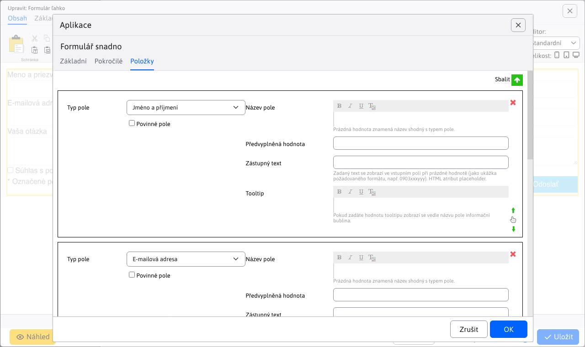
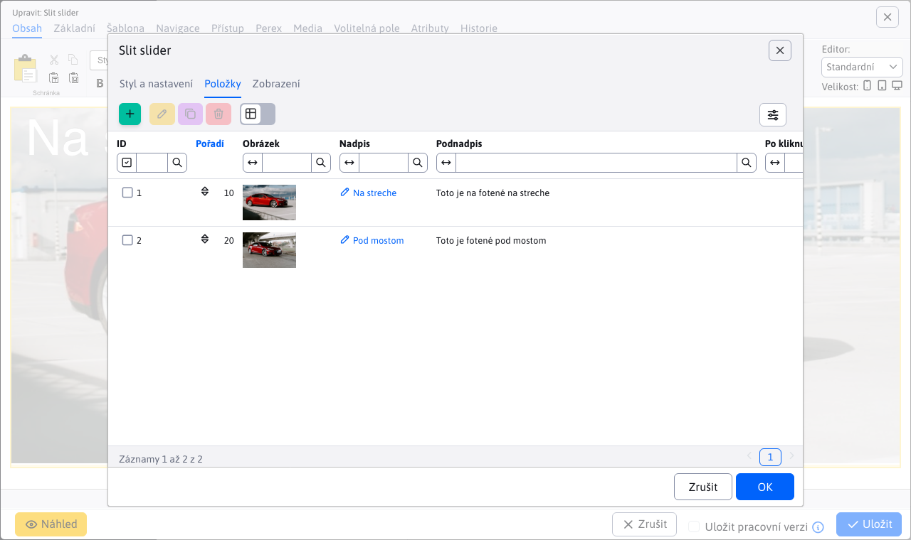
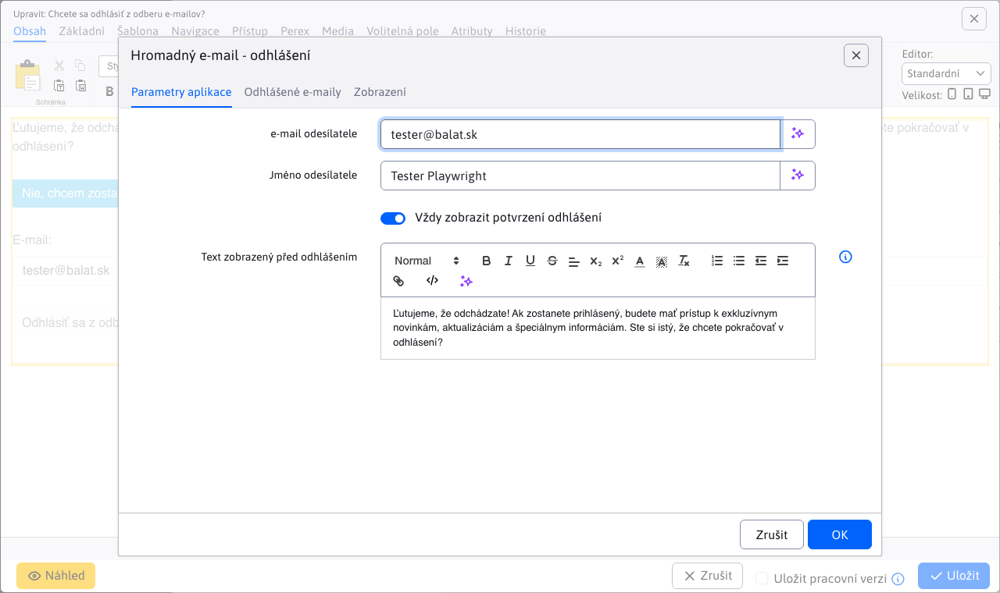
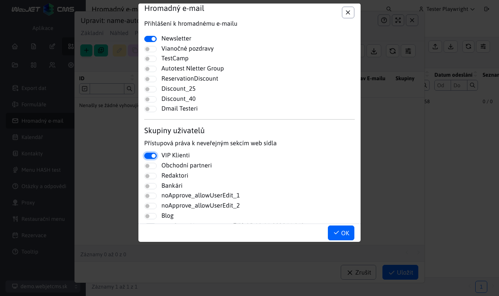
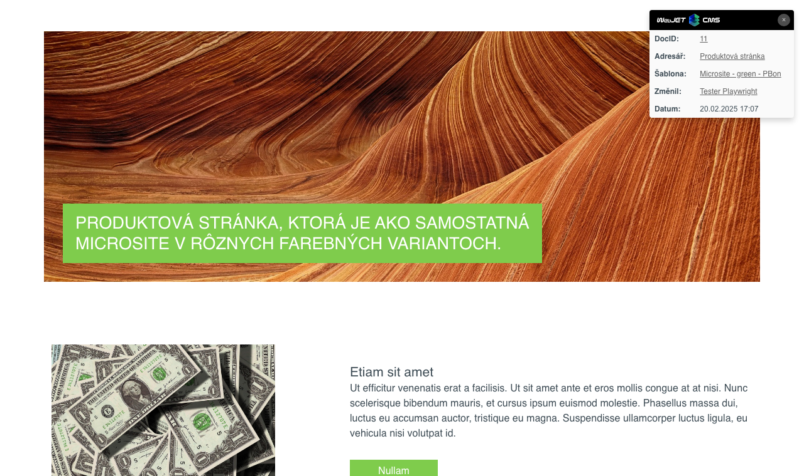

# Seznam změn verze 2025

## 2025.52/SNAPSHOT

> **WebJET CMS 2025.52/SNAPSHOT** přináší vylepšenou verzi nástroje **Page Builder** pro tvorbu **komplexních web stránek**. V blocích je možné **vyhledávat a filtrovat** na základě značek, snadno tak naleznete vhodný blok pro vložení do stránky. Přidány byly nové funkce jako **rozdělení sloupce**, **vkládání více sekcí najednou** a **stále zobrazené tlačítko pro přidání nové sekce** pro rychlé rozšíření obsahu stránky.
>
> Podpora **PICTURE elementu** umožňuje zobrazovat **různé obrázky podle rozlišení obrazovky** návštěvníka, čímž se zlepšuje vizuální zážitek na různých zařízeních. Navíc lze vkládat **vlastní ikony** definované ve společném SVG souboru, což přináší větší flexibilitu v designu.
>
> Nový nástroj pro **tvorbu formulářů** umožňuje snadno vytvářet **vícekrokové formuláře** s možností programové validace jednotlivých kroků a možností **potvrzení platnosti emailové adresy** pomocí zaslaného kódu. Vyhnete se tak vyplnění formulářů různými roboty.

!> Upozornění: verze `2025.52` je technicky shodná s verzí `2026.0` a může být plnohodnotně zaměněna.

### Průlomové změny

- Aktualizované knihovny `commons-lang,displaytag`, více v [sekci pro programátora](#pro-programátora) (#58153).
- Změněné chování ikony Bloky v režimu Page Builder - [textové bloky integrované](frontend/page-builder/blocks.md) do složky `content` podobně jako jsou bloky pro `section, container, column` (#58165).
- Upravené zpracování **nahrávání souborů**, více v `multipart/form-data` sekci pro programátora[ (#57793-3).](#pre-programátora) Doporučujeme&#x20;
- zkontrolovat funkčnost všech formulář&#x16F;**&#x20;z důvodu úprav jejich zpracování, více informací v sekci&#x20;**&#x70;ro programátora[ (#58161).](#pre-programátora) Webové stránky

### Přidána možnost vkládat&#x20;

- &#x20;element, který zobrazuje `PICTURE` obrázek podle rozlišení obrazovky[ návštěvníka. Můžete tedy zobrazit rozdílné obrázky na mobilním telefonu, tabletu nebo počítači (#58141).](frontend/setup/ckeditor.md#picture-element) Přidána možnost vkládat&#x20;


- vlastní ikony[ definované ve společném SVG souboru (#58181).](frontend/setup/ckeditor.md#svg-ikony) Přidán přenos aktuálního HTML kódu při přepnutí režimu editoru Standardní/HTML/Page Builder. Můžete tak jednoduše upravit Page Builder stránku v HTML kódu a znovu zobrazit úpravy v režimu Page Builder (#58145).


- Přidáno kontextové menu Smazat element, pomocí kterého můžete snadno smazat tlačítko, odkaz, odstavec, formulář, sekci a podobně. Stačí když na element kliknete pravým tlačítkem pro zobrazení kontextového menu (#osk233).
- Page Builder - upravené generování stylů při použití nástroje tužka. Do CSS stylu se generují jen změněné hodnoty, ty jsou v dialogovém okně zvýrazněny modrým orámováním vstupního pole (#58145).
- Page Builder - přidána možnost volání&#x20;
- vlastního JavaScript souboru[ s podpůrnými funkcemi pro úpravu kódu. Přidána možnost upravit nastavení jako selektory pro elementy, barvy a podobně (#58141).](frontend/page-builder/blocks.md#podporný-javascript-kód) Page Builder - upravené generování kotev u karet tak, aby název kotvy byl generován podle názvu karty - původně byl generován nesémanticky jako&#x20;
- &#x20;(#112).`autotabs-x-y`Page Builder - doplněna možnost nastavit šířku sloupce na&#x20;
- &#x20;pro automatické přizpůsobení obsahu (#114).`auto`Page Builder - doplněna možnost připravit&#x20;
- textové bloky[ přímo do složky ](frontend/page-builder/blocks.md), vkládají se namísto původních bloků čtených z web stránek ze složky Šablony. Web designér je připraví spolu s ostatními typy Page Builder bloků. Umožňuje rychlé vložení často používaných textových částí, tlačítek a podobně (#58165 `content`Page Builder - při vkládání nového bloku je výchozí karta Knihovna namísto Základní, aby se zjednodušil výběr bloku z připraveného seznamu (#58165).
- Page Builder - doplněna možnost rozdělit sloupec na dvě části pomocí nové funkce Rozdělit sloupec. Vyvoláte ji pomocí kliknutí na + ve žluté liště, zvolením možnosti Blok a následně v kartě Základní zvolíte možnost Rozdělit sloupec. Funkce umožňuje rychlé rozdělení sloupce bez nutnosti vkládat nový sloupec a přesouvat obsah (#58165).
- Page Builder - doplněna možnost vložit blok, který obsahuje více sekcí nebo jiných elementů - označí se po vložení všechny sekce (#58173).
- Page Builder - doplněno&#x20;
- ID bloku[ do atributu ](frontend/page-builder/blocks.md#id-bloku) pro možnost vyhledání použití bloku ve web stránkách přes vyhledávání v administraci (#58193 `data-pb-id`Page Builder - seznam oblíbených bloků je ukládán pro každého uživatele zvlášť, aby si každý mohl spravovat vlastní seznam oblíbených bloků (#58193).
- Page Builder - přidána stále zobrazená ikona pro přidání nové sekce na konci stránky, což zjednodušuje přidávání nových sekcí do stránky (#58173).
- Page Builder - upravený design nástrojové lišty pro lepší viditelnost na různých pozadích (#58165).


- Page Builder - doplněna možnost&#x20;


- filtrovat bloky[ podle názvu a štítků (#58173).](frontend/page-builder/blocks.md#názov-a-značky-bloku) Doplněna&#x20;


- detekce změny obsahu[ a upozornění na neuložené změny při zavírání okna prohlížeče. Změny se začnou detekovat 5 vteřin po otevření web stránky. (#112).](redactor/webpages/working-in-editor/README.md#detekcia-zmeny-obsahu-stránky) Doplněna možnost nastavit výchozí hodnoty pro tabulky v CKEditoru přes konfigurační proměnné, více v&#x20;
- sekci nastavení CKEditoru[ (#58189).](frontend/setup/ckeditor.md#konfiguračné-premenné) Doplněna možnost vkládat&#x20;
- tlačítko[ - element ](frontend/setup/ckeditor.md#tlačítko). Umíte tak snadno vkládat různé akční `button` tlačítka (#58201).`call to action`Styl -&#x20;
- výběr stylu[ definovaného pro element Např. ](frontend/examples/template-bare/README.md#seznam-stylů-pro-editor) nebo `p.paragraph-green,p.paragraph-red-border,p.paragraph-yellow-background` umožňuje nastavit více stylů současně. Opakovaným zvolením již nastaveného stylu se tento styl odstraní (#OSK140).`section.test-section,section.test-section-green`Upravený text pro publikování stránky do budoucnosti na&#x20;
- Naplánovat změnu stránky po tomto dat&#x75;**, při zvolení této možnosti se také změní tlačítko pro uložení na text&#x20;**&#x4E;aplánova&#x74;**&#x20;pro jasnější informaci pro uživatele (#58253).**&#x44;o žádosti o schválení web stránky doplněn seznam změněných polí (#58077).
- Aplikace


### Předěláno nastavení vlastností aplikací v editoru ze starého kódu v&#x20;

&#x20;na `JSP` aplikace. Aplikace automaticky získávají i možnost nastavit `Spring` zobrazení na zařízeních[. Design je ve shodě se zbytkem WebJET CMS a datových tabulek (#58073).](custom-apps/appstore/README.md#podmienené-zobrazenie-aplikácie) Novinky
- [Formulář snadno](redactor/apps/news/README.md)


- [Formuláře](redactor/apps/formsimple/README.md)



### Nový způsob vytváření formulářů, které mohou obsahovat&#x20;

- více kroků[ s pokročilými funkcemi. V seznamu formulářů umíte vytvořit nový formulář, kterému následně přidáte jednotlivé položky a případně několik kroků. Karta položky formuláře je viditelná v detailu formuláře typu Vícekrokový formulář (#58161).](redactor/apps/multistep-form/README.md) Seznam formulářů - celá sekce byla předělána z technologie&#x20;


- &#x20;na standardní `Vue.js` pro lepší integraci do WebJET CMS a zjednodušení úprav (#58161).`Html + JavaScript`Seznam formulářů - umožněno vytváření formuláře, který je automaticky typu&#x20;
- vícekrokový formulář[ (#58161).](redactor/apps/multistep-form/README.md) Seznam formulářů - umožněno nastavování parametrů/atributů všech typů formulářů přímo v editoru formuláře (#58161).
- Seznam formulářů - pole poznámka umožňuje vkládat formátovaný text, umíte tak lépe evidovat doplňkové informace k formuláři (#58161).
- Detail formuláře - přidána možnost zobrazení všech údajů přihlášeného uživatele, data se také exportují do Excelu (#58161).
- Ověřovací kód - přidána možnost odeslat formulář až po zadání&#x20;
- ověřovacího kódu[ zaslaného na email adresu. Umíte tak lépe chránit formuláře před SPAM-em (#58161).](redactor/apps/form/README.md#nastavenie-potvrdenia-zaslaným-kódom) Přesměrování


### Přidáno možnost ukončit platnost přesměrování ve stanoveném čase a možnost zadat poznámku s informací k čemu přesměrování slouží. Přesměrování, která již nejsou časově platná, se zobrazí červeně (#58105).

- Elektronický obchod


### Nová sekce&#x20;

- Způsoby doručení[, jako samostatná tabulka nahrazuje původní konfiguraci dostupných způsob doručení, která se nacházela přímo v nastaveních aplikace ](redactor/apps/eshop/delivery-methods/README.md) elektronického obchod&#x75;**. Pro každý způsob doručení lze nastavit také cenu, která při zvolení možnosti bude automaticky přičtena k objednávce. Nastavené způsoby doručení se také automaticky promítnou do možností při vytváření objednávky zákazníkem. Připraveno je doručení poštou a osobní vyzvednutí, do budoucna plánujeme doplnit integraci na doručovací společnosti (#58061).**&#x42;ezpečnost


### Přidána podpora pro povolení pouze&#x20;

- jednoho aktivního přihlášen&#xED;**&#x20;na jednoho uživatele. Režim zapnete nastavením konfigurační proměnné&#x20;**&#x20;na hodnotu `sessionSingleLogon`. Při novém přihlášení se zruší předchozí aktivní `true` (#58121).`session`Odstraněna nepodporovaná knihovna&#x20;
- commons-lang[, nahrazena novou knihovnou ](https://mvnrepository.com/artifact/commons-lang/commons-lang) commons-lang3[, v ](https://mvnrepository.com/artifact/org.apache.commons/commons-lang3) je aktualizační skript pro úpravu zdrojových kódů (#58153).`update-2023-18.jsp`Přidán seznam&#x20;
- Moje aktivní přihlášení[ na úvodní obrazovce administrace, která zobrazuje všechna aktivní přihlášení do administrace pod vaším uživatelským účtem a možnost jejich ukončení. Přidána i možnost odeslat email přihlášenému administrátorovi (#58125).](redactor/admin/welcome.md#moje-aktívne-prihlásenia) Captcha - nastavením konfigurační proměnné&#x20;


- &#x20;na hodnotu `captchaType` lze Captcha zcela vypnout. Nezobrazí se iv případě, pokud má šablona zobrazené web stránky vypnutou SPAM ochranu. V takovém případě je ale třeba korektně kontrolovat vypnutí SPAM ochrany šablony iv případném kódu zpracování/verifikace Captcha odpovědi, pro formuláře je tato kontrola zabezpečena. Můžete použít volání `none` pro ověření režimu a vypnutí spam ochrany (#54273-78).`Captcha.isRequired(component, request)`Aktualizovaná knihovna pro&#x20;
- odesílání emailů[ z ](install/config/README.md#odesílání-emailů) na `com.sun.mail:javax.mail:1.6.2` z důvodu podpory nových autentifikačních mechanismů SMTP serverů jako například `com.sun.mail:jakarta.mail:1.6.8` a přidaná konfigurační proměnná `NTLMv2` pro vynucení použití autorizačního mechanismu - nastavte např. na hodnotu `smtpAuthMechanism` pro vynucení `NTLM` autorizace namísto použití `NTLM` autorizace (#58153 `BASIC`Upraveno logování výjimek při přerušení HTTP spojení (např. při zavření prohlížeče, odchodu na jinou web stránku a podobně). Takové výjimky se nezapíší do logu, aby nenastala chyba obsazení místa. Týká se výjimek typu&#x20;
- &#x20;a názvů výjimek definovaných přes konfigurační proměnnou `IOExceptio`, výchozí `clientAbortMessages` (#58153).`response already,connection reset by peer,broken pipe,socket write error`Jiné menší změny

### Vyhledávání – upravené načtení seznamu šablon při hledání web stránek. Načtou se všechny šablony bez ohledu na jejich dostupnost ve složkách, aby se nestalo, že při editaci web stránky šablona není dostupná (#58073).

- HTTP hlavičky - přidána možnost nastavit hlavičku delší než 255 znaků, například pro nastavení&#x20;
- &#x20;(`Content-Security-Policy`#82[)](https://github.com/webjetcms/webjetcms/issues/82) Konfigurace - upravený způsob smazání konfigurační proměnné. Po vymazání se automaticky nastaví původní hodnota z&#x20;


- , aby byla stejná jako bude po restartu serveru. V původním řešení se proměnná jen smazala, ale její hodnota zůstala interně nastavena do restartu serveru (#57849).`Constants`Konfigurace - přidána možnost nastavit&#x20;
- jméno HTTP hlavičky[ pro získání IP adresy návštěvníka přes konfigurační proměnnou ](sysadmin/pentests/README.md#konfigurace) (#58237).`xForwardedForHeader`Bezpečnost - přidána možnost konfigurace blokovaných cest souborů/adresářů přes proměnnou&#x20;
- . Standardně jsou blokovány URL adresy, které v názvu obsahují výraz `pathFilterBlockedPaths`. Lze přidat další podle potřeby (#PR103).`.DS_Store,debug.,config.properties,Thumbs.db,.git,.svn`Značky - upravené zobrazené značek, v případě duplicity hodnot. Porovnání je bez vlivu diakritiky a velkých/malých písmen&#x20;
- #115[.](https://github.com/webjetcms/webjetcms/issues/115) Zrcadlení - přidána možnost zobrazit obrázek vlajky namísto textu v&#x20;


- přepínači jazyka stránky[ (#54273-79).](redactor/apps/docmirroring/README.md#vytvorenie-odkazu-na-jazykové-mutácie-v-hlavičke-stránky) Změna hesla - přidána možnost nastavit jméno a email adresu ze které je odeslán email s odkazem na změnu hesla přes konfigurační proměnné&#x20;
- &#x20;a `passwordResetDefaultSenderEmail` (#58125 `passwordResetDefaultSenderName`Statistika - doplněné sumární počty vidění a návštěv v TOP stránkách (#PR136).
- Novinky - přejmenovaná hodnota uspořádat podle priority na uspořádat podle Pořadí uspořádání (priority) pro sladění s hodnotou v editoru (#57667-16).
- Formulář snadno - přidána možnost nastavit hodnotu&#x20;
- &#x20;pro vložení formuláře např. do patičky stránky (#57667-16).`useFormDocId`Novinky / Šablony novinek - přesunuté pole&#x20;
- &#x20;z aplikace Novinky do Šablony novinek, aby se vlastnost nastavovala přímo v šabloně novinek. Původní hodnota `contextClasses` z Novinek bude nadále fungovat, ale nelze jej již nastavovat v uživatelském rozhraní (#58245).`contextClasses`Manažer dokumentů - přidána možnost&#x20;
- upravit metadata historické verze dokumentu[ v manažeru dokumentů (#58241).](redactor/files/file-archive/README.md#úprava-historickej-verzie-dokumentu-v-manažéri) Hromadný email - upravené auditování změn v kampani. Pokud se přidá skupina neaudituje se celý seznam příjemců (bylo to zbytečně mnoho záznamů v auditu), zapíše se pouze seznam změněných skupin. Při manuálním přidání emailů se nadále audituje jméno i emailová adresa (#58249).
- Uživatelé - při importu pokud sloupec v Excelu neobsahuje pole heslo, tak se pro nové uživatele vygeneruje náhodné heslo. Pokud není v Excelu zadán stav Schválený uživatel, tak se nastaví na hodnotu&#x20;
- &#x20;(#58253 `true`MultiWeb - doplněno zobrazení domény v boční liště (#58317-0).
- MultiWeb - doplněna možnost nastavit doménu přesměrování aby bylo možné zadat&#x20;
- &#x20;prefix (#58317-0 `https://`MultiWeb - doplněna kontrola práv pro skupiny médií a značky (#58317-0).
- Seznam formulářů - nastavení&#x20;
- zpracovatele formulářů[, pomocí autocomplete pole, který nabízí třídy implementující ](custom-apps/apps/multistep-forms/README.md) (#58313 `FormProcessorInterface`Číselníky - doplněno odstranění mezer na začátku a konci pole typu řetězec v datech číselníku (#OSK233).
- Oprava chyb

### Značky - opraveno duplikování složky v Zobrazit pro při uložení značky, odstraněn výběr složky z ostatních domén, protože značky jsou již odděleny podle domén (#58121).
- Web stránky - opraveno vkládání tvrdé mezery za spojky tak, aby se aplikovalo pouze na text stránky a nikoli na atributy nebo HTML značky (#OSK235).
- Datatables - opravené zpracování události&#x20;
- &#x20;u vybraných vstupních polí filtrů tabulky (#58313).`Enter`Datatables - opravené filtrování kdy se více&#x20;
- &#x20;tabulek na stránce navzájem ovlivňovalo při filtrování (#58313 `serverSide:false`Elektronický obchod - opraveno odesílání email notifikace, při změně stavu objednávky (#58313).
- Elektronický obchod - opraveno automatické nastavení stavu objednávky po změně plateb (#58313).
- Dokumentace

### Aktualizovány všechny fotky obrazovky v české verzi dokumentace (#58113).

- Pro programátora

### Volná pole - přidána možnost specifikovat vlastní sloupce pro label a hodnotu při&#x20;
- propojení na číselník[. Umožňuje flexibilnější nastavení, která vlastnost z číselníku se použije jako zobrazený text a která jako uložená hodnota (#PR108).](frontend/webpages/customfields/README.md#číselník) Smazané nepoužívané soubory&#x20;
- , pokud je ve vašem projektu používáte vezměte je ze `/admin/spec/gallery_editor_perex_group.jsp,/admin/spec/perex_group.jsp` starší verze[ WebJET CMS (#58073).](https://github.com/webjetcms/webjetcms/tree/release/2025.40/src/main/webapp/admin/spec) Mírně upravené API v&#x20;
- NewsActionBean[, hlavně nastavení ](../../src/webjet8/java/sk/iway/iwcm/components/news/NewsActionBean.java) které jsou nyní typu `groupIds`. Můžete použít `List<GroupDetails>` pro nastavení s polem ID hodnot (#58073 `setGroupIds(int[] groupIds)`Opravena možnost vkládání uvozovek do parametrů aplikací (#58117).
- Připraveny kontejnery pro všechny podporované databázové servery ve WebJET CMS pro snadné spuštění ve VS Code. Nacházejí se ve složce&#x20;
- &#x20;(#58137).`.devcontainer/db`Elektronický obchod - kvůli změnám při procesu implementace&#x20;
- způsobů doručen&#xED;**&#x20;je třeba provést úpravu souboru pomocí aktualizačního skriptu&#x20;**&#x20;a to nad sekcí `update-2023-18.jsp` (#58061).`basket`Elektronický obchod - přejmenovaná anotace&#x20;
- &#x20;na `@PaymentMethod` a `@FieldsConfig` na `@PaymentFieldMapAttr` pro sjednocení anotací mezi platbami a způsoby doručení (#58061).`@FieldMapAttr`Elektronický obchod - při procesu implementace&#x20;
- způsobů doručen&#xED;**&#x20;do souboru&#x20;**&#x20;přibylo několik změn, které si musíte implementovat manuálně. Tyto změny jsou příliš komplexní, aby se daly doplnit pomocí aktualizačního skriptu `order_form.jsp` (#58061).`update-2023-18.jsp`Navigační lišta - přidána možnost použít vlastní implementaci generátoru&#x20;
- navigační lišty[. Přes konfigurační proměnnou ](redactor/apps/navbar/README.md) je možné nastavit jméno třídy implementující `navbarDefaultType` (#PR101).`NavbarInterface`Odstraněna nepodporovaná knihovna&#x20;
- commons-lang[, nahrazena novou knihovnou ](https://mvnrepository.com/artifact/commons-lang/commons-lang) commons-lang3[, v ](https://mvnrepository.com/artifact/org.apache.commons/commons-lang3) je aktualizační skript pro úpravu zdrojových kódů (#58153).`update-2023-18.jsp`Aktualizovaná knihovna&#x20;
- displaytag[ na verzi ](https://mvnrepository.com/artifact/com.github.hazendaz/displaytag) (#58153).`2.9.0`Upraveno zpracování nahrávání souborů&#x20;
- . Ve Spring aplikacích pro souborové pole použijte místo `multipart/form-data` přímo `org.apache.commons.fileupload.FileItem`, které bude automaticky nastaveno. Není již třeba používat volání typu `org.springframework.web.multipart.MultipartFile` pro získání souboru. `entity.setDocument(MultipartWrapper.getFileStoredInRequest("document", request))` Upozornění:**&#x20;je třeba nahradit všechny výskyty&#x20;**&#x20;za `CommonsMultipartFile` ve vašem kódu, také zrušit URL parametry ve Spring aplikaci pro vynucené zpracování. Výraz `MultipartFile` nahraďte za `data-th-action="@{${request.getAttribute('ninja').page.urlPath}(\_\_forceParse=1,\_\_setf=1)}"`. Můžete použít `data-th-action="${request.getAttribute('ninja').page.urlPath}"` k aktualizaci souborů (#57793-3).`/admin/update/update-2023-18.jsp`Doplněna možnost vytvoření&#x20;
- projektových kopií souborů[ Spring aplikaci. Stačí vytvořit vlastní verzi souboru ve složce ](frontend/customize-apps/README.md) podobně jako se používá pro JSP soubory. WebJET CMS nejprve hledá soubor v projektové složce a není-li nalezen použije standardní soubor z `/apps/INSTALL_NAME/` složky (#58073).`/apps/`Doplněna možnost nastavit&#x20;
- jméno pro CSS styl[ v CSS souboru přes komentář ](frontend/examples/template-bare/README.md). Jméno se zobrazí v seznamu stylů v editoru (#58209).`/* editor title: Style Name */`Editor - upravený dialog pro nastavení&#x20;
- &#x20;\- zrušeno nastavení barev a velikostí, `a.btn` používají se už jen CSS třídy[ stejně jako pr ](frontend/setup/ckeditor.md#tlačítko) (#57657-16).`button`Datové tabulky - možnost zobrazení pouze ikony bez pořadí pro&#x20;
- &#x20;pokud danému sloupci přidáme třídu `rowReorder` (#58161).`icon-only`Datové tabulky - nové možnosti pro výběr řádků v tabulce&#x20;
- &#x20;a `toggleSelector`, více v `toggleStyle` sekci datových tabulek[ (#58161).](developer/datatables/README.md#možnosti-konfigurácie) Datové tabulky - nová možnost vlastní&#x20;
- render[ funkce pomocí anotace ](developer/datatables-editor/datatable-columns.md). Umožní vám zobrazit ve sloupci složené hodnoty z více polí a podobně (#58161).`@DataTableColumn(...renderFunction = "renderStepName")`Datové tabulky - přidána možnost&#x20;
- přesměrovat uživatele[ na jinou stránku po uložení záznamu voláním metody ](developer/datatables/restcontroller.md#přesměrování-po-uložení) (#58161).`setRedirect(String redirect)`Formuláře - Upraveno zobrazení seznamu formulářů, zrušena třída&#x20;
- , nahrazena třídou `FormAttributesDB`. Nastavení formulářů změněno z tabulky `FormService` na tabulku `form_attributes`. Doporučujeme po aktualizaci ověřit funkčnost všech formulářů na web stránce (#58161).`form_settings`Formuláře - vytvoření nové tabulky&#x20;
- &#x20;jako náhradu za tabulku `form_settings`, kde se ukládají vlastnosti formulářů. Jednotlivé atributy (nastavení) jsou nyní uloženy v samostatných sloupcích jako jeden záznam na řádek. Data byla do nové tabulky konvertována pomocí `form_attributes` (#58161).`UpdateDatabase.java`Přechod na novou tabulku&#x20;
- &#x20;pro vlastnosti formulářů v `form_settings` souborech. Je třeba si spustit aktualizační skript `.jsp`, který upraví potřebné `update-2025-0.jsp` (#58161).`.jsp`Seznam formulářů - nastavování parametrů/atributů všech typů formulářů přesměrováno z tabulky&#x20;
- &#x20;do nové tabulky `form_attributes` (#58161).`form_settings`Datové tabulky - přidána BE podpora pro&#x20;
- , kdy lze měnit pořadí záznamů přímo v datové tabulce pomocí drag\&drop (#58161).`row-reorder`Události - přidaná událost&#x20;
- Aktualizace kódů v textu[ pro možnost úprav kódů v textu stránky typu ](developer/backend/events.md#aktualizace-kódů-v-textu) a podobně (#54273-63).`!CUSTOM_CODE!`Datové tabulky - přidáno&#x20;
- Spring události[ pro možnost úprav dat v zákaznických instalacích (#54273-63).](developer/backend/events-datatable.md) Testování

### Doplněný skript&#x20;

- rm-same-images.sh[ pro odstranění stejných obrázků při pořízení nových snímků obrazovky (#58113).](../../src/test/webapp/rm-same-images.sh) 2025.40


## WebJET CMS 2025.40

> **&#x20;přináší integrovaného&#x20;** &#x41;I Asistent&#x61;**, který zásadně zjednodušuje práci s obsahem. Umožňuje automaticky&#x20;**&#x6F;pravovat gramatik&#x75;**,&#x20;**&#x70;řekláda&#x74;**&#x20;texty, navrhovat titulky, sumarizovat články a generovat&#x20;**&#x69;lustrační obrázk&#x79;**&#x20;přímo v editoru. Díky tomu je tvorba obsahu&#x20;**&#x72;ychlejší, přesnější a kreativnějš&#xED;**&#x20;než kdykoli předtím.**&#x56;ýznamné změny se týkají také&#x20;
>
> znače&#x6B;**&#x20;a&#x20;**&#x161;ablon novine&#x6B;**, které byly přepracovány do&#x20;**&#x73;amostatných databázových tabule&#x6B;**&#x20;s podporou oddělení podle domén. To přináší vyšší&#x20;**&#x70;řehlednost, jednodušší správ&#x75;**&#x20;a možnost efektivního přizpůsobení obsahu pro více webů. Uživatelské prostředí bylo&#x20;**&#x6F;ptimalizováno pro menší obrazovk&#x79;**&#x20;– systém automaticky přizpůsobí zobrazení oken a maximalizuje využitelný prostor.**&#x4E;a technické úrovni byl odstraněn zastaralý Struts Framework. Díky tomu je WebJET CMS výkonnější, stabilnější,&#x20;
>
> bezpečnějš&#xED;**&#x20;a připraven k dalšímu rozvoji moderních webových řešení.**&#x50;růlomové změny

### Odstraněn&#x20;

- , je třeba provést aktualizaci `Struts Framework` souborů, Java tříd a upravit soubor `JSP`, více v `web.xml` sekci pro programátora[ (#57789).](#pre-programátora) Pokud používáte aplikační server Tomcat ve verzi 9.0.104 a více je třeba&#x20;
- aktualizovat nastavení[ parametru ](install/versions.md#změny-při-přechodu-na-tomcat-90104) na `maxPartCount` elemente (#54273-70).`<Connector`Značky - rozdělené podle domén - při startu se vytvoří kopie značek pro každou doménu (je-li používáno rozdělení údajů podle domén - nastavena konfigurační proměnná&#x20;
- ). Aktualizují se ID značek pro web stránky a galerii. Je třeba manuálně zkontrolovat ID značek pro všechny aplikace novinky a jiné aplikace, které obsahují ID značky – aktualizace se je pokusí opravit, ale doporučujeme ID zkontrolovat. Více informací v sekci pro programátora. (#57837).`enableStaticFilesExternalDir=true`Novinky -&#x20;
- šablony novinek[ předělané z definice přes překladové klíče na vlastní databázovou tabulku. Při startu WebJETu se zkonvertují záznamy z původního formátu. Jsou odděleny podle domén, pokud obsahují doménový alias vytvoří se pouze v příslušné doméně (#57937).](frontend/templates/news/README.md) Bezpečnost - přísnější kontrola URL adres administrace - je třeba, aby URL adresa v administraci měla na konci znak&#x20;
- , nesprávná adresa je `/` nebo `/admin/v9/webpages/web-pages-list`, správná `/apps/quiz/admin` nebo `/admin/v9/webpages/web-pages-list/`. Je třeba aby programátor zkontroloval definice URL adres v souborech `/apps/quiz/admin/` (#57793).`modinfo.properties`AI Asistent

### V dnešním světě je umělá inteligence všude kolem nás a samozřejmě WebJET jako moderní redakční systém nechce zůstat pozadu. Proto s hrdostí představujeme novou verzi WebJET CMS, kde jsme integrovali&#x20;

pokročilé AI nástroje[.](redactor/ai/README.md) Tyto funkce vám usnadní tvorbu a úpravu obsahu – od opravy gramatiky, přes překlady textů, návrhy titulků, až po generování ilustračních obrázků.


YouTube video player

<div class="video-container">
  <iframe width="560" height="315" src="https://www.youtube.com/embed/LhXo7zx7bEc" title="Web stránky" frameborder="0" allow="accelerometer; autoplay; clipboard-write; encrypted-media; gyroscope; picture-in-picture" allowfullscreen></iframe>
</div>

### AB Testování - přidána možnost&#x20;
- zobrazovat AB verzi[ podle stavu přihlášeného uživatele - nepřihlášenému uživateli se zobrazí A verze a přihlášenému B verze. Režim aktivujete nastavením konfigurační proměnné ](redactor/apps/abtesting/README.md) na hodnotu `ABTestingForLoggedUser` (#57893).`true`Page Builder
- [ - upravený vizuál, aby lépe zapadal do aktuálního designu WebJET CMS (#57893).](redactor/webpages/pagebuilder.md) Povoleno zobrazení stránek obsahujících&#x20;


- &#x20;v URL adrese ze systémových složek, aby vám taková technická stránka nepřekážela mezi standardními web stránkami (#57657-8 `404.html`Značky - rozdělené zobrazení značek podle aktuálně zvolené domény, abyste mohli mít značky zvlášť pro každou doménu ve WebJETu (#57837).
- Klonování struktury - přidána informace o nakonfigurovaném překladači a kolik volných znaků k překladu zbývá (#57881).
- Zrcadlení struktury - přidána možnost vymazat&#x20;
- &#x20;hodnoty pro zvolenou složku (rekurzivní). Aby bylo snadno možné zrušit/resetovat zrcadlení stránek (#57881).`sync_id`Zrcadlení - přidání nové sekce&#x20;


- zrcadlení[ pro sledování a správu provázaných složek a stránek po akci zrcadlení (#57941).](redactor/webpages/mirroring/README.md) Při výběru obrázku nebo video souboru, v editoru stránek jsou v průzkumníku zobrazeny jen vhodné typy souborů, ostatní jsou filtrovány (#57921).


- Šablony

### Přidána nová sekce&#x20;

- Šablony novinek[ pro správu a správu šablon novinek (#57937).](frontend/templates/news/README.md) Uživatelské rozhraní


### Při použití malého monitoru (výška okna méně než 760 bodů) se zobrazí okno automaticky na celou plochu a zmenší se hlavička a patička (titulek okna je menším písmem). Zvýší se tak zobrazené množství informací, což je zapotřebí hlavně v sekci web stránky. Používá se u oken používajících CSS třídu&#x20;

- , což jsou aktuální web stránky, foto galerie, editor obrázků a uživatelé (#57893).`modal-xl`V editoru přidána možnost kliknout na ikonu obrázku na začátku pole, pro jeho zobrazení v nové kartě.


- Aplikace


### Přidána možnost zobrazit aplikaci pouze přihlášenému/nepřihlášenému uživateli. Režim se nastavuje v kartě&#x20;

- Zobrazení nastavení aplikace[ v editoru stránek (#57893).](redactor/webpages/working-in-editor/README.md#karta-zobrazenie) Předěláno nastavení vlastností aplikací v editoru ze starého kódu v&#x20;


&#x20;na `JSP` aplikace. Aplikace automaticky získávají i možnost nastavit `Spring` zobrazení na zařízeních[. Design je ve shodě se zbytkem WebJET CMS a datových tabulek (#57409).](custom-apps/appstore/README.md#podmienené-zobrazenie-aplikácie) Carousel Slider
- [Emotikony](redactor/apps/carousel_slider/README.md)
- [Fórum/Diskuse](redactor/apps/emoticon/README.md)
- [Otázky a odpovědi](redactor/apps/forum/README.md)
- [Uživatelé](redactor/apps/qa/README.md)
- [Působivá prezentace](redactor/apps/user/README.md)
- [Restaurační menu](redactor/apps/app-impress_slideshow/README.md)
- [Slider](redactor/apps/restaurant-menu/README.md)
- [Slit slider](redactor/apps/slider/README.md)
- [Sociální ikony](redactor/apps/app-slit_slider/README.md)
- [Video](redactor/apps/app-social_icon/README.md)
- [Menu](redactor/apps/video/README.md)



### Pokud&#x20;

- menu web stránky[ nemá zadanou kořenovou složku (hodnota je nastavena na 0), automaticky se použije kořenová složka pro aktuálně zobrazenou web stránku. Je to výhodné pokud se zobrazuje menu ve více jazykových mutacích kde každá je kořenová složka - nemusíte mít menu/hlavičky pro každý jazyk samostatně, stačí jedna společná (#57893).](redactor/apps/menu/README.md) Statistika

### V sekcí&#x20;

- návštěvnost[ přidán sumární počet Vidění, Návštěv a Počet různých uživatelů pro snadný přehled celkové návštěvnosti za zvolené období (#57929).](redactor/apps/stat/README.md#návštevnosť) V sekcí&#x20;


- vadné stránky[ přidáno filtrování podle botů (aplikuje se pouze na nově zaznamenané údaje) a sumární počet v patičce. Je třeba upravit stránku ](redactor/apps/stat/README.md#vadné-stránky) ve vašem projektu přidáním objektu `404.jsp` do volání `request` (#58053).`StatDB.addError(statPath, referer, request);`Volitelná pole


### Přidána podpora pro nové typy&#x20;

- volitelných polí[:](frontend/webpages/customfields/README.md) Výběr složky webových stránek
  - [ (#57941).](frontend/webpages/customfields/README.md#výber-priečinku-webových-stránok) Výběr webové stránky
  - [ (#57941).](frontend/webpages/customfields/README.md#výber-webovej-stránky) Bezpečnost


Opravena možná zranitelnost v Safari při speciální URL adrese směřující na archiv souborů v kombinaci s pěknou 404 stránkou (#57657-8).

### Jiné menší změny

- Audit změn - vyhledávání - pole Typ je uspořádáno podle abecedy (#58093).

### Elektronický obchod - přidána možnost nastavit&#x20;
- kořenová složka
- &#x20;se seznamem produktů pomocí konfigurační proměnné [, pokud nevyhovuje automatické hledání podle vložené aplikace seznam produktů (#58057).](redactor/apps/eshop/product-list/README.md) Elektronický obchod - aplikace pro nastavení platebních metod přesunuta ze složky `basketAdminGroupIds` do standardního&#x20;
- &#x20;(#58057 `/apps/eshop/admin/payment-methods/`Elektronický obchod - po smazání objednávky jsou smazány z databáze i její položky a platby (#58070).`/apps/basket/admin/payment-methods/`Monitorování serveru - aktuální hodnoty - přidaný typ databázového serveru (MariaDB, Microsoft SQL, Oracle, PostgreSQL) (#58101).
- Překladač - u překladače&#x20;
- &#x20;se zlepšilo zpracování vrácených chybových hlášek, pro přesnější identifikování problému (#57881).
- Překladač - přidána podpora pro implementaci více překladačů a jejich automatické zpracování/využití (#57881).`DeepL`Překladač - přidáno automatické&#x20;
- auditování počtu spotřebovaných znaků
- &#x20;při každém překladu. Do audit záznamu typu [ se do sloupce ](admin/setup/translation.md) zapíše spotřebované množství kreditů při překladu. Audituje se i počet dostupných znaků, výsledek je uložen do cache a aktualizuje se znovu nejdříve o 5 minut (#57965).`TRANSLATION`Průzkumník - optimalizované načítání, opraveno duplicitní čtení knihovny `EntityID` (#57997).
- Oprava chyb`jQuery UI`Datové tabulky - opraveno nastavení možností do výběrového menu externího filtru (#57657-8).

### Klonování struktury - opravena validace zadaných id složek a přidán výpis chybové zprávy (#57941).
- Galerie - přidána podpora pro výběr složky galerie, v aplikaci Galerie ve web stránce, při použití doménových aliasů a editace záznamu v galerii s doménovým aliasem (#57657-11).
- Webové stránky - opraveno zobrazení seznamu stránek při zobrazení složek jako tabulky (#57657-12).
- Grafy - opraveno zobrazení velkého množství legend v grafech, automaticky se využije posouvání v legendách (#58093).
- Dokumentace
- Doplněna dokumentace pro nastavení a používání&#x20;

### dvoustupňového ověřování/autorizace

- &#x20;(#57889).[Pro programátora](redactor/admin/logon.md#dvoustupňové-ověřování) Zrušená třída&#x20;

### , která se používala v importech z&#x20;

- &#x20;formátu v `ImportXLSForm` spec/import\_xls.jsp`XLS`. Technicky třída není nutná, stačí smazat referenci v JSP a upravit formulář na standardní HTML formulář (#57789).[Zlepšený aktualizační skript ](../../src/main/webapp/admin/spec/import_xls.jsp) pro Archiv souborů - umí aktualizovat standardní změny a doplnit potřebné změny do vaší verze&#x20;
- &#x20;a pomocných tříd (#57789).`/admin/update/update-2023-18.jsp`Třída `FileArchivatorBean` nahrazena objektem&#x20;
- , třída `org.apache.struts.action.ActionMessage` nahrazena `String` (#57789).`ActionMessages`Zrušený framework `List<String>`, tagy&#x20;
- &#x20;nahrazeno za odpovídající `Struts`, pozor `<logic:present/iterate/...` za `<iwcm:present/iterate/...`.`<bean:write`V Java kódu jsou z důvodu odstranění `<iwcm:beanWrite` následující změny:
- &#x20;nahrazen za `Struts` nahrazen za&#x20;
  - `ActionMessage` vrátí `String`
  - `ActionMessages` místo `List<String>`
  - `BasicLdapLogon.logon` nahrazen `List<String>` Amcharts - přidána podpora pro zadání funkce pro transformaci textu ve štítcích kategorií u grafu typu `ActionMessages`
  - `org.apache.struts.util.ResponseUtils.filter` (#58093).`sk.iway.iwcm.tags.support.ResponseUtils.filter`
- Amcharts - přidána podpora pro zadání funkce pro transformaci textu v legendě grafu typu `PIE` (#58093).
- Amcharts - přidána možnost skrýt tooltip když hodnota je `LINE` nebo&#x20;
- &#x20;v grafu typu `null` (#58093).`0`Pro konverzi JSP i Java souborů můžete použít skript `LINE`. Zadáte-li jako cestu hodnotu&#x20;

&#x20;provede se nahrazení iv `/admin/update/update-2023-18.jsp` souborech. Problémem je spuštění projektu, pokud obsahuje chyby. Můžete ale složku `java` přejmenovat na `../java/*.java` aby šel spustit čistý WebJET. Následně můžete použít aktualizační skript. Ten prohledává a aktualizuje složku `src/main/java` i `src/main/java-update`.`../java/*.java`V souboru `../java-update/*.java` již není nutná inicializace&#x20;

, smažte celou `WEB-INF/web.xml` sekci obsahující `Apache Struts` a `<servlet>` obsahující `<servlet-class>org.apache.struts.action.ActionServlet</servlet-class>`.`<servlet-mapping>`Rozdělené značky podle domén (je-li nastavena konfigurační proměnná `<servlet-name>action</servlet-name>`), aby bylo možné jednoduše mít samostatné značky pro každou doménu. Při spuštění WebJET nakopíruje stávající značky pro všechny definované domény. Přeskočí značky, které mají nastavené zobrazení pouze ve specifické složce, kde podle první složky nastaví doménu pro značku. Aktualizuje značky pro Novinky, tedy pro aplikaci&#x20;
- &#x20;kde vyhledá výraz `enableStaticFilesExternalDir=true` a `/components/news/news-velocity.jsp` u kterých se pokusí ID značek aktualizovat podle domény dané web stránky. Informace se zapíše do historie a v Auditu vznikne záznam s podrobností jak se `perexGroup` nahradil, příklad:`perexGroupNot`Pro první `INCLUDE` byly odstraněny značky s ID 625 a 626, protože ty se nezobrazují v dané složce/doméně - měly nastavené zobrazení pouze pro určitou složku. Ve druhém&#x20;

```txt
UPDATE:
id: 76897

news-velocity.jsp - update perexGroups+perexGroupsNot for domainId, old code::
INCLUDE(/components/news/news-velocity.jsp, groupIds="24", alsoSubGroups="false", publishType="new", order="date", ascending="false", paging="false", pageSize="1", offset="0", perexNotRequired="false", loadData="false", checkDuplicity="true", contextClasses="", cacheMinutes="0", template="news.template.dlazdica-3", perexGroup="625", perexGroupNot="626")
new code:
INCLUDE(/components/news/news-velocity.jsp, groupIds="24", alsoSubGroups="false", publishType="new", order="date", ascending="false", paging="false", pageSize="1", offset="0", perexNotRequired="false", loadData="false", checkDuplicity="true", contextClasses="", cacheMinutes="0", template="news.template.dlazdica-3", perexGroup="", perexGroupNot="")

INCLUDE(/components/news/news-velocity.jsp, groupIds="24", alsoSubGroups="false", publishType="new", order="date", ascending="false", paging="false", pageSize="1", offset="0", perexNotRequired="false", loadData="false", checkDuplicity="true", contextClasses="", cacheMinutes="0", template="news.template.dlazdica-3", perexGroup="3+645", perexGroupNot="794")
new code:
INCLUDE(/components/news/news-velocity.jsp, groupIds="24", alsoSubGroups="false", publishType="new", order="date", ascending="false", paging="false", pageSize="1", offset="0", perexNotRequired="false", loadData="false", checkDuplicity="true", contextClasses="", cacheMinutes="0", template="news.template.dlazdica-3", perexGroup="1438+1439", perexGroupNot="1440")
```

&#x20;byly změněny značky `INCLUDE` na nově vzniklé `INCLUDE` a `3+645` za `1438+1439`.`794`| perex\_group\_id | perex\_group\_name | domain\_id | available\_groups |
| -------------- | -------------------- | --------- | ---------------- |
| 3 | další perex skupina | 1 | NULL |
| 645 | deletedPerexGroup | 1 | NULL |
| 794 | kalendář-událostí | 1 | NULL |
| 1438 | další perex skupina | 83 | NULL |
| 1439 | deletedPerexGroup | 83 | NULL |
| 1440 | kalendář-událostí | 83 | NULL |`1440`Před spuštěním aktualizace existovaly v databázi pouze záznamy&#x20;

, kterým se nastavilo&#x20;

. Záznamy `3, 645 a 794` vznikly při aktualizaci pro `domain_id=1`.`1438, 1439 a 1440`Datové tabulky - přidána podpora pro úpravu `domain_id=83` lokálních JSON dat
- &#x20;(#57409).[Datové tabulky - přidané rozšíření ](developer/datatables-editor/field-datatable.md#lokální-json-data) Row Reorder
- &#x20;pro možnost uspořádání seznamu pomocí funkce [ (#57409).](https://datatables.net/extensions/rowreorder/) Datatabulky - Přidána možnost nastavení `Drag&Drop` Patičky pro součet hodnot
- &#x20;(#57929).[Aplikace - doplněna možnost použít lokální JSON data pro nastavení položek aplikace, například položek pro ](developer/datatables/README.md#patička-pro-součet-hodnot) působivou prezentaci
- &#x20;(#57409).[2025.18](redactor/apps/app-impress_slideshow/README.md) Verze&#x20;


## 2025.18

> &#x20;přináší kompletně předělaný modul **Elektronického obchodu** s podporou **platební brány GoPay** a vylepšeným seznamem objednávek. Aplikace **Kalendář novinek** byla oddělena jako **samostatná aplikace** a zároveň jsme předělali nastavení více aplikací v editoru stránek do nového designu. **Manažer dokumentů** (původně Archiv souborů) prošel **vizuálním i funkčním restartem** včetně nových nástrojů pro správu, export a import dokumentů.**Vylepšen byl i systém&#x20;**&#x48;romadného e-mailu
>
> &#x20;s novými možnostmi pro odesílatele a pohodlnějším výběrem příjemců. **Rezervace** získali nové možnosti jako**nadměrné rezervace**, vytváření rezervací zpětně do minulosti a zasílání notifikací na specifické emaily pro každý rezervační objekt.**Optimalizovali jsme počet souborů v&#x20;**&#x50;růzkumníku
>
> , což vede k **rychlejšímu načítání** a přidali nové informace do **Monitorování serveru**.**Průlomové změny**Aplikace Kalendář novinek oddělena do samostatné aplikace, pokud kalendář novinek používáte je třeba upravit cestu&#x20;

### &#x20;na&#x20;

- &#x20;(#57409 `/components/calendar/news_calendar.jsp`Upravená inicializace Spring a JPA, více informací v sekci pro programátora (#43144).`/components/news-calendar/news_calendar.jsp`Předělaná backend část aplikace elektronický obchod, více v sekci pro programátora (#57685).
- Datové tabulky
- Při nastavení filtru číselné hodnoty od-do se pole zvětší pro lepší zobrazení zadané hodnoty podobně jako to dělá datové pole (#57685).

### Aplikace Archiv souborů byla předělána na Spring aplikaci. Bližší informace naleznete v sekci pro programátora (#57317).

- Aplikace Elektronický obchod byla na&#x20;
- &#x20;části předělaná. Bližší informace naleznete v sekci pro programátora (#56609).
- Manažer dokumentů (Archiv souborů)`BE`Seznam souborů

### &#x20;předělaný do nového designu s přidáním nové logiky oproti staré verzi. Více se dočtete v části&#x20;

- **Archiv souborů** (#57317).[Manažer kategorií](redactor/files/file-archive/README.md) opraven a předělán do nového designu. Více se dočtete v části&#x20;


- **Manažer kategorií** (#57317).[Manažer produktů](redactor/files/file-archive/category-manager.md) byl přidán jako nová sekce. Více se dočtete v části
- **Manažer produktů** (#57317).[Export hlavních souborů](redactor/files/file-archive/product-manager.md) byl upraven tak, aby nabízel širší možnosti exportu souborů a zlepšil přehlednost výpisů. Více se dočtete v části&#x20;
- **Export hlavních souborů** (#57317).[Import hlavních souborů](redactor/files/file-archive/export-files.md) byl opraven a upraven, aby dokázal pracovat s rozšířenými možnostmi exportu. Více se dočtete v části&#x20;


- **Import hlavních souborů** (#57317).[Indexování](redactor/files/file-archive/import-files.md) dokumentů ve vyhledávačích typu&#x20;
- **&#x20;upraveno tak, aby se neindexovaly staré/historické verze dokumentů a dokumenty mimo datum platnosti (nastavená HTTP hlavička&#x20;**). Indexování těchto dokumentů lze povolit v editoru v manažerovi dokumentů (#57805).`Google`Aplikace`X-Robots-Tag=noindex, nofollow`Předěláno nastavení vlastností aplikací v editoru ze starého kódu v&#x20;

### &#x20;na&#x20;

&#x20;aplikace. Aplikace automaticky získávají i možnost nastavit `JSP` zobrazení na zařízeních`Spring`. Design je ve shodě se zbytkem WebJET CMS a datových tabulek (#57409).[Anketa](custom-apps/appstore/README.md#podmíněné-zobrazení-aplikace) Bannerový systém
- [Datum a čas, Datum a svátek](redactor/apps/inquiry/README.md)
- [ - sloučeno do jedné společné aplikace](redactor/apps/banner/README.md)
- [Dotazníky](redactor/apps/app-date/README.md) Hromadný e-mail
- [Kalendář událostí](redactor/apps/quiz/README.md)
- [Kalendář novinek](redactor/apps/dmail/form/README.md)
- [Mapa stránek](redactor/apps/calendar/README.md)
- [Média](redactor/apps/news-calendar/README.md)
- [Příbuzné stránky](redactor/apps/sitemap/README.md)
- [Rating](redactor/webpages/media.md)
- [Rezervace](redactor/apps/related-pages/README.md)
- [Zrychlené načtení dat aplikace v editoru - data jsou vložena přímo ze serveru, není třeba provést volání REST služby (#57673).](redactor/apps/rating/README.md)
- [Upravený vizuál - název aplikace při vkládání do stránky přesunut do hlavního okna (namísto původního nadpisu Aplikace) pro zvětšení velikosti plochy pro nastavení aplikaci (#57673).](redactor/apps/reservation/reservation-app/README.md)



- Doplněny fotky obrazovky aplikací v české jazykové mutaci pro většinu aplikací (#57785).
- Hromadný e-mail


- Přesunuté pole Web stránka

### &#x20;– nyní se nachází před polem&#x20;

- **Předmět**, aby se po výběru stránky předmět automaticky vyplnil podle názvu zvolené web stránky (#57541).**Úprava pořadí v kartě Skupiny** – e-mailové skupiny jsou nyní zobrazeny před skupinami uživatelů (#57541).
- **Nové možnosti pro jméno a e-mail odesílatele** – jsou-li konfigurační proměnné&#x20;
- **&#x20;a&#x20;** &#x20;nastaveno, použijí se tyto hodnoty. Pokud jsou prázdné, systém automaticky vyplní jméno a e-mail aktuálně přihlášeného uživatele. (#57541)`dmailDefaultSenderName`Pomocí těchto proměnných lze nastavit `dmailDefaultSenderEmail` fixní hodnoty
  - &#x20;(např. název společnosti) pro všechny **kampaně**, bez ohledu na to, kdo je přihlášen.[Hromadný email - optimalizace tvorby seznamu příjemců - karta ](redactor/apps/dmail/campaings/README.md) skupiny


- &#x20;přesunuta do dialogového okna. Po zvolení skupiny příjemců je ihned vidíte v kartě Příjemci a umíte je snadno upravovat, již není potřeba email nejprve uložit pro zobrazení příjemců (#57537).[Odhlášení - při přímém zadání emailu na odhlášení (ne kliknutí na odkaz v emailu) je zaslán na zadanou email adresu potvrzující email. V něm je třeba kliknout na odkaz pro odhlášení. Původní verze nekontrolovala žádným způsobem platnost/vlastnictví email adresy a bylo možné odhlásit i cizí email (#57665).](redactor/apps/dmail/campaings/README.md#pridanie-zo-skupiny) Kalendář novinek



- Kalendář novinek oddělen jako samostatná aplikace, původně to byla možnost v aplikaci Kalendář (#57409).

### Zobrazuje kalendář napojený na seznam novinek s možností filtrovat novinky podle zvoleného data v kalendáři.

- Monitorování serveru
- Doplněna tabulka s informací o databázových spojeních a obsazené paměti (#54273-61).


### Doplněna informace o verzi knihoven

- &#x20;do sekce Monitorování serveru-Aktuální hodnoty (#57793).
- Rezervace`Spring (Core, Data, Security)`Podpora pro nadměrnou rezervaci

### &#x20;– umožňuje administrátorům vytvořit více rezervací&#x20;

- **&#x20;na tentýž termín (#57405).** &#x56;ylepšená validace při importu`overbooking` – nyní lze importovat&#x20;
- **rezervace** i do minulosti, nebo vytvořit [ rezervace při importu údajů (#57405).](redactor/apps/reservation/reservations/README.md) Podpora pro přidání rezervace do minulosti`overbooking` – umožňuje administrátorům vytvořit rezervace v minulosti (#57389).
- **Do&#x20;** &#x72;ezervačních objektů
- &#x20;byl přidán sloupec [Emaily pro notifikace](redactor/apps/reservation/reservation-objects/README.md), který pro každý zadaný platný email (oddělený čárkou) odešle email pokud byla rezervace přidána a schválena (#57389).**Notifikacím pro potvrzení rezervace a dalším systémovým notifikacím lze nastavit jméno a email odesílatele pomocí konfiguračních proměnných&#x20;**&#x20;(#57389).
- Přidána nová aplikace `reservationDefaultSenderName,reservationDefaultSenderEmail` Rezervace dní
- , pro rezervaci celodenních objektů na určitý interval pomocí integrovaného kalendáře (#57389).[Galerie](redactor/apps/reservation/day-book-app/README.md) Přidána podpora pro&#x20;


### změnu složky

- &#x20;obrázku, která umožňuje **přesunout obrázek** při úpravě nebo duplikování do jiné složky. Užitečné to je právě při duplikování, kdy můžete rovnou nastavit novou složku, kam chcete obrázek duplikovat. Pokud složku zadáte manuálně a neexistuje, automaticky se vytvoří a nastaví se mu vlastnosti podle nejbližší existující rodičovské složky (#57885).[Elektronický obchod](redactor/apps/gallery/README.md#) !>&#x20;

### Upozornění:

&#x20;z důvodu aktualizace databáze může první start serveru trvat déle - do databáze se vypočítají hodnoty pro počet položek a cenu pro rychlejší načtení seznamu objednávek.**Přidána karta&#x20;**&#x4F;sobní informace
- &#x20;do seznamu objednávek - obsahuje podrobné informace o **adrese doručení** jakož i **kontaktní informace** vše na jednom místě (#57685).**Přidána karta&#x20;**&#x56;olitelná pole
- &#x20;do seznamu objednávek - **volitelná pole** podle potřeby implementace (#57685).[Export seznamu objednávek - doplněné sloupce celková cena s DPH a počet položek (#57685).](frontend/webpages/customfields/README.md) Formulář pro objednání - doplněna možnost definovat dostupný seznam zemí přes konfigurační proměnnou&#x20;
- &#x20;(#57685).
- Upravené zobrazení údajů z karty `basketInvoiceSupportedCountries` Osobní údaje
- &#x20;v seznamu objednávek, jejich logické rozdělení do částí pro lepší přehled (#57685).**V seznamu objednávek byly přidány sloupce&#x20;**&#x50;očet položek
- , **Cena bez DPH** a **Cena s DPH**. Hodnoty se automaticky přepočítají při změně položek objednávky (#57685).**Do seznamu položek doplněna možnost zobrazení web stránky produktu kliknutím na ikonu, produkt se zobrazí také v kartě Náhled při otevření editoru položky (#57685).**&#x56; seznamu objednávek předělán výběr země přes výběrové pole, který nabízí pouze země definované konstantou&#x20;
- &#x20;(#57685).
- Nová verze`basketInvoiceSupportedCountries`konfigurace způsobů platby


- &#x20;a integrace na platební brány. Údaje jsou odděleny podle domén. Přidali jsme podporu [platební brány GoPay](redactor/apps/eshop/payment-methods/README.md), což znamená i akceptaci platebních karet, podporu [, platby přes internet banking, ](https://www.gopay.com), `Apple/Google Pay` atd. Kromě toho jsou podporovány platby převodem a dobírka Pro každý typ platby je možné nastavit i cenu, která při zvolení možnosti bude automaticky připočtena k objednávce.`PayPal`Nová aplikace Seznam objednávek se seznamem objednávek aktuálně přihlášeného uživatele. Klepnutím na objednávku lze zobrazit detail objednávky a stáhnout ji v PDF formátu (#56609).`Premium SMS`Jiné menší změny


- Vyhledávání v administraci - upravené rozhraní na vlastní&#x20;

### &#x20;a&#x20;

- &#x20;(#57561 `RestController`Průzkumník - rychlejší načítání a nižší zatížení serveru snížením počtu souborů/požadavek na server (#56953).`Service` - přidána podpora na&#x20;
- skrytí rodičovských složek
- `dt-tree-dir-simple` v zobrazené stromové struktuře atributem [ (#57885).](developer/datatables-editor/field-json.md#možnosti-classname) Oprava chyb`data-dt-field-hideRootParents`Hromadný email - při duplikování kampaně doplněno duplikování seznamu příjemců (#57533).

### Datové tabulky - import - upravená logiky&#x20;
- Přeskočit vadné záznamy
- &#x20;při importu tak, aby se při této možnosti zpracovaly i generické chyby&#x20;**&#x20;a bylo zajištěno dokončení importu bez přerušení. Tyto chyby se následně zobrazí uživateli pomocí notifikace v průběhu importování (#57405).**&#x53;oubory - opraven výpočet velikosti souborů/složek v patičce průzkumníka a při zobrazení detailu složky (#57669 `Runtime`Navigace - opravená navigace pomocí karet v mobilním zobrazení (#57673).
- Autocomplete - opravená chyba u pole typu&#x20;
- , kde první získaná hodnota v případě&#x20;
- &#x20;nebyla korektní (#57317).`Autocomplete`Pro programátora`jstree`!>&#x20;

### Upozornění:

&#x20;upravená inicializace Spring a JPA, postupujte podle **návodu v sekci instalace**.[Jiné změny:](install/versions.md#změny-při-přechodu-na-20250-snapshot) Přidána možnost provést&#x20;

doplňkový HTML/JavaScript kód

- &#x20;ve Spring aplikaci s anotací [ nastavením atributu ](custom-apps/appstore/README.md#doplňkový-html-kód) (#57409).`@WebjetAppStore`V datatable editoru přidán typ pole `customHtml = "/apps/calendar/admin/editor-component.html"` IMAGE\_RADIO
- &#x20;pro výběr jedné z možnosti pomocí obrázku (#57409).[Přidán typ pole ](developer/datatables-editor/standard-fields.md#image_radio) pro&#x20;
- nahrání souboru`UPLOAD` v editoru datatabulky (#57317).[Při inicializaci](developer/datatables-editor/field-file-upload.md) vnořené datatabulky
- &#x20;přidána možnost upravit [ objekt zadáním JavaScript funkce do atributu ](developer/datatables-editor/field-datatable.md) anotace (#57317).`columns`Přidána podpora pro získání jména a emailu odesílatele pro různé emailové notifikace použitím `data-dt-field-dt-columns-customize` (#57389).
- Přidána možnost nastavit kořenovou složku pro `SendMail.getDefaultSenderName(String module, String fallbackName), getDefaultSenderEmail(String module, String fallbackEmail)` pole typu JSON
- &#x20;ve formátu ID i cesty: [ nebo ](developer/datatables-editor/field-json.md).`@DataTableColumnEditorAttr(key = "data-dt-field-root", value = "/Aplikácie/Atribúty stránky")`Spuštění úloh na pozadí se provede až po kompletní inicializaci včetně `@DataTableColumnEditorAttr(key = "data-dt-field-root", value = "26")` (#43144).
- Doplněna možnost nastavit `Spring` všechny vlastnosti HikariCP
- &#x20;(#54273-61).[Doplněna kontrola, zda databázový ovladač podporuje nastavení sekvencí (#54273-61).](install/setup/README.md#vytvorenie-db-schémy) Upravená funkce&#x20;
- , pokud posloucháte na změnu karty doporučujeme použít událost typu&#x20;
- , kde v `WJ.headerTabs` získáte kartu, na kterou se kliklo (#56845-20250325 `$('#pills-tabsFilter a[data-wj-toggle="tab"]').on('click', function (e) {`Předělaná aplikace Manažer dokumentů (Archiv souborů) na Spring aplikaci. Pokud používáte původní verzi a chcete ji zachovat, musíte přidat zpět soubory `e` a&#x20;
- &#x20;a potřebné třídy ze `/components/file_archiv/file_archiv.jsp` starší verze WebJET CMS`components/file_archiv/editor_component.jsp`.[Manažer dokumentů (Archiv souborů) - upravené API ](https://github.com/webjetcms/webjetcms/tree/release/2025.0/src/webjet8/java/sk/iway/iwcm/components/file_archiv) vrátí&#x20;
- , můžete použít `FileArchivatorBean.getId()/getReferenceId()/saveAndReturnId()` pro včetně `Long` hodnoty. Smazané nepoužívané metody, v případě jejich potřeby je přeneste do vašich tříd. Nedoporučujeme modifikovat WebJET třídy, vytvořte si nové třídy typu.`getFileArchiveId()` ve vašem projektu kde metody přidáte. Pokud jsme smazali celou třídu, kterou používáte (např. `int`), můžete si ji přímo přidat do vašeho projektu (#57317).`FileArchivatorProjectDB`Přidáno automatické nastavení filtrování sloupce na hodnotu `FileArchivatorAction`, v případě že hodnota je&#x20;
- &#x20;(nenastavená) a jde o sloupec, který je vnořený, jako např. `false` sloupce (#57685).`null`Přidána možnost `editorFields` speciálního uspořádání
- &#x20;přepsáním metody [ (#57685).](developer/datatables/restcontroller.md#usporiadanie) Přidána možnost v anotaci `DatatableRestControllerV2.addSpecSort(Map<String, String> params, Pageable pageable)` nastavit atribut&#x20;
- &#x20;který určí`@DataTableColumn`sloupce pro uspořádání`orderProperty`Např. [. Výhodné pro ](developer/datatables/restcontroller.md#uspořádání) třídy, které mohou agregovat data z více sloupců (#57685).`orderProperty = "contactLastName,deliverySurName"`Pro pole typu `EditorFields` s nastaveným&#x20;
- &#x20;doplněna stromová struktura rodičovských složek pro lepší`dt-tree-dir-simple`zobrazení stromové struktury`data-dt-field-root` (předtím se složky zobrazovaly až od zadané kořenové složky). Přidána možnost definovat seznam složek, které se ve stromové struktuře nezobrazí pomocí konfigurační proměnné nastavené do [.](developer/datatables-editor/field-json.md) Výběrové `data-dt-field-skipFolders` pole s možností editace
- &#x20;upraveno tak, aby po přidání nového záznamu byl tento záznam automaticky v poli zvolen (#57757).[Předělaná aplikace Elektronický obchod na ](developer/datatables-editor/field-select-editable.md) části. Jelikož se využívají již nové třídy, pro správné fungování musíte:
- využít aktualizační skript `BE` pro základní aktualizaci vašich JSP souborů
  - nakolik se nyní využívá typ `/admin/update/update-2023-18.jsp` místo&#x20;
  - , musíte navíc upravit všechna srovnání těchto hodnot. Typ `BigDecimnal` se nesrovnává klasicky pomocí `float` ale pomocí `BigDecimal` musíte odstranit volání souborů, nebo zpětně přidat všechny soubory, které byly odstraněny, protože nebyly využívány`<, =, >`Testování`BigDecimal.compareTo( BigDecimal )`
  - Média - doplněný test vkládání médií ve web stránce pokud uživatel nemá právo na všechna média (#57625).

### Web stránky - doplněný test vytvoření nové stránky s publikováním v budoucnosti (#57625).
- Galerie - doplněn test vodoznaku s porovnáním obrázku, doplněn test kontroly práv (#57625).
- Web stránky - doplněný test volitelných polí při vytváření web stránky (#57625).
- Allure - doplněné výsledky jUnit testů do společného Allure reportu (#57801).
- 2025.0.52
- Opravná verze původní verze 2025.0.


## Bezpečnost - zakázané přesměrování na externí URL adresy po přihlášení přes přihlašovací formulář.

> Datové tabulky - opravena chyba zobrazení výběrových polí při zapnutí režimu Upravit v zobrazení mřížky (#57657-16).
- Datové tabulky - opraveno uložení nového záznamu přes klávesovou zkratku&#x20;
- &#x20;\- po uložení se nastaví vrácené hodnoty zpět do editoru aby se správně nastavilo ID záznamu pro další úpravy (#57657-16).
- Formuláře - upravené generování názvu pole tak, aby neobsahovalo tečku (#57657-16).`CTRL+S`Hromadný email - upravená tlačítka pro spuštění/zastavení odesílání hromadného emailu na lépe srozumitelné&#x20;
- &#x20;a&#x20;
- &#x20;(#54273-81 `play`Hromadný email - opraveno ukládání v Oracle databázi, pole předmět nastaveno jako povinné (#54273-81).`stop`Hromadný email - Doménové limity - opraveno načtení limitů pro domény z databáze (#54273-81).
- Hromadný e-mail - opraveno nastavení ID uživatele při přidání skupiny, pokud existuje více uživatelů se stejným emailem (#58217).
- Spam ochrana - opravena chyba kontroly časového rozmezí mezi odesláními formuláře/vyhledávání (#57657-16).
- Webové stránky - opravené uspořádání stromové struktury při přesunu položek přes&#x20;
- &#x20;v případě nastavení sestupného uspořádání (#MF-1199).
- Webové stránky - opraveno vyhledávání složky v kartě Koš (#58081 `Drag&Drop`Webové stránky - opravené posílání notifikace o schválení/neschválení stránky pokud neexistuje žádný schvalovatel s notifikací, doplněn seznam změn v různých polích web stránky (#58007).
- 2025.0.50
- Opravná verze původní verze 2025.0.

## Bezpečnost - opravena možnost přihlášení, pokud heslo obsahuje diakritiku.

> Bezpečnost - opravena možná zranitelnost v synchronizaci stránek (#55193-7).
- Bezpečnost - přidána možnost konfigurace blokovaných cest souborů/adresářů přes proměnnou&#x20;
- . Standardně jsou blokovány URL adresy, které v názvu obsahují výraz&#x20;
- . Lze přidat další podle potřeby (#PR103 `pathFilterBlockedPaths`Bannerový systém - opraveno zobrazení YouTube video banneru (#55193-7).`.DS_Store,debug.,config.properties,Thumbs.db,.git,.svn,/WEB-INF/,./`Datové tabulky - opraveno zobrazení pokročilých možností exportu (#58113).
- Kalendář událostí - opraveno ukládání pole popis, na kterém nebylo povoleno ukládání HTML kódu (#58113).
- Novinky - opraveno vyloučení hlavních stránek pro zadanou kořenovou složku (#57657-15).
- Webové stránky - PageBuilder - opravený jazyk uživatelského rozhraní na jazyk přihlášeného uživatele (ne jazyk web stránky) (#58133).
- Webové stránky – upravená možnost vkládání HTML kódu do názvu složky a web stránky. Do názvu web stránky povoleno vkládání bezpečného HTML kódu (
- ) bez jeho úpravy, funguje tak v navigační liště, novinkách a podobně. Pro volání&#x20;
- &#x20;je vrácena hodnota s odstraněným HTML kódem, jelikož se předpokládá vložení do `AllowSafeHtmlAttributeConverter` značky. Pokud potřebujete získat titulek is HTML kódem můžete použít volání `${ninja.page.seoTitle}`. U složky je nahrazen znak `title` za entitu `${ninja.page.seoTitleHtml}`, vzhledem k tomu, že znak `/` se používá k oddělení jednotlivých složek (#54273-75 `&#47;`Webové stránky - opraveno zobrazení režimu PageBuilder nastaveného přímo v šabloně stránky (#57657-15).`/`PDF - opraveno duplikování absolutní cesty do&#x20;
- &#x20;složky s písmy při zadané URL adrese v proměnné&#x20;
- &#x20;(#58185).`fonts`Oracle/Microsoft SQL - opravené SQL chyby a datové typy v základních testech/tabulkách, použité čisté databáze se `pdfBaseUrl` základními daty
- &#x20;(#58185).[2025.0.40](developer/testing/README.md#smazání-databáze) Opravná verze původní verze 2025.0.

## !>&#x20;

> Upozornění:

&#x20;možná změna chování polí typu&#x20;**&#x20;pro odrážkový seznam v datových tabulkách (#54273-72).**&#x50;DF - opraveno nastavení cesty do `quill` složky s písmy. Je třeba zadat plnou cestu na disku serveru (#57657).
- Aktualizovaná knihovna `fonts` na verzi 1.11.0.
- Inicializace - doplněna kontrola existence souboru `Apache Commons BeanUtils`, aby na veřejných uzlech clusteru nepsalo chybu při startu WebJETu (#54273-68).
- Bezpečnost - doplněná kontrola výrazu `autoupdate.xml` u URL parametrů pro zamezení provedení XSS útoku (#54273-68).
- Pole typu `onwebkit` (malý HTML editor používaný v Bannerech, Galerii...) - opraveno duplikování&#x20;
- &#x20;elementu obsahuje-li CSS třídu nebo jiný atribut (#54273-69).`QUILL`Bezpečnost - v anotaci `P` povoleno vkládání atributů&#x20;
- &#x20;pro `@AllowSafeHtmlAttributeConverter` a `alt,title` pro elementy `img` (#54273-69).`class`Bezpečnost - aktualizovaná knihovna `a,img,div,span,p,h1,h2,h3,h4,h5,h6,i,b,strong,em` na verzi&#x20;
- &#x20;(#54273-69).`hibernate-validator`Bezpečnost - opravena možná zranitelnost v AB testování.`6.2.5.Final`Bezpečnost - opraveno zbytečné čtení&#x20;
- &#x20;v JSON objektu&#x20;
- .`dataAsc`Bezpečnost - snížené množství textu při logování chyby `DocBasic` při zahlcení/útoku na web server (#BVSSLA-34).
- Administrace - přidána možnost vkládat `Session has already been invalidated` doplňkový CSS/JavaScript
- &#x20;soubor do administrační části, například. pro vlastní CSS styly pro [pole typu Quill](custom-apps/apps/customize-admin.md) (#54273-69).[Datové tabulky - pro Oracle a Microsoft SQL vypnuta možnost uspořádání podle sloupců obsahujících dlouhý text (](developer/datatables-editor/standard-fields.md#quill)) - tyto databázové systémy nepodporují uspořádání v případě použití tohoto datového typu. Atribut musí v&#x20;
- &#x20;mít anotaci `ntext/clob`, která pro uvedené databáze vypne možnost uspořádání pro daný sloupec. Pro MariaDB a PostgreSQL je uspořádání stále podporováno (#54273-70 `Entite`Datové tabulky - opravené vyhledávání pokud v jednom poli zvolíte možnost "Začíná na" a v jiném poli například. "Končí na" (#54273-70).`@Lob`Datové tabulky / vyhledávání v administraci - povoleny speciální znaky (např. uvozovky) pro vyhledávání v datových tabulkách (#54273-70).
- Formuláře - schované zbytečné tlačítko pro vytvoření nového záznamu v seznamu vyplněných formulářů (#54273-70).
- Formulář snadno - opraveno nastavení povinných polí v položkách formuláře (#57657-12).
- Webové stránky - doplněna možnost vkládat HTML kód do názvů složek jako například&#x20;
- &#x20;\- v seznamu webových stránek se z důvodu bezpečnosti HTML kód neprovede, ale v aplikacích jako Menu a navigační lišta se HTML kód zobrazí korektně a provede se. Důležitá podmínka je, aby kód obsahoval uzavírací značku&#x20;
- . HTML kód je odstraněn iz automaticky generované URL adresy. Povolen je pouze bezpečný HTML kód povolený ve třídě `WebJET<sup>TM</sup>` (#54273-70 `</...>`Webové stránky - opraveno zobrazení karty média u starých uživatelů, kteří neměli právo na správu médií (#57657-10).`AllowSafeHtmlAttributeConverter`Datové tabulky - pro pole typu malý HTML editor (
- )&#x20;
- upravené chování pro odrážkový seznam`quill` (HTML značka **). Původní editor nastavoval pro tento případ na&#x20;** &#x20;elemente atribut `ul` a nedokázal použít přímo `li` element místo `data-list="bullet"` elementu. Nové chování používá korektní HTML značku `ul` a odstraňuje nepotřebný atribut `ol` (#54273-72 `ul`Galerie - opraveno zobrazení perex skupin pokud je jich více než 30 v galerii a editoru obrázků - zobrazeno jako výběrové pole. Opraveno načítání a uložení skupin v editoru obrázků (#57657-9).`data-list="bullet"`Průzkumník - opraveno nahrávání celé složky s pod složkami do&#x20;
- &#x20;přes Průzkumník - korektní vytvoření&#x20;
- &#x20;a `/images/gallery` obrázků (#57657-11).`o_`Galerie - opraveno zobrazení ikony sdílení v galerii typu `s_` (#57657-11).
- Galerie - opraveno zobrazení seznamu složek při použití doménových aliasů (zobrazení pouze složek z aktuálně zvolené domény) (#57657-11 `PrettyPhoto`Galerie - opraveno získání vodoznaku pro galerie používající doménový alias (#57657-11).
- Nahrávání souborů - upravené zpracování souborů nahrávaných přes&#x20;
- . Upravená verze umožní restartovat server a následně po obnovení&#x20;
- &#x20;soubor korektně zpracovat. Doplněno zobrazení varování pokud soubor je nepovoleného typu (#PR75).`/XhrFileUpload`Galerie - zrušeno nastavení URL adresy při zobrazení fotografií v galerii typu `session` pro snazší použití tlačítka zpět v prohlížeči (#57657-12).
- Novinky - opraveno nastavení zobrazení hlavních stránek ze složek (#57657-12).`PrettyPhoto`PDF - při generování PDF opravena chyba odhlášení uživatele, pokud PDF obsahuje obrázky vložené přes&#x20;
- &#x20;prefix (#57657-13).
- 2025.0.23`/thumb`Opravná verze původní verze 2025.0.

## Oprava chyb

> Datové tabulky - opraveno chybné zobrazení karet, které se nemají zobrazovat při vytváření nového záznamu (např. v šablonách) (#57533).

### Datové tabulky - doplněný limit počtu záznamů při zobrazení všechny. Hodnota je shodná s maximálním počtem řádků pro exportu, nastavuje se v konfigurační proměnné&#x20;
- &#x20;(#57657-2).
- Datové tabulky - opravený počet záznamů na straně když stránka obsahuje navigační karty (#57725-1 `datatablesExportMaxRows`Datové tabulky - opravený nadpis Duplikovat místo Upravit při duplikování záznamu, upravena ikona tlačítka pro duplikování (#57725-3).
- Datové tabulky - sjednocený název&#x20;
- &#x20;sloupce z původních
- &#x20;na sjednocený `ID`. Pro `ID, Id, id` není třeba nastavit `ID` atribut, automaticky se použije klíč `DataTableColumnType.ID`. Některé překladové klíče smazány, protože nejsou nutné (#49144)`title`Editor obrázků - při editaci obrázku ze vzdáleného serveru doplněna notifikace o potřebě stažení obrázku na lokální server (#57657-2 `datatables.id.js`Web stránky - opraveno vložení bloku obsahující aplikaci (#57657-2).
- Web stránky - doplněn&#x20;
- &#x20;objekt při vkládání aplikace do nové webové stránky (#57389).
- Web stránky - stránky v koši se již nebudou zobrazovat v kartě Neschváleno, pokud schvalovatel klikne na odkaz v emailu zobrazí se chyba Stránka je v koši, aby se náhodou neschválila stránka, která byla mezi tím smazána (#54273-62).`ninja`Web stránky - schvalování - opraveno načtení seznamu v kartě Neschváleno při použití databázového serveru&#x20;
- &#x20;(#54273-62).
- Web stránky - opravená aktualizace nodů clusteru při změně značek (#57717 `Oracle`Web stránky - opraveno zobrazení seznamu stránek pokud má uživatel právo pouze na vybrané webové stránky (#57725-4).
- Web stránky - doplněný přepínač domén i když není nastavena konfigurační proměnná&#x20;
- &#x20;ale jen&#x20;
- &#x20;(#57833).`enableStaticFilesExternalDir`Aplikace - opraveno zobrazení karty překladové klíče při použití komponenty `multiDomainEnabled` (#54273-57).
- Aplikace - přidána podpora vkládání nového řádku přes klávesovou zkratku `editor_component_universal.jsp` do jednoduchého textového editoru používaného např. v Otázky a odpovědi (#57725-1).
- Číselníky - přesunutý výběr číselníku přímo do nástrojové lišty datové tabulky (#49144 `SHIFT+ENTER`Novinky - přesunutý výběr sekce přímo do nástrojové lišty datové tabulky (#49144).
- Přihlášení - opravena chyba přihlášení při exspirování časové platnosti hesla (#54273-57).
- Přihlášení - opravené přihlášení v multiweb instalaci (#54273-57).
- GDPR - opravené zobrazení karty Čištění databáze při použití&#x20;
- &#x20;databáze (#54273-57).
- Archiv souborů - opraveno zobrazení ikon v dialogu data a času (#54273-57).`Oracle/PostgreSQL`Bezpečnost - aktualizovaná knihovna&#x20;
- &#x20;na verzi&#x20;
- , doplněné výjimky v `Swagger UI`.`5.20.0`Aktualizace - doplněno mazání nepotřebných souborů při aktualizaci rozbalené verze (#57657-4).`dependency-check-suppressions.xml`Multiweb - doplněná kontrola&#x20;
- &#x20;domény při registraci návštěvníka web sídla (#57657-4).
- Uživatelé - přidána možnost vybrat také Kořenovou složku v právech uživatele v sekci Nahrávání souborů do adresářů (54273-60 `ID`Uživatelé - upravené nastavení práv - zjednodušené nastavení práv administrátorů a registrovaných uživatelů (již není třeba zvolit i právo Uživatelé), opravené duplicitní položky, upravené seskupení v sekci Šablony (#57725-4).
- Průzkumník - doplněna lepší hlášení při chybě vytvoření ZIP archivu (#56058).
- Statistika - opraveno vytvoření tabulky pro statistiku kliknutí v teplotní mapě.
- Překladač - implementace inteligentního zpoždění pro překladač&#x20;
- &#x20;jako ochrana proti chybě&#x20;
- , která způsobovala výpadek překladů (#57833).`DeepL`Klonování struktury - opraveno nechtěné překládání implementace aplikací `HTTP 429: too many requests`, při automatickém překladu těla stránky (#57833).
- Klonování struktury - přidán překlad perex anotace automatickém překladu stránek (#57833 `!INCLUDE(...)!`Průzkumník - opravena práva nastavení vlastností složky a souboru (#57833).
- Monitorování serveru - opraveno hlášení o nastavení konfigurační proměnné pro Aplikace, WEB stránky a SQL dotazy (#57833).
- Úvod - opraveno zobrazení požadavku na dvoustupňové ověřování při integraci přes&#x20;
- &#x20;(#57833).
- Klonování/zrcadlení struktury - opraveno nastavení URL adresy složky (odstranění diakritiky a mezer) (#57657-7 `IIS`Galerie - doplněno chybějící značky (#57837).
- Značky - opraveno nastavení složek existující značky v sekci Zobrazit pro (#57837).
- Bezpečnost
- Aktualizovaná knihovna&#x20;

### &#x20;na verzi 5.4.1 pro opravu zranitelností

- .`Apache POI`2025.0`CVE-2025-31672`Ve verzi&#x20;

## 2025.0

> &#x20;jsme přinesli **nový design administrace** pro ještě lepší přehlednost a uživatelský komfort.**Jednou z hlavních změn je přesunutí&#x20;**&#x64;ruhé úrovně menu
>
> &#x20;do **karet v hlavičce stránky**, čímž se zjednodušila navigace. Ve webových stránkách jsme také **sloučily karty složek a webových stránek**, abyste měli vše přehledně na jednom místě. Pokud hlavička neobsahuje karty, tabulky se automaticky přizpůsobí a zobrazí **řádek navíc**.**Prosíme vás o zpětnou vazbu prostřednictvím&#x20;**&#x66;ormuláře Zpětná vazba
>
> , pokud při používání nové verze identifikujete **jakýkoli problém se zobrazením**. Připomínku můžete doplnit io **fotku obrazovky**, což nám pomůže rychleji identifikovat a vyřešit případné nedostatky.**Děkujeme za spolupráci a pomoc při vylepšování WebJET CMS!**&#x50;růlomové změny
>
> Web stránky - zrušena inline editace. Možnost přímé editace stránky v režimu jejího zobrazení byla odstraněna, jelikož využívala starší verzi editoru, která již není podporována. Jako alternativu lze aktivovat&#x20;

### nástrojový panel

- &#x20;zobrazován v pravém horním rohu webové stránky. Tento panel umožňuje rychlý přístup k editoru web stránky, složky nebo šablony. Můžete vypnout nebo zapnout pomocí konfigurační proměnné [. Po aktivaci se začne zobrazovat na webové stránce po vstupu do sekce Webové stránky v administraci (#57629).](redactor/webpages/editor.md#nástrojový-panel) Přihlášení - pro administrátory nastavena `disableWebJETToolbar` požadavek na změnu hesla



- &#x20;jednou za rok. Hodnotu lze upravit v konfigurační proměnné [, nastavením na hodnotu 0 se kontrola vypne (#57629).](sysadmin/pentests/README.md#pravidlá-hesiel) Úvod - přidán požadavek na aktivaci dvoustupňového ověřování pro zvýšení bezpečnosti přihlašovacích údajů. Výzva se nezobrazuje, pokud je ověřování řešeno přes `passwordAdminExpiryDays` nebo je-li překladový klíč&#x20;
- &#x20;nastaven na prázdnou hodnotu (#57629).`LDAP`Design`overview.2fa.warning`Ve verzi&#x20;

### 2025.0

&#x20;jsme přinesli vylepšený **design administrace**, který je přehlednější a efektivnější.**Upravený přihlašovací dialog** – nové pozadí a přesunutí přihlašovacího dialogu na pravou stranu. Na&#x20;

**přihlášení** je možné použít nejen přihlašovací jméno ale **už i email adresu**. **Přehlednější hlavička** – název aktuální stránky nebo sekce se nyní zobrazuje přímo v hlavičce.

**Nová navigace v levém menu** – pod položky již nejsou součástí levého menu, ale zobrazují se&#x20;

**jako karty v horní části** stránky. **Sloučené karty v sekci Webové stránky** – přepínání typů složky a typů webových stránek se nyní zobrazují ve společné části, čímž se zjednodušila navigace. 

**Výběr domény** byl přesunut na spodní část levého menu. **Přeorganizované menu položky**:

**SEO** přesunuty do sekce&#x20;

- **Přehledy**.**GDPR a Skripty** přesunuty do sekce&#x20;
- **Šablony**.**Galerie** je nyní v sekci&#x20;
- **Soubory**.**Některé názvy položek byly upraveny, aby lépe vystihovaly jejich funkci.**&#x57;eb stránky
- Přidána možnost nastavit inkrement pořadí uspořádání pro složky v konfigurační proměnné&#x20;

### &#x20;a web stránky v konfigurační proměnné&#x20;

- . Výchozí hodnoty jsou 10 (#57667-0).`sortPriorityIncrementGroup`Testování`sortPriorityIncrementDoc`Standardní heslo pro&#x20;

### &#x20;testy se získá z&#x20;

- &#x20;proměnné `e2e` (#57629).`ENV`Oprava chyb`CODECEPT_DEFAULT_PASSWORD`Webové stránky - vkládání odkazů na soubor v PageBuilder (#57649).

### Webové stránky - doplněné informace o odkazu (typ souboru, velikost) do atributu Pomocný titulek&#x20;
- &#x20;(#57649).
- Webové stránky - opravené nastavení pořadí uspořádání web stránek při použití `alt` ve stromové struktuře (#57657-1).
- Webové stránky - při duplikování webové stránky/složka se nastaví hodnota `Drag&Drop` do pole Pořadí uspořádání pro zařazení na konec seznamu. Hodnotu&#x20;
- &#x20;můžete také zadat ručně pro získání nové hodnoty pořadí uspořádání (#57657-1 `-1`Webové stránky - import webových stránek - opraveno nastavení média skupin při importu stránek obsahujících média. Při importu se automaticky vytvoří všechna Média skupiny (i nepoužívaná) z důvodu, že se při importu stránek překládá i média skupina nastavená pro média aplikaci `-1` ve stránce (ta může obsahovat i ID média skupiny mimo importované stránky) (#57657-1).
- Firefox - snížená verze sady `/components/media/media.jsp` na&#x20;
- , protože Firefox při použití novějších verzí výrazně zatěžuje procesor. Optimalizované čtení CSS stylu `Tabler Icons` (#56393-19).`3.0.1`Zbývající seznam změn změn je shodný s verzí `vendor-inline.style.css` 2024.52

.[](CHANGELOG-2024.md)


