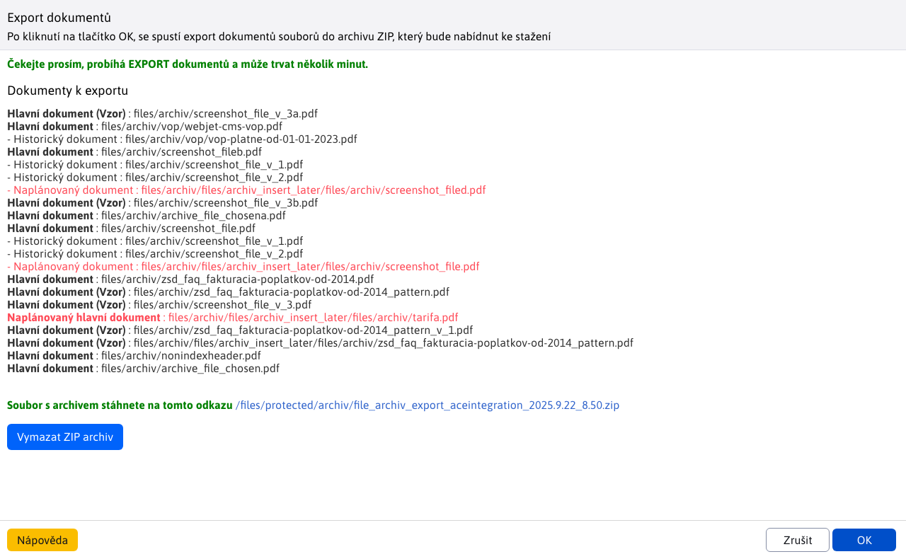
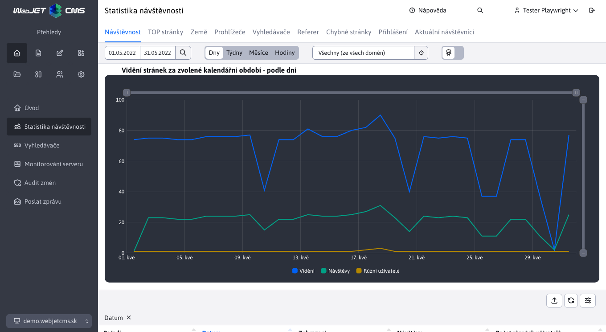

# Seznam změn verze 2025

## 2025-SNAPSHOT

> Vývojová verze

## 2025.18

> Verze **2025.18** přináší kompletně předělaný modul **Elektronického obchodu** s podporou **platební brány GoPay** a vylepšeným seznamem objednávek. Aplikace **Kalendář novinek** byla oddělena jako **samostatná aplikace** a zároveň jsme předělali nastavení více aplikací v editoru stránek do nového designu. **Manažer dokumentů** (původně Archiv souborů) prošel **vizuálním i funkčním restartem** včetně nových nástrojů pro správu, export a import dokumentů.
>
> Vylepšen byl i systém **Hromadného e-mailu** s novými možnostmi pro odesílatele a pohodlnějším výběrem příjemců. **Rezervace** získali nové možnosti jako**nadměrné rezervace**, vytváření rezervací zpětně do minulosti a zasílání notifikací na specifické emaily pro každý rezervační objekt.
>
> Optimalizovali jsme počet souborů v **Průzkumníku**, což vede k **rychlejšímu načítání** a přidali nové informace do **Monitorování serveru**.

### Průlomové změny

- Aplikace Kalendář novinek oddělena do samostatné aplikace, pokud kalendář novinek používáte je třeba upravit cestu `/components/calendar/news_calendar.jsp` na `/components/news-calendar/news_calendar.jsp` (#57409).
- Upravená inicializace Spring a JPA, více informací v sekci pro programátora (#43144).
- Předělaná backend část aplikace elektronický obchod, více v sekci pro programátora (#57685).

### Datové tabulky

- Při nastavení filtru číselné hodnoty od-do se pole zvětší pro lepší zobrazení zadané hodnoty podobně jako to dělá datové pole (#57685).
- Aplikace Archiv souborů byla předělána na Spring aplikaci. Bližší informace naleznete v sekci pro programátora (#57317).
- Aplikace Elektronický obchod byla na `BE` části předělaná. Bližší informace naleznete v sekci pro programátora (#56609).

### Manažer dokumentů (Archiv souborů)

- **Seznam souborů** předělaný do nového designu s přidáním nové logiky oproti staré verzi. Více se dočtete v části [Archiv souborů](redactor/files/file-archive/README.md) (#57317).

- **Manažer kategorií** opraven a předělán do nového designu. Více se dočtete v části [Manažer kategorií](redactor/files/file-archive/category-manager.md) (#57317).
- **Manažer produktů** byl přidán jako nová sekce. Více se dočtete v části[Manažer produktů](redactor/files/file-archive/product-manager.md) (#57317).
- **Export hlavních souborů** byl upraven tak, aby nabízel širší možnosti exportu souborů a zlepšil přehlednost výpisů. Více se dočtete v části [Export hlavních souborů](redactor/files/file-archive/export-files.md) (#57317).

- **Import hlavních souborů** byl opraven a upraven, aby dokázal pracovat s rozšířenými možnostmi exportu. Více se dočtete v části [Import hlavních souborů](redactor/files/file-archive/import-files.md) (#57317).
- **Indexování** dokumentů ve vyhledávačích typu `Google` upraveno tak, aby se neindexovaly staré/historické verze dokumentů a dokumenty mimo datum platnosti (nastavená HTTP hlavička `X-Robots-Tag=noindex, nofollow`). Indexování těchto dokumentů lze povolit v editoru v manažerovi dokumentů (#57805).

### Aplikace

Předěláno nastavení vlastností aplikací v editoru ze starého kódu v `JSP` na `Spring` aplikace. Aplikace automaticky získávají i možnost nastavit [zobrazení na zařízeních](custom-apps/appstore/README.md#podmíněné-zobrazení-aplikace). Design je ve shodě se zbytkem WebJET CMS a datových tabulek (#57409).
- [Anketa](redactor/apps/inquiry/README.md)
- [Bannerový systém](redactor/apps/banner/README.md)
- [Datum a čas, Datum a svátek](redactor/apps/app-date/README.md) - sloučeno do jedné společné aplikace
- [Dotazníky](redactor/apps/quiz/README.md)
- [Hromadný e-mail](redactor/apps/dmail/form/README.md)
- [Kalendář událostí](redactor/apps/calendar/README.md)
- [Kalendář novinek](redactor/apps/news-calendar/README.md)
- [Mapa stránek](redactor/apps/sitemap/README.md)
- [Média](redactor/webpages/media.md)
- [Příbuzné stránky](redactor/apps/related-pages/README.md)
- [Rating](redactor/apps/rating/README.md)
- [Rezervace](redactor/apps/reservation/reservation-app/README.md)

- Zrychlené načtení dat aplikace v editoru - data jsou vložena přímo ze serveru, není třeba provést volání REST služby (#57673).
- Upravený vizuál - název aplikace při vkládání do stránky přesunut do hlavního okna (namísto původního nadpisu Aplikace) pro zvětšení velikosti plochy pro nastavení aplikaci (#57673).

- Doplněny fotky obrazovky aplikací v české jazykové mutaci pro většinu aplikací (#57785).

### Hromadný e-mail
- **Přesunuté pole Web stránka** – nyní se nachází před polem **Předmět**, aby se po výběru stránky předmět automaticky vyplnil podle názvu zvolené web stránky (#57541).
- **Úprava pořadí v kartě Skupiny** – e-mailové skupiny jsou nyní zobrazeny před skupinami uživatelů (#57541).
- **Nové možnosti pro jméno a e-mail odesílatele** – jsou-li konfigurační proměnné `dmailDefaultSenderName` a `dmailDefaultSenderEmail` nastaveno, použijí se tyto hodnoty. Pokud jsou prázdné, systém automaticky vyplní jméno a e-mail aktuálně přihlášeného uživatele. (#57541)
  - Pomocí těchto proměnných lze nastavit **fixní hodnoty** (např. název společnosti) pro všechny [kampaně](redactor/apps/dmail/campaings/README.md), bez ohledu na to, kdo je přihlášen.

- Hromadný email - optimalizace tvorby seznamu příjemců - karta [skupiny](redactor/apps/dmail/campaings/README.md#přidání-ze-skupiny) přesunuta do dialogového okna. Po zvolení skupiny příjemců je ihned vidíte v kartě Příjemci a umíte je snadno upravovat, již není potřeba email nejprve uložit pro zobrazení příjemců (#57537).

- Odhlášení - při přímém zadání emailu na odhlášení (ne kliknutí na odkaz v emailu) je zaslán na zadanou email adresu potvrzující email. V něm je třeba kliknout na odkaz pro odhlášení. Původní verze nekontrolovala žádným způsobem platnost/vlastnictví email adresy a bylo možné odhlásit i cizí email (#57665).

### Kalendář novinek

- Kalendář novinek oddělen jako samostatná aplikace, původně to byla možnost v aplikaci Kalendář (#57409).
- Zobrazuje kalendář napojený na seznam novinek s možností filtrovat novinky podle zvoleného data v kalendáři.

### Monitorování serveru

- Doplněna tabulka s informací o databázových spojeních a obsazené paměti (#54273-61).
- Doplněna informace o verzi knihoven`Spring (Core, Data, Security)` do sekce Monitorování serveru-Aktuální hodnoty (#57793).

### Rezervace

- **Podpora pro nadměrnou rezervaci** – umožňuje administrátorům vytvořit více rezervací `overbooking` na tentýž termín (#57405).
- **Vylepšená validace při importu** – nyní lze importovat [rezervace](redactor/apps/reservation/reservations/README.md) i do minulosti, nebo vytvořit `overbooking` rezervace při importu údajů (#57405).
- **Podpora pro přidání rezervace do minulosti** – umožňuje administrátorům vytvořit rezervace v minulosti (#57389).
- Do [rezervačních objektů](redactor/apps/reservation/reservation-objects/README.md) byl přidán sloupec **Emaily pro notifikace**, který pro každý zadaný platný email (oddělený čárkou) odešle email pokud byla rezervace přidána a schválena (#57389).
- Notifikacím pro potvrzení rezervace a dalším systémovým notifikacím lze nastavit jméno a email odesílatele pomocí konfiguračních proměnných `reservationDefaultSenderName,reservationDefaultSenderEmail` (#57389).
- Přidána nová aplikace [Rezervace dní](redactor/apps/reservation/day-book-app/README.md), pro rezervaci celodenních objektů na určitý interval pomocí integrovaného kalendáře (#57389).

### Elektronický obchod

!> **Upozornění:** z důvodu aktualizace databáze může první start serveru trvat déle - do databáze se vypočítají hodnoty pro počet položek a cenu pro rychlejší načtení seznamu objednávek.
- Přidána karta **Osobní informace** do seznamu objednávek - obsahuje podrobné informace o **adrese doručení** jakož i **kontaktní informace** vše na jednom místě (#57685).
- Přidána karta **Volitelná pole** do seznamu objednávek - [volitelná pole](frontend/webpages/customfields/README.md) podle potřeby implementace (#57685).
- Export seznamu objednávek - doplněné sloupce celková cena s DPH a počet položek (#57685).
- Formulář pro objednání - doplněna možnost definovat dostupný seznam zemí přes konfigurační proměnnou `basketInvoiceSupportedCountries` (#57685).
- Upravené zobrazení údajů z karty **Osobní údaje** v seznamu objednávek, jejich logické rozdělení do částí pro lepší přehled (#57685).
- V seznamu objednávek byly přidány sloupce **Počet položek**, **Cena bez DPH** a **Cena s DPH**. Hodnoty se automaticky přepočítají při změně položek objednávky (#57685).
- Do seznamu položek doplněna možnost zobrazení web stránky produktu kliknutím na ikonu, produkt se zobrazí také v kartě Náhled při otevření editoru položky (#57685).
- V seznamu objednávek předělán výběr země přes výběrové pole, který nabízí pouze země definované konstantou `basketInvoiceSupportedCountries` (#57685).

- Nová verze[konfigurace způsobů platby](redactor/apps/eshop/payment-methods/README.md) a integrace na platební brány. Údaje jsou odděleny podle domén. Přidali jsme podporu [platební brány GoPay](https://www.gopay.com), což znamená i akceptaci platebních karet, podporu `Apple/Google Pay`, platby přes internet banking, `PayPal`, `Premium SMS` atd. Kromě toho jsou podporovány platby převodem a dobírka Pro každý typ platby je možné nastavit i cenu, která při zvolení možnosti bude automaticky připočtena k objednávce.

- Nová aplikace Seznam objednávek se seznamem objednávek aktuálně přihlášeného uživatele. Klepnutím na objednávku lze zobrazit detail objednávky a stáhnout ji v PDF formátu (#56609).

### Jiné menší změny

- Vyhledávání v administraci - upravené rozhraní na vlastní `RestController` a `Service` (#57561).
- Průzkumník - rychlejší načítání a nižší zatížení serveru snížením počtu souborů/požadavek na server (#56953).

### Oprava chyb

- Hromadný email - při duplikování kampaně doplněno duplikování seznamu příjemců (#57533).
- Datové tabulky - import - upravená logiky **Přeskočit vadné záznamy** při importu tak, aby se při této možnosti zpracovaly i generické chyby `Runtime` a bylo zajištěno dokončení importu bez přerušení. Tyto chyby se následně zobrazí uživateli pomocí notifikace v průběhu importování (#57405).
- Soubory - opraven výpočet velikosti souborů/složek v patičce průzkumníka a při zobrazení detailu složky (#57669).
- Navigace - opravená navigace pomocí karet v mobilním zobrazení (#57673).
- Autocomplete - opravená chyba u pole typu `Autocomplete`, kde první získaná hodnota v případě `jstree` nebyla korektní (#57317).

### Pro programátora

!> **Upozornění:** upravená inicializace Spring a JPA, postupujte podle [návodu v sekci instalace](install/versions.md#změny-při-přechodu-na-20250-snapshot).

Jiné změny:
- Přidána možnost provést [doplňkový HTML/JavaScript kód](custom-apps/appstore/README.md#doplňkový-html-kód) ve Spring aplikaci s anotací `@WebjetAppStore` nastavením atributu `customHtml = "/apps/calendar/admin/editor-component.html"` (#57409).
- V datatable editoru přidán typ pole [IMAGE\_RADIO](developer/datatables-editor/standard-fields.md#image_radio) pro výběr jedné z možnosti pomocí obrázku (#57409).
- Přidán typ pole `UPLOAD` pro [nahrání souboru](developer/datatables-editor/field-file-upload.md) v editoru datatabulky (#57317).
- Při inicializaci[vnořené datatabulky](developer/datatables-editor/field-datatable.md) přidána možnost upravit `columns` objekt zadáním JavaScript funkce do atributu `data-dt-field-dt-columns-customize` anotace (#57317).
- Přidána podpora pro získání jména a emailu odesílatele pro různé emailové notifikace použitím `SendMail.getDefaultSenderName(String module, String fallbackName), getDefaultSenderEmail(String module, String fallbackEmail)` (#57389).
- Přidána možnost nastavit kořenovou složku pro [pole typu JSON](developer/datatables-editor/field-json.md) ve formátu ID i cesty: `@DataTableColumnEditorAttr(key = "data-dt-field-root", value = "/Aplikácie/Atribúty stránky")` nebo `@DataTableColumnEditorAttr(key = "data-dt-field-root", value = "26")`.
- Spuštění úloh na pozadí se provede až po kompletní inicializaci včetně `Spring` (#43144).
- Doplněna možnost nastavit [všechny vlastnosti HikariCP](install/setup/README.md#vytvoření-db-schématu) (#54273-61).
- Doplněna kontrola, zda databázový ovladač podporuje nastavení sekvencí (#54273-61).
- Upravená funkce `WJ.headerTabs`, pokud posloucháte na změnu karty doporučujeme použít událost typu `$('#pills-tabsFilter a[data-wj-toggle="tab"]').on('click', function (e) {`, kde v `e` získáte kartu, na kterou se kliklo (#56845-20250325).
- Předělaná aplikace Manažer dokumentů (Archiv souborů) na Spring aplikaci. Pokud používáte původní verzi a chcete ji zachovat, musíte přidat zpět soubory `/components/file_archiv/file_archiv.jsp` a `components/file_archiv/editor_component.jsp` a potřebné třídy ze [starší verze WebJET CMS](https://github.com/webjetcms/webjetcms/tree/release/2025.0/src/webjet8/java/sk/iway/iwcm/components/file_archiv).
- Manažer dokumentů (Archiv souborů) - upravené API `FileArchivatorBean.getId()/getReferenceId()/saveAndReturnId()` vrátí `Long`, můžete použít `getFileArchiveId()` pro včetně `int` hodnoty. Smazané nepoužívané metody, v případě jejich potřeby je přeneste do vašich tříd. Nedoporučujeme modifikovat WebJET třídy, vytvořte si nové třídy typu.`FileArchivatorProjectDB` ve vašem projektu kde metody přidáte. Pokud jsme smazali celou třídu, kterou používáte (např. `FileArchivatorAction`), můžete si ji přímo přidat do vašeho projektu (#57317).
- Přidáno automatické nastavení filtrování sloupce na hodnotu `false`, v případě že hodnota je `null` (nenastavená) a jde o sloupec, který je vnořený, jako např. `editorFields` sloupce (#57685).
- Přidána možnost [speciálního uspořádání](developer/datatables/restcontroller.md#uspořádání) přepsáním metody `DatatableRestControllerV2.addSpecSort(Map<String, String> params, Pageable pageable)` (#57685).
- Přidána možnost v anotaci `@DataTableColumn` nastavit atribut `orderProperty` který určí[sloupce pro uspořádání](developer/datatables/restcontroller.md#uspořádání) Např. `orderProperty = "contactLastName,deliverySurName"`. Výhodné pro `EditorFields` třídy, které mohou agregovat data z více sloupců (#57685).
- Pro pole typu `dt-tree-dir-simple` s nastaveným `data-dt-field-root` doplněna stromová struktura rodičovských složek pro lepší[zobrazení stromové struktury](developer/datatables-editor/field-json.md) (předtím se složky zobrazovaly až od zadané kořenové složky). Přidána možnost definovat seznam složek, které se ve stromové struktuře nezobrazí pomocí konfigurační proměnné nastavené do `data-dt-field-skipFolders`.
- Výběrové [pole s možností editace](developer/datatables-editor/field-select-editable.md) upraveno tak, aby po přidání nového záznamu byl tento záznam automaticky v poli zvolen (#57757).
- Předělaná aplikace Elektronický obchod na `BE` části. Jelikož se využívají již nové třídy, pro správné fungování musíte:
  - využít aktualizační skript `/admin/update/update-2023-18.jsp` pro základní aktualizaci vašich JSP souborů
  - nakolik se nyní využívá typ `BigDecimnal` místo `float`, musíte navíc upravit všechna srovnání těchto hodnot. Typ `BigDecimal` se nesrovnává klasicky pomocí `<, =, >` ale pomocí `BigDecimal.compareTo( BigDecimal )`
  - musíte odstranit volání souborů, nebo zpětně přidat všechny soubory, které byly odstraněny, protože nebyly využívány

### Testování

- Média - doplněný test vkládání médií ve web stránce pokud uživatel nemá právo na všechna média (#57625).
- Web stránky - doplněný test vytvoření nové stránky s publikováním v budoucnosti (#57625).
- Galerie - doplněn test vodoznaku s porovnáním obrázku, doplněn test kontroly práv (#57625).
- Web stránky - doplněný test volitelných polí při vytváření web stránky (#57625).
- Allure - doplněné výsledky jUnit testů do společného Allure reportu (#57801).

## 2025.0.x

> Opravná verze původní verze 2025.0.

### Oprava chyb

- Datové tabulky - opraveno chybné zobrazení karet, které se nemají zobrazovat při vytváření nového záznamu (např. v šablonách) (#57533).
- Datové tabulky - doplněný limit počtu záznamů při zobrazení všechny. Hodnota je shodná s maximálním počtem řádků pro exportu, nastavuje se v konfigurační proměnné `datatablesExportMaxRows` (#57657-2).
- Datové tabulky - opravený počet záznamů na straně když stránka obsahuje navigační karty (#57725-1).
- Datové tabulky - opravený nadpis Duplikovat místo Upravit při duplikování záznamu, upravena ikona tlačítka pro duplikování (#57725-3).
- Datové tabulky - sjednocený název `ID` sloupce z původních`ID, Id, id` na sjednocený `ID`. Pro `DataTableColumnType.ID` není třeba nastavit `title` atribut, automaticky se použije klíč `datatables.id.js`. Některé překladové klíče smazány, protože nejsou nutné (#49144)
- Editor obrázků - při editaci obrázku ze vzdáleného serveru doplněna notifikace o potřebě stažení obrázku na lokální server (#57657-2).
- Web stránky - opraveno vložení bloku obsahující aplikaci (#57657-2).
- Web stránky - doplněn `ninja` objekt při vkládání aplikace do nové webové stránky (#57389).
- Web stránky - stránky v koši se již nebudou zobrazovat v kartě Neschváleno, pokud schvalovatel klikne na odkaz v emailu zobrazí se chyba Stránka je v koši, aby se náhodou neschválila stránka, která byla mezi tím smazána (#54273-62).
- Web stránky - schvalování - opraveno načtení seznamu v kartě Neschváleno při použití databázového serveru `Oracle` (#54273-62).
- Web stránky - opravená aktualizace nodů clusteru při změně značek (#57717).
- Web stránky - opraveno zobrazení seznamu stránek pokud má uživatel právo pouze na vybrané webové stránky (#57725-4).
- Web stránky - doplněný přepínač domén i když není nastavena konfigurační proměnná `enableStaticFilesExternalDir` ale jen `multiDomainEnabled` (#57833).
- Aplikace - opraveno zobrazení karty překladové klíče při použití komponenty `editor_component_universal.jsp` (#54273-57).
- Aplikace - přidána podpora vkládání nového řádku přes klávesovou zkratku `SHIFT+ENTER` do jednoduchého textového editoru používaného např. v Otázky a odpovědi (#57725-1).
- Číselníky - přesunutý výběr číselníku přímo do nástrojové lišty datové tabulky (#49144).
- Novinky - přesunutý výběr sekce přímo do nástrojové lišty datové tabulky (#49144).
- Přihlášení - opravena chyba přihlášení při exspirování časové platnosti hesla (#54273-57).
- Přihlášení - opravené přihlášení v multiweb instalaci (#54273-57).
- GDPR - opravené zobrazení karty Čištění databáze při použití `Oracle/PostgreSQL` databáze (#54273-57).
- Archiv souborů - opraveno zobrazení ikon v dialogu data a času (#54273-57).
- Bezpečnost - aktualizovaná knihovna `Swagger UI` na verzi `5.20.0`, doplněné výjimky v `dependency-check-suppressions.xml`.
- Aktualizace - doplněno mazání nepotřebných souborů při aktualizaci rozbalené verze (#57657-4).
- Multiweb - doplněná kontrola `ID` domény při registraci návštěvníka web sídla (#57657-4).
- Uživatelé - přidána možnost vybrat také Kořenovou složku v právech uživatele v sekci Nahrávání souborů do adresářů (54273-60).
- Uživatelé - upravené nastavení práv - zjednodušené nastavení práv administrátorů a registrovaných uživatelů (již není třeba zvolit i právo Uživatelé), opravené duplicitní položky, upravené seskupení v sekci Šablony (#57725-4).
- Průzkumník - doplněna lepší hlášení při chybě vytvoření ZIP archivu (#56058).
- Statistika - opraveno vytvoření tabulky pro statistiku kliknutí v teplotní mapě.
- Překladač - implementace inteligentního zpoždění pro překladač `DeepL` jako ochrana proti chybě `HTTP 429: too many requests`, která způsobovala výpadek překladů (#57833).
- Klonování struktury - opraveno nechtěné překládání implementace aplikací `!INCLUDE(...)!`, při automatickém překladu těla stránky (#57833).
- Klonování struktury - přidán překlad perex anotace automatickém překladu stránek (#57833).
- Průzkumník - opravena práva nastavení vlastností složky a souboru (#57833).
- Monitorování serveru - opraveno hlášení o nastavení konfigurační proměnné pro Aplikace, WEB stránky a SQL dotazy (#57833).
- Úvod - opraveno zobrazení požadavku na dvoustupňové ověřování při integraci přes `IIS` (#57833).
- Klonování/zrcadlení struktury - opraveno nastavení URL adresy složky (odstranění diakritiky a mezer) (#57657-7).
- Galerie - doplněno chybějící značky (#57837).
- Značky - opraveno nastavení složek existující značky v sekci Zobrazit pro (#57837).

### Bezpečnost

- Aktualizovaná knihovna `Apache POI` na verzi 5.4.1 pro opravu zranitelností`CVE-2025-31672`.

## 2025.0

> Ve verzi **2025.0** jsme přinesli **nový design administrace** pro ještě lepší přehlednost a uživatelský komfort.
>
> Jednou z hlavních změn je přesunutí **druhé úrovně menu** do **karet v hlavičce stránky**, čímž se zjednodušila navigace. Ve webových stránkách jsme také **sloučily karty složek a webových stránek**, abyste měli vše přehledně na jednom místě. Pokud hlavička neobsahuje karty, tabulky se automaticky přizpůsobí a zobrazí **řádek navíc**.
>
> Prosíme vás o zpětnou vazbu prostřednictvím **formuláře Zpětná vazba**, pokud při používání nové verze identifikujete **jakýkoli problém se zobrazením**. Připomínku můžete doplnit io **fotku obrazovky**, což nám pomůže rychleji identifikovat a vyřešit případné nedostatky.
>
> Děkujeme za spolupráci a pomoc při vylepšování WebJET CMS!

### Průlomové změny

- Web stránky - zrušena inline editace. Možnost přímé editace stránky v režimu jejího zobrazení byla odstraněna, jelikož využívala starší verzi editoru, která již není podporována. Jako alternativu lze aktivovat [nástrojový panel](redactor/webpages/editor.md#nástrojový-panel) zobrazován v pravém horním rohu webové stránky. Tento panel umožňuje rychlý přístup k editoru web stránky, složky nebo šablony. Můžete vypnout nebo zapnout pomocí konfigurační proměnné `disableWebJETToolbar`. Po aktivaci se začne zobrazovat na webové stránce po vstupu do sekce Webové stránky v administraci (#57629).

- Přihlášení - pro administrátory nastavena [požadavek na změnu hesla](sysadmin/pentests/README.md#pravidla-hesel) jednou za rok. Hodnotu lze upravit v konfigurační proměnné `passwordAdminExpiryDays`, nastavením na hodnotu 0 se kontrola vypne (#57629).
- Úvod - přidán požadavek na aktivaci dvoustupňového ověřování pro zvýšení bezpečnosti přihlašovacích údajů. Výzva se nezobrazuje, pokud je ověřování řešeno přes `LDAP` nebo je-li překladový klíč `overview.2fa.warning` nastaven na prázdnou hodnotu (#57629).

### Design

Ve verzi **2025.0** jsme přinesli vylepšený **design administrace**, který je přehlednější a efektivnější.

**Upravený přihlašovací dialog** – nové pozadí a přesunutí přihlašovacího dialogu na pravou stranu. Na **přihlášení** je možné použít nejen přihlašovací jméno ale **už i email adresu**. 

**Přehlednější hlavička** – název aktuální stránky nebo sekce se nyní zobrazuje přímo v hlavičce.

**Nová navigace v levém menu** – pod položky již nejsou součástí levého menu, ale zobrazují se **jako karty v horní části** stránky. 

**Sloučené karty v sekci Webové stránky** – přepínání typů složky a typů webových stránek se nyní zobrazují ve společné části, čímž se zjednodušila navigace. **Výběr domény** byl přesunut na spodní část levého menu. 

**Přeorganizované menu položky**:
- **SEO** přesunuty do sekce **Přehledy**.
- **GDPR a Skripty** přesunuty do sekce **Šablony**.
- **Galerie** je nyní v sekci **Soubory**.
- Některé názvy položek byly upraveny, aby lépe vystihovaly jejich funkci.

### Web stránky

- Přidána možnost nastavit inkrement pořadí uspořádání pro složky v konfigurační proměnné `sortPriorityIncrementGroup` a web stránky v konfigurační proměnné `sortPriorityIncrementDoc`. Výchozí hodnoty jsou 10 (#57667-0).

### Testování

- Standardní heslo pro `e2e` testy se získá z `ENV` proměnné `CODECEPT_DEFAULT_PASSWORD` (#57629).

### Oprava chyb

- Webové stránky - vkládání odkazů na soubor v PageBuilder (#57649).
- Webové stránky - doplněné informace o odkazu (typ souboru, velikost) do atributu Pomocný titulek `alt` (#57649).
- Webové stránky - opravené nastavení pořadí uspořádání web stránek při použití `Drag&Drop` ve stromové struktuře (#57657-1).
- Webové stránky - při duplikování webové stránky/složka se nastaví hodnota `-1` do pole Pořadí uspořádání pro zařazení na konec seznamu. Hodnotu `-1` můžete také zadat ručně pro získání nové hodnoty pořadí uspořádání (#57657-1).
- Webové stránky - import webových stránek - opraveno nastavení média skupin při importu stránek obsahujících média. Při importu se automaticky vytvoří všechna Média skupiny (i nepoužívaná) z důvodu, že se při importu stránek překládá i média skupina nastavená pro média aplikaci `/components/media/media.jsp` ve stránce (ta může obsahovat i ID média skupiny mimo importované stránky) (#57657-1).
- Firefox - snížená verze sady `Tabler Icons` na `3.0.1`, protože Firefox při použití novějších verzí výrazně zatěžuje procesor. Optimalizované čtení CSS stylu `vendor-inline.style.css` (#56393-19).

Zbývající seznam změn změn je shodný s verzí [2024.52](CHANGELOG-2024.md).

