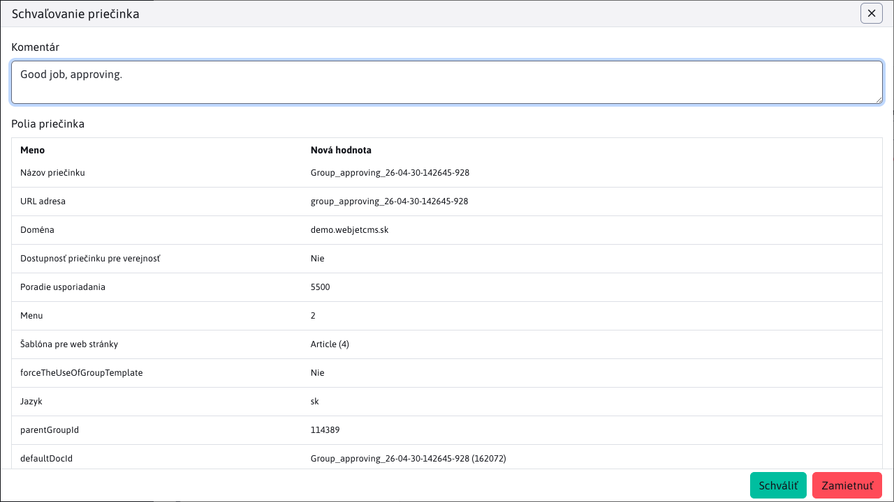
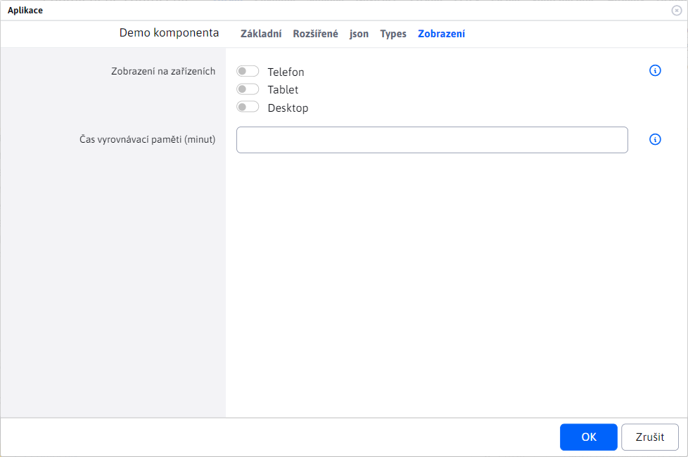
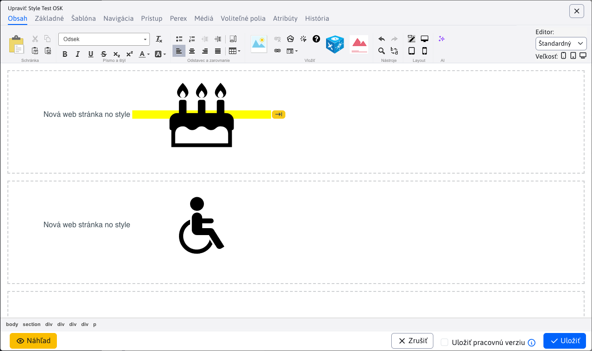
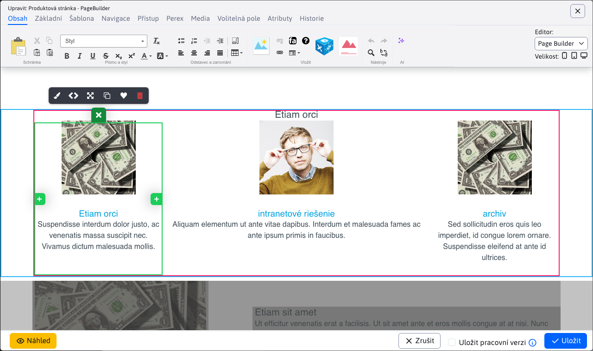
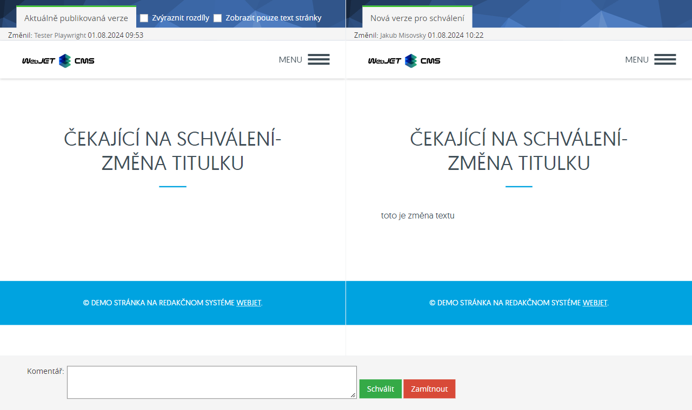
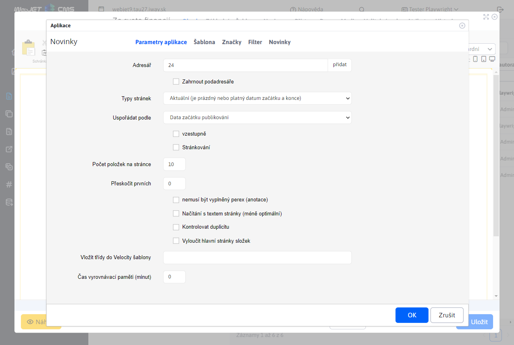
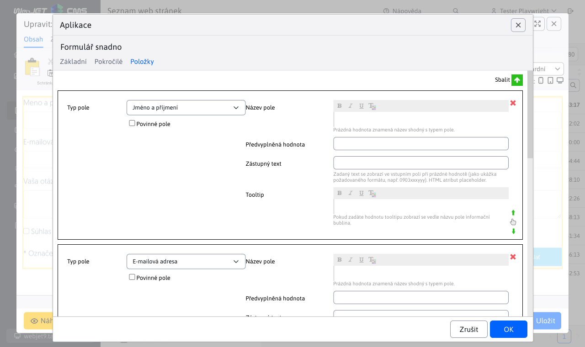
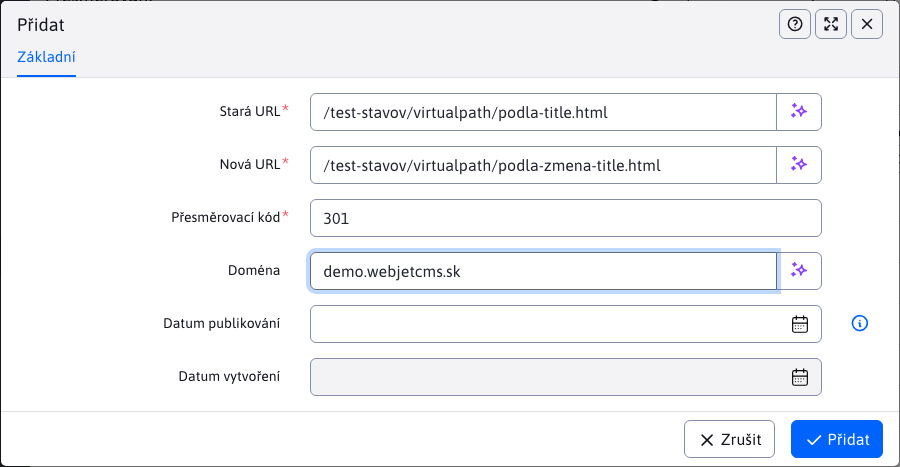
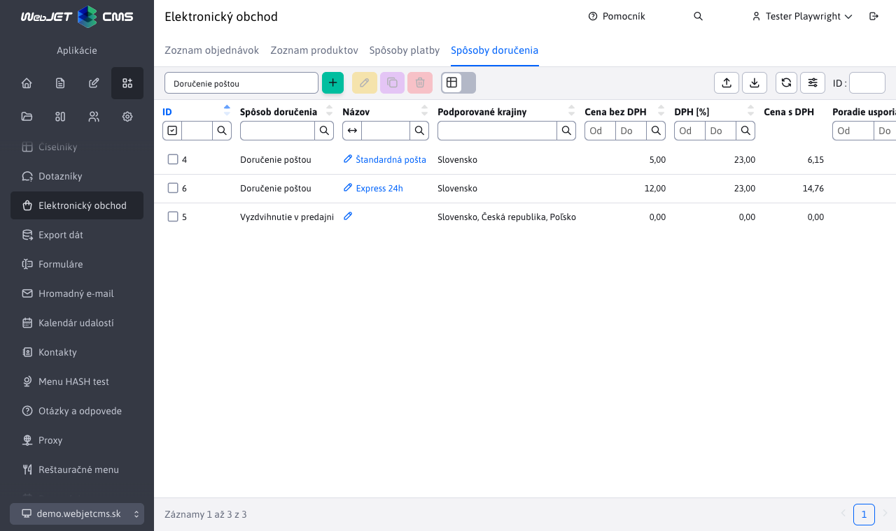
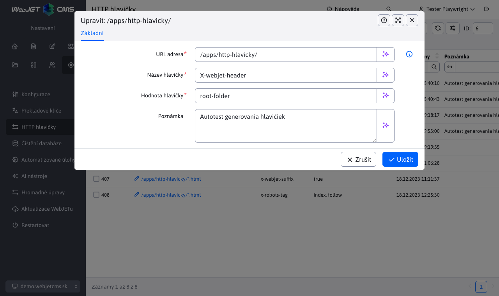

# Seznam změn verze 2026

## 2026.0-SNAPSHOT

> Vývojová verze aktualizovaná z main repozitáře.

### Webové stránky

- Šablony - přidána možnost nastavit přesun `<style>` a `<link rel="stylesheet">` značek z těla stránky do `<head>` přes [volbu v šabloně](frontend/templates/templates.md) s podporou globální konfigurační proměnné `showDocMoveStyleToHead`. Bloky v IE podmínkách, `noscript` a `script` zůstávají na místě (#231).

### Aplikace

- Přidána nová aplikace [Přesměrování podle jazyka](redactor/apps/language-redirect/README.md) pro automatické přesměrování návštěvníků na jazykovou verzi stránky podle detekce jazyka z HTTP hlavičky `Accept-Language`. Podporuje až 8 přiřazení jazyků na URL adresy, respektování jazykového cookie a možnost přesměrování pouze na kořenové URL (#58497).

### Dokumentace

- Vytvořena nová sekce [Obchodní informace](sales/README.md) která obsahuje popisy vlastností a funkcionalit WebJET CMS z pohledu prodeje (#58505).
- Vytvořená sekce [Řešení problémů](sysadmin/troubleshooting/README.md) v manuálu pro provoz.

## 2026.18

> WebJET CMS 2026.18 přináší **schvalování změn složek** s podporou víceúrovňového schvalování a **testování přístupnosti** integrované přímo do automatizovaných testů.
>
> V editoru stránek můžete nyní **maximalizovat dialogová okna** při nastavování aplikací, vkládání obrázků či odkazů. Nastavení aplikace zároveň získalo nové možnosti pro atributy přístupnosti (aria) a **vlastní CSS styly** zobrazení.
>
> V oblasti bezpečnosti přibyla **podpora přihlašování přes OAuth2/Keycloak/Google/Facebook** a **Přístupové klíče** (PassKey/WebAuthn), spolu s vylepšeními pro stabilnější provoz v klastrovém prostředí.

!>**Upozornění:** Verze určená pro `jakarta namespace`, vyžaduje aplikační server Tomcat 11, používá Spring verze 7. Před aktualizací [zkontrolujte požadavky](install/versions.md#změny-při-přechodu-na-jakarta-verzi).

### Průlomové změny

- Vyžadován je aplikační server Tomcat 11, verze 10 již není podporována (#58385).
- Odstraněné historické aplikace `/components/adresar/editor_component.jsp` a `/components/sharing_icons/editor_component.jsp`, které se již nepoužívaly. Chcete-li je nadále používat, stáhněte si z platformy [GitHub](https://github.com/webjetcms/webjetcms/tree/hotfix/2026.0-main/src/main/webapp/components) (#57409).

### Webové stránky

- Schvalování - přidáno [schvalování změn složek](redactor/webpages/approve/README.md) včetně schvalování vytvoření, editace a smazání složky. Schvalovatel obdrží email s přehledem změn a možností schválit nebo zamítnout změnu. Podporováno je i víceúrovňové schvalování (#58405).

- Schvalování složek - v kartě `Na schválenie` přidány pod-karty `Dokumenty` a `Priečinky` pro oddělené zobrazení stránek a složek čekajících na schválení (#58405).
- Schvalování složek - přidáno zobrazení sloupce s datem schválení/zamítnutí a jménem schvalovatele v historii změn složek (#58405).
- Aplikace - přidána možnost nastavit [styly zobrazení aplikace](redactor/webpages/working-in-editor/README.md#karta-zobrazení). Můžete tak nastavit například odsazení aplikace ve stránce, šířku nebo různé styly zobrazení, ale také informace pro čtečku pro slabozraké návštěvníky (#osk418).

- Editor stránek - do dialogového okna [Odkaz a Tlačítko](redactor/webpages/working-in-editor/README.md#tlačítka) přidána karta s rozšířenými nastaveními jako ID, titulek, popis pro čtečky (aria-label) a podobně (#osk115).
- Ninja - přidané pole `canonical` jako [volitelné pole Q](frontend/ninja-starter-kit/ninja-jv/page/README.md#informace-o-stránce) pro nastavení kanonické URL adresy stránky. V případě, že je pole prázdné, použije se URL adresa stránky. Hodnotu v šabloně získáte jako `${ninja.page.canonical}`. Přidá do URL parametr `page`, pokud existuje, pro zobrazení správné strany v seznamu novinek (#OSK149, #54273-88).
- Page Builder - opraveno přesouvání okna pro vložení bloků, opraveno překrývání výběru režimu editoru, zapracovány UX připomínky (#58353).
- Sjednocené používání nástroje `ImageMagick` pro změnu velikostí obrázků mezi galerií a `/thumb servlet` (#osk396).
- Přidána podpora vkládání obrázků ve formátu `webp` včetně zápisu při změně velikosti pomocí nativní knihovny `libwebp` přes `ImageIO` (#osk396).
- Přidáno konfigurační proměnné `imageMagickCustomParams*` pro [nastavení vlastních parametrů](redactor/apps/gallery/README.md#vlastní-parametry-imagemagick) `ImageMagick` operací podle typu operace a formátu obrázku (#osk396).
- Aplikace - doplněná možnost **maximalizovat a minimalizovat** okno pro **vkládání aplikací, obrázku, odkazů** atp. na stránku (#57409).
- Přidána podpora pro automatické obnovení všech provázaných (zrcadlených) stránek a složek z koše, když jedna z nich byla obnovena (#osk423).
- Složka - přidána možnost nastavit HTML kód nové stránky z lokálního Systém/Šablony složky, původně se seznam stránek četl podle konfigurační proměnné `tempGroupId` (#57409).
- Upravené názvosloví [volitelných polí](frontend/ninja-starter-kit/ninja-jv/page/README.md) pro SEO hodnoty (#228).
- Přidána ikona pro přesun [kurzoru na těžko dostupné místo](redactor/webpages/working-in-editor/README.md#vkládání-textu-na-těžko-dostupná-místa), jako například za poslední SVG ikonu v řádku a podobně (#osk105).

### Aplikace

Předěláno nastavení vlastností aplikací v editoru ze starého kódu v `JSP` na `Spring` aplikace. Aplikace automaticky získávají také možnost nastavit [zobrazení na zařízeních](custom-apps/appstore/README.md#podmíněné-zobrazení-aplikace). Design je ve shodě se zbytkem WebJET CMS a datových tabulek (#57409).

- [Anketa snadno](redactor/apps/inquiry/inquiry-simple.md)

- [Mapa](redactor/apps/map/README.md)

- [Doporučení](redactor/apps/app-testimonials/README.md)

- [Předpřipravené bloky (HTMLBox)](redactor/apps/htmlbox/README.md)

- Video - přidána možnost nastavit [CSS třídy pro poměr stran videa](redactor/apps/video/README.md#konfigurace), možnosti zobrazené v aplikaci se nastavují přes konfigurační proměnné `videoClasses`, `videoWrapperClass` a `videoItemClass` (#osk496).

### Formuláře

- Přidána karta [Statistika](redactor/apps/multistep-form/stat.md) pro zobrazení odpovědí formulářů ve formě grafů (#58333).

- Pro vícekrokové formuláře přidán sloupec **Trvání vyplnění**, který zobrazuje jak dlouho trvalo vyplnění formuláře uživatelem (čas od jeho zobrazení po odeslání) (#58333).

### Galerie

- Přidána možnost přesouvat složky galerie přímo v editoru změnou nadřazené složky. Podrobnosti naleznete v části [Správa struktury](redactor/apps/gallery/structure.md) (#58433).
- Vylepšené zpracování přesunu složek galerie s cílem zabránit vzniku neplatných odkazů. Více informací v části [přemístění složky Galerie](redactor/apps/gallery/structure.md#přemístění-složky-galerie) (#58433).
- Přidána podpora pro filtrování složek galerií podle aktuálního ale i původního/souborového názvu složky galerie ve stromové struktuře (#58445).
- Přidána podpora pro [zobrazení původního/souborového názvu složky](redactor/apps/gallery/structure.md#nastavení-zobrazení-stromové-struktury) galerie ve stromové struktuře. Jméno složky na disku může být jiné než hezké jméno zadané ve vlastnostech galerie (#58445).

### Manažer dokumentů

- Přidáno zobrazení hodnoty **Globální Id** pro dokumenty (#58357).
- Přidána možnost zvolit dokumenty k zobrazení v aplikaci pomocí jejich `globalId` hodnoty ve vnořené tabulce, více v části [Karta - Vybrané dokumenty](redactor/files/file-archive/file-archive-app.md#karta---vybrané-dokumenty) (#58357).

### Přístupnost

- Přidáno [automatizované testování přístupnosti](developer/testing/a11y.md) (a11y / WCAG) pomocí `axe-core` integrovaných do CodeceptJS. Testy pokrývají úrovně WCAG 2.0/2.1/2.2 AA (#58389).
- Zlepšená přístupnost / opraveno WCAG chyby na stránkách:
  - Přihlášení do administrace (#58389-2).
  - Úvod / menu položky / hlavička (#58389-3).
  - Zlepšené kontrasty barev v chybových zprávách a hlášeních (#58389-4).
  - Datové tabulky, editor (#58389-4).
- Rozšířené a11y testy o nové scénáře pro správce souborů, sledování, statistiky, nahrávání souborů, správu uživatelů a webové stránky. Metoda `a11y.check()` podporuje parametr `context` pro omezení kontroly na konkrétní část stránky včetně vnořených `iframe` elementů (#58389-5).

### Jiné menší změny

- Galerie - přidána podpora průsvitnosti v `png/webp/gif` obrázcích při změně jejich velikosti, pokud se nepoužívá [ImageMagick](redactor/apps/gallery/README.md#možné-konfigurační-proměnné) (#osk396).
- GitHub pipeline - po `merge pull request` se automaticky vygeneruje příspěvek na sociální sítě pomocí LLM (GitHub Copilot / Google Gemini) a přidá se jako komentář k danému `pull request` spolu s případnými fotkami obrazovky z dokumentace (#177).
- Skripty - přidána možnost nastavit, zda se má skript vkládat v editoru stránek v režimu PageBuilder (#58349).
- Skripty - přidán atribut [Pořadí vkládání](redactor/apps/insert-script/README.md) pro nastavení pořadí vkládání skriptů v rámci stejné pozice. Výchozí hodnota pro stávající skripty je 10, u nového skriptu se automaticky nastaví na nejvyšší hodnotu + 10 (#osk387).
- Editor stránek - opraveno určení složky pro nahrávání obrázků/souborů u nové/ještě neuložené webové stránky s duplicitním názvem: složka nyní odpovídá skutečné URL adrese stránky včetně přípony `-2`, `-3` atd. (#58361).
- Zrcadlení struktury - přidána možnost generovat [odkazy na jazykové mutace](redactor/apps/docmirroring/README.md#nastavení-atributu-hreflang) v hlavičce stránky pomocí aplikace `hreflang.jsp`, odkazy obsahují atribut `hreflang` pro lepší SEO optimalizaci jazykových verzí.
- Stromová struktura - přidáno automatické posunutí na aktuálně zvolený prvek ve stromové struktuře (#58433).
- Aplikace - přidána možnost skrýt pole/karty v editoru aplikace pomocí konfigurační proměnné `appHideFields`. Více se dočtete v části [Skrývání polí/karet](custom-apps/appstore/README.md#skrývání-polikaret) (#58433).
- `imageradio` - ​​přidána možnost nastavit pole typu `imageradio` jako `disabled` (#58333).
- Design všech grafů v celém projektu byl předělán z tmavého na světlý režim pro lepší sladění designu (#58333).

- Aplikace `Tooltip` přejmenovaná na Nápověda (#205).
- Statistika návštěvnosti - upravené filtrování podle složky. Uživatel může zvolit libovolnou složku iz jiných domén, pokud nemá omezená práva na složky nebo má-li právo **Zobrazit statistiku pro všechny složky** (#58453).
- Uživatelé - upravená možnost vidět všechny složky v nastavení **Práva na adresáře a stránky**, pokud má administrátor právo **Správa administrátorů**. Složky jsou zobrazeny iv případě, že administrátor má sám omezená práva na složky (#58453).

### Oprava chyb

- `imageradio` - ​​opraveno zobrazení pole typu `imageradio` v editoru datatabulky (#58333).
- Webové stránky - opraveno obnovení stránky, která byla vytvořena přes zrcadlení a neměla historický záznam, který se dal použít k obnovení (#208).
- Webové stránky - při obnovení stránky z koše se použije historická verze aby se zachoval její původní stav před vymazáním (#208).
- Tlačítko - opravena možnost nastavit vlastnosti tlačítka které je zakázáno (atribut `disabled=disabled`) (#209).
- Fotogalerie - opraveno vyhledávání ve složkách (#58433).
- Soubory - doplněné zachování `.min.js` a `.min.css` v názvu souboru při nahrání do `/files,/images` složek (#213).

### Výkon

- Upraven `PkeyGenerator` pro režim cluster `auto`. Metoda `allocate` obalená do transakce (`setAutoCommit(false)`) s opakováním při `deadlock`. Zlepšené získání bloku iv režimu cluster `auto`, čímž se snižuje počet přístupů do databáze a riziko `deadlock`. Navýšení a čtení hodnoty `pkey_generator` probíhá v jednom atomickém SQL dotazu, což zabraňuje přidělení stejného bloku více uzlům clusteru. Používají se databázově specifické SQL příkazy (#213):

| Databáze | SQL příkaz | Minimální verze |
| --- | --- | --- |
| MySQL | `LAST_INSERT_ID(expr)` | 3.23+ |
| MariaDB | `LAST_INSERT_ID(expr)` | 5.1+ (všechny GA) |
| Microsoft SQL Server | `UPDATE ... OUTPUT inserted` | 2005+ |
| PostgreSQL | `UPDATE ... RETURNING` | 8.2+ |
| Oracle | `RETURNING value INTO` | 10g+ |

- `SeoManager` a `ClusterRefresher` tolerují databázový `deadlock` při `UPDATE/DELETE` operacích bez chybového logu (#213).
- Režim cluster `auto` - ​​přidána konfigurační proměnná `clusterAutoRandomDelay` pro [náhodné zpoždění startu](install/config/README.md#režim-auto) některých úloh, aby se snížilo riziko souběžných databázových konfliktů mezi uzly clusteru (#213).

### Bezpečnost

- Přidán soubor `.github/SECURITY.md` se [odpovědným oznamováním zranitelností](sysadmin/responsible-disclosure/README.md) (#187).
- Aktualizované knihovny `AspectJ, Eclipselink, slf4j, GoPay` (#57793).
- Verze `SpringSecurity` zvýšena na verzi 7 (#56665).
- Přidána možnost přihlašování prostřednictvím [OAuth2/Keycloak/Google/Facebook...](install/oauth2/oauth2.md) (#56665).

    <iframe width="560" height="315" src="https://www.youtube.com/embed/q8xs3qDq-G4" title="YouTube video player" frameborder="0" allow="accelerometer; autoplay; clipboard-write; encrypted-media; gyroscope; picture-in-picture" allowfullscreen></iframe>

- Odstraněny nepoužívané knihovny `lodash,pdfmake`, aktualizovaný seznam `dependency-check-suppressions`, opravena prvotní instalace (#204).
- Opraveno zpracování neplatného hesla při API/BASIC autentifikaci po přechodu na `Spring Security 7`, aby se chyba `password encoder` nepřeměnila na interní výjimku a požadavek byl korektně zamítnut (#58369).
- Přidána podpora přihlašování do administrace přes [Přístupové klíče](redactor/admin/logon.md#použít-přístupový-klíč) `PassKey/WebAuthn` (#58369).

- Uživatelé - pokud vytváření nového uživatele nebo jeho editaci do pole heslo zadáte znak `*` vygeneruje se nové bezpečné heslo a zobrazí se vám v notifikaci (#58369).
- [Skupiny práv](admin/users/perm-groups.md) - přidána možnost nastavit příznak **Přístup ke všem adresářům web stránek** a **Přístup ke všem složkám souborového systému**, které při přihlášení přepíší sečtená práva z ostatních skupin a poskytnou uživateli neomezený přístup k web stránkám nebo souborům2 (#osk
- Aktualizovaná knihovna `Datatables.net/Editor` z verze `2.2.2/2.3.2` na `2.3.7/2.5.2` (#206).

### Dokumentace

- Upravený automatický překladač pro použití Google Translator API v3 (#58301).
- Anglická verze dokumentace nově přeložena (#58301).

### Pro programátora

- AI - nový `AI skill` pro opravu A11Y/WCAG chyb, stačí použít nástroj `/wj-accessibility`.
- Aktualizované závislosti na minimální požadavky pro Tomcat 11 (Tomcat 10 již není podporován). `Stripes` validace - upravené provádění EL výrazů z odstraněného `jakarta.servlet.jsp.el` na `jakarta.el` kvůli kompatibilitě s `jakarta.servlet.jsp-api:4.0.0` (#58385).
- Aktualizovaný způsob zobrazení API dokumentace na standard [OpenAPI 3.0](https://www.openapis.org/). Dokumentace je dostupná na adrese `/admin/swagger-ui/index.html` pro uživatele, kteří mají právo na editaci administrátorů (#57793).
- Administrace - změněn `build` souborů administrace z `webpack` na `rspack`, který je výrazně rychlejší (#206).
- Administrace - sjednocené generování `PUG` šablon pro `watch` a `prod`, odstraněné nepoužívané `npm` build závislosti a historické `webpack` skripty (#206).
- Administrace - doplněno automatické obnovení otevřené stránky při `npm run watch` po změně `JS/CSS/PUG` souborů (#206).
- Administrace - přidán skript `npm run analyze` s HTML reportem velikosti použitých knihoven (#206).
- Datatabulky - přidán nový typ události `DatatableColumnsEvent`, na který lze poslouchat a dynamicky upravit definici sloupců před inicializací tabulky. Více se dozvíte v části [Událost DatatableColumnsEvent](developer/backend/events-datatable.md#událost-DatatableColumnsEvent) (#58433).
- Doplněna knihovna `Jackson v3`, některé JSON objekty nemusí serializovat správně pokud nemají správné `Java Bean` jméno (např. `setcookieId` bez velkého `C`, nebo `set__rowNum__`). Nejlepší řešení je správně nastavit jméno proměnné, případně použít anotaci typu `@JsonProperty("__rowNum__")` i na `getter/setter` (#58369).
- Galerie - upravené volání knihovny ImageMagick, změněné API pro jeho volání na `ImageTools.executeImageMagick(...)` (#osk396).
- Grafy - nástroj/knihovna [chart-tool.js](../../src/main/webapp/admin/v9/src/js/libs/chart/chart-tools.js) pro práci s `amcharts` grafy byl aktualizován, přály se nové funkcionality, nové grafy a vylepšila.
- Grafy - přidána nová třída/knihovna [stats-by-charts.js](../../src/main/webapp/apps/_common/charts/stats-by-charts.js) pro rychlé vytváření celých sekcí statistik s využitím [chart-tool.js](../../src/main/webapp/admin/v9/src/js/libs/chart/chart-tools.js) pro vytváření grafů (#58333).
- Hlavičkové záložky - přidána podpora pod-karet přes funkci `WJ.headerSubTabs()` pro vnořené karty v seznamu Neschváleno ve webových stránkách (#58405).
- Odstraněna anotace `@Temporal` na datových sloupcích v databázových entitách, doporučené řešení je pro nové entity používat `java.time.*` typy. Zdá se, že Eclipselink/JPA správně detekuje typ `Date` jako datum a čas a anotace není nutná. Doporučujeme po aktualizaci zkontrolovat chování datových polí (#57793).
- Třída `PageListHolder/MutableSortDefinition` je ve Spring 7 `Deprecated`, jako přímou náhradu můžete použít naši implementaci `PagedListHolder/SortDefinition` z package `sk.iway.iwcm.system.datatable` (#57793).
- Webové stránky - obnovení z koše - doplněno [publikování událostí](developer/backend/events.md) `ON_RECOVER` a `AFTER_RECOVER` pro obnovu stránek a složek z koše (#161).
- Webové stránky - doplněna možnost upravit karty okně [Styl při použití PageBuilder](frontend/page-builder/blocks.md#podporný-javascript-kód) voláním funkce `window.pbBuildTabMenu`. Umíte tak pro zákazníka zobrazit jen relevantní karty a nastavení bloku (#58345).
- Webové stránky - doplněna možnost volat [vlastní funkci pro čištění HTML kódu](frontend/page-builder/blocks.md#podporný-javascript-kód) po vložení z `Microsoft Office` nebo při získání HTML kódu (#OSK49).
- `WebjetEvent` – přidána možnost nastavit uživatele typu `Identity` přímo do události. Vhodné při zpracování událostí, kde je potřebný uživatel, ale není dostupný `context` nebo `request` (#OSK423).
- `WJ.openIframeModal` - ​​přidána možnost přesouvat dialogové okno uchopením za hlavičku (drag & drop), maximalizovat/minimalizovat okno a definovat vlastní tlačítka v patičce přes parametr `buttons` (#58405).

## 2026.0.x

> Opravná verze původní verze 2026.0.

- Bezpečnost - opravena možnost nastavit [jméno HTTP hlavičky pro získání IP adresy](sysadmin/pentests/README.md#konfigurace) přes proměnnou `xForwardedForHeader`.

## 2026.0.18

> Opravná verze původní verze 2026.0.

- Administrace - doplněné přesměrování po přihlášení pokud původní cesta začíná na `/components` a obsahuje `/admin` (#58317-4).
- Aktualizace WebJETu - opravené odkazy na dokumentaci.
- Bannerový Systém - opraveno načtení seznamu skupin v Microsoft SQL.
- Bezpečnost - přidána možnost [deaktivovat aplikaci](sysadmin/pentests/README.md#deaktivace-aplikace), aby nebyla dostupná. Umíte tak vypnout aplikace jako Zálohování systému, Restartovat a podobně, pokud nasazujete přes `CI-CD` službu a dané aplikace nemají využití, nebo nejsou žádoucí z bezpečnostních důvodů.
- Bezpečnost - aktualizován `Swagger UI` a výjimky pro `dependencyCheckAnalyze` (#58317-6).
- Bezpečnost - aktualizované knihovny `log4j,pdfbox,thymeleaf,postgresql` (#58317-6,#226).
- Bezpečnost - přidána ochrana před brute force útoky na 2FA tokeny. Při neúspěšných pokusech se IP adresa dočasně zablokuje - stejně jako při přihlašování heslem (#222).
- Bezpečnost - generované PDF soubory více neobsahují v meta datech `Creator/Producer` informace o generátoru `PD4ML`. Hodnota se stahuje z konfigurační proměnné `pdfAuthorName`. Čištění metadat je řízeno proměnnou `metadataCleanFiles` (výchozí hodnota `pdf-gen`) (#222).
- Bezpečnost - opraveno zpracování chyby prázdného hesla (#222).
- Datové tabulky - opravena možnost zavření editoru ve vnořeném modálním okně (#OSK303).
- Dotazníky - opraveno ukládání dotazníku při použití databáze Oracle nebo Microsoft SQL (#217).
- Galerie - opraveno uložení nastavení galerie pro složku na disku (bez záznamu v databázi) v Oracle DB.
- Galerie - přidána konfigurační proměnná `metadataRemoveMinFileSize` pro nastavení minimální velikosti souboru v bajtech, pod kterou se přeskočí odstraňování metadat (#osk378).
- GDPR - mazání dat - opraveno mazání formulářů v Oracle/PostgreSQL databázi (#224).
- Hromadný email - opraven přenos příjemců při duplikování kampaně v Oracle DB (#54273-82).
- Hromadný email - opraveno nahrazení externích odkazů, které obsahují více URL parametry v emailu (#54273-83).
- Média - opravena kontrola oprávnění při přidávání médií do neuložené web stránky uživatelům bez práva na všechna média (#58317-6).
- Manažer dokumentů - opraveno smazání indexu souboru při uložení, pokud soubor již není platný. Opraveno iniciální SQL pro nastavení indexování souborů pokud se soubor nemá zobrazovat (#227).
- Multiweb - opraveno nastavení domény po přihlášení (#58317-03).
- Multiweb - opraveno používání doménových aliasů při použití externích složek - nastavena konfigurační proměnná `cloudStaticFilesDir` (#58317-4).
- Překladové klíče - opraveno nastavení prázdných hodnot při vytvoření nového záznamu a odsazení polí s původní hodnotou (#56845).
- Průzkumník - opraveno nahrávání více souborů přes drag & drop (#58317-2).
- Volitelná pole - opraveno zobrazení hodnot (namísto ID) a filtru (výběrové pole namísto textového pole) pro výběrová pole, číselníky a výběr web stránky (#58421-0).
- Webové stránky - opraveno odstranění diakritiky při nahrání obrázku do editoru přes drag&drop (#58361).
- Webové stránky - Page Builder - při vytvoření nové stránky se použije hodnota nastavená v poli HTML kód nové stránky složky. Stránka tedy nemusí být prázdná, ale může obsahovat připravené bloky (#osk378).
- Webové stránky - Nastavení bloku - opraveno nastavení pozadí a pokročilých nastavení (#TB2456).
- Webové stránky - opraveno smazání složky z koše při multiweb instalaci (#58317-03).
- Webové stránky - sladěné získání seznamu šablon mezi web stránkami a složkami (#58317-03).
- Webové stránky - opraven přenos dat publikování při náhledu web stránky a přesměrování při vlastnostech bloku (#osk412).
- Webové stránky - opravena chyba získání [šablony pro mobilní zařízení](frontend/templates/templates.md#zobrazení-pro-specifické-zařízení) v MultiWEB instalaci při shodě jmen šablony v různých doménách (#58317-5).
- Webové stránky - opraveno ukládání stránky, která má kopie ve více složkách a zároveň je použito zrcadlení stránek (#58317-7).
- Webové stránky - Ninja - doplněný atribut `${ninja.temp.lngIsoUnderscore}` s kódem jazykové mutace ve formátu `sk_SK` místo `sk-SK` (#217).
- Webové stránky - opravená uzavírací značka `</link>`, správně nahrazená za `/>`, protože `link` je prázdný element (#osk498).
- Webové stránky - opravena chyba odstranění časové složky při nastavení data konání (#54273-89).
- Webové stránky - přidána možnost [nastavit JavaScript funkci](frontend/setup/config.md) pro `target="_blank"` odkazy, ve výchozím nastavení na `return openTargetBlank(this, event)`. Hodnota se nastavuje v konfigurační proměnné `editorTargetBlankFunction`, pokud je nastaveno na prázdnou hodnotu `onclick` funkce se nenastaví (#225).

Jakarta verze:

- Aktualizovaná knihovna `Spring Security` z verze 6 na verzi 7 (#43144).

## 2026.0

> **WebJET CMS 2026.0** přináší vylepšenou verzi nástroje **Page Builder** pro tvorbu **komplexních web stránek**. V blocích lze **vyhledávat a filtrovat** na základě značek, snadno tak najdete vhodný blok pro vložení do stránky. Přidány byly nové funkce jako **rozdělení sloupce**, **vkládání více sekcí najednou** a **stále zobrazené tlačítko pro přidání nové sekce** pro rychlé rozšíření obsahu stránky.
>
> Podpora **PICTURE elementu** umožňuje zobrazovat **různé obrázky podle rozlišení obrazovky** návštěvníka, čímž se zlepšuje vizuální zážitek na různých zařízeních. Navíc lze vkládat **vlastní ikony** definované ve společném SVG souboru, což přináší větší flexibilitu v designu.
>
> Nový nástroj pro **tvorbu formulářů** umožňuje snadno vytvářet **víceleté formuláře** s možností programové validace jednotlivých kroků a možností **potvrzení platnosti emailové adresy** pomocí zaslaného kódu. Vyhnete se tak vyplnění formulářů různými roboty.

!> Upozornění: verze **2026.0** je poslední verze pro aplikační server Tomcat 9 s využitím `javax namespace`. Všechny novější verze od `2026.18` budou určeny **už jen pro** aplikační server **Tomcat 10/11** s využitím `Jakarta namespace`. Změna z `javax` na `jakarta namespace` je důsledkem předání `Java EE` specifikací z Oracle do `Open Source/Eclipse Foundation`, kde projekt pokračuje pod názvem `Jakarta EE`. Tato změna vyžaduje aktualizaci aplikačního serveru, protože verze Tomcat 10 a novější již používají výhradně `jakarta namespace` pro všechny `Java EE` API. Aktuální seznam dostupných verzí naleznete v [sekci instalace](install/versions.md).

### Průlomové změny

- Aktualizované knihovny `commons-lang,displaytag`, více v [sekci pro programátora](#pro-programátora) (#58153).
- Změněné chování ikony Bloky v režimu Page Builder - [textové bloky integrované](frontend/page-builder/blocks.md) do složky `content` podobně jako jsou bloky pro `section, container, column` (#58165).
- Upravené zpracování **nahrávání souborů** `multipart/form-data`, více v [sekci pro programátora](#pro-programátora) (#57793-3).
- Doporučujeme **zkontrolovat funkčnost všech formulářů** z důvodu úprav jejich zpracování, více informací v sekci [pro programátora](#pre-programátora) (#58161).

### Webové stránky

- Přidána možnost vkládat `PICTURE` element, který zobrazuje [obrázek podle rozlišení obrazovky](frontend/setup/ckeditor.md#picture-element) návštěvníka. Můžete tedy zobrazit rozdílné obrázky na mobilním telefonu, tabletu nebo počítači (#58141).

- Přidána možnost vkládat [vlastní ikony](frontend/setup/ckeditor.md#svg-ikony) definované ve společném SVG souboru (#58181).

- Přidán přenos aktuálního HTML kódu při přepnutí režimu editoru Standardní/HTML/Page Builder. Můžete tak jednoduše upravit Page Builder stránku v HTML kódu a znovu zobrazit úpravy v režimu Page Builder (#58145).
- Přidáno kontextové menu Smazat element, pomocí kterého můžete snadno smazat tlačítko, odkaz, odstavec, formulář, sekci a podobně. Stačí když na element kliknete pravým tlačítkem pro zobrazení kontextového menu (#osk233).
- Page Builder - upravené generování stylů při použití nástroje tužka. Do CSS stylu se generují jen změněné hodnoty, ty jsou v dialogovém okně zvýrazněny modrým orámováním vstupního pole (#58145).
- Page Builder - přidána možnost volání [vlastního JavaScript souboru](frontend/page-builder/blocks.md#podporný-javascript-kód) s podpůrnými funkcemi pro úpravu kódu. Přidána možnost upravit nastavení jako selektory pro elementy, barvy a podobně (#58141).
- Page Builder - upravené generování kotev u kart tak, aby název kotvy byl generován podle názvu karty - původně nebyl generován sémanticky jako `autotabs-x-y` (#112).
- Page Builder - doplněna možnost nastavit šířku sloupce na `auto` pro automatické přizpůsobení obsahu (#114).
- Page Builder - doplněna možnost připravit [textové bloky](frontend/page-builder/blocks.md) přímo do složky `content`, vkládají se namísto původních bloků čtených z web stránek ze složky Šablony. Web designér je připraví spolu s ostatními typy Page Builder bloků. Umožňuje rychlé vložení často používaných textových částí, tlačítek a podobně (#58165).
- Page Builder - při vkládání nového bloku je výchozí karta Knihovna namísto Základní, aby se zjednodušil výběr bloku z připraveného seznamu (#58165).
- Page Builder - doplněna možnost rozdělit sloupec na dvě části pomocí nové funkce Rozdělit sloupec. Vyvoláte ji pomocí kliknutí na + ve žluté liště, zvolením možnosti Blok a následně v kartě Základní zvolíte možnost Rozdělit sloupec. Funkce umožňuje rychlé rozdělení sloupce bez nutnosti vkládat nový sloupec a přesouvat obsah (#58165).
- Page Builder - doplněna možnost vložit blok, který obsahuje více sekcí nebo jiných elementů - označí se po vložení všechny sekce (#58173).
- Page Builder - doplněno [ID bloku](frontend/page-builder/blocks.md#id-bloku) do atributu `data-pb-id` pro možnost vyhledání použití bloku ve web stránkách přes vyhledávání v administraci (#58193).
- Page Builder - seznam oblíbených bloků je ukládán pro každého uživatele zvlášť, aby si každý mohl spravovat vlastní seznam oblíbených bloků (#58193).
- Page Builder - přidána stále zobrazená ikona pro přidání nové sekce na konci stránky, což zjednodušuje přidávání nových sekcí do stránky (#58173).

- Page Builder - upravený design nástrojové lišty pro lepší viditelnost na různých pozadích (#58165).

- Page Builder - doplněna možnost [filtrovat bloky](frontend/page-builder/blocks.md#název-a-značky-bloku) podle názvu a štítků (#58173).

- Doplněna [detekce změny obsahu](redactor/webpages/working-in-editor/README.md#detekce-změny-obsahu-stránky) a upozornění na neuložené změny při zavírání okna prohlížeče. Změny se začnou detekovat 5 vteřin po otevření web stránky. (#112).
- Doplněna možnost nastavit výchozí hodnoty pro tabulky v CKEditoru přes konfigurační proměnné, více v [sekci nastavení CKEditoru](frontend/setup/ckeditor.md#konfigurační-proměnné) (#58189).
- Doplněna možnost vkládat [tlačítko](frontend/setup/ckeditor.md#tlačítko) - element `button`. Umíte tak snadno vkládat různá akční `call to action` tlačítka (#58201).
- Styl - [výběr stylu](frontend/examples/template-bare/README.md#seznam-stylů-pre-editor) definovaného pro element Např. `p.paragraph-green,p.paragraph-red-border,p.paragraph-yellow-background` nebo `section.test-section,section.test-section-green` umožňuje nastavit více stylů současně. Opakovaným zvolením již nastaveného stylu se tento styl odstraní (#OSK140).
- Upravený text pro publikování stránky do budoucna na **Naplánovat změnu stránky po tomto datu**, při zvolení této možnosti se také změní tlačítko pro uložení na text **Naplánovat** pro jasnější informaci pro uživatele (#58253).
- Do žádosti o schválení web stránky doplněn seznam změněných polí (#58077).

### Aplikace

Předěláno nastavení vlastností aplikací v editoru ze starého kódu v `JSP` na `Spring` aplikace. Aplikace automaticky získávají také možnost nastavit [zobrazení na zařízeních](custom-apps/appstore/README.md#podmíněné-zobrazení-aplikace). Design je ve shodě se zbytkem WebJET CMS a datových tabulek (#58073).

- [Novinky](redactor/apps/news/README.md)

- [Formulář snadno](redactor/apps/formsimple/README.md)

### Formuláře

- Nový způsob vytváření formulářů, které mohou obsahovat [více kroků](redactor/apps/multistep-form/README.md) s pokročilými funkcemi. V seznamu formulářů umíte vytvořit nový formulář, kterému následně přidáte jednotlivé položky a případně několik kroků. Karta položky formuláře je viditelná v detailu formuláře typu Vícekrokový formulář (#58161).

    <iframe width="560" height="315" src="https://www.youtube.com/embed/XRnwipQ-mH4" title="YouTube video player" frameborder="0" allow="accelerometer; autoplay; clipboard-write; encrypted-media; gyroscope; picture-in-picture" allowfullscreen></iframe>

- Seznam formulářů - celá sekce byla předělána z technologie `Vue.js` na standardní `Html + JavaScript` pro lepší integraci do WebJET CMS a zjednodušení úprav (#58161).
- Seznam formulářů - umožněno vytváření formuláře, který je automaticky typu [víceletý formulář](redactor/apps/multistep-form/README.md) (#58161).
- Seznam formulářů - umožněno nastavování parametrů/atributů všech typů formulářů přímo v editoru formuláře (#58161).
- Seznam formulářů - pole poznámka umožňuje vkládat formátovaný text, umíte tak lépe evidovat doplňkové informace k formuláři (#58161).
- Detail formuláře - přidána možnost zobrazení všech údajů přihlášeného uživatele, data se také exportují do Excelu (#58161).
- Ověřovací kód - přidána možnost odeslat formulář až po zadání [ověřovacího kódu](redactor/apps/form/README.md#nastavení-potvrzení-zaslaným-kódem) zaslaného na email adresu. Umíte tak lépe chránit formuláře před SPAM-em (#58161).

### Přesměrování

- Přidáno možnost ukončit platnost přesměrování ve stanoveném čase a možnost zadat poznámku s informací k čemu přesměrování slouží. Přesměrování, která již nejsou časově platná, se zobrazí červeně (#58105).

### Elektronický obchod

- Nová sekce [Způsoby doručení](redactor/apps/eshop/delivery-methods/README.md), jako samostatná tabulka nahrazuje původní konfiguraci dostupných způsob doručení, která se nacházela přímo v nastavení aplikace **elektronického obchodu**. Pro každý způsob doručení lze nastavit také cenu, která při zvolení možnosti bude automaticky přičtena k objednávce. Nastavené způsoby doručení se také automaticky promítnou do možností při vytváření objednávky zákazníkem. Připraveno je doručení poštou a osobní vyzvednutí, do budoucna plánujeme doplnit integraci na doručovací společnosti (#58061).

### Bezpečnost

- Přidána podpora pro povolení pouze **jednoho aktivního přihlášení** na jednoho uživatele. Režim zapnete nastavením konfigurační proměnné `sessionSingleLogon` na hodnotu `true`. Při novém přihlášení se zruší předchozí aktivní `session` (#58121).
- Odstraněna nepodporovaná knihovna [commons-lang](https://mvnrepository.com/artifact/commons-lang/commons-lang), nahrazená novou knihovnou [commons-lang3](https://mvnrepository.com/artifact/org.apache.commons/common skript pro úpravu zdrojových kódů (#58153).
- Přidán seznam [Moje aktivní přihlášení](redactor/admin/welcome.md#moje-aktivní-přihlášení) na úvodní obrazovce administrace, která zobrazuje všechna aktivní přihlášení do administrace pod vaším uživatelským účtem a možnost jejich ukončení. Přidána i možnost odeslat email přihlášenému administrátorovi (#58125).

- Captcha - nastavením konfigurační proměnné `captchaType` na hodnotu `none` lze Captcha zcela vypnout. Nezobrazí se iv případě, pokud má šablona zobrazené web stránky vypnutou SPAM ochranu. V takovém případě je ale třeba korektně kontrolovat vypnutí SPAM ochrany šablony i v případném kódu zpracování/verifikace Captcha odpovědi, pro formuláře je tato kontrola zajištěna. Můžete použít volání `Captcha.isRequired(component, request)` pro ověření režimu a vypnutí spam ochrany (#54273-78).
- Aktualizovaná knihovna pro [odesílání emailů](install/config/README.md#odesílání-emailů) z `com.sun.mail:javax.mail:1.6.2` na `com.sun.mail:jakarta.mail:1.6.8` z důvodu podpory nových autentifikačních mechanismů SMTP serverů jako například `NTLMv2` a přidána konfigurační proměnná `smtpAuthMechanism` pro vy. na hodnotu `NTLM` pro vynucení `NTLM` autorizace namísto použití `BASIC` autorizace (#58153).
- Upraveno logování výjimek při přerušení HTTP spojení (např. při zavření prohlížeče, odchodu na jinou web stránku a podobně). Takové výjimky se nezapíší do logu, aby nenastala chyba obsazení místa. Týká se výjimek typu `IOExceptio` a názvů výjimek definovaných přes konfigurační proměnnou `clientAbortMessages`, ve výchozím nastavení `response already,connection reset by peer,broken pipe,socket write error` (#58153).

### Jiné menší změny

- Vyhledávání - upravené načtení seznamu šablon při hledání web stránek. Načtou se všechny šablony bez ohledu na jejich dostupnost ve složkách, aby se nestalo, že při editaci web stránky šablona není dostupná (#58073).
- HTTP hlavičky - přidána možnost nastavit hlavičku delší než 255 znaků, například pro nastavení `Content-Security-Policy` ([#82](https://github.com/webjetcms/webjetcms/issues/82))

- Konfigurace - upravený způsob smazání konfigurační proměnné. Po vymazání se automaticky nastaví původní hodnota z `Constants`, aby byla stejná jako bude po restartu serveru. V původním řešení se proměnná jen smazala, ale její hodnota zůstala interně nastavena do restartu serveru (#57849).
- Konfigurace - přidána možnost nastavit [jméno HTTP hlavičky](sysadmin/pentests/README.md#konfigurace) pro získání IP adresy návštěvníka přes konfigurační proměnnou `xForwardedForHeader` (#58237).
- Bezpečnost - přidána možnost konfigurace blokovaných cest souborů/adresářů přes proměnnou `pathFilterBlockedPaths`. Standardně jsou blokovány URL adresy, které v názvu obsahují výraz `.DS_Store,debug.,config.properties,Thumbs.db,.git,.svn`. Lze přidat další podle potřeby (#PR103).
- Značky - upravené zobrazené značek, v případě duplicity hodnot. Porovnání je bez vlivu diakritiky a velkých/malých písmen [#115](https://github.com/webjetcms/webjetcms/issues/115).

- Zrcadlení - přidána možnost zobrazit obrázek vlajky namísto textu v [přepínači jazyka stránky](redactor/apps/docmirroring/README.md#vytvoření-odkazu-na-jazykové-mutace-v-hlavičce-stránky) (#54273-79).
- Změna hesla - přidána možnost nastavit jméno a email adresu ze které je odeslán email s odkazem na změnu hesla přes konfigurační proměnné `passwordResetDefaultSenderEmail` a `passwordResetDefaultSenderName` (#58125).
- Statistika - doplněné sumární počty vidění a návštěv v TOP stránkách (#PR136).
- Novinky - přejmenovaná hodnota uspořádat podle priority na uspořádat podle Pořadí uspořádání (priority) pro sladění s hodnotou v editoru (#57667-16).
- Formulář snadno - přidána možnost nastavit hodnotu `useFormDocId` pro vložení formuláře např. do patičky stránky (#57667-16).
- Novinky / Šablony novinek - přesunuté pole `contextClasses` z aplikace Novinky do Šablony novinek, aby se vlastnost nastavovala přímo v šabloně novinek. Původní hodnota `contextClasses` z Novinek bude nadále fungovat, ale nelze jej již nastavovat v uživatelském rozhraní (#58245).
- Manažer dokumentů - přidána možnost [editovat metadata historické verze dokumentu](redactor/files/file-archive/README.md#úprava-historické-verze-dokumentu-v-manažeru) v manažeru dokumentů (#58241).
- Hromadný email - upraveno auditování změn v kampani. Pokud se přidá skupina neaudituje se celý seznam příjemců (bylo to zbytečně mnoho záznamů v auditu), zapíše se pouze seznam změněných skupin. Při manuálním přidání emailů se nadále audituje jméno i emailová adresa (#58249).
- Uživatelé - při importu pokud sloupec v Excelu neobsahuje pole heslo, tak se pro nové uživatele vygeneruje náhodné heslo. Pokud není v Excelu zadán stav Schválený uživatel, tak se nastaví na hodnotu `true` (#58253).
- MultiWeb - doplněno zobrazení domény v boční liště (#58317-0).
- MultiWeb - doplněna možnost nastavit doménu přesměrování aby bylo možné zadat `https://` prefix (#58317-0).
- MultiWeb - doplněna kontrola práv pro skupiny médií a značky (#58317-0).
- Seznam formulářů - nastavení [zpracovatele formulářů](custom-apps/apps/multistep-forms/README.md), pomocí autocomplete pole, který nabízí třídy implementující `FormProcessorInterface` (#58313).
- Číselníky - doplněno odstranění mezer na začátku a konci pole typu řetězec v datech číselníku (#OSK233).

### Oprava chyb

- Značky - opravené duplikování složky v Zobrazit pro při uložení značky, odstraněn výběr složky z ostatních domén, protože značky jsou již odděleny podle domén (#58121).
- Web stránky - opraveno vkládání tvrdé mezery za spojky tak, aby se aplikovalo pouze na text stránky a nikoli na atributy nebo HTML značky (#OSK235).
- Datatables - opravené zpracování události `Enter` u vybraných vstupních polí filtrů tabulky (#58313).
- Datatables - opravené filtrování kdy se více `serverSide:false` tabulek na stránce navzájem ovlivňovalo při filtrování (#58313).
- Elektronický obchod - opraveno odesílání email notifikace, při změně stavu objednávky (#58313).
- Elektronický obchod - opraveno automatické nastavení stavu objednávky po změně plateb (#58313).

### Dokumentace

- Aktualizovány všechny fotky obrazovky v české verzi dokumentace (#58113).

### Pro programátora

- Volná pole - přidána možnost specifikovat vlastní sloupce pro label a hodnotu při [propojení na číselník](frontend/webpages/customfields/README.md#číselník). Umožňuje flexibilnější nastavení, která vlastnost z číselníku se použije jako zobrazený text a která jako uložená hodnota (#PR108).
- Smazané nepoužívané soubory `/admin/spec/gallery_editor_perex_group.jsp,/admin/spec/perex_group.jsp`, pokud je ve vašem projektu používáte vezměte je ze [starší verze](https://github.com/webjetcms/webjetcms/tree/release/2025.40/src/main/webapp/admin/spec) WebJET CMS (#58073
- Mírně upravené API v [NewsActionBean](../../src/main/java/sk/iway/iwcm/components/news/NewsActionBean.java), hlavně nastavení `groupIds` které jsou nyní typu `List<GroupDetails>`. Můžete použít `setGroupIds(int[] groupIds)` pro nastavení s polem ID hodnot (#58073).
- Opravena možnost vkládání uvozovek do parametrů aplikací (#58117).
- Připravené kontejnery pro všechny podporované databázové servery ve WebJET CMS pro snadné spuštění ve VS Code. Nacházejí se ve složce `.devcontainer/db` (#58137).
- Elektronický obchod - kvůli změnám při procesu implementace **způsobů doručení** je třeba provést úpravu souboru pomocí aktualizačního skriptu `update-2023-18.jsp` a to nad sekcí `basket` (#58061).
- Elektronický obchod - přejmenovaná anotace `@PaymentMethod` na `@FieldsConfig` a `@PaymentFieldMapAttr` na `@FieldMapAttr` pro sjednocení anotací mezi platbami a způsoby doručení (#58061).
- Elektronický obchod - při procesu implementace **způsobů doručení** do souboru `order_form.jsp` přibylo několik změn, které si musíte implementovat manuálně. Tyto změny jsou příliš komplexní, aby se daly doplnit pomocí aktualizačního skriptu `update-2023-18.jsp` (#58061).
- Navigační lišta - přidána možnost použít vlastní implementaci generátoru [navigační lišty](redactor/apps/navbar/README.md). Přes konfigurační proměnnou `navbarDefaultType` lze nastavit jméno třídy implementující `NavbarInterface` (#PR101).
- Odstraněna nepodporovaná knihovna [commons-lang](https://mvnrepository.com/artifact/commons-lang/commons-lang), nahrazená novou knihovnou [commons-lang3](https://mvnrepository.com/artifact/org.apache.commons/common skript pro úpravu zdrojových kódů (#58153).
- Aktualizovaná knihovna [displaytag](https://mvnrepository.com/artifact/com.github.hazendaz/displaytag) na verzi `2.9.0` (#58153).
- Upraveno zpracování nahrávání souborů `multipart/form-data`. Ve Spring aplikacích pro souborové pole použijte místo `org.apache.commons.fileupload.FileItem` přímo `org.springframework.web.multipart.MultipartFile`, které bude automaticky nastaveno. Není již potřeba používat volání typu `entity.setDocument(MultipartWrapper.getFileStoredInRequest("document", request))` pro získání souboru. **Upozornění:** je třeba nahradit všechny výskyty `CommonsMultipartFile` za `MultipartFile` ve vašem kódu, také zrušit URL parametry ve Spring aplikaci pro vynucené zpracování. Výraz `data-th-action="@{${request.getAttribute('ninja').page.urlPath}(\_\_forceParse=1,\_\_setf=1)}"` nahraďte za `data-th-action="${request.getAttribute('ninja').page.urlPath}"`. Můžete použít `/admin/update/update-2023-18.jsp` k aktualizaci souborů (#57793-3).
- Doplněna možnost vytvoření [projektových kopií souborů](frontend/customize-apps/README.md) Spring aplikaci. Stačí vytvořit vlastní verzi souboru ve složce `/apps/INSTALL_NAME/` podobně jako se používá pro JSP soubory. WebJET CMS nejprve hledá soubor v projektové složce a pokud není nalezen použije standardní soubor z `/apps/` složky (#58073).
- Doplněna možnost nastavit [jméno pro CSS styl](frontend/examples/template-bare/README.md) v CSS souboru přes komentář `/* editor title: Style Name */`. Jméno se zobrazí v seznamu stylů v editoru (#58209).
- Editor - upravený dialog pro nastavení `a.btn` - ​​zrušeno nastavení barev a velikostí, [používají se už jen CSS třídy](frontend/setup/ckeditor.md#tlačítko) stejně jako pro `button` (#57657-16).
- Datové tabulky - možnost zobrazení pouze ikony bez pořadí pro `rowReorder` ak danému sloupci přidáme třídu `icon-only` (#58161).
- Datové tabulky - nové možnosti pro výběr řádků v tabulce `toggleSelector` a `toggleStyle`, více v [sekci datových tabulek](developer/datatables/README.md#možnosti-konfigurace) (#58161).
- Datové tabulky - nová možnost vlastní [render](developer/datatables-editor/datatable-columns.md) funkce pomocí anotace `@DataTableColumn(...renderFunction = "renderStepName")`. Umožní vám zobrazit ve sloupci složené hodnoty z více polí a podobně (#58161).
- Datové tabulky - přidána možnost [přesměrovat uživatele](developer/datatables/restcontroller.md#přesměrování-po-uložení) na jinou stránku po uložení záznamu voláním metody `setRedirect(String redirect)` (#58161).
- Formuláře - Upravené zobrazení seznamu formulářů, zrušená třída `FormAttributesDB`, nahrazená třídou `FormService`. Nastavení formulářů změněno z tabulky `form_attributes` na tabulku `form_settings`. Doporučujeme po aktualizaci ověřit funkčnost všech formulářů na web stránce (#58161).
- Formuláře - vytvoření nové tabulky `form_settings` jako náhradu za tabulku `form_attributes`, kde se ukládají vlastnosti formulářů. Jednotlivé atributy (nastavení) jsou nyní uloženy v samostatných sloupcích jako jeden záznam na řádek. Data byla do nové tabulky konvertována pomocí `UpdateDatabase.java` (#58161).
- Přechod na novou tabulku `form_settings` pro vlastnosti formulářů v `.jsp` souborech. Je třeba spustit aktualizační skript `update-2025-0.jsp`, který upraví potřebné `.jsp` (#58161).
- Seznam formulářů - nastavování parametrů/atributů všech typů formulářů přesměrováno z tabulky `form_attributes` do nové tabulky `form_settings` (#58161).
- Datové tabulky - přidána BE podpora pro `row-reorder`, kdy je možné měnit pořadí záznamů přímo v datové tabulce pomocí drag&drop (#58161).
- Události - přidána událost [Aktualizace kódů v textu](developer/backend/events.md#aktualizace-kódů-v-textu) pro možnost úprav kódů v textu stránky typu `!CUSTOM_CODE!` a podobně (#54273-63).
- Datové tabulky - přidáno [Spring události](developer/backend/events-datatable.md) pro možnost úprav dat v zákaznických instalacích (#54273-63).

### Testování

- Doplněný skript [rm-same-images.sh](../../src/test/webapp/rm-same-images.sh) pro odstranění stejných obrázků při pořízení nových snímků obrazovky (#58113).

