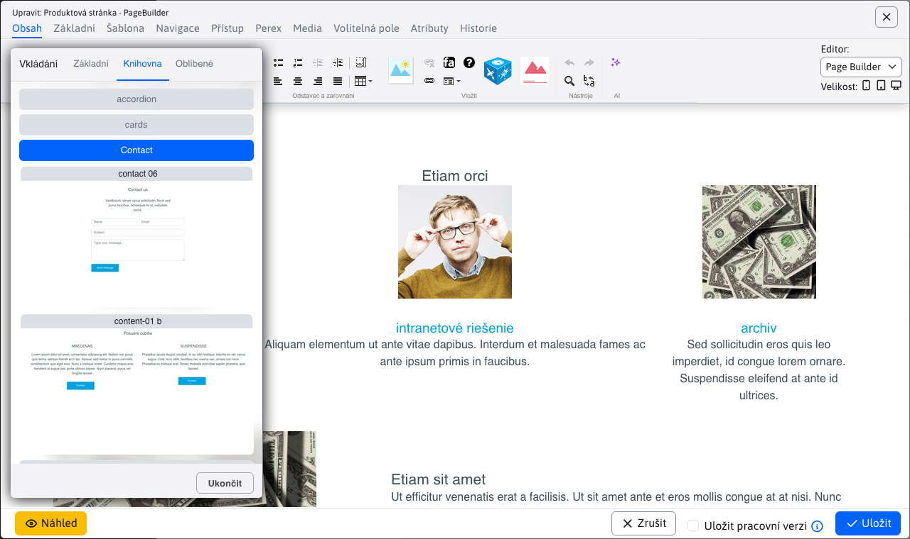
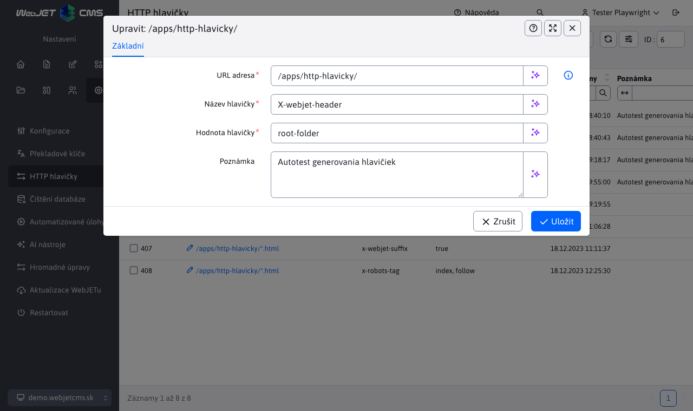

# Seznam změn verze 2026

## 2026.0-SNAPSHOT

> Vývojová verze aktualizována z main repozitáře.

!>**Upozornění:** Verze určená pro `jakarta namespace`, vyžaduje aplikační server Tomcat 10/11, používá Spring verze 7. Před aktualizací [zkontrolujte požadavky](install/versions.md#změny-při-přechodu-na-jakarta-verzi).

### Bezpečnost

- Aktualizované knihovny `AspectJ, Eclipselink, slf4j, GoPay` (#57793).
- Verze `SpringSecurity` zvýšena na verzi 7 (#56665).
- Přidána možnost autorizace přes [OAuth2/Keycloak/Google/Facebook...](install/oauth2/oauth2.md) (#56665).

### Pro programátora

- Aktualizovaný způsob zobrazení API dokumentace na standard [OpenAPI 3.0](https://www.openapis.org/). Dokumentace je dostupná na adrese `/admin/swagger-ui/index.html` pro uživatele, kteří mají právo na editaci administrátorů (#57793).
- Třída `PageListHolder/MutableSortDefinition` je ve Spring 7 `Deprecated`, jako přímou náhradu můžete použít naši implementaci `PagedListHolder/SortDefinition` z package `sk.iway.iwcm.system.datatable` (#57793).
- Odstraněná anotace `@Temporal` na datových sloupcích v databázových entitách, doporučené řešení je pro nové entity používat `java.time.*` typy. Zdá se, že Eclipselink/JPA správně detekuje typ `Date` jako datum a čas a anotace není nutná. Doporučujeme po aktualizaci zkontrolovat chování datových polí (#57793).
- Webové stránky - obnovení z koše - doplněno [publikování událostí](developer/backend/events.md) a `ON_RECOVER` pro obnovu stránek a složek z koše (#161).`AFTER_RECOVER`2026.0.x

## Opravná verze původní verze 2026.0.

> Bannerový Systém - opraveno načtení seznamu skupin v Microsoft SQL.
- Galerie - opraveno uložení nastavení galerie pro složku na disku (bez záznamu v databázi) v Oracle DB.
- Hromadný email - opravený přenos příjemců při duplikování kampaně v Oracle DB (#54273-82).
- Hromadný email - opraveno nahrazení externích odkazů, které obsahují více URL parametry v emailu (#54273-83).
- 2026.0

## WebJET CMS 2026.0

> **&#x20;přináší vylepšenou verzi nástroje&#x20;** &#x50;age Builde&#x72;**&#x20;pro tvorbu&#x20;**&#x6B;omplexních web stráne&#x6B;**. V blocích je možné&#x20;**&#x76;yhledávat a filtrova&#x74;**&#x20;na základě značek, snadno tak naleznete vhodný blok pro vložení do stránky. Přidány byly nové funkce jako&#x20;**&#x72;ozdělení sloupc&#x65;**,&#x20;**&#x76;kládání více sekcí najedno&#x75;**&#x20;a&#x20;**&#x73;tále zobrazené tlačítko pro přidání nové sekc&#x65;**&#x20;pro rychlé rozšíření obsahu stránky.**&#x50;odpora&#x20;
>
> PICTURE element&#x75;**&#x20;umožňuje zobrazovat&#x20;**&#x72;ůzné obrázky podle rozlišení obrazovk&#x79;**&#x20;návštěvníka, čímž se zlepšuje vizuální zážitek na různých zařízeních. Navíc lze vkládat&#x20;**&#x76;lastní ikon&#x79;**&#x20;definované ve společném SVG souboru, což přináší větší flexibilitu v designu.**&#x4E;ový nástroj pro&#x20;
>
> tvorbu formulář&#x16F;**&#x20;umožňuje snadno vytvářet&#x20;**&#x76;ícekrokové formulář&#x65;**&#x20;s možností programové validace jednotlivých kroků a možností&#x20;**&#x70;otvrzení platnosti emailové adres&#x79;**&#x20;pomocí zaslaného kódu. Vyhnete se tak vyplnění formulářů různými roboty.**!> Upozornění: verze&#x20;

2026. &#x30;**&#x20;je poslední verze pro aplikační server Tomcat 9 s využitím&#x20;**. Všechny novější verze od `javax namespace` budou určeny `2026.18` už jen pr&#x6F;**&#x20;aplikační server&#x20;**&#x54;omcat 10/1&#x31;**&#x20;s využitím&#x20;**. Změna z `Jakarta namespace` na `javax` je důsledkem předání `jakarta namespace` specifikací z Oracle do `Java EE` Open Source/Eclipse Foundatio&#x6E;**, kde projekt pokračuje pod názvem&#x20;**. Tato změna vyžaduje aktualizaci aplikačního serveru, jelikož verze Tomcat 10 a novější již používají výhradně `Jakarta EE` pro všechny `jakarta namespace` API. Aktuální seznam dostupných verzí naleznete v `Java EE` sekci instalace[.](install/versions.md) Průlomové změny

### Aktualizované knihovny&#x20;

- , více v `commons-lang,displaytag` sekci pro programátora[ (#58153).](#pre-programátora) Změněné chování ikony Bloky v režimu Page Builder -&#x20;
- textové bloky integrované[ do složky ](frontend/page-builder/blocks.md) podobně jako jsou bloky pro `content` (#58165).`section, container, column`Upravené zpracování&#x20;
- nahrávání soubor&#x16F;**, více v&#x20;**&#x73;ekci pro programátora`multipart/form-data` (#57793-3).[Doporučujeme ](#pro-programátora) zkontrolovat funkčnost všech formulářů
- &#x20;z důvodu úprav jejich zpracování, více informací v sekci **pro programátora** (#58161).[Webové stránky](#pro-programátora) Přidána možnost vkládat&#x20;

### &#x20;element, který zobrazuje&#x20;

- obrázek podle rozlišení obrazovky`PICTURE` návštěvníka. Můžete tedy zobrazit rozdílné obrázky na mobilním telefonu, tabletu nebo počítači (#58141).[Přidána možnost vkládat ](frontend/setup/ckeditor.md#picture-element) vlastní ikony

- &#x20;definované ve společném SVG souboru (#58181).[Přidán přenos aktuálního HTML kódu při přepnutí režimu editoru Standardní/HTML/Page Builder. Můžete tak jednoduše upravit Page Builder stránku v HTML kódu a znovu zobrazit úpravy v režimu Page Builder (#58145).](frontend/setup/ckeditor.md#svg-ikony) Přidáno kontextové menu Smazat element, pomocí kterého můžete snadno smazat tlačítko, odkaz, odstavec, formulář, sekci a podobně. Stačí když na element kliknete pravým tlačítkem pro zobrazení kontextového menu (#osk233).

- Page Builder - upravené generování stylů při použití nástroje tužka. Do CSS stylu se generují jen změněné hodnoty, ty jsou v dialogovém okně zvýrazněny modrým orámováním vstupního pole (#58145).
- Page Builder - přidána možnost volání&#x20;
- vlastního JavaScript souboru
- &#x20;s podpůrnými funkcemi pro úpravu kódu. Přidána možnost upravit nastavení jako selektory pro elementy, barvy a podobně (#58141).[Page Builder - upravené generování kotev u karet tak, aby název kotvy byl generován podle názvu karty - původně byl generován nesémanticky jako ](frontend/page-builder/blocks.md#podpůrný-javascript-kód) (#112).
- Page Builder - doplněna možnost nastavit šířku sloupce na `autotabs-x-y` pro automatické přizpůsobení obsahu (#114).
- Page Builder - doplněna možnost připravit `auto` textové bloky
- &#x20;přímo do složky [, vkládají se namísto původních bloků čtených z web stránek ze složky Šablony. Web designér je připraví spolu s ostatními typy Page Builder bloků. Umožňuje rychlé vložení často používaných textových částí, tlačítek a podobně (#58165).](frontend/page-builder/blocks.md) Page Builder - při vkládání nového bloku je výchozí karta Knihovna namísto Základní, aby se zjednodušil výběr bloku z připraveného seznamu (#58165 `content`Page Builder - doplněna možnost rozdělit sloupec na dvě části pomocí nové funkce Rozdělit sloupec. Vyvoláte ji pomocí kliknutí na + ve žluté liště, zvolením možnosti Blok a následně v kartě Základní zvolíte možnost Rozdělit sloupec. Funkce umožňuje rychlé rozdělení sloupce bez nutnosti vkládat nový sloupec a přesouvat obsah (#58165).
- Page Builder - doplněna možnost vložit blok, který obsahuje více sekcí nebo jiných elementů - označí se po vložení všechny sekce (#58173).
- Page Builder - doplněno&#x20;
- ID bloku
- &#x20;do atributu [ pro možnost vyhledání použití bloku ve web stránkách přes vyhledávání v administraci (#58193).](frontend/page-builder/blocks.md#id-bloku) Page Builder - seznam oblíbených bloků je ukládán pro každého uživatele zvlášť, aby si každý mohl spravovat vlastní seznam oblíbených bloků (#58193 `data-pb-id`Page Builder - přidána stále zobrazená ikona pro přidání nové sekce na konci stránky, což zjednodušuje přidávání nových sekcí do stránky (#58173).
- Page Builder - upravený design nástrojové lišty pro lepší viditelnost na různých pozadích (#58165).
- Page Builder - doplněna možnost&#x20;

- filtrovat bloky

- &#x20;podle názvu a štítků (#58173).[Doplněna ](frontend/page-builder/blocks.md#název-a-značky-bloku) detekce změny obsahu

- &#x20;a upozornění na neuložené změny při zavírání okna prohlížeče. Změny se začnou detekovat 5 vteřin po otevření web stránky. (#112).[Doplněna možnost nastavit výchozí hodnoty pro tabulky v CKEditoru přes konfigurační proměnné, více v ](redactor/webpages/working-in-editor/README.md#detekce-změny-obsahu-stránky) sekci nastavení CKEditoru
- &#x20;(#58189).[Doplněna možnost vkládat ](frontend/setup/ckeditor.md#konfigurační-proměnné) tlačítko
- &#x20;\- element [. Umíte tak snadno vkládat různé akční ](frontend/setup/ckeditor.md#tlačítko) tlačítka (#58201).`button`Styl - `call to action` výběr stylu
- &#x20;definovaného pro element Např. [ nebo ](frontend/examples/template-bare/README.md#seznam-stylů-pro-editor) umožňuje nastavit více stylů současně. Opakovaným zvolením již nastaveného stylu se tento styl odstraní (#OSK140).`p.paragraph-green,p.paragraph-red-border,p.paragraph-yellow-background`Upravený text pro publikování stránky do budoucnosti na `section.test-section,section.test-section-green` Naplánovat změnu stránky po tomto datu
- , při zvolení této možnosti se také změní tlačítko pro uložení na text **Naplánovat** pro jasnější informaci pro uživatele (#58253).**Do žádosti o schválení web stránky doplněn seznam změněných polí (#58077).**&#x41;plikace
- Předěláno nastavení vlastností aplikací v editoru ze starého kódu v&#x20;

### &#x20;na&#x20;

&#x20;aplikace. Aplikace automaticky získávají i možnost nastavit `JSP` zobrazení na zařízeních`Spring`. Design je ve shodě se zbytkem WebJET CMS a datových tabulek (#58073).[Novinky](custom-apps/appstore/README.md#podmíněné-zobrazení-aplikace) Formulář snadno
- [Formuláře](redactor/apps/news/README.md)

- [Nový způsob vytváření formulářů, které mohou obsahovat ](redactor/apps/formsimple/README.md)

### více kroků

- &#x20;s pokročilými funkcemi. V seznamu formulářů umíte vytvořit nový formulář, kterému následně přidáte jednotlivé položky a případně několik kroků. Karta položky formuláře je viditelná v detailu formuláře typu Vícekrokový formulář (#58161).[YouTube video player](redactor/apps/multistep-form/README.md) Seznam formulářů - celá sekce byla předělána z technologie&#x20;

  <iframe width="560" height="315" src="https://www.youtube.com/embed/XRnwipQ-mH4" title=" na standardní " frameborder="0" allow="accelerometer; autoplay; clipboard-write; encrypted-media; gyroscope; picture-in-picture" allowfullscreen></iframe>

- &#x20;pro lepší integraci do WebJET CMS a zjednodušení úprav (#58161).`Vue.js`Seznam formulářů - umožněno vytváření formuláře, který je automaticky typu `Html + JavaScript` vícekrokový formulář
- &#x20;(#58161).[Seznam formulářů - umožněno nastavování parametrů/atributů všech typů formulářů přímo v editoru formuláře (#58161).](redactor/apps/multistep-form/README.md) Seznam formulářů - pole poznámka umožňuje vkládat formátovaný text, umíte tak lépe evidovat doplňkové informace k formuláři (#58161).
- Detail formuláře - přidána možnost zobrazení všech údajů přihlášeného uživatele, data se také exportují do Excelu (#58161).
- Ověřovací kód - přidána možnost odeslat formulář až po zadání&#x20;
- ověřovacího kódu
- &#x20;zaslaného na email adresu. Umíte tak lépe chránit formuláře před SPAM-em (#58161).[Přesměrování](redactor/apps/form/README.md#nastavení-potvrzení-zaslaným-kódem) Přidáno možnost ukončit platnost přesměrování ve stanoveném čase a možnost zadat poznámku s informací k čemu přesměrování slouží. Přesměrování, která již nejsou časově platná, se zobrazí červeně (#58105).

### Elektronický obchod

- Nová sekce&#x20;

### Způsoby doručení

- , jako samostatná tabulka nahrazuje původní konfiguraci dostupných způsob doručení, která se nacházela přímo v nastaveních aplikace [elektronického obchodu](redactor/apps/eshop/delivery-methods/README.md). Pro každý způsob doručení lze nastavit také cenu, která při zvolení možnosti bude automaticky přičtena k objednávce. Nastavené způsoby doručení se také automaticky promítnou do možností při vytváření objednávky zákazníkem. Připraveno je doručení poštou a osobní vyzvednutí, do budoucna plánujeme doplnit integraci na doručovací společnosti (#58061).**Bezpečnost**Přidána podpora pro povolení pouze&#x20;

### jednoho aktivního přihlášení

- &#x20;na jednoho uživatele. Režim zapnete nastavením konfigurační proměnné&#x20;**&#x20;na hodnotu&#x20;**. Při novém přihlášení se zruší předchozí aktivní `sessionSingleLogon` (#58121).`true`Odstraněna nepodporovaná knihovna `session` commons-lang
- , nahrazena novou knihovnou [commons-lang3](https://mvnrepository.com/artifact/commons-lang/commons-lang), v [ je aktualizační skript pro úpravu zdrojových kódů (#58153).](https://mvnrepository.com/artifact/org.apache.commons/commons-lang3) Přidán seznam `update-2023-18.jsp` Moje aktivní přihlášení
- &#x20;na úvodní obrazovce administrace, která zobrazuje všechna aktivní přihlášení do administrace pod vaším uživatelským účtem a možnost jejich ukončení. Přidána i možnost odeslat email přihlášenému administrátorovi (#58125).[Captcha - nastavením konfigurační proměnné ](redactor/admin/welcome.md#moje-aktivní-přihlášení) na hodnotu&#x20;

- &#x20;lze Captcha zcela vypnout. Nezobrazí se iv případě, pokud má šablona zobrazené web stránky vypnutou SPAM ochranu. V takovém případě je ale třeba korektně kontrolovat vypnutí SPAM ochrany šablony iv případném kódu zpracování/verifikace Captcha odpovědi, pro formuláře je tato kontrola zabezpečena. Můžete použít volání `captchaType` pro ověření režimu a vypnutí spam ochrany (#54273-78).`none`Aktualizovaná knihovna pro `Captcha.isRequired(component, request)` odesílání emailů
- &#x20;z [ na ](install/config/README.md#odesílání-emailů) z důvodu podpory nových autentifikačních mechanismů SMTP serverů jako například `com.sun.mail:javax.mail:1.6.2` a přidaná konfigurační proměnná `com.sun.mail:jakarta.mail:1.6.8` pro vynucení použití autorizačního mechanismu - nastavte např. na hodnotu `NTLMv2` pro vynucení `smtpAuthMechanism` autorizace namísto použití `NTLM` autorizace (#58153 `NTLM`Upraveno logování výjimek při přerušení HTTP spojení (např. při zavření prohlížeče, odchodu na jinou web stránku a podobně). Takové výjimky se nezapíší do logu, aby nenastala chyba obsazení místa. Týká se výjimek typu `BASIC` a názvů výjimek definovaných přes konfigurační proměnnou&#x20;
- , výchozí `IOExceptio` (#58153).`clientAbortMessages`Jiné menší změny`response already,connection reset by peer,broken pipe,socket write error`Vyhledávání – upravené načtení seznamu šablon při hledání web stránek. Načtou se všechny šablony bez ohledu na jejich dostupnost ve složkách, aby se nestalo, že při editaci web stránky šablona není dostupná (#58073).

### HTTP hlavičky - přidána možnost nastavit hlavičku delší než 255 znaků, například pro nastavení&#x20;
- &#x20;(
- #82`Content-Security-Policy`)[Konfigurace - upravený způsob smazání konfigurační proměnné. Po vymazání se automaticky nastaví původní hodnota z ](https://github.com/webjetcms/webjetcms/issues/82), aby byla stejná jako bude po restartu serveru. V původním řešení se proměnná jen smazala, ale její hodnota zůstala interně nastavena do restartu serveru (#57849).

- Konfigurace - přidána možnost nastavit `Constants` jméno HTTP hlavičky
- &#x20;pro získání IP adresy návštěvníka přes konfigurační proměnnou [ (#58237).](sysadmin/pentests/README.md#konfigurácia) Bezpečnost - přidána možnost konfigurace blokovaných cest souborů/adresářů přes proměnnou `xForwardedForHeader`. Standardně jsou blokovány URL adresy, které v názvu obsahují výraz&#x20;
- . Lze přidat další podle potřeby (#PR103).`pathFilterBlockedPaths`Značky - upravené zobrazené značek, v případě duplicity hodnot. Porovnání je bez vlivu diakritiky a velkých/malých písmen `.DS_Store,debug.,config.properties,Thumbs.db,.git,.svn` #115
- .[Zrcadlení - přidána možnost zobrazit obrázek vlajky namísto textu v ](https://github.com/webjetcms/webjetcms/issues/115) přepínači jazyka stránky

- &#x20;(#54273-79).[Změna hesla - přidána možnost nastavit jméno a email adresu ze které je odeslán email s odkazem na změnu hesla přes konfigurační proměnné ](redactor/apps/docmirroring/README.md#vytvoření-odkazu-na-jazykové-mutace-v-hlavičce-stránky) a&#x20;
- &#x20;(#58125 `passwordResetDefaultSenderEmail`Statistika - doplněné sumární počty vidění a návštěv v TOP stránkách (#PR136).`passwordResetDefaultSenderName`Novinky - přejmenovaná hodnota uspořádat podle priority na uspořádat podle Pořadí uspořádání (priority) pro sladění s hodnotou v editoru (#57667-16).
- Formulář snadno - přidána možnost nastavit hodnotu&#x20;
- &#x20;pro vložení formuláře např. do patičky stránky (#57667-16).
- Novinky / Šablony novinek - přesunuté pole `useFormDocId` z aplikace Novinky do Šablony novinek, aby se vlastnost nastavovala přímo v šabloně novinek. Původní hodnota&#x20;
- &#x20;z Novinek bude nadále fungovat, ale nelze jej již nastavovat v uživatelském rozhraní (#58245).`contextClasses`Manažer dokumentů - přidána možnost `contextClasses` upravit metadata historické verze dokumentu
- &#x20;v manažeru dokumentů (#58241).[Hromadný email - upravené auditování změn v kampani. Pokud se přidá skupina neaudituje se celý seznam příjemců (bylo to zbytečně mnoho záznamů v auditu), zapíše se pouze seznam změněných skupin. Při manuálním přidání emailů se nadále audituje jméno i emailová adresa (#58249).](redactor/files/file-archive/README.md#úprava-historickej-verzie-dokumentu-v-manažéri) Uživatelé - při importu pokud sloupec v Excelu neobsahuje pole heslo, tak se pro nové uživatele vygeneruje náhodné heslo. Pokud není v Excelu zadán stav Schválený uživatel, tak se nastaví na hodnotu&#x20;
- &#x20;(#58253).
- MultiWeb - doplněno zobrazení domény v boční liště (#58317-0).`true`MultiWeb - doplněna možnost nastavit doménu přesměrování aby bylo možné zadat&#x20;
- &#x20;prefix (#58317-0).
- MultiWeb - doplněna kontrola práv pro skupiny médií a značky (#58317-0).`https://`Seznam formulářů - nastavení&#x20;
- zpracovatele formulářů
- , pomocí autocomplete pole, který nabízí třídy implementující [ (#58313).](custom-apps/apps/multistep-forms/README.md) Číselníky - doplněno odstranění mezer na začátku a konci pole typu řetězec v datech číselníku (#OSK233).`FormProcessorInterface`Oprava chyb
- Značky - opraveno duplikování složky v Zobrazit pro při uložení značky, odstraněn výběr složky z ostatních domén, protože značky jsou již odděleny podle domén (#58121).

### Web stránky - opraveno vkládání tvrdé mezery za spojky tak, aby se aplikovalo pouze na text stránky a nikoli na atributy nebo HTML značky (#OSK235).
- Datatables - opravené zpracování události&#x20;
- &#x20;u vybraných vstupních polí filtrů tabulky (#58313).
- Datatables - opravené filtrování kdy se více `Enter` tabulek na stránce navzájem ovlivňovalo při filtrování (#58313).
- Elektronický obchod - opraveno odesílání email notifikace, při změně stavu objednávky (#58313 `serverSide:false`Elektronický obchod - opraveno automatické nastavení stavu objednávky po změně plateb (#58313).
- Dokumentace
- Aktualizovány všechny fotky obrazovky v české verzi dokumentace (#58113).

### Pro programátora

- Volná pole - přidána možnost specifikovat vlastní sloupce pro label a hodnotu při&#x20;

### propojení na číselník

- . Umožňuje flexibilnější nastavení, která vlastnost z číselníku se použije jako zobrazený text a která jako uložená hodnota (#PR108).[Smazané nepoužívané soubory ](frontend/webpages/customfields/README.md#číselník), pokud je ve vašem projektu používáte vezměte je ze&#x20;
- starší verze`/admin/spec/gallery_editor_perex_group.jsp,/admin/spec/perex_group.jsp` WebJET CMS (#58073).[Mírně upravené API v ](https://github.com/webjetcms/webjetcms/tree/release/2025.40/src/main/webapp/admin/spec) NewsActionBean
- , hlavně nastavení [ které jsou nyní typu ](../../src/main/java/sk/iway/iwcm/components/news/NewsActionBean.java). Můžete použít `groupIds` pro nastavení s polem ID hodnot (#58073 `List<GroupDetails>`Opravena možnost vkládání uvozovek do parametrů aplikací (#58117).`setGroupIds(int[] groupIds)`Připraveny kontejnery pro všechny podporované databázové servery ve WebJET CMS pro snadné spuštění ve VS Code. Nacházejí se ve složce&#x20;
- &#x20;(#58137).
- Elektronický obchod - kvůli změnám při procesu implementace `.devcontainer/db` způsobů doručení
- &#x20;je třeba provést úpravu souboru pomocí aktualizačního skriptu&#x20;**&#x20;a to nad sekcí&#x20;**&#x20;(#58061).`update-2023-18.jsp`Elektronický obchod - přejmenovaná anotace `basket` na&#x20;
- &#x20;a `@PaymentMethod` na `@FieldsConfig` pro sjednocení anotací mezi platbami a způsoby doručení (#58061).`@PaymentFieldMapAttr`Elektronický obchod - při procesu implementace `@FieldMapAttr` způsobů doručení
- &#x20;do souboru&#x20;**&#x20;přibylo několik změn, které si musíte implementovat manuálně. Tyto změny jsou příliš komplexní, aby se daly doplnit pomocí aktualizačního skriptu&#x20;**&#x20;(#58061).`order_form.jsp`Navigační lišta - přidána možnost použít vlastní implementaci generátoru `update-2023-18.jsp` navigační lišty
- . Přes konfigurační proměnnou [ je možné nastavit jméno třídy implementující ](redactor/apps/navbar/README.md) (#PR101).`navbarDefaultType`Odstraněna nepodporovaná knihovna `NavbarInterface` commons-lang
- , nahrazena novou knihovnou [commons-lang3](https://mvnrepository.com/artifact/commons-lang/commons-lang), v [ je aktualizační skript pro úpravu zdrojových kódů (#58153).](https://mvnrepository.com/artifact/org.apache.commons/commons-lang3) Aktualizovaná knihovna `update-2023-18.jsp` displaytag
- &#x20;na verzi [ (#58153).](https://mvnrepository.com/artifact/com.github.hazendaz/displaytag) Upraveno zpracování nahrávání souborů `2.9.0`. Ve Spring aplikacích pro souborové pole použijte místo&#x20;
- &#x20;přímo `multipart/form-data`, které bude automaticky nastaveno. Není již třeba používat volání typu `org.apache.commons.fileupload.FileItem` pro získání souboru. `org.springframework.web.multipart.MultipartFile` Upozornění:`entity.setDocument(MultipartWrapper.getFileStoredInRequest("document", request))` je třeba nahradit všechny výskyty&#x20;**&#x20;za&#x20;**&#x20;ve vašem kódu, také zrušit URL parametry ve Spring aplikaci pro vynucené zpracování. Výraz `CommonsMultipartFile` nahraďte za `MultipartFile`. Můžete použít `data-th-action="@{${request.getAttribute('ninja').page.urlPath}(\_\_forceParse=1,\_\_setf=1)}"` k aktualizaci souborů (#57793-3).`data-th-action="${request.getAttribute('ninja').page.urlPath}"`Doplněna možnost vytvoření `/admin/update/update-2023-18.jsp` projektových kopií souborů
- &#x20;Spring aplikaci. Stačí vytvořit vlastní verzi souboru ve složce [ podobně jako se používá pro JSP soubory. WebJET CMS nejprve hledá soubor v projektové složce a není-li nalezen použije standardní soubor z ](frontend/customize-apps/README.md) složky (#58073).`/apps/INSTALL_NAME/`Doplněna možnost nastavit `/apps/` jméno pro CSS styl
- &#x20;v CSS souboru přes komentář [. Jméno se zobrazí v seznamu stylů v editoru (#58209).](frontend/examples/template-bare/README.md) Editor - upravený dialog pro nastavení `/* editor title: Style Name */` - zrušeno nastavení barev a velikostí,&#x20;
- používají se už jen CSS třídy`a.btn` stejně jako pr [ (#57657-16).](frontend/setup/ckeditor.md#tlačidlo) Datové tabulky - možnost zobrazení pouze ikony bez pořadí pro `button` pokud danému sloupci přidáme třídu&#x20;
- &#x20;(#58161).`rowReorder`Datové tabulky - nové možnosti pro výběr řádků v tabulce `icon-only` a&#x20;
- , více v `toggleSelector` sekci datových tabulek`toggleStyle` (#58161).[Datové tabulky - nová možnost vlastní ](developer/datatables/README.md#možnosti-konfigurace) render
- &#x20;funkce pomocí anotace [. Umožní vám zobrazit ve sloupci složené hodnoty z více polí a podobně (#58161).](developer/datatables-editor/datatable-columns.md) Datové tabulky - přidána možnost `@DataTableColumn(...renderFunction = "renderStepName")` přesměrovat uživatele
- &#x20;na jinou stránku po uložení záznamu voláním metody [ (#58161).](developer/datatables/restcontroller.md#presmerovanie-po-uložení) Formuláře - Upraveno zobrazení seznamu formulářů, zrušena třída `setRedirect(String redirect)`, nahrazena třídou&#x20;
- . Nastavení formulářů změněno z tabulky `FormAttributesDB` na tabulku `FormService`. Doporučujeme po aktualizaci ověřit funkčnost všech formulářů na web stránce (#58161).`form_attributes`Formuláře - vytvoření nové tabulky `form_settings` jako náhradu za tabulku&#x20;
- , kde se ukládají vlastnosti formulářů. Jednotlivé atributy (nastavení) jsou nyní uloženy v samostatných sloupcích jako jeden záznam na řádek. Data byla do nové tabulky konvertována pomocí `form_settings` (#58161).`form_attributes`Přechod na novou tabulku `UpdateDatabase.java` pro vlastnosti formulářů v&#x20;
- &#x20;souborech. Je třeba si spustit aktualizační skript `form_settings`, který upraví potřebné `.jsp` (#58161).`update-2025-0.jsp`Seznam formulářů - nastavování parametrů/atributů všech typů formulářů přesměrováno z tabulky `.jsp` do nové tabulky&#x20;
- &#x20;(#58161).`form_attributes`Datové tabulky - přidána BE podpora pro `form_settings`, kdy lze měnit pořadí záznamů přímo v datové tabulce pomocí drag\&drop (#58161).
- Události - přidaná událost `row-reorder` Aktualizace kódů v textu
- &#x20;pro možnost úprav kódů v textu stránky typu [ a podobně (#54273-63).](developer/backend/events.md#aktualizácia-kódov-v-texte) Datové tabulky - přidáno `!CUSTOM_CODE!` Spring události
- &#x20;pro možnost úprav dat v zákaznických instalacích (#54273-63).[Testování](developer/backend/events-datatable.md) Doplněný skript&#x20;

### rm-same-images.sh
- &#x20;pro odstranění stejných obrázků při pořízení nových snímků obrazovky (#58113).

