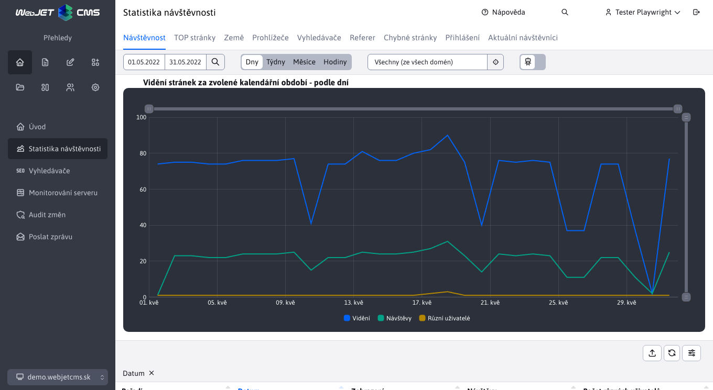
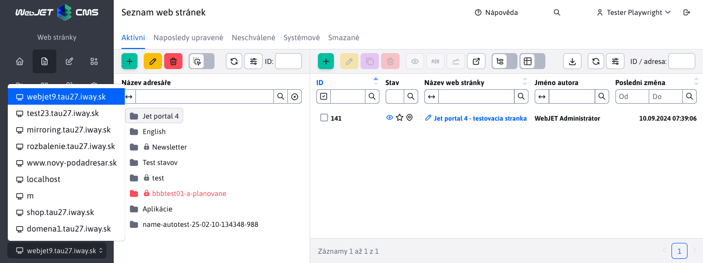
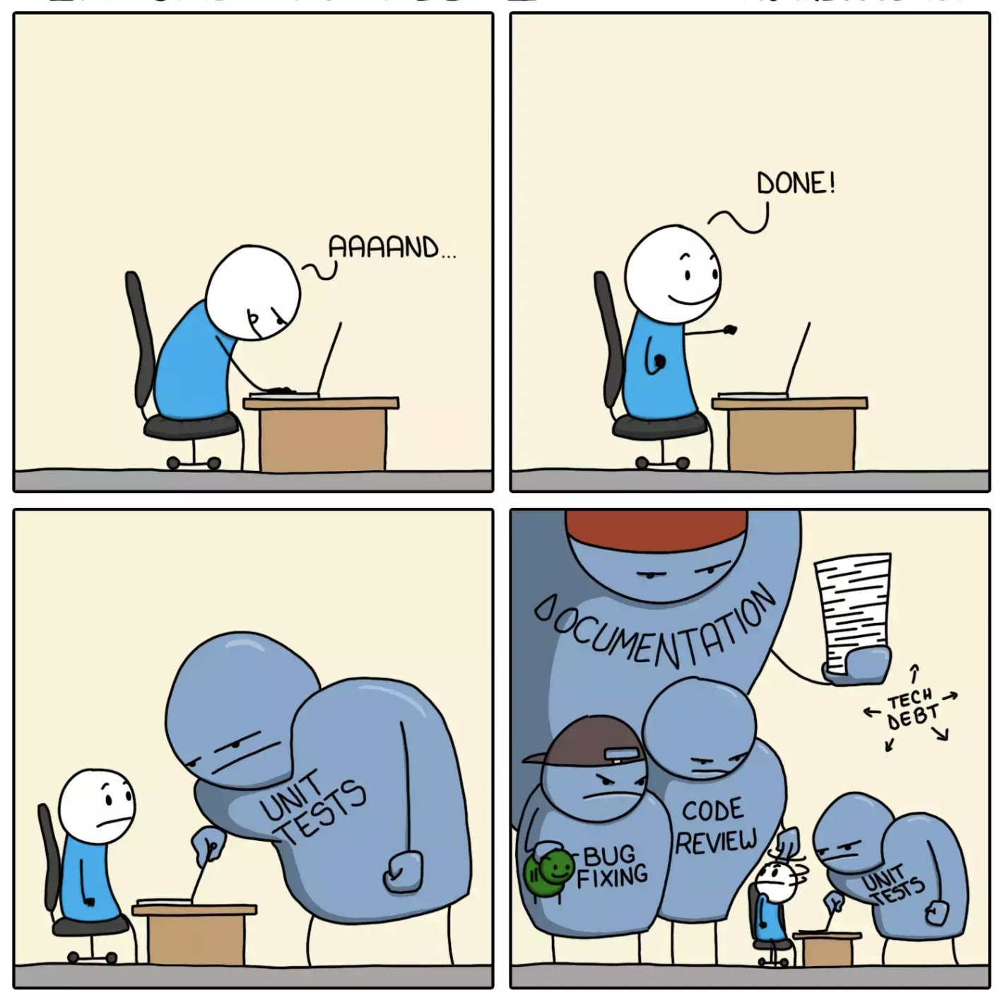

# WebJET CMS 2024

Vítejte v dokumentaci k systému WebJET CMS verze 2024. Doporučujeme přečíst si [seznam změn](CHANGELOG-2024.md) a [roadmap](ROADMAP.md).

# Seznam změn v nejnovější verzi

## 2025.0

> Ve verzi **2025.0** jsme přivezli **nový design administrativy** pro ještě lepší přehlednost a uživatelský komfort.
>
> Jednou z hlavních změn je převod **nabídka druhé úrovně** na **karty v záhlaví stránky**, což zjednodušuje navigaci. Na webových stránkách jsme také **sloučené karty složek a webových stránek** mít vše na jednom místě. Pokud záhlaví neobsahuje karty, tabulky se automaticky upraví a zobrazí. **další řádek**.
>
> Poskytněte prosím zpětnou vazbu prostřednictvím **Formulář zpětné vazby** pokud identifikujete při použití nové verze **jakýkoli problém se zobrazením**. Můžete také přidat připomínku **snímek obrazovky** aby nám pomohl rychleji identifikovat a vyřešit případné nedostatky.
>
> Děkujeme vám za spolupráci a pomoc při zlepšování systému WebJET CMS!

## Převratné změny

- Webové stránky - zrušeny inline úpravy. Možnost upravovat stránku přímo v režimu zobrazení byla odstraněna, protože používala starší verzi editoru, která již není podporována. Jako alternativu lze aktivovat panel nástrojů zobrazený v pravém horním rohu webové stránky. Tento panel nástrojů umožňuje rychlý přístup k editoru webové stránky, složce nebo šabloně. Můžete jej vypnout nebo zapnout pomocí konfigurační proměnné `disableWebJETToolbar`. Po aktivaci se začne zobrazovat na webové stránce po vstupu do sekce Webové stránky v administraci (#57629).
- Přihlášení - nastaveno pro správce [žádost o změnu hesla](sysadmin/pentests/README.md#pravidla-pro-zadávání-hesel) jednou ročně. Hodnotu lze změnit v konfigurační proměnné `passwordAdminExpiryDays`, nastavení na 0 tuto kontrolu zakáže (#57629).
- Úvod - přidán požadavek na aktivaci dvoufaktorového ověřování pro zvýšení bezpečnosti přihlášení. Výzva se nezobrazuje, pokud je ověřování prováděno prostřednictvím `LDAP` nebo pokud je překladový klíč `overview.2fa.warning` nastaven na prázdnou hodnotu (#57629).

### Design

Ve verzi **2025.0** jsme přinesli vylepšený **administrativní návrh** který je přehlednější a efektivnější.

- **Upravený přihlašovací dialog** - nové pozadí a přesunutí přihlašovacího dialogu na pravou stranu. Na adrese **Přihlášení** je možné použít nejen přihlašovací jméno, ale také **již máte e-mailovou adresu**. 
- **Jasnější záhlaví** - název aktuální stránky nebo sekce se nyní zobrazuje přímo v záhlaví.
- **Nová navigace v levém menu** - pod položkami již nejsou součástí levého menu, ale jsou zobrazeny **jako karty nahoře** Stránky. 
- **Sloučené karty v sekci Webové stránky** - Přepínání typů složek a typů webových stránek se nyní zobrazuje ve společné části, což zjednodušuje navigaci. **Výběr domény** byla přesunuta do spodní části levého menu. 
- **Reorganizované položky nabídky**:
  - **SEO** přesunuto do sekce **Zobrazení**.
  - **GDPR a skripty** přesunuto do sekce **Šablony**.
  - **Galerie** je nyní v sekci **Soubory**.
  - Některé názvy položek byly upraveny tak, aby lépe vystihovaly jejich funkci.

Zbytek seznamu změn je totožný s verzí [2024.52](CHANGELOG-2024.md).

## Webové stránky

- Přidána možnost nastavit pořadí přírůstku složek v konfigurační proměnné `sortPriorityIncrementGroup` a webové stránky v konfigurační proměnné `sortPriorityIncrementDoc`. Výchozí hodnoty jsou 10 (#57667-0).

### Testování

- Standardní heslo pro `e2e` testy jsou získávány z `ENV` proměnná `CODECEPT_DEFAULT_PASSWORD` (#57629).

### Oprava chyb

- Webové stránky - vkládání odkazů na soubor v nástroji PageBuilder (#57649).
- Webové stránky - do atributu Pomocný titulek přidány informace o odkazu (typ souboru, velikost `alt` (#57649).
- Webové stránky - opravené pořadí webových stránek při použití `Drag&Drop` ve stromové struktuře (#57657-1).
- Webové stránky - při duplikování webové stránky/složky se nastaví hodnota `-1` v poli Pořadí uspořádání pro zařazení na konec seznamu. Hodnota `-1` lze také zadat ručně a získat tak novou hodnotu pro pořadí uspořádání (#57657-1).
- Webové stránky - import webových stránek - opraveno nastavení skupiny médií při importu stránek obsahujících média. Při importu se automaticky vytvoří všechny skupiny médií (i nepoužívané) vzhledem k tomu, že při importu stránek se překládá i skupina médií nastavená pro aplikaci médií. `/components/media/media.jsp` ve stránce (která může obsahovat také ID média skupiny mimo importované stránky) (#57657-1).
- Firefox - zmenšená verze sady `Tabler Icons` na adrese `3.0.1` protože Firefox při používání novějších verzí výrazně zatěžuje procesor. Optimalizované čtení stylů CSS `vendor-inline.style.css` (#56393-19).

