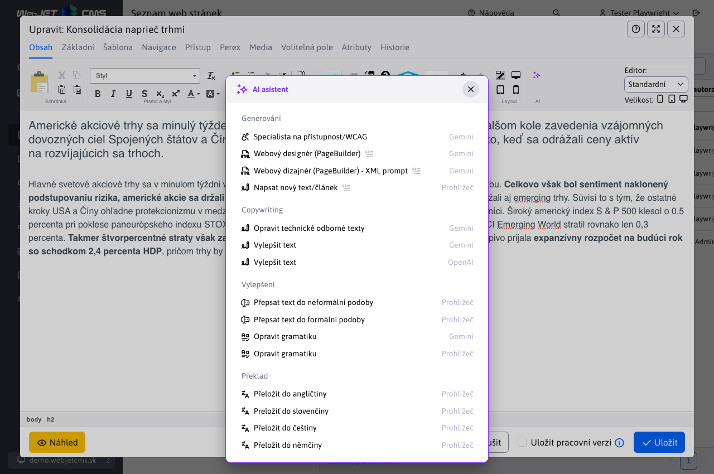

# WebJET CMS 2025

Vítejte v dokumentaci k WebJET CMS verze 2025. Doporučujeme přečíst si [seznam změn](CHANGELOG-2025.md) a [roadmap](ROADMAP.md).

## Seznam změn ve verzi 2025.40

> **WebJET CMS 2025.40** přináší integrovaného **AI Asistenta**, který zásadně zjednodušuje práci s obsahem. Umožňuje automaticky **opravovat gramatiku**, **překládat** texty, navrhovat titulky, sumarizovat články a generovat **ilustrační obrázky** přímo v editoru. Díky tomu je tvorba obsahu **rychlejší, přesnější a kreativnější** než kdykoli předtím.
>
> Významné změny se týkají také **značek** a **šablon novinek**, které byly přepracovány do **samostatných databázových tabulek** s podporou oddělení podle domén. To přináší vyšší **přehlednost, jednodušší správu** a možnost efektivního přizpůsobení obsahu pro více webů. Uživatelské prostředí bylo **optimalizováno pro menší obrazovky** – systém automaticky přizpůsobí zobrazení oken a maximalizuje využitelný prostor.
>
> Na technické úrovni byl odstraněn zastaralý Struts Framework. Díky tomu je WebJET CMS výkonnější, stabilnější, **bezpečnější** a připraven k dalšímu rozvoji moderních webových řešení.

### Průlomové změny

- Odstraněn `Struts Framework`, je třeba provést aktualizaci `JSP` souborů, Java tříd a upravit soubor `web.xml`, více v [sekci pro programátora](#pro-programátora) (#57789).
- Pokud používáte aplikační server Tomcat ve verzi 9.0.104 a více je třeba [aktualizovat nastavení](install/versions.md#změny-při-přechodu-na-tomcat-90104) parametru `maxPartCount` na `<Connector` elemente (#54273-70).
- Značky - rozdělené podle domén - při startu se vytvoří kopie značek pro každou doménu (je-li používáno rozdělení údajů podle domén - nastavena konfigurační proměnná `enableStaticFilesExternalDir=true`). Aktualizují se ID značek pro web stránky a galerii. Je třeba manuálně zkontrolovat ID značek pro všechny aplikace novinky a jiné aplikace, které obsahují ID značky – aktualizace se je pokusí opravit, ale doporučujeme ID zkontrolovat. Více informací v sekci pro programátora. (#57837).
- Novinky - [šablony novinek](frontend/templates/news/README.md) předělané z definice přes překladové klíče na vlastní databázovou tabulku. Při startu WebJETu se zkonvertují záznamy z původního formátu. Jsou odděleny podle domén, pokud obsahují doménový alias vytvoří se pouze v příslušné doméně (#57937).
- Bezpečnost - přísnější kontrola URL adres administrace - je třeba, aby URL adresa v administraci měla na konci znak `/`, nesprávná adresa je `/admin/v9/webpages/web-pages-list` nebo `/apps/quiz/admin`, správná `/admin/v9/webpages/web-pages-list/` nebo `/apps/quiz/admin/`. Je třeba aby programátor zkontroloval definice URL adres v souborech `modinfo.properties` (#57793).

### AI Asistent

V dnešním světě je umělá inteligence všude kolem nás a samozřejmě WebJET jako moderní redakční systém nechce zůstat pozadu. Proto s hrdostí představujeme novou verzi WebJET CMS, kde jsme integrovali [pokročilé AI nástroje](redactor/ai/README.md).



Tyto funkce vám usnadní tvorbu a úpravu obsahu – od opravy gramatiky, přes překlady textů, návrhy titulků, až po generování ilustračních obrázků.

<div class="video-container">
  <iframe width="560" height="315" src="https://www.youtube.com/embed/LhXo7zx7bEc" title="YouTube video player" frameborder="0" allow="accelerometer; autoplay; clipboard-write; encrypted-media; gyroscope; picture-in-picture" allowfullscreen></iframe>
</div>

### Web stránky

- AB Testování - přidána možnost [zobrazovat AB verzi](redactor/apps/abtesting/README.md) podle stavu přihlášeného uživatele - nepřihlášenému uživateli se zobrazí A verze a přihlášenému B verze. Režim aktivujete nastavením konfigurační proměnné `ABTestingForLoggedUser` na hodnotu `true` (#57893).
- [Page Builder](redactor/webpages/pagebuilder.md) - upravený vizuál, aby lépe zapadal do aktuálního designu WebJET CMS (#57893).


- Povoleno zobrazení stránek obsahujících `404.html` v URL adrese ze systémových složek, aby vám taková technická stránka nepřekážela mezi standardními web stránkami (#57657-8).
- Značky - rozdělené zobrazení značek podle aktuálně zvolené domény, abyste mohli mít značky zvlášť pro každou doménu ve WebJETu (#57837).
- Klonování struktury - přidána informace o nakonfigurovaném překladači a kolik volných znaků k překladu zbývá (#57881).
- Zrcadlení struktury - přidána možnost vymazat `sync_id` hodnoty pro zvolenou složku (rekurzivní). Aby bylo snadno možné zrušit/resetovat zrcadlení stránek (#57881).


- Zrcadlení - přidání nové sekce [zrcadlení](redactor/webpages/mirroring/README.md) pro sledování a správu provázaných složek a stránek po akci zrcadlení (#57941).


- Při výběru obrázku nebo video souboru, v editoru stránek jsou v průzkumníku zobrazeny jen vhodné typy souborů, ostatní jsou filtrovány (#57921).

### Šablony

- Přidána nová sekce [Šablony novinek](frontend/templates/news/README.md) pro správu a správu šablon novinek (#57937).


### Uživatelské rozhraní

- Při použití malého monitoru (výška okna méně než 760 bodů) se zobrazí okno automaticky na celou plochu a zmenší se hlavička a patička (titulek okna je menším písmem). Zvýší se tak zobrazené množství informací, což je zapotřebí hlavně v sekci web stránky. Používá se u oken používajících CSS třídu `modal-xl`, což jsou aktuální web stránky, foto galerie, editor obrázků a uživatelé (#57893).


- V editoru přidána možnost kliknout na ikonu obrázku na začátku pole, pro jeho zobrazení v nové kartě.


### Aplikace

- Přidána možnost zobrazit aplikaci pouze přihlášenému/nepřihlášenému uživateli. Režim se nastavuje v kartě [Zobrazení nastavení aplikace](redactor/webpages/working-in-editor/README.md#karta-zobrazení) v editoru stránek (#57893).


Předěláno nastavení vlastností aplikací v editoru ze starého kódu v `JSP` na `Spring` aplikace. Aplikace automaticky získávají i možnost nastavit [zobrazení na zařízeních](custom-apps/appstore/README.md#podmíněné-zobrazení-aplikace). Design je ve shodě se zbytkem WebJET CMS a datových tabulek (#57409).
- [Carousel Slider](redactor/apps/carousel_slider/README.md)
- [Emotikony](redactor/apps/emoticon/README.md)
- [Fórum/Diskuse](redactor/apps/forum/README.md)
- [Otázky a odpovědi](redactor/apps/qa/README.md)
- [Uživatelé](redactor/apps/user/README.md)
- [Působivá prezentace](redactor/apps/app-impress_slideshow/README.md)
- [Restaurační menu](redactor/apps/restaurant-menu/README.md)
- [Slider](redactor/apps/slider/README.md)
- [Slit slider](redactor/apps/app-slit_slider/README.md)
- [Sociální ikony](redactor/apps/app-social_icon/README.md)
- [Video](redactor/apps/video/README.md)


### Menu

- Pokud [menu web stránky](redactor/apps/menu/README.md) nemá zadanou kořenovou složku (hodnota je nastavena na 0), automaticky se použije kořenová složka pro aktuálně zobrazenou web stránku. Je to výhodné pokud se zobrazuje menu ve více jazykových mutacích kde každá je kořenová složka - nemusíte mít menu/hlavičky pro každý jazyk samostatně, stačí jedna společná (#57893).

### Statistika

- V sekcí [návštěvnost](redactor/apps/stat/README.md#návštěvnost) přidán sumární počet Vidění, Návštěv a Počet různých uživatelů pro snadný přehled celkové návštěvnosti za zvolené období (#57929).


- V sekcí [vadné stránky](redactor/apps/stat/README.md#vadné-stránky) přidáno filtrování podle botů (aplikuje se pouze na nově zaznamenané údaje) a sumární počet v patičce. Je třeba upravit stránku `404.jsp` ve vašem projektu přidáním objektu `request` do volání `StatDB.addError(statPath, referer, request);` (#58053).


### Volitelná pole

- Přidána podpora pro nové typy [volitelných polí](frontend/webpages/customfields/README.md):
  - [Výběr složky webových stránek](frontend/webpages/customfields/README.md#výběr-složky-webových-stránek) (#57941).
  - [Výběr webové stránky](frontend/webpages/customfields/README.md#výběr-webové-stránky) (#57941).


Bezpečnost

### Opravena možná zranitelnost v Safari při speciální URL adrese směřující na archiv souborů v kombinaci s pěknou 404 stránkou (#57657-8).
- Jiné menší změny

### Audit změn - vyhledávání - pole Typ je uspořádáno podle abecedy (#58093).
- Elektronický obchod - přidána možnost nastavit&#x20;
- kořenová složka[ se seznamem produktů pomocí konfigurační proměnné ](redactor/apps/eshop/product-list/README.md), pokud nevyhovuje automatické hledání podle vložené aplikace seznam produktů (#58057).`basketAdminGroupIds`Elektronický obchod - aplikace pro nastavení platebních metod přesunuta ze složky&#x20;
- &#x20;do standardního `/apps/eshop/admin/payment-methods/` (#58057 `/apps/basket/admin/payment-methods/`Elektronický obchod - po smazání objednávky jsou smazány z databáze i její položky a platby (#58070).
- Monitorování serveru - aktuální hodnoty - přidaný typ databázového serveru (MariaDB, Microsoft SQL, Oracle, PostgreSQL) (#58101).
- Překladač - u překladače&#x20;
- &#x20;se zlepšilo zpracování vrácených chybových hlášek, pro přesnější identifikování problému (#57881 `DeepL`Překladač - přidána podpora pro implementaci více překladačů a jejich automatické zpracování/využití (#57881).
- Překladač - přidáno automatické&#x20;
- auditování počtu spotřebovaných znaků[ při každém překladu. Do audit záznamu typu ](admin/setup/translation.md) se do sloupce `TRANSLATION` zapíše spotřebované množství kreditů při překladu. Audituje se i počet dostupných znaků, výsledek je uložen do cache a aktualizuje se znovu nejdříve o 5 minut (#57965).`EntityID`Průzkumník - optimalizované načítání, opraveno duplicitní čtení knihovny&#x20;
- &#x20;(#57997).`jQuery UI`Oprava chyb

### Datové tabulky - opraveno nastavení možností do výběrového menu externího filtru (#57657-8).
- Klonování struktury - opravena validace zadaných id složek a přidán výpis chybové zprávy (#57941).
- Galerie - přidána podpora pro výběr složky galerie, v aplikaci Galerie ve web stránce, při použití doménových aliasů a editace záznamu v galerii s doménovým aliasem (#57657-11).
- Webové stránky - opraveno zobrazení seznamu stránek při zobrazení složek jako tabulky (#57657-12).
- Grafy - opraveno zobrazení velkého množství legend v grafech, automaticky se využije posouvání v legendách (#58093).
- Dokumentace

### Doplněna dokumentace pro nastavení a používání&#x20;

- dvoustupňového ověřování/autorizace[ (#57889).](redactor/admin/logon.md#dvojstupňové-overovanie) Pro programátora

### Zrušená třída&#x20;

- , která se používala v importech z `ImportXLSForm` formátu v `XLS` spec/import\_xls.jsp[. Technicky třída není nutná, stačí smazat referenci v JSP a upravit formulář na standardní HTML formulář (#57789).](../../src/main/webapp/admin/spec/import_xls.jsp) Zlepšený aktualizační skript&#x20;
- &#x20;pro Archiv souborů - umí aktualizovat standardní změny a doplnit potřebné změny do vaší verze `/admin/update/update-2023-18.jsp` a pomocných tříd (#57789).`FileArchivatorBean`Třída&#x20;
- &#x20;nahrazena objektem `org.apache.struts.action.ActionMessage`, třída `String` nahrazena `ActionMessages` (#57789).`List<String>`Zrušený framework&#x20;
- , tagy `Struts` nahrazeno za odpovídající `<logic:present/iterate/...`, pozor `<iwcm:present/iterate/...` za `<bean:write`.`<iwcm:beanWrite`V Java kódu jsou z důvodu odstranění&#x20;
- &#x20;následující změny:`Struts` nahrazen za&#x20;
  - `ActionMessage` nahrazen za `String`
  - `ActionMessages` vrátí `List<String>`
  - `BasicLdapLogon.logon` místo `List<String>` nahrazen `ActionMessages`
  - `org.apache.struts.util.ResponseUtils.filter` Amcharts - přidána podpora pro zadání funkce pro transformaci textu ve štítcích kategorií u grafu typu `sk.iway.iwcm.tags.support.ResponseUtils.filter`
- &#x20;(#58093).`PIE`Amcharts - přidána podpora pro zadání funkce pro transformaci textu v legendě grafu typu&#x20;
- &#x20;(#58093).`LINE`Amcharts - přidána možnost skrýt tooltip když hodnota je&#x20;
- &#x20;nebo `null` v grafu typu `0` (#58093).`LINE`Pro konverzi JSP i Java souborů můžete použít skript&#x20;

. Zadáte-li jako cestu hodnotu `/admin/update/update-2023-18.jsp` provede se nahrazení iv `java` souborech. Problémem je spuštění projektu, pokud obsahuje chyby. Můžete ale složku `../java/*.java` přejmenovat na `src/main/java` aby šel spustit čistý WebJET. Následně můžete použít aktualizační skript. Ten prohledává a aktualizuje složku `src/main/java-update` i `../java/*.java`.`../java-update/*.java`V souboru&#x20;

&#x20;již není nutná inicializace `WEB-INF/web.xml`, smažte celou `Apache Struts` sekci obsahující `<servlet>` a `<servlet-class>org.apache.struts.action.ActionServlet</servlet-class>` obsahující `<servlet-mapping>`.`<servlet-name>action</servlet-name>`Rozdělené značky podle domén (je-li nastavena konfigurační proměnná&#x20;
- ), aby bylo možné jednoduše mít samostatné značky pro každou doménu. Při spuštění WebJET nakopíruje stávající značky pro všechny definované domény. Přeskočí značky, které mají nastavené zobrazení pouze ve specifické složce, kde podle první složky nastaví doménu pro značku. Aktualizuje značky pro Novinky, tedy pro aplikaci `enableStaticFilesExternalDir=true` kde vyhledá výraz `/components/news/news-velocity.jsp` a `perexGroup` u kterých se pokusí ID značek aktualizovat podle domény dané web stránky. Informace se zapíše do historie a v Auditu vznikne záznam s podrobností jak se `perexGroupNot` nahradil, příklad:`INCLUDE`Pro první&#x20;

```txt
UPDATE:
id: 76897

news-velocity.jsp - update perexGroups+perexGroupsNot for domainId, old code::
INCLUDE(/components/news/news-velocity.jsp, groupIds="24", alsoSubGroups="false", publishType="new", order="date", ascending="false", paging="false", pageSize="1", offset="0", perexNotRequired="false", loadData="false", checkDuplicity="true", contextClasses="", cacheMinutes="0", template="news.template.dlazdica-3", perexGroup="625", perexGroupNot="626")
new code:
INCLUDE(/components/news/news-velocity.jsp, groupIds="24", alsoSubGroups="false", publishType="new", order="date", ascending="false", paging="false", pageSize="1", offset="0", perexNotRequired="false", loadData="false", checkDuplicity="true", contextClasses="", cacheMinutes="0", template="news.template.dlazdica-3", perexGroup="", perexGroupNot="")

INCLUDE(/components/news/news-velocity.jsp, groupIds="24", alsoSubGroups="false", publishType="new", order="date", ascending="false", paging="false", pageSize="1", offset="0", perexNotRequired="false", loadData="false", checkDuplicity="true", contextClasses="", cacheMinutes="0", template="news.template.dlazdica-3", perexGroup="3+645", perexGroupNot="794")
new code:
INCLUDE(/components/news/news-velocity.jsp, groupIds="24", alsoSubGroups="false", publishType="new", order="date", ascending="false", paging="false", pageSize="1", offset="0", perexNotRequired="false", loadData="false", checkDuplicity="true", contextClasses="", cacheMinutes="0", template="news.template.dlazdica-3", perexGroup="1438+1439", perexGroupNot="1440")
```

&#x20;byly odstraněny značky s ID 625 a 626, protože ty se nezobrazují v dané složce/doméně - měly nastavené zobrazení pouze pro určitou složku. Ve druhém `INCLUDE` byly změněny značky `INCLUDE` na nově vzniklé `3+645` a `1438+1439` za `794`.`1440`| perex\_group\_id | perex\_group\_name | domain\_id | available\_groups |
| -------------- | -------------------- | --------- | ---------------- |
| 3 | další perex skupina | 1 | NULL |
| 645 | deletedPerexGroup | 1 | NULL |
| 794 | kalendář-událostí | 1 | NULL |
| 1438 | další perex skupina | 83 | NULL |
| 1439 | deletedPerexGroup | 83 | NULL |
| 1440 | kalendář-událostí | 83 | NULL |

Před spuštěním aktualizace existovaly v databázi pouze záznamy&#x20;

, kterým se nastavilo `3, 645 a 794`. Záznamy `domain_id=1` vznikly při aktualizaci pro `1438, 1439 a 1440`.`domain_id=83`Datové tabulky - přidána podpora pro úpravu&#x20;
- lokálních JSON dat[ (#57409).](developer/datatables-editor/field-datatable.md#lokálne-json-dáta) Datové tabulky - přidané rozšíření&#x20;
- Row Reorder[ pro možnost uspořádání seznamu pomocí funkce ](https://datatables.net/extensions/rowreorder/) (#57409).`Drag&Drop`Datatabulky - Přidána možnost nastavení&#x20;
- Patičky pro součet hodnot[ (#57929).](developer/datatables/README.md#pätička-pre-súčet-hodnôt) Aplikace - doplněna možnost použít lokální JSON data pro nastavení položek aplikace, například položek pro&#x20;
- působivou prezentaci[ (#57409).](redactor/apps/app-impress_slideshow/README.md)


