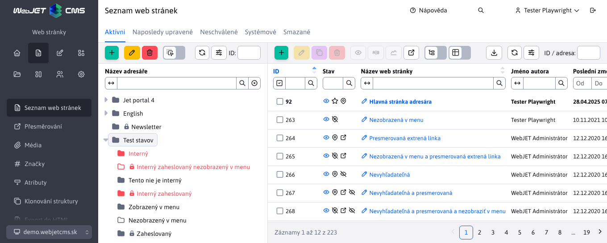
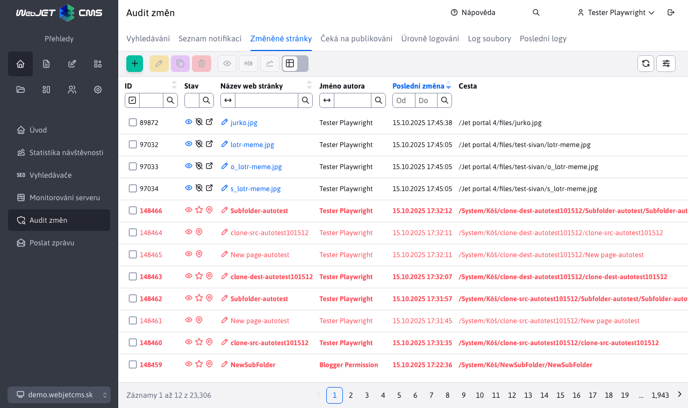
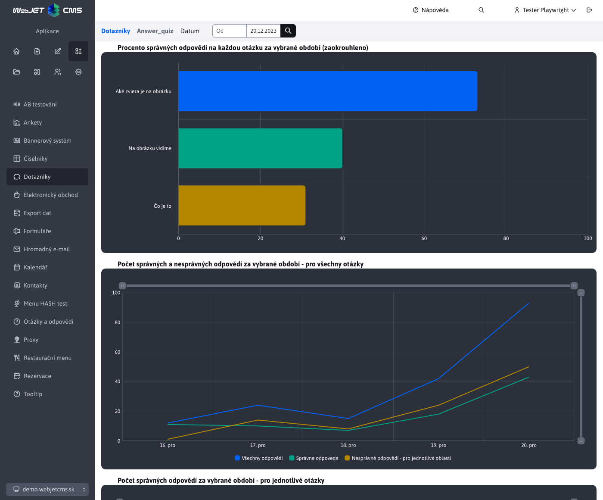

# WebJET CMS 2024

Vítejte v dokumentaci k WebJET CMS verze 2024. Doporučujeme přečíst si [seznam změn](CHANGELOG-2024.md) a [roadmap](ROADMAP.md).

# Seznam změn v poslední verzi

## 2024.18

> Verze 2024.18 obsahuje novou sadu ikon, Formulář snadno doplněn o pokročilá nastavení (příjemci, přesměrování...), do nového designu jsou předělány aplikace AB Testování, Audit (čeká na publikování, změněné stránky), Blog, Dotazníky, Kalendář událostí (schvalování ). Přidává podporu instalace typu MultiWeb (oddělení údajů domén) v Šablonách, Hromadném e-mailu a dalších aplikacích. Nová knihovna pro detekci prohlížečů, ve Statistika-Prohlížeče dojde k drobným rozdílům, ale údaje o prohlížeči anonymizovaně zaznamenáváme i bez Cookies souhlasu.

**Upozornění:** ke spuštění verze 2024 je třeba mít na serveru instalovanou Java verze 17.

### Průlomové změny

Tato verze přináší několik změn, které nemusí být zpětně kompatibilní:

- Hromadný email - upravená podpora odesílání emailů přes službu Amazon SES z použití speciálního API na [standardní SMTP protokol](install/config/README.md#nastavení-amazon-ses).
- [Odstraněné knihovny](install/README.md#změny-při-přechodu-na-20240-snapshot) `bsf,c3p0,cryptix,datetime,jericho-html,jsass,opencloud,spring-messaging,uadetector,joda-time ,aws-java-sdk-core,aws-java-sdk-ses,jackson-dataformat-cbor,jmespath-java` (#56265).
- Odstraněna značka `iwcm:forEach`, je třeba ji nahradit za `c:forEach`. Rozdíl je v tom, že Java objekt není přímo dostupný, je třeba jej získat pomocí `pageContext.getAttribute("name")`. Použijte volání `/admin/update/update-2023-18.jsp` pro aktualizaci vašich JSP souborů (#56265).
- Hromadný email - oddělené kampaně, příjemci a odhlášené emaily podle domén, starší záznamy jsou do domén zařazeny podle URL adresy web stránky pro odeslání. Výhoda v oddělení odhlášených emailů je v případě provozování více web sídel a rozdílných seznamů příjemců, kdy se odhlašuje odděleně pro jednotlivé domény. UPOZORNĚNÍ: aktuálně odhlášené emaily se nastaví pro doménu s ID 1, pokud používáte primárně hromadný email na jiné než první doméně aktualizujte sloupec `domain_id` v databázové tabulce `emails_unsubscribe` (#56425).
- Hromadný email - smazané nepoužívané metody z Java třídy `cs.iway.iwcm.dmail.EmailDB`, pokud je ve vašem projektu používáte přesuňte si je z [původního zdrojového kódu](https://github.com/webjetcms/webjetcms/ blob/ef495c96da14e09617b4dc642b173dd029856092/src/webjet8/java/cs/iway/iwcm/dmail/EmailDB.java) do vaší vlastní třídy (#56425).
- Ikony - z důvodu přechodu na Open Source řešení jsme změnili sadu ikon z původní FontAwesome na novou sadu [Tabler Icons](https://tabler.io/icons). Pokud ve vašich vlastních aplikacích používáte ikony ze sady FontAwesome je třeba upravit kód a nahradit je ikonami ze sady `Tabler Icons`. Můžete použít skript ```/admin/update/update-2023-18.jsp``` pro úpravu nejčastěji používaných ikon v administraci (upraví pouze soubory, které vyžadují přihlášení).

### Přechod na Java 17

WebJET CMS verze 2024 přešel na Java verze 17. Obsahuje následující změny:

- Aktualizováno několik knihovn, například. `AspectJ 1.9.19, lombok 1.18.28`.
- Aktualizovaná knihovna Eclipselink na standardní verzi, použití WebJET CMS `PkeyGenerator` nastaveno pomocí třídy `JpaSessionCustomizer` a `WJGenSequence`.
- Aktualizován `gradle` na verzi 8.1.
- Odstraněna stará knihovna ```ch.lambdaj```, použijte standardní Java Lambda výrazy (#54425).
- Odstraněna značka `<iwcm:forEach`, použití nahrazeno standardním `<c:forEach` (#56265).
- Pro zjednodušení aktualizace můžete použít skript ```/admin/update/update-2023-18.jsp``` pro kontrolu a opravu JSP souborů. Zákaznické Java třídy je třeba nově zkompilovat a opravit chyby z důvodu změny API.

### Nová sada ikon

Z důvodu přechodu na Open Source řešení jsme změnili sadu ikon z původní FontAwesome na novou sadu [Tabler Icons](https://tabler.io/icons). Některé ikony byly upraveny, aby lépe vystihovaly funkci tlačítka.



U datatabulek jsou ikony pro nastavení tabulky, znovu načtení údajů, import a export přesunuty napravo, aby lépe oddělily standardní funkce od nastavení a pokročilých operací. Na obrázcích je vidět srovnání nové (nahoře) a staré verze (dole).


### Vylepšení uživatelského rozhraní

- Menu - menu položky/ikony sekce (Přehled, Web stránky, Příspěvky...) se zobrazí pouze pokud má uživatel přístup k některé položce v dané sekci (#56169).
- Novinky - upravené přidání novinky - přepnutí na kartu Základní pro jednodušší nastavení titulku novinky a nastavení zařazení ve stromové struktuře dle zvolené sekce v hlavičce stránky (#56169).
- Úvod - sekce Přihlášení admini, Moje poslední stránky, Změněné stránky a Audit se zobrazují pouze pokud má uživatel potřebná práva (#56169).
- Úvod - doplnená informace o složce v seznamu posledních stránek, doplněna možnost otevřít auditní záznam (#56397).
- Web stránky - zlepšená editace na mobilních zařízeních - nástrojová lišta editoru je posouvatelná, dostupné jsou všechny ikony (#56249-5).
- Datatabulky - zlepšené uspořádání nástrojové lišty editoru při malých rozlišeních - ikony se korektně posunou na druhý řádek, možnost zadat ID zůstává vpravo nahoře (#56249-5)
- Datatabulky - ikona pro označení/odznačení všech záznamů mění stav podle toho, zda jsou označeny řádky, nebo ne (#56397).
- Datatabulky - zmenšené mezery mezi sloupci, snížená výška názvu stránky, nástrojové lišty a patičky pro zobrazení více sloutlců na obrazovce/zhuštění informací. Na stejné obrazovce by se měl v tabulce zobrazit minimálně jeden řádek navíc. (#56397).

### Web stránky

- Standardní [synchronizace titulku](redactor/webpages/group.md#synchronizace-názvu-složka-a-web-stránky) složky a hlavní web stránky se nepoužije, pokud je jedna web stránka nastavena jako hlavní více složkám, nebo když je hlavní stránka z jiné složky (#56477).

### MultiWeb

Přidána podpora [provozy v režimu MultiWeb](install/multiweb/README.md) - multi tenantní správa více samostatných domén v jednom WebJETu. Domény jsou navenek samostatné a každá se tváří jako samostatná instalace WebJET CMS.

- Seznam uživatelů - oddělený podle ID domény (#56421).
- Úvod - Online admini - oddělen podle domén (#56421).
- Práva na Doménové limity, HTTP hlavičky, Úrovně logování, Poslední logy, Skupiny uživatelů, Skupiny práv jsou dostupné pouze v první/správcovské doméně (#56421).
- Web stránky - přidána možnost vytvořit více kořenových složek (#56421).
- Statistika - Chybné stránky - přidán sloupec `domain_id` do databáze pro oddělení chybných URL adres podle domén (#56421).
- Média - skupiny médií - seznam rozdělený podle aktuální zobrazení domény a práv stromové struktury web stránek (#56421).

### AB testování

- Seznam stránek v AB testu předělaný do [nového designu](redactor/apps/abtesting/abtesting.md), přidaná sekce pro nastavení konfigurace AB testování (#56177).


### Audit

- Doplněna podpora filtrování uživatele i podle zadané email adresy.
- Předělaná sekce Audit->[Čeká na publikování](sysadmin/audit/audit-awaiting-publish-webpages.md) do nového designu. Přehledně zobrazuje seznam stránek, které budou v pozměněné v budoucnosti (#56165).
- Předělaná sekce Audit->[Změněné stránky](sysadmin/audit/audit-changed-webpages.md) do nového designu. Zobrazuje kompletní seznam změněných stránek za zvolené období (#56165).



### Blog

- Blog předělaný do nové administrace. Sekce seznam článků používá standardní možnosti jak jsou použity v seznamu web stránek/novinek (#56169, #56173).
- Původní seznam diskusních příspěvků je přesunut přímo do sekce Diskuse, uživatelé/blogeři získávají právo i na tuto část (#56169).
- Pro zobrazení seznamu článků je používána standardní aplikace pro novinky.
- Správa blogerů (administrace uživatelů) předělaná na datatabulku, umožňuje zjednodušeně vytvořit blogera a korektně mu nastavit práva.


### Dotazníky

Aplikace [dotazníky](redactor/apps/quiz/README.md) předělána do nového designu. Umožňuje vytvořit dotazníky s vyhodnocením správné odpovědi. Dotazník může být s jednou správnou odpovědí nebo s bodovanými odpověďmi. Aplikace obsahuje také statistické vyhodnocení (#55949).



### Formulář snadno

- Přidána karta rozšířena s pokročilými možnostmi nastavení zpracování formuláře podobně jako mají standardní HTML formuláře. Přidány možnosti nastavení příjemců, přesměrování, ID stránky s verzí do emailu atp. Upravený seznam položek formuláře pro lepší využití prostoru (#56481).


- Přidaný field type Formátované textové pole pro zadávání textů s formátováním jako je tučné písmo, odrážky, číslovaný seznam a podobně (#56481).


### GDPR Cookies

- Integrace s [Google Tag Manager](redactor/apps/gdpr/gtm.md) doplněna o nové typy souhlasů `ad_user_data` a `ad_personalization`, které jsou napojeny na souhlas s marketingovými cookies. Upraveno generování JSON objektu z hodnot `true/false` na správné hodnoty `granted/denied` (#56629).

### Hromadný e-mail

- Upravena podpora odesílání emailů přes službu Amazon SES z použití speciálního API na [standardní SMTP protokol](install/config/README.md#nastavení-amazon-ses) (#56265).
- Nastavení doménových limitů přidáno jako samostatné právo, ve výchozím nastavení je nepovoleno, je třeba jej přidat vhodným uživatelům (#56421).
- Oddělené kampaně, příjemci a odhlášené emaily podle domén, starší záznamy jsou do domén zařazeny podle URL adresy web stránky pro odeslání. Výhoda v orozdělení odhlášených emailů je v případě provozování více web sídel a rozdílných seznamů příjemců, kdy se odhlašuje odděleně pro jednotlivé domény. UPOZORNĚNÍ: aktuálně odhlášené emaily se nastaví pro doménu s ID 1, pokud používáte primárně hromadný email na jiné než první doméně aktualizujte sloupec `domain_id` v databázové tabulce `emails_unsubscribe` (#56425).
- Přidána možnost přímého [odhlášení se z hromadného emailu](redactor/apps/dmail/form/README.md#odhlášení) kliknutím na odkaz zobrazený v emailovém klientovi/Gmail nastavením hlavičky emailu `List-Unsubscribe` a `List-Unsubscribe=One -Click` (#56409).

### Kalendář událostí

- Neschválené a doporučené události - proces [schvalování nových událostí](redactor/apps/calendar/non-approved-events/README.md) a [doporučených událostí](redactor/apps/calendar/suggest-events/README.md) předěláno do nového designu (#56181).

### Novinky

- Přidána možnost Vyloučit hlavní stránky složek v [seznamu novinek](redactor/apps/news/README.md#nastavení-aplikace-ve-web-stránce) pro vyloučení hlavních stránek z pod složek v seznamu novinek. Předpokládá se, že podadresáře obsahují hlavní stránku se seznamem novinek v této složce, tyto stránky se vyloučí a nepoužijí se v seznamu novinek (#56169).

### Otázky a odpovědi

- Přidáno samostatné ukládání odpovědi do emailu i do databáze pro pozdější ověření odpovědi (#56533).
- Opraveno zobrazení sloupce Otázka již byla zodpovězena (#56533).
- Při zvolení možnosti Zobrazovat na web stránce se zkopíruje odpověď do emailu do odpovědi na web stránku (je-li již zadána) (#56533).

### Šablony

- Oddělený seznam šablon podle domén - zobrazují se pouze šablony, které nemají omezení zobrazení podle složek nebo obsahují omezení na složku aktuálně zobrazené domény (#56509).

### Statistika

- Upravené získání čísla týdne podle ISO 8601, hodnoty ve statistikách podle týdne mohou být rozdílné vůči předchozí verzi (#56305).
- Chybné stránky - přidán sloupec `domain_id` do databáze pro oddělení chybných URL adres podle domén. Historické údaje nejsou odděleny (zobrazí se ve všech doménách), ale od momentu aktualizace se budou zobrazovat již chybné URL oddělené podle domén (#56421).
- Upravena [detekce prohlížeče](redactor/apps/stat/README.md#prohlížeče) s využitím knihovny [UAP-java](https://github.com/ua-parser/uap-java). Některé údaje jsou detekovány jinak než původně - rozlišuje se Safari a Mobile Safari na iOS, operační systém pro Android telefony je namísto Unix nastaven na Android, pro některé případy je detekován Linux namísto Unix, macOS jako Mac OS X. Přidána podpora detekce Instagram a Facebook interního prohlížeče. Po aktualizaci na tuto verzi mohou tedy nastat rozdíly při zobrazení období před a po aktualizaci. Je možné aktualizovat soubor s definicí prohlížečů nastavením cesty k [YAML](https://github.com/ua-parser/uap-core/blob/master/regexes.yaml) souboru v konf. proměnné `uaParserYamlPath` (#56221).
- Typ prohlížeče a operační systém je zapsán do statistiky i bez souhlasu s ukládáním cookies, jelikož tento údaj cookies nepoužívá. Údaj je anonymizován a zapsán se zaokrouhleným časem na 15 minut (#56221).

### Bezpečnost

- 404 - přidána možnost vypnout ochranu volání 404 stránky (počet požadavků) podobně jako jiné spam ochrany nastavením IP adresy do konf. proměnné `spamProtectionDisabledIPs`. Pro danou IP adresu se vypnou i další SPAM ochrany (pro opakovaná volání).
- Přidána kontrola licencí použitých knihoven při `deployment` nové verze (#56265).
- Aktualizováno více knihovny na novější verze, majoritní verze změněny pro `mariadb-java-client` ze 2 na 3, `pdfbox` ze 2 na 3 (#56265).

### Testování

- Přidali/upravili jsme automatizované testování front-end části (ne admin části) aplikací Mapa, Carousel, Archiv souborů, Content Block, Datum, Google Vyhledávání, Odkazy na sociální sítě, Doporučení, Poslat stránku emailem, Počasí, Příbuzné stránky, Působivá prezentace , Slider, Slit Slider, Video, Carousel Slider, Vložení HTML kódu, Vložení dokumentu, Vyhledávání, Podmíněné zobrazení, Bloky (#56413).
- Přidána podpora pro automatické otestování/kontrolu mezi-doménového oddělení záznamů do [DataTables.baseTest](developer/testing/datatable.md#možnosti-nastavení) (#56509).

### Pro programátora

- Hromadný email - smazané nepoužívané metody z Java třídy `cs.iway.iwcm.dmail.EmailDB`, pokud je ve vašem projektu používáte přesuňte si je z [původního zdrojového kódu](https://github.com/webjetcms/webjetcms/ blob/ef495c96da14e09617b4dc642b173dd029856092/src/webjet8/java/cs/iway/iwcm/dmail/EmailDB.java) do vaší vlastní třídy (#56425).
- `MailHelper` - přidána možnost nastavit hlavičky emailu voláním `addHeader(String name, String value)`, API SendMail upravené pro použití `MailHelper`, který doporučujeme primárně používat pro odesílání emailů (#56409).
- Přidána možnost zobrazit ve vaší aplikaci seznam konf. proměnných podle [zadaného prefixu](./custom-apps/config/README.md) (#56177).
- Přidána možnost kontrolovat práva při vytvoření, editaci, mazání, provedení akce ale i při získání záznamu implementací metody `public boolean checkItemPerms(T entity, Long id)` (#56421).
- Přidána třída `DatatableRestControllerAvailableGroups` pro snadnou implementaci kontroly práv uživatele i na základě práv na stromovou strukturu web stránek (#56421).

### Systémové změny

- WebJET CMS je dostupný přímo v [repozitáři maven central](https://repo1.maven.org/maven2/com/webjetcms/webjetcms/), GitHub projekty [basecms](https://github.com/webjetcms/basecms ) a [democms](https://github.com/webjetcms/democms) upravené pro použití přímo tohoto repozitáře. Sestavení je mírně odlišné od původního sestavení, knihovny `wj*.jar` jsou spojeny do `webjet-VERZE-libs.jar`. Použitá knihovna [pd4ml](https://pd4ml.com/support-topics/maven/) je ve verzi 4, pro generování PDF souborů vyžaduje zadání licence do souboru `pd4ml.lic` v [pracovní složce](https:// pd4ml.com/support-topics/pd4ml-v4-programmers-manual/) serveru nebo složce kde se nachází `pd4ml.jar`. Později bude doplněna možnost zadat licenční číslo přes konfigurační proměnnou (#43144).
- Zrušená podpora plně textového indexování `rar` archivů (#43144).
- NTLM - přidána konf. proměnná `ntlmLogonAction.charsetEncoding` s názvem kódování znaků pro LDAP přihlášení. Pokud je prázdné, nepoužije se a znaky se ponechají v kódování jak je vrátí LDAP server.
- PostgreSQL - přidána podpora [databáze PostgreSQL](install/setup/README.md#vytvoření-db-schémata) (#56305).

Odstranili jsme několik nepoužívané knihovny, málo používané jsme nahradili alternativami:

- Odstraněna značka `<iwcm:forEach`, použití nahrazeno standardním `<c:forEach`. Změnu proveďte z `<iwcm:forEach items="${iii}" var="vvv" type="cs.iway.ttt">` na `<c:forEach items="${iii}" var="vvv "><%cs.iway.ttt vvv = (cs.iway.ttt)pageContext.getAttribute("vvv");%>`.
- Odstraněna JSP knihovna `datetime`, pokud používáte JSP značky `<datetime:xxx>` můžete si ji přidat do `build.gradle` jako `implementation("taglibs:datetime:1.0.1")`.
- Odstraněna knihovna `c3p0` a podpora použití tohoto databázového `pool`.
- Odstraněny staré JS funkce `saveEditor` a `historyPageClick` včetně staré REST služby `/admin/rest/document/`.
- Hromadný email - upravená podpora odesílání emailů přes službu Amazon SES z použití speciálního API/knihovny na [standardní SMTP protokol](install/config/README.md#nastavení-amazon-ses).

V případě potřeby některé z uvedených knihoven ve vašem projektu si ji přidejte do vašeho `build.gradle`:

```gradle
dependencies {
 implementation("com.amazonaws:aws-java-sdk-core:1.12.+")
 implementation("com.amazonaws:aws-java-sdk-ses:1.12.+")
 implementation("bsf:bsf:2.4.0")
 implementation("commons-validator:commons-validator:1.3.1")
 implementation("taglibs:datetime:1.0.1")
 implementation("net.htmlparser.jericho:jericho-html:3.1")
 implementation("jóda-time:jóda-time:2.10.13")
 implementation("io.bit3:jsass:5.1.1")
 implementation("org.jsoup:jsoup:1.15.3")
 implementation("org.mcavallo:opencloud:0.3")
 implementation("org.springframework:spring-messaging:${springVersion}")
 implementation("net.sf.uadetector:uadetector-core:0.9.22")
 implementation("net.sf.uadetector:uadetector-resources:2014.10")
 implementation("cryptix:cryptix:3.2.0")
 implementation("org.springframework:spring-messaging:${springVersion}")
 implementation("com.google.protobuf:protobuf-java:3.21.7")
 implementation("com.google.code.findbugs:jsr305:3.0.2")
 implementation("org.apache.taglibs:taglibs-standard-spec:1.2.5")
 implementation("org.apache.taglibs:taglibs-standard-impl:1.2.5")
 implementation('com.mchange:c3p0:0.9.5.5')
}
```

### Oprava chyb

2024.0.21

UPOZORNĚNÍ: upravené čtení a ukládání hesel uživatelů, po nasazení ověřte práci s uživatelským účtem, zejména změnu hesla, zapomenuté heslo atp. Použijte skript `/admin/update/update-2023-18.jsp` pro základní úpravu souborů.

- Bezpečnost - opravena kontrola přístupu k souborům ve složce `/files/protected/` při použití externích souborů - nastavena konf. proměnná `cloudStaticFilesDir` (#56277-6).
- Bezpečnost - opravena kontrola typů souborů při nahrávání ve formulářích a použití `/XhrFileUpload` (#56633).
- Elektronický obchod - opravený import ceníku
- Hromadný email - vrácená třída `EMailAction` pro použití v úkolech na pozadí pro odesílání hromadného emailu.
- Instalace - upravená detekce `JarPackaging` při startu pokud neexistuje soubor `poolman.xml`.
- Klonování struktury - opraveno klonování v jedno doménové instalaci.
- Klonování struktury - při klonování složky doplněné kopírování všech atributů původní složky (html kód do hlavičky, jméno instalace, přístupová práva, zobrazení v mapě stránek a navigační liště) (#56633).
- Plně textové vyhledávání - doplněna kontrola nastavení zaškrtávacího pole Indexovat soubory pro vyhledávání v nastavení složky. Pokud pole není zaškrtnuté, soubory ve složce se nebudou indexovat. Původní verze kontrolovala pouze existenci složky `/files` v kartě System ve web stránkách (#56277-6).
- PostgreSQL - opravené chyby získání údajů z databáze (boolean hodnota) - Kalendář událostí, Rezervace, Nepoužívané soubory, Posílání zpráv, Seznam administrátorů (#56277-6).
- Uživatelé - opraveno uložení hesla bez šifrování při použití API `UsersDB.getUser/UsersDB.saveUser` při přechodu přes GUI. Předpokládalo se, že hesla budou při API volání předem zašifrována, což se neudálo. Kód doplněný o detekci `hash`, při čtení z databáze se hesla, salt a API klíč nečte a nastaví se hodnota "Heslo nezměněno". Při změně hesla dojde k odhlášení ostatních relací téhož uživatele. (#56277-6).
- Vyhledávání - vyloučeno indexování souborů ze složky začínající na `/files/protected/`, pro `Lucene` vyhledávání doplněna kontrola na tuto cestu, odkaz nebude do vyhledání zařazen (standardní databázové vyhledávání podmínku již obsahovalo) (#56277-6).
- Zrcadlení struktury/Klonování - doplněno kopírování volných polí složky (#56637).
- Web stránky - upravené načítání stránek z podadresářů - filtrován je seznam stránek plně textového vyhledávání, pokud se nachází v hlavní složce domény (#56277-6).

2024.0.17

- Bezpečnost - opraveny zranitelnosti z penetračních testů (#55193-5).
- Bezpečnost - upravené vkládání objektů pomocí zápisu `!REQUEST` tak, aby byly [filtrovány speciální HTML znaky](frontend/thymeleaf/text-replaces.md#parametry-a-atributy) (#55193-6).
- Bezpečnost - třída `BrowserDetector` vrátí hodnoty s filtrovanými speciálními HTML znaky (#55193-6).
- Bezpečnost - opraveno generování QR kódu pro dvou faktorovou autorizaci, opraveno uložení autorizačního tokenu při vynucené dvou faktorové autorizaci po přihlášení (když je nastavena konf. proměnná `isGoogleAuthRequiredForAdmin` na hodnotu true) (#56593).
- Datatabulky - přidána možnost přeskočit chybné záznamy při importu z xlsx, chybové zprávy jsou kumulovány do jedné společné notifikace (#56465).
- Datatabulky - opraven import pouze nových záznamů (#56393-4).
- Formuláře - opraveno přepínání karet kliknutím na šipky na klávesnici při zadávání textu v kartách Rozšířené nastavení nebo Limity na soubory (#56393-3).
- Formuláře - doplněna možnost vytisknout formulář v seznamu formulářů (#56393-3).
- Formuláře - opraveno zobrazení náhledu formuláře odeslaného jako email bez formátování (#55193-6).
- Záhlaví HTTP `Strict-Transport-Security` je ve výchozím nastavení nastaveno na `max-age=31536000` (#55193-5).
- Hromadný email - opraveno získání web stránky z URL adresy (#56393-3).
- Hromadný email - opraveno nastavení příjemců pro nově vytvářený email (#56409).
- Hromadný email - přidána možnost manuálně zadat více příjemců emailu oddělených i znakem mezera (podporováno je oddělení znakem čárka, středník, mezera nebo nový řádek) a přeskočit vadné emaily (#56465).
- Hromadný email - při znovu uložení kampaně/spuštění a zastavení odesílání jsou z kampaně smazáni aktuálně odhlášení příjemci (aby nedošlo k opětovnému odeslání emailu po odhlášení), zlepšená kontrola duplicit při manuálním přidání a importu z xlsx (#56465).
- Hromadný email - upravena kontrola email adresy, povoleno i jedno písmenové domény a email adresy (#56465).
- Mazání dat - cache objekty - upravená dostupnost tlačítek smazat vše jen pro případ, kdy není označen ani jeden řádek.
- Média - výběr média skupiny, která má omezená práva.
- Notifikace - přidána možnost posouvání seznamu notifikací - pro případ zobrazení dlouhé notifikace, nebo velkého množství notifikací (#56465).
- PDF - opravené generování PDF souborů s vloženým obrázkem přes httpS protokol - knihovna `pd4ml` chybně detekuje verzi Javy z druhého čísla podle původního číslování `1.8`, přičemž aktuálně se používá `17.0`. Upraveno dočasnou změnou druhého čísla na hodnotu 8 (#56393-2).
- Uživatelé - zlepšený import uživatelů - automatické generování přihlašovacího jména, hesla a doplněné číslo řádku při chybném záznamu (#56465).
- Statistika - opravený jazyk a formát dat v grafech statistiky podle zvoleného jazyka přihlášení (#56381).
- Otázky a odpovědi - opraveno zobrazení sloupce Otázka již byla zodpovězena, při uložení odpovědi se zkopíruje odpověď do emailu do odpovědi na web stránku jako bylo ve verzi 8 (#56533).
- Vložení dokumentu - doplněno opakované získání náhledu dokumentu, pokud se ho nepodaří načíst na první pokus (#56393-3).
- Web stránky - zrušená klávesová zkratka `ctrl+shift+v` pro vložení jako čistý text, jelikož tuto možnost již standardně poskytuje přímo prohlížeč (#56393-3).

2024.0.9

- Datatabulky - opravený export dat ve statistice (u tabulky se `serverSide=false`) (#56277-3).
- Galerie - opraveno načtení seznamu fotografií při zobrazení galerie se zadané složky (např. ve web stránce) (#56277-1).
- Používatelé - zobrazení práv na webové stránky a složky upravené pro zobrazení každého záznamu na novém řádku pro lepší přehled (#56269).
- Uživatelé - upravený export a import pro podporu doménových jmen při nastavení práv na web stránky a složky (#56269).
- Web stránky - opraveno nastavení složky podle titulku stránky u ještě neuložené webové stránky a přetažení obrázku přímo do editoru (#56277-1)
- Web stránky - přidána možnost zadat do odkazu telefonní číslo ve formě `tel:0903xxxyyy` (#56277-4)
- SEO - oprava zaznamenání přístupu robota bez odsouhlaseného GDPR (statistika robota se zaznamená bez ohledu na souhlas) (#56277-5).

### Testování

- Datatabulky - základní test - u povinných polí, která mají předem nastavenou hodnotu se přeskočí test povinnosti pole (#56265).


[Kompletní seznam změn >>](CHANGELOG-2023.md)