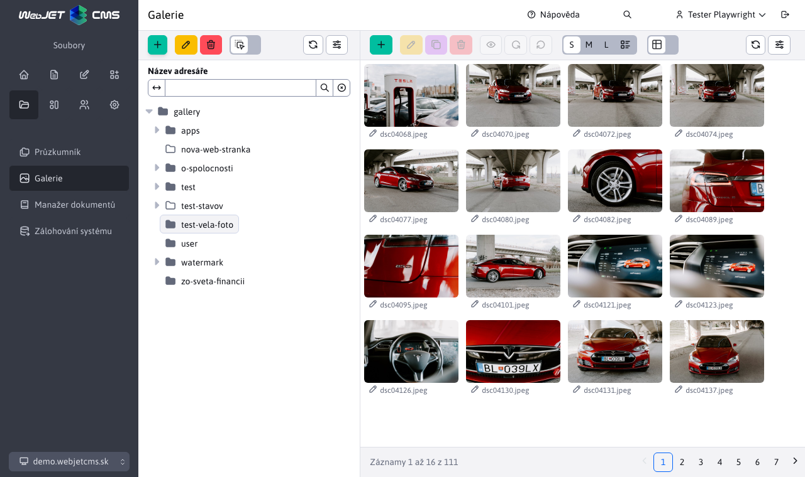
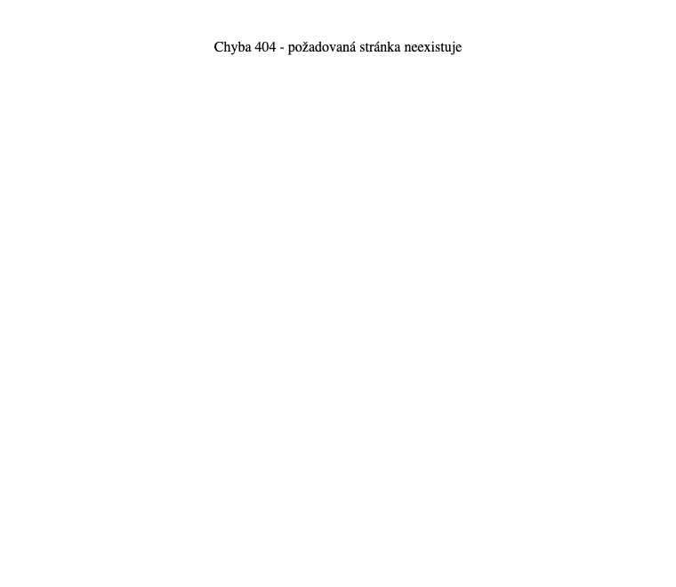

# WebJET CMS 2024

Vítejte v dokumentaci k systému WebJET CMS verze 2024. Doporučujeme přečíst si [seznam změn](CHANGELOG-2024.md) a [roadmap](ROADMAP.md).

# Seznam změn v nejnovější verzi

## 2024.52

> Ve verzi 2024.52 je na webu přidána možnost nastavit **způsob uspořádání** a **vyhledávání ve stromové struktuře**, import ZIP umožňuje nastavit způsob porovnání stávající verze stránky. **Elektronické obchodování** obdržel nový design seznamu objednávek a produktů. Přidáno **statistiky průzkumu**, lepší editor obrázků v průzkumníku a vylepšené vyhledávání v administraci. V **hromadné e-maily** přidána možnost **nastavit potvrzení odhlášení**. Galerie obsahuje nové pole pro **adresa URL zdroje obrázku**, která se vyplní automaticky při použití fotobanky, **Štítky** Přidávají **jazykové mutace** a nepovinná pole.

### Převratné změny

- Aktualizace knihoven Java a JavaScript na novější verze, změny najdete v sekci pro programátory níže. Můžete použít aktualizační skript `/admin/update/update-2023-18.jsp`.
- Zvýšená bezpečnost [veřejné služby REST](custom-apps/spring/public-services.md) pokud je používáte, musíte si vyřídit povolení. Zrušená služba REST `/admin/rest/property/set` (#57202).
- FontAwesome - upravené vkládání [Ikony FontAwesome](frontend/webpages/fontawesome/README.md) v editoru (#57461).
- Elektronický obchod - metody v `DocDetails` pro získání ceny upravené z návratové hodnoty `double` na adrese `BigDecimal`. Můžete použít skript `/admin/update/update-2023-18.jsp` pro základní aktualizaci souborů JSP. V případě potřeby můžete dočasně použít metody `getPriceDouble/getVatDouble/getLocalPriceDouble/getLocalPriceDouble` (#56385).

### Webové stránky

- Přidána možnost zvolit způsob a směr uspořádání [stromové struktury](redactor/webpages/README.md#nastavení-zobrazení-stromové-struktury) (#57257).


- Struktura stromu - přidání možností [vyhledávání ve stromové struktuře](redactor/webpages/README.md#vyhledávání-ve-stromové-struktuře) složky webu do hloubky (#57265).


- Štítky - přidaná možnost [nastavení jazyka](redactor/webpages/perexgroups.md#překlady-karet) název skupiny perex pro zobrazení značky title podle jazyka webové stránky (#57273).


- FontAwesome - upravené vkládání [Ikony FontAwesome](frontend/webpages/fontawesome/README.md) v editoru (#57461).
- Import webových stránek z archivu ZIP - přidání možnosti výběru parametru [porovnat existenci](redactor/webpages/import-export.md#import-webových-stránek-z-archivu-zip) webové stránky, upravené vizuály, přidané možnosti o/z/označení všech stránek/souborů, otevření/zavření složek a přidané informace o průběhu importu. Volitelné pole Porovnání umožňuje stránkám nastavit jedinečný identifikátor pro jednoznačnou identifikaci webové stránky (#57441) prostřednictvím volitelného typu pole.


- Importování webových stránek z archivu ZIP - přidáno oddělení dat na adrese `multi-domain` kde jsou při hledání existující verze importovaných dat ignorována data jiné domény (#57493).
- Vylepšený přenos názvu instalace ze šablony do `CombineTag`. Hodnota je uložena v `session` a budou také použity při načítání souborů během provádění programu `combine` (#56325).
- Vyhledávání souboru šablony JSP bere v úvahu název instalace nastavený v šabloně (#56325).
- Štítky - přidaná karta s [nepovinná pole](redactor/webpages/perexgroups.md#nepovinná-pole-na-kartě) pro možnost přidávat do značek vlastní údaje. Například nastavení barvy značky, designu značky atd. (#57449).
- Klonování struktury - při klonování je zakázána synchronizace názvu webové stránky a složky, aby byly zachovány názvy podle původní složky. Konfigurační proměnná `syncGroupAndWebpageTitle` je nastavena na hodnotu `false` a po dokončení klonování se nastaví na původní hodnotu (#57489).
- Upravené číslování, pokud existuje webová stránka se stejným názvem/URL adresou - nově vytvořená stránka začíná od čísla 2 namísto čísla 1, čímž se vytvoří URL typu `/en/page.html,/en/page-2.html,/en/page-3.html` místo `/en/page.html,/en/page-1.html,/en/page-2.html` Kde: `-1.html` nebylo sémanticky optimální (#54273-50).
- Přidána možnost změnit chování posledního `/` Na adrese [generování adres URL pro stránky](frontend/setup/config.md). Ve výchozím nastavení končí adresa URL hlavní stránky složky znakem `/`, takže např. `/en/products/`, po nastavení konfigurační proměnné `virtualPathLastSlash` na hodnotu `false` bude adresa URL vygenerována bez posledního `/` tedy jako `/en/products` (#54273-50).

### Průzkum

- Přidáno [statistiky odezvy](redactor/apps/inquiry/inquiry-stat.md) ankety (#57337).


### Elektronické obchodování

- [Seznam objednávek](redactor/apps/eshop/invoice/README.md) a [Seznam produktů](redactor/apps/eshop/product-list/README.md) upraveno na nový design datových tabulek (#56325).


- Metody v `DocDetails` pro získání ceny upravené z návratové hodnoty `double` na adrese `BigDecimal` (#56385).

### Galerie

- Výchozí typ vizuálního stylu galerie lze nastavit pomocí proměnné conf. `galleryDefaultStyle`, ve výchozím nastavení `photoSwipe` (#56393-18).
- Přidána možnost zvolit způsob a směr uspořádání [stromové struktury](redactor/webpages/README.md#nastavení-zobrazení-stromové-struktury) (#57257).
- Přidáno pole URL zdroje obrázku s možností zadat adresu, ze které jste obrázek získali. Pole se automaticky nastaví při použití [fotobanky](redactor/webpages/working-in-editor/README.md#karta-fotobanky) v seznamu webových stránek (#57313).
- Přidána možnost **vyhledávání ve stromové struktuře** podle názvu, podobně jako na webových stránkách (#57437).



### Hromadný e-mail
- Odesílání - při odesílání se certifikát SSL webové stránky ignoruje, protože v interním prostředí se často používá dočasný certifikát SSL (#57525).
- Odhlášení - vytvořena nová aplikace pro nastavení odhlášení. Přidána možnost zadat vlastní text před odhlášením a možnost zobrazit potvrzení místo okamžitého odhlášení kliknutím na odkaz v e-mailu (#57525).
- Odhlášení - upravený formulář pro hromadné odhlášení e-mailů - přidána možnost zobrazení potvrzení odhlášení a možnost opětovného vrácení e-mailu po odhlášení (#57525).



### Průzkumník

- Kompletní náhrada editoru obrázků v akci [editace souborů](redactor/files/fbrowser/file-edit/README.md) v sekci průzkumníka za editorem ve tvaru `DataTable` podle fotogalerie (#57313).
- Vylepšené zobrazení na mobilních telefonech pro lepší použitelnost - upravená výška, velikost (#55645).

### Další

- Přepracované vyhledávání v administraci datových tabulek (#57333).


- Přejmenování možnosti Upravit buňku na Upravit v zobrazení mřížky podle názvosloví použitého v dokumentu `Microsoft SharePoint`.
- Vyhledávání - upravil vyhledávací formulář na webové stránce o možnost definovat zástupný text (`placeholder`) namísto standardního Hledání. Poté můžete zadat vlastní text, který se zobrazí ve formuláři, například Search Web Page (#54273-53).

### Zabezpečení

- Modifikovaný startovací protokol - citlivé informace jako hesla, tokeny, certifikáty z konfiguračních proměnných jsou nahrazeny výrazem `********` (#MR643).
- [Pro veřejné služby REST](custom-apps/spring/public-services.md) přidána možnost nastavit povolené IP adresy pro každou službu zvlášť (#57202).
- Překladové klíče - přidána možnost filtrovat klíče ve službě REST [/rest/properties/](custom-apps/spring/public-services.md) podle konf. proměnné `propertiesRestControllerAllowedKeysPrefixes` znemožnit veřejné načtení všech klíčů ze systému WebJET CMS (#57202).
- Přidání hlavičky HTTP do auditu `Referer` (#57565).

### Oprava chyb

- Opraveno generování adresy URL pro testování AB, pokud původní adresa URL obsahuje znak `*` (#54273-50).
- Editor obrázků - opraveno přejmenování obrázku v editoru obrázků otevřeném z průzkumníka (#57269).
- Přesměrování domény - byla opravena možnost zadat protokol pro doménu přesměrování. Přidána logika přesměrování `https` verze při výběru možnosti `http` původního protokolu - předpokládané přesměrování na `https` Verze (#56393-20).
- Webové stránky - Nástroj pro tvorbu stránek - opraveno vkládání aplikací a bloků na správné místo kurzoru (#57613).
- Webové stránky - Bloky - Opraveno odstranění prázdného místa ve Firefoxu při vkládání bloku (#57613).

### Dokumentace

- Dokumentace vytvořená pro [zlepšení výkonu serveru](sysadmin/performance/README.md) (#57357).
- Vytvořená dokumentace ve formátu PDF pro [editora](_media/manuals/webjetcms-redactor.pdf), [Správce](_media/manuals/webjetcms-admin.pdf), [provoz](_media/manuals/webjetcms-sysadmin.pdf) a [nainstalovat](_media/manuals/webjetcms-install.pdf). Dokumentace PDF je automaticky generována z aktuální dokumentace MarkDown a obsahuje datum verze WebJET CMS (#57269).

### Pro programátora

- Změněné rozhraní API pro datovou tabulku `table.ajax.url(newUrl); -> table.setAjaxUrl(newUrl);`, `table.ajax.url() -> table.getAjaxUrl()` (#57365).
- Aktualizováno `Swagger-UI` na adrese `/admin/swagger-ui/` na verzi `org.webjars:swagger-ui:5.17.14` (#57365).
- Aktualizovaná knihovna `Bootstrap` z 4.6.1 na 5.3.3 a `jQuery` z verze 3.5.1 na 3.7.1 pro starou administraci v8 (#57365).
- Knihovny odstraněné ve verzi 8 `bootstrap-modal,bootstrap-switch,bootstrap-toastr,uniform,simple-line-icons` (#57365).
- Potřebujete upravit přepínání karet v souborech JSP, vyhledejte položku `data-toggle="tab"` a nahradit je textem `data-bs-toggle="tab"`, `LI` nastavit prvek `class="nav-item"` a na první `A` nastavit prvek `class="active"`:

```html
<ul class="nav nav-tabs">
    <li class="nav-item">
        <a class="active" href="#tabMenu1" data-bs-toggle="tab">
            <iwcm:text key="components.filter"/>
        </a>
    </li>
    <li class="nav-item">
        <a href="#tabMenu2" data-bs-toggle="tab" onclick="loadComponentIframe();">
            <iwcm:text key="components.file_archiv.waiting_files"/>
        </a>
    </li>
</ul>
```
- Odstraněné metody `DocDB.searchTextAll,searchTextUrl`, použijte třídu `sk.iway.iwcm.search.SearchService` (#57333).
- Aplikace prostřednictvím `!INCLUDE` lze vložit také ze složek `/apps` a `/templates` (#56325).
- [Volitelná pole](frontend/webpages/customfields/README.md#barva) - přidaný typ pole `color` pro výběr barvy (#57449).
- Pro [aplikace v editoru](custom-apps/appstore/README.md#použití-anotace) je možné definovat více souborů JSP, pro které se bude používat, např. `@WebjetAppStore(...componentPath = "/components/search/search.jsp,/components/search/lucene_search.jsp")`. První soubor JSP v seznamu (#54273-53) se použije při vkládání nové aplikace.

[Úplný seznam změn >>](CHANGELOG-2024.md)


