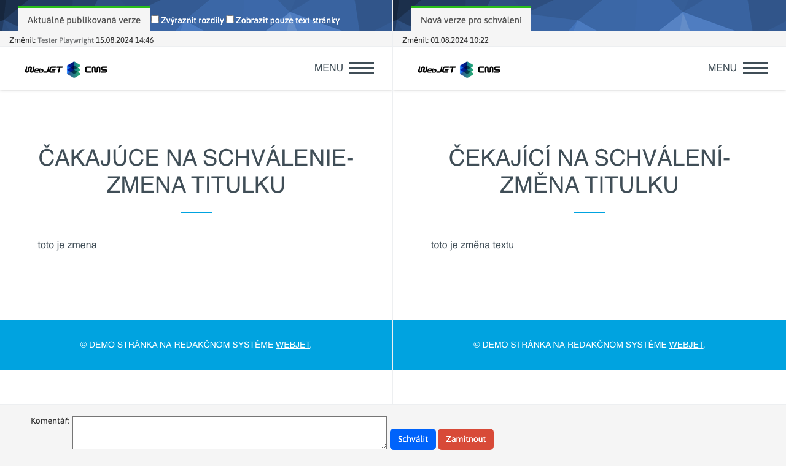

# WebJET CMS 2026

Vítejte v dokumentaci k WebJET CMS verze 2026. Doporučujeme přečíst si [seznam změn](CHANGELOG-2026.md) a [roadmap](ROADMAP.md).

## Seznam změn ve verzi 2026.0

> **WebJET CMS 2026.0** přináší vylepšenou verzi nástroje **Page Builder** pro tvorbu **komplexních web stránek**. V blocích je možné **vyhledávat a filtrovat** na základě značek, snadno tak naleznete vhodný blok pro vložení do stránky. Přidány byly nové funkce jako **rozdělení sloupce**, **vkládání více sekcí najednou** a **stále zobrazené tlačítko pro přidání nové sekce** pro rychlé rozšíření obsahu stránky.
>
> Podpora **PICTURE elementu** umožňuje zobrazovat **různé obrázky podle rozlišení obrazovky** návštěvníka, čímž se zlepšuje vizuální zážitek na různých zařízeních. Navíc lze vkládat **vlastní ikony** definované ve společném SVG souboru, což přináší větší flexibilitu v designu.
>
> Nový nástroj pro **tvorbu formulářů** umožňuje snadno vytvářet **vícekrokové formuláře** s možností programové validace jednotlivých kroků a možností **potvrzení platnosti emailové adresy** pomocí zaslaného kódu. Vyhnete se tak vyplnění formulářů různými roboty.

### Průlomové změny

- Aktualizované knihovny `commons-lang,displaytag`, více v [sekci pro programátora](#pro-programátora) (#58153).
- Změněné chování ikony Bloky v režimu Page Builder - [textové bloky integrované](frontend/page-builder/blocks.md) do složky `content` podobně jako jsou bloky pro `section, container, column` (#58165).
- Upravené zpracování **nahrávání souborů**, více v `multipart/form-data` sekci pro programátora[ (#57793-3).](#pre-programátora) Doporučujeme&#x20;
- zkontrolovat funkčnost všech formulář&#x16F;**&#x20;z důvodu úprav jejich zpracování, více informací v sekci&#x20;**&#x70;ro programátora[ (#58161).](#pre-programátora) Webové stránky

### Přidána možnost vkládat&#x20;

- &#x20;element, který zobrazuje `PICTURE` obrázek podle rozlišení obrazovky[ návštěvníka. Můžete tedy zobrazit rozdílné obrázky na mobilním telefonu, tabletu nebo počítači (#58141).](frontend/setup/ckeditor.md#picture-element) Přidána možnost vkládat&#x20;

- vlastní ikony[ definované ve společném SVG souboru (#58181).](frontend/setup/ckeditor.md#svg-ikony) Přidán přenos aktuálního HTML kódu při přepnutí režimu editoru Standardní/HTML/Page Builder. Můžete tak jednoduše upravit Page Builder stránku v HTML kódu a znovu zobrazit úpravy v režimu Page Builder (#58145).

- Přidáno kontextové menu Smazat element, pomocí kterého můžete snadno smazat tlačítko, odkaz, odstavec, formulář, sekci a podobně. Stačí když na element kliknete pravým tlačítkem pro zobrazení kontextového menu (#osk233).
- Page Builder - upravené generování stylů při použití nástroje tužka. Do CSS stylu se generují jen změněné hodnoty, ty jsou v dialogovém okně zvýrazněny modrým orámováním vstupního pole (#58145).
- Page Builder - přidána možnost volání&#x20;
- vlastního JavaScript souboru[ s podpůrnými funkcemi pro úpravu kódu. Přidána možnost upravit nastavení jako selektory pro elementy, barvy a podobně (#58141).](frontend/page-builder/blocks.md#podporný-javascript-kód) Page Builder - upravené generování kotev u karet tak, aby název kotvy byl generován podle názvu karty - původně byl generován nesémanticky jako&#x20;
- &#x20;(#112).`autotabs-x-y`Page Builder - doplněna možnost nastavit šířku sloupce na&#x20;
- &#x20;pro automatické přizpůsobení obsahu (#114).`auto`Page Builder - doplněna možnost připravit&#x20;
- textové bloky[ přímo do složky ](frontend/page-builder/blocks.md), vkládají se namísto původních bloků čtených z web stránek ze složky Šablony. Web designér je připraví spolu s ostatními typy Page Builder bloků. Umožňuje rychlé vložení často používaných textových částí, tlačítek a podobně (#58165 `content`Page Builder - při vkládání nového bloku je výchozí karta Knihovna namísto Základní, aby se zjednodušil výběr bloku z připraveného seznamu (#58165).
- Page Builder - doplněna možnost rozdělit sloupec na dvě části pomocí nové funkce Rozdělit sloupec. Vyvoláte ji pomocí kliknutí na + ve žluté liště, zvolením možnosti Blok a následně v kartě Základní zvolíte možnost Rozdělit sloupec. Funkce umožňuje rychlé rozdělení sloupce bez nutnosti vkládat nový sloupec a přesouvat obsah (#58165).
- Page Builder - doplněna možnost vložit blok, který obsahuje více sekcí nebo jiných elementů - označí se po vložení všechny sekce (#58173).
- Page Builder - doplněno&#x20;
- ID bloku[ do atributu ](frontend/page-builder/blocks.md#id-bloku) pro možnost vyhledání použití bloku ve web stránkách přes vyhledávání v administraci (#58193 `data-pb-id`Page Builder - seznam oblíbených bloků je ukládán pro každého uživatele zvlášť, aby si každý mohl spravovat vlastní seznam oblíbených bloků (#58193).
- Page Builder - přidána stále zobrazená ikona pro přidání nové sekce na konci stránky, což zjednodušuje přidávání nových sekcí do stránky (#58173).
- Page Builder - upravený design nástrojové lišty pro lepší viditelnost na různých pozadích (#58165).

- Page Builder - doplněna možnost&#x20;

- filtrovat bloky[ podle názvu a štítků (#58173).](frontend/page-builder/blocks.md#názov-a-značky-bloku) Doplněna&#x20;

- detekce změny obsahu[ a upozornění na neuložené změny při zavírání okna prohlížeče. Změny se začnou detekovat 5 vteřin po otevření web stránky. (#112).](redactor/webpages/working-in-editor/README.md#detekcia-zmeny-obsahu-stránky) Doplněna možnost nastavit výchozí hodnoty pro tabulky v CKEditoru přes konfigurační proměnné, více v&#x20;
- sekci nastavení CKEditoru[ (#58189).](frontend/setup/ckeditor.md#konfiguračné-premenné) Doplněna možnost vkládat&#x20;
- tlačítko[ - element ](frontend/setup/ckeditor.md#tlačítko). Umíte tak snadno vkládat různé akční `button` tlačítka (#58201).`call to action`Styl -&#x20;
- výběr stylu[ definovaného pro element Např. ](frontend/examples/template-bare/README.md#seznam-stylů-pro-editor) nebo `p.paragraph-green,p.paragraph-red-border,p.paragraph-yellow-background` umožňuje nastavit více stylů současně. Opakovaným zvolením již nastaveného stylu se tento styl odstraní (#OSK140).`section.test-section,section.test-section-green`Upravený text pro publikování stránky do budoucnosti na&#x20;
- Naplánovat změnu stránky po tomto dat&#x75;**, při zvolení této možnosti se také změní tlačítko pro uložení na text&#x20;**&#x4E;aplánova&#x74;**&#x20;pro jasnější informaci pro uživatele (#58253).**&#x44;o žádosti o schválení web stránky doplněn seznam změněných polí (#58077).
- Aplikace

### Předěláno nastavení vlastností aplikací v editoru ze starého kódu v&#x20;

&#x20;na `JSP` aplikace. Aplikace automaticky získávají i možnost nastavit `Spring` zobrazení na zařízeních[. Design je ve shodě se zbytkem WebJET CMS a datových tabulek (#58073).](custom-apps/appstore/README.md#podmienené-zobrazenie-aplikácie) Novinky
- [Formulář snadno](redactor/apps/news/README.md)

- [Formuláře](redactor/apps/formsimple/README.md)

### Nový způsob vytváření formulářů, které mohou obsahovat&#x20;

- více kroků[ s pokročilými funkcemi. V seznamu formulářů umíte vytvořit nový formulář, kterému následně přidáte jednotlivé položky a případně několik kroků. Karta položky formuláře je viditelná v detailu formuláře typu Vícekrokový formulář (#58161).](redactor/apps/multistep-form/README.md) Seznam formulářů - celá sekce byla předělána z technologie&#x20;

    <iframe width="560" height="315" src="https://www.youtube.com/embed/XRnwipQ-mH4" title="YouTube video player" frameborder="0" allow="accelerometer; autoplay; clipboard-write; encrypted-media; gyroscope; picture-in-picture" allowfullscreen></iframe>

- &#x20;na standardní `Vue.js` pro lepší integraci do WebJET CMS a zjednodušení úprav (#58161).`Html + JavaScript`Seznam formulářů - umožněno vytváření formuláře, který je automaticky typu&#x20;
- vícekrokový formulář[ (#58161).](redactor/apps/multistep-form/README.md) Seznam formulářů - umožněno nastavování parametrů/atributů všech typů formulářů přímo v editoru formuláře (#58161).
- Seznam formulářů - pole poznámka umožňuje vkládat formátovaný text, umíte tak lépe evidovat doplňkové informace k formuláři (#58161).
- Detail formuláře - přidána možnost zobrazení všech údajů přihlášeného uživatele, data se také exportují do Excelu (#58161).
- Ověřovací kód - přidána možnost odeslat formulář až po zadání&#x20;
- ověřovacího kódu[ zaslaného na email adresu. Umíte tak lépe chránit formuláře před SPAM-em (#58161).](redactor/apps/form/README.md#nastavenie-potvrdenia-zaslaným-kódom) Přesměrování

### Přidáno možnost ukončit platnost přesměrování ve stanoveném čase a možnost zadat poznámku s informací k čemu přesměrování slouží. Přesměrování, která již nejsou časově platná, se zobrazí červeně (#58105).

- Elektronický obchod

### Nová sekce&#x20;

- Způsoby doručení[, jako samostatná tabulka nahrazuje původní konfiguraci dostupných způsob doručení, která se nacházela přímo v nastaveních aplikace ](redactor/apps/eshop/delivery-methods/README.md) elektronického obchod&#x75;**. Pro každý způsob doručení lze nastavit také cenu, která při zvolení možnosti bude automaticky přičtena k objednávce. Nastavené způsoby doručení se také automaticky promítnou do možností při vytváření objednávky zákazníkem. Připraveno je doručení poštou a osobní vyzvednutí, do budoucna plánujeme doplnit integraci na doručovací společnosti (#58061).**&#x42;ezpečnost

### Přidána podpora pro povolení pouze&#x20;

- jednoho aktivního přihlášen&#xED;**&#x20;na jednoho uživatele. Režim zapnete nastavením konfigurační proměnné&#x20;**&#x20;na hodnotu `sessionSingleLogon`. Při novém přihlášení se zruší předchozí aktivní `true` (#58121).`session`Odstraněna nepodporovaná knihovna&#x20;
- commons-lang[, nahrazena novou knihovnou ](https://mvnrepository.com/artifact/commons-lang/commons-lang) commons-lang3[, v ](https://mvnrepository.com/artifact/org.apache.commons/commons-lang3) je aktualizační skript pro úpravu zdrojových kódů (#58153).`update-2023-18.jsp`Přidán seznam&#x20;
- Moje aktivní přihlášení[ na úvodní obrazovce administrace, která zobrazuje všechna aktivní přihlášení do administrace pod vaším uživatelským účtem a možnost jejich ukončení. Přidána i možnost odeslat email přihlášenému administrátorovi (#58125).](redactor/admin/welcome.md#moje-aktívne-prihlásenia) Captcha - nastavením konfigurační proměnné&#x20;

- &#x20;na hodnotu `captchaType` lze Captcha zcela vypnout. Nezobrazí se iv případě, pokud má šablona zobrazené web stránky vypnutou SPAM ochranu. V takovém případě je ale třeba korektně kontrolovat vypnutí SPAM ochrany šablony iv případném kódu zpracování/verifikace Captcha odpovědi, pro formuláře je tato kontrola zabezpečena. Můžete použít volání `none` pro ověření režimu a vypnutí spam ochrany (#54273-78).`Captcha.isRequired(component, request)`Aktualizovaná knihovna pro&#x20;
- odesílání emailů[ z ](install/config/README.md#odesílání-emailů) na `com.sun.mail:javax.mail:1.6.2` z důvodu podpory nových autentifikačních mechanismů SMTP serverů jako například `com.sun.mail:jakarta.mail:1.6.8` a přidaná konfigurační proměnná `NTLMv2` pro vynucení použití autorizačního mechanismu - nastavte např. na hodnotu `smtpAuthMechanism` pro vynucení `NTLM` autorizace namísto použití `NTLM` autorizace (#58153 `BASIC`Upraveno logování výjimek při přerušení HTTP spojení (např. při zavření prohlížeče, odchodu na jinou web stránku a podobně). Takové výjimky se nezapíší do logu, aby nenastala chyba obsazení místa. Týká se výjimek typu&#x20;
- &#x20;a názvů výjimek definovaných přes konfigurační proměnnou `IOExceptio`, výchozí `clientAbortMessages` (#58153).`response already,connection reset by peer,broken pipe,socket write error`Jiné menší změny

### Vyhledávání – upravené načtení seznamu šablon při hledání web stránek. Načtou se všechny šablony bez ohledu na jejich dostupnost ve složkách, aby se nestalo, že při editaci web stránky šablona není dostupná (#58073).

- HTTP hlavičky - přidána možnost nastavit hlavičku delší než 255 znaků, například pro nastavení&#x20;
- &#x20;(`Content-Security-Policy`#82[)](https://github.com/webjetcms/webjetcms/issues/82) Konfigurace - upravený způsob smazání konfigurační proměnné. Po vymazání se automaticky nastaví původní hodnota z&#x20;

- , aby byla stejná jako bude po restartu serveru. V původním řešení se proměnná jen smazala, ale její hodnota zůstala interně nastavena do restartu serveru (#57849).`Constants`Konfigurace - přidána možnost nastavit&#x20;
- jméno HTTP hlavičky[ pro získání IP adresy návštěvníka přes konfigurační proměnnou ](sysadmin/pentests/README.md#konfigurace) (#58237).`xForwardedForHeader`Bezpečnost - přidána možnost konfigurace blokovaných cest souborů/adresářů přes proměnnou&#x20;
- . Standardně jsou blokovány URL adresy, které v názvu obsahují výraz `pathFilterBlockedPaths`. Lze přidat další podle potřeby (#PR103).`.DS_Store,debug.,config.properties,Thumbs.db,.git,.svn`Značky - upravené zobrazené značek, v případě duplicity hodnot. Porovnání je bez vlivu diakritiky a velkých/malých písmen&#x20;
- #115[.](https://github.com/webjetcms/webjetcms/issues/115) Zrcadlení - přidána možnost zobrazit obrázek vlajky namísto textu v&#x20;

- přepínači jazyka stránky[ (#54273-79).](redactor/apps/docmirroring/README.md#vytvorenie-odkazu-na-jazykové-mutácie-v-hlavičke-stránky) Změna hesla - přidána možnost nastavit jméno a email adresu ze které je odeslán email s odkazem na změnu hesla přes konfigurační proměnné&#x20;
- &#x20;a `passwordResetDefaultSenderEmail` (#58125 `passwordResetDefaultSenderName`Statistika - doplněné sumární počty vidění a návštěv v TOP stránkách (#PR136).
- Novinky - přejmenovaná hodnota uspořádat podle priority na uspořádat podle Pořadí uspořádání (priority) pro sladění s hodnotou v editoru (#57667-16).
- Formulář snadno - přidána možnost nastavit hodnotu&#x20;
- &#x20;pro vložení formuláře např. do patičky stránky (#57667-16).`useFormDocId`Novinky / Šablony novinek - přesunuté pole&#x20;
- &#x20;z aplikace Novinky do Šablony novinek, aby se vlastnost nastavovala přímo v šabloně novinek. Původní hodnota `contextClasses` z Novinek bude nadále fungovat, ale nelze jej již nastavovat v uživatelském rozhraní (#58245).`contextClasses`Manažer dokumentů - přidána možnost&#x20;
- upravit metadata historické verze dokumentu[ v manažeru dokumentů (#58241).](redactor/files/file-archive/README.md#úprava-historickej-verzie-dokumentu-v-manažéri) Hromadný email - upravené auditování změn v kampani. Pokud se přidá skupina neaudituje se celý seznam příjemců (bylo to zbytečně mnoho záznamů v auditu), zapíše se pouze seznam změněných skupin. Při manuálním přidání emailů se nadále audituje jméno i emailová adresa (#58249).
- Uživatelé - při importu pokud sloupec v Excelu neobsahuje pole heslo, tak se pro nové uživatele vygeneruje náhodné heslo. Pokud není v Excelu zadán stav Schválený uživatel, tak se nastaví na hodnotu&#x20;
- &#x20;(#58253 `true`MultiWeb - doplněno zobrazení domény v boční liště (#58317-0).
- MultiWeb - doplněna možnost nastavit doménu přesměrování aby bylo možné zadat&#x20;
- &#x20;prefix (#58317-0 `https://`MultiWeb - doplněna kontrola práv pro skupiny médií a značky (#58317-0).
- Seznam formulářů - nastavení&#x20;
- zpracovatele formulářů[, pomocí autocomplete pole, který nabízí třídy implementující ](custom-apps/apps/multistep-forms/README.md) (#58313 `FormProcessorInterface`Číselníky - doplněno odstranění mezer na začátku a konci pole typu řetězec v datech číselníku (#OSK233).
- Oprava chyb

### Značky - opraveno duplikování složky v Zobrazit pro při uložení značky, odstraněn výběr složky z ostatních domén, protože značky jsou již odděleny podle domén (#58121).
- Web stránky - opraveno vkládání tvrdé mezery za spojky tak, aby se aplikovalo pouze na text stránky a nikoli na atributy nebo HTML značky (#OSK235).
- Datatables - opravené zpracování události&#x20;
- &#x20;u vybraných vstupních polí filtrů tabulky (#58313).`Enter`Datatables - opravené filtrování kdy se více&#x20;
- &#x20;tabulek na stránce navzájem ovlivňovalo při filtrování (#58313 `serverSide:false`Elektronický obchod - opraveno odesílání email notifikace, při změně stavu objednávky (#58313).
- Elektronický obchod - opraveno automatické nastavení stavu objednávky po změně plateb (#58313).
- Dokumentace

### Aktualizovány všechny fotky obrazovky v české verzi dokumentace (#58113).

- Pro programátora

### Volná pole - přidána možnost specifikovat vlastní sloupce pro label a hodnotu při&#x20;
- propojení na číselník[. Umožňuje flexibilnější nastavení, která vlastnost z číselníku se použije jako zobrazený text a která jako uložená hodnota (#PR108).](frontend/webpages/customfields/README.md#číselník) Smazané nepoužívané soubory&#x20;
- , pokud je ve vašem projektu používáte vezměte je ze `/admin/spec/gallery_editor_perex_group.jsp,/admin/spec/perex_group.jsp` starší verze[ WebJET CMS (#58073).](https://github.com/webjetcms/webjetcms/tree/release/2025.40/src/main/webapp/admin/spec) Mírně upravené API v&#x20;
- NewsActionBean[, hlavně nastavení ](../../src/webjet8/java/sk/iway/iwcm/components/news/NewsActionBean.java) které jsou nyní typu `groupIds`. Můžete použít `List<GroupDetails>` pro nastavení s polem ID hodnot (#58073 `setGroupIds(int[] groupIds)`Opravena možnost vkládání uvozovek do parametrů aplikací (#58117).
- Připraveny kontejnery pro všechny podporované databázové servery ve WebJET CMS pro snadné spuštění ve VS Code. Nacházejí se ve složce&#x20;
- &#x20;(#58137).`.devcontainer/db`Elektronický obchod - kvůli změnám při procesu implementace&#x20;
- způsobů doručen&#xED;**&#x20;je třeba provést úpravu souboru pomocí aktualizačního skriptu&#x20;**&#x20;a to nad sekcí `update-2023-18.jsp` (#58061).`basket`Elektronický obchod - přejmenovaná anotace&#x20;
- &#x20;na `@PaymentMethod` a `@FieldsConfig` na `@PaymentFieldMapAttr` pro sjednocení anotací mezi platbami a způsoby doručení (#58061).`@FieldMapAttr`Elektronický obchod - při procesu implementace&#x20;
- způsobů doručen&#xED;**&#x20;do souboru&#x20;**&#x20;přibylo několik změn, které si musíte implementovat manuálně. Tyto změny jsou příliš komplexní, aby se daly doplnit pomocí aktualizačního skriptu `order_form.jsp` (#58061).`update-2023-18.jsp`Navigační lišta - přidána možnost použít vlastní implementaci generátoru&#x20;
- navigační lišty[. Přes konfigurační proměnnou ](redactor/apps/navbar/README.md) je možné nastavit jméno třídy implementující `navbarDefaultType` (#PR101).`NavbarInterface`Odstraněna nepodporovaná knihovna&#x20;
- commons-lang[, nahrazena novou knihovnou ](https://mvnrepository.com/artifact/commons-lang/commons-lang) commons-lang3[, v ](https://mvnrepository.com/artifact/org.apache.commons/commons-lang3) je aktualizační skript pro úpravu zdrojových kódů (#58153).`update-2023-18.jsp`Aktualizovaná knihovna&#x20;
- displaytag[ na verzi ](https://mvnrepository.com/artifact/com.github.hazendaz/displaytag) (#58153).`2.9.0`Upraveno zpracování nahrávání souborů&#x20;
- . Ve Spring aplikacích pro souborové pole použijte místo `multipart/form-data` přímo `org.apache.commons.fileupload.FileItem`, které bude automaticky nastaveno. Není již třeba používat volání typu `org.springframework.web.multipart.MultipartFile` pro získání souboru. `entity.setDocument(MultipartWrapper.getFileStoredInRequest("document", request))` Upozornění:**&#x20;je třeba nahradit všechny výskyty&#x20;**&#x20;za `CommonsMultipartFile` ve vašem kódu, také zrušit URL parametry ve Spring aplikaci pro vynucené zpracování. Výraz `MultipartFile` nahraďte za `data-th-action="@{${request.getAttribute('ninja').page.urlPath}(\_\_forceParse=1,\_\_setf=1)}"`. Můžete použít `data-th-action="${request.getAttribute('ninja').page.urlPath}"` k aktualizaci souborů (#57793-3).`/admin/update/update-2023-18.jsp`Doplněna možnost vytvoření&#x20;
- projektových kopií souborů[ Spring aplikaci. Stačí vytvořit vlastní verzi souboru ve složce ](frontend/customize-apps/README.md) podobně jako se používá pro JSP soubory. WebJET CMS nejprve hledá soubor v projektové složce a není-li nalezen použije standardní soubor z `/apps/INSTALL_NAME/` složky (#58073).`/apps/`Doplněna možnost nastavit&#x20;
- jméno pro CSS styl[ v CSS souboru přes komentář ](frontend/examples/template-bare/README.md). Jméno se zobrazí v seznamu stylů v editoru (#58209).`/* editor title: Style Name */`Editor - upravený dialog pro nastavení&#x20;
- &#x20;\- zrušeno nastavení barev a velikostí, `a.btn` používají se už jen CSS třídy[ stejně jako pr ](frontend/setup/ckeditor.md#tlačítko) (#57657-16).`button`Datové tabulky - možnost zobrazení pouze ikony bez pořadí pro&#x20;
- &#x20;pokud danému sloupci přidáme třídu `rowReorder` (#58161).`icon-only`Datové tabulky - nové možnosti pro výběr řádků v tabulce&#x20;
- &#x20;a `toggleSelector`, více v `toggleStyle` sekci datových tabulek[ (#58161).](developer/datatables/README.md#možnosti-konfigurácie) Datové tabulky - nová možnost vlastní&#x20;
- render[ funkce pomocí anotace ](developer/datatables-editor/datatable-columns.md). Umožní vám zobrazit ve sloupci složené hodnoty z více polí a podobně (#58161).`@DataTableColumn(...renderFunction = "renderStepName")`Datové tabulky - přidána možnost&#x20;
- přesměrovat uživatele[ na jinou stránku po uložení záznamu voláním metody ](developer/datatables/restcontroller.md#přesměrování-po-uložení) (#58161).`setRedirect(String redirect)`Formuláře - Upraveno zobrazení seznamu formulářů, zrušena třída&#x20;
- , nahrazena třídou `FormAttributesDB`. Nastavení formulářů změněno z tabulky `FormService` na tabulku `form_attributes`. Doporučujeme po aktualizaci ověřit funkčnost všech formulářů na web stránce (#58161).`form_settings`Formuláře - vytvoření nové tabulky&#x20;
- &#x20;jako náhradu za tabulku `form_settings`, kde se ukládají vlastnosti formulářů. Jednotlivé atributy (nastavení) jsou nyní uloženy v samostatných sloupcích jako jeden záznam na řádek. Data byla do nové tabulky konvertována pomocí `form_attributes` (#58161).`UpdateDatabase.java`Přechod na novou tabulku&#x20;
- &#x20;pro vlastnosti formulářů v `form_settings` souborech. Je třeba si spustit aktualizační skript `.jsp`, který upraví potřebné `update-2025-0.jsp` (#58161).`.jsp`Seznam formulářů - nastavování parametrů/atributů všech typů formulářů přesměrováno z tabulky&#x20;
- &#x20;do nové tabulky `form_attributes` (#58161).`form_settings`Datové tabulky - přidána BE podpora pro&#x20;
- , kdy lze měnit pořadí záznamů přímo v datové tabulce pomocí drag\&drop (#58161).`row-reorder`Události - přidaná událost&#x20;
- Aktualizace kódů v textu[ pro možnost úprav kódů v textu stránky typu ](developer/backend/events.md#aktualizace-kódů-v-textu) a podobně (#54273-63).`!CUSTOM_CODE!`Datové tabulky - přidáno&#x20;
- Spring události[ pro možnost úprav dat v zákaznických instalacích (#54273-63).](developer/backend/events-datatable.md) Testování

### Doplněný skript&#x20;

- rm-same-images.sh[ pro odstranění stejných obrázků při pořízení nových snímků obrazovky (#58113).](../../src/test/webapp/rm-same-images.sh)

