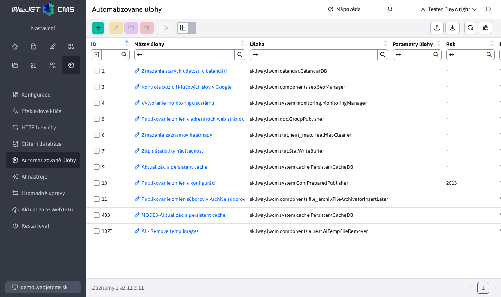

# Automatizované úkoly

Automatické úlohy umožňují definovat úlohy, které se na serveru provádějí automaticky. Položku najdete v části **Nastavení** pod nadpisem **Automatizované úkoly**.

V okně editoru záznamů můžete nastavit:
- **Název úkolu** - Zadejte název úlohy, který popisuje, co úloha dělá (vlastní název).
- **Úkol** - odkaz na třídu jazyka Java implementující metodu `main` které mají být provedeny. Například je připravena úloha stahování dat [cs.iway.iwcm.system.cron.DownloadURL](../../../../../src/webjet8/java/sk/iway/iwcm/system/cron/DownloadURL.java)
- **Parametry úlohy** - parametry předané pro zadanou úlohu oddělené znakem `|`. V případě úlohy `DownloadURL` jsou parametry:
  - `URL-adresa|[fromEmail]|[toEmail]|[subject]`
  - Požadovaný parametr **ADRESA URL** musí obsahovat úplnou adresu včetně `http://`.
  - Nepovinné parametry `fromEmail,toEmail,subject` po stažení stránky ji můžete odeslat na zadaný e-mail (pro kontrolu).
- **Rok, den v měsíci, den v týdnu, měsíc, hodina, minuta, sekunda** - časový interval, ve kterém se má zadaná úloha provést. Možné hodnoty jsou například:
  - `*` - se provádí vždy.
  - `*/10` - každých 10 (nebo jiný zadaný počet).
  - `20` - pokud má typ hodnotu 20.
  - `3-5` - 3., 4. a 5. časová jednotka. Počítá se od nuly, takže každou sekundu lze zapsat jako rozpětí 0-59.
  - Chcete-li například spouštět událost každých 10 minut, zadejte příkaz `*` a do terénu **Zápis** vstoupíte `*/10`.
- **Spuštění po startu systému** - Určuje, zda se má úloha spouštět automaticky při spuštění WebJETu (např. pro aktualizaci dat).
- **Povolené** - Uvádí, zda je úloha aktuálně povolena nebo zakázána. Pokud je povolena, bude se provádět podle zadaného plánu. Pokud je zakázána, nebude spuštěna vůbec.
- **Auditované stránky** - Zjišťuje, zda jsou v auditu zaznamenány záznamy o plnění úkolů. Tato volba je užitečná pro sledování a kontrolu provádění úloh.
- **Běh na uzel** - Určuje, na kterém uzlu nebo serveru má být úloha spuštěna, pokud pracujete v prostředí clusteru s více uzly.

Změny časování úloh se použijí okamžitě, ale již zahájené úlohy zůstanou spuštěny, dokud nebudou dokončeny.

## Standardní úkoly

[cs.iway.iwcm.system.cron.Echo](../../../../../src/webjet8/java/sk/iway/iwcm/system/cron/Echo.java) - Diagnostická úloha - vypíše svůj první parametr do konzoly.

**Parametry:**

1. Text, který chcete zadat.

[cs.iway.iwcm.system.cron.DownloadURL](../../../../../src/webjet8/java/sk/iway/iwcm/system/cron/DownloadURL.java) - Stáhne adresu URL a odešle ji do e-mailu.

**Parametry:**

1. URL, včetně `http://` předpony, např. `https://www.interway.sk/`.

2. E-mail odesílatele.

3. Příjemce (případně několik oddělených čárkou).

4. Předmět zprávy.

[sk.iway.iwcm.system.cron.SqlBatchRunner](../../../../../src/webjet8/java/sk/iway/iwcm/system/cron/SqlBatchRunner.java) - Provede příkazy SQL zadané jako parametry.

**Parametry:** příkazy SQL oddělené znakem `|`.

[cs.iway.iwcm.filebrowser.UnusedFilesCleaner](../../../../../src/webjet8/java/sk/iway/iwcm/filebrowser/UnusedFilesCleaner.java) - Prohledá zadaný adresář (adresář souborů) a vyhledá indexované soubory, na které již neodkazuje žádná stránka, a takové soubory zruší. Je to proto, že takové nepoužívané soubory by se mohly objevit ve výsledcích vyhledávání. Automatické pročištění má smysl pouze pro automatické indexování, které je povoleno konfigurační proměnnou `fileIndexerIndexAllFiles`.

**Parametry:**

1. Adresář pro skenování, např.: `/files`.

2. E-mail, na který budou zasílána oznámení o smazaných souborech.

3. `true/false` Hodnota. Pokud je hodnota nastavena `true`, stránka nebude zveřejněna. Pokud `false`, bude odesláno pouze oznámení.

[cs.iway.iwcm.doc.GroupPublisher](../../../../../src/webjet8/java/sk/iway/iwcm/doc/GroupPublisher.java) - Zveřejňuje naplánované změny ve složkách webových stránek.

**Parametry:**

- Nemá.

[cs.iway.iwcm.calendar.CalendarDB](../../../../../src/webjet8/java/sk/iway/iwcm/calendar/CalendarDB.java) - Odesílá e-mailová oznámení o nadcházejících událostech v kalendáři událostí.

**Parametry:**

- Nemá.

[cs.iway.iwcm.components.seo.SeoManager](../../../../../src/webjet8/java/sk/iway/iwcm/components/seo/SeoManager.java) - Zjišťuje pořadí stránky ve vyhledávačích podle klíčových slov.

**Parametry:**

- Nemá.

[cs.iway.iwcm.system.monitoring.MonitoringManager](../../../../../src/webjet8/java/sk/iway/iwcm/system/monitoring/MonitoringManager.java) - Ukládá data pro monitorování serveru.

**Parametry:**

- Nemá.

[cs.iway.iwcm.stat.StatWriteBuffer](../../../../../src/webjet8/java/sk/iway/iwcm/stat/StatWriteBuffer.java) - Údaje o statistikách návštěvnosti webových stránek se shromažďují v paměti. Po spuštění této třídy se paměť vyčistí a zapíše do databáze.

**Parametry:**

- Nemá.

[cs.iway.iwcm.stat.heat\_map.HeatMapCleaner](../../../../../src/webjet8/java/sk/iway/iwcm/stat/heat_map/HeatMapCleaner.java) - Odstraní vygenerované obrázky teplotních map kliknutí ve statistikách.

**Parametry:**

- Nemá.

[cs.iway.iwcm.system.ConfPreparedPublisher](../../../../../src/webjet8/java/sk/iway/iwcm/system/ConfPreparedPublisher.java) - Zveřejňuje naplánované změny konfiguračních proměnných.

**Parametry:**

- Nemá.

[cs.iway.iwcm.components.file\_archiv.FileArchivatorInsertLater](../../../../../src/webjet8/java/sk/iway/iwcm/components/file_archiv/FileArchivatorInsertLater.java) - Zveřejní naplánované změny v archivu souborů.

**Parametry:**

- Nemá.
