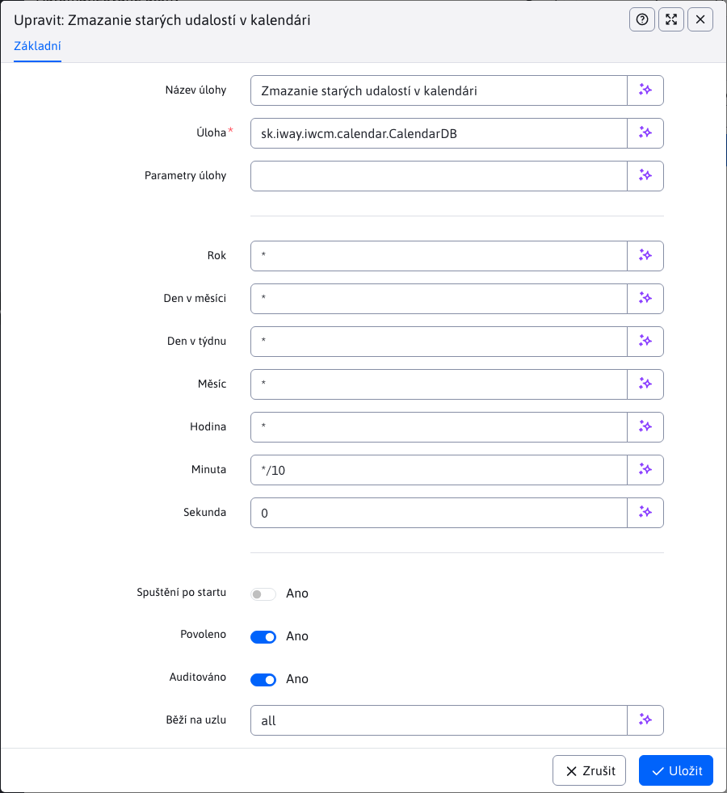

# Automatizované úkoly

Automatizované úlohy umožňují definovat úlohy, které jsou prováděny automatizovaně na serveru. Položku naleznete v sekci **Nastavení** pod položkou **Automatizované úkoly**.

V okně editoru záznamu lze nastavit:
- **Název úkolu** - Zadejte název úlohy, který bude popisovat, co úkol dělá (váš vlastní název).
- **Role** - odkaz na Java třídu implementující metodu `main`, která se provede. Připravena je například. úkol na stahování dat [cs.iway.iwcm.system.cron.DownloadURL](../../../../../src/webjet8/java/sk/iway/iwcm/system/cron/DownloadURL.java)
- **Parametry úlohy** - parametry prodané pro zadaný úkol oddělené znakem `|`. V případě úlohy `DownloadURL` jsou parametry:
  - `URL-adresa|[fromEmail]|[toEmail]|[subject]`
  - Povinný parametr **URL-adresa** musí být kompletní adresa včetně `http://`.
  - Nepovinné parametry `fromEmail,toEmail,subject` umožňují po stažení stránky její zaslání na zadaný email (pro kontrolu).
- **Rok, den v měsíci, den v týdnu, měsíc, hodina, minuta, vteřina** - časový interval, kdy se má zadaný úkol provést. Možné hodnoty jsou například:
  - `*` - provede se vždy.
  - `*/10` - každých 10 (nebo jiné zadané číslo).
  - `20` - když má daný typ hodnotu 20.
  - `3-5` - 3., 4. a 5. časovou jednotku. Počítá se od nuly, takže každá vteřina se dá zapsat jako rozpětí 0-59.
  - Pokud například. chcete událost spouštět každých 10 minut, zadáte všude znak `*` a do pole **Minuty** zadáte `*/10`.
- **Spouštění po startu** - Určuje, zda se má úloha spustit automaticky po startu WebJET (např. pro aktualizaci údajů).
- **Povoleno** - Určuje, zda je úloha aktuálně povolena nebo zakázána. Je-li povolena, bude se provádět podle zadaného časového harmonogramu. Pokud je zakázána, nebude se spouštět vůbec.
- **Auditováno** - Určuje, zda jsou záznamy o provedení úkolu zaznamenávány v auditu. Tato možnost je užitečná pro sledování a kontrolu provádění úkolů.
- **Běží na uzlu** - Určuje, na kterém uzlu nebo serveru se má úloha provádět, pokud pracujete v prostředí s více uzly clusteru.

Změny pro časování úloh se aplikují okamžitě, ale již odstartované úlohy zůstanou běžet dokud neskončí.

## Standardní úkoly

[cs.iway.iwcm.system.cron.Echo](../../../../../src/webjet8/java/sk/iway/iwcm/system/cron/Echo.java) - Diagnostická úloha - svůj první parametr vypíše do konzole.

**Parametry:**

1. Text, který chcete vypsat.

[cs.iway.iwcm.system.cron.DownloadURL](../../../../../src/webjet8/java/sk/iway/iwcm/system/cron/DownloadURL.java) - Stáhne zadané URL a pošle jej na email.

**Parametry:**

1. URL, včetně `http://` předpony, například. `https://www.interway.sk/`.

2. Email odesílatele.

3. Přijímatel (možná i více oddělených čárkou).

4. Předmět zprávy.

[cs.iway.iwcm.system.cron.SqlBatchRunner](../../../../../src/webjet8/java/sk/iway/iwcm/system/cron/SqlBatchRunner.java) - Spustí SQL příkazy zadané jako parametry.

**Parametry:** SQL příkazy, oddělené znakem `|`.

[cs.iway.iwcm.filebrowser.UnusedFilesCleaner](../../../../../src/webjet8/java/sk/iway/iwcm/filebrowser/UnusedFilesCleaner.java) - Přezkoumá zadaný adresář (souborový), zda neobsahuje indexované soubory, na které se již žádná stránka neodkazuje, a zruší publikování takových souborů. Takové nepoužité soubory by se totiž mohly zobrazovat ve výsledcích vyhledávání. Automatické pročišťování má význam pouze při automatickém indexování, které se zapíná konfigurační proměnnou `fileIndexerIndexAllFiles`.

**Parametry:**

1. Adresář pro skenování, např.: `/files`.

2. Email, na který se pošle oznámení o zrušených souborech.

3. `true/false` hodnota. Je-li nastavena hodnota `true`, stránkám se zruší publikování. Pokud `false`, pošle se pouze notifikace.

[cs.iway.iwcm.doc.GroupPublisher](../../../../../src/webjet8/java/sk/iway/iwcm/doc/GroupPublisher.java) - Publikuje naplánované změny ve složkách web stránek.

**Parametry:**

- Nemá.

[cs.iway.iwcm.calendar.CalendarDB](../../../../../src/webjet8/java/sk/iway/iwcm/calendar/CalendarDB.java) - Posílá notifikace na email o blížících se událostech v kalendáři událostí.

**Parametry:**

- Nemá.

[cs.iway.iwcm.components.seo.SeoManager](../../../../../src/webjet8/java/sk/iway/iwcm/components/seo/SeoManager.java) - Zjišťuje pořadí stránky ve vyhledávačích podle klíčových slov.

**Parametry:**

- Nemá.

[cs.iway.iwcm.system.monitoring.MonitoringManager](../../../../../src/webjet8/java/sk/iway/iwcm/system/monitoring/MonitoringManager.java) - Ukládá údaje pro monitorování serveru.

**Parametry:**

- Nemá.

[cs.iway.iwcm.stat.StatWriteBuffer](../../../../../src/webjet8/java/sk/iway/iwcm/stat/StatWriteBuffer.java) - Údaje o statistikách návštěvnosti web stránky se sbírají do paměti. Při spuštění této třídy se paměť vyčistí a zapíše se do databáze.

**Parametry:**

- Nemá.

[cs.iway.iwcm.stat.heat\_map.HeatMapCleaner](../../../../../src/webjet8/java/sk/iway/iwcm/stat/heat_map/HeatMapCleaner.java) - Maže generované obrázky teplotních map kliknutí ve statistice.

**Parametry:**

- Nemá.

[cs.iway.iwcm.system.ConfPreparedPublisher](../../../../../src/webjet8/java/sk/iway/iwcm/system/ConfPreparedPublisher.java) - Publikuje naplánované změny v konfiguračních proměnných.

**Parametry:**

- Nemá.

[cs.iway.iwcm.components.file\_archiv.FileArchivatorInsertLater](../../../../../src/webjet8/java/sk/iway/iwcm/components/file_archiv/FileArchivatorInsertLater.java) - Publikuje naplánované změny v archivu souborů.

**Parametry:**

- Nemá.
