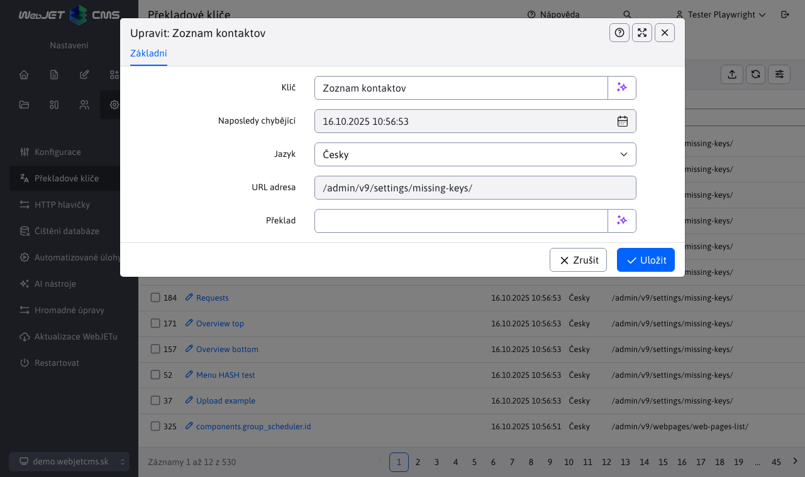

# Chybějící klíče

V části Chybějící klíče jsou zobrazeny překladové klíče, které byly požadovány k překladu, ale nebyly nalezeny. V této sekci není povolena žádná editace záznamů. Je povolen pouze export záznamů.

Kromě chybějícího klíče a samotného jazyka je v tabulce uveden čas, kdy byl překlad klíče naposledy vyžádán, a poslední adresa URL stránky, na které byl překlad vyvolán.

Klikněte na tlačítko **Odstranit vše** vymažete paměť seznamu chybějících klíčů, pak se seznam začne znovu vyplňovat. To je užitečné, pokud například potřebujete zkontrolovat, zda na stránce nechybí překlady.

Poznámka: sloupec ID obsahuje pouze pořadové číslo pro správné zobrazení, klíč může mít vždy náhodnou hodnotu ID, nelze podle něj navigovat.

Kliknutím na klíč se zobrazí editor, kde můžete překlad dokončit a ihned uložit.

