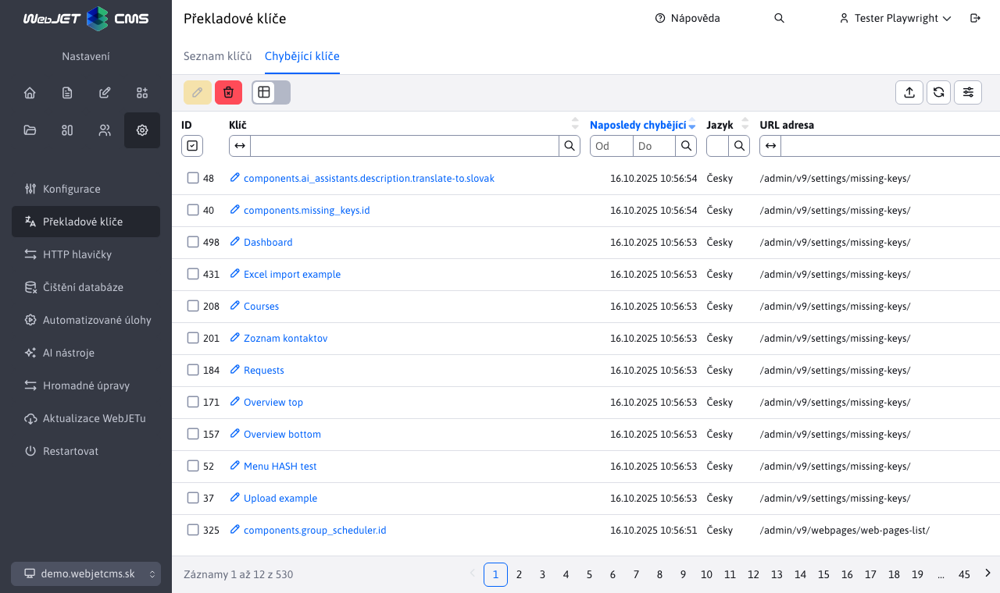

# Chybějící klíče

Sekce Chybějící klíče zobrazuje překladové klíče, které byly vyžádány k překladu, ale nebyly nalezeny. V této sekci není povolen žádný typ editace záznamů. Povolen je pouze export záznamů.

Kromě samotného chývajícího klíče a jazyka tabulka zobrazuje čas ve kterém bylo naposledy požádáno o překlad daného klíče a poslední URL adresu stránky na které bylo získání překlado voláno.

Klepnutím na tlačítko **Smazat vše** smažete paměť seznamu chybějících klíčů, následně se seznam začne plnit znovu. Je to vhodné, pokud například. potřebujete ověřit, zda na některé stránce nechybí překlady.

Upozornění: ve sloupci ID je pouze pořadové číslo z důvodu korektního zobrazení, klíč může mít hodnotu ID vždy náhodnou, nelze podle ní orientovat.

Klepnutím na klíč se zobrazí editor, ve kterém můžete doplnit překlad a ihned jej uložit.

