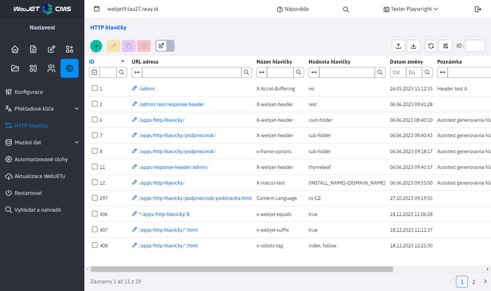
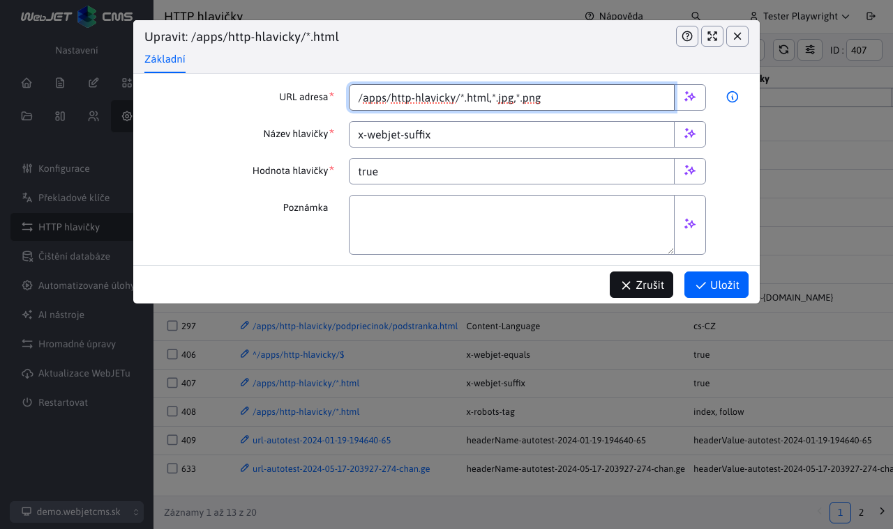
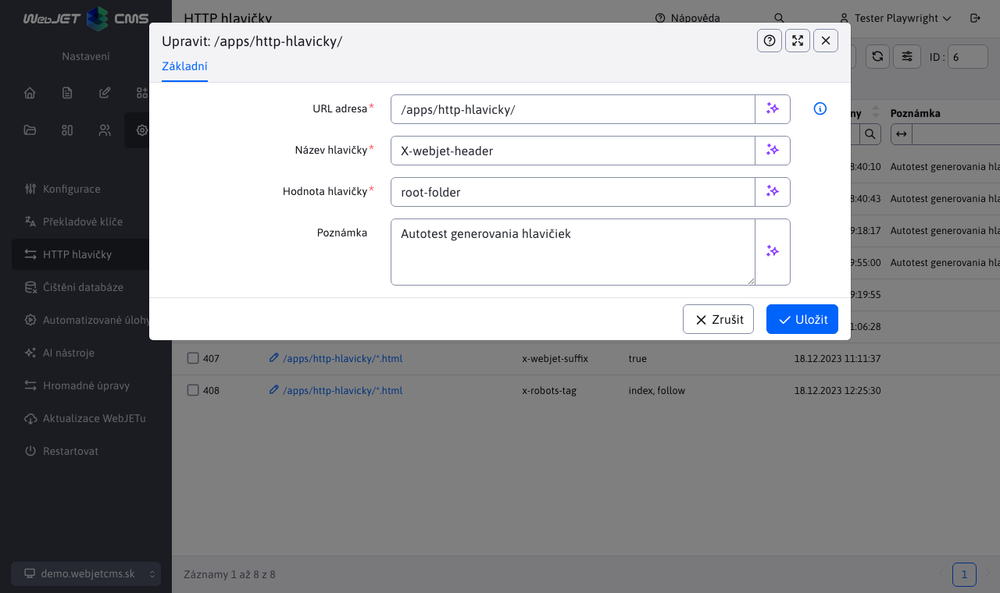

# HTTP hlavičky

Aplikace HTTP hlavičky v sekci Nastavení umožňuje definovat HTTP hlavičky odpovědi (`HTTP Response Header`) na základě URL adres zobrazené stránky. Hlavičky jsou odděleny podle domén, nastavují se pro každou doménu samostatně.

Pokud existuje více hlaviček se stejným názvem, použije se hlavička s nejdelší shodou v URL adrese. V ukázce je vidět nastavení rozdílných hodnot pro hlavičku `X-webjet-header` pro URL adresy `/apps/http-hlavicky/` a `/apps/http-hlavicky/podpriecinok/`. Hodnota pro stránku `/apps/http-hlavicky/podpriecinok/stranka.html` se použije na základě nejdelší shody URL, což znamená, že bude mít hodnotu `sub-folder`.

## Editor

Editor hlaviček obsahuje pole:
- **URL adresa** určuje, pro které URL adresy se definuje hlavička. Podporován je následující zápis:
  - `/folder/subfolder/` - hlavička se generuje pro všechna URL, která začínají na zadanou hodnotu.
  - `^/path/subpath/$` - hlavička se generuje pro přesnou shodu URL adresy.
  - `/path/subpath/*.pdf` nebo `/path/subpath/*.pdf,*.jpg` - hlavička se generuje pro URL adresy začínající na `/path/subpath/` a končící na `.pdf` nebo v druhém případě i pro `.jpg`.
- **Název hlavičky** udává název samotné hlavičky, která se přidává.
- **Hodnota hlavičky** udává hodnotu nastavené hlavičky.
- **Poznámka** doplňková informace, například. kdo a kdy požadoval nastavení dané hlavičky. Hodnota se zobrazuje pouze v administraci.

Jako příklad použijeme obrázek výše s editorem již vytvořeného záznamu. Tyto hodnoty určují, že pro každou URL adresu, která začíná na `/apps/http-hlavicky/`, se vygeneruje HTTP hlavička `x-webjet-header` s hodnotou `root-folder`.

V názvu i hodnotě můžete použít makro `{HTTP_PROTOCOL}, {SERVER_NAME}/{DOMAIN_NAME}/{DOMAIN_ALIAS}, {HTTP_PORT}`, které bude nahrazeno za hodnotu získanou na serveru. `SERVER_NAME` je doménové jméno z `request.getServerName()`, `DOMAIN_NAME` a `DOMAIN_ALIAS` jsou hodnoty domén nebo alias-u nastaveny ve web stránkách. Hodnota `{INSTALL_NAME}` reprezentuje jméno instalace. Hodnota `{HEADER_ORIGIN}` obsahuje hodnotu HTTP hlavičky `origin`.

Upozornění: některé hlavičky se nastavují přímo přes konfigurační proměnné a mohou někdy změnit nastavenou hodnotu (např. `x-robots-tag` pro stránku s vypnutým prohledáváním), viz seznam pro [Bezpečnostní testy](../../../sysadmin/pentests/README.md#http-hlavičky).

## Web stránky

Při zobrazení web stránky se automaticky nastavuje HTTP hlavička `Content-Language` podle jazyka složky/šablony. Pokud nastavíte jinou hodnotu v aplikaci záhlaví použije se nastavená hodnota bez ohledu na jazyk složky/šablony.

## Nastavení pro soubory

Pro URL adresy začínající na `/files,/images,/shared` se automaticky nastavuje HTTP hlavička `Content-Language` dle základního jazyka administrace v konf. proměnné `defaultLanguage`. Navíc jsou nastaveny podle následujících pravidel:
- pokud URL obsahuje `/en/` nastaví se `en-GB`
- pokud URL obsahuje `/de/` nastaví se `de-DE`
- pokud URL obsahuje `/cz/` nastaví se `cs-CZ`
- pokud URL obsahuje `/sk/` nastaví se `sk-SK`

Země na základě jazyka se získává z konf. `countryForLng`, není-li zadána použije se jako země stejná hodnota jako požadovaný jazyk.
