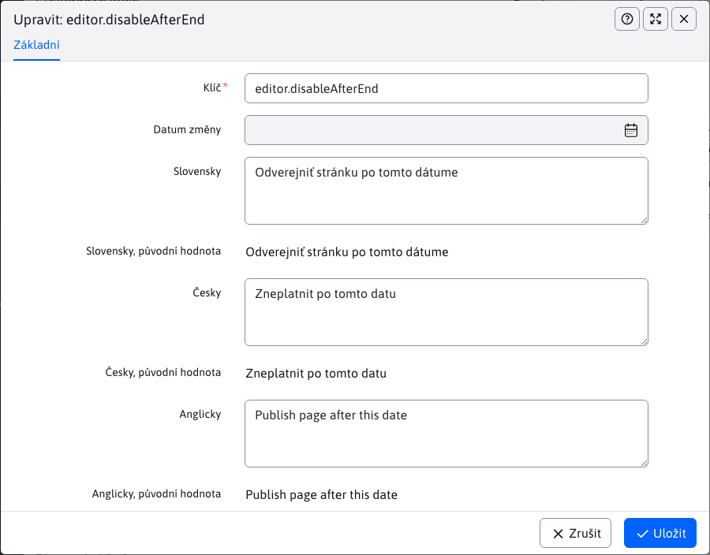

# Seznam klíčů

Sekce Překladové klíče umožňuje vytvářet/upravovat/duplikovat překladové klíče nebo je importovat či exportovat.

Každá položka v tabulce obsahuje všechny jazykové kombinace pro překladový klíč a jejich původní hodnoty před změnou. Jejich původní hodnota je dána souborem a tuto hodnotu můžete aktualizovat nebo ponechat.

## Typy překladových klíčů

Překladové klíče mohou mít imaginární typy v závislosti na tom, jak byl klíč vytvořen a jaké operace s ním byly provedeny.

- Původní rukojeť - byla načtena ze souboru s překladovým klíčem a nikdy nebyla upravena.
- Modifikovaný klíč - vytvoří se, pokud změníte hodnotu původního klíče načteného ze souboru. Ať už je hodnota stejná jako hodnota ze souboru, nebo ne, nová verze tohoto klíče a všechny hodnoty se uloží do databáze a v polích s původními hodnotami se zobrazí původní hodnoty ze souboru.
- Nový klíč je klíč, který nebyl získán ze souboru překladového klíče, ale byl vytvořen pomocí editoru. Takový klíč je uložen v databázi společně se všemi jazykovými překlady.

## Vytvoření nového klíče

Při vytváření nového překladového klíče je třeba zadat samotný klíč (měl by být jedinečný a v předponě by měl obsahovat název aplikace/modulu, aby byl jasně odlišitelný) a jeho hodnotu překladu v definovaných jazycích. Můžete si také všimnout, že při vytváření nového klíče jsou pole s původními hodnotami skryta, protože se jedná o nový záznam.

## Úprava existujícího klíče

Při úpravě existujícího záznamu se v editoru zobrazí také pole s původními hodnotami pro každý jazyk zvlášť. Původní hodnoty jsou ty, které byly získány ze souboru překladového klíče. Tato pole s původními hodnotami můžete vidět, ale nemůžete je upravovat.

## Odstranění klíče

Odstranění překladového klíče je složitější proces, který se může lišit v závislosti na typu překladového klíče. Odstranit lze pouze klíče vytvořené/změněné v databázi, které nejsou přímo v překladovém souboru:
- Nový klíč - pokud se jej pokusíte odstranit, všechny jeho jazykové překlady se z databáze odstraní. To znamená, že tento překladový klíč již v tabulce nenajdete.
- Původní klíč s novými hodnotami - při pokusu o odstranění tohoto klíče se odstraní pouze nové hodnoty databáze a překladový klíč se stane původním klíčem definovaným v souboru (takže hodnoty se znovu nastaví tak, jak byly načteny ze souboru). Tento klíč budeme moci dále vyhledat v tabulce.
- Původní rukojeť - **nelze odstranit**. Tyto klíče byly získány ze souboru překladových klíčů a tento soubor nelze upravovat. Při pokusu o odstranění takového klíče budete upozorněni, že tento klíč nelze odstranit.

## Import

Při importu můžete zvolit, zda chcete importovat pouze nové (dosud neexistující) klíče. Existence klíče je při importu kontrolována pro každý jazyk, takže klíč je importován pouze v případě, že neexistuje. Hodnota existujícího klíče se tedy nepřepisuje.

