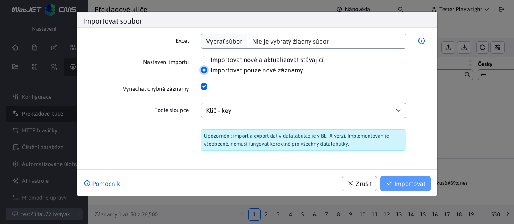

# Seznam klíčů

Sekce Překladové klíče umožňuje vytvářet/upravovat/duplikovat překladové klíče nebo je importovat či exportovat.

Každý záznam v tabulce obsahuje všechny jazykové kombinace pro daný překladový klíč, jakož i jejich původní hodnoty před změnou. Jejich původní hodnota je dána souborem a vy můžete tuto hodnotu aktualizovat nebo ji ponechat.

## Typy překladových klíčů

Překladové klíče mohou mít pomyslné typy, v závislostí jak tento klíč vznikl a jaké operace se nad ním provedly.

- Původní klíč - byl načten ze souboru s překladovými klíči a nikdy nebyl upraven.
- Upravený klíč - vznikne pokud upravíte hodnotu původního klíče načteného ze souboru. Zda je hodnota stejná jako ta ze souboru nebo ne, nová verze tohoto klíče i se všemi hodnotami se uloží do databáze a původní hodnoty ze souboru se budou zobrazovat v polích původní hodnota.
- Nový klíč - je takový, který nebyl získán ze souboru s překladovými klíči, ale byl vytvořen pomocí editoru. Takový klíč je uložen v databázi spolu se všemi jazykovými překlady.

## Vytvoření nového klíče

Při vytváření nového překladového klíče je třeba zadat samotný klíče (měl by být jedinečný a v prefixu obsahovat název aplikace/modulu pro jeho jasné odlišení) a jeho hodnotu překladu v definovaných jazycích. Také si můžete všimnout, že při vytváření nového klíče jsou pole s původními hodnotami skryta, jelikož se jedná o nový záznam.

## Úprava stávajícího klíče

Při úpravě již existujícího záznamu se nám v editoru zobrazí i pole s původními hodnotami pro každý jazyk zvlášť. Původní hodnoty jsou ty, které byly získány ze souboru s překladovými klíči. Tato pole s původní hodnotou vidíte, ale nemůžete je upravit.

## Vymazání klíče

Smazání překladového klíče je složitější proces, který se může lišit v závislosti na typu překladového klíče. Mazat lze pouze klíče vytvořené/upravené v databázi, které se nenacházejí přímo v překladovém souboru:
- Nový klíč - při pokusu o jeho vymazání se vymažou všechny jeho jazykové překlady z databáze. To znamená, že tento překladový klíč již nebudete schopni najít v tabulce.
- Původní klíč s novými hodnotami - při pokusu o vymazání tohoto klíče se vymažou pouze nové databázové hodnoty az překladového klíče se stane původní klíč definovaný v souboru (takže se opět nastaví hodnoty tak, jak byly vyčteny ze souboru). Tento klíč budeme moci dále nalézt v tabulce.
- Původní klíč - **nelze odstranit**. Tyto klíče byly získány ze souboru s překladovými klíči a soubor nelze modifikovat. Při pokusu o vymazání takového klíče budete upozorněni oznámením, že tento klíč nelze vymazat.

## Import

Při importu lze zvolit možnost importovat pouze nové (ještě neexistující) klíče. Existence klíče se při importu kontroluje pro každý jazyk a klíč je tedy importován pouze v případě, že neexistuje. Nepřepíše se tedy hodnota existujícího klíče.

