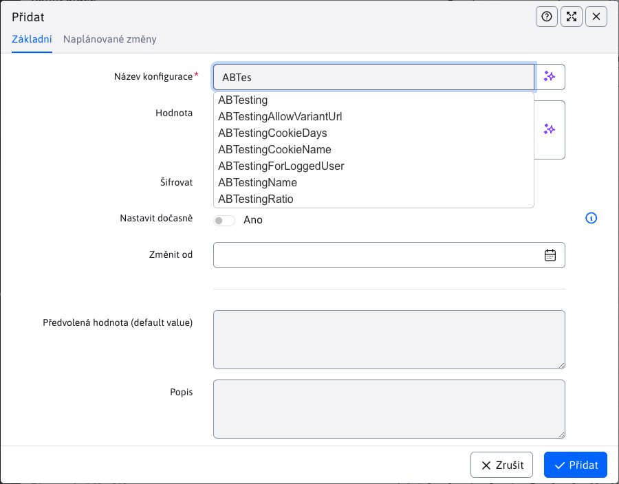
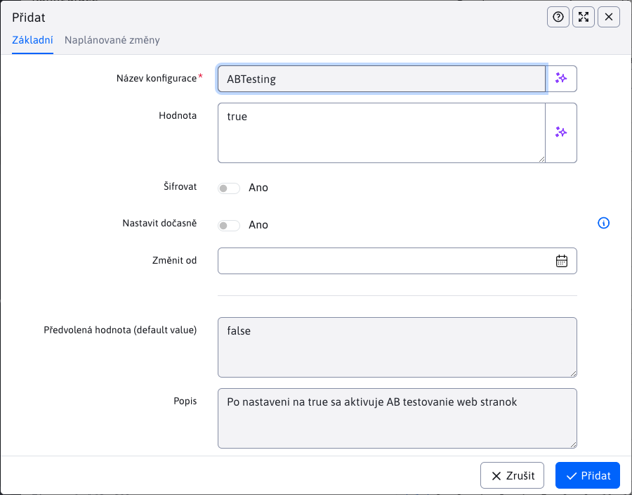

# Konfigurace

Sekce konfigurace slouží k zobrazení a správě konfiguračních proměnných. Strom v levé části je rozděluje do následujících pohledů:

- **Změněné** - proměnné, jejichž hodnota je uložena v databázi. Tento pohled je zvolen po otevření stránky.
- **Zákaznické** - proměnné uložené pouze v databázi bez definice v `Constants`/`ConstantsV9` nebo proměnné, jejichž název začíná aktuální hodnotou `Constants.getInstallName()` (například `aceintegration_test`).
- **Všechny** - všechny evidované proměnné včetně jejich výchozích hodnot a vlastních proměnných uložených pouze v databázi.
- **Moduly** - hierarchické skupiny, například `apps.gallery` nebo `security.oauth2`. Výběr rodičovského uzlu zobrazí i proměnné ze všech jeho poduzlů. Jedna proměnná může být zařazena ve více větvích.

Ve stromu lze vyhledávat. Názvy modulů jsou technické názvy a nepřekládají se. Ve vybraném modulu lze existující proměnnou upravit, ale nelze vytvořit novou ani spustit import, protože vlastní databázová proměnná nemá informaci o zařazení do modulu.

V sekci instalace je seznam [nejpoužívanějších konfiguračních proměnných](../../../install/config/README.md).

## Přidávání konfiguračních proměnných

Při přidávání je nejdůležitější parametr **Název konfigurace**, který se chová jako textové pole s funkcí automatického doplnění. Při zadávání názvu konfigurace bude nabízet názvy již existujících proměnných, včetně těch, které ještě nejsou upraveny (nejsou v tabulce).

Mohou nastat 3 situace:

- využijeme automatické doplnění a zvolíme již existující konfiguraci
  - pokud tato konfigurace již JE v tabulce, **provede se pouze úprava** (bude upraven již existující záznam v tabulce)
  - pokud tato konfigurace NENÍ v tabulce, **provede se přidání** nového záznamu do tabulky **ale** není přidána nová konfigurační proměnná (pouze jsme změnili její přednastavenou hodnotu)
- nevyužijeme automatické doplnění, **provede se přidání** nového záznamu do tabulky **a současně** tím definujeme zcela novou konfigurační proměnnou

Zvolíme-li nabídnutou možnost, tak se v editoru zobrazí aktuální/výchozí hodnota zadané konfigurační proměnné.

Změna se obvykle projeví hned po akci přidání/upravení. Některé konfigurační proměnné ale vyžadují restart aplikačního serveru.

## Úprava konfiguračních položek

Mohou nastat 3 situace:

- nezměníme **Název konfigurace**, tak se **provede úprava** proměnné, kterou jsme upravovali
- změníme **Název konfigurace**, tak se **neprovede úprava** původní konfigurační proměnné
  - pokud změněný název, za název **existující** konfigurační proměnné, tak se **provede úprava**
  - pokud změněný název, za název **neexistující** konfigurační proměnné, pak se **provede přidání** nové proměnné

## Dočasné nastavení hodnoty

Pokud potřebujete změnit hodnotu konfigurační proměnné pouze pro ověření jejího chování, v editoru zapněte možnost **Nastavit dočasně**. Hodnota se nastaví pouze v paměti aktuálního uzlu, neuloží se do databáze ani se nepřenese na ostatní uzly clusteru. Po restartu aplikačního serveru se opět použije hodnota uložená v databázi.

Při dočasném nastavení nelze hodnotu zašifrovat ani naplánovat její změnu, proto se pole **Šifrovat** a **Změnit od** v editoru skryjí.

Pokud se aktuální hodnota na uzlu liší od uložené hodnoty, ve sloupci **Hodnota** se zobrazí obě hodnoty ve formátu "aktuální hodnota / uložená hodnota". Druhá hodnota je zobrazena tlumenou barvou a po umístění kurzoru se označí jako momentálně neaktivní. Může jít o hodnotu uloženou v databázi nebo o výchozí hodnotu proměnné bez databázového záznamu. Při opětovném otevření editoru se do pole **Hodnota** načte uložená, nikoli dočasná hodnota.

## Vymazání konfiguračních položek

Vymazání znamená reset databázové hodnoty. Mohou nastat 2 situace:

- pokud **existuje výchozí hodnota**, začne se používat a proměnná zůstane zobrazena v pohledu **Všechny** a v příslušných modulech; z pohledu **Změněné** zmizí,
- pokud **neexistuje výchozí hodnota**, vlastní databázová proměnná po resetu přestane existovat.

Proměnnou, která nemá databázovou hodnotu, nelze vymazat.
