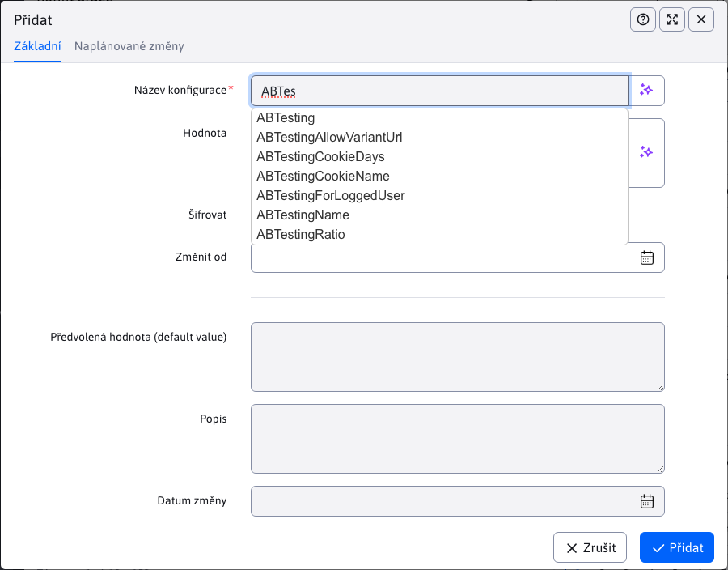
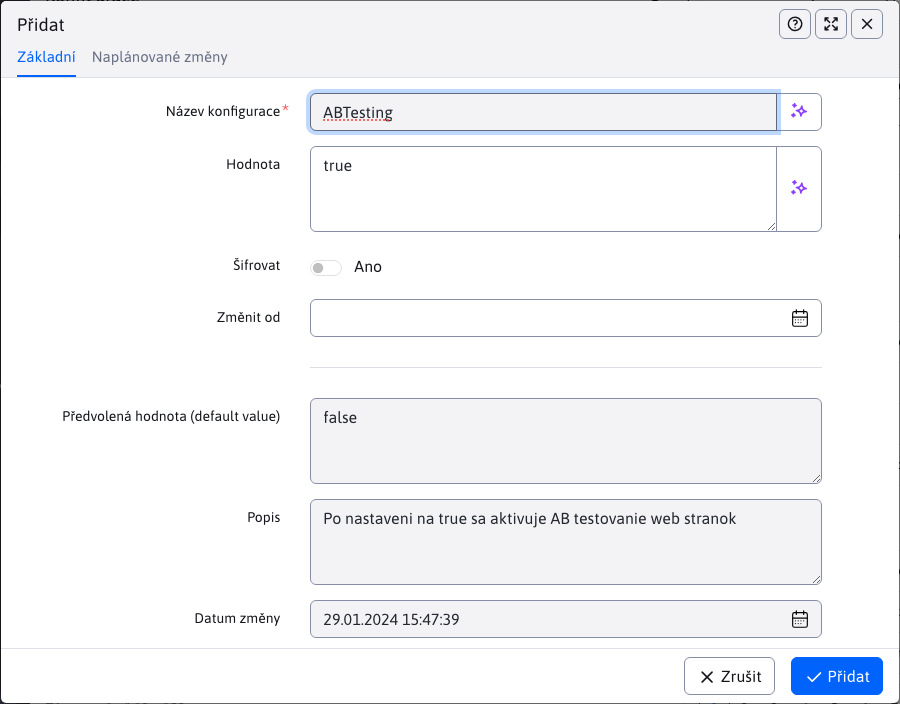

# Konfigurace

Sekce konfigurace slouží k zobrazení a správě jednotlivých konfiguračních proměnných, které se odlišují od přednastavených hodnot.

V sekci instalace je seznam [nejpoužívanějších konfiguračních proměnných](../../../install/config/README.md).

## Přidávání konfiguračních proměnných

Při přidávání je nejdůležitější parametr **Název konfigurace**, který se chová jako textové pole s funkcí automatického doplnění. Při zadávání názvu konfigurace bude nabízet názvy již existujících proměnných, včetně těch, které ještě nejsou upraveny (nejsou v tabulce).

Mohou nastat 3 situace:
- využijeme automatické doplnění a zvolíme již existující konfiguraci
  - pokud tato konfigurace již JE v tabulce, **provede se pouze úprava** (bude upraven již existující záznam v tabulce)
  - pokud tato konfigurace NENÍ v tabulce, **provede se přidání** nového záznamu do tabulky **ale** není přidána nová konfigurační proměnná (pouze jsme změnili její přednastavenou hodnotu)
- nevyužijeme automatické doplnění, **provede se přidání** nového záznamu do tabulky **a současně** tím definujeme zcela novou konfigurační proměnnou

Zvolíme-li nabídnutou možnost, tak se v editoru zobrazí aktuální/výchozí hodnota zadané konfigurační proměnné.

Změna se obvykle projeví hned po akci přidání/upravení. Některé konfigurační proměnné ale vyžadují restart aplikačního serveru.

## Úprava konfiguračních položek

Mohou nastat 3 situace:
- nezměníme **Název konfigurace**, tak se **provede úprava** proměnné, kterou jsme upravovali
- změníme **Název konfigurace**, tak se **neprovede úprava** původní konfigurační proměnné
  - pokud změněný název, za název **stávající** konfigurační proměnné, tak se **provede úprava**
  - pokud změněný název, za název **neexistující** konfigurační proměnné, tak se **provede přidání** nové proměnné

## Vymazání konfiguračních položek

Při vymazání konfigurační proměnné mohou nastat 2 situace:
- vymažeme hodnotu z tabulky a **existuje přednastavená hodnota** k této konfigurační proměnné, která se začne využívat (proměnná stále existuje)
- vymažeme hodnotu z tabulky a **neexistuje přednastavená hodnota** k této konfigurační proměnné (proměnná již nebude existovat)

!>**Upozornění:** oproti vytváření/editaci, při vymazání se nastaví prázdná hodnota. Má-li konfigurační proměnná přednastavenou hodnotu, ta se projeví **až po restartování** aplikačního serveru.
