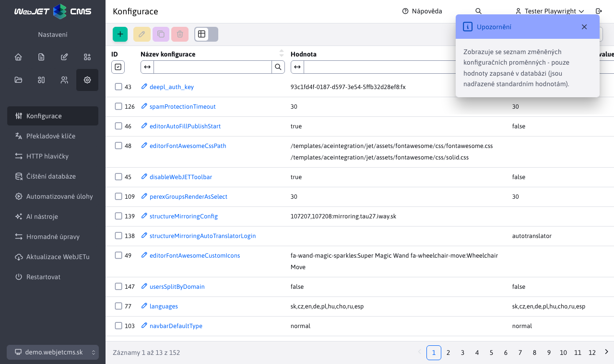

# Konfigurace

Sekce konfigurace slouží k zobrazení a správě jednotlivých konfiguračních proměnných, které se liší od přednastavených hodnot.

V sekci instalace je uveden seznam [nejčastěji používané konfigurační proměnné](../../../install/config/README.md).

## Přidání konfiguračních proměnných

Při přidávání je nejdůležitějším parametrem **Název konfigurace** které se chová jako textové pole s funkcí automatického dokončování. Po zadání názvu konfigurace nabídne názvy existujících proměnných, včetně těch, které ještě nebyly upraveny (nejsou v tabulce).

Mohou nastat 3 situace:
- použít automatické dokončování a vybrat existující konfiguraci.
  - pokud tato konfigurace již JE v tabulce, **provede se pouze úprava** (stávající záznam v tabulce bude upraven)
  - pokud tato konfigurace NENÍ v tabulce, **doplnění je provedeno** nový záznam v tabulce **Ale** není přidána žádná nová konfigurační proměnná (pouze jsme změnili její výchozí hodnotu)
- nepoužíváme automatické dokončování, **doplnění je provedeno** nový záznam v tabulce **a zároveň** čímž se definuje zcela nová konfigurační proměnná

Pokud vybereme nabízenou možnost, zobrazí se v editoru aktuální/výchozí hodnota zadané konfigurační proměnné.

Změna se obvykle projeví ihned po přidání/úpravě. Některé konfigurační proměnné však vyžadují restart aplikačního serveru.

## Úprava položek konfigurace

Mohou nastat 3 situace:
- nezměníme **Název konfigurace**, takže je to **provede úpravu** proměnné, kterou jsme upravili
- změníme **Název konfigurace**, takže je to **neprovádí úpravu** původní konfigurační proměnná
  - v případě změny názvu pro název **stávající** konfigurační proměnnou, takže **provede úpravu**
  - v případě změny názvu pro název **nefunkční** konfigurační proměnnou, takže **provádí sčítání** nová proměnná

## Odstranění položek konfigurace

Při odstraňování konfigurační proměnné mohou nastat 2 situace:
- vymazat hodnotu z tabulky a **je přednastavená hodnota** do této konfigurační proměnné, abyste ji mohli začít používat (proměnná stále existuje).
- vymazat hodnotu z tabulky a **neexistuje žádná přednastavená hodnota** do této konfigurační proměnné (proměnná již nebude existovat).

!>**Varování:** proti vytvoření/úpravě, při smazání se nastaví prázdná hodnota. Pokud má konfigurační proměnná přednastavenou hodnotu, projeví se tato skutečnost. **pouze po restartu** aplikační server.
