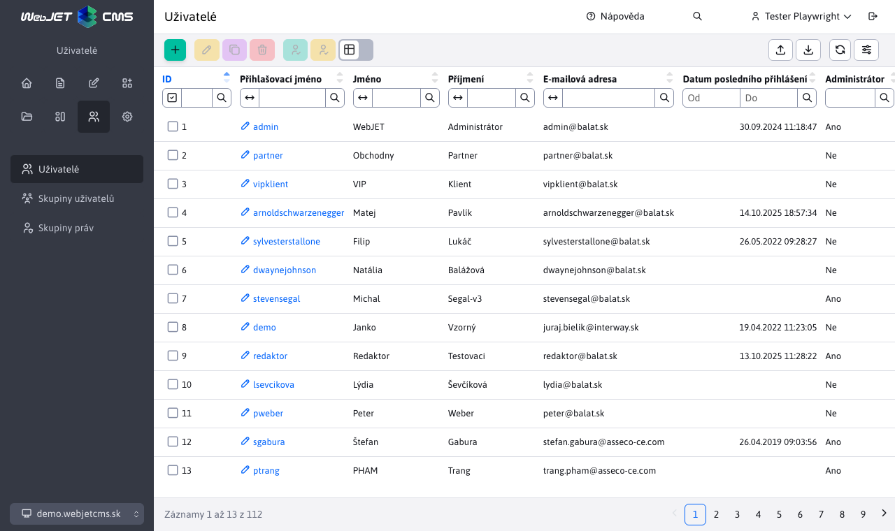
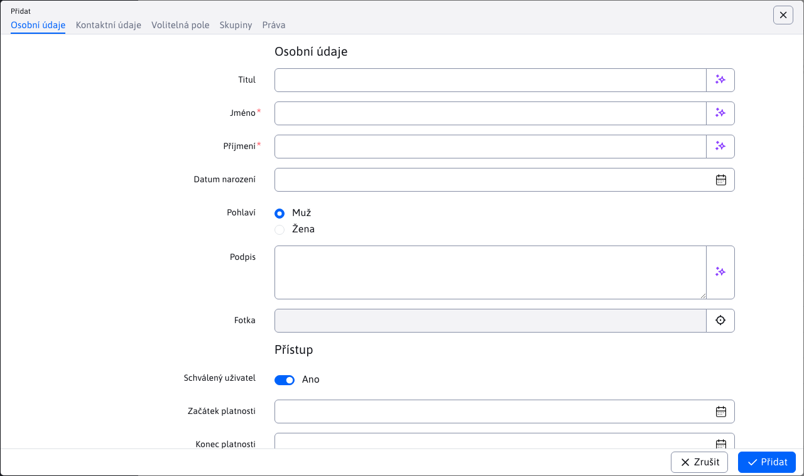
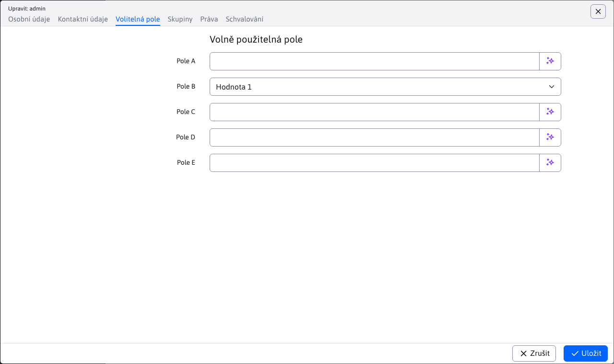

# Seznam uživatelů

V seznamu uživatelů je možné spravovat administrátory (vyžaduje právo `správa administrátorov`) a registrovaných uživatelů web sídla/uživatelů pro hromadný e-mail (vyžaduje právo `správa registrovaných používateľov`).

Při filtrování v tabulce se ve sloupcích Přístupová práva k neveřejným sekcím web sídla nebo Přihlášení k hromadnému e-mailu vyhledává podle názvu zadané skupiny. Pokud zvolíte možnost Rovná se použije se vyhledání podle přesného názvu zadané skupiny a zároveň se vyhledají uživatelé, kteří mají pouze tuto jednu skupinu (ne více skupin).

## Osobní údaje

Karta **Osobní údaje** obsahuje základní údaje uživatele. Dělí se na dvě části a to „Osobní údaje“ a „Přístup“.

### Osobní údaje

V této části karty se vyplňují údaje o uživateli jako Titul, Jméno, Příjmení, Datum narození a pod. Povinná pole v této části, která musí být vyplněna jsou :
- Jméno
- Příjmení

### Přístup

V této části karty se vyplňují údaje o uživatelském účtu jako Začátek a Konec platnosti (umožňují datumově omezit platnost přihlášení uživatele), Přihlašovací jméno (musí být jedinečné), Heslo a pod. Povinná pole v této části, která musí být vyplněna jsou :
- Přihlašovací jméno
- E-mailová adresa
- Heslo

Pole heslo obsahuje kontrolu kvality zadaného hesla a doporučuje se, aby heslo bylo co nejbezpečnější. Při zvolení možnosti "Povolit slabé heslo", nebude kontrolována kvalita zadaného hesla při uložení uživatele.

Zadáním znaku `*` nebo textu `random` do pole heslo se heslo náhodně vygeneruje při uložení uživatele.

Pro možnost přihlášení uživatele je důležité, aby uživatel měl zvolenou možnost "Schválený uživatel".

## Kontaktní údaje

Karta **Kontaktní údaje** se dělí na dvě části a to :
- Kontaktní údaje - obsahuje data uživatele jako Adresa, Město, Telefon a pod.
- Adresa doručení - obsahuje dodatečné údaje potřebné pro doručení zásilky jako Jméno, Příjmení, Adresa, Město apod. (typicky využito v rámci aplikace elektronický obchod).

Karta neobsahuje povinné pole, které by bylo nutné vyplnit.

## Volitelná pole

Karta **Volitelná pole** obsahuje volně použitelná pole. Více informací k jejich konfiguraci naleznete v dokumentaci [volitelná pole](../../frontend/webpages/customfields/README.md).

## Skupiny

Karta **Skupiny** se dělí na dvě části a to :
- Skupiny uživatelů - zvolením jména skupiny uživatelů získá uživatel přístupová práva k neveřejným sekcím web sídla.
- Hromadný e-mail - zvolením jména skupiny se přihlásí uživatel ke skupině hromadného e-mailu.

Karta obsahuje také možnost Odeslat emaily o přidání do uživatelských skupin.

!>**Upozornění:** emaily se odešlou pouze pokud daná skupina uživatelů má nastaveno `ID stránky s textom e-mailu`.

## Práva

Karta **Práva** slouží k nastavení práv pro administrační sekci (definuje se k čemu bude mít daný uživatel přístup / práva). Potřebné části pro nastavování se zobrazí pouze v případě, je-li zvolena možnost vstup do admin sekce (správa web sídla). Pokud uživatel tuto možnost nemá zvolena, tak je v systému pouze jako Registrovaný uživatel a nebude mít povolen vstup do administrační části web sídla.

Toto povolení může přidat pouze uživatel s již přiděleným administračním právem. Bez administračního práva se karta Práva ani nezobrazí.

Po zvolení možnosti přístupu do admin sekce se uživateli zobrazí zbytek karty, který se dělí na následující části:
- Práva na adresáře a stránky
- Nahrávání souborů do adresářů
- Skupiny práv
- Přístupová práva

### Práva na adresáře a stránky

V části Práva na adresáře a stránky můžete omezit možnost editace web sídla jen na určitou sekci (adresář) nebo web stránku. Při klepnutí na jedno z tlačítek přidat se zobrazí stromová struktura web stránek, kde můžete vybrat Web stránku nebo Adresář.

Klepnutím na ikonu tužky u již přidaného adresáře/stránky lze adresář/stránku změnit, kliknutím na ikonu koše lze právo smazat.

Standardně administrátor, který **nemá zvoleno žádné právo na adresář/stránku automaticky získává práva na všechny adresáře a web stránky**.

V multi doménové instalaci je v editaci uživatele a skupin práv možné vybírat složky web stránek a jednotlivé web stránky bez ohledu na aktuálně zvolenou doménu. Domény se zobrazí jako kořenové složky, přičemž složku s názvem domény nelze vybrat. Je třeba vybrat jednotlivé složky v doméně, protože doména samotná není reálná složka. Zobrazení vybrané položky obsahuje prefix s doménovým jménem, aby bylo možné rozlišit jednotlivé složky (často se jmenují v různých doménách stejně, např. Česky).

### Nahrávání souborů do adresářů

V této části lze zvolit práva na nahrávání souborů do adresářů souborového systému. Po klepnutí na tlačítko přidat se zobrazí stromová struktura souborového systému kde můžete vybrat příslušný adresář.

Standardně administrátor, který nemá zvolen žádný adresář souborového systému, může nahrávat soubory do libovolného adresáře. Chování lze změnit nastavením konfigurační proměnné `defaultDisableUpload` na hodnotu `true`, což způsobí, že nahrávat soubory bude možné pouze do zvolených adresářů (a pokud uživatel nemá zvolen žádný adresář nebude moci nahrávat soubory vůbec).

Nastavíte-li konfigurační proměnnou `userPermsActualPageAutomatic` na hodnotu `true` tak se práva do složek `/images` a `/files` nastaví automaticky podle práv na stromovou strukturu web stránek tak, aby pro povolené složky web stránek měl redaktor práva na zápis obrázků a souborů do příslušných složek Média této stránky.

### Skupiny práv a Přístupová práva

V kartě práva se zobrazuje seznam skupin práv. U každé skupiny se zobrazuje **barevný kruh s prvním písmenem jména skupiny**. Stejné kruhy se následně zobrazují iv jednotlivých právech. Zvýrazňují jednotlivá práva z dané skupiny.

Zvolením skupiny práv se **barva kruhu nastaví i do pozadí kruhu** pro lepší zvýraznění vybraných práv. Doporučujeme proto připravit skupiny práv pro redaktory, marketing, správce a podobně a nenastavovat jednotlivá práva uživatelům ale jim přiřazovat práva skupinově.

Při editaci/přidávání nového uživatele a zvolení skupin práv v seznamu Přístupová práva vidíte práva, která skupina obsahuje a můžete případně uživateli **přidat specifické právo** (je-li to nutné). Při přihlášení uživatel automaticky **získá práva nastavená ve skupině práv a práva nastavená uživateli**.

Jednotlivá přístupová práva jsou reprezentována ve stromové struktuře Přístupová práva. Rozlišujeme:
- uzel, který obsahuje potomky - sám o sobě není právo, reprezentuje jen zařazení práva ve stromové struktuře
- koncový uzel - reprezentuje samotné právo

Zvolením zaškrtávacího pole vedle uzlu, který obsahuje potomky, najednou označíte nebo odznačíte všechny potomky tohoto uzlu. Umíte tak efektivně označovat/odznačovat více práv najednou.

**Vyhledávání práv**

Pod nadpisem Přístupová práva se nachází vyhledávací pole. Můžete do něj zadat jméno práva a kliknutím na ikonu lupy filtrovat stromovou strukturu pouze o práva obsahující zadaný výraz. Filtrovaný výraz zrušíte kliknutím na ikonu křížku ve vyhledávacím poli.

Pole na konci obsahuje i ikonu volby všech práv a zrušení volky všech práv. Jedním kliknutím tak můžete najednou označit/od-značit všechna práva.

## Schvalování

V kartě **Schvalování** je možné definovat akci při změně ve zvoleném adresáři web stránek (typicky schvalování). Karta se zobrazí pouze pro již uloženého uživatele (nově vytvářeného uživatele je třeba nejprve uložit až následně nastavit proces schvalování).

Při přidání záznamu kliknutím na ikonu + (Přidat) volíte Adresář (ze struktury web stránek) a Akce. Oba atributy jsou povinné. Můžete vybrat jednu z následujících akcí:
- Schválení (přednastavená volba) - nastane-li změna ve vybraném adresáři aktuálně editovaný uživatel tuto změnu bude schvalovat.
- Notifikace - nastane-li změna ve vybraném adresáři pošle se aktuálně editovanému uživateli emailová notifikace o změně ve web stránce.
- Žádná - neprovede se žádná akce, ale zároveň editovaný uživatel nevyvolá proces schvalování v daném adresáři. Tato možnost je vhodná, pokud máte více schvalovatelů a zároveň potřebujete uživateli nastavit výjimku, aby změny provedené tímto uživatelem byly automaticky schváleny.
- Schválení - druhá úroveň - pokud potřebujete více úrovňové schvalování tuto možnost nastavíte uživateli schválení na druhé úrovni.

Více informací je v [dokumentaci pro redaktora](../../redactor/webpages/approve/README.md).

