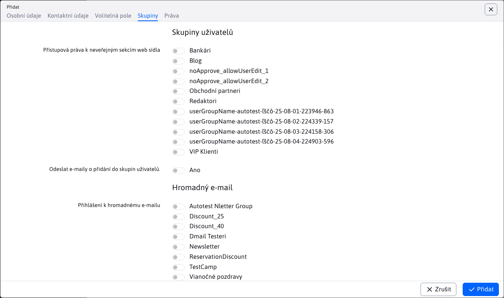
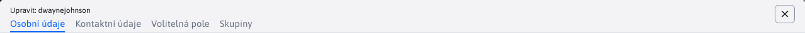

# Seznam uživatelů

Správce můžete spravovat v seznamu uživatelů (vyžaduje právo `správa administrátorov`) a registrovaných uživatelů webových stránek/uživatelů pro hromadné zasílání e-mailů (vyžaduje právo na `správa registrovaných používateľov`).

Při filtrování v tabulce se ve sloupcích Přístupová práva k neveřejným sekcím webu nebo Hromadné přihlášení e-mailem vyhledává podle názvu zadané skupiny. Pokud vyberete možnost Rovná se, vyhledávání se použije podle přesného názvu zadané skupiny a vyhledá také uživatele, kteří mají pouze tuto jednu skupinu (nikoli více skupin).

## Osobní údaje

Karta **Osobní údaje** obsahuje základní údaje o uživateli. Je rozdělen na dvě části, a to "Osobní údaje" a "Přístup".

### Osobní údaje

V této části karty se vyplňují údaje o uživateli, jako je titul, jméno, příjmení, datum narození atd. Povinná pole v této části, která musí být vyplněna, jsou :
- Název
- Příjmení

### Přístup na

Tato část karty slouží k vyplnění údajů o uživatelském účtu, jako je datum zahájení a ukončení (umožňuje datově omezit platnost přihlášení uživatele), přihlašovací jméno (musí být jedinečné), heslo atd. Povinná pole v této sekci, která musí být vyplněna, jsou :
- Přihlašovací jméno
- E-mailová adresa
- Heslo

Pole pro zadání hesla obsahuje kontrolu kvality zadávaného hesla a doporučuje se, aby bylo heslo co nejbezpečnější. Pokud je vybrána možnost "Povolit slabé heslo", nebude kvalita zadaného hesla při ukládání uživatele kontrolována.

Zadání znaku `*` nebo text `random` v poli hesla, je heslo při ukládání uživatele náhodně vygenerováno.

Aby se uživatel mohl přihlásit, je důležité, aby měl vybranou možnost "Schválený uživatel".

## Kontaktní údaje

Karta **Kontaktní údaje** je rozdělena na dvě části, a to :
- Kontaktní údaje - obsahuje údaje o uživateli, jako je adresa, město, telefon atd.
- Adresa pro doručení - obsahuje další údaje nezbytné pro doručení zásilky, jako je jméno, příjmení, adresa, město atd. (obvykle se používá v aplikaci elektronického obchodu).

Karta neobsahuje povinné pole, které by bylo nutné vyplnit.

## Volitelná pole

Karta **Volitelná pole** obsahuje volně použitelná pole. Další informace o jejich konfiguraci naleznete v dokumentaci. [volitelná pole](../../frontend/webpages/customfields/README.md).

## Skupiny

Karta **Skupiny** je rozdělena na dvě části, a to :
- Skupiny uživatelů - výběrem názvu skupiny uživatelů získá uživatel přístupová práva do neveřejných částí webu.
- Hromadný e-mail - výběrem názvu skupiny se uživatel přihlásí do skupiny hromadných e-mailů.

Na kartě je také možnost Odesílat e-maily o přidání do skupin uživatelů. **Varování:** e-maily budou odeslány pouze v případě, že má skupina uživatelů nastaveno. `ID stránky s textom e-mailu`.

## Práva

Karta **Práva** slouží k nastavení práv pro administrační sekci (určuje, k čemu bude mít uživatel přístup / práva). Potřebné sekce pro nastavení se zobrazí pouze v případě, že je vybrána možnost vstupu do sekce administrace (správa webu). Pokud uživatel tuto možnost nemá zaškrtnutou, je v systému pouze jako registrovaný uživatel a nebude mu umožněn vstup do administrační sekce webu.

Toto oprávnění může přidat pouze uživatel s již přidělenými právy správce. Bez administrátorských práv se karta Oprávnění vůbec nezobrazí.

Po výběru možnosti přístupu do sekce správce se uživateli zobrazí zbytek karty, která je rozdělena do následujících sekcí:
- Práva k adresářům a stránkám
- Nahrávání souborů do adresářů
- Skupiny práv
- Přístupová práva

### Práva k adresářům a stránkám

V části Oprávnění adresáře a stránky můžete omezit možnost upravovat web na určitou sekci (adresář) nebo webovou stránku. Po kliknutí na jedno z tlačítek přidání se zobrazí stromová struktura webových stránek, kde můžete vybrat webovou stránku nebo adresář.

Kliknutím na ikonu tužky vedle již přidaného adresáře/stránky můžete adresář/stránku změnit, kliknutím na ikonu koše ji můžete vpravo odstranit.

Ve výchozím nastavení správce, který **nemá vybraná práva na adresáře/webové stránky, automaticky získá práva na všechny adresáře a webové stránky**.

Při instalaci s více doménami umožňuje úprava uživatelů a skupin práv vybrat složky webových stránek a jednotlivé webové stránky bez ohledu na aktuálně vybranou doménu. Domény se zobrazují jako kořenové složky. Zobrazení vybrané položky obsahuje předponu s názvem domény pro rozlišení jednotlivých složek (v různých doménách se často jmenují stejně, např. slovensky).

### Nahrávání souborů do adresářů

V této části můžete vybrat práva pro nahrávání souborů do adresářů souborového systému. Po kliknutí na tlačítko přidat se zobrazí stromová struktura souborového systému, kde můžete vybrat příslušný adresář.

Ve výchozím nastavení může správce, který nemá vybraný žádný adresář souborového systému, nahrávat soubory do libovolného adresáře. Toto chování lze změnit nastavením konfigurační proměnné `defaultDisableUpload` na hodnotu `true`, což umožní nahrávat soubory pouze do vybraných adresářů (a pokud uživatel nemá vybrané žádné adresáře, nebude moci nahrávat soubory vůbec).

### Skupiny práv a přístupová práva

Na kartě Práva se zobrazí seznam skupin práv. U každé skupiny je **barevné kolečko s prvním písmenem názvu skupiny**. Stejné kruhy se pak zobrazí v jednotlivých právech. Zvýrazňují jednotlivá práva skupiny.

Výběr skupiny práv **barva kruhu se také nastaví do pozadí kruhu.** lépe zvýraznit vybraná práva. Doporučujeme proto připravit skupiny práv pro redaktory, marketing, správce atd. a nenastavovat uživatelům jednotlivá práva, ale přidělovat jim práva jako skupině.

Při úpravě/přidání nového uživatele a výběru skupin práv v seznamu Přístupová práva můžete zobrazit práva, která skupina obsahuje, a volitelně můžete uživateli přidělit. **přidat konkrétní právo** (pokud je to nutné). Při přihlašování se uživatel automaticky **získá práva nastavená ve skupině práv a práva nastavená pro uživatele**.

Jednotlivá přístupová práva jsou reprezentována ve stromové struktuře přístupových práv. Rozlišujeme:
- uzel, který obsahuje potomky - sám o sobě není právem, pouze představuje umístění práva ve stromové struktuře.
- koncový uzel - představuje samotný zákon

Zaškrtnutím políčka vedle uzlu, který obsahuje potomky, můžete vybrat nebo zrušit výběr všech potomků tohoto uzlu najednou. To umožňuje efektivně označit/odznačit více práv najednou.

**Hledání práv**

Pod položkou Přístupová práva se nachází vyhledávací pole. Můžete zadat název práva a kliknutím na ikonu lupy vyfiltrovat stromovou strukturu pouze na práva obsahující zadaný výraz. Chcete-li vymazat filtrovaný termín, klikněte na ikonu křížku ve vyhledávacím poli.

Pole na konci obsahuje také ikonu pro výběr všech práv a zrušení výběru všech práv. Jedním kliknutím tak můžete zaškrtnout/odškrtnout všechna práva najednou.

## Schválení

V kartách **Schválení** je možné definovat akci, když je provedena změna ve vybraném adresáři webu (typicky schválení). Záložka se zobrazí pouze u již uloženého uživatele (nově vytvořeného uživatele je třeba nejprve uložit a poté nastavit proces schvalování).

Při přidávání záznamu klikněte na ikonu + (Přidat) a vyberte Adresář (ze struktury webové stránky) a Akce. Oba atributy jsou povinné. Můžete vybrat jednu z následujících akcí :
- Schválit (výchozí možnost) - pokud dojde ke změně ve vybraném adresáři, aktuálně editovaný uživatel změnu schválí.
- Upozornění - pokud dojde ke změně ve vybraném adresáři, zašle se aktuálně editovanému uživateli e-mailové upozornění na změnu na webové stránce.
- Žádná - Neprovede se žádná akce, ale zároveň upravený uživatel nevyvolá proces schvalování v daném adresáři. Tato možnost je užitečná, pokud máte více schvalovatelů a zároveň potřebujete nastavit výjimku pro uživatele, aby změny provedené tímto uživatelem byly automaticky schváleny.
- Schvalování - druhá úroveň - pokud potřebujete víceúrovňové schvalování, nastavte tuto možnost na uživatele druhé úrovně schvalování.

Více informací najdete v [dokumentace k editoru](../../redactor/webpages/approve/README.md).

## Rozdíly oproti verzi 8

Právo "Krátká nabídka v editoru" je upraveno na právo "Plná nabídka v editoru", aby nebylo senzoricky inverzní a všechny položky mohly být označeny pro plná práva.
