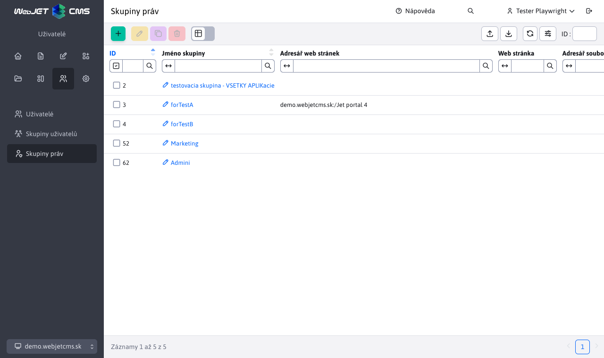
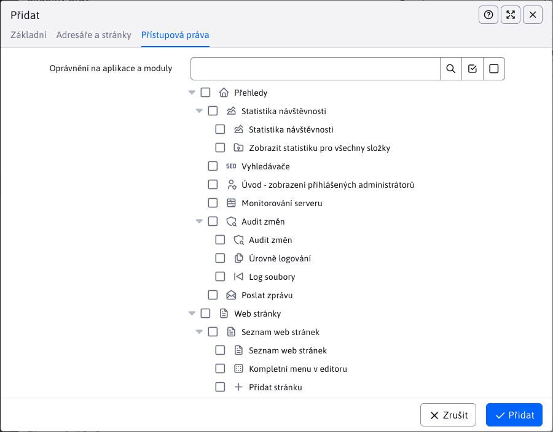

# Skupiny práv

Ve skupinách práv můžete definovat skupinová oprávnění. Pomocí tlačítek, která se nacházejí v levé horní části stránky můžete vytvářet/upravovat/duplikovat/mazat skupiny práv, exportovat skupiny práv do excelu nebo je importovat z excelu.

Uživateli jsou při přihlášení nastavena všechna práva ze skupin práv, která má zvolena a přidána jsou i jeho individuálně nastavená práva.

Můžete tedy vytvořit skupinu práv s názvem "Redaktor" kterému definujete práva na web stránky a nejčastěji používané aplikace (novinky, fotogalerie). Nemusíte tak jednotlivě nastavovat práva. Při vytváření a duplikování skupiny práv je jediný povinný parametr "Jméno skupiny". Důležitá je karta Přístupová práva kde nastavujete práva na aplikace/moduly, které daná skupina bude obsahovat.

Povinné je zadat jméno skupiny:

V kartě Adresáře a stránky můžete nastavit které adresáře a stránky může uživatel modifikovat:

Karta obsahuje následující možnosti:

- **Přístup ke všem adresářům web stránek** - pokud zapnete tuto možnost, práva z více skupin se nebudou sčítat, ale uživatel bude mít přístup ke všem adresářům web stránek bez ohledu na nastavení práv v jiných skupinách. Po zapnutí se skryjí pole pro výběr jednotlivých adresářů a stránek.
- **Přístup ke všem složkám souborového systému** - pokud zapnete tuto možnost, uživatel bude mít přístup ke všem složkám souborového systému (např. `/images`, `/files`) bez ohledu na nastavení práv v jiných skupinách. Po zapnutí se skryje pole pro výběr jednotlivých složek.

Tyto možnosti jsou užitečné například pro skupinu "Administrátor", kde chcete zajistit přístup ke všem adresářům a složkám bez ohledu na omezení definovaná v jiných skupinách práv přiřazených uživateli.

V kartě Přístupová práva můžete nastavit jednotlivá práva na funkce a aplikace:

