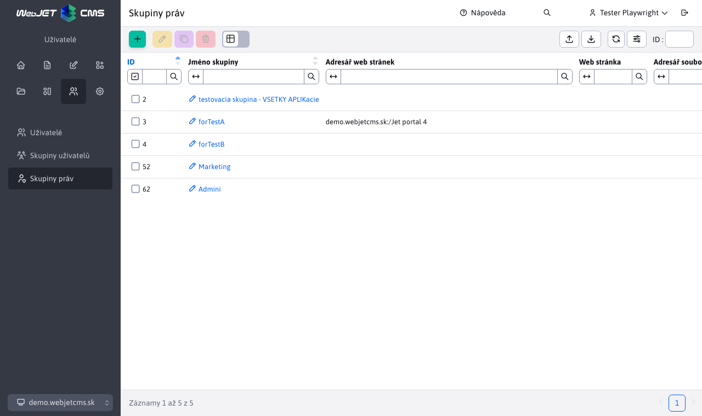

# Skupina práv

Skupinová oprávnění můžete definovat ve skupinách práv. Pomocí tlačítek v levém horním rohu stránky můžete vytvářet/upravovat/duplikovat/mazat skupiny práv, exportovat skupiny práv do excelu nebo je importovat z excelu.

Můžete si tedy vytvořit skupinu práv nazvanou "Editor", do které definujete práva k webovým stránkám a nejčastěji používaným aplikacím (zprávy, fotogalerie). Tímto způsobem nemusíte nastavovat práva jednotlivě. Při vytváření a duplikování skupiny práv je jediným povinným parametrem "Název skupiny". Důležitá je karta Přístupová práva, kde se nastavují práva k aplikacím/modulům, které bude skupina obsahovat.

Když se uživatel přihlásí, jsou mu nastavena všechna práva ze skupin práv, které si vybral, a jsou přidána i jeho individuálně nastavená práva.

