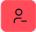
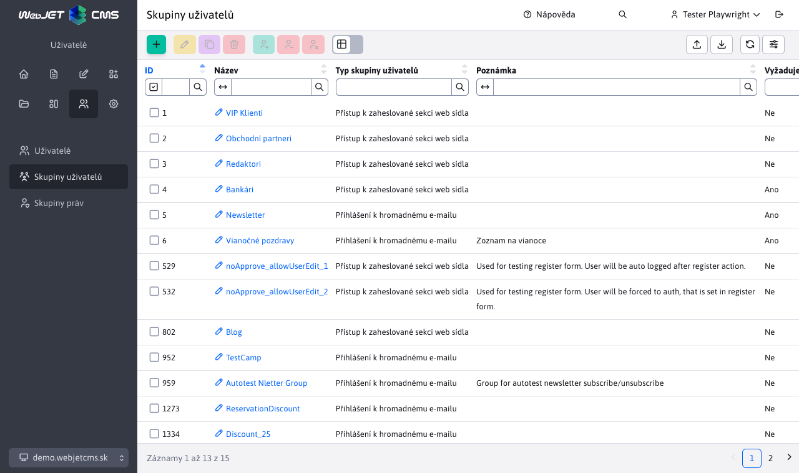
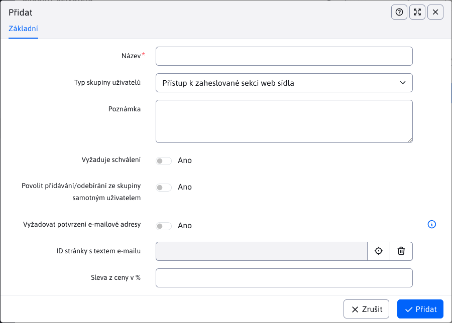

# Skupiny uživatelů

Sekce **Skupiny uživatelů** zobrazí seznam skupin, do kterých můžete zařadit návštěvníky/uživatele/příjemce hromadného e-mailu.

Systematicky rozlišujeme dva typy skupin:
- **Přístupy do sekce webových stránek chráněné heslem.** - skupina pro přístupová práva do neveřejných sekcí webových stránek.
- **Přihlášení k odběru hromadných e-mailů** - skupina pro distribuční seznam pro zasílání hromadných e-mailů

Tabulka nabízí rychlé akce nad skupinami pomocí tlačítek:
- , **Přidání vybrané skupiny všem uživatelům** - vybrané skupiny budou přidány ke všem stávajícím uživatelům.
- , **Odebrat vybranou skupinu všem uživatelům** - vybrané skupiny budou odebrány všem stávajícím uživatelům.
- , **Odstranění všech uživatelů vybrané skupiny** - uživatelé, kteří mají alespoň jednu z vybraných skupin, budou odstraněni.

## Editor

V dialogovém okně editoru definice skupiny máte k dispozici následující možnosti:
- **Název** - jedinečný název skupiny uživatelů.
- **Typ skupiny** - typ skupiny, buď přístupová práva pro skupinu řízení práv, nebo skupinu hromadných e-mailů.
- **Poznámka** - Jakýkoli komentář.
- **Vyžaduje schválení** - pokud je zaškrtnuto, bude po registraci uživatele do této skupiny nejprve odeslán e-mail správci, aby registraci schválil. Uživatel bude vytvořen v databázi, ale nebude mít vybrané pole Schváleno a nebude se moci přihlásit.
- **Povolit přidání/odebrání ze skupiny samotným uživatelem** - pokud je nastaveno, uživatel bude moci skupinu přidat/odebrat. Obvykle se tato možnost nastavuje u e-mailových skupin, aby si uživatel mohl sám nastavit, do jakých distribučních seznamů bude přihlášen. U skupin s přístupovými právy ponechte nezaškrtnuto.
- **Vyžadovat potvrzení e-mailové adresy** - pokud je vybrána, bude při registraci uživatele prostřednictvím registračního formuláře odeslán odkaz pro potvrzení e-mailové adresy. Teprve po kliknutí na odkaz v e-mailové zprávě bude uživatel zařazen do skupiny.
- **ID stránky s textem e-mailu** - výběr stránky s textem e-mailu, který bude uživateli odeslán po schválení.
- **Sleva z ceny v %** - procentní sleva pro uživatele v této skupině. Slevu pro uživatele lze využít v různých aplikacích, jako jsou např. [Rezervace](../../redactor/apps/reservation/reservations/README.md).

