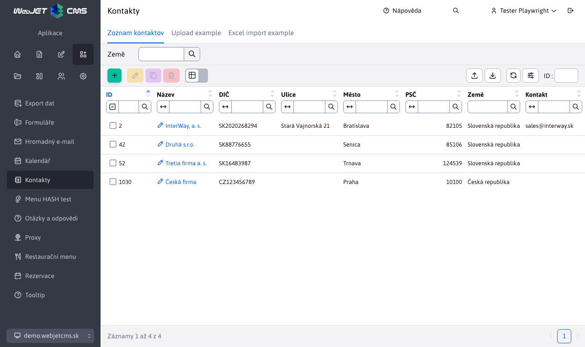
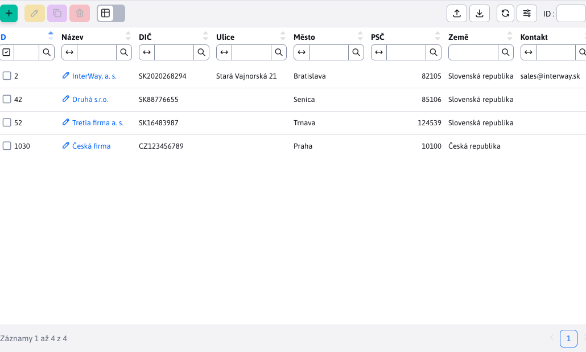

# Položka v menu admin části

Administrace je založena na [data tabulkách](../../developer/datatables/README.md) a [REST rozhraní](../../developer/datatables/restcontroller.md). Jako základ je třeba pochopit jejich fungování podle dokumentace pro [Programátora WebJET CMS](../../developer/README.md).

V této ukáže naprogramujeme správu kontaktů, využita je tabulka `contact`, která existuje ve standardní instalaci WebJET CMS (ale typicky se nepoužívá).



## Backend

Ideální řešení využívá `Spring DATA` repozitář, REST controller a datatabulku generovanou z `@DataTableColumn`, [anotací](../../developer/datatables-editor/datatable-columns.md).

Ukázková JPA entita is anotacemi `@DataTableColumn`, [pro datatabulku a editor](../../developer/datatables-editor/datatable-columns.md). Také si všimněte anotace `@EntityListeners` pro automatické [zapisování auditu](../../developer/backend/auditing.md) při změně entity.

Povinná pole a jiné validace [nastavujete anotacemi](../../developer/datatables/restcontroller.md#validace--povinná-pole), `@NotBlank,@Size,@Email` atp.

!>**Upozornění:** v entitě nepoužívejte primitivní typy `int, long` ale jen objektové `Integer, Long`, jinak nebude korektně fungovat filtrování/vyhledávání.

```java
package sk.iway.basecms.contact;

import javax.persistence.Column;
import javax.persistence.Entity;
import javax.persistence.EntityListeners;
import javax.persistence.GeneratedValue;
import javax.persistence.Id;
import javax.persistence.Table;
import javax.persistence.TableGenerator;
import javax.validation.constraints.Email;
import javax.validation.constraints.NotBlank;
import javax.validation.constraints.Size;

import lombok.Getter;
import lombok.Setter;
import sk.iway.iwcm.system.adminlog.EntityListenersType;
import sk.iway.iwcm.system.datatable.DataTableColumnType;
import sk.iway.iwcm.system.datatable.annotations.DataTableColumn;

/**
 * Ukazkova JPA entita pre pouzitie v datatabulke
 * http://docs.webjetcms.sk/v2022/#/custom-apps/admin-menu-item
 */

//nastavenie JPA entity
@Entity
@Table(name = "contact")
//automaticke generovanie getter/setter metod cez lombok
@Getter
@Setter
//nastavenie automatickeho auditovania zmien, dolezite je nastavit Adminlog.TYPE_XXX
@EntityListeners(sk.iway.iwcm.system.adminlog.AuditEntityListener.class)
@EntityListenersType(sk.iway.iwcm.Adminlog.TYPE_CLIENT_SPECIFIC)
public class ContactEntity {

    @Id
    @Column(name = "contact_id")
	@GeneratedValue(generator = "WJGen_contact")
	@TableGenerator(name = "WJGen_contact", pkColumnValue = "contact")
    @DataTableColumn(inputType = DataTableColumnType.ID)
    private Long id;

    @DataTableColumn(inputType = DataTableColumnType.OPEN_EDITOR, title="components.contact.property.name")
    @NotBlank
    private String name;

    @DataTableColumn(inputType = DataTableColumnType.TEXT, title="components.contact.property.vatid")
    private String vatid;

    @DataTableColumn(inputType = DataTableColumnType.TEXT, title="components.contact.property.street")
    private String street;

    @DataTableColumn(inputType = DataTableColumnType.TEXT, title="components.contact.property.city")
    private String city;

    @DataTableColumn(inputType = DataTableColumnType.TEXT, title="components.contact.property.zip")
    @Size(min=5, max=8)
    private String zip;

    @DataTableColumn(inputType = DataTableColumnType.SELECT, title="components.contact.property.country")
    private String country;

    @DataTableColumn(inputType = DataTableColumnType.TEXT, title="components.contact.property.contact")
    @Email
    private String contact;

    @DataTableColumn(inputType = DataTableColumnType.TEXT, title="components.contact.property.phone")
    private String phone;

}
```

Ukázkový JPA repozitář, při jeho použití vždy využívejte i `Pageable` objekt pro stránkování a uspořádání. Pro podporu dynamického generování vyhledávacích kritérií (v REST controlleru metoda `addSpecSearch`) repozitář rozšiřuje i `JpaSpecificationExecutor`.

```java
package sk.iway.basecms.contact;

import org.springframework.data.domain.Page;
import org.springframework.data.domain.Pageable;
import org.springframework.data.jpa.repository.JpaRepository;
import org.springframework.data.jpa.repository.JpaSpecificationExecutor;

/**
 * Ukazkovy Spring DATA repozitar pre pouzitie v datatabulke
 * http://docs.webjetcms.sk/v2022/#/custom-apps/admin-menu-item
 */
public interface ContactRepository extends JpaRepository<ContactEntity, Long>, JpaSpecificationExecutor<ContactEntity> {

    //citanie firiem podla zadanej krajiny pre MVC ukazku
    public Page<ContactEntity> findAllByCountry(String country, Pageable pageable);

}
```

!>**Upozornění:** všimněte si použití `JpaSpecificationExecutor`. Ten umožňuje dynamickou tvorbu SQL příkazu pro vyhledávání/filtrování/uspořádání záznamů v datatabulce. Pokud byste jej nepoužili, tak se vyhledává ve formě [Query By Example](https://www.baeldung.com/spring-data-query-by-example) kdy **nesmíte** použít primitivní typy a inicializační hodnoty v Entitě (např. `String text="test"`). Při vyhledávání by se pak hodnota `test` automaticky hledala i když není zadána. Toto řeší `JpaSpecificationExecutor`, který hledá pouze parametry zadané ve filtru (testováním request parametrů začínajících na `search`).

Ukázkový REST controller, vždy dávejte pozor na kontrolu práv přes anotaci `@PreAuthorize` a nezapomeňte i anotaci `@Datatable` pro korektní generování chybových odpovědí.

V metodě `getOptions` nastavuje možnosti pro výběrové pole země.

V metodě `beforeSave` je možné nastavit dodatečné (needitovatelné) údaje před uložením entity do databáze.

```java
package sk.iway.basecms.contact;

import java.util.ArrayList;
import java.util.List;

import org.springframework.beans.factory.annotation.Autowired;
import org.springframework.security.access.prepost.PreAuthorize;
import org.springframework.web.bind.annotation.RequestMapping;
import org.springframework.web.bind.annotation.RestController;

import sk.iway.iwcm.system.datatable.Datatable;
import sk.iway.iwcm.system.datatable.DatatablePageImpl;
import sk.iway.iwcm.system.datatable.DatatableRestControllerV2;
import sk.iway.iwcm.system.datatable.json.LabelValue;

/**
 * Ukazkovy Spring REST pre pouzitie v datatabulke
 * http://docs.webjetcms.sk/v2022/#/custom-apps/admin-menu-item
 */

@RestController
//nastavenie URL adresy REST controllera
@RequestMapping("/admin/rest/apps/contact/")
//nastavenie kontroly prav na alikaciu cmp_contact (tento kluc sa definuje v modinfo.properties)
@PreAuthorize("@WebjetSecurityService.hasPermission('cmp_contact')")
@Datatable
public class ContactRestController extends DatatableRestControllerV2<ContactEntity, Long> {

    @SuppressWarnings("unused")
    private final ContactRepository contactRepository;

    @Autowired
    public ContactRestController(ContactRepository contactRepository) {
        super(contactRepository);
        //odlozme si repozitar na pripadne specialne pouzitie
        this.contactRepository = contactRepository;
    }

    @Override
    public void getOptions(DatatablePageImpl<ContactEntity> page) {

        //pridaj zoznam pre pole country
        page.addOptions("country", getCountries(), "label", "value", false);
    }

    @Override
    public void beforeSave(ContactEntity entity) {
        //tu mozete vykonat nastavenie pred ulozenim, napr. nastavit datum poslednej zmeny
    }

    /**
     * Vrati zoznam vyberoveho pola pre krajinu
     * @return
     */
    public static List<LabelValue> getCountries() {
        //vytvor zoznam krajin, toto by sa idealne malo citat z nejakeho ciselnika
        List<LabelValue> countries = new ArrayList<>();
        countries.add(new LabelValue("Slovenská republika", "sk"));
        countries.add(new LabelValue("Česká republika", "cz"));
        countries.add(new LabelValue("Rakúsko", "at"));

        return countries;
    }
}
```

## Frontend

Jak je zmíněno výše pro frontend se využívají datatabulky. Administrace je zkompilována z pug souborů do html a následně zobrazena.

Pro snadné vytvoření nové stránky v administraci jsme zavedli před připravenou šablonu rozložení stránky. Vy doplníte jen střední část stránky (šablona zajistí generování hlavičky a menu). [Mapování URL adres](../../src/main/java/sk/iway/iwcm/admin/ThymeleafAdminController.java) je připraveno jako `/apps/{app}/admin/` nebo `/apps/{app}/admin/{subpage}`.

Stačí připravit soubor `/apps/{app}/admin/index.html` nebo `/apps/{app}/admin/{subpage}.html` kde `{app}` je jméno adresáře ve kterém je aplikace (bez diakritiky a mezer) a `{subpage}` je případné jméno souboru bez přípony (nejedná-li se o jméno index.html).

Příkladem je aplikace `src/main/webapp/apps/contact/admin/index.html` volaná přes URL adresu `/apps/contact/admin/`:

```html
<script>
    var dataTable;

    window.domReady.add(function () {

        WJ.breadcrumb({
            id: "contact",
            tabs: [
                {
                    url: '/apps/contact/admin/',
                    title: '[[#{components.contact.title}]]',
                    active: true
                }
            ]
        })

        //URL adresa REST rozhrania
        let url = "/admin/rest/apps/contact";
        //package a meno triedy s JPA entitou
        let columns = [(${layout.getDataTableColumns("sk.iway.basecms.contact.ContactEntity")})];

        dataTable = WJ.DataTable({
            url: url,
            serverSide: true,
            columns: columns,
            //id musi byt zhodne s tagom table nizsie
            id: "dataTable",
            fetchOnEdit: true,
            fetchOnCreate: true
        });
    });

</script>

<table id="dataTable" class="datatableInit table"></table>
```

Pomocí funkce [WJ.breadcrumb](../../developer/frameworks/webjetjs.md#navigační-lišta) je vygenerována navigační lišta.


Funkce [WJ.DataTable](../../developer/datatables/README.md#možnosti-konfigurace) inicializuje ve stránce datatabulku do HTML tabulky s `id=dataTable`. Upozorňujeme na volání `window.domReady.add`, které je třeba používat místo `$(document).ready` - volání čeká na inicializaci [překladových klíčů](../../developer/libraries/translator.md) a teprve po jejich získání je vyvolána zadaná funkce.



Pro zobrazení položky v menu a zobrazení práva pro uživatele je ještě třeba vytvořit konfigurační soubor `modinfo.properties`, ten umístěte do `/apps/MENO_APLIKACIE/`, pro náš případ `src/main/webapp/apps/contact/modinfo.properties`:

```sh
#prekladovy kluc menu polozky
leftMenuNameKey=components.contact.title
#pouzivatelske pravo
itemKey=cmp_contact
#ak je true, je mozne pravo nastavovat
userItem=true
#linka v menu
leftMenuLink=/apps/contact/admin/
#ikona v menu (https://fontawesome.com/v5/search?s=solid%2Cbrands)
icon=address-book
#ak je true bude po pridani aplikacie zakazana pre vsetkych pouzivatelov a musi sa implicitne povolit
defaultDisabled=true
#ak je true, bude v zozname aplikacii na zaciatku (je to zakaznicka aplikacia)
custom=true

#submenu
#leftSubmenu1NameKey=components.contact.subpage.title
#leftSubmenu1Link=/apps/contact/admin/subpage/
```

Máte-li stránky typu `master-detail`, která není definována v `modinfo.properties` nemusí se korektně zobrazit levé menu, protože neví jakou položku má zvýraznit. Nejjednodušší řešení je takovou stránku pojmenovat `meno-details.html` (jako je např. URL adresa `/apps/stat/admin/top-details/?docId=35267&dateRange=` v souboru `/apps/stat/admin/top-details.html`). Výraz `-details` nebo `-detail` se při hledání položky na zvýraznění v menu odstraní a zvýrazní se tak hlavní (`master`) stránka.

Pokud takové použití není vhodné můžete využít ve vaší stránce JavaScript funkci `WJ.selectMenuItem(href)` pro zvýraznění zadané menu položky. V parametru `href` zadáte přímo URL adresu stránky v menu, kterou chcete zvýraznit:

```JavaScript
window.domReady.add(function () {
    WJ.selectMenuItem("/admin/v9/apps/gallery/");
});
```

V případě staré JSP komponenty funkci volejte pomocí `setTimeout` aby se provedla až po zobrazení stránky.

### Přiložení JavaScript souboru

Pokud potřebujete k aplikaci připojit JavaScript modul WebJET automaticky hledá soubor `/apps/{app}/admin/{app}.js` a pokud existuje vloží jej do hlavičky HTML kódu jako modul, přičemž jej importuje jako objekt `appModule`:

```html
<script type="module">
        import * as appModule from "[[${appIncludePathJs}]]";
        window.appModule = appModule;
</script>
```

Například v aplikaci stat by existoval soubor `/apps/stat/admin/stat.js`:

```javascript
export const ChartType = {
    Bar: "bar"
    ...
}

export class ChartForm {
    constructor(chartType, yAxeName, xAxeName, chartTitle) {
        this.chartType = chartType;
        ...
    }
}

export async function setAmchart(chartForm) {
    ...
}
```

který se následně v JavaScript/HTML kódu jmenuje jako `appModule.ChartType.Bar` atp.

## Automatizovaný test

Pro datatabulku je připraven [základní automatizovaný test](../../developer/testing/datatable.md), který stačí nakonfigurovat. Vytvořte nový testovací scénář v `src/test/webapp/tests/apps/contact.js` s alespoň základním testem:

```javascript
Feature('contact');

Before(({ I, login }) => {
    login('admin');
    I.amOnPage("/apps/contact/admin/");
});

Scenario('contact-zakladne testy', async ({ I, DataTables, DTE }) => {
    await DataTables.baseTest({
         dataTable: 'dataTable',
         //meno prava na kontrolu podla modinfo.properties
         perms: 'cmp_contact',
         createSteps: function(I, options) {
            //toto pole musime vyplnit rucne, kedze ma specialnu validaciu
            DTE.fillField("zip", "85106");
         }
    });
});
```
