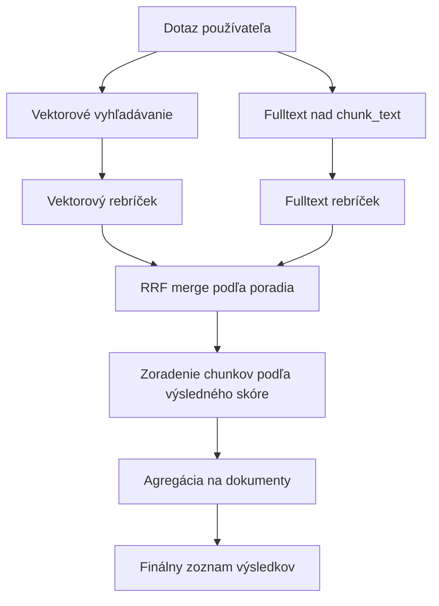
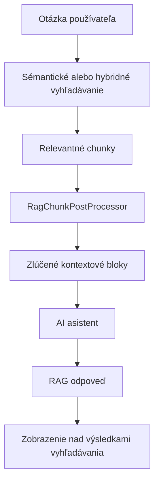

# Sémantické vyhledávání (RAG)

Sémantické vyhledávání umožňuje návštěvníkům nalézt relevantní stránky podle **významu otázky**, nejen podle shody klíčových slov. Využívá vektorovou databázi [pgvector](https://github.com/pgvector/pgvector) a embedding vektory generované přes OpenAI API.

Nad stejným indexem lze použít také:

- **hybridní vyhledávání** - kombinaci vektorového vyhledávání a fulltextu nad textem chunků,
- **RAG odpověď** - AI odpověď vygenerovanou pouze z nalezeného kontextu.

## Jak to funguje

Systém pracuje ve dvou hlavních fázích: indexování a online vyhledávání.

### 1. Indexování

Když je webová stránka uložena, obnovena z koše nebo smazána, listener [DocSaveEventListener](../../../../../../src/main/java/sk/iway/iwcm/rag/listener/DocSaveEventListener.java) zařadí požadavek do fronty Úloha na pozadí [RagIndexCronTask](../../../../../../src/main/java/sk/iway/iwcm/rag/service/RagIndexCronTask.java) následně zpracovává frontu přes [SemanticIndexService](../../../../../../src/main/java/sk/iway/iwcm/rag/service/SemanticIndexService.java).

Proces indexování:

1. **Extrakce obsahu** - z `DocDetails` se získá čistý text bez HTML značek přes [DocDetailsContentExtractor](../../../../../../src/main/java/sk/iway/iwcm/rag/indexing/DocDetailsContentExtractor.
2. **Rozdělení na části** - text se rozdělí pomocí [SlidingWindowChunker](../../../../../../src/main/java/sk/iway/iwcm/rag/indexing/SlidingWindowChunker.java). Používají se konfigurační proměnné `ragEmbeddingChunkSize` a `ragEmbeddingChunkOverlap`.
3. **Opětovné použití embeddingů** - pro každý chunk se vypočítá hash. Pokud se text chunku nezměnil a embedding má správnou dimenzi, použije se existující vektor.
4. **Generování embeddingů** - nové nebo změněné chunky se odešlou do OpenAI API (`/v1/embeddings`) přes [OpenAiEmbeddingProvider](../../../../../../src/main/java/sk/iway/iwcm/rag/embedding
5. **Uložení do databáze** - metadata chunků se ukládají přes JPA repozitář [EmbeddingChunkRepository](../../../../../../src/main/java/sk/iway/iwcm/rag/pgvector/EmbeddingChunkRepository. aktualizuje nativním SQL přes [PgVectorStore](../../../../../../src/main/java/sk/iway/iwcm/rag/vectorstore/PgVectorStore.java).

Chunking preferuje přirozené hranice textu: odstavec, řádek, větu, mezeru a teprve potom tvrdé rozdělení podle limitu. U desetinných čísel se tečka nepovažuje za konec věty.

### 2. Vyhledávání

Když návštěvník zadá vyhledávací dotaz:

1. [SearchAction](../../../../../../src/main/java/sk/iway/iwcm/doc/SearchAction.java) určí typ vyhledávání z parametru aplikace `searchType`. Při hodnotě `auto` nebo prázdné hodnotě použije globální konfigurační proměnnou `searchType`.
2. Při hodnotě `semantic` nebo `hybrid` se použije [SemanticSearchAction](../../../../../../src/main/java/sk/iway/iwcm/doc/SemanticSearchAction.java).
3. [SemanticSearchService](../../../../../../src/main/java/sk/iway/iwcm/rag/search/SemanticSearchService.java) vygeneruje embedding dotazu a vyhledá nejbližší chunky v pgvector databázi.
4. Výsledky se omezí podle domény, jazyka, typu entity a podle složek zvolených v aplikaci **Vyhledávání**.
5. Pokud je povolen hybridní režim, spustí se i fulltext nad `rag_embedding_chunks.chunk_text` a výsledky se spojí přes `RRF` (Reciprocal Rank Fusion).
6. Výsledné chunky se agregují na dokumenty a dokumenty se zobrazí stejným způsobem jako při standardním vyhledávání.
7. Pokud je povolena RAG odpověď, z nalezených chunků se ještě připraví kontext pro AI odpověď.

## Požadavky

- **PostgreSQL** s rozšířením **pgvector** (obraz: `pgvector/pgvector:pg18-trixie` nebo novější).
- **OpenAI API klíč** - používá se stejný klíč jako pro AI asistenty (`ai_openAiAuthKey`).
- Sémantické vyhledávání funguje pouze nad PostgreSQL/pgvector úložištěm. Pokud primární databáze WebJET CMS není PostgreSQL, nastavte samostatnou PostgreSQL databázi přes datasource `rag_jpa`.

### PostgreSQL jako primární databáze

Pokud WebJET CMS běží přímo na PostgreSQL, vektorová databáze se použije automaticky bez další konfigurace.

Musí být nastaven datasource jako v případě [poolman-docker-pgsql.xml](../../../../../../src/main/resources/poolman-docker-pgsql.xml).

### Samostatná vektorová databáze

Pokud primární databáze není PostgreSQL, vytvořte Docker kontejner s pgvector.

Pro lokální vývoj je připraven soubor [.devcontainer/db/docker-compose-rag-pgsql.yml](../../../../../../.devcontainer/db/docker-compose-rag-pgsql.yml):

```bash
docker compose -f .devcontainer/db/docker-compose-rag-pgsql.yml up -d
```

Příklady datasource konfigurace:

- [poolman-docker-mariadb.xml](../../../../../../src/main/resources/poolman-docker-mariadb.xml)
- [poolman-docker-mssql.xml](../../../../../../src/main/resources/poolman-docker-mssql.xml)
- [poolman-docker-oracle.xml](../../../../../../src/main/resources/poolman-docker-oracle.xml)

## Konfigurace

Aktivace a nastavení se provádí v [Konfiguraci](../../../../admin/setup/configuration/README.md).

### Základní nastavení

| Proměnná | Výchozí hodnota | Popis |
| --- | --- | --- |
| `ragSemanticSearchEnabled` | `false` | Zapne sémantické vyhledávání nad vektorovou databází pgvector. |
| `searchType` | `db` | Globální typ vyhledávání: `db`, `lucene`, `semantic`, `hybrid`. |
| `luceneAsDefaultSearch` | `false` | Pokud je `true`, Lucene má vyšší prioritu než `searchType`. |

!> Pro aktivaci sémantického vyhledávání nastavte `ragSemanticSearchEnabled=true` a použijte `searchType=semantic` nebo `searchType=hybrid`. Typ vyhledávání lze také přepsat lokálně v aplikaci **Vyhledávání**.

### Embedding a indexování

| Proměnná | Výchozí hodnota | Popis |
| --- | --- | --- |
| `ragEmbeddingModel` | `text-embedding-3-small` | Název OpenAI embedding modelu. |
| `ragEmbeddingDimensions` | `1536` | Počet dimenzí vektoru. Musí odpovídat použitému modelu a databázové tabulce. |
| `ragEmbeddingChunkSize` | `1000` | Maximální velikost jedné části textu ve znacích. |
| `ragEmbeddingChunkOverlap` | `200` | Počet znaků, o které se sousední chunky překrývají. |

!>**Upozornění:** Starší názvy `ragChunkSize` a `ragChunkOverlap` se již nepoužívají.

!>**Upozornění:** Při změně `ragEmbeddingDimensions` se vymažou data pro aktuální embedding model, protože vektory nebudou kompatibilní. Po změně modelu nebo dimenze spusťte úplné indexování obsahu.

### Vektorové vyhledávání

| Proměnná | Výchozí hodnota | Popis |
| --- | --- | --- |
| `ragSearchEfSearch` | `40` | Parametr `HNSW` indexu `ef_search`. Vyšší hodnota zlepšuje recall, ale může zpomalit vyhledávání. |
| `ragSearchDistanceMetric` | `cosine` | Metrika vzdálenosti: `cosine`, `inner_product`, `l2`. Změna vyžaduje reindex `HNSW` indexu. |
| `ragSemanticSearchMinSimilarity` | `0.2` | Minimální hodnota similarity pro výsledky. Používá se spolu s adaptivním prahem podle nejlepšího výsledku. |
| `ragSemanticSearchMinResults` | `3` | Minimální počet výsledků, které se vrátí i při přísnějším prahu similarity. |

### Hybridní vyhledávání

Hybridní vyhledávání kombinuje vektorové výsledky a fulltextové výsledky nad `rag_embedding_chunks.chunk_text`. Používá se tehdy, když je povoleno `ragHybridSearchEnabled` a režim hybridního vyhledávání není `off`.

| Proměnná | Výchozí hodnota | Popis |
| --- | --- | --- |
| `ragHybridSearchEnabled` | `true` | Globálně povolí hybridní vyhledávání. |
| `ragHybridSearchMode` | `short_query_only` | Režim: `off`, `always`, `short_query_only`, `fallback_on_low_vector`. |
| `ragHybridShortQueryMaxChars` | `12` | Maximální délka dotazu ve znacích pro režim `short_query_only`. |
| `ragHybridShortQueryMaxTerms` | `2` | Maximální počet slov dotazu pro režim `short_query_only`. |
| `ragHybridFallbackTopSimilarity` | `0.35` | Práh nejlepší vektorové similarity pro režim `fallback_on_low_vector`. |
| `ragHybridVectorWeight` | `0.7` | Váha vektorového pořadí při RRF merge. |
| `ragHybridFtsWeight` | `0.3` | Váha fulltextového pořadí při RRF merge. |
| `ragHybridRrfK` | `60` | Parametr `k` pro Reciprocal Rank Fusion. |
| `ragHybridChunkFetchMultiplír` | `3` | Násobič počtu chunků načtených oproti požadovanému počtu výsledků. |
| `ragHybridFtsUseIlikeFallback` | `true` | Pokud PostgreSQL FTS vrátí prázdný výsledek, použije fallback přes `ILIKE`. |

V lokálním nastavení aplikace má hodnota `searchType=semantic` význam čistého vektorového vyhledávání bez hybridní větve. Hodnota `searchType=hybrid` použije hybrid, pokud je globálně povolen.



## RAG odpověď ve vyhledávání

RAG odpověď je volitelný doplněk sémantického nebo hybridního vyhledávání. Po nalezení relevantních chunků se připraví omezený kontext a odešle se AI asistentovi. Odpověď se zobrazí nad seznamem výsledků v JSP šabloně [search.jsp](../../../../../../src/main/webapp/components/search/search.jsp).

### Konfigurace RAG odpovědi

| Proměnná | Výchozí hodnota | Popis |
| --- | --- | --- |
| `ragAnswerAllowed` | `false` | Globálně povolí generování RAG odpovědi ve vyhledávání. |
| `ragAnswerModel` | `gpt-5.4-mini` | Výchozí model pro automaticky vytvořeného RAG asistenta. |
| `ragAnswerMinSimilarity` | `0.3` | Měkký práh similarity pro chunky vstupující do kontextu odpovědi. |
| `ragAnswerTopK` | `12` | Počet nejrelevantnějších chunků použitých před post-processingem. |
| `ragAnswerMaxChunkGap` | `1` | Maximální mezera mezi indexy chunků, které se ještě mohou sloučit. Hodnota `1` znamená sousední chunky. |
| `ragAnswerMaxBlocks` | `4` | Maximální počet sloučených kontextových bloků odeslaných modelu. |
| `ragAnswerMaxCharacters` | `6000` | Maximální celkový počet znaků kontextu. |
| `ragAnswerMaxMergedBlockCharacters` | `2200` | Maximální počet znaků jednoho sloučeného kontextového bloku. |

V aplikaci **Vyhledávání** lze tyto hodnoty přepsat lokálně. Prázdná čísla znamenají použití globální konfigurace.

### Post-processing kontextu

[RagChunkPostProcessor](../../../../../../src/main/java/sk/iway/iwcm/rag/search/RagChunkPostProcessor.java) připravuje kontext pro model:

1. seřadí chunky podle similarity a vybere top K,
2. použije adaptivní práh similarity, ale nikdy nevyhodí všechno, pokud existuje alespoň jeden použitelný výsledek,
3. seskupí chunky podle entity,
4. sloučí sousední chunky a odstraní duplicitní text z překrytí,
5. omezí počet bloků a celkový počet znaků.

Výsledkem jsou objekty [MergedContextBlock](../../../../../../src/main/java/sk/iway/iwcm/rag/search/MergedContextBlock.java), které se odesílají modelu jako JSON.

### AI asistent

[RagService](../../../../../../src/main/java/sk/iway/iwcm/rag/search/RagService.java) používá AI asistenty WebJET CMS. Není-li vybrán konkrétní asistent, systém najde nebo vytvoří výchozího asistenta:

- název: `RAG-SEARCH`,
- skupina: `92-rag-answer`,
- provider: `openai`,
- model: hodnota `ragAnswerModel`,
- třída: `sk.iway.iwcm.rag.search.RagService`.

V editoru aplikace se zobrazí také asistenti v aktuální doméně, kteří mají stejnou hodnotu `className`.

Asistent dostane backendom připravená makra:

| Makro | Hodnota |
| --- | --- |
| `{userQuestion}` | Otázka uživatele jako JSON string. |
| `{retrievedContext}` | JSON pole sloučených kontextových bloků. |

Makra `bonusParams` jsou ignorována při veřejných REST voláních asistenta a nastavují se pouze na backendu. Odpověď musí vycházet pouze z `retrievedContext`. Pokud model vrátí sentinel `CANNOT_ANSWER_QUESTION`, uživateli se zobrazí lokalizovaná fallback odpověď.



## Používání v šablonách

Sémantické vyhledávání se aktivuje vložením aplikace **Vyhledávání** do stránky. Typ vyhledávání lze nastavit globálně nebo přímo v parametru aplikace.

Globální nastavení:

```properties
ragSemanticSearchEnabled=true
searchType=semantic
```

Příklad lokálního nastavení aplikace:

```html
!INCLUDE(/components/search/search.jsp, searchType=hybrid, answerAllowed=trueValue)!
```

Vybrané parametry aplikace:

| Parametr | Hodnoty | Popis |
| --- | --- | --- |
| `searchType` | `auto`, `db`, `lucene`, `semantic`, `hybrid` | Typ vyhledávání pro konkrétní aplikaci. |
| `answerAllowed` | `auto`, `trueValue`, `falseValue` | Lokální zapnutí nebo vypnutí RAG odpovědi. |
| `semanticSearchMinSimilarity` | číslo | Lokální hodnota `ragSemanticSearchMinSimilarity`. |
| `semanticSearchMinResults` | číslo | Lokální hodnota `ragSemanticSearchMinResults`. |
| `hybridSearchMode` | `auto`, `off`, `always`, `short_query_only`, `fallback_on_low_vector` | Lokální režim hybridního vyhledávání. |
| `hybridFtsUseIlikeFallback` | `auto`, `trueValue`, `falseValue` | Lokální fallback pro fulltext. |
| `ragAssistantId` | ID asistenta nebo `-1` | Výběr asistenta pro RAG odpověď. |

## Automatické indexování

Systém automaticky zařadí stránku do indexovací fronty při její:

- **uložení** - vytvoření nebo úprava stránky,
- **obnovení z koše** - stránka se znovu indexuje,
- **smazání** - embeddingy se odstraní z vektorové databáze.

Manuální indexování v administraci pracuje pouze se stránkami, které jsou povoleny pro vyhledávání.

## Automatizované úkoly

Frontu zpracovává automatizovaná úloha [cs.iway.iwcm.rag.service.RagIndexCronTask](../../../../../../src/main/java/sk/iway/iwcm/rag/service/RagIndexCronTask.java). Doporučené nastavení je spouštění každých 5 minut.

Cron úloha je bezpečná vůči souběžnému spuštění. Při běhu se nastaví příznak v cache s platností 60 minut a při pomalejším zpracování se jeho platnost obnovuje. Zpracované položky se z fronty vymažou dávkově; při chybě mazání se použije mazání po řádcích. Chyby při indexování konkrétní stránky se uloží jako stav **ERROR** v tabulce chunků. Pokud selhání zpracování položky ještě na úrovni fronty, položka zůstane ve frontě a znovu se zpracuje při dalším běhu.

## Databázové schéma

Systém vytváří dvě tabulky:

### `rag_index_queue`

Fronta pro asynchronní indexování. Prováděno třídou [IndexQueueEntity](../../../../../../src/main/java/sk/iway/iwcm/rag/jpa/IndexQueueEntity.java).

### `rag_embedding_chunks`

Uloženo embedding vektory a metadata chunků. Implementováno třídou [EmbeddingChunkEntity](../../../../../../src/main/java/sk/iway/iwcm/rag/pgvector/EmbeddingChunkEntity.java).

Důležité sloupce:

- `entity_type`, `entity_id`, `chunk_index` - identifikace zdrojové entity a pořadí chunku.
- `chunk_text` - ​​text použitý pro embedding a fulltext.
- `content_hash` - ​​hash textu chunku pro opětovné použití embeddingu.
- `embedding` - ​​nativní pgvector typ `vector(N)`.
- `embedding_model`, `dimensions` - model a dimenze embeddingu.
- `language`, `domain_id` - jazyk a doména.
- `group_id`, `root_group_l1`, `root_group_l2`, `root_group_l3` - optimalizované filtrování dokumentů podle složek.
- `status`, `error_message` - stav zpracování.

!>**Upozornění:** Sloupec `embedding` není mapován přes JPA. Všechny operace s vektory probíhají přes nativní SQL dotazy ve třídě [PgVectorStore](../../../../../../src/main/java/sk/iway/iwcm/rag/vectorstore/PgVectorStore.java).

Při inicializaci schématu se doplní chybějící sloupce `group_id` a `root_group_l1..3`. Stávající data však nemají tyto hodnoty zpětně vyplněna, proto po aktualizaci spusťte opětovné indexování.

## Doporučení pro český a slovenský obsah

Výchozí hodnoty (`text-embedding-3-small`, `ragEmbeddingChunkSize=1000`, `ragEmbeddingChunkOverlap=200`) jsou vyvážený kompromis mezi cenou, rychlostí a přesností pro běžné webové stránky v češtině a češtině.

Při ladění se řiďte těmito doporučeními:

- **Velikost části (`ragEmbeddingChunkSize`)** - pro webové stránky v SK/CZ je vhodný rozsah **800-1 200 znaků**. U kratších částí se ztrácí kontext odstavce, u delších klesá přesnost výběru konkrétní pasáže.
- **Překryv (`ragEmbeddingChunkOverlap`)** - udržujte poměr **15-25 %** z `ragEmbeddingChunkSize`. Překryv zabraňuje ztrátě kontextu na hranicích mezi částmi.
- **Limit modelu** - modely `text-embedding-3-*` zvládnou Max. 8 191 tokenů na jeden vstup. U češtiny a češtiny je to s rezervou přibližně 6 000 znaků.
- **Vyhodnocení kvality** - připravte si 10-20 reprezentativních otázek v slovenštině nebo češtině a porovnávejte TOP-5 výsledky při různých nastaveních.

## Alternativní embedding modely

Výchozí model `text-embedding-3-small` je vícejazyčný a češtinu/češtinu zvládá v dostatečné kvalitě pro většinu webových projektů. Pokud požadujete vyšší přesnost, k dispozici jsou tyto alternativy:

| Model | `ragEmbeddingModel` | `ragEmbeddingDimensions` | Kvalita pro SK/CZ | Poznámka |
| --- | --- | --- | --- | --- |
| OpenAI `text-embedding-3-small` | `text-embedding-3-small` | `1536` | Dobrá | Výchozí model - levný a rychlý. |
| OpenAI `text-embedding-3-large` | `text-embedding-3-large` | `3072` | Vysoká | Nejpřesnější OpenAI vícejazyčný model, dražší než `small`. |
| OpenAI `text-embedding-3-large` zkrácený | `text-embedding-3-large` | `1024` nebo `1536` | Vysoká | Díky MRL lze vektor zkrátit bez výrazné ztráty kvality. |

!>**Upozornění:** Všechny vektory v tabulce `rag_embedding_chunks` musí pocházet ze stejného modelu a mít stejnou dimenzi. Při změně modelu nebo dimenze musíte spustit úplnou indexaci obsahu.

### Co je Matryoshka (MRL)

Modely `text-embedding-3-small` i `text-embedding-3-large` jsou trénovány technikou `Matryoshka Representation Learning`. Nejdůležitější informace jsou soustředěny na začátku vektoru, takže vektor lze bezpečně zkrátit, například použít pouze prvních 1024 nebo 1536 hodnot z 3072.

V praxi to znamená, že můžete použít kvalitnější `text-embedding-3-large`, ale výstup si nechat vrátit například v 1536 dimenzích. Získáte vyšší přesnost než `small@1536` při stejné velikosti tabulky i podobné rychlosti vyhledávání.
