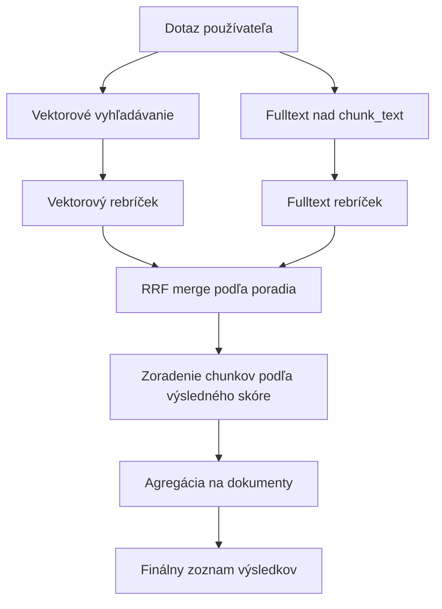

# Sémantické vyhledávání (RAG)

Sémantické vyhledávání umožňuje návštěvníkům nalézt relevantní stránky na základě **významu otázky**, nejen shody klíčových slov. Využívá technologii postavenou na vektorové databázi [pgvector](https://github.com/pgvector/pgvector) a vektorech generovaných přes OpenAI API.

## Jak to funguje

Systém pracuje ve dvou fázích:

### 1. Indexování

Když je webová stránka uložena nebo změněna, systém ji zařadí do fronty pro indexování. Úloha na pozadí ([RagIndexCronTask](../../../../../../src/main/java/sk/iway/iwcm/rag/service/RagIndexCronTask.java)) pravidelně zpracovává frontu:

1. **Extrakce obsahu** – z `DocDetails` se extrahuje čistý text (název + perex + tělo stránky bez HTML tagů).
2. **Rozdělení na části (chunking)** – text se rozdělí na překrývající se části pomocí algoritmu posuvného okna (`SlidingWindowChunker`). Výchozí velikost části je 500 znaků s překryvem 100 znaků.
3. **Generování vektorů** – každá část se odešle do OpenAI API (`/v1/embeddings`) a vrátí se vektor s 1 536 dimenzemi (model `text-embedding-3-small`).
4. **Uložení do databáze** – vektory se uloží do tabulky `rag_embedding_chunks` v `PostgreSQL` databázi s rozšířením `pgvector`.

### 2. Vyhledávání (online)

Když návštěvník zadá vyhledávací dotaz:

1. Dotaz se převede na embedding vektor přes OpenAI API.
2. Provede se vektorové vyhledávání v databázi (kosinusová podobnost).
3. Výsledky se agregují podle dokumentu – za každý dokument se vybere nejlepší chunk.
4. Dokumenty se vrátí seřazené podle podobnosti a zobrazí se stejným způsobem jako výsledky standardního vyhledávání.

## Požadavky

- **PostgreSQL** s rozšířením **pgvector** (obraz: `pgvector/pgvector:pg18-trixie` nebo novější)
- **OpenAI API klíč** – tentýž, který se používá pro AI asistenty (`ai_openAiAuthKey`)
- Sémantické vyhledávání funguje **jen v PostgreSQL**. Pro ostatní databáze (MySQL/MariaDB, MSSQL, Oracle) je třeba nastavit samostatnou vektorovou databázi přes datasource `rag_jpa`. Můžete tedy používat například MariaDB pro databázi WebJET CMS a samostatnou PostgreSQL pro vektorovou část.

### PostgreSQL jako primární databáze

Pokud WebJET CMS běží přímo na PostgreSQL, vektorová databáze se použije automaticky bez další konfigurace.

Musí být pouze nastaven datasource jako v případě [poolman-docker-pgsql.xml](../../../../../../src/main/resources/poolman-docker-pgsql.xml).

### Samostatná vektorová databáze (vedlejší)

Pokud primární databáze není PostgreSQL, vytvořte Docker kontejner s `pgvector`.

Pro lokální vývoj je připraven soubor [.devcontainer/db/docker-compose-rag-pgsql.yml](../../../../../../.devcontainer/db/docker-compose-rag-pgsql.yml):

```bash
docker compose -f .devcontainer/db/docker-compose-rag-pgsql.yml up -d
```

již s nakonfigurovanými datasource:

- [poolman-docker-mariadb.xml](../../../../../../src/main/resources/poolman-docker-mariadb.xml)
- [poolman-docker-mssql.xml](../../../../../../src/main/resources/poolman-docker-mssql.xml)
- [poolman-docker-oracle.xml](../../../../../../src/main/resources/poolman-docker-oracle.xml)

## Konfigurace

Aktivace a nastavení sémantického vyhledávání v [Konfigurace](../../../../admin/setup/configuration/README.md):

| Proměnná | Výchozí hodnota | Popis |
| --- | --- | --- |
| `ragSemanticSearchEnabled` | `false` | Zapne sémantické vyhledávání. Nastavte na `true` pro aktivaci. |
| `ragEmbeddingModel` | `text-embedding-3-small` | Název OpenAI embedding modelu |
| `ragEmbeddingDimensions` | `1536` | Počet dimenzí vektoru. Musí odpovídat použitému modelu a tabulce v databázi. |
| `ragChunkSize` | `1000` | Maximální velikost jedné části textu ve znacích. |
| `ragChunkOverlap` | `200` | Počet znaků, o které se sousední části překrývají. |
| `searchType` | `db` | Typ vyhledávání: `db` (databázové), `lucene` (Lucene fulltext), `semantic` (sémantické). |
| `ragSemanticSearchMinSimilarity` | `0.2` | minimální hodnota similarity pro výsledky. Hodnota mimo interval 0-1 se ořezává na nejbližší hranici |
| `ragSemanticSearchMinResults` | `3` | minimální počet výsledků sémantického vyhledávání; při menším počtu se doplní podle nejvyšší similarity |
| `ragSearchEfSearch` | `40` | `HNSW` index parametr `ef_search` - čím vyšší hodnota, tím lepší recall ale pomalejší vyhledávání. Default je 40, pro větší web sídla zvažte zvýšení na 100 nebo více. |
| `ragSearchDistanceMetric` | `cosine` | Metrika vzdálenosti pro `pgvector` vyhledávání. Možné hodnoty: 'cosine' (kosinusová vzdálenost), 'inner_product' (vnitřní součin, rychlejší pro normalizované vektory), 'l2' (euklidovská vzdálenost). Změna vyžaduje reindex `HNSW` indexu. |

!> Pro aktivaci sémantického vyhledávání nastavte `ragSemanticSearchEnabled=true` **aj** `searchType=semantic`.

!>**Upozornění:** při změně konfigurační proměnné `ragEmbeddingDimensions` se vymaže celá tabulka `rag_embedding_chunks`, protože vektory nebudou kompatibilní. Zvažte zálohu dat před změnou této hodnoty. Tabulka se automaticky znovu vytvoří s novou dimenzí.

Nastavte [automatizovanou úlohu](../../../../admin/settings/cronjob/README.md) s hodnotou `sk.iway.iwcm.rag.service.RagIndexCronTask` spouštěnou například každých 5 minut - hodnota `*/5` v poli Minuta.

### Hybridní vyhledávání (vector + fulltext)

U režimu `short_query_only` se fulltext zapíná zejména pro krátké dotazy, kde může být samotná vektorová podobnost méně stabilní.

Při režimu `fallback_on_low_vector` se fulltext provede pouze tehdy, když je top vektorová similarity nízká nebo je příliš málo výsledků.

Výsledky se spojují pomocí `RRF` (Reciprocal Rank Fusion). V praxi to znamená, že se nesrovnávají samotná čísla similarity mezi vektorovou a fulltext větví, ale pouze jejich pořadí v každé větvi.

Zjednodušeně:

1. Vektorové vyhledávání vrátí seznam výsledků seřazený od nejlepšího po horší.
2. Fulltext vyhledávání vrátí svůj vlastní seznam seřazený od nejlepšího po horší.
3. Každý výsledek dostane body podle pozice v seznamu, kde lepší umístění znamená více bodů.
4. Pokud se tentýž chunk objeví v obou větvích, body se mu sčítají.
5. Poté se výsledky seřadí podle součtu bodů a až z toho se vyberou dokumenty.

Tímto způsobem může být výsledek, který je mírně slabší ve vektoru, ale velmi dobrý ve fulltextu, posunut výše. Naopak výsledek, který je silný jen v jedné větvi, nepřebije kombinovaný výsledek z obou větví jen náhodně velkým číslem similarity.



Lze nastavit následující konfigurační proměnné:

| Proměnná | Výchozí hodnota | Popis |
| --- | --- | --- |
| `ragHybridSearchEnabled` | `true` | Zapne hybridní vyhledávání kombinující vektorové a fulltext výsledky nad `rag_embedding_chunks.chunk_text`. |
| `ragHybridSearchMode` | `short_query_only` | Režim hybridního vyhledávání: `off`, `always`, `short_query_only`, `fallback_on_low_vector`. |
| `ragHybridShortQueryMaxChars` | `12` | Maximální délka dotazu ve znacích pro režim `short_query_only`. |
| `ragHybridShortQueryMaxTerms` | `2` | Maximální počet slov dotazu pro režim `short_query_only`. |
| `ragHybridFallbackTopSimilarity` | `0.35` | Práh top similarity pro režim `fallback_on_low_vector`. |
| `ragHybridVectorWeight` | `0.7` | Váha vektorového pořadí při RRF merge. |
| `ragHybridFtsWeight` | `0.3` | Váha fulltext pořadí při RRF merge. |
| `ragHybridRrfK` | `60` | Parametr `k` pro Reciprocal Rank Fusion. |
| `ragHybridChunkFetchMultiplír` | `3` | Násobič počtu chunků načtených oproti požadovanému počtu výsledků. |
| `ragHybridFtsUseIlikeFallback` | `true` | Pokud FTS vrátí prázdný výsledek, použije se fallback přes `ILIKE` nad `chunk_text`. |

### Doporučení pro český a slovenský obsah

Výchozí hodnoty (`text-embedding-3-small`, `chunkSize=1000`, `chunkOverlap=200`) jsou vyvážený kompromis mezi cenou, rychlostí a přesností pro běžné webové stránky v češtině a češtině.

Při ladění se řiďte těmito doporučeními:

- **Velikost části (`ragChunkSize`)** – pro webové stránky v SK/CZ je vhodný rozsah **800–1 200 znaků** (cca 6–10 vět). U kratších částí se ztrácí kontext odstavce, u delších klesá přesnost výběru konkrétní pasáže.
- **Překryv (`ragChunkOverlap`)** – udržujte poměr **15–25 %** ze `ragChunkSize`. Překryv zabraňuje ztrátě kontextu na hranicích mezi částmi.
- **Limit modelu** – modely `text-embedding-3-*` zvládnou Max. 8 191 tokenů na jeden vstup. U češtiny a češtiny je to s rezervou ~6 000 znaků, takže při doporučeném rozsahu chunku není třeba se o limit obávat.
- **Vyhodnocení kvality** – připravte si testovací sadu 10–20 reprezentativních otázek v češtině/češtině a porovnávejte TOP-5 výsledky při různých nastaveních modelu a velikosti chunku.

### Alternativní embedding modely

Výchozí model `text-embedding-3-small` je vícejazyčný a češtinu/češtinu zvládá v dostatečné kvalitě pro většinu webových projektů. Pokud požadujete vyšší přesnost pro slovanské jazyky, k dispozici jsou tyto alternativy:

| Model | `ragEmbeddingModel` | `ragEmbeddingDimensions` | Kvalita pro SK/CZ | Poznámka |
| --- | --- | --- | --- | --- |
| OpenAI `text-embedding-3-small` | `text-embedding-3-small` | `1536` | Dobrá | Výchozí model – levný a rychlý. |
| OpenAI `text-embedding-3-large` | `text-embedding-3-large` | `3072` | Vysoká | Nejpřesnější OpenAI vícejazyčný model, cca 6× dražší než `small`. |
| OpenAI `text-embedding-3-large` (zkrácený) | `text-embedding-3-large` | `1024` nebo `1536` | Vysoká | Díky technice `Matryoshka` (MRL) lze vektor bezpečně zkrátit bez výrazné ztráty kvality. Ušetříte místo v databázi a zrychlíte vyhledávání při zachování vyšší přesnosti než `small`. |

!>**Upozornění:** všechny vektory v tabulce `rag_embedding_chunks` musí pocházet z téhož modelu a mít stejnou dimenzi. Při změně modelu nebo dimenze se tabulka vymaže a musíte spustit úplnou indexaci obsahu.

#### Co je Matryoshka (MRL)

Modely `text-embedding-3-small` i `text-embedding-3-large` jsou trénovány technikou `Matryoshka Representation Learning`. Nejdůležitější informace jsou soustředěny na začátku vektoru, takže vektor lze **bezpečně zkrátit** (např. použít pouze prvních 1 024 nebo 1 536 hodnot z 3 072) bez geometrického rozpadu reprezentace.

V praxi to znamená, že můžete použít kvalitnější `text-embedding-3-large`, ale výstup si nechat vrátit například v 1536 dimenzích – získáte vyšší přesnost než `small@1536` při stejné velikosti tabulky i stejné rychlosti vyhledávání.

## Používání v šablonách

Sémantické vyhledávání se aktivuje stejně jako standardní vyhledávání – vložením aplikace **Vyhledávání** do stránky. Rozdíl je pouze v nastavení parametru `searchType`.

### Globální zapnutí přes konfiguraci

Nastavte `searchType=semantic` v konfiguraci WebJET CMS. Všechna vyhledávání budou používat vektory.

## Automatické indexování

Systém automaticky zařadí stránku do indexovací fronty při její:

- **Uložení** (vytvoření nebo úprava)
- **Smazání** (embedding se vymaže z vektorové databáze)

Toto zajišťuje listener [DocSaveEventListener](../../../../../../src/main/java/sk/iway/iwcm/rag/listener/DocSaveEventListener.java), který reaguje na události ukládání dokumentů.

## Automatizované úkoly

Frontu zpracovává automatizovaná úloha [cs.iway.iwcm.rag.service.RagIndexCronTask](../../../../../../src/main/java/sk/iway/iwcm/rag/service/RagIndexCronTask.java). Doporučené nastavení je spouštění každých 5 minut.

Cron úloha je bezpečná vůči souběžnému spuštění – při běhu se nastaví příznak v cache s platností 60 minut. Chybné záznamy se nevymažou a opětovně se zpracují při dalším běhu.

## Databázové schéma

Systém vytváří dvě tabulky (automatická aktualizace přes `autoupdate-webjet9.xml`):

### `rag_index_queue`

Fronta pro asynchronní indexování. Prováděno třídou [IndexQueueEntity](../../../../../../src/main/java/sk/iway/iwcm/rag/jpa/IndexQueueEntity.java).

### `rag_embedding_chunks` (pgvector databáze)

Uloženo embedding vektory. Implementováno třídou [EmbeddingChunkEntity](../../../../../../src/main/java/sk/iway/iwcm/rag/pgvector/EmbeddingChunkEntity.java).

!>**Upozornění:** Sloupec `embedding` je typu `vector(N)` – nativní pgvector typ. Není mapován přes JPA, všechny operace s vektory probíhají přes nativní SQL dotazy ve třídě [PgVectorStore](../../../../../../src/main/java/sk/iway/iwcm/rag/vectorstore/PgVectorStore.java).