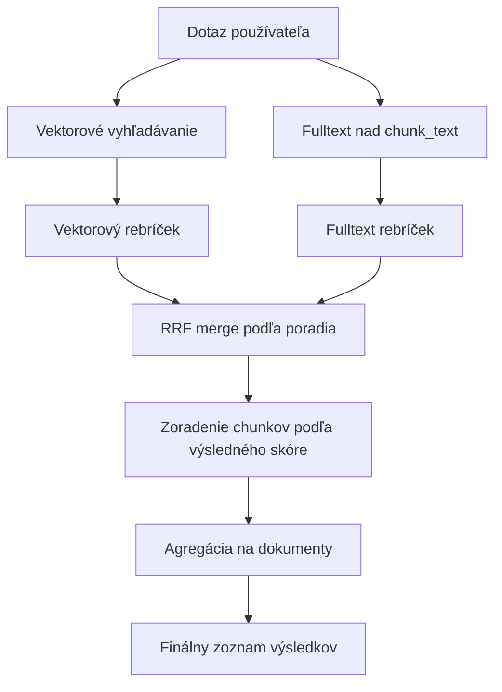
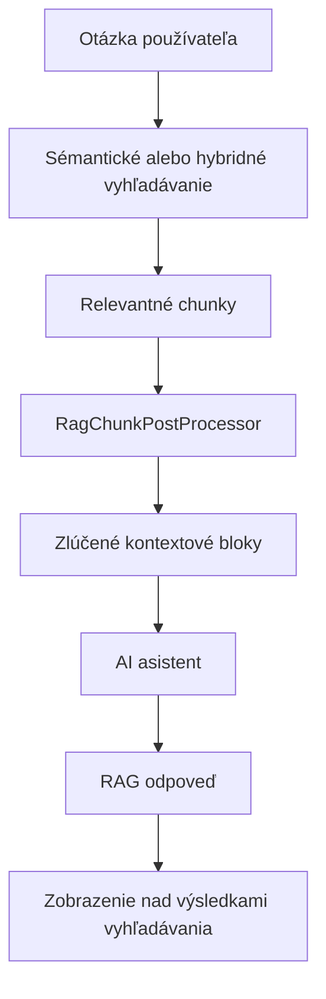

# Sémantické vyhledávání (RAG)

Sémantické vyhledávání umožňuje návštěvníkům nalézt relevantní stránky podle **významu otázky**, nejen podle shody klíčových slov. Embedding vektory ukládá do PostgreSQL s [pgvector](https://github.com/pgvector/pgvector) nebo do vestavěného úložiště [MariaDB Vector](https://mariadb.com/docs/server/reference/sql-structure/vectors/vector-overview). Vektory generují poskytovatelé podporovaní knihovnou `webjet-ai`.

Nad stejným indexem lze použít také:

- **hybridní vyhledávání** - kombinaci vektorového vyhledávání a fulltextu nad textem chunků,
- **RAG odpověď** - AI odpověď vygenerovanou pouze z nalezeného kontextu.

## Jak to funguje

Systém pracuje ve dvou hlavních fázích: indexování a online vyhledávání.

### 1. Indexování

Když je webová stránka uložena, obnovena z koše nebo smazána, listener [DocSaveEventListener](../../../../../../src/main/java/sk/iway/iwcm/rag/listener/DocSaveEventListener.java) zařadí požadavek do fronty Úloha na pozadí [RagIndexCronTask](../../../../../../src/main/java/sk/iway/iwcm/rag/service/RagIndexCronTask.java) následně zpracovává frontu přes [SemanticIndexService](../../../../../../src/main/java/sk/iway/iwcm/rag/service/SemanticIndexService.java).

Proces indexování:

1. **Extrakce obsahu** - z `DocDetails` se získá čistý text bez HTML značek přes [DocDetailsContentExtractor](../../../../../../src/main/java/sk/iway/iwcm/rag/indexing/DocDetailsContentExtractor.
2. **Rozdělení na části** - text se rozdělí pomocí [SlidingWindowChunker](../../../../../../src/main/java/sk/iway/iwcm/rag/indexing/SlidingWindowChunker.java). Používají se konfigurační proměnné `ragEmbeddingChunkSize` a `ragEmbeddingChunkOverlap`.
3. **Opětovné použití embeddingů** - pro každý chunk se vypočítá hash. Pokud se text chunku nezměnil a existuje embedding se stejným poskytovatelem, modelem a správnou dimenzí, použije se existující vektor.
4. **Generování embeddingů** - nové nebo změněné chunky zpracuje [EmbeddingService](../../../../../../src/main/java/sk/iway/iwcm/rag/embedding/EmbeddingService.java) podle poskytovatele a modelu nastaveného v .
5. **Uložení do databáze** - metadata chunků se ukládají přes JPA repozitář [EmbeddingChunkRepository](../../../../../../src/main/java/sk/iway/iwcm/rag/vectorjpa/EmbeddingChunkRepository. Zvolená implementace [VectorStore](../../../../../../src/main/java/sk/iway/iwcm/rag/vectorstore/VectorStore.java) uloží vektory pomocí nativního SQL pro konkrétní databázi.

Chunking preferuje přirozené hranice textu: odstavec, řádek, větu, mezeru a teprve potom tvrdé rozdělení podle limitu. U desetinných čísel se tečka nepovažuje za konec věty.

### 2. Vyhledávání

Když návštěvník zadá vyhledávací dotaz:

1. [SearchAction](../../../../../../src/main/java/sk/iway/iwcm/doc/SearchAction.java) určí typ vyhledávání z parametru aplikace `searchType`. Při hodnotě `auto` nebo prázdné hodnotě použije globální konfigurační proměnnou `searchType`.
2. Při hodnotě `semantic` nebo `hybrid` se použije [SemanticSearchAction](../../../../../../src/main/java/sk/iway/iwcm/doc/SemanticSearchAction.java).
3. [SemanticSearchService](../../../../../../src/main/java/sk/iway/iwcm/rag/search/SemanticSearchService.java) vygeneruje embedding dotazu podle asistenta `RAG-EMB-SEARCH` s typem vstupu `QUERY` a vyhledá nejblíže . Při indexování se používá typ `DOCUMENT` ; poskytovatel tak může pro oba typy aplikovat rozdílné prefixy požadované modelem.
4. Výsledky se omezí podle domény, jazyka, typu entity a podle složek zvolených v aplikaci **Vyhledávání**.
5. Pokud je povolen hybridní režim, spustí se i fulltext nad `rag_embedding_chunks.chunk_text` a výsledky se spojí přes `RRF` (Reciprocal Rank Fusion).
6. Výsledné chunky se agregují na dokumenty a dokumenty se zobrazí stejným způsobem jako při standardním vyhledávání.
7. Pokud je povolena RAG odpověď, z nalezených chunků se ještě připraví kontext pro AI odpověď.

### Rozdělení odpovědností mezi WebJET CMS a `webjet-ai`

Jádro embedding logiky bylo vyčleněno z WebJET CMS do samostatné, od frameworku nezávislé knihovny [webjet-ai](https://github.com/webjetcms/webjet-ai). Knihovna obsahuje poskytovatelsky nezávislé typy `EmbeddingRequest`, `EmbeddingOptions`, `EmbeddingResponse` a `EmbeddingVector`, volání `AiClient.embed` a implementace komunikace s jednotlivými poskytovateli. Původní CMS rozhraní `EmbeddingProvider` a implementace `OpenAiEmbeddingProvider` byly odstraněny.

V CMS zůstal tenký adaptér [EmbeddingService](../../../../../../src/main/java/sk/iway/iwcm/rag/embedding/EmbeddingService.java), který provede nastavení systémového AI asistenta a domény na požadavek knihovny, předá konfiguraci Extrakce obsahu, chunking, opětovné použití vektorů podle hash hodnoty, evidence tokenů, zpracování fronty a ukládání vektorů zůstávají ve správě WebJET CMS.

Při přidání nového serverového poskytovatele se proto embedding komunikace neimplementuje v RAG modulu CMS. Poskytovatel musí podporovat metodu `AiProvider.embed` v knihovně `webjet-ai` a být zaregistrován v CMS podle postupu v části [Přidání poskytovatele](../../ai/assistants/README.md).

## Požadavky

- **Vektorová databáze** - PostgreSQL s rozšířením pgvector nebo MariaDB s nativní podporou vektorů podle následujícího přehledu. Stačí jedna z těchto možností.
- **Konfigurace zvoleného poskytovatele** - pro externí službu se používá stejný API klíč jako pro AI asistenty. `ai_openAiAuthKey` pro OpenAI. Lokální embeddingový model namísto klíče vyžaduje cestu k modelovému balíku.
- **Připojení k databázi** - explicitně nastavený datasource `rag_jpa` má přednost; pokud není nastaven, použije se primární datasource `iwcm`. Pokud primární databáze není podporovaným vektorovým úložištěm, nastavte samostatnou podporovanou databázi přes `rag_jpa`.

### Podporované databáze a verze

| Databáze | Minimální požadavek | Doporučené nasazení | Výhody a omezení |
| --- | --- | --- | --- |
| **PostgreSQL + pgvector** | **PostgreSQL 16+** a kompatibilní rozšíření **pgvector s HNSW** (od **0.5.0**). | **PostgreSQL 18** a aktuální opravná verze **pgvector 0.8.x** (při přípravě dokumentace **0.8.6**). Vývojové Docker Compose profily používají obraz `pgvector/pgvector:pg18-trixie`. | WebJET podporuje `cosine`, `l2` i `inner_product`. Rozšíření musí být nainstalováno na serveru a aktivováno v databázi určené pro RAG. |
| **MariaDB Vector** | **MariaDB 11.8 LTS nebo novější**. | V řadě 11.8 používejte **11.8.9 nebo novější opravnou verzi** ; vývojový Dockerfile používá `mariadb:11.8.9`. Alternativou je aktuální opravná verze **12.3 LTS**. | Nativní typ `VECTOR` a vektorový index bez instalace rozšíření. WebJET podporuje `cosine` a `l2` ; `inner_product` není podporován. |

Minimum PostgreSQL 16 vychází ze [základních požadavků WebJET CMS](../../../../install/setup/README.md#základní-požadavky-na-server). Verze **pgvector 0.5.0** je funkční minimum pro `HNSW` index, který WebJET vytváří; rozšíření musí zároveň podporovat zvolenou verzi PostgreSQL. Pro **PostgreSQL 18** je třeba **pgvector 0.8.1 nebo novější**, doporučujeme však aktuální opravy. Řada pgvector 0.8 přinesla i zlepšení výkonu `HNSW` a plánování dotazů s filtry. Podrobnosti jsou v [přehledu změn pgvector](https://github.com/pgvector/pgvector/blob/master/CHANGELOG.md).

U MariaDB se uvedené verze vztahují na **Community Server** používaný ve vývojovém Docker kontejneru. Nativní vektory přibyly již v 11.7, ale minimum WebJETu je **11.8**, první LTS řada s touto funkcí. Všechny vektorové funkce používané WebJETem jsou dostupné v 11.8; přechod na 12.x není podmínkou sémantického vyhledávání. Viz [přehled MariaDB Vector](https://mariadb.com/docs/server/reference/sql-structure/vectors/vector-overview).

Při výběru verze MariaDB zohledněte:

- **11.8 LTS** - základ pro širší kompatibilitu klientů. Používejte aktuální opravy: verze [11.8.3](https://mariadb.com/docs/release-notes/community-server/11.8/11.8.3) opravila poškození vektorového indexu při rollback příkazu v transakci a [11.8.9](https://mariadb.com/docs/release-notes/community-server/11.8/11.8.9) opravila zhoršení úspěšnosti nalezení nejbližších výsledků při načtení cosine indexu z disku.
- **12.1 a novější** - obsahují [optimalizaci výpočtu vzdáleností pomocí extrapolace](https://jira.mariadb.org/browse/MDEV-36205). Databáze automaticky využije část vektoru k vyřazení slabých kandidátů, pokud jsou k tomu embeddingy vhodné, například u Matryoshka modelů.
- **12.3 LTS** - doporučená volba z řady 12.x pro nová nebo výkonově náročnější nasazení. Obsahuje uvedenou optimalizaci bez potřeby měnit SQL, schéma nebo konfiguraci indexu. MariaDB v [benchmark oproti 11.8](https://mariadb.com/resources/blog/mariadb-12-3-faster-vector-search-with-matryoshka-optimization/) uvádí až o 30 % více dotazů za sekundu při stejném recall, tedy stejné úspěšnosti nalezení nejbližších výsledků. Výsledek závisí na datech a embeddingovém modelu; nejde o změřené zrychlení celého vyhledávání ve WebJETu.

Podle [politiky údržby MariaDB](https://mariadb.org/about/#maintenance-policy) má Community řadu 11.8 údržbu do **4. června 2028** a řada 12.3 do **12. června 2029**. U stávající podporované PostgreSQL nebo MariaDB můžete ponechat stejný databázový server i pro RAG; u ostatních databází použijte samostatné vektorové úložiště.

### Příprava rozšíření pgvector

Na PostgreSQL serveru musí správce nejprve nainstalovat balík **pgvector kompatibilní s hlavní verzí serveru**. Samotná instalace PostgreSQL nestačí. Při inicializaci WebJET provede `CREATE EXTENSION IF NOT EXISTS vector` ; pokud aplikační uživatel nemá oprávnění vytvořit rozšíření, správce jej musí předem aktivovat v databázi používané přes `rag_jpa` nebo `iwcm`:

```sql
CREATE EXTENSION IF NOT EXISTS vector;
```

Verzi serveru a aktivovaného rozšíření ověříte ve stejné databázi:

```sql
SELECT version();
SELECT extversion FROM pg_extension WHERE extname = 'vector';
```

Prázdný výsledek druhého dotazu znamená, že rozšíření není v této databázi aktivováno. Aktualizace balíku na serveru sama neaktualizuje aktivované rozšíření; správce provede také `ALTER EXTENSION vector UPDATE`. Uživatel WebJETu musí mít oprávnění k vytváření a úpravě RAG tabulek a indexů. Postup instalace a aktualizace je v [dokumentaci pgvector](https://github.com/pgvector/pgvector#installation).

### PostgreSQL jako primární databáze

Vývojový profil PostgreSQL definuje samostatný datasource `rag_jpa`, který směřuje do stejné databáze jako primární datasource `iwcm`.

Datasource `rag_jpa` musí být nastaven jako v případě [poolman-docker-pgsql.xml](../../../../../../src/main/resources/poolman-docker-pgsql.xml). Pokud používáte více schémat, parametr JDBC `currentSchema` musí obsahovat schéma s RAG tabulkami i schéma s funkcemi WebJET CMS, například `currentSchema=public,webjet_cms`.

### MariaDB jako primární databáze

MariaDB 11.8 nebo novější používá vestavěný typ `VECTOR` bez rozšíření. Stejně jako profil PostgreSQL, i [poolman-docker-mariadb.xml](../../../../../../src/main/resources/poolman-docker-mariadb.xml) definuje samostatný datasource `rag_jpa`, který směřuje do stejné databáze jako @@CODE_ Toto druhé spojení ponechte v obou profilech, aby bylo možné nezávisle změnit jeho ovladač, URL a přihlašovací údaje na jinou vektorovou databázi MariaDB nebo PostgreSQL.

MariaDB podporuje metriky vzdálenosti `cosine` a `l2`. Metriku `inner_product` podporuje pouze PostgreSQL/pgvector; její nastavení na MariaDB vypne vektorové úložiště bez změny stávajícího indexu nebo dat.

### Samostatná vektorová databáze

Pokud primární databáze není podporována, nastavte samostatnou podporovanou PostgreSQL nebo MariaDB databázi jako datasource `rag_jpa`. Explicitní datasource lze použít také k oddělení vektorového úložiště od podporované primární databáze.

Pro lokální vývoj je připraven soubor [.devcontainer/db/docker-compose-rag-pgsql.yml](../../../../../../.devcontainer/db/docker-compose-rag-pgsql.yml):

```bash
docker compose -f .devcontainer/db/docker-compose-rag-pgsql.yml up -d
```

Příklady datasource konfigurace:

- [poolman-docker-mssql.xml](../../../../../../src/main/resources/poolman-docker-mssql.xml)
- [poolman-docker-oracle.xml](../../../../../../src/main/resources/poolman-docker-oracle.xml)

## Konfigurace

Aktivace a nastavení se provádí v [Konfiguraci](../../../../admin/setup/configuration/README.md).

### Základní nastavení

| Proměnná | Výchozí hodnota | Popis |
| --- | --- | --- |
| `ragSemanticSearchEnabled` | `false` | Zapne sémantické vyhledávání nad úložištěm PostgreSQL/pgvector nebo MariaDB Vector. |
| `searchType` | `db` | Globální typ vyhledávání: `db`, `lucene`, `semantic`, `hybrid`. |
| `luceneAsDefaultSearch` | `false` | Pokud je `true`, Lucene má vyšší prioritu než `searchType`. |

!> Pro aktivaci sémantického vyhledávání nastavte `ragSemanticSearchEnabled=true` a použijte `searchType=semantic` nebo `searchType=hybrid`. Typ vyhledávání lze také přepsat lokálně v aplikaci **Vyhledávání**.

### Embedding a indexování

| Proměnná | Výchozí hodnota | Popis |
| --- | --- | --- |
| `ragEmbeddingProvider` | `openai` | Poskytovatel použit pouze při automatickém vytvoření chybějícího embedding asistenta. Vestavěné externí hodnoty jsou `openai`, `gemini`, `openrouter` ; lokální model vyberte přímo v systémových asistentech. Použít lze i identifikátor správně zaregistrovaného vlastního poskytovatele. |
| `ragEmbeddingModel` | `text-embedding-3-small` | Model použitý pouze při automatickém vytvoření chybějícího embedding asistenta. |
| `ragEmbeddingDimensions` | `1536` | Globální počet dimenzí vektoru pro celou instalaci. Musí odpovídat použitému modelu a databázové tabulce. |
| `ai_localEmbeddingModelBundlePath` | prázdná hodnota | Cesta ke globálnímu schválenému ZIP balíku lokálního modelu `intfloat/multilingual-e5-base`: absolutní cesta na serveru nebo cesta začínající `/WEB-INF/` vůči kořenu nasazené aplikace. Po změně je zapotřebí restart. |
| `ragEmbeddingChunkSize` | `1000` | Maximální velikost jedné části textu ve znacích. |
| `ragEmbeddingChunkOverlap` | `200` | Počet znaků, o které se sousední chunky překrývají. |

Systém podle potřeby automaticky vytvoří dva systémové AI asistenty:

- `RAG-EMB-INDEX` ve skupině `90-embedding-indexing` - generování embeddingů při indexování,
- `RAG-EMB-SEARCH` ve skupině `91-embedding-search` - generování embeddingu vyhledávacího dotazu.

Pokud asistent již existuje, jeho `provider` a `model` mají přednost před konfiguračními proměnnými `ragEmbeddingProvider` a `ragEmbeddingModel`. Asistenty lze upravit v administraci v sekci **Nastavení → AI asistenti**. Poskytovatel a model indexovacího asistenta se po otevření stránky **Sémantický index** zobrazí v informačním oznámení.

Indexy jsou odděleny kombinací poskytovatele a modelu. Opětovné indexování nahradí pouze data aktuální kombinace, takže například OpenAI a Gemini index téže stránky mohou existovat současně. Náhled indexování počítá pouze indexy aktuálního asistenta; náhled odstranění a odstranění stránky pracují se všemi kombinacemi.

Fronta `rag_index_queue` ukládá pouze typ entity, ID a akci. Poskytovatel a model se načtou z asistenta `RAG-EMB-INDEX` až při zpracování položky. Pokud potřebujete dokončit indexování původní kombinací, nechte před změnou asistenta fronty zcela zpracovat.

!>**Upozornění:** Indexovací a vyhledávací asistent musí používat stejný identifikátor poskytovatele a modelu. Vyhledávání načte pouze indexy, jejichž obě hodnoty se přesně shodují s asistentem `RAG-EMB-SEARCH`.

!>**Upozornění:** Starší názvy `ragChunkSize` a `ragChunkOverlap` se již nepoužívají.

!>**Upozornění:** Při změně `ragEmbeddingDimensions` se vymažou všechna data z `rag_embedding_chunks` pro všechny poskytovatele a modely, upraví se vektorový typ pro zvolenou databázi a znovu se vytvoří `HNSW` index. Následně spusťte úplné indexování obsahu. Samotná změna modelu ostatní kombinace nevymaže, ale novou kombinaci musíte zaindexovat. Změna datasource nebo typu vektorové databáze stávající vektory nemigruje; po změně spusťte úplné indexování.

!>**Společná dimenze:** Všechny domény sdílejí jedno vektorové schéma a musí používat stejnou globální hodnotu `ragEmbeddingDimensions`. Odlišné doménové nastavení zablokuje sémantické vyhledávání a indexování pro danou doménu; stránka **Sémantický index** zobrazí chybu. Automatická inicializace MariaDB při nesouladu dimenzí zachová existující data. Chcete-li změnit společnou dimenzi, uložte globální nastavení v **Konfiguraci** — tím se vymažou embeddingy všech domén — a poté spusťte úplné indexování všech domén.

### Lokální embeddingový model

Vestavěný lokální poskytovatel používá model `intfloat/multilingual-e5-base` s `768` dimenzemi. Postup nastavení:

1. Z kořenové složky projektu spusťte skript [`prepare-local-embedding-model.sh`](../../../../../../src/main/webapp/WEB-INF/webjet-ai/local/prepare-local-embedding-model.sh). Vytvoří schválený ZIP balíček a uloží jej jako `src/main/webapp/WEB-INF/local-ai-models/multilingual-e5-base-fp32.zip`. Do `ai_localEmbeddingModelBundlePath` nastavte cestu `/WEB-INF/local-ai-models/multilingual-e5-base-fp32.zip`.
2. Nastavte globální proměnnou `ragEmbeddingDimensions` na `768`. Tato změna odstraní stávající vektory.
3. Restartujte aplikační server.
4. V asistentech `RAG-EMB-INDEX` a `RAG-EMB-SEARCH` vyberte poskytovatele **Lokální embeddingový model** a model `intfloat/multilingual-e5-base`.
5. Spusťte úplné indexování obsahu.

Modelový balíček definuje odlišné prefixy pro poptávku a dokument. [EmbeddingService](../../../../../../src/main/java/sk/iway/iwcm/rag/embedding/EmbeddingService.java) proto při indexování předá typ `DOCUMENT` a při vyhledávání typ `QUERY` ; lokální poskytovatel automaticky doplní správný prefix. Cesta k balíčku i dimenze jsou globální a nesmí se měnit podle domény.

### Vektorové vyhledávání

| Proměnná | Výchozí hodnota | Popis |
| --- | --- | --- |
| `ragSearchEfSearch` | `40` | Parametr `HNSW ef_search`. Vyšší hodnota zlepšuje recall, ale může zpomalit vyhledávání. MariaDB povoluje hodnoty od `1` do `10000` ; při neplatné hodnotě zůstane její databázová výchozí hodnota nezměněna. |
| `ragSearchDistanceMetric` | `cosine` | Metrika vzdálenosti: `cosine`, `inner_product`, `l2`. MariaDB podporuje pouze `cosine` a `l2` ; `inner_product` podporuje pouze PostgreSQL. Změna znovu vytvoří vektorový index. |
| `ragSemanticSearchMinSimilarity` | `0.2` | Minimální hodnota similarity pro výsledky. Používá se spolu s adaptivním prahem podle nejlepšího výsledku. |
| `ragSemanticSearchMinResults` | `3` | Minimální počet výsledků, které se vrátí i při přísnějším prahu similarity. |

### Hybridní vyhledávání

Hybridní vyhledávání kombinuje vektorové výsledky a fulltextové výsledky nad `rag_embedding_chunks.chunk_text`. Používá se tehdy, když je povoleno `ragHybridSearchEnabled` a režim hybridního vyhledávání není `off`.

| Proměnná | Výchozí hodnota | Popis |
| --- | --- | --- |
| `ragHybridSearchEnabled` | `true` | Globálně povolí hybridní vyhledávání. |
| `ragHybridSearchMode` | `short_query_only` | Režim: `off`, `always`, `short_query_only`, `fallback_on_low_vector`. |
| `ragHybridShortQueryMaxChars` | `12` | Maximální délka dotazu ve znacích pro režim `short_query_only`. |
| `ragHybridShortQueryMaxTerms` | `2` | Maximální počet slov dotazu pro režim `short_query_only`. |
| `ragHybridFallbackTopSimilarity` | `0.35` | Práh nejlepší vektorové similarity pro režim `fallback_on_low_vector`. |
| `ragHybridVectorWeight` | `0.7` | Váha vektorového pořadí při RRF merge. |
| `ragHybridFtsWeight` | `0.3` | Váha fulltextového pořadí při RRF merge. |
| `ragHybridRrfK` | `60` | Parametr `k` pro Reciprocal Rank Fusion. |
| `ragHybridChunkFetchMultiplír` | `3` | Násobič počtu chunků načtených oproti požadovanému počtu výsledků. |
| `ragHybridFtsUseIlikeFallback` | `true` | Pokud databázový fulltext vrátí prázdný výsledek, použije se databázově specifický fallback přes `ILIKE` nebo `LIKE`. |

V lokálním nastavení aplikace má hodnota `searchType=semantic` význam čistého vektorového vyhledávání bez hybridní větve. Hodnota `searchType=hybrid` použije hybrid, pokud je globálně povolen.


```mermaid
flowchart TD
	Q[Dotaz používateľa] --> V[Vektorové vyhľadávanie]
	Q --> F[Fulltext nad chunk_text]

	V --> VR[Vektorový rebríček]
	F --> FR[Fulltext rebríček]

	VR --> RRF[RRF merge podľa poradia]
	FR --> RRF

	RRF --> S[Zoradenie chunkov podľa výsledného skóre]
	S --> D[Agregácia na dokumenty]
	D --> O[Finálny zoznam výsledkov]
```

## RAG odpověď ve vyhledávání

RAG odpověď je volitelný doplněk sémantického nebo hybridního vyhledávání. Po nalezení relevantních chunků se připraví omezený kontext a odešle se AI asistentovi. Odpověď se zobrazí nad seznamem výsledků v JSP šabloně [search.jsp](../../../../../../src/main/webapp/components/search/search.jsp).

### Konfigurace RAG odpovědi

| Proměnná | Výchozí hodnota | Popis |
| --- | --- | --- |
| `ragAnswerAllowed` | `false` | Globálně povolí generování RAG odpovědi ve vyhledávání. |
| `ragAnswerModel` | `gpt-5.4-mini` | Výchozí model pro automaticky vytvořeného RAG asistenta. |
| `ragAnswerMinSimilarity` | `0.3` | Měkký práh similarity pro chunky vstupující do kontextu odpovědi. |
| `ragAnswerTopK` | `12` | Počet nejrelevantnějších chunků použitých před post-processingem. |
| `ragAnswerMaxChunkGap` | `1` | Maximální mezera mezi indexy chunků, které se ještě mohou sloučit. Hodnota `1` znamená sousední chunky. |
| `ragAnswerMaxBlocks` | `4` | Maximální počet sloučených kontextových bloků odeslaných modelu. |
| `ragAnswerMaxCharacters` | `6000` | Maximální celkový počet znaků kontextu. |
| `ragAnswerMaxMergedBlockCharacters` | `2200` | Maximální počet znaků jednoho sloučeného kontextového bloku. |

V aplikaci **Vyhledávání** lze tyto hodnoty přepsat lokálně. Prázdná čísla znamenají použití globální konfigurace.

### Post-processing kontextu

[RagChunkPostProcessor](../../../../../../src/main/java/sk/iway/iwcm/rag/search/RagChunkPostProcessor.java) připravuje kontext pro model:

1. seřadí chunky podle similarity a vybere top K,
2. použije adaptivní práh similarity, ale nikdy nevyhodí všechno, pokud existuje alespoň jeden použitelný výsledek,
3. seskupí chunky podle entity,
4. sloučí sousední chunky a odstraní duplicitní text z překrytí,
5. omezí počet bloků a celkový počet znaků.

Výsledkem jsou objekty [MergedContextBlock](../../../../../../src/main/java/sk/iway/iwcm/rag/search/MergedContextBlock.java), které se odesílají modelu jako JSON.

### AI asistent

[RagService](../../../../../../src/main/java/sk/iway/iwcm/rag/search/RagService.java) používá AI asistenty WebJET CMS. Není-li vybrán konkrétní asistent, systém najde nebo vytvoří výchozího asistenta:

- název: `RAG-SEARCH`,
- skupina: `92-rag-answer`,
- provider: `openai`,
- model: hodnota `ragAnswerModel`,
- třída: `sk.iway.iwcm.rag.search.RagService`.

V editoru aplikace se zobrazí také asistenti v aktuální doméně, kteří mají stejnou hodnotu `className`.

Asistent dostane backendom připravená makra:

| Makro | Hodnota |
| --- | --- |
| `{userQuestion}` | Otázka uživatele jako JSON string. |
| `{retrievedContext}` | JSON pole sloučených kontextových bloků. |

Makra `bonusParams` jsou ignorována při veřejných REST voláních asistenta a nastavují se pouze na backendu. Odpověď musí vycházet pouze z `retrievedContext`. Pokud model vrátí sentinel `CANNOT_ANSWER_QUESTION`, uživateli se zobrazí lokalizovaná fallback odpověď.


```mermaid
flowchart TD
	Q[Otázka používateľa] --> S[Sémantické alebo hybridné vyhľadávanie]
	S --> C[Relevantné chunky]
	C --> P[RagChunkPostProcessor]
	P --> B[Zlúčené kontextové bloky]
	B --> A[AI asistent]
	A --> R[RAG odpoveď]
	R --> JSP[Zobrazenie nad výsledkami vyhľadávania]
```

## Používání v šablonách

Sémantické vyhledávání se aktivuje vložením aplikace **Vyhledávání** do stránky. Typ vyhledávání lze nastavit globálně nebo přímo v parametru aplikace.

Globální nastavení:

```properties
ragSemanticSearchEnabled=true
searchType=semantic
```

Příklad lokálního nastavení aplikace:

```html
!INCLUDE(/components/search/search.jsp, searchType=hybrid, answerAllowed=trueValue)!
```

Vybrané parametry aplikace:

| Parametr | Hodnoty | Popis |
| --- | --- | --- |
| `searchType` | `auto`, `db`, `lucene`, `semantic`, `hybrid` | Typ vyhledávání pro konkrétní aplikaci. |
| `answerAllowed` | `auto`, `trueValue`, `falseValue` | Lokální zapnutí nebo vypnutí RAG odpovědi. |
| `semanticSearchMinSimilarity` | číslo | Lokální hodnota `ragSemanticSearchMinSimilarity`. |
| `semanticSearchMinResults` | číslo | Lokální hodnota `ragSemanticSearchMinResults`. |
| `hybridSearchMode` | `auto`, `off`, `always`, `short_query_only`, `fallback_on_low_vector` | Lokální režim hybridního vyhledávání. |
| `hybridFtsUseIlikeFallback` | `auto`, `trueValue`, `falseValue` | Lokální fallback pro fulltext. |
| `ragAssistantId` | ID asistenta nebo `-1` | Výběr asistenta pro RAG odpověď. |

## Automatické indexování

Systém automaticky zařadí stránku do indexovací fronty při její:

- **uložení** - vytvoření nebo úprava stránky,
- **obnovení z koše** - stránka se znovu indexuje,
- **smazání** - embeddingy se odstraní z vektorové databáze.

Manuální indexování v administraci pracuje pouze se stránkami, které jsou povoleny pro vyhledávání.

Manuální indexování a odstranění indexu kontroluje právo uživatele na zvolenou složku i příslušnost k aktuální doméně. Pokud se indexovaná stránka mezi zařazením do fronty a jejím zpracováním odstraní nebo přesune do jiné domény, služba odstraní zastaralé embeddingy z původní domény.

## Automatizované úkoly

Frontu zpracovává automatizovaná úloha [cs.iway.iwcm.rag.service.RagIndexCronTask](../../../../../../src/main/java/sk/iway/iwcm/rag/service/RagIndexCronTask.java). Doporučené nastavení je spouštění každých 5 minut.

Cron úloha je bezpečná vůči souběžnému spuštění. Při běhu se nastaví příznak v cache s platností 60 minut a při pomalejším zpracování se jeho platnost obnovuje. Zpracované položky se z fronty vymažou dávkově; při chybě mazání se použije mazání po řádcích. Chyby při indexování konkrétní stránky se uloží jako stav **ERROR** v tabulce chunků. Pokud selhání zpracování položky ještě na úrovni fronty, položka zůstane ve frontě a znovu se zpracuje při dalším běhu.

## Databázové schéma

Systém vždy vytváří tabulky `rag_index_queue` a `rag_embedding_chunks`. V MariaDB vytvoří také pomocnou tabulku `rag_embedding_vectors`.

### `rag_index_queue`

Fronta pro asynchronní indexování. Prováděno třídou [IndexQueueEntity](../../../../../../src/main/java/sk/iway/iwcm/rag/jpa/IndexQueueEntity.java).

### `rag_embedding_chunks`

Uložená metadata chunků a v PostgreSQL také embedding vektory. Implementováno třídou [EmbeddingChunkEntity](../../../../../../src/main/java/sk/iway/iwcm/rag/vectorjpa/EmbeddingChunkEntity.java).

Důležité sloupce:

- `entity_type`, `entity_id`, `chunk_index` - identifikace zdrojové entity a pořadí chunku.
- `chunk_text` - ​​text použitý pro embedding a fulltext.
- `content_hash` - ​​hash textu chunku pro opětovné použití embeddingu.
- `embedding` - ​​sloupec typu pgvector `vector(N)`, který se používá pouze v PostgreSQL.
- `embedding_provider`, `embedding_model`, `dimensions` - poskytovatel, model a dimenze embeddingu.
- `language`, `domain_id` - jazyk a doména.
- `group_id`, `root_group_l1`, `root_group_l2`, `root_group_l3` - optimalizované filtrování dokumentů podle složek.
- `status`, `error_message` - stav zpracování.

### `rag_embedding_vectors`

Pomocná tabulka pouze pro MariaDB obsahuje povinnou hodnotu `embedding VECTOR(N) NOT NULL` pro každý úspěšně zaindexovaný chunk. `chunk_id` je primární i cizí klíč na `rag_embedding_chunks.id` s kaskádovým odstraněním. Toto oddělení umožňuje zachovat chybové řádky metadat bez vektoru a zároveň splnit požadavek MariaDB na vektorový index.

!>**Upozornění:** Vektorové sloupce nejsou mapovány přes JPA. Všechny operace s vektory probíhají přes databázově specifické implementace nativního SQL rozhraní [VectorStore](../../../../../../src/main/java/sk/iway/iwcm/rag/vectorstore/VectorStore.java).

Při migraci schématu se doplní chybějící sloupce `group_id`, `root_group_l1..3` a `embedding_provider`. Hodnoty složek se zpětně doplní pro stávající záznamy platných webových stránek. Prázdný `embedding_provider` se nastaví na aktuální hodnotu `ragEmbeddingProvider` a unikátnost chunku se rozšíří o kombinaci poskytovatele a modelu. Jelikož starší záznam neobsahoval poskytovatele, doplněná hodnota nemusí odpovídat poskytovateli, který vektor skutečně vytvořil. Po aktualizaci proto spusťte úplné indexování; obnoví se tím i záznamy, které nebylo možné zpětně přiřadit ke stránce.

## Doporučení pro český a slovenský obsah

Výchozí hodnoty (`text-embedding-3-small`, `ragEmbeddingChunkSize=1000`, `ragEmbeddingChunkOverlap=200`) jsou vyvážený kompromis mezi cenou, rychlostí a přesností pro běžné webové stránky v češtině a češtině.

Při ladění se řiďte těmito doporučeními:

- **Velikost části (`ragEmbeddingChunkSize`)** - pro webové stránky v SK/CZ je vhodný rozsah **800-1 200 znaků**. U kratších částí se ztrácí kontext odstavce, u delších klesá přesnost výběru konkrétní pasáže.
- **Překryv (`ragEmbeddingChunkOverlap`)** - udržujte poměr **15-25 %** z `ragEmbeddingChunkSize`. Překryv zabraňuje ztrátě kontextu na hranicích mezi částmi.
- **Limit modelu** - modely `text-embedding-3-*` zvládnou Max. 8 191 tokenů na jeden vstup. U češtiny a češtiny je to s rezervou přibližně 6 000 znaků.
- **Vyhodnocení kvality** - připravte si 10-20 reprezentativních otázek v slovenštině nebo češtině a porovnávejte TOP-5 výsledky při různých nastaveních.

## Alternativní embedding modely

Výchozí model `text-embedding-3-small` je vícejazyčný a češtinu/češtinu zvládá v dostatečné kvalitě pro většinu webových projektů. Pokud požadujete vyšší přesnost, k dispozici jsou tyto alternativy:

| Model | Model asistenta | `ragEmbeddingDimensions` | Kvalita pro SK/CZ | Poznámka |
| --- | --- | --- | --- | --- |
| OpenAI `text-embedding-3-small` | `text-embedding-3-small` | `1536` | Dobrá | Výchozí model - levný a rychlý. |
| OpenAI `text-embedding-3-large` | `text-embedding-3-large` | `3072` | Vysoká | Nejpřesnější OpenAI vícejazyčný model, dražší než `small`. |
| OpenAI `text-embedding-3-large` zkrácený | `text-embedding-3-large` | `1024` nebo `1536` | Vysoká | Díky MRL lze vektor zkrátit bez výrazné ztráty kvality. |
| Lokální `intfloat/multilingual-e5-base` | `intfloat/multilingual-e5-base` | `768` | Dobrá | Běží lokálně bez odesílání obsahu externí službě; vyžaduje schválený modelový balíček. |

!>**Upozornění:** Všechny vektory ve zvoleném vektorovém úložišti musí používat nakonfigurovanou dimenzi. Různí poskytovatelé a modely mohou existovat současně, ale musí generovat stejný počet dimenzí. Změna dimenze odstraní všechny stávající vektory a vyžaduje úplné indexování obsahu.

### Co je Matryoshka (MRL)

Modely `text-embedding-3-small` i `text-embedding-3-large` jsou trénovány technikou `Matryoshka Representation Learning`. Nejdůležitější informace jsou soustředěny na začátku vektoru, takže vektor lze bezpečně zkrátit, například použít pouze prvních 1024 nebo 1536 hodnot z 3072.

V praxi to znamená, že můžete použít kvalitnější `text-embedding-3-large`, ale výstup si nechat vrátit například v 1536 dimenzích. Získáte vyšší přesnost než `small@1536` při stejné velikosti tabulky i podobné rychlosti vyhledávání.
