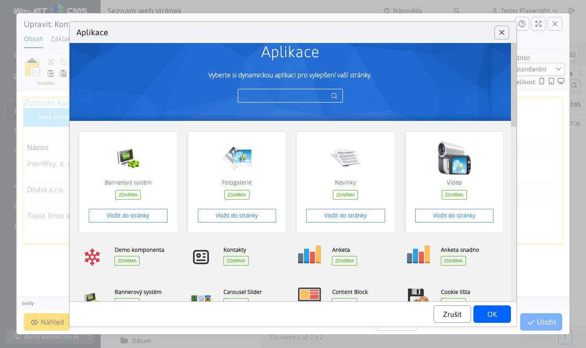
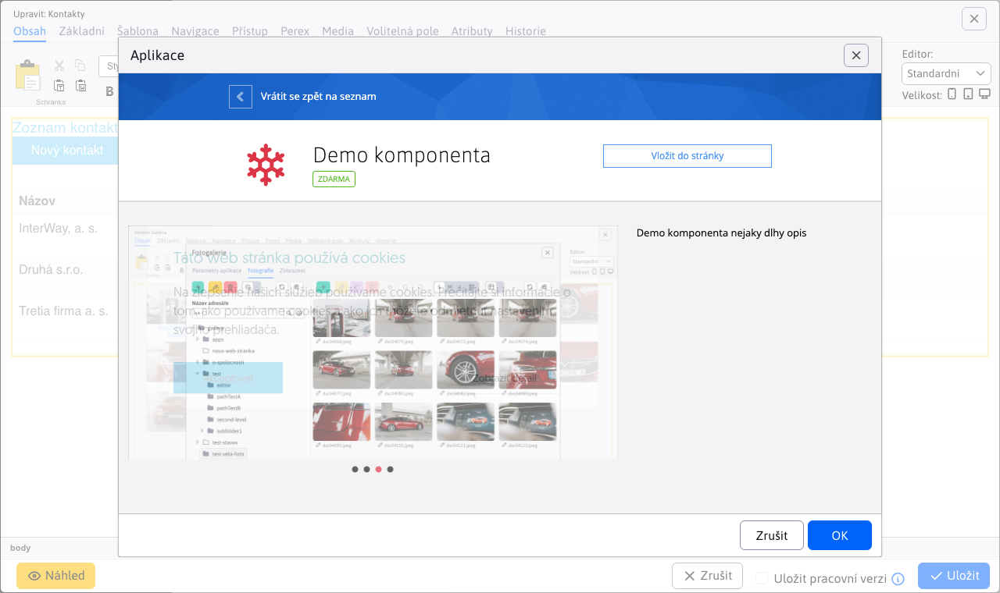
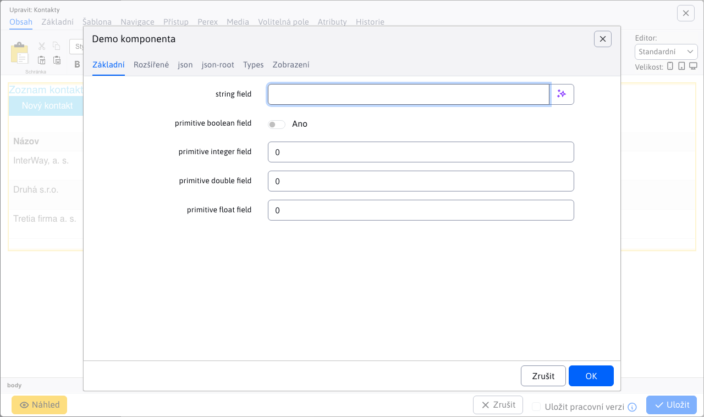
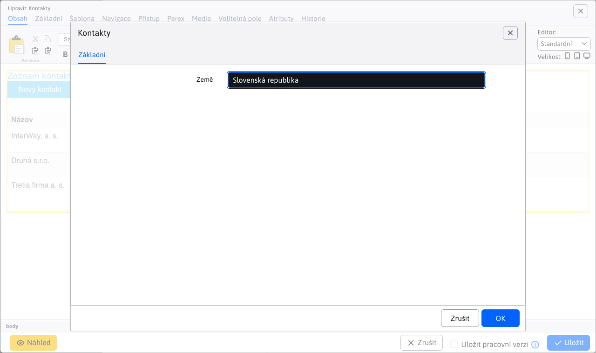
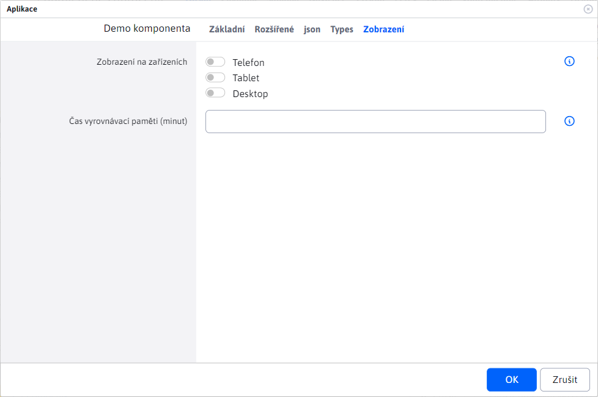
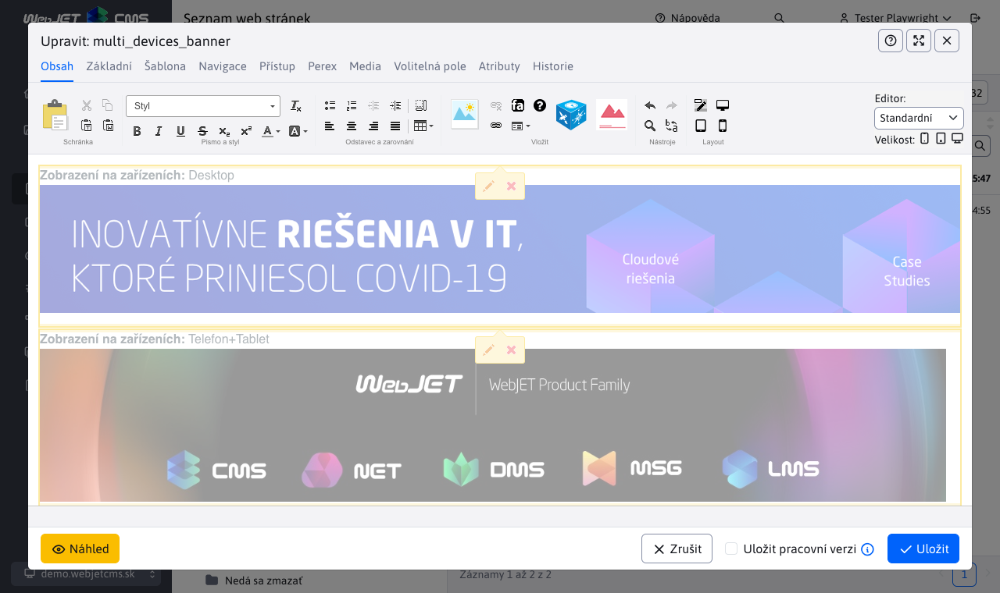

# Zobrazení v seznamu aplikací

Pokud jste aplikaci vytvořili, můžete ji jednoduše zobrazit v seznamu aplikací v editoru. Na obrázku vidíte aplikaci Kontakty a komponentu Demo, což jsou aplikace pro WebJET napsané v jazyce. [Spring](../spring-mvc/README.md).



<div class="video-container">
  <iframe width="560" height="315" src="https://www.youtube.com/embed/2r6-0zk5ZNQ" title="Přehrávač videí YouTube" frameborder="0" allow="accelerometer; autoplay; clipboard-write; encrypted-media; gyroscope; picture-in-picture" allowfullscreen></iframe>
</div>

## Použití anotace

Aby se aplikace v seznamu objevila, musí mít její třída anotaci. `@WebjetAppStore`, příklady:

```java
@WebjetComponent("sk.iway.demo8.DemoComponent")
@WebjetAppStore(nameKey = "Demo komponenta", descKey = "Demo komponenta nejaky dlhy opis", imagePath = "ti ti-snowflake text-danger", galleryImages = "/components/map/screenshot-1.jpg,/components/gdpr/screenshot-2.png,/components/gallery/screenshot-3.jpg")
public class DemoComponent extends WebjetComponentAbstract {
	...
}

@WebjetComponent("sk.iway.basecms.contact.ContactApp")
@WebjetAppStore(nameKey = "Kontakty", descKey = "Ukazkova aplikacia so zoznamom kontaktov", imagePath = "ti ti-id", galleryImages = "/components/map/screenshot-1.jpg,/components/gdpr/screenshot-2.png,/components/gallery/screenshot-3.jpg")
public class ContactApp extends WebjetComponentAbstract {
	...
}
```

Anotace má následující parametry:
- `nameKey` - překladatelský klíč **název aplikace** (v příkladech je to přímo text, ale doporučujeme použít překladový klíč), např. `components.DemoComponent.title`.
- `descKey` - překladatelský klíč **popis aplikace**, pokud není zadán, použije se překladový klíč zadaný jako `nameKey.desc` (pokud `nameKey` končí na adrese `.title` se nahrazuje `.title` Pro `.desc`).
- `imagePath` - cesta k obrázku **ikony** Použití. Může to být soubor nebo třída CSS pro ikonu. [TablerIcons](https://tabler.io/icons) Stejně jako `ti ti-meno-ikony`.
- `galleryImages` - seznam obrázků oddělených čárkou, které se objeví v popisu aplikace, např. `/components/map/screenshot-1.jpg,/components/gdpr/screenshot-2.png`.
- `componentPath` - seznam souborů JSP oddělených čárkou, pro které se má aplikace zobrazit (pokud se nejedná o aplikaci Spring), například `/components/search/search.jsp,/components/search/lucene_search.jsp`. První soubor JSP se použije při vkládání nové aplikace.
- `domainName` - pokud máte instalaci s více doménami, můžete aplikaci omezit na zobrazení pouze v zadané doméně. Můžete zadat více domén oddělených čárkou.
- `commonSettings` - Parametr, který určuje, zda se v editoru aplikace zobrazí karta Zobrazení společných nastavení. Výchozí hodnota je `true`, takže se karta zobrazí.
- `custom` - nastavit na `true` pro vaše zákaznické aplikace. Automaticky se přizpůsobí podle toho, zda je v balení. `sk.iway.iwcm`. Zákaznické aplikace jsou v seznamu aplikací na začátku seznamu.



Anotace se hledá v následujících balíčcích (včetně podbalíčků):
- `sk.iway.iwcm` - standardní aplikace WebJET CMS.
- `sk.iway.INSTALL_NAME` - aplikace podle názvu instalace (konf. proměnná `installName`), měli byste zde mít standardní zákaznické aplikace.
- `sk.iway.LOG_INSTALL_NAME` - aplikace podle názvu protokolu instalace (konf. proměnná `logInstallName`), používá se v případě, že máte zákaznickou aplikaci, ale nasazenou ve více variantách nebo prostředích.
- balíčky definované v proměnné conf. `springAddPackages` - dodatečné balíčky pro aplikace Spring, které se používají, pokud je aplikace naprogramována mimo WebJET CMS nebo používá jiný prefix než WebJET CMS. `sk.iway`.

Aplikace s balíčkem začínajícím na `sk.iway.iwcm` jsou umístěny na konci seznamu žádostí, ostatní jsou umístěny na začátku. Předpokládá se, že chcete, aby se zákaznické aplikace zobrazovaly na začátku seznamu aplikací.

Pokud chcete aplikaci umístit také do seznamu propagačních akcí (na začátek), upravte proměnnou conf. `appstorePromo`, který obsahuje seznam propagačních klíčů aplikací.

!>**Varování:** aplikace je vložena do stránky jako `@Scope(value = WebApplicationContext.SCOPE_REQUEST, proxyMode = ScopedProxyMode.TARGET_CLASS)` pokud se na stránce vyskytuje vícekrát, je třída znovu použita a její atributy a proměnné jsou zachovány během provádění požadavku HTTP.

## Parametry aplikace

Každá aplikace může mít nastavitelné parametry. Ty jsou definovány přímo ve třídě jako její atributy:

```java

@WebjetComponent("sk.iway.demo8.DemoComponent")
@WebjetAppStore(nameKey = "Demo komponenta", descKey = "Demo komponenta nejaky dlhy opis", imagePath = "fti ti-snowflake text-danger", galleryImages = "/components/map/screenshot-1.jpg,/components/gdpr/screenshot-2.png,/components/gallery/screenshot-3.jpg")
public class DemoComponent extends WebjetComponentAbstract {

	private String stringField;
	private Boolean booleanField;
	private Float floatField;
	...

}
```

tyto atributy jsou spojeny se značkou `!INCLUDE(... stringField=hodnota, booleanField=false)!` a používají se pro [Parametrizace zobrazení aplikace](../spring-mvc/README.md#pomocí-parametrů-aplikace).

WebJET podporuje zobrazení nastavení parametrů v dialogovém okně pomocí `@DataTableColumn` anotace a také pro [standardní editor datových souborů](../../developer/datatables-editor/datatable-columns.md). Podporovány jsou také karty s atributem `tab` Anotace. Klíč překladu s názvem `editor.tab.MENO`.

Kromě primitivních/základních datových typů a `java.util.Date` konverze objektů typu `DocDetails/GroupDetails` včetně `List` pomocí typu pole `DataTableColumnType.JSON`.

Příklad použití:



```java
package sk.iway.demo8;

import org.springframework.ui.Model;

import lombok.Getter;
import lombok.Setter;
import sk.iway.iwcm.Logger;
import sk.iway.iwcm.components.WebjetComponentAbstract;
import sk.iway.iwcm.doc.DocDetails;
import sk.iway.iwcm.doc.GroupDetails;
import sk.iway.iwcm.system.annotations.DefaultHandler;
import sk.iway.iwcm.system.annotations.WebjetAppStore;
import sk.iway.iwcm.system.annotations.WebjetComponent;
import sk.iway.iwcm.system.datatable.DataTableColumnType;
import sk.iway.iwcm.system.datatable.annotations.DataTableColumn;

import java.math.BigDecimal;
import java.util.Date;
import java.util.List;

@WebjetComponent("sk.iway.demo8.DemoComponent")
@WebjetAppStore(nameKey = "Demo komponenta", descKey = "Demo komponenta nejaky dlhy opis", imagePath = "ti ti-snowflake text-danger", galleryImages = "/components/map/screenshot-1.jpg,/components/gdpr/screenshot-2.png,/components/gallery/screenshot-3.jpg")
@Getter
@Setter
public class DemoComponent extends WebjetComponentAbstract {

	@DataTableColumn(inputType = DataTableColumnType.TEXT, tab = "basic")
	private String stringField;

	@DataTableColumn(inputType = DataTableColumnType.CHECKBOX, tab = "basic")
	private boolean primitiveBooleanField;

	@DataTableColumn(inputType = DataTableColumnType.TEXT_NUMBER, tab = "basic")
	private int primitiveIntegerField;

	@DataTableColumn(inputType = DataTableColumnType.TEXT_NUMBER, tab = "basic")
	private double primitiveDoubleField;

	@DataTableColumn(inputType = DataTableColumnType.TEXT_NUMBER, tab = "basic")
	private float primitiveFloatField;


	@DataTableColumn(inputType = DataTableColumnType.TEXT_NUMBER, tab = "advanced")
	private BigDecimal bigDecimalField;

	@DataTableColumn(inputType = DataTableColumnType.CHECKBOX, tab = "advanced")
	private Boolean booleanField;

	@DataTableColumn(inputType = DataTableColumnType.TEXT_NUMBER, tab = "advanced")
	private Integer integerField;

	@DataTableColumn(inputType = DataTableColumnType.TEXT_NUMBER, tab = "advanced")
	private Double doubleField;

	@DataTableColumn(inputType = DataTableColumnType.TEXT_NUMBER, tab = "advanced")
	private Float floatField;

	@DataTableColumn(inputType = DataTableColumnType.DATETIME, title = "date", tab = "advanced")
    private Date date;


	@DataTableColumn(inputType = DataTableColumnType.JSON, title = "groupDetails", tab = "json", className = "dt-tree-group")
    private GroupDetails groupDetails;

    @DataTableColumn(inputType = DataTableColumnType.JSON, title = "docDetails", tab = "json", className = "dt-tree-page")
    private DocDetails docDetails;

    @DataTableColumn(inputType = DataTableColumnType.JSON, title = "groupDetailsList", tab = "json", className = "dt-tree-group-array")
    private List<GroupDetails> groupDetailsList;

    @DataTableColumn(inputType = DataTableColumnType.JSON, title = "docDetailsList", tab = "json", className = "dt-tree-page-array")
    private List<GroupDetails> docDetailsList;

    @DataTableColumn(inputType = DataTableColumnType.JSON, title = "dirSimple", tab = "json", className = "dt-tree-dir-simple")
    private String dirSimple;

    //select folder with root set to /images/gallery
    @DataTableColumn(inputType = DataTableColumnType.JSON, className = "dt-tree-dir-simple", title="components.gallery.dir", editor = {
        @DataTableColumnEditor(
            attr = {
                @DataTableColumnEditorAttr(key = "data-dt-field-root", value = "/images/gallery")
            }
        )
    })
    private String dir = "/images/gallery";


	@DefaultHandler
	public String render(Model model)
	{
		Logger.debug(this.getClass(), "groupDetails="+groupDetails+" docDetails="+docDetails+" groupDetailsList="+groupDetailsList+" docDetailsList="+docDetailsList+" dirSimple="+dirSimple+" date="+date);

        model.addAttribute("test", "Toto je test");
		model.addAttribute("demoComponent", this);

		return "/components/aceintegration/demo-component/view";
	}

	/**
	 * To call this method there should be URL parameter ?save (value is not important) OR page parameter !INCLUDE(... ,defaultHandler=save)!
	 * @param model
	 * @return
	 */
	public String save(Model model)
	{
		Logger.debug(this.getClass(), "groupDetails="+groupDetails+" docDetails="+docDetails+" groupDetailsList="+groupDetailsList+" docDetailsList="+docDetailsList+" dirSimple="+dirSimple+" date="+date);

        model.addAttribute("test", "This is save method");
		model.addAttribute("demoComponent", this);

		return "/components/aceintegration/demo-component/view";
	}

	@Override
	public void init()
	{
		//There should be initialization of component
		Logger.debug(this.getClass(), "DemoComponent init");
	}

	@Override
	public String getViewFolder()
	{
		return null;
	}
}
```

Ukázka kódu HTML `/components/aceintegration/demo-component/view.html`:

```html
<p>
    Demo component view, params:
    <br>
    test1: <span data-th-utext="${test}"></span>
    <br>
    stringField: <span data-th-utext="${demoComponent.stringField}"></span>
    <br>
    primitiveBooleanField: <span data-th-utext="${demoComponent.primitiveBooleanField}"></span>
    <br>
    primitiveIntegerField: <span data-th-utext="${demoComponent.primitiveIntegerField}"></span>
    <br>
    primitiveDoubleField: <span data-th-utext="${demoComponent.primitiveDoubleField}"></span>
    <br>
    primitiveFloatField: <span data-th-utext="${demoComponent.primitiveFloatField}"></span>
</p>

<p>date: <span data-th-text="${T(sk.iway.iwcm.Tools).formatDateTimeSeconds(demoComponent.date)}"></span></p>

<p>dirSimple: <span data-th-utext="${demoComponent.dirSimple}"></span></p>

<p>groupDetails: <span data-th-text="${demoComponent.groupDetails}"></span></p>

<p>docDetails: <span data-th-text="${demoComponent.docDetails}"></span></p>

<p>groupDetailsList:</p>
<ul data-th-each="grp : ${demoComponent.groupDetailsList}">
    <li data-th-text="${grp}">GroupDetails</li>
</ul>

<p>docDetailsList:</p>
<ul data-th-each="doc : ${demoComponent.docDetailsList}">
    <li data-th-text="${doc}">DocDetails</li>
</ul>
```

Příklad nastavení [výběrové pole](../../developer/datatables-editor/datatable-columns.md#možnosti-výběrového-pole) v Kontaktech. Všimněte si také možností `@JsonIgnore` nad úložištěm. V opačném případě by se do objektu JSON pro úpravu parametrů aplikace serializovalo samotné úložiště, což by způsobilo chybu JSON.



```java
package sk.iway.basecms.contact;

import javax.servlet.http.HttpServletRequest;
import javax.servlet.http.HttpServletResponse;
import javax.validation.Valid;

import com.fasterxml.jackson.annotation.JsonIgnore;

import org.springframework.beans.factory.annotation.Autowired;
import org.springframework.ui.Model;
import org.springframework.validation.BindingResult;
import org.springframework.web.bind.annotation.ModelAttribute;
import org.springframework.web.bind.annotation.RequestParam;

import lombok.Getter;
import lombok.Setter;
import sk.iway.iwcm.Logger;
import sk.iway.iwcm.PathFilter;
import sk.iway.iwcm.components.WebjetComponentAbstract;
import sk.iway.iwcm.system.annotations.DefaultHandler;
import sk.iway.iwcm.system.annotations.WebjetAppStore;
import sk.iway.iwcm.system.annotations.WebjetComponent;
import sk.iway.iwcm.system.datatable.DataTableColumnType;
import sk.iway.iwcm.system.datatable.annotations.DataTableColumn;
import sk.iway.iwcm.system.datatable.annotations.DataTableColumnEditor;
import sk.iway.iwcm.system.datatable.annotations.DataTableColumnEditorAttr;

/**
 * <p>Príkladová trieda pre komponentu - http://docs.webjetcms.sk/v2022/#/custom-apps/spring-mvc/</p>
 * <p>Trieda musí byt anotovaná @WebjetComponent, pre názov v anotácii sa musí použiť celý názov triedy aj s package</p>
 * <p>Príklad include:</p>
 * <code>!INCLUDE(sk.iway.basecms.contact.ContactApp, country="sk")!</code>
 *
 * Anotacia @WebjetAppStore zabezpeci zobrazenie aplikacie v zozname aplikacii v editore (v AppStore)
 *
 * V pripade, ze nejaka metoda ma byt dostupna len pre prihlaseneho pouzivatela, admina, prip. nejaku pouzivatelsku skupinu mozeme pouzit anotacie:
 * @PreAuthorize("@WebjetSecurityService.isLogged()") - prihalseny pouzivatel
 * @PreAuthorize("@WebjetSecurityService.isAdmin()") - admin
 * @PreAuthorize("@WebjetSecurityService.isInUserGroup('nazov-skupiny')") - patri do skupiny
 * @see sk.iway.iwcm.system.spring.services.WebjetSecurityService
 */
@WebjetComponent("sk.iway.basecms.contact.ContactApp")
@WebjetAppStore(nameKey = "Kontakty", descKey = "Ukazkova aplikacia so zoznamom kontaktov", imagePath = "ti ti-id", galleryImages = "/components/map/screenshot-1.jpg,/components/gdpr/screenshot-2.png,/components/gallery/screenshot-3.jpg")
@Getter
@Setter
public class ContactApp extends WebjetComponentAbstract {

    //Spring DATA repozitar
    @JsonIgnore
    private ContactRepository contactRepository;

    /**
     * Privatne vlastnosti s get/set-rami slúžia na prenesenie parametrov pageParams z !INCLUDE()! do triedy
     * Pomocou anotacie @DataTableColumn vytvarame pole pre nastavenie aplikacie
     */
    @DataTableColumn(inputType = DataTableColumnType.SELECT, tab = "basic", editor = {
        @DataTableColumnEditor(
            options = {
                //klasicky option tag
                //@DataTableColumnEditorAttr(key = "Slovensky", value = "sk"),

                //ukazka ziskania zoznamu krajin volanim statickej metody, vo value su mena property pre text a hodnotu option pola
                @DataTableColumnEditorAttr(key = "method:sk.iway.basecms.contact.ContactRestController.getCountries", value = "label:value")

                //ukazka napojenia na ciselnik, mozne je zadat meno alebo ID ciselnika, vo value su mena property pre text a hodnotu option pola
                //@DataTableColumnEditorAttr(key = "enumeration:Okresne Mestá", value = "string1:string2")
            }
        )
    })
    private String country;

    @Autowired
    public ContactApp(ContactRepository contactRepository) {
        this.contactRepository = contactRepository;
    }

    /**
     * metoda init sa vola po vytvoreni objektu a nastaveni parametrov,
     * je volana pred kazdym view volanim a umozni nastavit pripadne atributy
     * @param request
     * @param response
     */
    @Override
    public void init(HttpServletRequest request, HttpServletResponse response) {
        Logger.debug(ContactApp.class, "Init call, request.getHeader(User-Agent)="+request.getHeader("User-Agent"));
    }

    /**
     * Metóda anotovaná @DefaultHandler sa vykoná, ak v requeste nie je žiaden parameter, ktorý by sa zhodoval s názvom inej metódy v triede
     * Metóda môže mať ľubovolný názov
     * @param model
     * @param request
     * @return String URL adresa súboru ktorý bude v contente renderovaný namiesto !INCLUDE()!
     */
    @DefaultHandler
	public String view(Model model, HttpServletRequest request)
	{
        model.addAttribute("contants", contactRepository.findAllByCountry(country, null));
		return "/apps/contact/mvc/list";
	}

    /**
     * Metóda edit slúži na zobrazenie formuláru pre úpravu existujúceho záznamu
     * @param id
     * @param model
     * @param request
     * @return
     */
    public String edit(@RequestParam("id") long id, Model model, HttpServletRequest request) {
        ContactEntity contact = contactRepository.getById(id);
        model.addAttribute("entity", contact);

        //pridaj do modelu moznosti pre select country
        model.addAttribute("countries", ContactRestController.getCountries());

        return "/apps/contact/mvc/edit";
    }

    /**
     * Metóda edit slúži na zobrazenie formuláru pre úpravu existujúceho záznamu
     * @param model
     * @param request
     * @return
     */
    public String add(Model model) {
        ContactEntity contact = new ContactEntity();
        //tu mozete nastavit nejake default hodnoty
        contact.setCountry("sk");

        model.addAttribute("entity", contact);
        return "/apps/contact/mvc/edit";
    }

    /**
     * Metóda saveForm slúži na validáciu a uloženie úpravy existujúceho záznamu
     * @param entity
     * @param result
     * @param model
     * @param request
     * @return
     */
    public String saveForm(@Valid @ModelAttribute("entity") ContactEntity entity, BindingResult result, Model model, HttpServletRequest request) {
        if (!result.hasErrors()) {
            contactRepository.save(entity);
            return "redirect:" + PathFilter.getOrigPath(request);
        }
        model.addAttribute("error", result);
        model.addAttribute("entity", entity);
        return "/apps/contact/mvc/edit";
    }

}
```

## Inicializace dat

Pokud potřebujete spustit kód pro inicializaci hodnot při otevření aplikace, můžete implementovat metodu `initAppEditor(ComponentRequest componentRequest, HttpServletRequest request)` ve kterém můžete nastavit počáteční hodnoty nebo spustit jiný kód. V objektu `ComponentRequest` jsou zde informace o současných webových stránkách.

```java
    @Override
    public void initAppEditor(ComponentRequest componentRequest, HttpServletRequest request) {
        String uploadSubdir = UploadFileTools.getPageUploadSubDir(componentRequest.getDocId(), componentRequest.getGroupId(), componentRequest.getPageTitle(), "/images/gallery");
        IwcmFile uploadDirFile = new IwcmFile(Tools.getRealPath(uploadSubdir));
        if ("/images/gallery".equals(dir)) {
            if (uploadDirFile.exists() == false) {
                boolean created = uploadDirFile.mkdirs();
                if (created) dir = uploadSubdir;
            } else {
                dir = uploadSubdir;
            }
        }
    }
```

## Nastavení výběrových polí

Pro dynamicky vytvořená výběrová pole můžete implementovat metodu `getAppOptions(ComponentRequest componentRequest, HttpServletRequest request)` který nastavuje `options` Objekt odpovědi REST. Ten se přenese do datové tabulky a nastaví možnosti výběrových polí nebo seznam zaškrtávacích políček.

```java
@WebjetComponent("sk.iway.iwcm.components.gallery.GalleryApp")
@WebjetAppStore(nameKey = "components.gallery.title", descKey = "components.gallery.desc", itemKey="menuGallery", imagePath = "/components/gallery/editoricon.png", galleryImages = "/components/gallery/", componentPath = "/components/gallery/gallery.jsp")
@Getter
@Setter
public class GalleryApp extends WebjetComponentAbstract {

    @DataTableColumn(inputType = DataTableColumnType.SELECT, tab = "basic", title="components.gallery.visual_style")
    private String style;

    @DataTableColumn(inputType = DataTableColumnType.CHECKBOX, tab = "basic", title="components.news.perexGroup", editor = {
        @DataTableColumnEditor(
            attr = {
                @DataTableColumnEditorAttr(key = "data-dt-field-headline", value = "editor.tab.filter"),
                @DataTableColumnEditorAttr(key = "unselectedValue", value = "")
            }
        )
    })
	private Integer[] perexGroup;

    @Override
    public Map<String, List<OptionDto>> getAppOptions(ComponentRequest componentRequest, HttpServletRequest request) {
        Map<String, List<OptionDto>> options = new HashMap<>();

        //add options for style
        List<OptionDto> styleOptions = new ArrayList<>();
        Prop prop = Prop.getInstance(request);

		styleOptions.add(new OptionDto(prop.getText("components.gallery.visual_style.prettyPhoto"), "prettyPhoto", null));
		styleOptions.add(new OptionDto(prop.getText("components.gallery.visual_style.photoSwipe"), "photoSwipe", null));

		//add all JSP files from the custom gallery folder
		IwcmFile[] files = new IwcmFile(Tools.getRealPath("/components/" + Constants.getInstallName() + "/gallery/")).listFiles();
		for (IwcmFile f : files)
		{
			if (f.getName().startsWith("gallery-")==false) continue;
			if (f.getName().contains("-prettyPhoto.jsp") || f.getName().contains("-photoSwipe.jsp")) continue;

			try
			{
				String name = f.getName().substring("gallery-".length(), f.getName().length()-4);
                addPair(name, styleOptions, prop);
			}
			catch (Exception e)
			{
				sk.iway.iwcm.Logger.error(e);
			}
		}

		//check if the current style is in the list
		if (Tools.isNotEmpty(getStyle()))
		{
			boolean found = false;
			for (OptionDto option : styleOptions)
			{
				if (option.getValue().equals(getStyle())) found = true;
			}
			if (found == false)
			{
				addPair(getStyle(), styleOptions, prop);
			}
		}

        options.put("style", styleOptions);

        //add perex groups
        List<PerexGroupBean> perexGroups = DocDB.getInstance().getPerexGroups(componentRequest.getGroupId());
        List<OptionDto> perexGroupOptions = new ArrayList<>();
        for (PerexGroupBean pg : perexGroups) {
            perexGroupOptions.add(new OptionDto(pg.getPerexGroupName(), ""+pg.getPerexGroupId(), null));
        }
        options.put("perexGroup", perexGroupOptions);

        return options;
    }

    /**
     * Try to translate the name of the style and add it to the list of options
     * @param name
     * @param styleOptions
     * @param prop
     */
    private void addPair(String name, List<OptionDto> styleOptions, Prop prop)
	{
		String desc = prop.getText("components.gallery.visual_style."+name);
		if (desc.startsWith("components.gallery")) desc = name;

		styleOptions.add(new OptionDto(desc, name, null));
	}
}
```

## Karty

Pokud potřebujete rozdělit pole na více karet, můžete je definovat pomocí poznámek. `@DataTableTabs`, můžete také použít typ pole `IFRAME` pro snadné vložení další stránky, např. seznamu fotografií v galerii:

```java
@WebjetComponent("sk.iway.iwcm.components.gallery.GalleryApp")
@WebjetAppStore(nameKey = "components.gallery.title", descKey = "components.gallery.desc", itemKey="menuGallery", imagePath = "/components/gallery/editoricon.png", galleryImages = "/components/gallery/", componentPath = "/components/gallery/gallery.jsp")
@DataTableTabs(tabs = {
    @DataTableTab(id = "basic", title = "components.universalComponentDialog.title", selected = true),
    @DataTableTab(id = "componentIframe", title = "components.gallery.images")
})
@Getter
@Setter
public class GalleryApp extends WebjetComponentAbstract {

    @DataTableColumn(inputType = DataTableColumnType.SELECT, tab = "basic", title="components.gallery.visual_style")
    private String style;

    @DataTableColumn(inputType = DataTableColumnType.JSON, tab = "basic", className = "dt-tree-dir-simple", title="components.gallery.dir", editor = {
        @DataTableColumnEditor(
            attr = {
                @DataTableColumnEditorAttr(key = "data-dt-field-root", value = "/images/gallery")
            }
        )
    })
    private String dir = "/images/gallery";

    ...

    @DataTableColumn(inputType = DataTableColumnType.IFRAME, tab = "componentIframe", title="&nbsp;")
    private String iframe  = "/admin/v9/apps/gallery/?dir={dir}";

}
```

## Zobrazit kartu

Karta Zobrazení pro společná nastavení se ve výchozím nastavení zobrazuje pro každou aplikaci, pokud není pro danou aplikaci nastaveno jinak ( [více informací zde](#parametry-aplikace) ).



Karta obsahuje parametry:
- Zobrazení na zařízeních, které slouží k nastavení [aplikace podmíněného zobrazení](#podmíněné-zobrazení-aplikace).
- Doba vyrovnávací paměti (minuty), slouží k nastavení doby v minutách, po kterou má být inicializovaná aplikace ve vyrovnávací paměti.

Pokud nechcete kartu v aplikaci Spring zobrazovat, nastavte atribut `commonSettings=false` v anotaci `@WebjetAppStore`.

### Podmíněné zobrazení aplikace

Pokud `PageParams` objekt obsahuje parametr `device=XXX` se aplikace zobrazí pouze pro zadané zařízení. To se na serveru zjistí pomocí hlavičky HTTP `User-Agent`. Telefon je detekován, když je nalezen výraz `iphone`, nebo `mobile` a zároveň výraz `android`. Tablet jako `ipad||tablet||kindle` nebo pokud obsahuje `android` a neobsahuje `mobile`. Podporované možnosti pro hodnotu `device` jsou `phone,tablet,pc`. Podporováno, pokud kombinace typu `phone+pc`. Pokud je zadána prázdná hodnota nebo všechny kombinace, zobrazí se aplikace pro všechna zařízení.

Při zobrazení náhledu aplikace v editoru s podmíněným zobrazením se v náhledu zobrazí text typu `Zobrazenie na zariadeniach: XXX`:



Pro testování při zobrazení webové stránky můžete použít parametr URL. `?forceBrowserDetector=` abychom mohli přesvědčit WebJET, že přistupujeme k určitému typu zařízení. Podporované typy tohoto parametru jsou `phone`, `tablet` a `pc`.

Při použití starých `editor_component.jsp` můžete přidat kartu nastavení displeje pro zařízení voláním `$(document).ready(function() { addAdvancedSettingsTab(); });` a získat nastavenou hodnotu jako `oEditor.FCK.InsertHtml("!INCLUDE(/components/..." + getCommonAdvancedParameters() + ")!");`. Implementace funkce je v `/components/bottom.jsp` a je tak připraven pro vaše snadné použití.

### Doba vyrovnávací paměti (minuty)

Počet minut, po které má být kód HTML aplikace, která již byla spuštěna, uložen v paměti. Urychluje zobrazení webové stránky.

Mezipaměť se nepoužívá, pokud:
- je přihlášen jako správce (hodnota mezipaměti se však aktualizuje při zobrazení stránky, takže můžete snadno aktualizovat mezipaměť pro nepřihlášené uživatele). Ukládání do mezipaměti pro správce můžete také povolit nastavením proměnné conf. `cacheStaticContentForAdmin` na hodnotu `true`.
- zadaná hodnota parametru `cacheMinutes` < 1
- v adrese URL je parametr `page` (neplatí, pokud je hodnota 1, tj. pro první stránku např. seznamu novinek)
- v adrese URL je parametr `_disableCache=true`

## Implementační detaily

- Datová tabulka se vkládá prostřednictvím `/admin/v9/views/pages/webpages/component.pug`
- Logika zobrazování správy je v. `/admin/skins/webjet8/ckeditor/dist/plugins/webjetcomponents/dialogs/webjetcomponet.jsp`, zobrazí buď klasický `editor_component.jsp`, tento automatický editor prostřednictvím anotace nebo seznamu aplikací.
- Přidána metoda pro získání seznamu karet z anotace vlastnosti `sk.iway.iwcm.system.datatable.DataTableColumnsFactory`
- Vytvořený nový datový objekt pro karty `sk.iway.iwcm.system.datatable.json.DataTableTab`
- Rest controller pro data aplikace `sk.iway.iwcm.editor.rest.ComponentsRestController`
- Nové údaje `request` objekt pro získání dat aplikace `sk.iway.iwcm.editor.rest.ComponentRequest`
- Seznam aplikací se vyhledává z anotací v položce `sk.iway.iwcm.editor.appstore.AppManager.scanAnnotations`.
