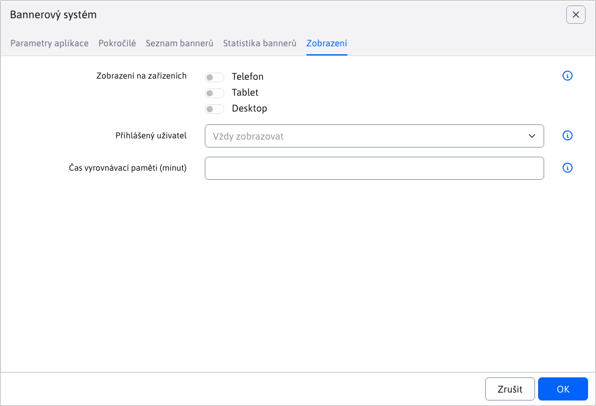

# Zobrazení v seznamu aplikací

Máte-li vytvořenou aplikaci můžete ji jednoduše zobrazit v seznamu aplikací v editoru. Na fotce obrazovky vidno aplikace Kontakty a Demo komponenta, což jsou aplikace pro WebJET napsané v [Spring](../spring-mvc/README.md).


<div class="video-container">
  <iframe width="560" height="315" src="https://www.youtube.com/embed/2r6-0zk5ZNQ" title="YouTube video player" frameborder="0" allow="accelerometer; autoplay; clipboard-write; encrypted-media; gyroscope; picture-in-picture" allowfullscreen></iframe>
</div>

## Použití anotace

Aby se aplikace zobrazila v seznamu je třeba aby její třída měla anotaci `@WebjetAppStore`, příklady:

```java
@WebjetComponent("sk.iway.demo8.DemoComponent")
@WebjetAppStore(nameKey = "Demo komponenta", descKey = "Demo komponenta nejaky dlhy opis", imagePath = "ti ti-snowflake text-danger", galleryImages = "/components/map/screenshot-1.jpg,/components/gdpr/screenshot-2.png,/components/gallery/screenshot-3.jpg")
public class DemoComponent extends WebjetComponentAbstract {
	...
}

@WebjetComponent("sk.iway.basecms.contact.ContactApp")
@WebjetAppStore(nameKey = "Kontakty", descKey = "Ukazkova aplikacia so zoznamom kontaktov", imagePath = "ti ti-id", galleryImages = "/components/map/screenshot-1.jpg,/components/gdpr/screenshot-2.png,/components/gallery/screenshot-3.jpg")
public class ContactApp extends WebjetComponentAbstract {
	...
}
```

Anotace má následující parametry:
- `nameKey` - překladový klíč **jména aplikace** (v příkladech je přímo text, doporučujeme ale použít překladový klíč). `components.DemoComponent.title`.
- `descKey` - překladový klíč **popisu aplikace**, není-li zadán hledá se překladový klíč zadaný jako `nameKey.desc` (pokud `nameKey` končí na `.title` nahradí se `.title` za `.desc`).
- `itemKey` - unikátní identifikátor aplikace pro přístupová práva, typicky `cmp_app_name`.
- `variant` - v seznamu aplikací se standardně zobrazuje jen jedna aplikace se stejným `itemKey`. Pokud je třeba mít v seznamu více aplikací se stejným `itemKey`, můžete nastavit rozdílnou variantu aplikace, například `variant = "unsubscribe",` pro variantu aplikace k odhlášení.
- `imagePath` - cesta k obrázku **ikony** aplikace. Může se jednat o soubor, nebo může být zadána CSS třída pro ikonu [TablerIcons](https://tabler.io/icons) jak `ti ti-meno-ikony`.
- `galleryImages` - čárkou oddělený seznam obrázků, které se zobrazí v popisu aplikace, například. `/components/map/screenshot-1.jpg,/components/gdpr/screenshot-2.png`.
- `componentPath` - čárkou oddělený seznam JSP souborů pro které se má aplikace zobrazit (nejedná-li se o Spring aplikaci), například `/components/search/search.jsp,/components/search/lucene_search.jsp`. Při vložení nové aplikace se použije první JSP soubor.
- `domainName` - pokud máte multi doménovou instalaci můžete omezit zobrazení aplikace pouze na zadanou doménu. Můžete zadat více domén oddělených čárkou.
- `commonSettings` - parametr určující, zda se v editoru aplikace zobrazí karta Zobrazení pro společná nastavení. Přednastavená hodnota je `true`, čili karta se bude zobrazovat.
- `custom` - nastavte na `true` pro vaše zákaznické aplikace. Automaticky se nastaví podle toho, zda se nachází v package `sk.iway.iwcm`. Zákaznické aplikace jsou v seznamu aplikací na začátku seznamu.
- `componentPath` - pokud přepisujete starší aplikaci v JSP kódu nastavte na cestu k tomuto JSP souboru, například `componentPath = "/components/calendar/calendar.jsp"`.
- `customHtml` - pokud potřebujete provést [doplňkový kód](#doplňkový-html-kód), upravit CSS styly a podobně nastavte na cestu k HTML souboru, který se doplní k editaci aplikace v editoru web stránek. Například `customHtml = "/apps/calendar/admin/editor-component.html"`.


Anotace je prohledávána v následujících packages (včetně pod packages):
- `sk.iway.iwcm` - standardní aplikace WebJET CMS.
- `sk.iway.INSTALL_NAME` - aplikace podle jména instalace (konf. proměnná `installName`), tady byste měli mít standardní zákaznické aplikace.
- `sk.iway.LOG_INSTALL_NAME` - aplikace podle jména logování instalace (konf. proměnná `logInstallName`), používá se pokud máte zákaznickou aplikaci ale nasazenou ve více variantách, nebo prostředích.
- packages definované v konf. proměnné `springAddPackages` - dodatečné packages pro Spring aplikace, používá se pokud je aplikace naprogramována mimo WebJET CMS, nebo používá jiný prefix než `sk.iway`.

Aplikace s package začínajícím na `sk.iway.iwcm` jsou umístěny na konec seznamu aplikací, ostatní jsou umístěny na její začátek. Předpokládá se, že zákaznické aplikace chcete mít zobrazeny na začátku seznamu aplikací.

Chcete-li umístit aplikaci i do promo seznamu (v horní části) upravte konf. proměnnou `appstorePromo`, která obsahuje seznam klíčů promo aplikací.

!>**Upozornění:** aplikace je do stránky vložena jako `@Scope(value = WebApplicationContext.SCOPE_REQUEST, proxyMode = ScopedProxyMode.TARGET_CLASS)`, pokud se ve stránce nachází vícekrát, je třída znovu použita a její atributy a proměnné jsou zachovány během provedení HTTP požadavku.

## Parametry aplikace

Každá aplikace může mít nastavitelné parametry. Ty jsou definovány přímo ve třídě jako její atributy:

```java

@WebjetComponent("sk.iway.demo8.DemoComponent")
@WebjetAppStore(nameKey = "Demo komponenta", descKey = "Demo komponenta nejaky dlhy opis", imagePath = "fti ti-snowflake text-danger", galleryImages = "/components/map/screenshot-1.jpg,/components/gdpr/screenshot-2.png,/components/gallery/screenshot-3.jpg")
public class DemoComponent extends WebjetComponentAbstract {

	private String stringField;
	private Boolean booleanField;
	private Float floatField;
	...

}
```

tyto atributy jsou napojeny na značku `!INCLUDE(... stringField=hodnota, booleanField=false)!` a používají se na [parametrizování zobrazení aplikace](../spring-mvc/README.md#používání-parametrů-aplikace).

WebJET podporuje zobrazení nastavení parametrů v dialogovém okně pomocí `@DataTableColumn` anotací stejně jako pro [editor standardní datatabulek](../../developer/datatables-editor/datatable-columns.md). Podporovány jsou i karty nastavené atributem `tab` anotace. Hledaný je překladový klíč s názvem `editor.tab.MENO`.

Kromě primitivních/základních datových typů a `java.util.Date` je podporována konverze objektů typu `DocDetails/GroupDetails` včetně `List` pomocí typu pole `DataTableColumnType.JSON`.

Příklad použití:


```java
package sk.iway.demo8;

import org.springframework.ui.Model;

import lombok.Getter;
import lombok.Setter;
import sk.iway.iwcm.Logger;
import sk.iway.iwcm.components.WebjetComponentAbstract;
import sk.iway.iwcm.doc.DocDetails;
import sk.iway.iwcm.doc.GroupDetails;
import sk.iway.iwcm.system.annotations.DefaultHandler;
import sk.iway.iwcm.system.annotations.WebjetAppStore;
import sk.iway.iwcm.system.annotations.WebjetComponent;
import sk.iway.iwcm.system.datatable.DataTableColumnType;
import sk.iway.iwcm.system.datatable.annotations.DataTableColumn;

import java.math.BigDecimal;
import java.util.Date;
import java.util.List;

@WebjetComponent("sk.iway.demo8.DemoComponent")
@WebjetAppStore(nameKey = "Demo komponenta", descKey = "Demo komponenta nejaky dlhy opis", imagePath = "ti ti-snowflake text-danger", galleryImages = "/components/map/screenshot-1.jpg,/components/gdpr/screenshot-2.png,/components/gallery/screenshot-3.jpg")
@Getter
@Setter
public class DemoComponent extends WebjetComponentAbstract {

	@DataTableColumn(inputType = DataTableColumnType.TEXT, tab = "basic")
	private String stringField;

	@DataTableColumn(inputType = DataTableColumnType.CHECKBOX, tab = "basic")
	private boolean primitiveBooleanField;

	@DataTableColumn(inputType = DataTableColumnType.TEXT_NUMBER, tab = "basic")
	private int primitiveIntegerField;

	@DataTableColumn(inputType = DataTableColumnType.TEXT_NUMBER, tab = "basic")
	private double primitiveDoubleField;

	@DataTableColumn(inputType = DataTableColumnType.TEXT_NUMBER, tab = "basic")
	private float primitiveFloatField;


	@DataTableColumn(inputType = DataTableColumnType.TEXT_NUMBER, tab = "advanced")
	private BigDecimal bigDecimalField;

	@DataTableColumn(inputType = DataTableColumnType.CHECKBOX, tab = "advanced")
	private Boolean booleanField;

	@DataTableColumn(inputType = DataTableColumnType.TEXT_NUMBER, tab = "advanced")
	private Integer integerField;

	@DataTableColumn(inputType = DataTableColumnType.TEXT_NUMBER, tab = "advanced")
	private Double doubleField;

	@DataTableColumn(inputType = DataTableColumnType.TEXT_NUMBER, tab = "advanced")
	private Float floatField;

	@DataTableColumn(inputType = DataTableColumnType.DATETIME, title = "date", tab = "advanced")
    private Date date;


	@DataTableColumn(inputType = DataTableColumnType.JSON, title = "groupDetails", tab = "json", className = "dt-tree-group")
    private GroupDetails groupDetails;

    @DataTableColumn(inputType = DataTableColumnType.JSON, title = "docDetails", tab = "json", className = "dt-tree-page")
    private DocDetails docDetails;

    @DataTableColumn(inputType = DataTableColumnType.JSON, title = "groupDetailsList", tab = "json", className = "dt-tree-group-array")
    private List<GroupDetails> groupDetailsList;

    @DataTableColumn(inputType = DataTableColumnType.JSON, title = "docDetailsList", tab = "json", className = "dt-tree-page-array")
    private List<GroupDetails> docDetailsList;

    @DataTableColumn(inputType = DataTableColumnType.JSON, title = "dirSimple", tab = "json", className = "dt-tree-dir-simple")
    private String dirSimple;

    //select folder with root set to /images/gallery
    @DataTableColumn(inputType = DataTableColumnType.JSON, className = "dt-tree-dir-simple", title="components.gallery.dir", editor = {
        @DataTableColumnEditor(
            attr = {
                @DataTableColumnEditorAttr(key = "data-dt-field-root", value = "/images/gallery")
            }
        )
    })
    private String dir = "/images/gallery";


	@DefaultHandler
	public String render(Model model)
	{
		Logger.debug(this.getClass(), "groupDetails="+groupDetails+" docDetails="+docDetails+" groupDetailsList="+groupDetailsList+" docDetailsList="+docDetailsList+" dirSimple="+dirSimple+" date="+date);

        model.addAttribute("test", "Toto je test");
		model.addAttribute("demoComponent", this);

		return "/components/aceintegration/demo-component/view";
	}

	/**
	 * To call this method there should be URL parameter ?save (value is not important) OR page parameter !INCLUDE(... ,defaultHandler=save)!
	 * @param model
	 * @return
	 */
	public String save(Model model)
	{
		Logger.debug(this.getClass(), "groupDetails="+groupDetails+" docDetails="+docDetails+" groupDetailsList="+groupDetailsList+" docDetailsList="+docDetailsList+" dirSimple="+dirSimple+" date="+date);

        model.addAttribute("test", "This is save method");
		model.addAttribute("demoComponent", this);

		return "/components/aceintegration/demo-component/view";
	}

	@Override
	public void init()
	{
		//There should be initialization of component
		Logger.debug(this.getClass(), "DemoComponent init");
	}

	@Override
	public String getViewFolder()
	{
		return null;
	}
}
```

Ukázkový HTML kód `/components/aceintegration/demo-component/view.html`:

```html
<p>
    Demo component view, params:
    <br>
    test1: <span data-th-utext="${test}"></span>
    <br>
    stringField: <span data-th-utext="${demoComponent.stringField}"></span>
    <br>
    primitiveBooleanField: <span data-th-utext="${demoComponent.primitiveBooleanField}"></span>
    <br>
    primitiveIntegerField: <span data-th-utext="${demoComponent.primitiveIntegerField}"></span>
    <br>
    primitiveDoubleField: <span data-th-utext="${demoComponent.primitiveDoubleField}"></span>
    <br>
    primitiveFloatField: <span data-th-utext="${demoComponent.primitiveFloatField}"></span>
</p>

<p>date: <span data-th-text="${T(sk.iway.iwcm.Tools).formatDateTimeSeconds(demoComponent.date)}"></span></p>

<p>dirSimple: <span data-th-utext="${demoComponent.dirSimple}"></span></p>

<p>groupDetails: <span data-th-text="${demoComponent.groupDetails}"></span></p>

<p>docDetails: <span data-th-text="${demoComponent.docDetails}"></span></p>

<p>groupDetailsList:</p>
<ul data-th-each="grp : ${demoComponent.groupDetailsList}">
    <li data-th-text="${grp}">GroupDetails</li>
</ul>

<p>docDetailsList:</p>
<ul data-th-each="doc : ${demoComponent.docDetailsList}">
    <li data-th-text="${doc}">DocDetails</li>
</ul>
```

Příklad nastavení [výběrového pole](../../developer/datatables-editor/datatable-columns.md#možnosti-výběrového-pole) v aplikaci Kontakty. Všimněte si také možnosti `@JsonIgnore` nastavené nad repozitářem. Jinak by se do JSON objektu pro editaci parametrů aplikace serializoval i samotný repozitář, což způsobuje JSON chybu.


```java
package sk.iway.basecms.contact;

import javax.servlet.http.HttpServletRequest;
import javax.servlet.http.HttpServletResponse;
import javax.validation.Valid;

import com.fasterxml.jackson.annotation.JsonIgnore;

import org.springframework.beans.factory.annotation.Autowired;
import org.springframework.ui.Model;
import org.springframework.validation.BindingResult;
import org.springframework.web.bind.annotation.ModelAttribute;
import org.springframework.web.bind.annotation.RequestParam;

import lombok.Getter;
import lombok.Setter;
import sk.iway.iwcm.Logger;
import sk.iway.iwcm.PathFilter;
import sk.iway.iwcm.components.WebjetComponentAbstract;
import sk.iway.iwcm.system.annotations.DefaultHandler;
import sk.iway.iwcm.system.annotations.WebjetAppStore;
import sk.iway.iwcm.system.annotations.WebjetComponent;
import sk.iway.iwcm.system.datatable.DataTableColumnType;
import sk.iway.iwcm.system.datatable.annotations.DataTableColumn;
import sk.iway.iwcm.system.datatable.annotations.DataTableColumnEditor;
import sk.iway.iwcm.system.datatable.annotations.DataTableColumnEditorAttr;

/**
 * <p>Príkladová trieda pre komponentu - http://docs.webjetcms.sk/v2022/#/custom-apps/spring-mvc/</p>
 * <p>Trieda musí byt anotovaná @WebjetComponent, pre názov v anotácii sa musí použiť celý názov triedy aj s package</p>
 * <p>Príklad include:</p>
 * <code>!INCLUDE(sk.iway.basecms.contact.ContactApp, country="sk")!</code>
 *
 * Anotacia @WebjetAppStore zabezpeci zobrazenie aplikacie v zozname aplikacii v editore (v AppStore)
 *
 * V pripade, ze nejaka metoda ma byt dostupna len pre prihlaseneho pouzivatela, admina, prip. nejaku pouzivatelsku skupinu mozeme pouzit anotacie:
 * @PreAuthorize("@WebjetSecurityService.isLogged()") - prihalseny pouzivatel
 * @PreAuthorize("@WebjetSecurityService.isAdmin()") - admin
 * @PreAuthorize("@WebjetSecurityService.isInUserGroup('nazov-skupiny')") - patri do skupiny
 * @see sk.iway.iwcm.system.spring.services.WebjetSecurityService
 */
@WebjetComponent("sk.iway.basecms.contact.ContactApp")
@WebjetAppStore(nameKey = "Kontakty", descKey = "Ukazkova aplikacia so zoznamom kontaktov", imagePath = "ti ti-id", galleryImages = "/components/map/screenshot-1.jpg,/components/gdpr/screenshot-2.png,/components/gallery/screenshot-3.jpg")
@Getter
@Setter
public class ContactApp extends WebjetComponentAbstract {

    //Spring DATA repozitar
    @JsonIgnore
    private ContactRepository contactRepository;

    /**
     * Privatne vlastnosti s get/set-rami slúžia na prenesenie parametrov pageParams z !INCLUDE()! do triedy
     * Pomocou anotacie @DataTableColumn vytvarame pole pre nastavenie aplikacie
     */
    @DataTableColumn(inputType = DataTableColumnType.SELECT, tab = "basic", editor = {
        @DataTableColumnEditor(
            options = {
                //klasicky option tag
                //@DataTableColumnEditorAttr(key = "Slovensky", value = "sk"),

                //ukazka ziskania zoznamu krajin volanim statickej metody, vo value su mena property pre text a hodnotu option pola
                @DataTableColumnEditorAttr(key = "method:sk.iway.basecms.contact.ContactRestController.getCountries", value = "label:value")

                //ukazka napojenia na ciselnik, mozne je zadat meno alebo ID ciselnika, vo value su mena property pre text a hodnotu option pola
                //@DataTableColumnEditorAttr(key = "enumeration:Okresne Mestá", value = "string1:string2")
            }
        )
    })
    private String country;

    @Autowired
    public ContactApp(ContactRepository contactRepository) {
        this.contactRepository = contactRepository;
    }

    /**
     * metoda init sa vola po vytvoreni objektu a nastaveni parametrov,
     * je volana pred kazdym view volanim a umozni nastavit pripadne atributy
     * @param request
     * @param response
     */
    @Override
    public void init(HttpServletRequest request, HttpServletResponse response) {
        Logger.debug(ContactApp.class, "Init call, request.getHeader(User-Agent)="+request.getHeader("User-Agent"));
    }

    /**
     * Metóda anotovaná @DefaultHandler sa vykoná, ak v requeste nie je žiaden parameter, ktorý by sa zhodoval s názvom inej metódy v triede
     * Metóda môže mať ľubovolný názov
     * @param model
     * @param request
     * @return String URL adresa súboru ktorý bude v contente renderovaný namiesto !INCLUDE()!
     */
    @DefaultHandler
	public String view(Model model, HttpServletRequest request)
	{
        model.addAttribute("contants", contactRepository.findAllByCountry(country, null));
		return "/apps/contact/mvc/list";
	}

    /**
     * Metóda edit slúži na zobrazenie formuláru pre úpravu existujúceho záznamu
     * @param id
     * @param model
     * @param request
     * @return
     */
    public String edit(@RequestParam("id") long id, Model model, HttpServletRequest request) {
        ContactEntity contact = contactRepository.getById(id);
        model.addAttribute("entity", contact);

        //pridaj do modelu moznosti pre select country
        model.addAttribute("countries", ContactRestController.getCountries());

        return "/apps/contact/mvc/edit";
    }

    /**
     * Metóda edit slúži na zobrazenie formuláru pre úpravu existujúceho záznamu
     * @param model
     * @param request
     * @return
     */
    public String add(Model model) {
        ContactEntity contact = new ContactEntity();
        //tu mozete nastavit nejake default hodnoty
        contact.setCountry("sk");

        model.addAttribute("entity", contact);
        return "/apps/contact/mvc/edit";
    }

    /**
     * Metóda saveForm slúži na validáciu a uloženie úpravy existujúceho záznamu
     * @param entity
     * @param result
     * @param model
     * @param request
     * @return
     */
    public String saveForm(@Valid @ModelAttribute("entity") ContactEntity entity, BindingResult result, Model model, HttpServletRequest request) {
        if (!result.hasErrors()) {
            contactRepository.save(entity);
            return "redirect:" + PathFilter.getOrigPath(request);
        }
        model.addAttribute("error", result);
        model.addAttribute("entity", entity);
        return "/apps/contact/mvc/edit";
    }

}
```

## Inicializace dat

Pokud potřebujete při otevření aplikace provést kód pro inicializaci hodnot můžete implementovat metodu `initAppEditor(ComponentRequest componentRequest, HttpServletRequest request)`, ve které můžete nastavit iniciální hodnoty nebo provést jiný kód. V objektu `ComponentRequest` se nacházejí informace o aktuální web stránce.

```java
    @Override
    public void initAppEditor(ComponentRequest componentRequest, HttpServletRequest request) {
        String uploadSubdir = UploadFileTools.getPageUploadSubDir(componentRequest.getDocId(), componentRequest.getGroupId(), componentRequest.getPageTitle(), "/images/gallery");
        IwcmFile uploadDirFile = new IwcmFile(Tools.getRealPath(uploadSubdir));
        if ("/images/gallery".equals(dir)) {
            if (uploadDirFile.exists() == false) {
                boolean created = uploadDirFile.mkdirs();
                if (created) dir = uploadSubdir;
            } else {
                dir = uploadSubdir;
            }
        }
    }
```

## Nastavení výběrových polí

Pro dynamicky tvořená výběrová pole můžete implementovat metodu `getAppOptions(ComponentRequest componentRequest, HttpServletRequest request)` která nastaví `options` objekt REST odpovědi. Ten se přenese do datatabulky a nastaví možnosti pro výběrová pole, nebo seznam zaškrtávacích polí.

```java
@WebjetComponent("sk.iway.iwcm.components.gallery.GalleryApp")
@WebjetAppStore(nameKey = "components.gallery.title", descKey = "components.gallery.desc", itemKey="menuGallery", imagePath = "/components/gallery/editoricon.png", galleryImages = "/components/gallery/", componentPath = "/components/gallery/gallery.jsp")
@Getter
@Setter
public class GalleryApp extends WebjetComponentAbstract {

    @DataTableColumn(inputType = DataTableColumnType.SELECT, tab = "basic", title="components.gallery.visual_style")
    private String style;

    @DataTableColumn(inputType = DataTableColumnType.CHECKBOX, tab = "basic", title="components.news.perexGroup", editor = {
        @DataTableColumnEditor(
            attr = {
                @DataTableColumnEditorAttr(key = "data-dt-field-headline", value = "editor.tab.filter"),
                @DataTableColumnEditorAttr(key = "unselectedValue", value = "")
            }
        )
    })
	private Integer[] perexGroup;

    @Override
    public Map<String, List<OptionDto>> getAppOptions(ComponentRequest componentRequest, HttpServletRequest request) {
        Map<String, List<OptionDto>> options = new HashMap<>();

        //add options for style
        List<OptionDto> styleOptions = new ArrayList<>();
        Prop prop = Prop.getInstance(request);

		styleOptions.add(new OptionDto(prop.getText("components.gallery.visual_style.prettyPhoto"), "prettyPhoto", null));
		styleOptions.add(new OptionDto(prop.getText("components.gallery.visual_style.photoSwipe"), "photoSwipe", null));

		//add all JSP files from the custom gallery folder
		IwcmFile[] files = new IwcmFile(Tools.getRealPath("/components/" + Constants.getInstallName() + "/gallery/")).listFiles();
		for (IwcmFile f : files)
		{
			if (f.getName().startsWith("gallery-")==false) continue;
			if (f.getName().contains("-prettyPhoto.jsp") || f.getName().contains("-photoSwipe.jsp")) continue;

			try
			{
				String name = f.getName().substring("gallery-".length(), f.getName().length()-4);
                addPair(name, styleOptions, prop);
			}
			catch (Exception e)
			{
				sk.iway.iwcm.Logger.error(e);
			}
		}

		//check if the current style is in the list (maybe it's customer style)
		styleOptions = addCurrentValueToOptions(styleOptions, getStyle());

        options.put("style", styleOptions);

        //add perex groups
        List<PerexGroupBean> perexGroups = DocDB.getInstance().getPerexGroups(componentRequest.getGroupId());
        List<OptionDto> perexGroupOptions = new ArrayList<>();
        for (PerexGroupBean pg : perexGroups) {
            perexGroupOptions.add(new OptionDto(pg.getPerexGroupName(), ""+pg.getPerexGroupId(), null));
        }
        options.put("perexGroup", perexGroupOptions);

        return options;
    }

    /**
     * Try to translate the name of the style and add it to the list of options
     * @param name
     * @param styleOptions
     * @param prop
     */
    private void addPair(String name, List<OptionDto> styleOptions, Prop prop)
	{
		String desc = prop.getText("components.gallery.visual_style."+name);
		if (desc.startsWith("components.gallery")) desc = name;

		styleOptions.add(new OptionDto(desc, name, null));
	}
}
```

## Karty

Pokud potřebujete pole rozdělit do více karet je možné je definovat anotací `@DataTableTabs`, můžete také využít typ pole `IFRAME` pro snadné vložení jiné stránky, například. seznamu fotografií v galerii:

```java
@WebjetComponent("sk.iway.iwcm.components.gallery.GalleryApp")
@WebjetAppStore(nameKey = "components.gallery.title", descKey = "components.gallery.desc", itemKey="menuGallery", imagePath = "/components/gallery/editoricon.png", galleryImages = "/components/gallery/", componentPath = "/components/gallery/gallery.jsp")
@DataTableTabs(tabs = {
    @DataTableTab(id = "basic", title = "components.universalComponentDialog.title", selected = true),
    @DataTableTab(id = "componentIframe", title = "components.gallery.images")
})
@Getter
@Setter
public class GalleryApp extends WebjetComponentAbstract {

    @DataTableColumn(inputType = DataTableColumnType.SELECT, tab = "basic", title="components.gallery.visual_style")
    private String style;

    @DataTableColumn(inputType = DataTableColumnType.JSON, tab = "basic", className = "dt-tree-dir-simple", title="components.gallery.dir", editor = {
        @DataTableColumnEditor(
            attr = {
                @DataTableColumnEditorAttr(key = "data-dt-field-root", value = "/images/gallery")
            }
        )
    })
    private String dir = "/images/gallery";

    ...

    @DataTableColumn(inputType = DataTableColumnType.IFRAME, tab = "componentIframe", title="&nbsp;")
    private String iframe  = "/admin/v9/apps/gallery/?dir={dir}";

}
```

## Karta Zobrazení

Karta Zobrazení pro společná nastavení, se ve výchozím nastavení zobrazí každé aplikace, pokud to u dané aplikace není nastaveno jinak ( [více informací zde](#parametry-aplikace) ).



Karta obsahuje parametry:
- Zobrazení na zařízeních, sloužící k nastavení [podmíněného zobrazení aplikace](#podmíněné-zobrazení-aplikace).
- Čas vyrovnávací paměti (minuty), slouží k nastavení doby v minutách, po jakou má být inicializovaná aplikace uložena ve vyrovnávací paměti.

Pokud ve Spring aplikaci kartu nechcete zobrazit nastavte atribut `commonSettings=false` v anotaci `@WebjetAppStore`.

### Podmíněné zobrazení aplikace

Pokud `PageParams` objekt obsahuje parametr `device=XXX` bude aplikace zobrazena pouze pro zadané zařízení. To se detekuje na serveru podle HTTP hlavičky `User-Agent`. Telefon se detekuje při nalezení výrazu `iphone`, nebo `mobile` a současně výrazu `android`. Tablet jako `ipad||tablet||kindle` nebo pokud obsahuje `android` a neobsahuje `mobile`. Podporované možnosti pro hodnotu `device` jsou `phone,tablet,pc`. Podporovány jsou-li kombinace typu `phone+pc`. Pokud je zadána prázdná hodnota, nebo všechny kombinace zobrazí se aplikace pro všechna zařízení.

Při náhledu aplikace v editoru, která má podmíněné zobrazení, se v náhledu zobrazuje text typu `Zobrazenie na zariadeniach: XXX`:


Pro otestování při zobrazení web stránky můžete využít URL parametr `?forceBrowserDetector=`, kterým umíme WebJET přesvědčit, že přistupujeme se zařízením specifického typu. Podporované typy tohoto parametru jsou `phone`, `tablet` a `pc`.

Při použití starých `editor_component.jsp` můžete přidat kartu s nastavením zobrazení pro zařízení voláním `$(document).ready(function() { addAdvancedSettingsTab(); });` a získat nastavenou hodnotu jako `oEditor.FCK.InsertHtml("!INCLUDE(/components/..." + getCommonAdvancedParameters() + ")!");`. Implementace funkce je v `/components/bottom.jsp` a je takto připravena pro vaše snadné použití.

### Čas vyrovnávací paměti (minuty)

Počet minut během kterých se má uchovávat v paměti HTML kód již jednou provedené aplikace. Zrychluje zobrazení web stránky.

Cache se nepoužije pokud:
- je přihlášen administrátor (při zobrazení stránky se ale aktualizuje hodnota v cache, umíte tak snadno aktualizovat cache pro nepřihlášené uživatele). Zapnout vyrovnávací paměť i pro administrátory lze nastavením konf. proměnné `cacheStaticContentForAdmin` na hodnotu `true`.
- zadaná hodnota parametru `cacheMinutes` \< 1
- v URL adrese se nachází parametr `page` (neaplikuje se pokud je hodnota 1, tedy pro první stranu např. seznamu novinek)
- v URL adrese se nachází parametr `_disableCache=true`

## Doplňkový HTML kód

V některých případech je nutné provést doplňkový HTML/JavaScript kód při úpravě vlastností aplikace v editoru. V anotaci `@WebjetAppStore` lze nastavit cestu k doplňkovému HTML souboru v atributu `customHtml`, například:

```java
@WebjetComponent("sk.iway.iwcm.components.calendar.CalendarApp")
@WebjetAppStore(
    nameKey = "components.calendar.title",
    descKey = "components.calendar.desc",
    itemKey = "cmp_calendar",
    imagePath = "/components/calendar/editoricon.png",
    galleryImages = "/components/calendar/",
    componentPath = "/components/calendar/calendar.jsp",
    customHtml = "/apps/calendar/admin/editor-component.html"
)
@Getter
@Setter
public class CalendarApp extends WebjetComponentAbstract {

}
```

Zadaný HTML kód je vložen do stránky s editorem aplikace. Je možné využít následující funkce pro provedení JavaScript kódu:
- `appBeforeXhr(data)` - voláno před získáním informací o editoru, `data` obsahuje objekt posílaný do REST služby.
- `appAfterXhr(response)` - volané po získání dat z REST služby, lze modifikovat data (např. doplnit vstupní pole) v `response` objektu.
- `appAfterInit(response, datatable)` - voláno po inicializaci datatabulky, v `datatable` je instance datatabulky/editoru.
- `appGetComponentPath(componentPath, componentDatatable)` - volané při vložení aplikace do stránky, můžete změnit cestu pro vložený `INCLUDE` Např. na základě vybraných možností.
- `appGetComponentCode(componentPath, params, componentDatatable)` - volané při vložení aplikace do stránky, může vrátit kompletní kód pro vložení do stránky (nemusí to být přímo `!INCLUDE` kód).

Ukázkový kód, který reaguje na změnu výběrového pole:

```html
<script>

    function appBeforeXhr(data) {
        console.log("appBeforeXhr, data=", data);
    }

    function appAfterXhr(response) {
        console.log("appAfterXhr, response=", response);
    }

    function appGetComponentPath(componentPath, datatable) {
        let field = $("#DTE_Field_field").val();
        if ("last_update" === field) {
            //change component path to last_update.jsp
            return "/components/app-date/last_update.jsp";
        }
        return componentPath;
    }

    function appGetComponentCode(componentPath, params, datatable) {
        //fields like !DATE!, !DATE_TIME! insert directly into page
        let field = $("#DTE_Field_field").val();
        if (field.indexOf("!")==0) return field;
        return null;
    }

    function appAfterInit(response, datatable) {
        console.log("appAfterInit, response=", response, "datatable=", datatable);

        window.addEventListener("WJ.DTE.opened", function(e) {
            //add event listener to the form
            $("#DTE_Field_typ_kalendara").on("change", function() {
                var value = $(this).val();
                console.log("DTE_Field_typ_kalendara changed, value=", value);
                if (value === "1") {

                } else {

                }
            });
        });
    }

</script>
```

## Implementační detaily

- Datatabulka je vložena přes `/admin/v9/views/pages/webpages/component.pug`
- Logika pro zobrazení administrace je v `/admin/skins/webjet8/ckeditor/dist/plugins/webjetcomponents/dialogs/webjetcomponet.jsp`, zobrazuje buď klasický `editor_component.jsp`, tento automatický editor přes anotace, nebo seznam aplikací.
- Přidána metoda pro získání seznamu karet z anotace vlastností `sk.iway.iwcm.system.datatable.DataTableColumnsFactory`
- Vytvořený nový datový objekt pro karty `sk.iway.iwcm.system.datatable.json.DataTableTab`
- Rest controller pro data aplikace `sk.iway.iwcm.editor.rest.ComponentsRestController`
- Nový datový `request` objekt pro získání dat aplikace `sk.iway.iwcm.editor.rest.ComponentRequest`
- Seznam aplikací se z anotací hledá v `sk.iway.iwcm.editor.appstore.AppManager.scanAnnotations`.
