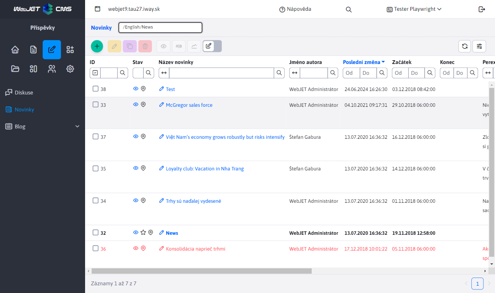

# Seznam web stránek/novinek

Aplikace [Novinky](../../redactor/apps/news/README.md), vloží do stránky seznam web stránek v zadané složce. Používá se pro vkládání seznamu novinek, tiskových zpráv, ale i jiných podobných výpisů (seznam kontaktních míst, osobních kontaktů, produktů a podobně).

Tabulka poskytuje editační možnosti podobně jako seznam web stránek.



Pokud má zákazník specifické požadavky na zobrazení sloupců (např. pro seznam produktů) nebo informací můžete implementovat vlastní aplikaci, která využívá kód pro seznam novinek.

Níže je uveden kompletní kód stránky se seznamem novinek. Můžete využít vlastnost úpravy standardních sloupců pomocí funkce `window.WJ.DataTable.mergeColumns`. V příkladu se upravuje nastavení atributu viditelnosti sloupce, můžete ale také přejmenovat název jak je ukázáno v případě názvu stránky.

Pokud nepotřebujete měnit hodnotu ID složky, můžete samozřejmě odstranit AJAX volání `/admin/rest/news/news-list/convertIdsToNamePair`, která získává seznam pro výběrové pole složky v hlavičce.

```html
<script data-th-inline="javascript">
    var webpageColumns = /*[(${layout.getDataTableColumns('sk.iway.iwcm.doc.DocDetails')})]*/ '';
</script>
<script type="text/javascript">
    var newsDataTable;
    var idsConstantName = "newsAdminGroupIds";

    window.domReady.add(function () {

        function setGroupIdFilterSelect(data) {
            //Get object, select
            let filterSelect = document.getElementById('groupIdFilterSelect');
            //Remove all options except the default one
            while(filterSelect.options.length > 1) {
                filterSelect.remove(1);
            }
            //Add new options
            for (const s of data) {
                filterSelect.add(new Option(s.label, s.value));
            }

            //set selected value
            var hash = window.location.hash;
            if (hash != "") $(filterSelect).val(hash.substr(1));

            //Refresh object
            $("#groupIdFilterSelect").selectpicker('refresh');
        }

        let urlGroupIdFilter = "/admin/rest/news/news-list/convertIdsToNamePair?ids=constant:"+idsConstantName;
        let data = {};
        var includeParameter = WJ.urlGetParam("include");
        if (includeParameter != null) {
            data.include = includeParameter
        }

        $.ajax({
            url: urlGroupIdFilter,
            data: data,
            method: "post",
            success: function (data) {

                //console.log("mam data:", data);

                let url = "/admin/rest/news/news-list";

                //rename title column
                window.WJ.DataTable.mergeColumns(webpageColumns, { name: "title", title: WJ.translate("apps.news.newsTitle.js") });
                //add column visibility
                window.WJ.DataTable.mergeColumns(webpageColumns, { name: "publishStartDate", visible: true });
                window.WJ.DataTable.mergeColumns(webpageColumns, { name: "publishEndDate", visible: true });
                window.WJ.DataTable.mergeColumns(webpageColumns, { name: "htmlData", visible: true });
                window.WJ.DataTable.mergeColumns(webpageColumns, { name: "perexImage", visible: true });

                window.importWebPagesDatatable().then(module => {

                    var order = [];
                    order.push([4, 'desc']);

                    url = WJ.urlAddParam(url, "groupIdList", data[0].value);

                    let wpdInstance = new module.WebPagesDatatable({
                        url: url,
                        columns: webpageColumns,
                        id: "newsDataTable",
                        order: order,
                        newPageTitleKey: "apps.news.newsTitle.js",
                    });
                    newsDataTable = wpdInstance.createDatatable();

                    $(".dt-buttons").prepend('<div class="btn btn-sm buttons-select" id="groupSelect_wrapper"><label>[[#{editor.div_properties.section}]]</label><select class="form-select" id="groupIdFilterSelect"></select></div>');
                    setGroupIdFilterSelect(data);

                    $("#groupIdFilterSelect").on("change", function() {
                        var value = this.value;
                        newsDataTable.setAjaxUrl(WJ.urlUpdateParam( newsDataTable.getAjaxUrl() , "groupIdList", this.value));
                        newsDataTable.ajax.reload();
                    });
                });
            }

        });

    });
</script>

<table id="newsDataTable" class="datatableInit table"></table>
```

Pokud uživatel nemá přímo přístup k web stránkám je třeba přidat ještě vaše právo aplikace do konf. proměnné `webpagesFunctionsPerms`, která obsahuje seznam práv, která získávají právo na práci s web stránkami. Jedná se také o funkce pro vložení obrázku a podobně.

## Backend

Pokud potřebujete specifickou REST službu pro poskytování seznamu web stránek/novinek můžete využít připravenou třídu [WebpagesDatatable](../../../../src/main/java/sk/iway/iwcm/editor/rest/WebpagesDatatable.java) kterou rozšíříte a přepíšete metody podle vašich potřeb.

```java
@Datatable
@RestController
@RequestMapping("/admin/rest/abtesting/list")
@PreAuthorize("@WebjetSecurityService.hasPermission('cmp_abtesting')")
public class AbTestingRestController extends WebpagesDatatable {

    @Autowired
    public AbTestingRestController(DocDetailsRepository docDetailsRepository, EditorFacade editorFacade, DocAtrDefRepository docAtrDefRepository) {
        super(docDetailsRepository, editorFacade, docAtrDefRepository);
    }

    @Override
    public Page<DocDetails> getAllItems(Pageable pageable) {
        GetAllItemsDocOptions options = getDefaultOptions(pageable, true);
        return AbTestingService.getAllItems(options);
    }

    @Override
    public void beforeSave(DocDetails entity) {
        //In abtesting version user cant edit/insert/duplicate page's
        throwError(getProp().getText("admin.editPage.error"));
    }

    @Override
    public boolean deleteItem(DocDetails entity, long id) {
        //In abtesting version user cant delete page's
        throwError(getProp().getText("admin.editPage.error"));

        return false;
    }
}
```
