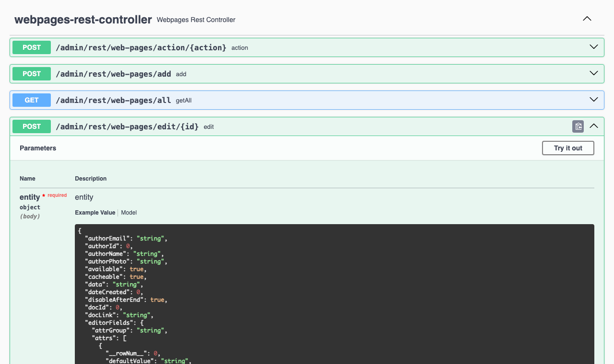

# API autorizace

Pokud potřebujete přistupovat k REST službám/`API WebJET CMS` z externího systému můžete využít možnost autorizace API klíčem. Ten se posílá v HTTP hlavičce `x-auth-token` při volání REST služby. Při takové autorizaci není třeba posílat CSRF token.

API [autorizaci lze zakázat](../../sysadmin/pentests/README.md#konfigurace) v konfigurační proměnné `springSecurityAllowedAuths` ze které odstraníte hodnotu `api-token`.

## Nastavení klíče

API klíč je přiřazen k reálnému uživatelskému účtu. V editaci uživatele v kartě Osobní údaje zadejte klíč do pole API klíč. Doporučujeme zadat znak `*` pro vygenerování náhodného API klíče. Po vygenerování se v notifikaci zobrazí klíč a také hodnota, která se zadává do HTTP hlavičky.


## Zasílání klíče

Zadaný API klíč se odesílá v HTTP hlavičce `x-auth-token` (jméno hlavičky lze změnit v konf. proměnné `logonTokenHeaderName`) ve formátu `base64(login:token)`. Přesnou hodnotu vám zobrazí notifikace při vygenerování náhodného tokenu.

Příklady:

```shell
#zoznam web stranok v priecinku 25
curl -X GET \
  'http://iwcm.interway.sk/admin/rest/web-pages/all?groupId=25' \
  --header 'x-auth-token: dGVzdGVyOkJiO3VLQFA2WlNGYnI4IS9jSmI0QGcyM2A0PkN1RjJw'

#web stranka 4
curl -X GET \
  'http://iwcm.interway.sk/admin/rest/web-pages/4' \
  --header 'x-auth-token: dGVzdGVyOkJiO3VLQFA2WlNGYnI4IS9jSmI0QGcyM2A0PkN1RjJw'
```

## Seznam všech REST služeb

Seznam všech REST služeb můžete získat při lokálním spuštění WebJETu na URL adrese `/admin/swagger-ui/index.html` (vyžaduje nastavení konf. proměnné `swaggerEnabled` na `true`).



## Technické informace

Autorizace je zajištěna pomocí `SpringSecurity` filtru implementovaného ve třídě `sk.iway.iwcm.system.spring.ApiTokenAuthFilter`. Filtr je inicializován v `sk.iway.webjet.v9.V9SpringConfig.configureSecurity`. Technicky proběhne standardní přihlášení zadaného uživatele, následně po provedení HTTP požadavku je `session` invalidována.
