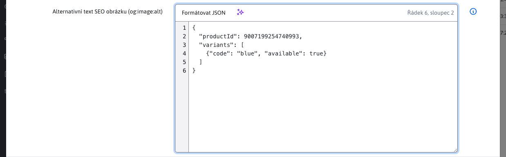

# Volitelná pole

Přes volitelná pole lze web stránce a adresáři nastavovat volitelné atributy (hodnoty, texty) dle potřeby zákazníka. Hodnoty je následně možné přenést a použít v šabloně stránky, viz [dokumentace pro Frontend programátora](../../frontend/webpages/customfields/README.md).

## Backend

Nastavení volitelných polí jsou závislá na použité šabloně, skupině šablon nebo domény (jelikož jsou řízena nastavením překladových klíčů). Možnosti je tedy z backend-u třeba odesílat pro každou editovanou web stránku samostatně. Přenos nastavení je genericky implementován [BaseEditorFields.getFields](../../../../src/main/java/sk/iway/iwcm/system/datatable/BaseEditorFields.java):

```java
@JsonIgnore
/**
 * Vygeneruje definiciu volnych poli, presunute sem z EditorForm.getFields() pre moznost pouzitia aj v inych DT ako webpages
 * @param bean - java bean, musi obsahovat metody getFieldX
 * @param keyPrefix - prefix textovych klucov, napr. edior, alebo groupedit, nasledne sa hladaju kluce keyPrefix.field_X a keyPrefix.field_X.type
 * @param lastAlphabet - koncove pismeno (urcuje pocet volnych poli), nap. T aleb D
 * @return
 */
public List<Field> getFields(Object bean, String keyPrefix, char lastAlphabet) {

}
```

volání ```getFields``` jak vidíte má anotaci ```@JsonIgnore```. Metodu musíte implicitně zavolat pro přípravu pole objektů. Základní příklad použití:

```java
//vytvorte triedu, ktora extenduje BaseEditorFields, nemusi obsahovat nic dalsie (ak nepotrebujete v editore dodatocne polia)
//technicky by ste triedu ani nemuseli vytvarat a pouzit priamo BaseEditorFields vo vasej QuestionsAnswersEntity
public class QuestionsAnswersEditorFields extends BaseEditorFields {

}

//vo vasej entite pridajte pole s nazvom editorFields
@Entity
@Table(name = "questions_answers")
@Getter
@Setter
@EntityListeners(sk.iway.iwcm.system.adminlog.AuditEntityListener.class)
@EntityListenersType(sk.iway.iwcm.Adminlog.TYPE_QA_UPDATE)
public class QuestionsAnswersEntity implements Serializable {

    ...

	@Transient
    @DataTableColumnNested
	private QuestionsAnswersEditorFields editorFields = null;
}

//v REST controlleri implementujte metodu processFromEntity v ktorej doplnite do editorFields definiciu poli
@RestController
@RequestMapping("/admin/rest/qa")
@PreAuthorize("@WebjetSecurityService.hasPermission('menuQa')")
@Datatable
public class QuestionsAnswersRestController extends DatatableRestControllerV2<QuestionsAnswersEntity, Long> {

    ...

    @Override
    public QuestionsAnswersEntity processFromEntity(QuestionsAnswersEntity entity, ProcessItemAction action) {

        QuestionsAnswersEditorFields ef = new QuestionsAnswersEditorFields();
        //definovanie volnych poli A-D s prefixom textoveho kluca components.qa
        ef.setFieldsDefinition(ef.getFields(entity, "components.qa", 'D'));
        entity.setEditorFields(ef);

        return entity;
    }
}
```

Příklad v [DocEditorFields](../../../../src/main/java/sk/iway/iwcm/doc/DocEditorFields.java) kde je více operací a proto metoda ```fromDocDetails``` je implementována samostatně v ```editorFields``` objektu a volána z @@CODE_2

```java

//zoznam volnych poli
public List<Field> fieldsDefinition;

/**
 * Nastavi hodnoty atributov z DocDetails objektu
 * @param doc
 */
public void fromDocDetails(DocDetails doc, boolean loadSubQueries) {

    if (loadSubQueries) {
        //nastav prefix prekladovych klucov podla sablony a skupiny sablon
        if (doc.getTempId() > 0)
        {
            //nastavenie prefixu klucov podla skupiny sablon
            TemplateDetails temp = TemplatesDB.getInstance().getTemplate(doc.getTempId());
            if (temp != null && temp.getTemplatesGroupId()!=null && temp.getTemplatesGroupId().longValue() > 0) {
                TemplatesGroupBean tgb = TemplatesGroupDB.getInstance().getById(temp.getTemplatesGroupId());
                if (tgb != null && Tools.isNotEmpty(tgb.getKeyPrefix())) {
                    RequestBean.addTextKeyPrefix(tgb.getKeyPrefix(), false);
                }
            }

            RequestBean.addTextKeyPrefix("temp-"+doc.getTempId(), false);
        }

        //ziskaj zoznam volitelnych poli
        fieldsDefinition = getFields(doc, "editor", 'T');
    }

}
```

v metodě ```fromDocDetails``` jsou nejprve nastaveny prefixy překladových klíčů pro vyhledávání podle skupiny šablon i podle ID šablony a následně je získán seznam ```fieldsDefinition``` (frontend implicitně tento seznam hledá v objektu ```editorFields.fieldsDefinition```).

Pro funkčnost je třeba aby daný bean obsahoval atributy s názvem ```fieldX```, což následně s voláním ```getFields``` umí přinést volitelná pole do libovolného beanu.

## Priorita zdrojů konfigurace

Konfigurace volitelných polí se skládá ze dvou zdrojů:

1. překladové klíče (`editor.field_x`, `editor.field_x.type`, ...),
2. záznamy z tabulky `custom_fields`.

Při generování `fieldsDefinition` v `BaseEditorFields.getFields` se aplikuje priorita:

1. překladový klíč
2. globální nastavení třídy (bez `entityId`),
3. specifické nastavení pro konkrétní entitu (`entityId`),
4. bonus kontext (`bonusClassName` + `bonusEntityId`, např. `TemplateDetails` pro `DocDetails`).

Vyšší úroveň vždy přepíše nižší pro stejné písmeno pole (`alphabet`).

## Serializace nastavení v `custom_fields.value`

Nastavení specifická pro typ pole se ukládají do sloupce `custom_fields.value`.

Používané formáty:

- `text` / `text-120` / `text-120, warningLength-80`
- `jsoneditor` (přímá editace JSON objektu)
- `label1:value1|label2:value2` (`select`)
- `multiple:label1:value1|label2:value2` (`multiselect`)
- `autocomplete:Možnosť 1|Možnosť 2`
- `docsIn_67` nebo `docsIn_67_null`
- `enumeration_2_string1_string2` nebo `enumeration_2_string1_string2_null`
- `json_group` /`json_doc` s volitelným suffixem `_null`

Transformaci mezi editor poli a interní hodnotou zajišťují metody `CustomFieldsService.toEntity` a `CustomFieldsService.fromEntity`.

## JSON Editor

Typ `jsoneditor` umožňuje přímo zadávat JSON objekt. V [nastavení volitelných polí](../../frontend/webpages/customfields/custom-fields-settings.md) vyberte typ **Editor JSON** nebo použijte překladové klíče:

```properties
editor.field_a=JSON data
editor.field_a.type=jsoneditor
```



Pro jinou entitu použijte její prefix překladových klíčů. Na serveru typ reprezentuje hodnotu `FieldType.JSONEDITOR`, v `editorFields.fieldsDefinition` se odesílá `type: "jsoneditor"`. Typy `JSON`, `json_doc` a `json_group`, které se používají pro výběr existujících záznamů, mají i nadále původní význam.

### Zadávání a formátování

Editor používá textovou oblast s čísly řádků, písmem s pevnou šířkou znaků a horizontálním posuvníkem. Číslování se posouvá spolu s textem. Klávesy `Tab` a `Shift+Tab` zachovávají běžný přesun mezi formulářovými prvky.

Nad textovou oblastí je panel s tlačítkem **Formátovat JSON** bez rámečku a dostupným AI asistentem vlevo a aktuální pozicí kurzoru vpravo, například **Řádek 10, sloupec 12**. Pozice se zobrazuje jen během fokusu textové oblasti a při jeho ztrátě se skryje. Aktualizuje se při psaní, kliknutí a pohybu klávesnicí; při označení textu zobrazuje aktivní konec výběru. Řádky i sloupce se počítají od 1.

Tlačítko **Formátovat JSON** nejprve ověří vstup a poté jej odsadí dvěma mezerami. Mění pouze bílé znaky mimo řetězce a komentáře; zachovává uvozovky/apostrofy, číselné zápisy, pořadí vlastností i escape sekvence. Komentáře za hodnotou zůstávají na stejném řádku; samostatné komentáře zůstávají na vlastním řádku. Nepoužívá zpětnou serializaci parsovaných hodnot, která by mohla zaokrouhlit velké číselné identifikátory. Otevření editoru text automaticky neformátuje.

Příklad platné hodnoty:

```json
{
  "productId": 9007199254740993,
  "variants": [
    {"code": "blue", "available": true}
  ]
}
```

### Validace a uložení

- Kromě standardního JSON je podporován rozšířený zápis: jednoduché uvozovky (apostrofy), názvy vlastností bez uvozovek a komentáře `//` i `/* … */`. Název bez uvozovek začíná písmenem, `_` nebo `- Kromě standardního JSON je podporován rozšířený zápis: jednoduché uvozovky (apostrofy), názvy vlastností bez uvozovek a komentáře ` //` i `/* … */`. Název bez uvozovek začíná písmenem, `_` nebo , dále může obsahovat i číslice a pomlčky, například `data-toggle`. Pomlčka bez uvozovek je rozšířením tohoto editoru, nikoli standardní syntaxí JavaScriptu.
- Povolen je právě jeden JSON objekt ve složených závorkách `{}`. Vnořené objekty a pole jsou povoleny; samotné pole `[]`, řetězec, číslo, `true`, `false` a `null` na kořeni se odmítnou.
- Kontroluje se celý vstup. Koncová čárka, chybějící závorky nebo druhý objekt za prvním jsou neplatné. Funkce, volání JavaScriptu, `undefined`, `NaN` a `Infinity` nejsou povoleny. Parser kód nikdy nespouští.
- Komentář `//` pokračuje až po konec řádku. Uzavírací závorky objektu proto musí být na dalším řádku; v jednořádkovém zápisu použijte komentář `/* … */`.
- Prázdný vstup včetně samotných mezer je povolen, pokud je vypnuto **Povinné pole**. Při zapnuté povinnosti se musí zadat objekt; prázdný objekt `{}` je platná hodnota.
- V prohlížeči se vstup kontroluje při opuštění pole i před uložením. Chyba se zobrazí u pole a při pokusu o uložení se otevře jeho karta. Pokud parser poskytne polohu syntaktické chyby, hlášení obsahuje řádek a sloupec.
- Server provádí stejnou kontrolu nezávisle na JavaScriptu v `DatatableRestControllerV2.validateEditorForCustomFields()` při ukládání přes DataTables Editor a při importu. Konfiguraci typu a povinnosti načte ze serveru podle entity a kontextu volitelných polí; definice pole odeslaná klientem nemůže validaci vypnout. Při částečném importu kontroluje pouze importovaná JSON pole.
- Po úspěšné validaci se znaky `<` a `>` před uložením zapíší jako JSON Unicode escape sekvence `\u003C` a `\u003E`. K vrácení původní hodnoty můžete na frontendu použít volání `JsonEditorValidator.unescape(String value)`, pozor ale na `XSS injection`.

Validace kontroluje syntaxi a kořenový objekt. Neověřuje přítomnost ani význam konkrétních atributů podle JSON Schema.

Příklad podporovaného rozšířeného zápisu:

```text
{
  title: 'test',
  data-toggle: 'tooltip',
  'event': 'action.questionDropdown.FAQ',
  'action': {
    'questionDropdown': {
      'content': '{Sú volania v Go paušáloch naozaj neobmedzené?}' // text otázky
    }
  }
}
```

Rozšířený zápis se kromě kanonizace znaků `<` a `>` ukládá v původní podobě včetně apostrofů a komentářů. Není automaticky převeden na striktní JSON pro `JSON.parse` ; aplikace, která hodnotu zpracovává, musí podporovat použitou syntaxi.

Pro vlastní REST služby odvozené od `DatatableRestControllerV2` se překladové klíče pro validaci odvodí z `@DataTableColumn.title` na atributech `fieldA` až `fieldZ`. Kontext konfigurace v tabulce `custom_fields`, například vazbu na rodičovskou entitu, určuje existující hook `getCustomFieldsSearchDto(T entity)`. Hook vychází ze serverových dat a vyhodnocuje se pro konkrétní ukládaný záznam.

### Kapacita databáze

Hodnota zůstává textem v příslušném databázovém sloupci `field_a` až `field_t`. Typ `jsoneditor` nemění databázový typ ani automaticky nerozšiřuje sloupce.

Základní schéma pro volitelná pole webových stránek používá délku 255 znaků. Před nasazením pro JSON o velikosti několika KB ověřte skutečnou kapacitu konkrétního sloupce a případně ji rozšiřte **v tabulce `documents` i `documents_history`**. Příklady SQL pro podporované databáze jsou v části [Kapacita databáze](../../frontend/webpages/customfields/README.md#kapacita-databáze). Jedná se o samostatnou úpravu zákaznické instalace. Syntakticky platný JSON musí zároveň splňovat omezení délky uložených údajů; každé kanonizované `<` nebo `>` zabere místo jednoho znaku šest znaků.

## Frontend

Integrace do editoru datatabulky je implementována v souboru [custom-fields.js](../../../../src/main/webapp/admin/v9/npm_packages/webjetdatatables/custom-fields.js). Pro každé pole z JSON objektu ```editorFields.fieldsDefinition``` se získá nastavení a nově se v DOM stromu vytvoří formulářová pole.

Klíčové je připojení formulářového pole ke stávajícímu editoru, to je zabezpečeno voláním:

```javascript
EDITOR.field("field"+keyUpper).s.opts._input = inputBox.find('input, select, textarea');
```

které z nového ```inputBox``` objektu získá formulářové pole a to nastaví editoru. Je použito interní API volání ```.s.opts._input```, což je nebezpečné z pohledu změn v API v datatables editoru, ale jiné řešení jsme nenašli.

Vyvolání funkce je provedeno v [index.js](../../../../src/main/webapp/admin/v9/npm_packages/webjetdatatables/index.js) při otevření okna.

```javascript
import * as CustomFields from './custom-fields';

EDITOR.on('open', function (e, mode, action) {
    ...
    CustomFields.update(EDITOR);
});
```

V případě použití ```multiple select``` tento ukládá hodnotu pole jako ```Array```. Konverze na String oddělený ```|``` před odesláním formuláře je zabezpečena pomocí metody ```prepareCustomFieldsDataBeforeSend```, která se jmenuje v [index.js](../../../../src/main/webapp/admin/v9/npm_packages/webjetdatatables/index.js)

```javascript
EDITOR.on('preSubmit', function (e, data, action) {
    ...
    prepareCustomFieldsDataBeforeSend(data)
    ...
});
```

U typu `autocomplete` se odesílá request na `/admin/FCKeditor/_editor_autocomplete.jsp` is parametry `className` a `objectId`. Endpoint proto umí upřednostnit konfiguraci z `custom_fields` před generickým překladovým klíčem.

U typů `select` a `multiselect` je podporován formát `label:value`. Pokud hodnota neobsahuje přesně jednu dvojtečku, použije se stejný text pro `label` i `value`.

## Přejmenování sloupců

Pokud potřebujete i přejmenovat zobrazené sloupce v tabulce podle volitelných polí stačí nastavit volbu ```customFieldsUpdateColumns: true``` při inicializaci datatabulky. Nastavení volitelných polí se získají z prvního záznamu ```content[0].editorFields.fieldsDefinition``` po každém načtení dat.

Sloupce s ```null``` v ```label``` se v tabulce schovají a schovají se iv nastavení zobrazení sloupců (jakoby neexistovaly).

```javascript
translationKeysTable = WJ.DataTable({
    url: "/admin/v9/settings/translation-keys",
    columns: columns,
    serverSide: true,
    customFieldsUpdateColumns: true
});
```

Nastavením `customFieldsUpdateColumnsPreserveVisibility` na hodnotu `true` se pro uživatele zachová nastavení zobrazení sloupců pro režim `customFieldsUpdateColumns`. Lze použít pouze v případě, kdy pro datatabulku nejsou měněny sloupce během zobrazení. Např. v sekci Překladové klíče se data nemění, lze nastavit na `true` a uživateli se zachová nastavení zobrazení sloupců. V sekci Číselníky se mění sloupce při změně číselníku (načtení dat), tam tato možnost není použitelná.

### Detaily implementace

Zpracování je v ```index.js``` ve funkci ```updateOptionsFromJson```. Pokud je zapnuta možnost ```DATA.customFieldsUpdateColumns===true``` a JSON objekt obsahuje v prvním záznamu obsahuje ```editorFields?.fieldsDefinition``` tak se změní názvy sloupců v hlavičce a také v ```DATA``` objektu. Sloupce s názvem ```null``` se schovají (to zabezpečuje konfigurace ```colVis``` ve funkci ```columns``` kde se sloupce s názvem ```null``` vynechají). Následně se vyvolá ```$("#"+DATA.id).trigger("column-reorder.dt");```, aby se aktualizovaly názvy sloupců v nastavení zobrazení sloupců (```colvis```).

V definici ```buttons.colvis``` je upraveno čtení ```columnText``` tak, aby sebralo vždy aktuální hodnotu z ```DATA``` definice a ```columns``` funkci, která definuje jaké sloupce se v nastavení zobrazí, se vrátí ```true/false``` podle toho, zda má sloupec název @@CODE_5. Takto se vždy v nastavení zobrazení sloupců zobrazí aktuální názvy sloupců a schovají se ty, které nemají definovaný název (nepoužívají se).
