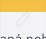
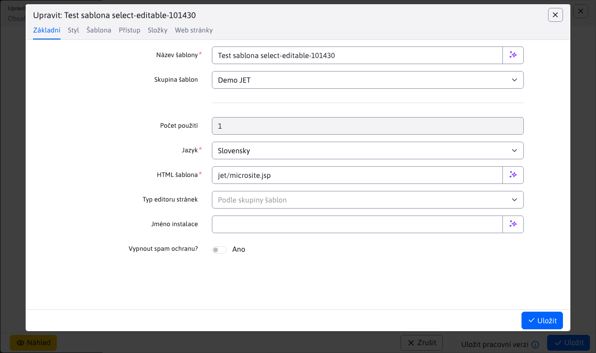

# Výběrové pole s možností editace

Pro číselníková pole lze doplnit ikonu pro editaci nebo přidání nového záznamu. Pole se zobrazuje jako standardní výběrové pole, ale obsahuje ikonu  pro editaci zvoleného záznamu, nebo ikonu  pro přidání nového záznamu.

Ukázka je z editace web stránek, kde lze vybrat šablonu ve výběrovém poli **Šablona web stránky**.


Někdy je ale třeba v šabloně něco zkontrolovat/upravit, proto možnost přímo z web stránky načíst do editoru zvolenou šablonu je výhodné. Výsledkem je načtení vnořeného dialogového okna s editací např. šablony:



## Použití anotace

Pole se aktivuje nastavením atributů editoru pomocí anotace `@DataTableColumnEditorAttr`:

```java
@Column(name = "temp_id")
@DataTableColumn(
        inputType = DataTableColumnType.SELECT,
        editor = {
                @DataTableColumnEditor(attr = {
                        @DataTableColumnEditorAttr(key = "data-dt-edit-url", value = "/admin/v9/templates/temps-list/?tempId={id}"),
                        @DataTableColumnEditorAttr(key = "data-dt-edit-perms", value = "menuTemplates")
                })
        }
)
private Integer tempId;
```

Podporovány jsou následující atributy, povinné je pouze `data-dt-edit-url`, vždy ale doporučujeme nastavit i pole `data-dt-edit-perms`:
- `data-dt-edit-url` - URL adresa web stránky pro editaci záznamu, do hodnoty `{id}` se přenese aktuálně zvolená hodnota ve výběrovém poli.
- `data-dt-edit-perms` - jméno práva, pokud uživatel toto právo nemá, možnost editace záznamu se nezobrazí (pole se zobrazí jako standardní výběrové pole).
- `data-dt-edit-title` - (nepovinné) překladový klíč titulku okna, není-li zadáno použije se název pole z editoru.

Při volání web stránky je pro url možné zadat speciální značky pro otevření karty Systém, nebo Koš:

```java
@DataTableColumnEditorAttr(key = "data-dt-edit-url", value = "/admin/v9/webpages/web-pages-list/?groupid=SYSTEM&docid={id}")
...
@DataTableColumnEditorAttr(key = "data-dt-edit-url", value = "/admin/v9/webpages/web-pages-list/?groupid=TRASH&docid={id}")
...
```

## Poznámky k implementaci

Implementace je v souboru `/admin/v9/npm_packages/webjetdatatables/field-type-select-editable.js` a přes volání `$.fn.dataTable.Editor.fieldTypes.select.create` upravuje původní pole typu `select` z Datatables Editoru. Úprava spočívá v přidání tlačítek pro editaci a přidání záznamu. Klepnutí na jedno z těchto tlačítek volá funkci `openIframeModal` pro otevření iframe dialogu.

V události `onload` se přidá poslech události k otevření a zavření okna editoru ve vnořeném dialogovém okně. Při události `WJ.DTE.close` (tedy zavření okna editoru) se zavře iframe dialog a vyvolá se obnovení dat datatabulky. To způsobí i obnovení hodnot ve výběrových polích.

Při události `WJ.DTE.open` se vnořenému editoru nastaví titulek okna podle zadaného atributu `data-dt-edit-title`, nebo podle jména pole v editoru.

Otevření příslušného záznamu k editaci zabezpečuje [datatable-opener.js](../libraries/datatable-opener.md), který pro záznam s `?id=-1` vyvolá kliknutí na tlačítko přidání záznamu.

Po uložení se provede obnovení dat datatabulky voláním `EDITOR.TABLE.wjUpdateOptions();`. To volá na REST rozhraní `/all` pro získání `json.options` údajů výběrových polí.

### Způsob zobrazení

Ve vnořeném dialogovém okně nechceme zobrazovat datatabulku, ani navigační možnosti, ale pouze samotný editor. To je zajištěno pomocí CSS stylů:
- v `app-init.js` je pro případ okna v iframu nastavena CSS třída `in-iframe` na `html` značce. Nastavuje se podle URL parametru `showOnlyEditor=true` který se přidává při otevření dialogu k URL automaticky. Dialog pro ostatní případy nastavuje CSS třídu `in-iframe-show-table`, která ponechá zobrazenou i datatabulku. Parametrem `showEditorFooterPrimary=true` je možné zobrazit patičku s aktivním primárním tlačítkem (pokud se Uložení neprovádí vnořeným způsobem).
- po inicializaci je vyvolána událost `WJ.iframeLoaded`, která následně spustí kód funkce `onload`, [iframe dialogu](../frameworks/webjetjs.md?id=iframe-dialóg).

V souboru `src/main/webapp/admin/v9/src/scss/3-base/_modal.scss` je nastaveno zobrazení v režimu `html.in-iframe`, které schová celý `.ly-page-wrapper` ve kterém je datatabulka a celé GUI.

Jelikož ale načítání může chvíli trvat zobrazuje se element `#modalIframeLoader` (který je standardně skrytý) a schová se po provedení `onload` události. Takto uživatel ví, že se ještě něco načítá (inicializuje se editor).
