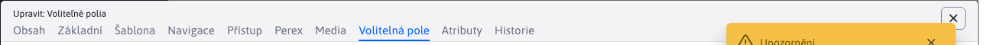
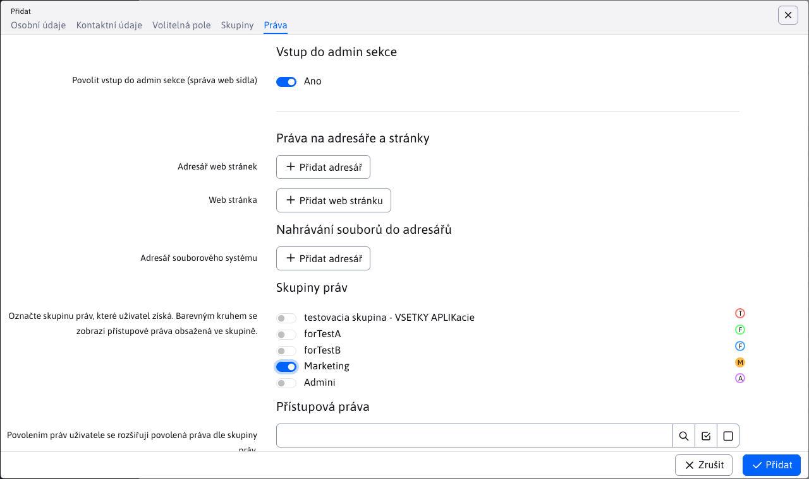

# Typy polí pro editor

V editoru lze použít všechna standardní pole formuláře.

## ID

Reprezentuje sloupec s primárním klíčem, příklad:

```java
public class CalendarEventsEntity {

    @Id
    @Column(name = "calendar_id")
    @GeneratedValue(strategy = GenerationType.IDENTITY, generator = "S_calendar")
    @DataTableColumn(inputType = DataTableColumnType.ID, title="ID")
    private Long id;

}
```

## OPEN\_EDITOR

Pole textového typu, které zobrazuje odkaz pro otevření editoru záznamu, například:

```java
    @Column(name = "title")
    @DataTableColumn(
        inputType = DataTableColumnType.OPEN_EDITOR,
        title="calendar.name",
        tab = "basic"
    )
    @NotBlank
    private String title;
```

## TEXT

Standardní textové pole, příklad:

```java
    @DataTableColumn(inputType = DataTableColumnType.TEXT, title="components.contact.property.street")
    private String street;
```



## NUMBER / TEXT\_NUMBER

Textové pole `type="number"`, prohlížeč obvykle také zobrazuje šipky v poli pro přiblížení nebo oddálení zadané hodnoty. Příklad: Na obrázku se zobrazí obrázek, ve kterém se zobrazí informace, které se mají zobrazit:

```java
    @Column(name = "priority")
	@NotNull
    @DataTableColumn(
        inputType = DataTableColumnType.NUMBER,
        title="components.banner.priority",
		tab = "main"
    )
	private Integer priority;
```

Rozdíl mezi `NUMBER` a `TEXT_NUMBER` je v zobrazení datové tabulky. `TEXT_NUMBER` zobrazí zaokrouhlené číslo, vyšší číslo vypíše v textové podobě, např. `10 tis.` místo `10000`. V editoru se chová stejně (zobrazí se přesná hodnota).

## PASSWORD

Textové pole `type="password"` zadat heslo.

```java
    @DataTableColumn(
        inputType = DataTableColumnType.PASSWORD,
        title = "components.user.password",
        tab = "personalInfo",
        className = "required"
    )
    @Transient //toto nechceme citat z DB
    private String password;
```

## TEXTAREA

Víceřádkové textové pole.

```java
    @Column(name = "gallery_perex")
    @DataTableColumn(
        inputType = DataTableColumnType.TEXTAREA,
        title = "editor.tab.perex",
        tab = "basic"
    )
    private String perex = "";
```

## DATE

Při výběru data se po kliknutí do pole zobrazí okno pro výběr data.

Všimněte si nastavení `@Temporal(TemporalType.TIMESTAMP)` pro správnou konverzi polí do databázových sloupců (vyžadováno JPA).

```java
    @Column(name = "date_from")
	@Temporal(TemporalType.TIMESTAMP)
	@DataTableColumn(
        inputType = DataTableColumnType.DATE,
        title="calendar.begin",
        tab = "basic"
    )
	private Date dateFrom;
```

## DATETIME

Podobná oblast jako `DATE` ale kromě toho umožňuje také výběr času.

```java
    @Column(name = "date_to")
	@Temporal(TemporalType.TIMESTAMP)
	@DataTableColumn(
        inputType = DataTableColumnType.DATETIME,
        title="components.banner.dateTo",
		visible = false,
		tab = "restrictions"
    )
	private Date dateTo;
```

## TIME\_HM a TIME\_HMS

Pole podobná `DATETIME` ale umožňují pouze výběr času. Verze `TIME_HM` je výběr času pomocí hodin a minut. Verze `TIME_HMS` umožňuje vybrat čas pomocí hodin, minut a sekund.

Všimněte si nastavení `@Convert(converter = DefaultTimeValueConverter.class)` který nastaví stejné datum pro každý zvolený čas, a to `01.01.2000` přičemž výběr času zůstává nezměněn. Stejné nastavení data není viditelné, ale je důležité z hlediska toho, jak funguje při filtrování záznamů pomocí těchto časových polí.

Je třeba mít na paměti, že třída `DefaultTimeValueConverter` provedené `AttributeConverter`, což ze své podstaty znamená, že tento převodník funguje pouze tehdy, když se jedná o sloupec v entitě, která představuje sloupec databáze. Pokud vybraný sloupec toto nesplňuje, musíte jeho hodnotu nastavit pomocí některé ze statických funkcí obsažených ve třídě `DefaultTimeValueConverter`.

```java
    @Column(name = "reservation_time_to")
    @DataTableColumn(
        inputType = DataTableColumnType.TIME_HM,
        title="components.reservation.reservation_objects.date_to",
        visible = false,
        tab = "basic"
    )
    @Convert(converter = DefaultTimeValueConverter.class)
    private Date reservationTimeTo;
```

## VYBRAT

Výběrové pole, nastavené podle typu `DataTableColumnType.SELECT`.


Je důležité definovat možnosti výběrového pole:

### Přenosem dat ze služby REST

Při čtení datové tabulky je možné přenášet nejen záznamy, ale také tzv. `option` Atributy. Ty jsou pak také nastaveny jako možnosti pro zadaná pole. Volby lze nastavit přepsáním metody `getOptions`.

```java
public class ContactRestController extends DatatableRestControllerV2<ContactEntity, Long> {

    @Override
    public void getOptions(DatatablePageImpl<ContactEntity> page) {

        //pridaj zoznam pre pole country
        page.addOptions("country", getCountries(), "label", "value", false);
    }

    /**
     * Vrati zoznam vyberoveho pola pre krajinu
     * @return
     */
    public static List<LabelValue> getCountries() {
        //vytvor zoznam krajin, toto by sa idealne malo citat z nejakeho ciselnika
        List<LabelValue> countries = new ArrayList<>();
        countries.add(new LabelValue("Slovenská republika", "sk"));
        countries.add(new LabelValue("Česká republika", "cz"));
        countries.add(new LabelValue("Rakúsko", "at"));

        return countries;
    }
}


public class ContactEntity {

    @DataTableColumn(inputType = DataTableColumnType.SELECT, title="components.contact.property.country")
    private String country;

}
```

Upozornění: pokud jste metodu přepsali, také `getAll(Pageable pageable)` je třeba zavolat `getOptions` ve svém kódu metody `getAll`.

### Propojením s číselníkem

V aplikaci číselníků lze snadno vytvářet uživatelsky editovatelné seznamy dat. Ty lze použít jako možnosti výběrových polí. To se nastavuje pomocí hodnoty `enumeration:MENO-CISELNIKA`:

```java
public class ContactEntity {

    @DataTableColumn(inputType = DataTableColumnType.SELECT, tab = "basic", editor = {
        @DataTableColumnEditor(
            options = {
                //ukazka napojenia na ciselnik, mozne je zadat meno alebo ID ciselnika, vo value su mena property pre text a hodnotu option pola
                @DataTableColumnEditorAttr(key = "enumeration:Okresne Mestá", value = "string1:string2")
            }
        )
    })
    private String country;

}
```

### Propojení s třídou Java

Pokud jsou data získána speciálním způsobem, můžete získat seznam možností zavoláním třídy jazyka Java, která vrací seznam dat. Ten je nastaven hodnotou `method:PACKAGE.TRIEDA.METODA` přičemž `value` je možné zadat názvy atributů pro načtení textu a hodnot ve formátu `LABEL-PROPERTY:VALUE-PROPERTY`.

```java
public class ContactRestController extends DatatableRestControllerV2<ContactEntity, Long> {
    /**
     * Vrati zoznam vyberoveho pola pre krajinu
     * @return
     */
    public static List<LabelValue> getCountries() {
        //vytvor zoznam krajin, toto by sa idealne malo citat z nejakeho ciselnika
        List<LabelValue> countries = new ArrayList<>();
        countries.add(new LabelValue("Slovenská republika", "sk"));
        countries.add(new LabelValue("Česká republika", "cz"));
        countries.add(new LabelValue("Rakúsko", "at"));

        return countries;
    }
}

public class ContactEntity {

    @DataTableColumn(inputType = DataTableColumnType.SELECT, tab = "basic", editor = {
        @DataTableColumnEditor(
            options = {
                //ukazka ziskania zoznamu krajin volanim statickej metody, vo value su mena property pre text a hodnotu option pola
                @DataTableColumnEditorAttr(key = "method:sk.iway.basecms.contact.ContactRestController.getCountries", value = "label:value")
            }
        )
    })
    private String country;

}
```

### Uvedením možností přímo v entitě

Jednotlivé možnosti můžete přímo vypsat pomocí seznamu `@DataTableColumnEditorAttr`, jako zobrazený text (atribut `key`), můžete použít překladový klíč:

```java
	@Column(name = "banner_type")
    @DataTableColumn(
        inputType = DataTableColumnType.SELECT,
        title="[[#{components.banner.banner_type}]]",
		tab = "main",
		editor = {
			@DataTableColumnEditor(
				options = {
					@DataTableColumnEditorAttr(key = "components.banner.picture", value = "1"),
					@DataTableColumnEditorAttr(key = "components.banner.html", value = "3"),
					@DataTableColumnEditorAttr(key = "components.banner.content_banner", value = "4")
				}
			)
		}
    )
	private Integer bannerType;
```

Všimněte si, že i když zadáváte hodnoty do value jako řetězec, jsou správně převedeny na číslo (technicky je v kódu HTML vše řetězec, ale Spring je při odesílání a zobrazování správně převádí).

## MULTISELECT

Do pole pro výběr z více možností zadejte `DataTableColumnType.MULTISELECT`. Umožňuje pracovat s polem objektů nebo se seznamem odděleným čárkou (po nastavení atributu `separator` ve kterém zadáte oddělovací znak).


Příklady použití:

```java
public class ContactEntity {

    @DataTableColumn(inputType = DataTableColumnType.MULTISELECT, title="multiple", filter = true, editor = {
        @DataTableColumnEditor(
            options = {
                @DataTableColumnEditorAttr(key = "method:sk.iway.basecms.contact.ContactRestController.getCountries", value = "label:value")
            }
        )
    })
    private String[] multiple;

    @DataTableColumn(inputType = DataTableColumnType.MULTISELECT, title="multipleInt", filter = true, editor = {
        @DataTableColumnEditor(
            options = {
                    @DataTableColumnEditorAttr(key = "1-Jedna", value = "1"),
                    @DataTableColumnEditorAttr(key = "2-Dva", value = "2"),
                    @DataTableColumnEditorAttr(key = "3-Tri", value = "3"),
                    @DataTableColumnEditorAttr(key = "4-Styri", value = "4"),
                    @DataTableColumnEditorAttr(key = "5-Pat", value = "5"),
            }
        )
    })
    private Integer[] multipleInt;


    @DataTableColumn(inputType = DataTableColumnType.MULTISELECT, title="multipleOddeleneCiarkou", filter = true, editor = {
        @DataTableColumnEditor(
            options = {
                    @DataTableColumnEditorAttr(key = "1-Jedna", value = "Jedna"),
                    @DataTableColumnEditorAttr(key = "2-Dva", value = "Dva"),
                    @DataTableColumnEditorAttr(key = "3-Tri", value = "Tri"),
                    @DataTableColumnEditorAttr(key = "4-Styri", value = "Styri"),
                    @DataTableColumnEditorAttr(key = "5-Pat", value = "Pat"),
            },
            separator = ","
        )
    })
    private String multipleOddeleneCiarkou;

}
```

Pro atribut `multipleOddeleneCiarkou` hodnoty jsou odděleny znakem definovaným v atributu `separator`. Takže hodnota po odeslání bude vypadat např. takto. `"Tri,Pat"`.

Hodnoty oddělené čárkou by se měly používat pro `MULTISELECT` pole používaná pro nastavení aplikace (pomocí anotace). `@WebjetAppStore`):

```java
@WebjetComponent("sk.iway.basecms.contact.ContactApp")
@WebjetAppStore(nameKey = "Kontakty", descKey = "Ukazkova aplikacia so zoznamom kontaktov", imagePath = "ti ti-id", galleryImages = "/components/map/screenshot-1.jpg,/components/gdpr/screenshot-2.png,/components/gallery/screenshot-3.jpg")
@Getter
@Setter
public class ContactApp extends WebjetComponentAbstract {

    /**
     * Privatne vlastnosti s get/set-rami slúžia na prenesenie parametrov pageParams z !INCLUDE()! do triedy
     * Pomocou anotacie @DataTableColumn vytvarame pole pre nastavenie aplikacie
     */
    @DataTableColumn(inputType = DataTableColumnType.MULTISELECT, tab = "basic", editor = {
        @DataTableColumnEditor(
            options = {
                @DataTableColumnEditorAttr(key = "method:sk.iway.basecms.contact.ContactRestController.getCountries", value = "label:value")
            },
            separator = ","
        )
    })
    private String countries;
}
```

## CHECKBOX

Standardní zaškrtávací políčko, umožňuje pracovat s polem objektů (výběr více možností). Použití atributu `unselectedValue` je nastaveno, pokud je pole nezaškrtnuté.

Můžete také použít možnost nastavení atributu `data-dt-field-headline` pro samostatný nadpis nad seznamem polí.

```java
    @DataTableColumn(
        inputType = DataTableColumnType.CHECKBOX,
        title = "editor.perex.group",
        sortAfter = "publishType",
        tab="filter",
        editor = {
            @DataTableColumnEditor(
                attr = {
                    @DataTableColumnEditorAttr(key = "unselectedValue", value = "")
                }
            )
        }
    )
	private String[] perexGroupsIds;


    @DataTableColumn(inputType = DataTableColumnType.CHECKBOX, title = "user.permissions.label", tab = "groupsTab", visible = false, editor = {
        @DataTableColumnEditor(attr = {
            @DataTableColumnEditorAttr(key = "data-dt-field-headline", value = "user.admin.editUserGroups"),
            @DataTableColumnEditorAttr(key = "unselectedValue", value = "") }) })
    private Integer[] permisions;
```

## RADIO

Standardní pole pro výběr jedné z možností.

```java
    @Column(name = "sex_male")
    @DataTableColumn(
        inputType = DataTableColumnType.RADIO,
        title = "components.user.newuser.sexMale",
        tab = "personalInfo",
        editor = {
            @DataTableColumnEditor(
                options = {
                    @DataTableColumnEditorAttr(key = "reguser.male", value = "true"),
                    @DataTableColumnEditorAttr(key = "reguser.female", value = "false")
                }
            )
        }
    )
    private Boolean sexMale;
```

## BOOLEAN

Představuje zjednodušený zápis typu pole `CHECKBOX` pro binární volbu ano/ne.

```java
    @Column(name = "require_approve")
    @DataTableColumn(
        inputType = DataTableColumnType.BOOLEAN,
        title = "groupedit.require_approve",
        tab = "basic"
    )
    private Boolean requireApprove;
```

## HIDDEN

Skryté pole, v editoru se nezobrazí.

```java
	@Column(name = "domain_id")
	@DataTableColumn(
        inputType = DataTableColumnType.HIDDEN,
		tab="basic"
    )
	private Integer domainId;
```

## DISABLED

Zobrazí textové pole, jehož hodnotu nelze změnit. V příkladu si všimněte, že typy polí lze kombinovat. Nastavení `DISABLED` nastaví atribut HTML `disabled="disabled"`.

```java
    @Size(max = 255)
    @Column(name = "image_name")
    @DataTableColumn(inputType = {DataTableColumnType.OPEN_EDITOR, DataTableColumnType.DISABLED}, tab = "metadata", title="components.gallery.fileName")
    private String imageName;
```

## QUILL

Zobrazí jednoduchý editor HTML, který umožňuje základní formátování textu, například tučné/velké písmo/podtržení, nadpisy, seznamy a odkazy.

Všimněte si použití převodníku `@javax.persistence.Convert(converter = AllowSafeHtmlAttributeConverter.class)` která vám umožní odesílat pouze [zabezpečený kód HTML](../backend/security.md) (bez vložených prvků JavaScriptu atd.).

```java
    @Column(name = "l_description_sk")
    @DataTableColumn(
            inputType = DataTableColumnType.QUILL,
            title = "[[#{gallery.l_description}]] <span class='lang-shortcut'>sk</span>",
            tab = "description"
    )
    @javax.persistence.Convert(converter = AllowSafeHtmlAttributeConverter.class)
    private String descriptionLongSk;
```


## WYSIWYG

Zobrazí plnohodnotný editor HTML, který se používá pro úpravu webových stránek.

```java
    @Column(name = "description")
    @DataTableColumn(
        inputType = DataTableColumnType.WYSIWYG,
        title = "calendar_edit.description",
        tab = "description",
        hidden = true
    )
    private String description;
```

pole musí být použito na samostatné kartě, která má nastavený atribut `content: ''`:

```javascript
    var tabs = [
        { id: 'basic', title: /*[[#{calendar_events.tab.basic}]]*/ 'basic', selected: true},
        { id: 'description', title: /*[[#{calendar_events.tab.description}]]*/ 'desc', content: '' },
        { id: 'advanced', title: /*[[#{calendar_events.tab.advanced}]]*/ 'adv' },
        { id: 'notification', title: /*[[#{calendar_events.tab.notification}]]*/ 'notify' }
    ];
```

## JSON

Pole [přidávání adresářů a webových stránek](field-json.md).

```java
    @DataTableColumn(inputType = DataTableColumnType.JSON, title="admin.temp.edit.showForDir", className = "dt-tree-group-array")
    private List<GroupDetails> availableGroups;
```


## DATOVÁ TABULKA

Pole [vnořená datová tabulka v editoru](field-datatable.md).

```java
    @Transient
    @DataTableColumn(inputType = DataTableColumnType.DATATABLE, title = "&nbsp;",
        tab = "folders",
        editor = { @DataTableColumnEditor(
            attr = {
                @DataTableColumnEditorAttr(key = "data-dt-field-dt-url", value = "/admin/rest/groups?userGroupId={id}"),
                @DataTableColumnEditorAttr(key = "data-dt-field-dt-columns", value = "sk.iway.iwcm.doc.GroupDetails"),
                @DataTableColumnEditorAttr(key = "data-dt-field-dt-forceVisibleColumns", value = "groupId,groupName,fullPath"),
                @DataTableColumnEditorAttr(key = "data-dt-field-dt-updateColumnsFunction", value = "updateColumnsGroupDetails"),
                @DataTableColumnEditorAttr(key = "data-dt-field-dt-hideButtons", value = "create,edit,duplicate,remove,import,celledit"),
                @DataTableColumnEditorAttr(key = "data-dt-field-full-headline", value = "user.group.groups_title"),
                @DataTableColumnEditorAttr(key = "data-dt-field-dt-serverSide", value = "false")
            }
        )
    })
    private List<GroupDetails> groupDetailsList;
```

## ELFINDER

Pole pro [výběr souborů](field-elfinder.md) (odkaz na soubor).

```java
    @Column(name = "watermark")
    @DataTableColumn(
        inputType = DataTableColumnType.ELFINDER,
        title = "components.gallery.watermark",
        tab = "watermark"
    )
    private String watermark;
```


## JSTREE

Pole pro výběr [stromové struktury](field-jstree.md).

```java
    @DataTableColumn(inputType = DataTableColumnType.JSTREE, title = "components.user.righrs.user_group_rights", tab = "rightsTab", hidden = true,
    editor = {
        @DataTableColumnEditor(attr = {
                @DataTableColumnEditorAttr(key = "data-dt-field-headline", value = "components.user.permissions"),
                @DataTableColumnEditorAttr(key = "data-dt-field-jstree-name", value = "jstreePerms") }) })
    private String[] enabledItems;

    @DataTableColumn(inputType = DataTableColumnType.JSTREE, title = "user.permgroups.permissions.title", tab = "perms", hidden = true, editor = {
        @DataTableColumnEditor(attr = {
                @DataTableColumnEditorAttr(key = "data-dt-field-jstree-name", value = "jstreePerms") }) })
    private String[] permissions;
```


