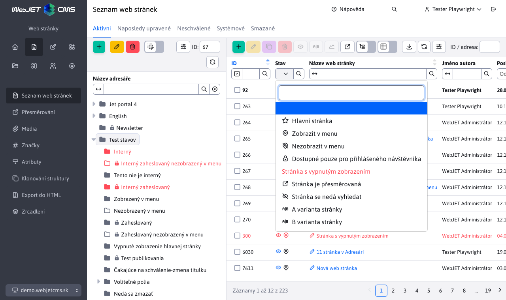

# Datatables

Knihovna [datatables.net](http://datatables.net) je pokročilá tabulka s napojením na REST služby.

## Základní inicializace v spolupráce s Spring REST

WebJET implementace datatables se konfiguruje pomocí JSON objektu columns. V tomto objektu je definice sloupců pro datatabulku i pro datatables editor. Konstruktorem WJ.DataTable se následně tabulka inicializuje.

Doporučujeme ale vždy generovat columns objekt z [anotací Java entity](../datatables-editor/datatable-columns.md).

Základní příklad:

```javascript
script.
    let galleryTable = null;
    window.domReady.add(function () {

        //URL adresa REST sluzby
        let url = "/admin/rest/components/gallery";

        //definicia stlpcov
        let columns = [
            {
                data: "id",
                name: "id",
                title: "ID",
                defaultContent: '',
                className: 'dt-select-td',
                renderFormat: "dt-format-selector"
            },
            {
                data: "imageName",
                name: "",
                title: "",
                render: function ( data, type, row ) {
                    //specialna render funkcia pre zobrazenie obrazka galerie
                    return '<div class="img" style="background-image:url(' + row.imagePath + '/' + data +');"></div>';
                },
                className: "dt-image",
                renderFormat: "dt-format-none"
            },
            {
                data: "imageName",
                name: "imageName",
                title: "Nazov suboru",
                renderFormat: "dt-format-text",
                renderFormatLinkTemplate: "javascript:;",
                renderFormatPrefix: '<i class="ti ti-pencil"></i> ',
                className: "dt-row-edit",

                editor: {
                    type:  "text"
                }
            },
            {
                data: "imagePath",
                name: "imagePath",
                title: "Adresar",
                renderFormat: "dt-format-text",

                editor: {
                    type:  "text",
                    attr: {
                        "data-dt-field-hr": "after"
                    }
                }
            }
        ];

        /*
        options pre DataTabulku
        {
            src: zdrojove data (objekt)
            url: URL adresa rest sevisu
            serverSide: ak je nastavene na true bude sa vyhladavanie/sortovanie/strankovanie posielat na server
            columns: definicia stlpcov
            tabs: definicia zaloziek pre Editor
            hideTable: boolean po nastaveni na true sa datatabulka nezobrazi
            noAll: boolean, po nastaveni na true sa nebude k url pridavat /all pre ziskanie vsetkych zaznamov
        }
        */

        galleryTable = WJ.DataTable( {
            url: url,
            serverSide: true,
            columns: columns,
        });

    });


<table class="datatableInit table cardView cardViewS"></table>
```

## Možnosti konfigurace

```javascript
    WJ.DataTable( {
        Options
    });
```

Možnosti konfigurace (`options`):

Minimální konfigurace:
- `url {string}` URL adresa endpointu REST služby pro získání dat. K této URL si datatable přidá `/all` pro získání všech dat (není-li nastavena možnost noAll), `findByColumns` pro vyhledávání, případně `/editor` pro uložení dat.
- `columns {json}` definice sloupců, ideální z [Java anotací](../datatables-editor/datatable-columns.md).

**Ostatní možnosti:**

- `serverSide {boolean}` při hodnotě `true` očekává použití stránkování a uspořádání na serveru voláním REST služeb, při hodnotě `false` provádí stránkování a uspořádání lokálně nad prvotně získanými daty.
- `tabs {json}` definice [karet pro editor](../datatables-editor/README.md#karty-v-editoru).
- `id {string}` jednoznačný identifikátor datatabulky, pokud není zadán použije se hodnota `datatableInit`. Potřebné hlavně pokud máte v jedné web stránce více datatabulky.
- `editorId {string}` jednoznačný identifikátor editoru, pokud není zadán použije se hodnota `id`. Potřebné hlavně pokud máte v jedné web stránce více datatabulky.
- `onXhr {function}` JavaScript funkce, která se zavolá po [načtení dat](https://datatables.net/reference/event/xhr) ve formě `function ( TABLE, e, settings, json, xhr ) {}`.
- `onPreXhr(TABLE, e, settings, data) {function}` JavaScript funkce, která se zavolá [před načtením dat](https://datatables.net/reference/event/preXhr), umožňuje přidat do odesílaných dat parametry. Ty se zadávají s prefixem `fixed_` aby šli odlišit od standardních parametrů datatabulky. Příklad: `onPreXhr: function(TABLE, e, settings, data) { data.fixed_searchFilterBotsOut = $('#botFilterOut').is(':checked'); }`.
- `onEdit(TABLE, row, dataAfterFetch, dataBeforeFetch) {function}`: JavaScript funkce, která se zavolá po kliknutí na odkaz editace záznamu. Jako parametry dostane: `TABLE` - instance datatabulky, `row` - jQuery objekt řádku na který se kliklo, `dataAfterFetch` - při zapnuté funkci `fetchOnEdit` json data získaná po jejich obnově, `dataBeforeFetch` původní JSON data řádku pro voláním jejich obnovení. Standardní editor otevřete následně voláním `TABLE.wjEdit(row);`. Příklad použití je ve [web-pages-list.pug](../../../src/main/webapp/admin/v9/views/pages/webpages/web-pages-list.pug).
- `fetchOnCreate {boolean}` po nastavení na true bude před vytvořením nového záznamu provedeno REST volání s hodnotou -1 pro získání dat nového objektu. Hodnoty se nastaví voláním `EDITOR.setJson(json)` implementováno v `$.fn.dataTable.Editor.prototype.setJson` v eventu `initCreate`.
- `fetchOnEdit {boolean}` po nastavení na true bude před editací záznamu provedeno REST volání pro získání aktuálních dat editovaného záznamu. Při použití datatabulky např. pro web stránky se před otevřením editoru aktualizuje daný záznam ze serveru a do editoru se tedy otevře vždy nejnovější verze. Implementováno přes JS funkci `refreshRow` a zákaznické tlačítko `$.fn.dataTable.ext.buttons.editRefresh` kterým se nahradí standardní tlačítko `edit`.
- `idAutoOpener {boolean}` umožňuje nastavením na `false` deaktivovat [automatické otevírání editoru](../libraries/datatable-opener.md) podle URL parametru a vložení pole pro zadání ID do hlavičky tabulky.
- `hideTable {boolean}` po nastavení na `true` se datatabulka nezobrazí ve stránce (bude skrytá).
- `jsonField {function}` definice pro pole [typu json](../datatables-editor/field-json.md#použití-specifických-json-objektů).
- `order {array}` výchozí [způsob uspořádání](#uspořádání) tabulky.
- `paging {boolean}` false vypne stránkování datatabulky (zobrazí se všechna vrácená data ze serveru, nezobrazí se možnost nastavení velikosti stránky).
- `nestedModal {boolean}` pokud je nastaveno na true, jedná se o datatabulku vloženou jako pole v editoru - [vnořená datatabulka](../datatables-editor/field-datatable.md), vnořená tabulka má přidanou CSS třídu `DTE_nested_modal`.
- `noAll {boolean}` ve výchozím nastavení k nastavené url přidá `/all` pro získání všech dat, nastavením `noAll` na `false` se `/all` nepřidá, nebude ale funkční ani vyhledávání.
- `initialData {variable}` data pro prvotní zobrazení (bez potřeby volání REST služby), viz dokumentace k [optimalizaci rychlosti zobrazení](../apps/webpages/README.md) seznamu web stránek. Technicky je-li nastaven tento objekt tak při prvním zobrazení se nevolá REST služba ale se použijí zadaná data.
- `initialData.forceData {boolean}` po nastavení na `true` se použijí iniciální data bez ohledu na jejich velikost, používá se typicky když iniciální data jsou prázdný objekt, protože se následně získají jiným způsobem. Pro získání prázdných dat můžete použít funkci `initialData:  dtWJ.getEmptyData(true)`.
- `hideButtons {string}` čárkou oddělený seznam jmen tlačítek, která se mají automaticky v datatabulce schovat (nezobrazit). `create,edit,duplicate,remove,import,celledit`.
- `removeColumns {string}` čárkou oddělen seznam sloupců, které se nemají zobrazit, i když jsou v definici (pokud např. zobrazujete datatabulku na více místech a nepotřebujete všechny sloupce). Např. `whenToPublish,datePublished`.
- `forceVisibleColumns` čárkou oddělený seznam sloupců které se zobrazí (přepíší nastavené sloupce uživatelem), používá se typicky ve vnořené datatabulce, kde je třeba zobrazit jen některé sloupce.
- `updateColumnsFunction` jméno JavaScript funkce, která se použije pro úpravu seznamu sloupců. Používá se typicky ve vnořené datatabulce, kde je třeba doplnit/upravit zobrazené sloupce (viz ukázka níže).
- `perms` nastaví [práva pro zobrazení tlačítek](#tlačítka-podle-práv) pro přidání, editaci, duplikování a mazání údajů
- `lastExportColumnName` pokud je zadané zobrazí v exportním dialogu možnost exportovat zatím neexportované údaje (používá se ve formulářích). Hodnota reprezentuje jméno sloupce, který se přidává jako `NULL` podmínka do výběru dat (je třeba korektně implementovat v REST službě).
- `byIdExportColumnName` pokud je zadáno v exportním dialogu povolí export podle zvolených řádků. Hodnota je jméno sloupce v databázi s ID hodnotou (typicky id, používá se ve formulářích). Filtrování je třeba implementovat jako `predicates.add(root.get("id").in(idsList));` v REST službě.
- `editorButtons` pole tlačítek, která se zobrazí v editoru. Příklad `editorButtons: [ {title: "Uložiť", action: function() { this.submit(); } }, { title: ...} ]`. Využívá API pro Datatables Editor.
- `createButtons` pole tlačítek pro přidání nového záznamu, formát stejný jako pro `editorButtons`.
- `keyboardSave {boolean}` - nastavením na hodnotu `false` deaktivujete možnost uložit záznam v editoru klávesovou zkratkou `CTRL+S/CMS+S`.
- `stateSave {boolean}` - nastavením na hodnotu `false` deaktivujete možnost pamatování pořadí sloupců a uspořádání tabulky v prohlížeči.
- `customFieldsUpdateColumns {boolean}` - nastavením na hodnotu `true` se při získání [volitelných polí](../datatables-editor/customfields.md) aktualizují také názvy sloupců v tabulce a v nastavení zobrazených sloupců (výchozí hodnota `false` se názvy volitelných pole aktualizují pouze v editoru).
- `customFieldsUpdateColumnsPreserveVisibility {boolean}` - nastavením na hodnotu `true` se pro uživatele zachová nastavení zobrazení sloupců pro režim `customFieldsUpdateColumns`. Lze použít pouze v případě, kdy pro datatabulku nejsou měněny sloupce během zobrazení. Např. v sekci Překladové klíče se data nemění, lze nastavit na `true`, ale v sekci Číselníky se mění i sloupce při změně číselníku, tam tato možnost není použitelná.
- `autoHeight {boolean}` - ve výchozím nastavení tabulka počítá svou výšku aby maximálně využila prostor okna. Nastavením na hodnotu `false` bude mít tabulka výšku podle obsahu (počtu řádků).
- `editorLocking {boolean}` - ve výchozím nastavení tabulka volá službu notifikace při editaci stejného záznamu více uživateli, pokud je toto nechtěné nastavte na hodnotu `false`.
- `updateEditorAfterSave {boolean}` - nastavením na `true` se aktualizuje obsah editoru po uložení dat (pokud editor zůstává otevřený).

```javascript
let columns = [
    {
        data: "audit",
        name: "audit",
        title: "Auditované",

        renderFormat:   "dt-format-checkbox"
                        "dt-format-selector"
                        "dt-format-text"
                        "dt-format-text-wrap"
                        "dt-format-none"
                        "dt-format-date-time"
                        "dt-format-select" //moznosti bere z editor: { options: }

        renderFormatLinkTemplate:   "javascript:;",
                                     "/temps-list.html"
        renderFormatPrefix: '<i class="ti ti-pencil"></i> ',
        renderHideValue: false, //TODO ???
        render: function ( data, type, row ) {
            //console.log("data", data, "type", type, "row", row);
            return '<div class="img" style="background-image:url(' + row.imagePath + '/' + data +');"></div>';
        },

        className: "dt-image",

        defaultContent: '',

        perms: "multiDomain" //stĺpec sa zobrazí len ak používateľ má právo multiDomain

    }
];

//Ukazka pouzitia updateColumnsFunction
//@DataTableColumnEditorAttr(key = "data-dt-field-dt-updateColumnsFunction", value = "updateColumnsGroupDetails"),
    function updateColumnsGroupDetails(columns) {
        //doplnenie kliknutia na stlpec fullPath
        WJ.DataTable.mergeColumns(columns, {
            name: "fullPath",
            renderFormatLinkTemplate: "javascript:openGroupDetails({{groupId}})"
        });
    }
    function openGroupDetails(groupId) {
        window.open("/admin/v9/webpages/web-pages-list/?groupid="+groupId);
    }
```

**Inicializování vyhledávání:**

Mohou existovat případy, kdy při zobrazení tabulky potřebujete ihned inicializovat i (zapamatované) vyhledávání. Používá se to v aplikaci Statistika, která si pamatuje rozsah nastavených dat od-do. Již při prvním volání REST služby jsou aplikována vyhledávací kritéria. Možnost se nastavuje JSON objektem v `options.defaultSearch`. Obsahuje seznam selektorů s hodnotou, které se aplikují do filtru před prvním voláním REST služby, např.:

```json
{
    ".dt-filter-from-dayDate": "06.06.2022",
    ".dt-filter-to-dayDate": "22.08.2022"
}
```

Příklad použití se zapamatováním v `sessionStorage` prohlížeče:

```javascript
//inicializacia datatabulky
errorDataTable = WJ.DataTable({
    url: url,
    serverSide: false, //false lebo sa nevyužíva repositár
    columns: columns,
    id: "errorDataTable",
    idAutoOpener: false,
    defaultSearch: ChartTools.getSearchCriteria(),
    onPreXhr: function(TABLE, e, settings, data) {
        //console.log('onPreXhr, url=', $('#searchUrl').val());
        data.fixed_searchurl = $('#searchUrl').val();
    }
});
//Onchange events - update table
$("#errorDataTable_extfilter").on("click", "button.filtrujem", function() {
    //reload table values
    ChartTools.saveSearchCriteria(errorDataTable.DATA);
    errorDataTable.ajax.reload();
});

//appModule
/**
 * Save last search criteria to session storage, so all stats page will have same criteria when loaded
 * @param {*} DATA
 */
export function saveSearchCriteria(DATA) {
    var inputs = [".dt-filter-from-dayDate", ".dt-filter-to-dayDate", "#rootDir", "#botFilterOut", "#searchUrl", ".dt-filter-lastLogon"];
    var defaultSearch = {};

    for (const name of inputs) {
        var value = $("#"+DATA.id+"_extfilter "+name).val();
        if ("true"===value) {
            //it's checkbox
            value = $("#"+DATA.id+"_extfilter "+name).is(":checked");
        }
        if (value != "" && value != "-1" && value != "false") defaultSearch[name] = value;
    }
    var json = JSON.stringify(defaultSearch);
    if (json != "{}") window.sessionStorage.setItem("webjet.apps.stat.filter", json);
    else window.sessionStorage.removeItem("webjet.apps.stat.filter");
}

/**
 * Gets saved search criteria from session storage
 * @returns
 */
export function getSearchCriteria() {
    var defaultSearch = window.sessionStorage.getItem("webjet.apps.stat.filter");
    if ("{}"==defaultSearch) defaultSearch = null;
    if (defaultSearch != null) {
        defaultSearch = JSON.parse(defaultSearch);
        for (const property in defaultSearch) {
            var value = defaultSearch[property];
            if (property == "#rootDir") {
                var $property = $(property)
                $property.val(value);
                $property.selectpicker("val", value);
            }
            if (property == "#botFilterOut") {
                $("#botFilterOut").prop("checked", value);
            }
            if (property == "#searchUrl") {
                $("#searchUrl").val(value);
            }
        }
    }
    return defaultSearch;
}
```

### Nastavení sloupců

`renderFormat`:
- `dt-format-selector` - zaškrtávací pole pro označení řádku, mělo by být jako první sloupec
- `dt-format-none` - sloupec nebude mít žádné možnosti v hlavičce
- `dt-format-text, dt-format-text-wrap` - standardní text, `escapuje` HTML kód
- `dt-format-select` - výběrové pole
- `dt-format-checkbox` - HTML typ `checkbox`
- `dt-format-boolean-true, dt-format-boolean-yes, dt-format-boolean-one` - `true/false` možnosti
- `dt-format-number, dt-format-percentage` - zobrazení čísla
- `dt-format-number--decimal, dt-format-percentage--decimal`
- `dt-format-number--text` - zobrazí zaokrouhlené číslo, při vyšším čísle vypíše v textové podobě. `10 tis.` místo `10000`
- `dt-format-filesize` - formátování velikosti souboru jako `10,24 kB`
- `dt-format-date, dt-format-date-time, dt-format-date--text, dt-format-date-time--text` - datum/čas, filtr zobrazí od-do
- `dt-format-link` - zobrazí text jako odkaz, možnost použít `renderFormatLinkTemplate`
- `dt-format-image` - zobrazí malý náhled obrázku a odkaz na jeho plné zobrazení, pod obrázkem je text linky na obrázek.
- `dt-format-mail` - zobrazí text jako email odkaz
- `dt-row-edit` - umožní editaci řádku

Pokud potřebujete aby sloupec měl specifickou (maximální) šířku je třeba tuto nastavit pomocí CSS na oba řádky v hlavičce pomocí CSS stylu `max-width`. Příklad:

```css
.datatableInit {
    thead tr {
        th.dt-th-editorFields-statusIcons {
            width: 75px;
            max-width: 75px;
        }
    }
}
```

Nastavení `max-width` zajistí nastavení šířky sloupce. Datatabulka dopočítá zbývající šířky. Pozor, pokud text přesahuje zadanou šířku oddálí v samotné tabulce další sloupce, pak nesedí šířka hlavičky a tabulky, je třeba případně na dané buňce nastavit `overflow` vlastnost. Buňce můžete přidat potřebný CSS styl nastavením atributu `className` v anotaci.

### Zobrazení HTML kódu

Datatabulka ve výchozím nastavení `escapuje` HTML znaky do entit, aby nedošlo k nechtěnému provedení HTML kódu. Pokud v buňce potřebujete zobrazit HTML kód lze v anotaci nastavit v atributu `className` CSS styl `allow-html`, který povolí provedení HTML kódu v buňce. Dávejte ale na toto použití pozor, aby se nemohla nastat chyba typu XSS.

```java
    @DataTableColumn(
        inputType = DataTableColumnType.TEXTAREA,
        title="[[#{admin.conf_editor.value}]]",
        className = "allow-html"
    )
    private String value;
```

## Přidání/odebrání tlačítek

Přes API je možné v `toolbare` odebrat/přidat tlačítka:

```javascript
//odstranenie tlacitka (kazde tlacitko ma atribut dt-dtbtn podla ktoreho viete zistit jeho meno)
galleryTable.hideButton("create");
galleryTable.hideButton("import");
galleryTable.hideButton("export");

//pridanie tlacitka na 5 poziciu
let buttonCounter = 5;
galleryTable.button().add(buttonCounter++, {
    text: 'S',
    action: function (e, dt, node) {
        switchGallerySize(e, dt, node, 'S');
    },
    className: 'btn btn-outline-secondary btn-gallery-size active',
    attr: {
        'title': 'Size S'
    }
});

galleryTable.button().add(buttonCounter++, {
    text: '<i class="ti ti-list-details"></i>',
    action: function (e, dt, node) {
        console.log("btn, e=",e,"dt=",dt,"node=",node);
        //ziskaj data selectnuteho riadku
        let selectedRows = dt.rows({ selected: true }).data();
    },
    init: function ( dt, node, config ) {
        //zobraz tlacidlo aktivne iba ked je oznaceny aspon jeden riadok
        $.fn.dataTable.Buttons.showIfRowSelected(this, dt);
        //ALEBO ked je oznaceny PRESNE jeden riadok
        //$.fn.dataTable.Buttons.showIfOneRowSelected(this, dt);
    },
    className: 'btn btn-outline-secondary btn-gallery-size',
    attr: {
        //zobrazi tooltip po prechode mysou
        title: 'Table view',
        'data-toggle': 'tooltip'
    }
});

//wrapnutie 4 tlacitok do grupy (v galerii prepinanie velkosti SMLT)
$('.btn-gallery-size').wrapAll('<div class="btn-group-wrapper buttons-divider-both" data-toggle="tooltip" data-original-title="Veľkosť obrázkov"><div class="btn-group btn-group-toggle gallery-buttons-size" /></div>');

//znova zobrazenie tlacidla
galleryTable.showButton("export");
```

V `init` funkci lze použít následující volání:
- `$.fn.dataTable.Buttons.showIfRowSelected(this, dt);` - tlačítko je aktivní pouze pokud je označen alespoň jeden řádek
- `$.fn.dataTable.Buttons.showIfRowUnselected(this, dt);` - tlačítko je aktivní pouze pokud není označen žádný řádek
- `$.fn.dataTable.Buttons.showIfOneRowSelected(this, dt);` - tlačítko je aktivní pouze pokud je označen přesně jeden řádek

## Tlačítko pro provedení serverové akce

Datatabulka nabízí možnost přidat tlačítko pro provedení serverové akce (např. rotace obrázku, smazání všech záznamů).

JS funkce `nejakaTable.executeAction(action, doNotCheckEmptySelection, confirmText, noteText, customData = null, forceIds = null)` má parametry:
- `action` (String) - jméno akce, která se odešle na server k provedení.
- `doNotCheckEmptySelection` (true) - nastavením na `true` se neprovede kontrola, zda jsou zvoleny nějaké řádky a do REST služby se jako ID zvoleného řádku pošle hodnota -1. Vhodné to je na tlačítka, která nepotřebují mít zvolené řádky, například. Obnovit všechny záznamy a podobně.
- `confirmText` (String) - je-li zadáno zobrazí se před provedením akce potvrzení (např. Jste si jisti, že chcete ...?).
- `noteText` (String) - doplňkový text zobrazený nad tlačítky pro potvrzení provedení akce (např. Operace může trvat několik minut).
- `customData` - objekt přidaný do volání REST služby jako parametr `customData` (např. dodatečné údaje potřebné pro korektní provedení akce).
- `forceIds` - číslo nebo pole čísel s hodnotou ID záznamu pro který se má akce provést. Využíváno pokud potřebujete kliknutím na stavovou ikonu vyvolat akci (bez potřeby označení řádku).

Na serveru se v REST službě provede volání `/action/rotate` implementováno v metodě [DatatableRestControllerV2.processAction](../../../src/main/java/sk/iway/iwcm/system/datatable/DatatableRestControllerV2.java). REST službě se pošle seznam vybraných řádků (jejich ID), což se zpracuje v metodě DatatablesRestControllerV2.action.

**Příklad použití** - přidáno tlačítko do `toolbaru` nad datatabulkou s voláním akce:

```javascript
cacheObjectsTable.button().add(3, {
    extends: 'remove',
    editor: cacheObjectsTable.EDITOR,
    text: '<i class="ti ti-camera"></i>',
    action: function (e, dt, node) {
        cacheObjectsTable.executeAction("deletePictureCache", true, "[[\#{components.data.deleting.imgcache.areYouSure}]]", "[[\#{components.data.deleting.imgcache.areYouSureNote}]]");
    },
    className: 'btn btn-danger',
    attr: {
        'title': '[[\#{components.memory_cleanup.deleteImageCache}]]',
        'data-toggle': 'tooltip'
    }
});
```

Tlačítko is kontrolou, že je zvolen nějaký řádek (v init option):

```javascript
galleryTable.button().add(buttonCounter++, {
    extends: 'remove',
    editor: galleryTable.EDITOR,
    text: '<i class="ti ti-repeat"></i>',
    action: function (e, dt, node) {
        //console.log("Rotate, e=",e," dt=",dt," node=",node);
        galleryTable.executeAction("rotate");
    },
    init: function ( dt, node, config ) {
        $.fn.dataTable.Buttons.showIfRowSelected(this, dt);
    },
    className: 'btn btn-outline-secondary',
    attr: {
        'title': 'Otočiť',
        'data-toggle': 'tooltip'
    }
});
```

Akce vyvolá následující události:
- `WJ.DT.executeAction` - po úspěšném provedení akce.
- `WJ.DT.executeActionCancel` - po neúspěšném provedení akce, nebo kliknutí na tlačítko Zrušit při potvrzení akce.

## Tlačítka podle práv

Pokud potřebujete zobrazovat tlačítka podle práv (např. tlačítko Přidat jen pokud má uživatel určité právo) je možné do konfigurace datatabulky přidat atribut `perms`:

```javascript
webpagesDatatable = WJ.DataTable({
    url: webpagesInitialUrl,
    ...
    perms: {
        create: 'addPage',
        edit: 'pageSave',
        duplicate: 'pageSaveAs',
        remove: 'deletePage'
    }
});
```

definice v `perms` objektu definuje konkrétní jméno práva pro jednotlivé operace vytvoření (`create`), editace (`edit`), duplikování (`duplicate`) a smazání (`remove`) záznamu.

Nastavení práv přestane zobrazovat tlačítka v nástrojové liště a zároveň nebudou zobrazovat tlačítko pro uložení/přidání/smazání záznamu v dialogovém okně editoru (tlačítka se schovají při zobrazení okna editoru).

Tabulka poskytuje API pro ověření práva jako `TABLE.hasPermission(action)`:

```javascript
if (webpagesDatatable.hasPermission("create")) {
    ...
}
```

!>**Upozornění:** nespoléhejte se jen na kontrolu práv na frontendu, práva je třeba kontrolovat iv REST službě nebo v service třídě. Využít můžete metody [beforeSave nebo beforeDelete](restcontroller.md#zabránění-smazání--editace-záznamu).

## Stylování řádku

Někdy je třeba nastavit CSS styl celého řádku (např. tučné písmo pro hlavní stránku, nebo červené pro nedostupnou). Pro přenos těchto doplňkových údajů využíváme přenos vnořených atributů přes objekt [EditorFields](../datatables-editor/datatable-columns.md#vnořené-atributy). Vytvořili jsme třídu [BaseEditorFields](../../../src/main/java/sk/iway/iwcm/system/datatable/BaseEditorFields.java), která má metodu `addRowClass(String addClass)` pro přidání CSS třídy na řádku.

Příklad použití je v [DocEditorFields](../../../src/main/java/sk/iway/iwcm/doc/DocEditorFields.java):

```java
...
public class DocEditorFields extends BaseEditorFields {
    public void fromDocDetails(DocDetails doc) {
        ...
        //hlavna stranka adresara
        if (groupDetails != null && doc.getDocId()>0 && groupDetails.getDefaultDocId()==doc.getDocId()) {
            addRowClass("is-default-page");
        }

        //vypnute zobrazovanie
        if (doc.isAvailable()==false) addRowClass("is-not-public");
    }
}
```

Dostupné jsou následující CSS styly řádku:
- `is-disabled` - reprezentuje neaktivní položku, zobrazené červeným písmem.
- `is-disapproved` - reprezentuje neschválenou položku, zobrazené červeným písmem.
- `is-default-page` - reprezentuje hlavní web stránku adresáře, zobrazené tučným písmem.
- `is-not-public` - reprezentuje neveřejnou položku, zobrazené červeným písmem.

Nastavení CSS stylu řádku je implementováno v [index.js](../../../src/main/webapp/admin/v9/npm_packages/webjetdatatables/index.js) pomocí možnosti `rowCallback` konstruktoru datatabulky. Ověřuje existenci property `data.editorFields.rowClass` a pokud existuje tak hodnotu aplikuje na řádek.

Nastavení stylu řádku můžete provést iv JavaScript kódu (např. na základě atributů) pomocí volby `onRowCallback`. Můžete tak snadno označit řádky jako neaktivní CSS stylem `is-not-public`.

```javascript
domainRedirectTable = WJ.DataTable({
    url: '/admin/rest/settings/domain-redirect',
    columns: columns,
    serverSide: false,
    editorId: "redirectId",
    onRowCallback: function(TABLE, row, data) {
        if (data.active === false) $(row).addClass("is-not-public");
    }
});
```

## Stavové ikony

Někdy je třeba zobrazit stavové ikony záznamu (např. ve web stránkách ikony Nezobrazené v menu, Přesměrovaná stránka a podobně). Pro přenos těchto doplňkových údajů využíváme přenos vnořených atributů přes objekt [EditorFields](../datatables-editor/datatable-columns.md#vnořené-atributy). Vytvořili jsme třídu [BaseEditorFields](../../../src/main/java/sk/iway/iwcm/system/datatable/BaseEditorFields.java), která má metodu `addStatusIcon(String className)`. Ikony jsou ze sady FontAwesome.



Příklad použití je v [DocEditorFields](../../../src/main/java/sk/iway/iwcm/doc/DocEditorFields.java). Je třeba definovat atribut `statusIcons` s `@DataTableColumn` anotací, aby se sloupec zobrazil. Je zobrazen jako výběrové pole, do `options` atributu doporučujeme definovat ikonu a popisný text. Jak `value` se přenášejí vyhledávací podmínky (viz níže):

```java
...
public class DocEditorFields extends BaseEditorFields {

    @DataTableColumn(inputType = DataTableColumnType.SELECT, title = "webpages.icons.title",
        hiddenEditor = true, hidden = false, visible = true, sortAfter = "id", className = "allow-html", orderable = false,
        editor = { @DataTableColumnEditor(
            options = {
                @DataTableColumnEditorAttr(key = "<i class=\"ti ti-map-pin\"></i> [[#{webpages.icons.showInMenu}]]", value = "showInMenu:true"),
                @DataTableColumnEditorAttr(key = "<i class=\"ti ti-map-pin-off\"></i> [[#{webpages.icons.notShowInMenu}]]", value = "showInMenu:false"),
                @DataTableColumnEditorAttr(key = "<i class=\"ti ti-lock-filled\"></i> [[#{webpages.icons.onlyForLogged}]]", value = "passwordProtected:notEmpty"),
                @DataTableColumnEditorAttr(key = "<span style=\"color: #FF4B58\">[[#{webpages.icons.disabled}]]</span>", value = "available:false"),
                @DataTableColumnEditorAttr(key = "<i class=\"ti ti-external-link\"></i> [[#{webpages.icons.externalLink}]]", value = "externalLink:notEmpty"),
                @DataTableColumnEditorAttr(key = "<i class=\"ti ti-eye\"></i> [[#{webpages.icons.notSearchable}]]", value = "searchable:false")
            }
        )}
    )
    private String statusIcons;

    public void fromDocDetails(DocBasic doc, boolean loadSubQueries) {
        //ikony
        if (doc.isShowInMenu()) addStatusIcon("ti ti-map-pin");
        else addStatusIcon("ti ti-map-pin-off");
        if (Tools.isNotEmpty(doc.getExternalLink())) addStatusIcon("ti ti-external-link");
        if (doc.isSearchable()==false) addStatusIcon("ti ti-eye-off");
        if (Tools.isNotEmpty(doc.getPasswordProtected())) addStatusIcon("ti ti-lock-filled");
    }

    public getStatusIcons() {
        return getStatusIconsHtml();
    }
}
```

pokud potřebujete programově něco co stavových ikon doplnit (v případě web stránek se jedná o odkaz na zobrazení stránky), můžete upravit stavové ikony přímo v kódu (v tom případě neimplementujte metodu `getStatusIcons`):

```java
    public void fromDocDetails(DocDetails doc) {
        ...
        StringBuilder iconsHtml = new StringBuilder();

        //pridaj odkaz na zobrazenie stranky
        Prop prop = Prop.getInstance();
        String link = "/showdoc.do?docid="+doc.getDocId();
        if (doc instanceof DocHistory) {
            //v history je otocene docid a historyid
            link = "/showdoc.do?docid="+doc.getId()+"&historyId="+doc.getDocId();
        }
        iconsHtml.append("<a href=\""+link+"\" target=\"_blank\" title=\""+ResponseUtils.filter(prop.getText("history.showPage"))+"\"><i class=\"ti ti-eye\"></i></a> ");

        iconsHtml.append(getStatusIconsHtml());
        statusIcons = iconsHtml.toString();
        ...
    }
```

Vyhledávání po zvolení možnosti filtru je implementováno v `DatatableRestControllerV2.addSpecSearchStatusIcons` a zavolá se automaticky při volání `addSpecSearch` (pokud tuto metodu rozšiřujete, musíte to volat implicitně), repozitář musí rozšiřovat `JpaSpecificationExecutor`. Aktuálně jsou podporovány následující možnosti vyhledávání:
- `property:true` - hodnota atributu `property` je `true`
- `property:false` - hodnota atributu `property` je `false`
- `property:notEmpty` - hodnota atributu `property` není prázdná
- `property:empty` - hodnota atributu `property` je prázdná (null nebo '')
- `property:%text%` - hodnota atributu `property` obsahuje zadaný text (`like` vyhledávání)
- `property:!%text%` - hodnota atributu `property` neobsahuje zadaný text (`not like` vyhledávání)

## Zobrazení dat na základě práv

V columns definici je možné nastavit požadované právo pro zobrazení daného sloupce v datatabulce nebo v editoru pomocí atributu `perms`. Příklad v souboru [redirect.pug](../../../src/main/webapp/admin/v9/views/pages/settings/redirect.pug):

```javascript
{
    data: "domainName",
    name: "domainName",
    title: "[[\#{groupedit.domain}]]",
    editor: {
        type: "text"
    },
    renderFormat: "dt-format-text",
    renderFormatLinkTemplate: "javascript:;",
    renderFormatPrefix: '<i class="ti ti-pencil"></i> ',
    className: "dt-row-edit",
    perms: "multiDomain" //stĺpec sa zobrazí len ak používateľ má právo multiDomain
},
```

WebJET při zobrazení stránky vygeneruje do HTML kódu JS pole `nopermsJavascript` ve kterém je seznam modulů, na které uživatel nemá práva. Stejně tak se vygeneruje i CSS styl s třídami `.noperms-menomodulu` s nastaveným `display: none`.

## Uspořádání

Datatable podporuje nastavení uspořádání atributem [order:](https://datatables.net/reference/option/order). Tento lze přenášet jako `option` při inicializaci tabulky. Z důvodu pugjs/thymeleaf parsingu ale nelze zapsat přímo výraz `[[0, 'asc']]`, protože ho Thymeleaf provede. Je třeba pole uspořádání připravit oklikou přes proměnnou a push:

```javascript
var order = [];
order.push([5, 'desc']);

configurationDatatable = WJ.DataTable({
    url: "/admin/v9/settings/configuration",
    columns: columns,
    order: order
});
```

tak se "oklame" Thymeleaf parser a pole pro uspořádání se korektně definuje.

## Vyhledávání

**Filtrování HTML značek**

Datatabulka při **lokálním vyhledávání** (neaplikuje se na serverové vyhledávání) ve výchozím nastavení filtruje HTML značky a vyhledává pouze v textu (obsah HTML značek ignoruje). To je nežádoucí stav pro pole typu `textarea` kde se HTML kód zadává (např. kód skriptu v aplikaci Skripty). Následně vyhledávání výraz v HTML kódu nenajde.

Do index.js je doplněn vyhledávací typ html-input, který nefiltruje HTML značky `$.fn.dataTableExt.ofnSearch['html-input'] = function(value)...`. V `columnDefs` je automaticky nastaven pro sloupce s CSS stylem `dt-format-text-wrap` (nastaveno automaticky anotací `DataTableColumnType.TEXTAREA`) nebo `html-input`.

## Externí filtr

Kromě zobrazení filtrů v záhlaví každého sloupce tabulky je možné přidat samostatné filtrovací pole na libovolné místo v HTML kódu stránky. Příkladem je [Mazání záznamů v databázi](../../../src/main/webapp/admin/v9/views/pages/settings/database-delete.pug) kde je filtr přesunut přímo do hlavičky stránky k nadpisu.

V pug souboru je třeba připravit základní HTML strukturu vytvořením div kontejneru s ID `TABLEID_extfilter`. V něm se vyhledají div elementy s CSS třídou `dt-extfilter-title-FIELD` do kterého se vloží název sloupce a `dt-extfilter-FIELD` do kterého se vloží vyhledávací pole.

```
div#dateDependentEntriesTable_extfilter
    div.row.datatableInit
        div.col-auto.dt-extfilter-title-from
        div.col-auto.dt-extfilter.dt-extfilter-from
```

!>**Upozornění:** v elementu pro vyhledávací pole je CSS třída `.dt-extfilter` i `.dt-extfilter-FIELD`, je třeba použít obě. Podle CSS třídy `.dt-extfilter` se vyhledá element po kliknutí na lupu, v data atributu `data-column-index` je uloženo pořadové číslo sloupce.

Chcete-li přesunout filtr do hlavičky stránky, můžete jej jednoduše přesunout pomocí jQuery jako je v [database-delete.pug](../../../src/main/webapp/admin/v9/views/pages/settings/database-delete.pug).

**Poznámky k implementaci:**

Interně kliknutím na ikonu lupy se přenese zadaný text filtru do filtru datatabulky a uloží se i do objektu `TABLE.DATA.columns[inputIndex].searchVal`. Tento je dostupný pro AJAX volání. Ve funkci `datatable2SpringData` se následně prohledávají hodnoty `.searchVal` pro externí filtr a pokud jsou nastaveny přidají se do parametrů vyhledávání pro AJAX požadavek.

Takové řešení bylo zvoleno z důvodu pre-použití existujícího kódu pro výpočet hodnoty vyhledávání (hlavně pro data), zároveň sloupce používající externí filtr mohou mít nastavený atribut `filter=false` v `@DatatableColumn anotácii`.

## Export/import

Implementovaný systém pro import a export dat mezi datatabulkami. Pro každou datatabulku po jejím vytvoření a nastavení ověřte funkčnost importu a exportu. Ověřte také všechny možnosti importu, včetně párování na základě sloupce. Pokud export/import nechcete použít vypněte tlačítka kódem (datatableInstance je jméno instance datatabulky):

```javascript
datatableInstance.hideButton("import");
datatableInstance.hideButton("export");
```

Pokud potřebujete z exportu vynechat některý sloupec stačí nastavit/přidat do `columns` atributu `className` hodnotu `not-export`:

```java
@DataTableColumn(
    inputType = DataTableColumnType.TEXT,
    title="[[#{components.banner.fieldName}]]",
    className = "not-export"
)
private String fieldName;
```

Více informací je v dokumentaci pro [vývojáře](export-import.md) nebo pro [redaktora](../../redactor/datatables/export-import.md).

## API volání

```javascript
//zoznam selectnutych riadkov
galleryTable.rows( { selected: true }).data();
//zmena URL adresy
galleryTable.setAjaxUrl("/admin/rest/nova-url");
//refresh dat
galleryTable.ajax.reload();
//nastavenie filtra a reload dat
galleryTable.columns(3).search("^"+virtualPath+"$").draw();

//nastavenie JSON dat do aktualneho editora
EDITOR.setJson(json);
//aktualne editovane data (json objekt)
EDITOR.currentJson

//options z odpovede REST služby pre rendering (potrebujeme pre export číselníkových dáta)
TABLE.DATA.jsonOptions
//kompletná URL adresa posledného REST volania
TABLE.DATA.urlLatest
//všetky parametre posledného REST volania (aktuálna stránka, veľkosť stránky, filtre)
TABLE.DATA.urlLatestParams

//schovanie/zobrazenie tlacidla - name je hodnota atributu data-dtbtn button elementu
TABLE.hideButton(name);
TABLE.hideButtons(['name1', 'name2']);
TABLE.showButton(name);

//deaktivuje rezim editacie bunky (ak je zapnuty) - ak cez karty prepinate obsah datatabulky vzdy deaktivujte rezim editacie bunky
TABLE.cellEditOff()

/**
 * Vypocita/prepocita velkost stranky (zobrazeny pocet zaznamov)
 * @param {*} updateLengthSelect - ak je true aj sa reloadnu udaje (napr. pri zmene velkosti obrazka v galerii)
 */
TABLE.calculateAutoPageLength(updateLengthSelect)
```

## Ukázky kódu

### Poslech události obnovení tabulky

Klepnutí na tlačítko `reload` vyvolá událost `WJ.DTE.forceReload` na který můžete poslouchat a např. aktualizovat stromovou strukturu:

```javascript
window.addEventListener('WJ.DTE.forceReload', (e) => {
    //console.log("FORCE RELOAD listener, e=", e);
    $('#SomStromcek').jstree(true).refresh();
}, false);
```

### Změna hodnot výběrového pole

Pokud potřebujete dynamicky měnit možnosti výběrového pole `select` je třeba kromě změny `option` objektů nastavit i atribut `_editor_val`, který se použije jako zvolená hodnota. Příklad je pro vnořenou datatabulku, kde bylo třeba na základě hodnoty načíst možnosti do výběrového pole.

```javascript
var documentItemsEventsBinded = false;
window.addEventListener("WJ.DTE.opened", function(e) {
    if ("datatableFieldDTE_Field_documentItems"===e.detail.id) {
        let select = document.getElementById("DTE_Field_adressId");
        //reset options
        select.options.length=0
        $.ajax({
            url: "/admin/rest/apps/appname/list/" + $("#DTE_Field_customerId").val(),
            success: function(data) {
                if (data) {
                    $.each(data, function (i, item) {
                        let option = new Option(item.label, item.value);
                        //this value is important, DT use this value instead of option.value
                        option._editor_val = item.value;
                        select.add(option);
                    });
                    //refresh selectpicker
                    $(select).selectpicker('refresh');
                }
            }
        });
    }
});
```
