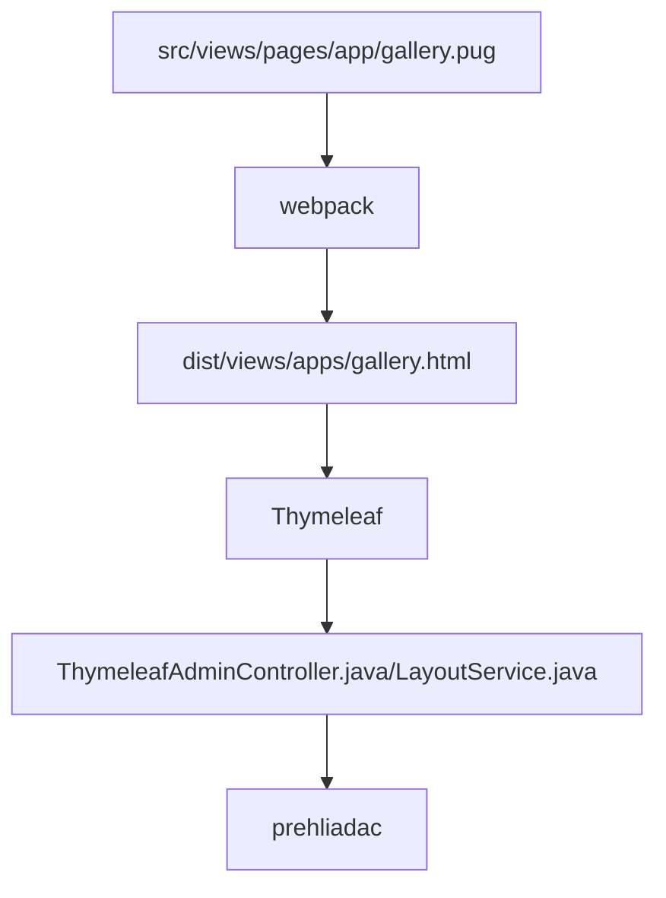

# Základní popis použitých frameworků

Použité technologie:
- [Spring REST + Spring DATA](spring.md)
- [thymeleaf.org](thymeleaf.md) - šablonovací systém napojený na Java backend
- `webpack+node` pro kompilování html/PUG/JS souborů
- datatables.net + [editor](https://editor.datatables.net) - základní práce a editace tabulkových dat, napojené na Spring přes DatatablesRestControllerV2 - příklad v [GalleryRestController.java](../../../src/main/java/sk/iway/iwcm/components/gallery/GalleryRestController.java) a [gallery.pug](../../../src/main/webapp/admin/v9/views/pages/apps/gallery.pug)
- [pugjs.org](pugjs.md) - `preprocessor` pro generování HTML kódu stránek
- [Vue.js](vue.md) - dostupné jako `window.Vue`, krátká ukázka ve [foto galerii](../../../src/main/webapp/admin/v9/views/pages/apps/gallery.pug)

Celý postup generování web stránky v `/admin/v9/` je následující:



je tedy třeba přemýšlet co se ve kterém kroku děje.

## npm

Pro build JS/CSS souborů se používá `node`, základní příkazy:
- `npm install` - nainstaluje všechny potřebné moduly
- `npm outdated` - vypíše seznam zastaralých modulů
- `npm update MODUL` - aktualizuje zadaný modul, pozor aktualizuje jen `minor` verzi, pokud jméno modulu nezadáte, aktualizuje všechny moduly
- `npm i MODUL@VERZIA` - nainstaluje/aktualizuje modul do zadané verze
- `npm audit` - vypíše seznam modulů obsahujících zranitelnost
- `npm audit fix` - aktualizuje moduly obsahující zranitelnost
- `npm list --depth=0` - vypíše seznam nainstalovaných modulů, parametrem depth lze určit hloubku vnoření
- `npm view MODUL version` - vypíše aktuální nejnovější verzi daného modulu

Pokud potřebujete aktualizovat i závislosti, můžete postupovat s využitím modulu [npm-check-updates](https://flaviocopes.com/update-npm-dependencies/):

```shell
//instalacia modulu
npm install -g npm-check-updates
//vypis verzii na aktualizaciu
ncu
//aktualizacia verzii v zavislostiach
ncu -u
//aktualizacia
npm install
```

## Události

!>**Upozornění:** v JavaScript kódu nelze využívat událost `$(document).ready`, protože nejprve musí být inicializováno úložiště překladových klíčů. Implementovali jsme vlastní funkci `window.domReady.add` v knihovně [ready](../libraries/ready-extender.md), která je provedena až po inicializaci úložiště překladových klíčů.

```javascript
window.domReady.add(function () {
    //vas kod
});

//nastavenie poradia na 10, cize typicky na koniec
window.domReady.add(function () {
    //vas kod
}, 10);
```

## Webpack

Skládání a kompilace `pug/js/css` se provádí pomocí [webpack](https://webpack.js.org/).

JS a CSS soubory se ukládají po zkompilování do `dist` složky. Z něj jsou do PUG vkládány s využitím seznamu z `htmlWebpackPlugin.files`. Ve výchozím nastavení se vkládají pouze skripty, které nezačínají na prefix `pages_`. Soubor s tímto prefixem se vloží pouze v případě, že se jeho jméno shoduje se jménem pug souboru.

```javascript
// Outpul all script files
-
    let filename = htmlWebpackPlugin.options.filename;
    var slash = filename.lastIndexOf("/");
    var dot = filename.indexOf(".", slash);
    if (slash > 0 && dot > slash) filename = filename.substring(slash+1, dot);

each js in WPF.js
    - if (js.indexOf("pages_")==-1 || js.indexOf("pages_"+filename+".")!=-1)
        script(type='text/javascript', src=js)
```

Pokud tedy potřebujete pro některou stránku v administraci vložit speciální JavaScript soubor vytvořte jej ve složce `src/main/webapp/admin/v9/src/js/pages/`, pokud předpokládáte použití více samostatných JS souborů kombinovaných do jednoho celku vytvořte si i podsložku. Příkladem je `src/main/webapp/admin/v9/src/js/pages/web-pages-list/web-pages-list.js` který je v podsložce `web-pages-list` a ve skriptu `web-pages-list.js` se importuje třída z `preview.js`.

Tento skript se vloží pouze při volání webové stránky `web-pages-list.pug`, tedy u URL adrese `/admin/v9/webpages/web-pages-list/`.

Uvedený postup lze použít pouze pro PUG soubory, jelikož skript se vkládá do vygenerovaného HTML během kompilace. Pro aplikace z `/apps` složky, které používají přímo `.html` soubory je připraveno vkládání JavaScript [souboru jako modul](../../custom-apps/admin-menu-item/README.md#přiložení-javascript-souboru) během zobrazení HTML stránky.
